# Neptune Analytics 混合图数据库适配器

<cite>
**本文档引用的文件**
- [NeptuneAnalyticsAdapter.py](file://m_flow/adapters/hybrid/neptune_analytics/NeptuneAnalyticsAdapter.py)
- [adapter.py](file://m_flow/adapters/graph/neptune_driver/adapter.py)
- [graph_db_interface.py](file://m_flow/adapters/graph/graph_db_interface.py)
- [vector_db_interface.py](file://m_flow/adapters/vector/vector_db_interface.py)
- [neptune_utils.py](file://m_flow/adapters/graph/neptune_driver/neptune_utils.py)
- [get_graph_adapter.py](file://m_flow/adapters/graph/get_graph_adapter.py)
- [neptune_analytics_example.py](file://examples/database_examples/neptune_analytics_example.py)
- [test_neptune_analytics_hybrid.py](file://m_flow/tests/test_neptune_analytics_hybrid.py)
- [test_neptune_analytics_graph.py](file://m_flow/tests/test_neptune_analytics_graph.py)
</cite>

## 目录
1. [简介](#简介)
2. [项目结构](#项目结构)
3. [核心组件](#核心组件)
4. [架构概览](#架构概览)
5. [详细组件分析](#详细组件分析)
6. [依赖关系分析](#依赖关系分析)
7. [性能考虑](#性能考虑)
8. [故障排除指南](#故障排除指南)
9. [结论](#结论)
10. [附录](#附录)

## 简介

Neptune Analytics 混合图数据库适配器是 Amazon Web Services 提供的云原生图数据库服务的完整解决方案。该适配器实现了统一的图分析和关系查询接口，支持实时图分析、复杂网络计算和大规模数据处理能力。

该适配器的核心设计理念是将图数据库的本体论特性与向量搜索能力无缝结合，通过单一接口同时支持：
- 图遍历和关系连接
- 向量化操作和语义搜索
- 实时图分析和大规模数据处理
- 复杂网络计算和社交网络分析

## 项目结构

基于代码库的组织结构，Neptune Analytics 混合适配器位于以下关键目录中：

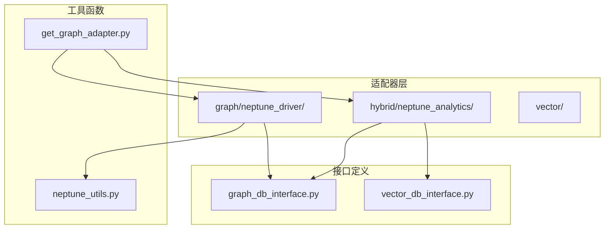

**图表来源**
- [NeptuneAnalyticsAdapter.py:1-307](file://m_flow/adapters/hybrid/neptune_analytics/NeptuneAnalyticsAdapter.py#L1-L307)
- [adapter.py:1-800](file://m_flow/adapters/graph/neptune_driver/adapter.py#L1-L800)
- [graph_db_interface.py:1-347](file://m_flow/adapters/graph/graph_db_interface.py#L1-L347)
- [vector_db_interface.py:1-180](file://m_flow/adapters/vector/vector_db_interface.py#L1-L180)

**章节来源**
- [NeptuneAnalyticsAdapter.py:1-307](file://m_flow/adapters/hybrid/neptune_analytics/NeptuneAnalyticsAdapter.py#L1-L307)
- [adapter.py:1-800](file://m_flow/adapters/graph/neptune_driver/adapter.py#L1-L800)

## 核心组件

### 混合适配器架构

Neptune Analytics 混合适配器采用继承模式，同时实现图数据库接口和向量数据库接口：

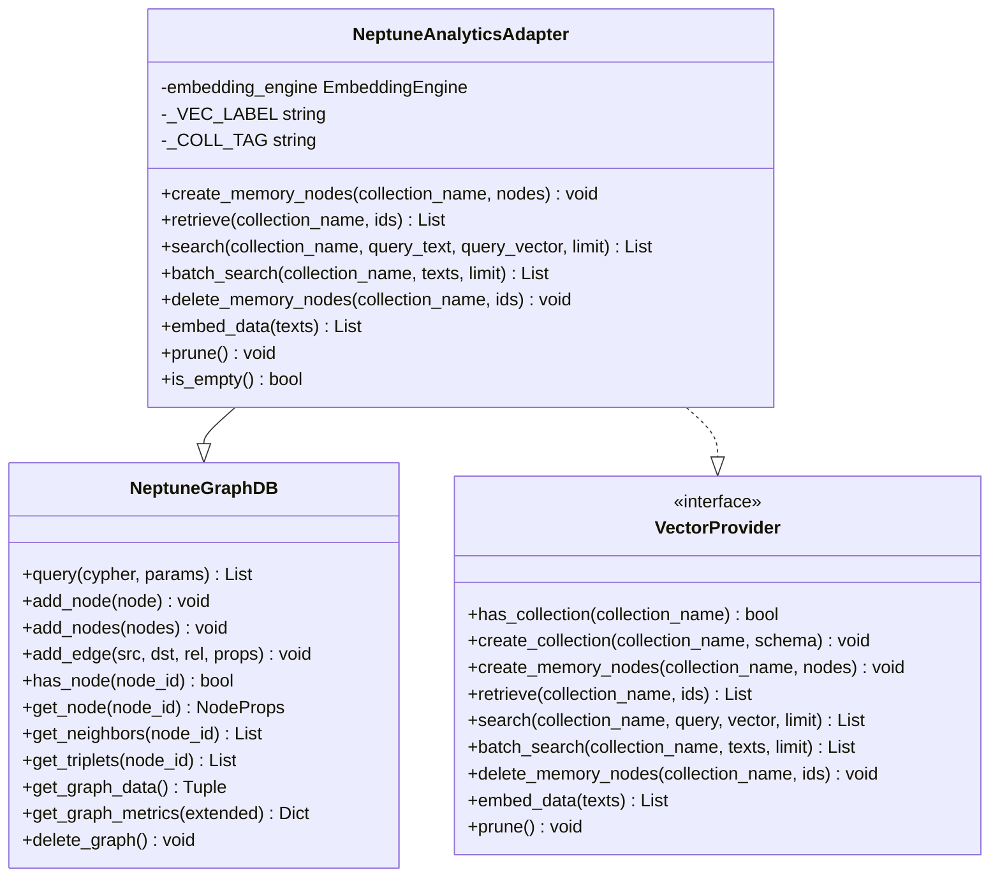

**图表来源**
- [NeptuneAnalyticsAdapter.py:38-307](file://m_flow/adapters/hybrid/neptune_analytics/NeptuneAnalyticsAdapter.py#L38-L307)
- [adapter.py:108-800](file://m_flow/adapters/graph/neptune_driver/adapter.py#L108-L800)
- [graph_db_interface.py:122-347](file://m_flow/adapters/graph/graph_db_interface.py#L122-L347)
- [vector_db_interface.py:16-180](file://m_flow/adapters/vector/vector_db_interface.py#L16-L180)

### 关键配置参数

适配器支持多种配置选项：

| 参数名称 | 类型 | 默认值 | 描述 |
|---------|------|--------|------|
| graph_id | string | 必需 | Neptune Analytics 图标识符 |
| region | string | us-east-1 | AWS 区域 |
| aws_access_key_id | string | None | AWS 访问密钥ID |
| aws_secret_access_key | string | None | AWS 秘密访问密钥 |
| aws_session_token | string | None | 临时凭证令牌 |

**章节来源**
- [NeptuneAnalyticsAdapter.py:48-75](file://m_flow/adapters/hybrid/neptune_analytics/NeptuneAnalyticsAdapter.py#L48-L75)
- [neptune_utils.py:76-113](file://m_flow/adapters/graph/neptune_driver/neptune_utils.py#L76-L113)

## 架构概览

### 统一查询接口设计

Neptune Analytics 混合适配器实现了统一的查询接口，支持图分析和向量搜索的协同工作：

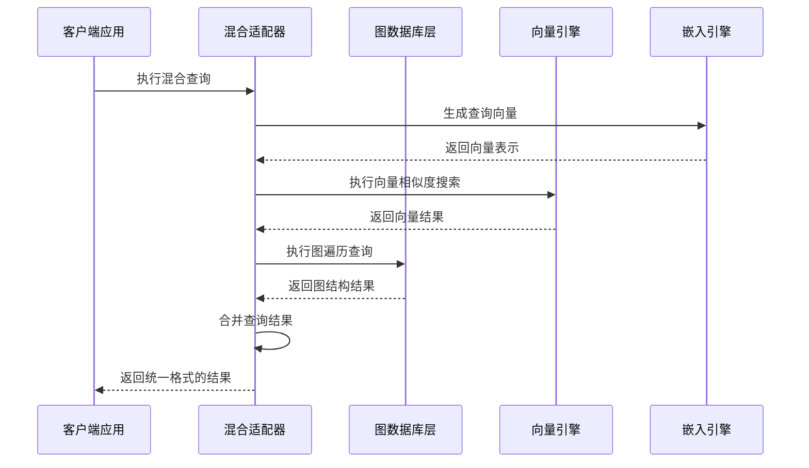

**图表来源**
- [NeptuneAnalyticsAdapter.py:167-240](file://m_flow/adapters/hybrid/neptune_analytics/NeptuneAnalyticsAdapter.py#L167-L240)
- [adapter.py:216-243](file://m_flow/adapters/graph/neptune_driver/adapter.py#L216-L243)

### 数据流架构

系统采用分层数据流架构，确保图数据和向量数据的一致性：

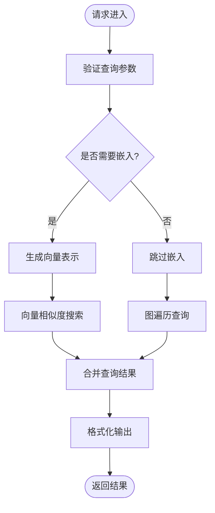

**图表来源**
- [NeptuneAnalyticsAdapter.py:186-226](file://m_flow/adapters/hybrid/neptune_analytics/NeptuneAnalyticsAdapter.py#L186-L226)

## 详细组件分析

### 图数据库层实现

图数据库层基于 Neptune Analytics 的 openCypher 查询语言，提供了完整的图操作功能：

#### 节点操作流程

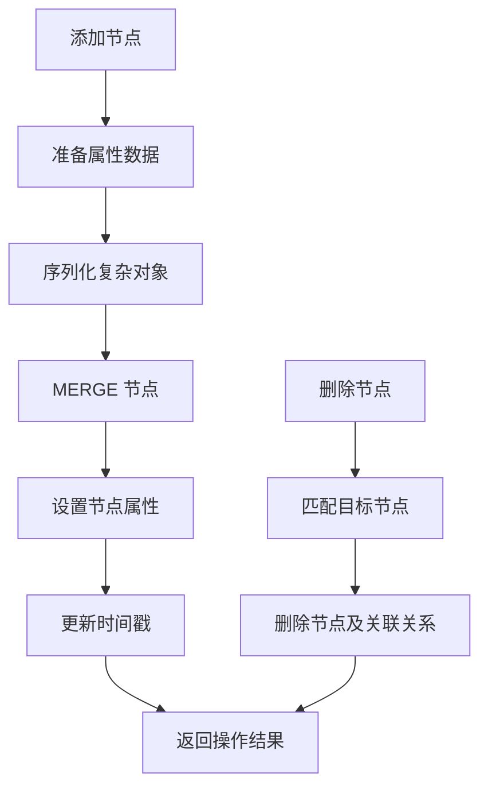

**图表来源**
- [adapter.py:263-280](file://m_flow/adapters/graph/neptune_driver/adapter.py#L263-L280)
- [adapter.py:316-331](file://m_flow/adapters/graph/neptune_driver/adapter.py#L316-L331)

#### 边操作实现

边操作支持批量插入和智能回退机制：

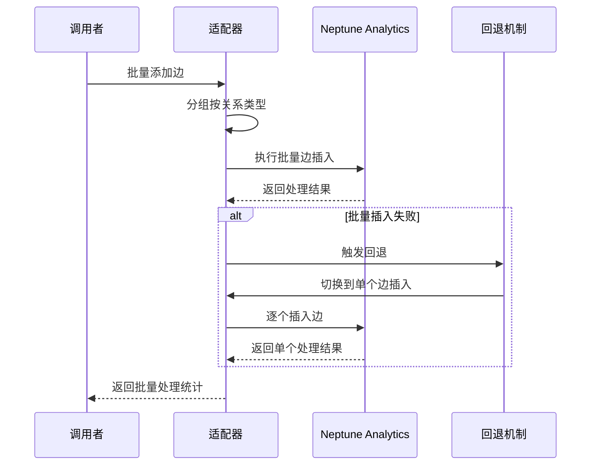

**图表来源**
- [adapter.py:486-536](file://m_flow/adapters/graph/neptune_driver/adapter.py#L486-L536)

**章节来源**
- [adapter.py:248-536](file://m_flow/adapters/graph/neptune_driver/adapter.py#L248-L536)

### 向量搜索实现

向量搜索模块实现了高效的相似度计算和批量处理：

#### 向量搜索流程

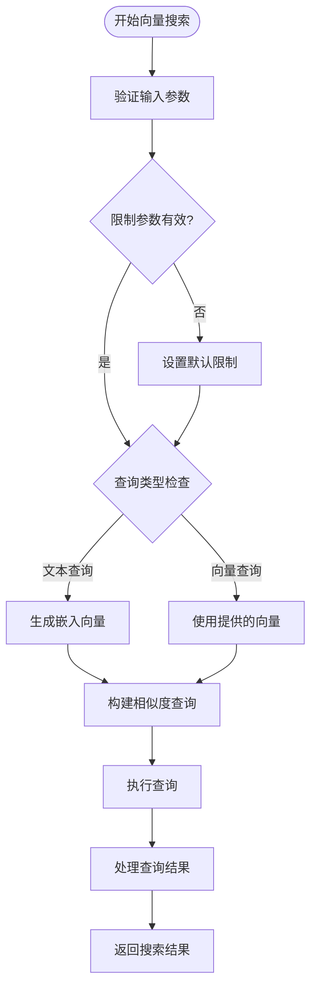

**图表来源**
- [NeptuneAnalyticsAdapter.py:167-226](file://m_flow/adapters/hybrid/neptune_analytics/NeptuneAnalyticsAdapter.py#L167-L226)

#### 批量搜索优化

批量搜索功能通过异步并发处理提升性能：

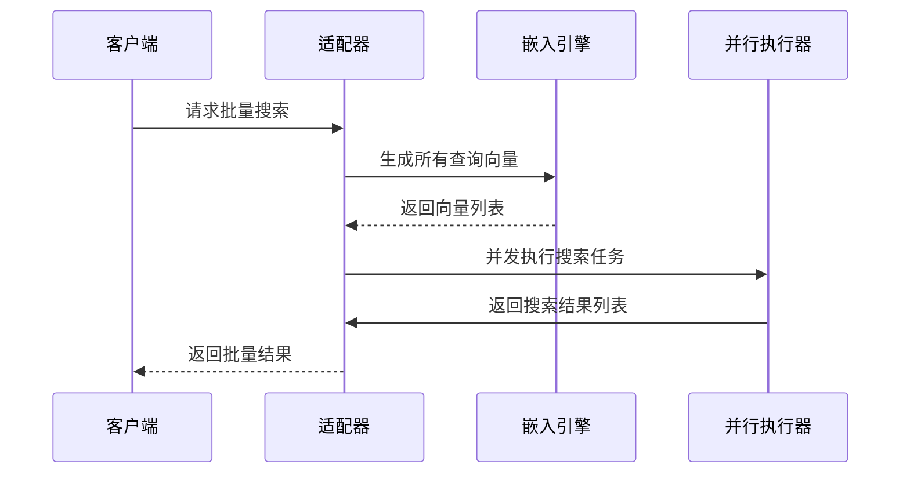

**图表来源**
- [NeptuneAnalyticsAdapter.py:228-239](file://m_flow/adapters/hybrid/neptune_analytics/NeptuneAnalyticsAdapter.py#L228-L239)

**章节来源**
- [NeptuneAnalyticsAdapter.py:167-240](file://m_flow/adapters/hybrid/neptune_analytics/NeptuneAnalyticsAdapter.py#L167-L240)

### 错误处理和重试机制

系统实现了完善的错误处理和重试机制：

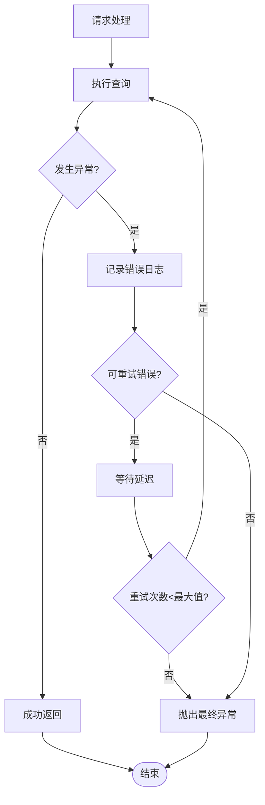

**图表来源**
- [adapter.py:230-243](file://m_flow/adapters/graph/neptune_driver/adapter.py#L230-L243)
- [neptune_utils.py:121-137](file://m_flow/adapters/graph/neptune_driver/neptune_utils.py#L121-L137)

**章节来源**
- [adapter.py:216-243](file://m_flow/adapters/graph/neptune_driver/adapter.py#L216-L243)
- [neptune_utils.py:121-137](file://m_flow/adapters/graph/neptune_driver/neptune_utils.py#L121-L137)

## 依赖关系分析

### 组件依赖图

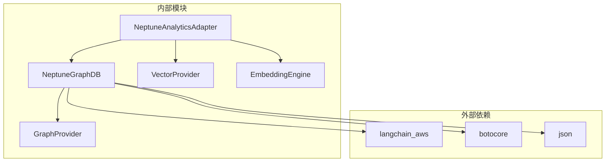

**图表来源**
- [NeptuneAnalyticsAdapter.py:15-21](file://m_flow/adapters/hybrid/neptune_analytics/NeptuneAnalyticsAdapter.py#L15-L21)
- [adapter.py:52-58](file://m_flow/adapters/graph/neptune_driver/adapter.py#L52-L58)

### 接口契约

适配器严格遵循抽象接口定义：

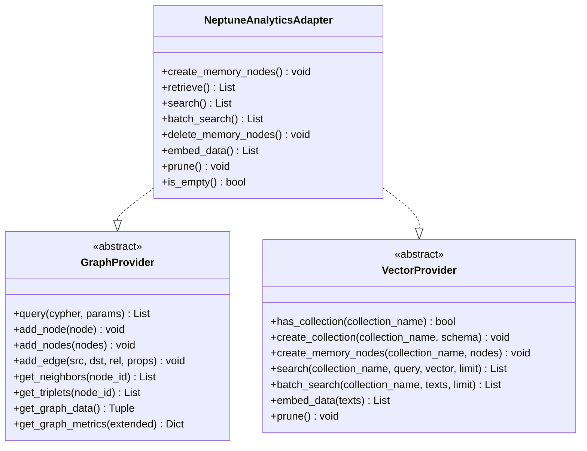

**图表来源**
- [graph_db_interface.py:122-347](file://m_flow/adapters/graph/graph_db_interface.py#L122-L347)
- [vector_db_interface.py:16-180](file://m_flow/adapters/vector/vector_db_interface.py#L16-L180)
- [NeptuneAnalyticsAdapter.py:38-43](file://m_flow/adapters/hybrid/neptune_analytics/NeptuneAnalyticsAdapter.py#L38-L43)

**章节来源**
- [graph_db_interface.py:122-347](file://m_flow/adapters/graph/graph_db_interface.py#L122-L347)
- [vector_db_interface.py:16-180](file://m_flow/adapters/vector/vector_db_interface.py#L16-L180)

## 性能考虑

### 查询优化策略

系统实现了多层查询优化机制：

1. **批量操作优化**
   - 节点和边的批量插入使用 UNWIND 语法
   - 自动分组按关系类型优化查询
   - 智能回退机制确保数据完整性

2. **向量搜索优化**
   - 限制参数验证和默认值设置
   - 异步并发批量处理
   - 向量索引和过滤优化

3. **缓存和连接管理**
   - LRU 缓存适配器实例
   - 懒加载 Neptune 客户端
   - 连接池和重用机制

### 资源使用统计

系统提供详细的性能监控指标：

| 指标类别 | 监控点 | 用途 |
|---------|--------|------|
| 查询性能 | 执行时间、响应大小 | 查询优化 |
| 资源使用 | CPU、内存、网络 | 资源规划 |
| 错误率 | 异常类型、重试次数 | 系统稳定性 |
| 吞吐量 | QPS、并发数 | 扩展性评估 |

**章节来源**
- [adapter.py:486-536](file://m_flow/adapters/graph/neptune_driver/adapter.py#L486-L536)
- [NeptuneAnalyticsAdapter.py:228-239](file://m_flow/adapters/hybrid/neptune_analytics/NeptuneAnalyticsAdapter.py#L228-L239)

## 故障排除指南

### 常见问题诊断

#### 连接问题
- **症状**: 初始化失败或连接超时
- **原因**: 凭证配置错误、网络问题
- **解决方案**: 验证 AWS 凭证、检查网络连通性

#### 查询错误
- **症状**: 查询执行失败
- **原因**: 语法错误、权限不足
- **解决方案**: 检查 Cypher 语法、验证 IAM 权限

#### 性能问题
- **症状**: 查询响应缓慢
- **原因**: 数据量过大、索引缺失
- **解决方案**: 优化查询、添加适当索引

### 日志和调试

系统提供了详细的日志记录机制：

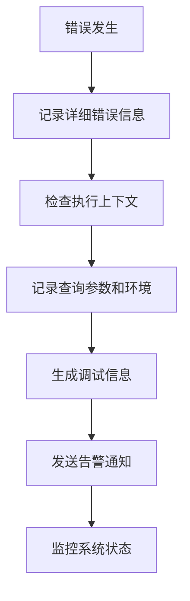

**图表来源**
- [adapter.py:230-243](file://m_flow/adapters/graph/neptune_driver/adapter.py#L230-L243)
- [NeptuneAnalyticsAdapter.py:290-292](file://m_flow/adapters/hybrid/neptune_analytics/NeptuneAnalyticsAdapter.py#L290-L292)

**章节来源**
- [adapter.py:230-243](file://m_flow/adapters/graph/neptune_driver/adapter.py#L230-L243)
- [neptune_utils.py:121-137](file://m_flow/adapters/graph/neptune_driver/neptune_utils.py#L121-L137)

## 结论

Neptune Analytics 混合图数据库适配器提供了一个强大而灵活的解决方案，实现了图分析和向量搜索的统一接口。其主要优势包括：

1. **统一接口设计**: 通过单一适配器同时支持图操作和向量搜索
2. **高性能实现**: 优化的批量操作和异步处理机制
3. **可靠性保障**: 完善的错误处理和重试机制
4. **扩展性**: 支持大规模数据处理和复杂网络计算
5. **易用性**: 简化的配置和使用接口

该适配器特别适合需要实时图分析、复杂网络计算和大规模数据处理的应用场景。

## 附录

### 配置示例

基础配置示例展示了如何设置 Neptune Analytics 作为图数据库和向量数据库：

```python
# 设置图数据库配置
m_flow.config.set_graph_db_config({
    "graph_database_provider": "neptune_analytics",
    "graph_database_url": "neptune-graph://<GRAPH_ID>",
})

# 设置向量数据库配置  
m_flow.config.set_vector_db_config({
    "vector_db_provider": "neptune_analytics", 
    "vector_db_url": "neptune-graph://<GRAPH_ID>",
})
```

### 使用示例

完整的使用示例展示了混合适配器的基本操作流程：

```python
# 创建适配器实例
adapter = NeptuneAnalyticsAdapter(graph_id, embedding_engine)

# 执行混合查询
results = await adapter.search(
    collection_name="documents",
    query_text="Neptune Analytics features",
    limit=10
)
```

**章节来源**
- [neptune_analytics_example.py:17-46](file://examples/database_examples/neptune_analytics_example.py#L17-L46)
- [test_neptune_analytics_hybrid.py:83-128](file://m_flow/tests/test_neptune_analytics_hybrid.py#L83-L128)