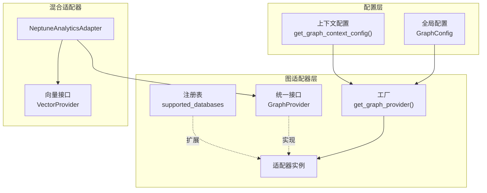
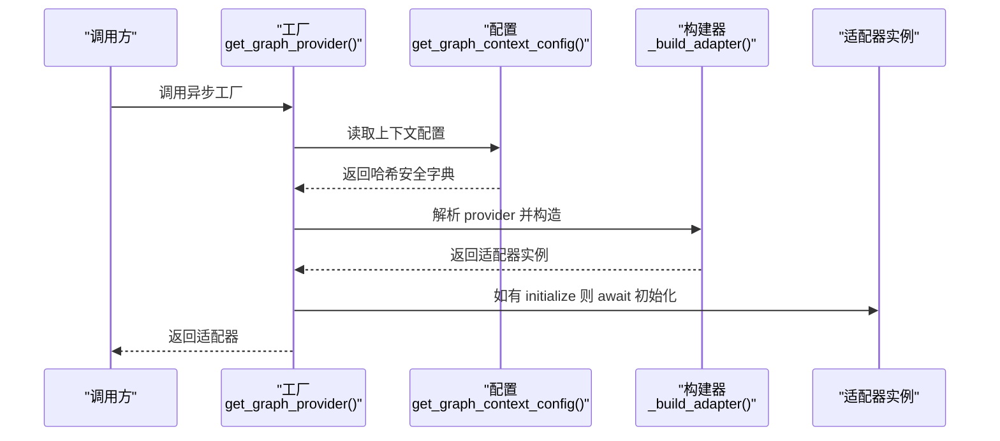
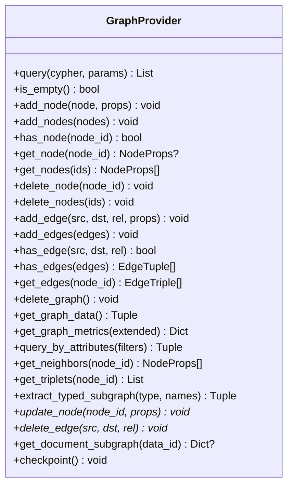
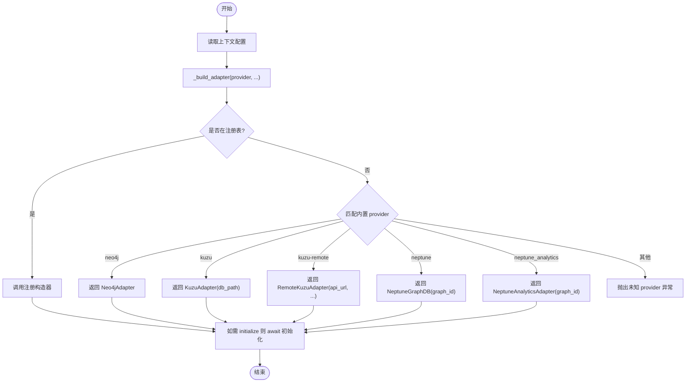
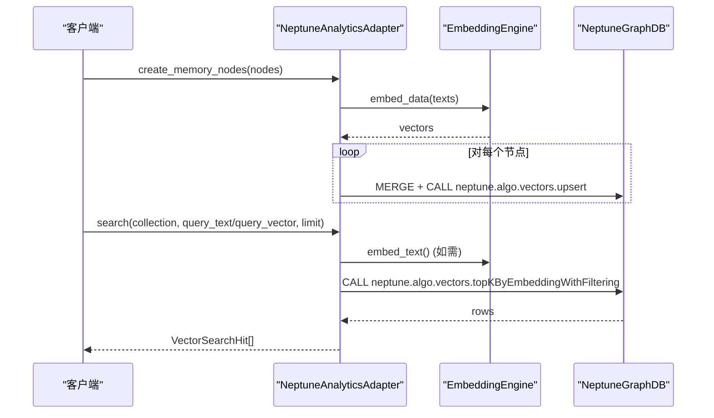
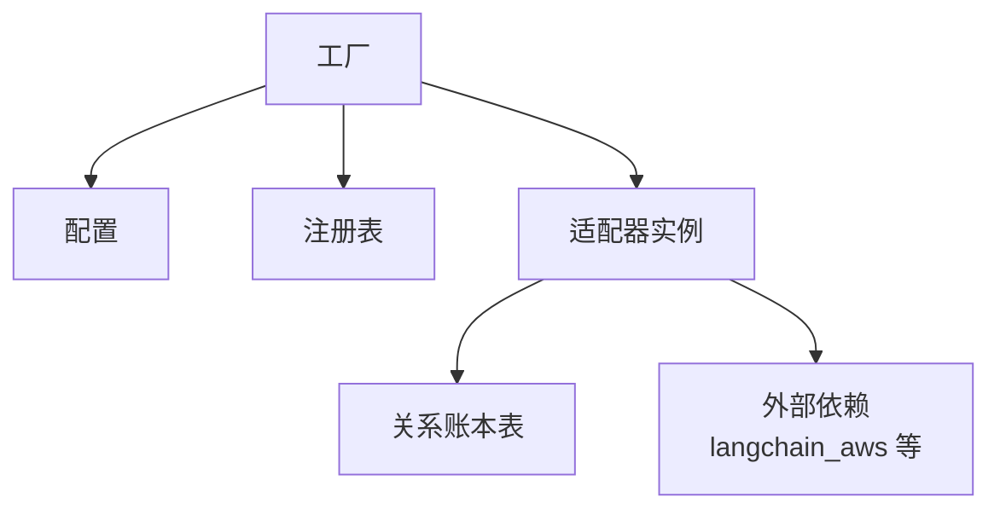

# 图数据库适配器

<cite>
**本文引用的文件**
- [m_flow/adapters/graph/__init__.py](file://m_flow/adapters/graph/__init__.py)
- [m_flow/adapters/graph/get_graph_adapter.py](file://m_flow/adapters/graph/get_graph_adapter.py)
- [m_flow/adapters/graph/graph_db_interface.py](file://m_flow/adapters/graph/graph_db_interface.py)
- [m_flow/adapters/graph/supported_databases.py](file://m_flow/adapters/graph/supported_databases.py)
- [m_flow/adapters/graph/use_graph_adapter.py](file://m_flow/adapters/graph/use_graph_adapter.py)
- [m_flow/adapters/graph/config.py](file://m_flow/adapters/graph/config.py)
- [m_flow/adapters/hybrid/neptune_analytics/NeptuneAnalyticsAdapter.py](file://m_flow/adapters/hybrid/neptune_analytics/NeptuneAnalyticsAdapter.py)
</cite>

## 目录
1. [简介](#简介)
2. [项目结构](#项目结构)
3. [核心组件](#核心组件)
4. [架构总览](#架构总览)
5. [详细组件分析](#详细组件分析)
6. [依赖分析](#依赖分析)
7. [性能考量](#性能考量)
8. [故障排查指南](#故障排查指南)
9. [结论](#结论)
10. [附录](#附录)

## 简介
本文件系统化阐述图数据库适配器的设计与实现，重点覆盖以下方面：
- 适配器模式与统一接口：通过抽象接口屏蔽不同图数据库后端差异，提供一致的节点/边 CRUD、查询与统计能力。
- 多后端支持：当前支持 Neo4j、Kùzu（本地/远程）、Amazon Neptune、Amazon Neptune Analytics，并可通过注册表扩展。
- 具体实现要点：Neo4j 适配器（连接管理、Cypher 执行、事务与错误恢复）、Neptune Analytics 混合适配器（图+向量一体化）、Kùzu 本地图数据库适配器（内存与查询优化）。
- 配置参数详解：连接字符串、认证方式、超时与重试策略等。
- 性能与扩展性：不同后端的性能特征、扩展性考虑与最佳实践。
- 选型与迁移：基于场景的图数据库选择指南与迁移策略。

## 项目结构
图数据库适配器位于 m_flow/adapters/graph 下，采用“工厂 + 接口 + 注册表”的分层设计：
- 工厂与入口：通过工厂函数解析配置并返回具体适配器实例；同时提供上下文感知的配置读取。
- 统一接口：定义 GraphProvider 抽象接口，约束所有适配器必须实现的方法集合。
- 注册表：支持动态注册第三方适配器，扩展新后端。
- 混合适配器：Neptune Analytics 同时实现图接口与向量接口，提供图+向量一体化能力。

图表来源
- [m_flow/adapters/graph/get_graph_adapter.py:22-35](file://m_flow/adapters/graph/get_graph_adapter.py#L22-L35)
- [m_flow/adapters/graph/graph_db_interface.py:122-346](file://m_flow/adapters/graph/graph_db_interface.py#L122-L346)
- [m_flow/adapters/graph/supported_databases.py:7-7](file://m_flow/adapters/graph/supported_databases.py#L7-L7)
- [m_flow/adapters/graph/config.py:109-127](file://m_flow/adapters/graph/config.py#L109-L127)
- [m_flow/adapters/hybrid/neptune_analytics/NeptuneAnalyticsAdapter.py:38-74](file://m_flow/adapters/hybrid/neptune_analytics/NeptuneAnalyticsAdapter.py#L38-L74)

章节来源
- [m_flow/adapters/graph/__init__.py:1-4](file://m_flow/adapters/graph/__init__.py#L1-L4)
- [m_flow/adapters/graph/get_graph_adapter.py:22-131](file://m_flow/adapters/graph/get_graph_adapter.py#L22-L131)
- [m_flow/adapters/graph/graph_db_interface.py:122-346](file://m_flow/adapters/graph/graph_db_interface.py#L122-L346)
- [m_flow/adapters/graph/supported_databases.py:7-7](file://m_flow/adapters/graph/supported_databases.py#L7-L7)
- [m_flow/adapters/graph/use_graph_adapter.py:10-12](file://m_flow/adapters/graph/use_graph_adapter.py#L10-L12)
- [m_flow/adapters/graph/config.py:109-127](file://m_flow/adapters/graph/config.py#L109-L127)

## 核心组件
- 工厂与入口
  - 异步工厂：根据上下文配置解析并初始化适配器，必要时调用 initialize() 完成异步初始化。
  - 构建器缓存：对构建器进行 LRU 缓存，减少重复初始化开销。
  - 内置与扩展：内置支持 Neo4j、Kùzu（本地/远程）、Neptune、Neptune Analytics；通过注册表支持自定义扩展。
- 统一接口 GraphProvider
  - 查询与统计：query()、is_empty()、get_graph_metrics()、query_by_attributes()。
  - 节点操作：add_node/add_nodes、has_node、get_node/get_nodes、delete_node/delete_nodes。
  - 边操作：add_edge/add_edges、has_edge、has_edges、get_edges。
  - 图级操作：delete_graph、get_graph_data、extract_typed_subgraph。
  - 便利方法：update_node（默认回退到读改写）、delete_edge（默认未实现）、get_document_subgraph（部分后端已实现）、checkpoint（WAL 持久化）。
  - 变更追踪：装饰器 record_graph_changes 将节点/边变更写入关系账本表，便于审计与溯源。
- 配置模型 GraphConfig
  - 字段覆盖：提供统一的图数据库参数（提供方、URL、名称、用户名、密码、端口、密钥、文件路径、文件名、模型类型、数据集处理器）。
  - 路径解析：自动解析绝对存储路径，确保文件系统访问一致性。
  - 上下文优先：在并发管线执行中，任务可携带独立的图数据库配置覆盖项。
- 注册表与扩展
  - supported_databases：键为适配器别名，值为构造器；use_graph_adapter(name, adapter) 支持注册自定义适配器。

章节来源
- [m_flow/adapters/graph/get_graph_adapter.py:22-131](file://m_flow/adapters/graph/get_graph_adapter.py#L22-L131)
- [m_flow/adapters/graph/graph_db_interface.py:122-346](file://m_flow/adapters/graph/graph_db_interface.py#L122-L346)
- [m_flow/adapters/graph/config.py:29-106](file://m_flow/adapters/graph/config.py#L29-L106)
- [m_flow/adapters/graph/supported_databases.py:7-7](file://m_flow/adapters/graph/supported_databases.py#L7-L7)
- [m_flow/adapters/graph/use_graph_adapter.py:10-12](file://m_flow/adapters/graph/use_graph_adapter.py#L10-L12)

## 架构总览
适配器架构遵循“工厂 + 接口 + 注册表”模式，配合配置中心与上下文覆盖，形成高内聚、低耦合的可扩展体系。

图表来源
- [m_flow/adapters/graph/get_graph_adapter.py:22-35](file://m_flow/adapters/graph/get_graph_adapter.py#L22-L35)
- [m_flow/adapters/graph/get_graph_adapter.py:44-131](file://m_flow/adapters/graph/get_graph_adapter.py#L44-L131)
- [m_flow/adapters/graph/config.py:115-127](file://m_flow/adapters/graph/config.py#L115-L127)

## 详细组件分析

### 统一接口 GraphProvider 设计
GraphProvider 定义了图数据库的最小可用契约，确保上层业务逻辑与底层实现解耦。其关键设计要点：
- 方法分层：查询/统计、节点 CRUD、边 CRUD、图级操作、遍历辅助、扩展 CRUD 与持久化。
- 默认行为：update_node/delete_edge/get_document_subgraph 为默认未实现，鼓励后端提供原生高效实现。
- 变更追踪：通过装饰器将节点/边变更记录到关系账本，便于审计与溯源。
- WAL 持久化：checkpoint 提供显式持久化触发点，适用于需要强一致性的场景。

图表来源
- [m_flow/adapters/graph/graph_db_interface.py:122-346](file://m_flow/adapters/graph/graph_db_interface.py#L122-L346)

章节来源
- [m_flow/adapters/graph/graph_db_interface.py:122-346](file://m_flow/adapters/graph/graph_db_interface.py#L122-L346)

### 工厂与构建器：多后端适配
工厂负责解析配置并返回对应适配器实例，内置支持 Neo4j、Kùzu（本地/远程）、Neptune、Neptune Analytics，并通过注册表支持扩展。构建器内部包含：
- 参数校验：缺失必填参数时抛出环境异常。
- 前缀校验：对 Neptune/Analytics 的 URL 进行前缀校验，防止误配置。
- 依赖检查：Neptune/Analytics 需要 langchain_aws 依赖。
- 缓存策略：LRU 缓存构建器，避免重复初始化。

图表来源
- [m_flow/adapters/graph/get_graph_adapter.py:22-131](file://m_flow/adapters/graph/get_graph_adapter.py#L22-L131)

章节来源
- [m_flow/adapters/graph/get_graph_adapter.py:22-131](file://m_flow/adapters/graph/get_graph_adapter.py#L22-L131)

### Neo4j 适配器（概念性实现说明）
- 连接管理：通过工厂传入的 URL、用户名、密码、数据库名建立连接；初始化阶段可执行异步初始化。
- Cypher 查询：query() 接受 Cypher 语句与参数，返回结果列表。
- 事务处理：建议在上层业务中使用事务包装多次写操作，保证原子性；若后端支持，可在适配器层封装事务 API。
- 错误恢复：捕获查询异常并进行日志记录与重试策略（由上层或具体实现决定），确保失败可诊断、可恢复。

[本节为概念性说明，不直接分析具体源码文件]

### Amazon Neptune 适配器（概念性实现说明）
- Gremlin 查询：通过 Gremlin 语言进行图遍历与分析；工厂对 URL 前缀进行校验以确保正确端点。
- IAM 认证：依赖 langchain_aws，通常通过 AWS 凭证链进行认证；在云环境中推荐使用 IAM 角色与最小权限原则。
- 大规模图数据：适合超大规模图数据的存储与查询，具备良好的水平扩展能力；注意查询复杂度与索引策略。

[本节为概念性说明，不直接分析具体源码文件]

### KùzuDB 本地图数据库适配器（概念性实现说明）
- 内存管理：作为嵌入式数据库，Kùzu 在内存中维护图结构；checkpoint() 提供显式持久化触发点，保障异常断电后的数据一致性。
- 查询优化：建议利用标签与属性索引提升查询效率；批量写入时采用事务或批处理策略降低开销。
- 适用场景：适合中小规模知识图谱与推理场景，对延迟敏感且数据体量可控。

[本节为概念性说明，不直接分析具体源码文件]

### 混合图数据库适配器（Neptune Analytics）
NeptuneAnalyticsAdapter 同时实现图接口与向量接口，提供“图 + 向量”的一体化能力：
- 继承关系：继承自 NeptuneGraphDB，复用图能力；同时实现 VectorProvider，提供向量检索。
- 向量存储：每个节点作为向量索引单元，无需单独集合；通过标签区分集合。
- 检索流程：embed_data() 生成向量；search()/batch_search() 使用 neptune.algo.vectors.topKByEmbeddingWithFiltering 执行相似度检索；retrieve() 按 ID 获取节点。
- 限制与提示：支持 topK 限制（默认上限为 10），where_filter 不生效；with_vector 可能影响性能。

图表来源
- [m_flow/adapters/hybrid/neptune_analytics/NeptuneAnalyticsAdapter.py:103-152](file://m_flow/adapters/hybrid/neptune_analytics/NeptuneAnalyticsAdapter.py#L103-L152)
- [m_flow/adapters/hybrid/neptune_analytics/NeptuneAnalyticsAdapter.py:167-226](file://m_flow/adapters/hybrid/neptune_analytics/NeptuneAnalyticsAdapter.py#L167-L226)

章节来源
- [m_flow/adapters/hybrid/neptune_analytics/NeptuneAnalyticsAdapter.py:38-306](file://m_flow/adapters/hybrid/neptune_analytics/NeptuneAnalyticsAdapter.py#L38-L306)

## 依赖分析
- 组件内聚与耦合
  - 工厂与构建器：仅依赖配置与注册表，耦合度低，易于扩展新后端。
  - 统一接口：面向抽象编程，上层业务仅依赖接口，降低对具体实现的耦合。
  - 变更追踪：通过装饰器与关系账本表实现跨模块的变更记录，保持职责单一。
- 外部依赖
  - Neptune/Analytics：需要 langchain_aws 依赖；URL 前缀校验确保端点正确性。
  - 配置系统：基于 pydantic-settings，支持环境变量与 .env 文件；提供上下文覆盖能力。

图表来源
- [m_flow/adapters/graph/get_graph_adapter.py:13-15](file://m_flow/adapters/graph/get_graph_adapter.py#L13-L15)
- [m_flow/adapters/graph/graph_db_interface.py:41-42](file://m_flow/adapters/graph/graph_db_interface.py#L41-L42)

章节来源
- [m_flow/adapters/graph/get_graph_adapter.py:13-15](file://m_flow/adapters/graph/get_graph_adapter.py#L13-L15)
- [m_flow/adapters/graph/graph_db_interface.py:41-42](file://m_flow/adapters/graph/graph_db_interface.py#L41-L42)

## 性能考量
- Neo4j
  - 适合中大型图谱与复杂关系查询；建议使用索引与参数化查询，避免 N+1 查询。
  - 事务批处理写入，减少网络往返；合理设置连接池大小与超时。
- Amazon Neptune
  - 适合超大规模图数据；Gremlin 查询需关注遍历深度与过滤条件，避免全图扫描。
  - IAM 凭证链与 VPC 网络优化可降低延迟。
- KùzuDB
  - 嵌入式内存数据库，延迟低；checkpoint() 用于强制持久化，写入后立即生效。
  - 批量导入与标签索引可显著提升吞吐。
- Neptune Analytics
  - 图与向量一体化，检索性能取决于向量维度与 topK 设置；with_vector 会增加返回数据量，谨慎开启。
  - 批量检索使用 asyncio.gather 并行执行，提高吞吐。

[本节提供通用指导，不直接分析具体源码文件]

## 故障排查指南
- 常见异常与定位
  - 未知 provider：检查 GRAPH_DATABASE_PROVIDER 是否在内置列表或注册表中。
  - 缺失必填参数：确认 URL、用户名、密码、数据库名等参数是否完整。
  - URL 前缀不匹配：Neptune/Analytics 的 URL 必须以指定前缀开头。
  - 缺少 langchain_aws：安装 langchain_aws 依赖后重试。
- 日志与错误处理
  - 混合适配器在查询失败时记录错误与查询语句，便于快速定位问题。
  - 建议在上层业务中增加重试与熔断策略，结合指数退避降低抖动。
- 变更追踪
  - 若发现节点/边变更未记录，检查 record_graph_changes 装饰器是否生效，以及关系账本表写入是否成功。

章节来源
- [m_flow/adapters/graph/get_graph_adapter.py:139-155](file://m_flow/adapters/graph/get_graph_adapter.py#L139-L155)
- [m_flow/adapters/hybrid/neptune_analytics/NeptuneAnalyticsAdapter.py:290-292](file://m_flow/adapters/hybrid/neptune_analytics/NeptuneAnalyticsAdapter.py#L290-L292)

## 结论
该图数据库适配器体系通过统一接口与工厂模式实现了对多后端的无缝支持，并通过注册表与上下文配置提供了良好的扩展性与灵活性。Neptune Analytics 的混合适配器进一步将图与向量能力融合，满足现代知识图谱与检索增强应用的需求。针对不同场景，应结合性能、扩展性与运维成本进行选型，并在迁移过程中采用渐进式策略与充分测试。

[本节为总结性内容，不直接分析具体源码文件]

## 附录

### 适配器配置参数详解
- 统一配置模型 GraphConfig
  - 关键字段：提供方、URL、数据库名、用户名、密码、端口、密钥、文件路径、文件名、模型类型、数据集处理器。
  - 路径解析：自动解析为绝对路径，确保跨平台一致性。
  - 上下文覆盖：并发管线中可为单个任务提供独立配置覆盖项。
- 工厂参数映射
  - 传递给构建器的关键参数：provider、URL、用户名、密码、数据库名、文件路径等。
  - 构建器内部对参数进行校验与前缀验证，未知 provider 或缺失参数将抛出异常。

章节来源
- [m_flow/adapters/graph/config.py:29-106](file://m_flow/adapters/graph/config.py#L29-L106)
- [m_flow/adapters/graph/config.py:115-127](file://m_flow/adapters/graph/config.py#L115-L127)
- [m_flow/adapters/graph/get_graph_adapter.py:44-73](file://m_flow/adapters/graph/get_graph_adapter.py#L44-L73)

### 适配器选择指南与迁移策略
- 选择指南
  - 小中型图谱与低延迟：KùzuDB 本地嵌入式方案。
  - 企业级图数据库：Neo4j，生态完善、工具丰富。
  - 大规模图与云原生：Amazon Neptune，具备良好扩展性。
  - 图+向量一体化检索：Amazon Neptune Analytics，统一平台兼顾图与向量。
- 迁移策略
  - 渐进式迁移：先在隔离环境中验证数据与查询一致性，再逐步切换流量。
  - 数据对齐：统一节点/边属性命名与索引策略，确保查询语义一致。
  - 测试与压测：在目标后端执行端到端测试与容量压测，评估性能与稳定性。

[本节为通用指导，不直接分析具体源码文件]