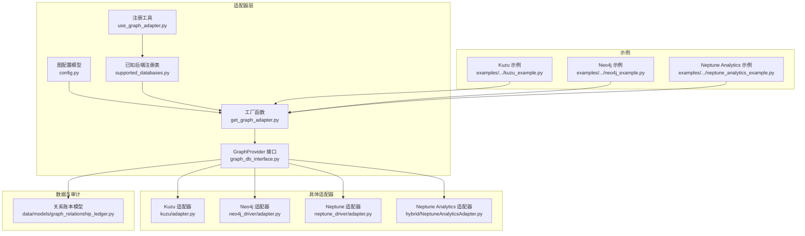
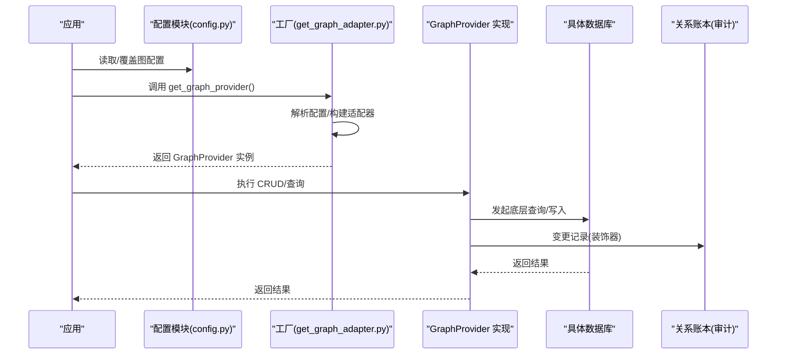
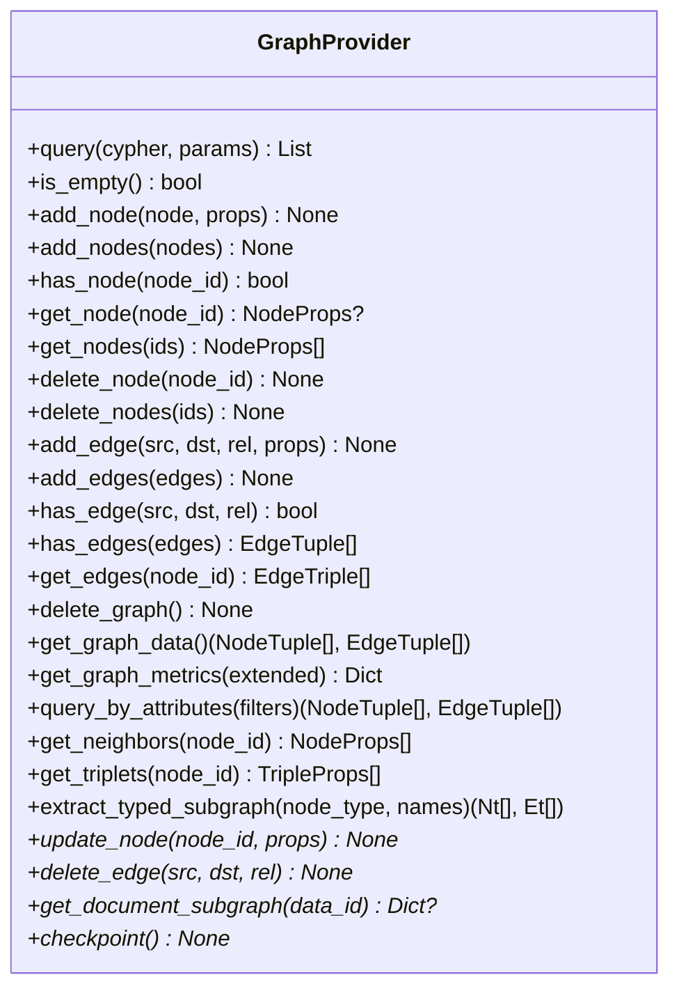
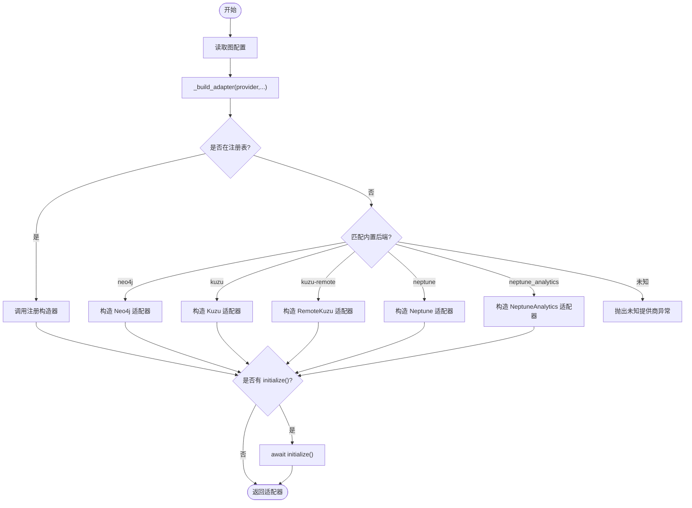
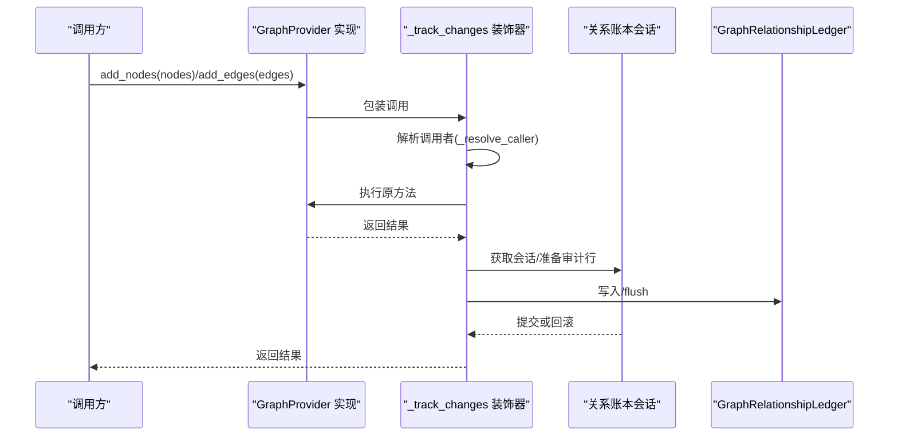
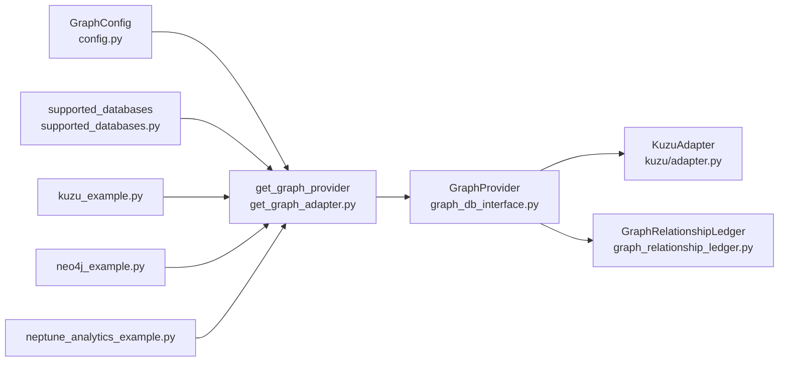

# 适配器接口设计和通用功能

<cite>
**本文引用的文件**
- [graph_db_interface.py](file://m_flow/adapters/graph/graph_db_interface.py)
- [get_graph_adapter.py](file://m_flow/adapters/graph/get_graph_adapter.py)
- [use_graph_adapter.py](file://m_flow/adapters/graph/use_graph_adapter.py)
- [supported_databases.py](file://m_flow/adapters/graph/supported_databases.py)
- [config.py](file://m_flow/adapters/graph/config.py)
- [graph_relationship_ledger.py](file://m_flow/data/models/graph_relationship_ledger.py)
- [adapter.py](file://m_flow/adapters/graph/kuzu/adapter.py)
- [kuzu_example.py](file://examples/database_examples/kuzu_example.py)
- [neo4j_example.py](file://examples/database_examples/neo4j_example.py)
- [neptune_analytics_example.py](file://examples/database_examples/neptune_analytics_example.py)
</cite>

## 目录
1. [引言](#引言)
2. [项目结构](#项目结构)
3. [核心组件](#核心组件)
4. [架构总览](#架构总览)
5. [详细组件分析](#详细组件分析)
6. [依赖分析](#依赖分析)
7. [性能考量](#性能考量)
8. [故障排查指南](#故障排查指南)
9. [结论](#结论)
10. [附录](#附录)

## 引言
本文件面向图数据库适配器的接口设计与通用功能，系统化阐述 GraphProvider 抽象基类的设计理念、类型系统与契约约束；详述适配器注册与发现机制（数据库类型枚举、工厂模式与动态扩展）；给出通用 CRUD 的实现规范（节点与边操作约定、批量处理与事务边界）；介绍关系账本跟踪机制（变更记录、调用者识别与审计日志）；记录图级操作标准（导出、属性过滤查询、子图提取）；提供适配器配置管理方案（连接参数校验、默认值与环境变量）；涵盖生命周期管理（初始化顺序、资源清理与错误恢复）；并给出自定义适配器开发指南与适配器间差异对比。

## 项目结构
围绕“图数据库适配器”主题，核心代码位于 m_flow/adapters/graph 下，配合配置模块、工厂与注册工具、以及审计表模型共同构成可插拔的图存储后端体系。示例目录提供了不同后端的使用范式。

图表来源
- [graph_db_interface.py:122-347](file://m_flow/adapters/graph/graph_db_interface.py#L122-L347)
- [get_graph_adapter.py:22-131](file://m_flow/adapters/graph/get_graph_adapter.py#L22-L131)
- [use_graph_adapter.py:10-12](file://m_flow/adapters/graph/use_graph_adapter.py#L10-L12)
- [supported_databases.py:7-7](file://m_flow/adapters/graph/supported_databases.py#L7-L7)
- [config.py:29-127](file://m_flow/adapters/graph/config.py#L29-L127)
- [graph_relationship_ledger.py:23-74](file://m_flow/data/models/graph_relationship_ledger.py#L23-L74)
- [adapter.py:144-176](file://m_flow/adapters/graph/kuzu/adapter.py#L144-L176)

章节来源
- [graph_db_interface.py:1-347](file://m_flow/adapters/graph/graph_db_interface.py#L1-L347)
- [get_graph_adapter.py:1-159](file://m_flow/adapters/graph/get_graph_adapter.py#L1-L159)
- [use_graph_adapter.py:1-13](file://m_flow/adapters/graph/use_graph_adapter.py#L1-L13)
- [supported_databases.py:1-8](file://m_flow/adapters/graph/supported_databases.py#L1-L8)
- [config.py:1-128](file://m_flow/adapters/graph/config.py#L1-L128)
- [graph_relationship_ledger.py:1-74](file://m_flow/data/models/graph_relationship_ledger.py#L1-L74)
- [adapter.py:1-200](file://m_flow/adapters/graph/kuzu/adapter.py#L1-L200)

## 核心组件
- GraphProvider 抽象基类：定义统一的图数据库操作契约，覆盖核心查询、节点/边 CRUD、图级操作、遍历辅助与扩展能力，并提供默认实现与可选持久化接口。
- 工厂与注册：通过 get_graph_provider 解析配置并实例化适配器；支持内置后端与外部注册扩展；提供注册工具 use_graph_adapter。
- 配置模型：GraphConfig 统一读取环境变量与路径解析，提供上下文覆盖能力。
- 关系账本：装饰器 _track_changes 记录节点/边变更，写入 GraphRelationshipLedger 审计表。

章节来源
- [graph_db_interface.py:122-347](file://m_flow/adapters/graph/graph_db_interface.py#L122-L347)
- [get_graph_adapter.py:22-131](file://m_flow/adapters/graph/get_graph_adapter.py#L22-L131)
- [use_graph_adapter.py:10-12](file://m_flow/adapters/graph/use_graph_adapter.py#L10-L12)
- [config.py:29-127](file://m_flow/adapters/graph/config.py#L29-L127)
- [graph_relationship_ledger.py:23-74](file://m_flow/data/models/graph_relationship_ledger.py#L23-L74)

## 架构总览
下图展示从应用到适配器、再到具体数据库的调用链路与职责划分。

图表来源
- [get_graph_adapter.py:22-35](file://m_flow/adapters/graph/get_graph_adapter.py#L22-L35)
- [graph_db_interface.py:35-96](file://m_flow/adapters/graph/graph_db_interface.py#L35-L96)
- [graph_relationship_ledger.py:23-74](file://m_flow/data/models/graph_relationship_ledger.py#L23-L74)

## 详细组件分析

### GraphProvider 抽象基类与类型系统
- 统一接口定义：query、is_empty、节点 CRUD、边 CRUD、图级操作（删除图、导出、统计、属性过滤）、遍历辅助（邻居、三元组、按类型抽取子图）。
- 类型系统与约定：
  - 节点属性 NodeProps：字典键值对。
  - 边三元组 EdgeTriple：(源节点属性, 关系名, 目标节点属性)。
  - 边四元组 EdgeTuple：(源ID, 目标ID, 关系名, 属性)，用于 get_graph_data/add_edges。
  - 节点元组 NodeTuple：(节点ID, 属性)。
- 契约约束：
  - 抽象方法必须由具体适配器实现。
  - 扩展方法提供默认实现（如 update_node、delete_edge、get_document_subgraph），鼓励适配器覆盖以获得原子性与性能。
  - 可选持久化接口 checkpoint，用于 WAL 数据库强制落盘。

图表来源
- [graph_db_interface.py:122-347](file://m_flow/adapters/graph/graph_db_interface.py#L122-L347)

章节来源
- [graph_db_interface.py:25-29](file://m_flow/adapters/graph/graph_db_interface.py#L25-L29)
- [graph_db_interface.py:122-347](file://m_flow/adapters/graph/graph_db_interface.py#L122-L347)

### 适配器注册与发现机制
- 注册表：supported_databases 为字典，键为提供商标识，值为构造器。
- 注册工具：use_graph_adapter(name, adapter) 将自定义适配器加入注册表。
- 工厂：get_graph_provider() 读取上下文配置，优先走注册表，再匹配内置后端（neo4j、kuzu、kuzu-remote、neptune、neptune_analytics），并调用可选 initialize() 进行异步初始化。
- 参数校验：_require、_validate_prefix、_ensure_langchain_aws 确保关键参数与前置依赖存在。

图表来源
- [get_graph_adapter.py:22-131](file://m_flow/adapters/graph/get_graph_adapter.py#L22-L131)
- [use_graph_adapter.py:10-12](file://m_flow/adapters/graph/use_graph_adapter.py#L10-L12)
- [supported_databases.py:7-7](file://m_flow/adapters/graph/supported_databases.py#L7-L7)

章节来源
- [get_graph_adapter.py:22-131](file://m_flow/adapters/graph/get_graph_adapter.py#L22-L131)
- [use_graph_adapter.py:10-12](file://m_flow/adapters/graph/use_graph_adapter.py#L10-L12)
- [supported_databases.py:7-7](file://m_flow/adapters/graph/supported_databases.py#L7-L7)

### 通用 CRUD 实现规范
- 节点操作：单条 add_node 与批量 add_nodes；存在性检查 has_node；读取 get_node/get_nodes；删除 delete_node/delete_nodes。
- 边操作：单条 add_edge 与批量 add_edges；存在性检查 has_edge/has_edges；读取 get_edges；默认未实现 delete_edge，建议覆盖。
- 批量处理：建议按适配器能力进行分批与去重，避免并发写冲突（例如 Kuzu 中按端点集合拆分批次）。
- 事务边界：装饰器 _track_changes 在成功后异步写入审计表，失败时回滚；建议在业务层将多次写合并到单次事务中以保证一致性。

章节来源
- [graph_db_interface.py:145-231](file://m_flow/adapters/graph/graph_db_interface.py#L145-L231)
- [graph_db_interface.py:289-327](file://m_flow/adapters/graph/graph_db_interface.py#L289-L327)
- [adapter.py:110-141](file://m_flow/adapters/graph/kuzu/adapter.py#L110-L141)

### 关系账本跟踪机制
- 装饰器 _track_changes：在 add_nodes/add_edges 后记录审计行，包含源/目标节点、调用者函数名、节点标签、时间戳等。
- 调用者识别：_resolve_caller 通过调用栈定位实际调用方，避免包装层干扰。
- 审计表 GraphRelationshipLedger：字段包含主键、源/目标节点、创建者函数、标签、创建/删除时间、用户ID等；提供 to_json 序列化。

图表来源
- [graph_db_interface.py:35-96](file://m_flow/adapters/graph/graph_db_interface.py#L35-L96)
- [graph_relationship_ledger.py:23-74](file://m_flow/data/models/graph_relationship_ledger.py#L23-L74)

章节来源
- [graph_db_interface.py:35-115](file://m_flow/adapters/graph/graph_db_interface.py#L35-L115)
- [graph_relationship_ledger.py:23-74](file://m_flow/data/models/graph_relationship_ledger.py#L23-L74)

### 图级操作的标准实现
- 删除整图：delete_graph 清空所有数据。
- 导出全图：get_graph_data 返回节点与边的完整集合。
- 统计指标：get_graph_metrics 支持扩展统计项。
- 属性过滤：query_by_attributes 支持多条件过滤并返回节点/边集合。
- 遍历辅助：get_neighbors 获取邻接节点；get_triplets 获取三元组；extract_typed_subgraph 按类型与名称抽取子图。

章节来源
- [graph_db_interface.py:237-284](file://m_flow/adapters/graph/graph_db_interface.py#L237-L284)

### 适配器配置管理方案
- 配置模型 GraphConfig：统一读取环境变量（前缀 MFLOW_），解析文件路径，提供 to_dict/to_hashable_dict。
- 上下文覆盖：get_graph_context_config 优先从异步上下文变量取值，否则回退全局配置。
- 默认值与校验：内置默认提供商、端口、文件名；工厂侧对必填参数进行校验与前缀校验。

章节来源
- [config.py:29-127](file://m_flow/adapters/graph/config.py#L29-L127)
- [get_graph_adapter.py:139-146](file://m_flow/adapters/graph/get_graph_adapter.py#L139-L146)

### 适配器生命周期管理
- 初始化顺序：工厂返回实例后，若存在 initialize() 则 await 初始化（如需要同步模式或 schema 对齐）。
- 资源清理：适配器内部应持有连接锁与执行器，确保线程安全；关闭时释放连接与锁。
- 错误恢复：装饰器对审计写入失败进行回滚与降级记录；工厂侧对缺失依赖抛出明确异常。

章节来源
- [get_graph_adapter.py:32-35](file://m_flow/adapters/graph/get_graph_adapter.py#L32-L35)
- [adapter.py:152-176](file://m_flow/adapters/graph/kuzu/adapter.py#L152-L176)
- [graph_db_interface.py:35-96](file://m_flow/adapters/graph/graph_db_interface.py#L35-L96)

### 自定义适配器开发指南
- 必须实现的抽象方法：query、is_empty、add_node/add_nodes、has_node/get_node/get_nodes、delete_node/delete_nodes、add_edge/add_edges、has_edge/has_edges、get_edges、delete_graph、get_graph_data、get_graph_metrics、query_by_attributes、get_neighbors、get_triplets、extract_typed_subgraph。
- 建议覆盖的扩展方法：update_node、delete_edge、get_document_subgraph，以获得原子性与性能优势。
- 使用装饰器：对 add_nodes/add_edges 添加 @record_graph_changes 以便审计。
- 注册与发布：通过 use_graph_adapter(name, AdapterClass) 注册，使工厂可解析该名称。
- 测试策略：覆盖 CRUD、批量写、遍历、图级操作与审计写入；结合示例脚本验证端到端流程。
- 性能基准：关注批量写入分片策略、连接池与锁竞争、查询计划与索引。

章节来源
- [graph_db_interface.py:122-347](file://m_flow/adapters/graph/graph_db_interface.py#L122-L347)
- [use_graph_adapter.py:10-12](file://m_flow/adapters/graph/use_graph_adapter.py#L10-L12)
- [graph_db_interface.py:155-204](file://m_flow/adapters/graph/graph_db_interface.py#L155-L204)

### 适配器间差异与选择建议
- Kuzu（本地/远程）：嵌入式，适合本地开发与小规模部署；支持分布式锁与 S3 同步；批量写入需避免端点冲突。
- Neo4j：云原生图数据库，生态完善，Cypher 查询能力强；适合复杂关系与实时分析。
- Neptune/Neptune Analytics：AWS 托管服务，支持 openCypher 与向量搜索；适合企业级大规模图分析与检索。
- 选择建议：根据部署形态（本地/云端）、数据规模、查询复杂度与运维成本综合评估；需要强一致与原子更新时优先实现扩展方法。

章节来源
- [get_graph_adapter.py:76-122](file://m_flow/adapters/graph/get_graph_adapter.py#L76-L122)
- [adapter.py:144-176](file://m_flow/adapters/graph/kuzu/adapter.py#L144-L176)

## 依赖分析
- 组件耦合：工厂依赖配置与注册表；适配器继承抽象接口；装饰器依赖审计表模型与数据库适配器；示例脚本依赖工厂函数。
- 外部依赖：Kuzu 驱动、Neo4j 驱动、AWS 依赖（Neptune）。

图表来源
- [config.py:109-127](file://m_flow/adapters/graph/config.py#L109-L127)
- [get_graph_adapter.py:22-131](file://m_flow/adapters/graph/get_graph_adapter.py#L22-L131)
- [supported_databases.py:7-7](file://m_flow/adapters/graph/supported_databases.py#L7-L7)
- [graph_db_interface.py:122-347](file://m_flow/adapters/graph/graph_db_interface.py#L122-L347)
- [adapter.py:144-176](file://m_flow/adapters/graph/kuzu/adapter.py#L144-L176)
- [graph_relationship_ledger.py:23-74](file://m_flow/data/models/graph_relationship_ledger.py#L23-L74)
- [kuzu_example.py:16-36](file://examples/database_examples/kuzu_example.py#L16-L36)
- [neo4j_example.py:18-49](file://examples/database_examples/neo4j_example.py#L18-L49)
- [neptune_analytics_example.py:17-49](file://examples/database_examples/neptune_analytics_example.py#L17-L49)

章节来源
- [get_graph_adapter.py:22-131](file://m_flow/adapters/graph/get_graph_adapter.py#L22-L131)
- [graph_db_interface.py:122-347](file://m_flow/adapters/graph/graph_db_interface.py#L122-L347)

## 性能考量
- 批量写入：按端点集合拆分批次，避免并发写冲突；减少往返次数，合并事务提交。
- 连接与锁：适配器内部使用异步锁与执行器，避免线程不安全；合理复用连接。
- 查询优化：利用索引与过滤条件，避免全图扫描；必要时使用图级统计与子图提取降低计算开销。
- WAL 落盘：对嵌入式数据库在关键写入后调用 checkpoint，确保数据持久性。

章节来源
- [adapter.py:110-141](file://m_flow/adapters/graph/kuzu/adapter.py#L110-L141)
- [graph_db_interface.py:332-346](file://m_flow/adapters/graph/graph_db_interface.py#L332-L346)

## 故障排查指南
- 缺少配置：工厂侧对必填参数抛出 EnvironmentError；检查环境变量与配置覆盖。
- 未知提供商：当 provider 不在注册表且不在内置列表时抛出异常；确认拼写与注册。
- 缺失依赖：Neptune 依赖 langchain_aws；安装相应包后重试。
- 审计写入失败：装饰器捕获异常并回滚；检查审计表连接与权限。
- 连接冲突：Kuzu 并发写冲突；调整批量策略或使用分布式锁。

章节来源
- [get_graph_adapter.py:139-155](file://m_flow/adapters/graph/get_graph_adapter.py#L139-L155)
- [graph_db_interface.py:82-93](file://m_flow/adapters/graph/graph_db_interface.py#L82-L93)

## 结论
GraphProvider 抽象基类提供了统一的图数据库操作契约，配合工厂与注册机制实现了高度可扩展的适配器体系。通过装饰器与审计表，系统实现了对节点/边变更的可追溯性。结合配置模型与上下文覆盖，能够在多任务并发场景下灵活切换后端。建议在自定义适配器中优先覆盖扩展方法、实现批量写入优化与审计集成，并参考示例脚本完成端到端验证。

## 附录
- 示例脚本展示了如何切换图后端（Kuzu、Neo4j、Neptune Analytics），便于快速验证与演示。

章节来源
- [kuzu_example.py:16-36](file://examples/database_examples/kuzu_example.py#L16-L36)
- [neo4j_example.py:18-49](file://examples/database_examples/neo4j_example.py#L18-L49)
- [neptune_analytics_example.py:17-49](file://examples/database_examples/neptune_analytics_example.py#L17-L49)