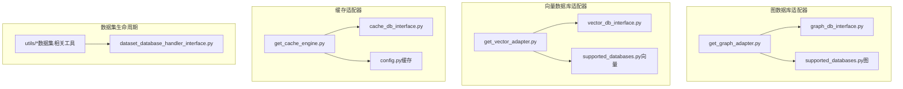
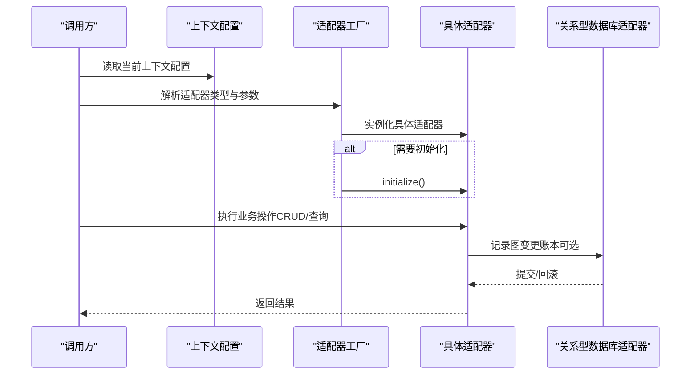
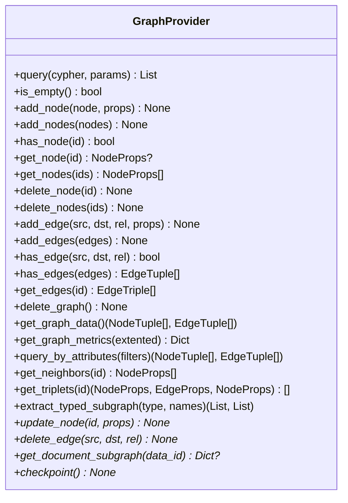
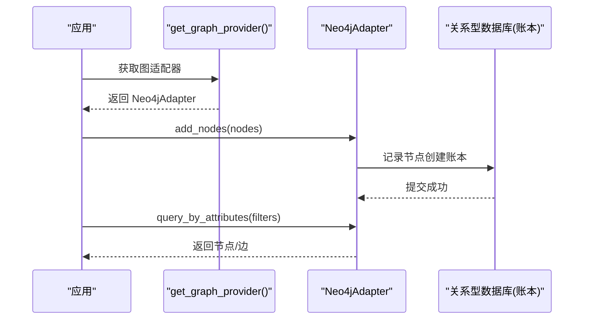
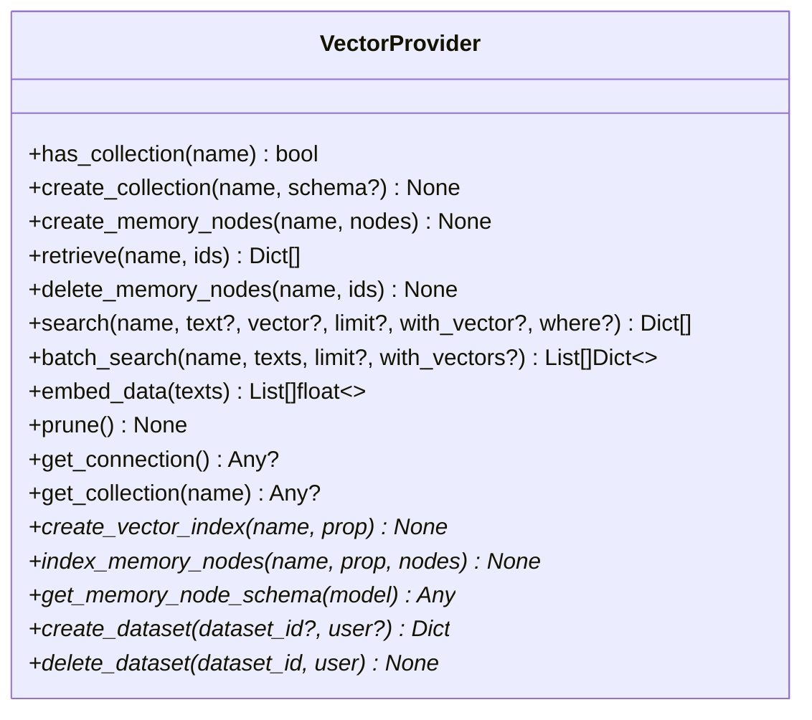
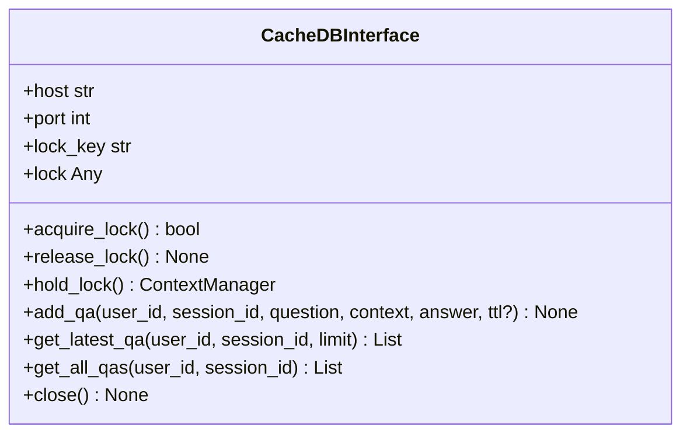
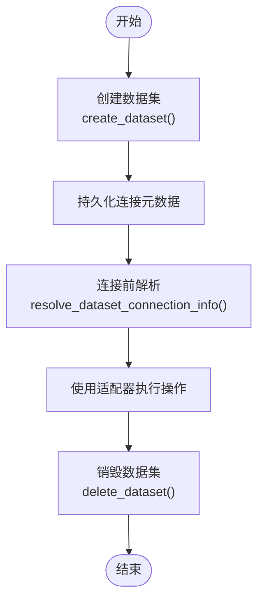
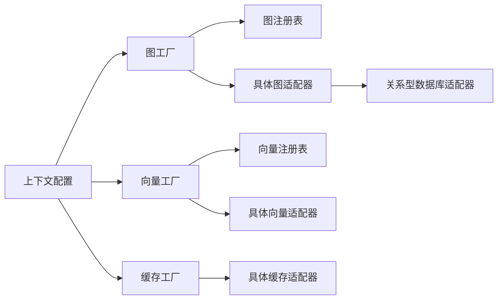

# 数据库适配器

<cite>
**本文引用的文件**
- [graph_db_interface.py](file://m_flow/adapters/graph/graph_db_interface.py)
- [vector_db_interface.py](file://m_flow/adapters/vector/vector_db_interface.py)
- [cache_db_interface.py](file://m_flow/adapters/cache/cache_db_interface.py)
- [dataset_database_handler_interface.py](file://m_flow/adapters/dataset_database_handler/dataset_database_handler_interface.py)
- [get_graph_adapter.py](file://m_flow/adapters/graph/get_graph_adapter.py)
- [supported_databases.py（图）](file://m_flow/adapters/graph/supported_databases.py)
- [get_vector_adapter.py](file://m_flow/adapters/vector/get_vector_adapter.py)
- [supported_databases.py（向量）](file://m_flow/adapters/vector/supported_databases.py)
- [get_cache_engine.py](file://m_flow/adapters/cache/get_cache_engine.py)
- [config.py（缓存）](file://m_flow/adapters/cache/config.py)
- [config.py（图）](file://m_flow/adapters/graph/config.py)
- [config.py（向量）](file://m_flow/adapters/vector/config.py)
- [use_graph_adapter.py](file://m_flow/adapters/graph/use_graph_adapter.py)
- [use_vector_adapter.py](file://m_flow/adapters/vector/use_vector_adapter.py)
- [get_dataset_database_handler.py](file://m_flow/adapters/utils/get_dataset_database_handler.py)
- [get_or_create_dataset_database.py](file://m_flow/adapters/utils/get_or_create_dataset_database.py)
- [resolve_dataset_database_connection_info.py](file://m_flow/adapters/utils/resolve_dataset_database_connection_info.py)
- [create_relational_engine.py](file://m_flow/adapters/relational/create_relational_engine.py)
- [get_db_adapter.py](file://m_flow/adapters/relational/get_db_adapter.py)
- [ModelBase.py](file://m_flow/adapters/relational/ModelBase.py)
- [GraphProvider（Ledger）](file://m_flow/data/models/graph_relationship_ledger.py)
- [examples/database_examples/neo4j_example.py](file://examples/database_examples/neo4j_example.py)
- [examples/database_examples/kuzu_example.py](file://examples/database_examples/kuzu_example.py)
- [examples/database_examples/chromadb_example.py](file://examples/database_examples/chromadb_example.py)
- [examples/database_examples/pgvector_example.py](file://examples/database_examples/pgvector_example.py)
- [examples/database_examples/neptune_analytics_example.py](file://examples/database_examples/neptune_analytics_example.py)
</cite>

## 目录
1. [引言](#引言)
2. [项目结构](#项目结构)
3. [核心组件](#核心组件)
4. [架构总览](#架构总览)
5. [详细组件分析](#详细组件分析)
6. [依赖分析](#依赖分析)
7. [性能考虑](#性能考虑)
8. [故障排查指南](#故障排查指南)
9. [结论](#结论)
10. [附录](#附录)

## 引言
本文件系统性梳理 M-flow 的数据库适配器体系，围绕“适配器模式”的设计理念与实现方式，说明如何通过统一接口支持多种数据库后端。重点覆盖以下方面：
- 图数据库适配器：Neo4j、Amazon Neptune、KùzuDB 等的抽象与实现要点
- 向量数据库适配器：LanceDB、PostgreSQL/pgvector、ChromaDB、Pinecone 等的集成设计
- 缓存系统适配器：Redis 与磁盘缓存的实现策略
- 配置管理：连接参数、认证方式与性能调优
- 自定义适配器：接口实现与测试方法
- 性能特性与适用场景
- 适配器选择与迁移策略

## 项目结构
M-flow 将适配器按领域拆分在 adapters 子目录中，分别对应图数据库、向量数据库、缓存与数据集生命周期管理等模块。工厂函数负责根据运行时配置解析具体适配器实例；接口层定义了稳定的契约，确保上层业务逻辑与底层实现解耦。

图表来源
- [get_graph_adapter.py:1-159](file://m_flow/adapters/graph/get_graph_adapter.py#L1-L159)
- [graph_db_interface.py:1-347](file://m_flow/adapters/graph/graph_db_interface.py#L1-L347)
- [supported_databases.py（图）:1-8](file://m_flow/adapters/graph/supported_databases.py#L1-L8)
- [get_vector_adapter.py:1-19](file://m_flow/adapters/vector/get_vector_adapter.py#L1-L19)
- [vector_db_interface.py:1-180](file://m_flow/adapters/vector/vector_db_interface.py#L1-L180)
- [supported_databases.py（向量）:1-8](file://m_flow/adapters/vector/supported_databases.py#L1-L8)
- [get_cache_engine.py:1-79](file://m_flow/adapters/cache/get_cache_engine.py#L1-L79)
- [cache_db_interface.py:1-125](file://m_flow/adapters/cache/cache_db_interface.py#L1-L125)
- [config.py（缓存）:1-89](file://m_flow/adapters/cache/config.py#L1-L89)
- [dataset_database_handler_interface.py:1-119](file://m_flow/adapters/dataset_database_handler/dataset_database_handler_interface.py#L1-L119)

章节来源
- [get_graph_adapter.py:1-159](file://m_flow/adapters/graph/get_graph_adapter.py#L1-L159)
- [get_vector_adapter.py:1-19](file://m_flow/adapters/vector/get_vector_adapter.py#L1-L19)
- [get_cache_engine.py:1-79](file://m_flow/adapters/cache/get_cache_engine.py#L1-L79)
- [dataset_database_handler_interface.py:1-119](file://m_flow/adapters/dataset_database_handler/dataset_database_handler_interface.py#L1-L119)

## 核心组件
- 图数据库适配器接口：定义节点/边的增删改查、属性过滤查询、子图提取、图级操作与可选的持久化检查点等能力，确保不同图库（如 Neo4j、Kùzu、Neptune）以一致的方式被使用。
- 向量数据库适配器接口：定义集合管理、内存节点的增删查、语义检索、批量检索、嵌入生成与可选的索引扩展点，便于替换不同的向量存储后端。
- 缓存适配器接口：定义分布式锁原语与问答会话存储能力，支持 Redis 与文件系统两种后端，满足多进程共享与本地开发场景。
- 数据集生命周期处理器接口：定义为每个数据集提供隔离的后端资源（创建/解析/销毁），支持密钥引用与租户感知。

章节来源
- [graph_db_interface.py:122-347](file://m_flow/adapters/graph/graph_db_interface.py#L122-L347)
- [vector_db_interface.py:16-180](file://m_flow/adapters/vector/vector_db_interface.py#L16-L180)
- [cache_db_interface.py:12-125](file://m_flow/adapters/cache/cache_db_interface.py#L12-L125)
- [dataset_database_handler_interface.py:18-119](file://m_flow/adapters/dataset_database_handler/dataset_database_handler_interface.py#L18-L119)

## 架构总览
下图展示了从配置到具体适配器实例的解析流程，以及与关系型数据库（用于账本与元数据）的协作关系。

图表来源
- [get_graph_adapter.py:22-35](file://m_flow/adapters/graph/get_graph_adapter.py#L22-L35)
- [graph_db_interface.py:35-96](file://m_flow/adapters/graph/graph_db_interface.py#L35-L96)
- [get_db_adapter.py](file://m_flow/adapters/relational/get_db_adapter.py)

章节来源
- [get_graph_adapter.py:22-131](file://m_flow/adapters/graph/get_graph_adapter.py#L22-L131)
- [graph_db_interface.py:35-96](file://m_flow/adapters/graph/graph_db_interface.py#L35-L96)

## 详细组件分析

### 图数据库适配器
- 设计理念
  - 统一接口：通过 GraphProvider 抽象，屏蔽不同图数据库的差异，上层仅依赖接口。
  - 可扩展注册表：通过 supported_databases 注册第三方或内部适配器，工厂函数优先匹配注册表。
  - 账本追踪：装饰器自动记录节点/边变更到关系型数据库的图关系账本，便于审计与溯源。
- 关键能力
  - 原生查询：query 支持 Cypher/Gremlin 等原生语法
  - 节点/边 CRUD：单条与批量插入、存在性检查、删除等
  - 属性过滤查询：query_by_attributes 支持基于属性的筛选
  - 子图与遍历：邻居、三元组、命名节点子图提取
  - 图级操作：清空图、导出全图、统计指标
  - 可选增强：更新节点、删除边、文档子图提取、WAL 检查点
- 具体实现与支持
  - Neo4j：远程/云服务，工厂直接构造适配器实例
  - KùzuDB：本地嵌入式与远程 Kùzu 两种形态，均通过工厂解析
  - Amazon Neptune：需要 AWS 集成依赖，工厂校验前缀并构造适配器
  - Neptune Analytics：混合图/向量能力，通过独立适配器接入
- 使用建议
  - 在高并发写入后，对关键写操作后调用 checkpoint（若后端需要）以确保持久化
  - 对于复杂查询，优先使用 query_by_attributes 进行过滤，再进行遍历

图表来源
- [graph_db_interface.py:122-347](file://m_flow/adapters/graph/graph_db_interface.py#L122-L347)

章节来源
- [graph_db_interface.py:122-347](file://m_flow/adapters/graph/graph_db_interface.py#L122-L347)
- [get_graph_adapter.py:22-131](file://m_flow/adapters/graph/get_graph_adapter.py#L22-L131)
- [supported_databases.py（图）:1-8](file://m_flow/adapters/graph/supported_databases.py#L1-L8)

#### 图数据库适配器调用序列（示例：Neo4j）

图表来源
- [get_graph_adapter.py:22-35](file://m_flow/adapters/graph/get_graph_adapter.py#L22-L35)
- [graph_db_interface.py:35-96](file://m_flow/adapters/graph/graph_db_interface.py#L35-L96)

### 向量数据库适配器
- 设计理念
  - 协议化接口：VectorProvider 以 Protocol 定义，强调“行为契约”，便于替换后端
  - 集合即命名空间：通过 collection_name 管理不同数据集/任务的向量空间
  - 语义检索：支持文本/向量双入口检索，并提供批量检索
  - 可选扩展：索引创建、节点索引、Schema 转换、多租户钩子
- 关键能力
  - 集合管理：存在性检查、创建
  - 内存节点 CRUD：创建、按 ID 检索、删除
  - 检索：单次与批量，支持 where 过滤
  - 嵌入：文本向量化
  - 维护：清理过期/孤立数据
- 支持与集成
  - LanceDB、ChromaDB、pgvector 等通过工厂与配置解析接入
  - Pinecone 作为云原生向量引擎，可通过注册表扩展

图表来源
- [vector_db_interface.py:16-180](file://m_flow/adapters/vector/vector_db_interface.py#L16-L180)

章节来源
- [vector_db_interface.py:16-180](file://m_flow/adapters/vector/vector_db_interface.py#L16-L180)
- [get_vector_adapter.py:11-19](file://m_flow/adapters/vector/get_vector_adapter.py#L11-L19)
- [supported_databases.py（向量）:1-8](file://m_flow/adapters/vector/supported_databases.py#L1-L8)

### 缓存系统适配器
- 设计理念
  - 统一锁与会话存储接口：CacheDBInterface 规范分布式锁与问答会话的持久化
  - 双后端支持：Redis（生产/分布式）与文件系统（本地/开发）
  - 配置驱动：通过 CacheConfig 控制启用状态、后端类型、认证与锁超时
- 关键能力
  - 分布式锁：acquire/release/hold_lock 上下文管理
  - 问答会话：新增最近 N 条、获取全部会话
  - 生命周期：close 释放底层连接
- 使用建议
  - 生产环境推荐 Redis，结合合理的锁过期与等待时间
  - 开发环境可使用文件系统后端，避免外部依赖

图表来源
- [cache_db_interface.py:12-125](file://m_flow/adapters/cache/cache_db_interface.py#L12-L125)

章节来源
- [cache_db_interface.py:12-125](file://m_flow/adapters/cache/cache_db_interface.py#L12-L125)
- [get_cache_engine.py:19-79](file://m_flow/adapters/cache/get_cache_engine.py#L19-L79)
- [config.py（缓存）:25-89](file://m_flow/adapters/cache/config.py#L25-L89)

### 数据集生命周期管理
- 设计理念
  - 为每个数据集提供隔离的后端资源，支持多租户与安全隔离
  - 生命周期三段式：创建（Provision）、解析（Resolve）、销毁（Teardown）
  - 支持密钥引用与短期凭据解析，避免明文持久化
- 关键接口
  - create_dataset：返回可序列化的连接描述，供后续解析
  - resolve_dataset_connection_info：将存储的元数据解析为运行时连接参数
  - delete_dataset：回收或标记退役后端资源

图表来源
- [dataset_database_handler_interface.py:36-118](file://m_flow/adapters/dataset_database_handler/dataset_database_handler_interface.py#L36-L118)

章节来源
- [dataset_database_handler_interface.py:18-119](file://m_flow/adapters/dataset_database_handler/dataset_database_handler_interface.py#L18-L119)
- [get_dataset_database_handler.py](file://m_flow/adapters/utils/get_dataset_database_handler.py)
- [get_or_create_dataset_database.py](file://m_flow/adapters/utils/get_or_create_dataset_database.py)
- [resolve_dataset_database_connection_info.py](file://m_flow/adapters/utils/resolve_dataset_database_connection_info.py)

## 依赖分析
- 工厂与注册表
  - 图/向量适配器工厂通过上下文配置解析具体实现，内置支持 Neo4j、Kùzu、Neptune、Neptune Analytics 等；通过 supported_databases 注册表扩展
- 账本与关系型数据库
  - 图适配器的变更追踪通过关系型数据库适配器写入图关系账本，保证可审计性
- 配置与环境
  - 缓存配置集中于 CacheConfig，支持环境变量注入与进程内缓存

图表来源
- [get_graph_adapter.py:22-131](file://m_flow/adapters/graph/get_graph_adapter.py#L22-L131)
- [get_vector_adapter.py:11-19](file://m_flow/adapters/vector/get_vector_adapter.py#L11-L19)
- [get_cache_engine.py:19-79](file://m_flow/adapters/cache/get_cache_engine.py#L19-L79)
- [supported_databases.py（图）:7](file://m_flow/adapters/graph/supported_databases.py#L7)
- [supported_databases.py（向量）:7](file://m_flow/adapters/vector/supported_databases.py#L7)

章节来源
- [get_graph_adapter.py:22-131](file://m_flow/adapters/graph/get_graph_adapter.py#L22-L131)
- [get_vector_adapter.py:11-19](file://m_flow/adapters/vector/get_vector_adapter.py#L11-L19)
- [get_cache_engine.py:19-79](file://m_flow/adapters/cache/get_cache_engine.py#L19-L79)

## 性能考虑
- 图数据库
  - Neo4j：适合复杂关系查询与事务一致性；注意批量写入时的事务大小与索引维护
  - KùzuDB：嵌入式，低延迟；写入后可调用 checkpoint 确保持久化
  - Neptune/Analytics：托管图服务，具备弹性与高可用，适合大规模图分析
- 向量数据库
  - LanceDB：本地列式向量存储，适合中小规模与离线批处理
  - ChromaDB：轻量级，适合开发与小规模部署
  - pgvector：与 PostgreSQL 深度集成，适合已有 SQL 基础设施
  - Pinecone：云原生，适合高吞吐检索与弹性扩缩容
- 缓存
  - Redis：高并发读写与分布式锁，需合理设置过期与等待时间
  - 文件系统：简单易用，不适用于多进程共享

## 故障排查指南
- 图适配器
  - 账本未记录：确认装饰器是否包裹写操作，检查关系型数据库会话提交/回滚日志
  - 查询异常：优先使用 query_by_attributes 进行过滤，再进行遍历；避免全图扫描
- 向量适配器
  - 检索为空：确认集合是否存在、向量维度与索引是否匹配
  - 批量检索性能差：分批请求、减少返回向量、使用 where 过滤
- 缓存
  - 锁无法获取：检查过期与等待时间配置，确认 Redis 可达性
  - 会话数据丢失：确认 TTL 设置与后端持久化策略

章节来源
- [graph_db_interface.py:35-96](file://m_flow/adapters/graph/graph_db_interface.py#L35-L96)
- [vector_db_interface.py:77-103](file://m_flow/adapters/vector/vector_db_interface.py#L77-L103)
- [cache_db_interface.py:55-125](file://m_flow/adapters/cache/cache_db_interface.py#L55-L125)

## 结论
M-flow 的适配器体系通过统一接口与工厂解析，实现了对多种数据库后端的无缝切换。配合数据集生命周期管理与关系型账本，既保证了灵活性，也兼顾了可观测性与安全性。在实际部署中，应依据场景选择合适的后端组合，并通过配置与监控保障稳定性与性能。

## 附录

### 配置管理与性能调优
- 图数据库
  - 通过上下文配置解析图适配器类型与连接参数，支持本地路径、URL、用户名/密码、端口等
  - 对 WAL 需要的后端（如 Kùzu）在关键写操作后调用 checkpoint
- 向量数据库
  - 通过上下文配置解析向量引擎，支持集合管理、索引与批量检索
- 缓存
  - CacheConfig 提供后端类型、启用开关、Redis 凭证与锁超时等参数
  - 生产环境建议启用 Redis 并调整过期与等待时间

章节来源
- [config.py（图）](file://m_flow/adapters/graph/config.py)
- [config.py（向量）](file://m_flow/adapters/vector/config.py)
- [config.py（缓存）:25-89](file://m_flow/adapters/cache/config.py#L25-L89)

### 自定义适配器开发指南
- 图数据库
  - 实现 GraphProvider 接口，至少覆盖核心 CRUD、查询与图级操作
  - 如需账本追踪，确保写操作被装饰器包裹或手动记录
  - 通过 supported_databases 注册新适配器名称到构造器
- 向量数据库
  - 实现 VectorProvider 协议，至少覆盖集合管理、CRUD、检索与嵌入
  - 如需索引或 Schema 转换，提供可选扩展点
  - 通过 supported_databases 注册新适配器名称到构造器
- 缓存
  - 实现 CacheDBInterface，至少覆盖锁与问答会话存储
  - 在 get_cache_engine 中添加分支以支持新后端

章节来源
- [graph_db_interface.py:122-347](file://m_flow/adapters/graph/graph_db_interface.py#L122-L347)
- [vector_db_interface.py:16-180](file://m_flow/adapters/vector/vector_db_interface.py#L16-L180)
- [cache_db_interface.py:12-125](file://m_flow/adapters/cache/cache_db_interface.py#L12-L125)
- [supported_databases.py（图）:7](file://m_flow/adapters/graph/supported_databases.py#L7)
- [supported_databases.py（向量）:7](file://m_flow/adapters/vector/supported_databases.py#L7)
- [get_cache_engine.py:49-65](file://m_flow/adapters/cache/get_cache_engine.py#L49-L65)

### 适配器选择与迁移策略
- 选择原则
  - 场景需求：关系复杂度、数据规模、一致性要求、检索性能
  - 部署形态：本地/容器/云原生、是否需要分布式共享
  - 成本与运维：许可、运维复杂度、扩展性
- 迁移策略
  - 以接口为边界，逐步替换后端，保持业务逻辑不变
  - 利用数据集生命周期管理，先为新后端创建资源，再切换流量
  - 通过账本与日志验证迁移前后的一致性

### 示例参考
- Neo4j 示例：[examples/database_examples/neo4j_example.py](file://examples/database_examples/neo4j_example.py)
- Kùzu 示例：[examples/database_examples/kuzu_example.py](file://examples/database_examples/kuzu_example.py)
- ChromaDB 示例：[examples/database_examples/chromadb_example.py](file://examples/database_examples/chromadb_example.py)
- pgvector 示例：[examples/database_examples/pgvector_example.py](file://examples/database_examples/pgvector_example.py)
- Neptune Analytics 示例：[examples/database_examples/neptune_analytics_example.py](file://examples/database_examples/neptune_analytics_example.py)