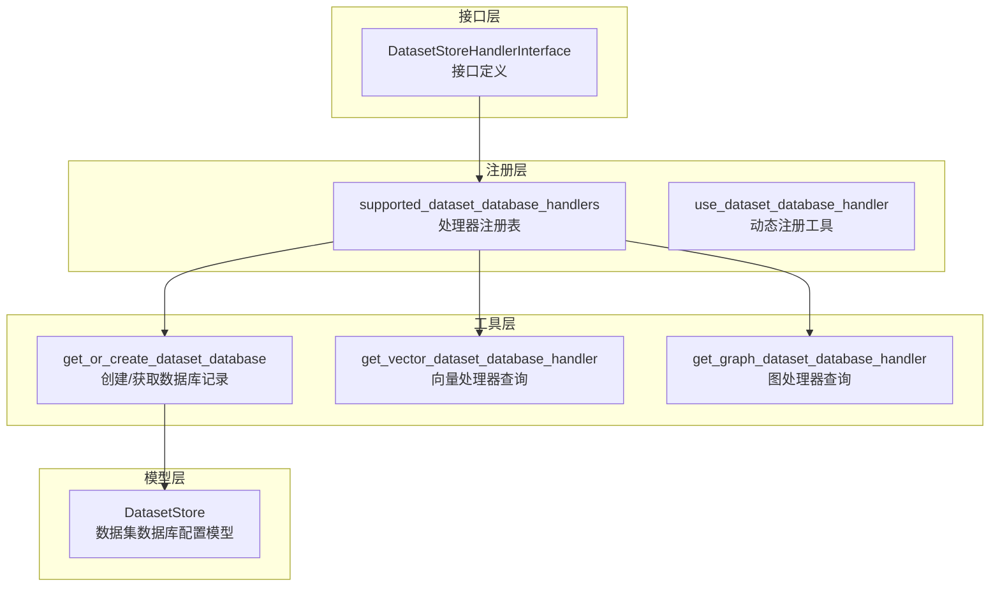
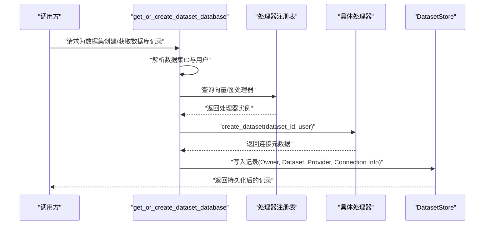
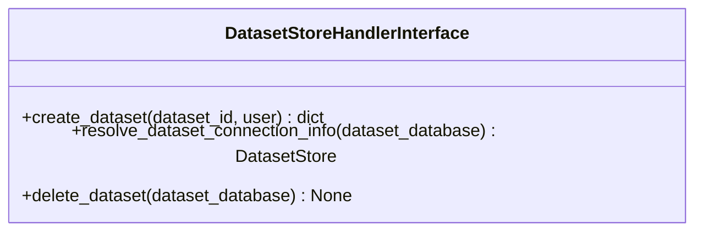
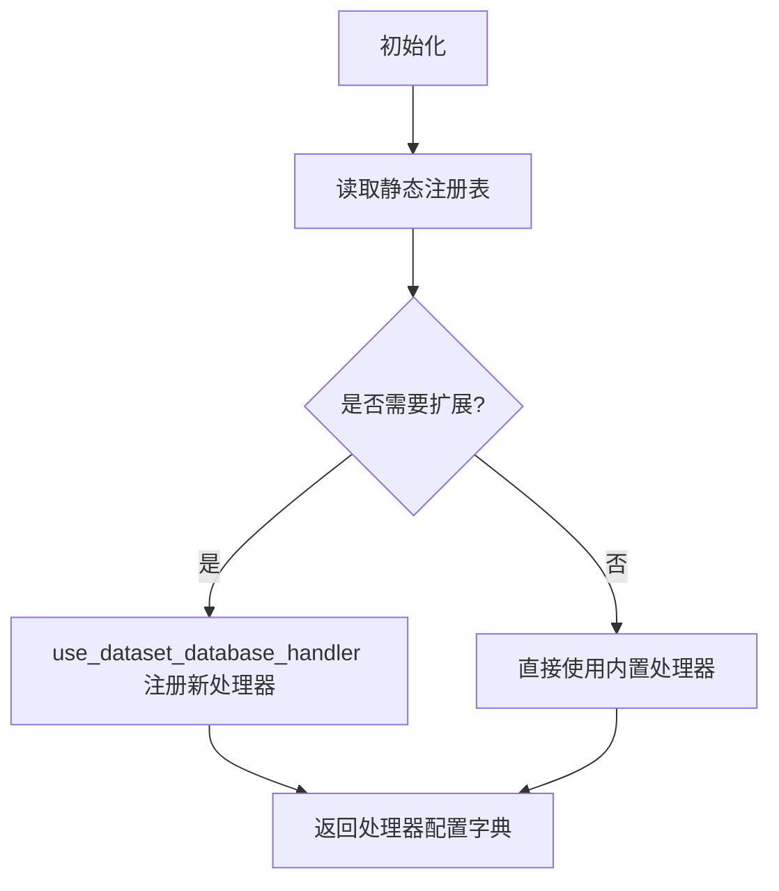
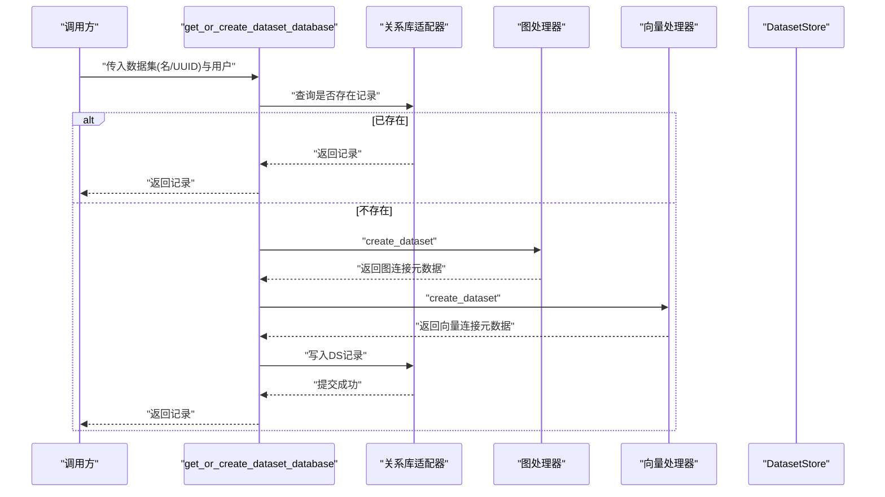
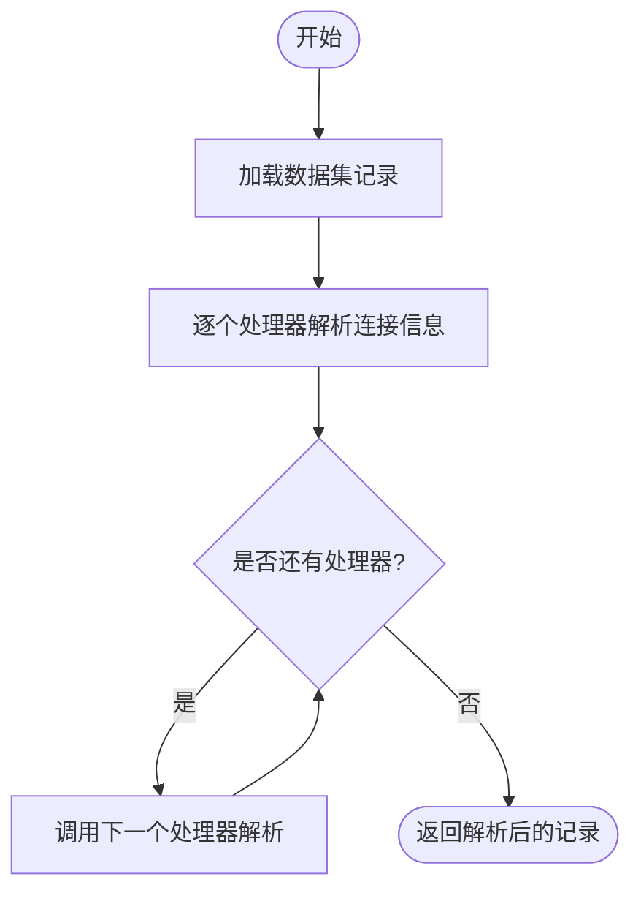
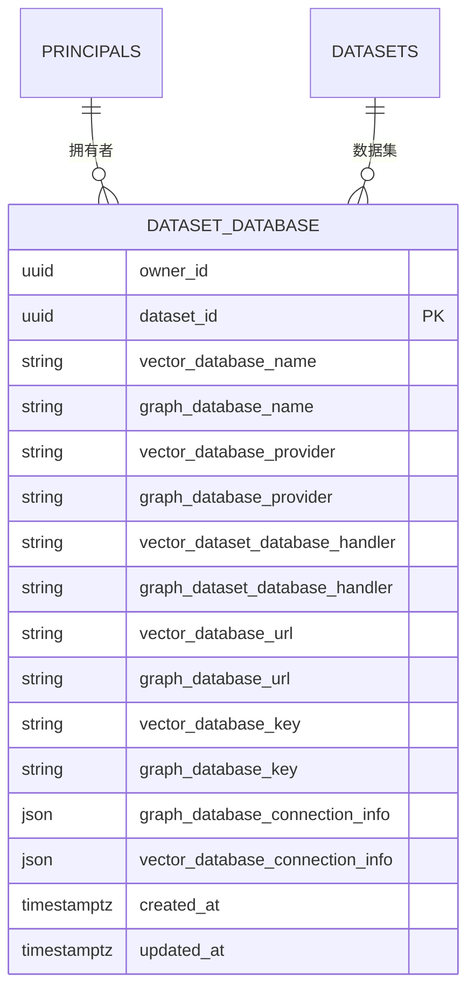

# 数据集数据库处理器

<cite>
**本文引用的文件**
- [dataset_database_handler_interface.py](file://m_flow/adapters/dataset_database_handler/dataset_database_handler_interface.py)
- [supported_dataset_database_handlers.py](file://m_flow/adapters/dataset_database_handler/supported_dataset_database_handlers.py)
- [use_dataset_database_handler.py](file://m_flow/adapters/dataset_database_handler/use_dataset_database_handler.py)
- [get_or_create_dataset_database.py](file://m_flow/adapters/utils/get_or_create_dataset_database.py)
- [get_vector_dataset_database_handler.py](file://m_flow/adapters/utils/get_vector_dataset_database_handler.py)
- [get_graph_dataset_database_handler.py](file://m_flow/adapters/utils/get_graph_dataset_database_handler.py)
- [DatasetStore.py](file://m_flow/auth/models/DatasetStore.py)
</cite>

## 目录
1. [简介](#简介)
2. [项目结构](#项目结构)
3. [核心组件](#核心组件)
4. [架构总览](#架构总览)
5. [详细组件分析](#详细组件分析)
6. [依赖分析](#依赖分析)
7. [性能考虑](#性能考虑)
8. [故障排除指南](#故障排除指南)
9. [结论](#结论)
10. [附录](#附录)

## 简介
本文件系统性阐述“数据集数据库处理器”的设计架构与统一接口实现，聚焦以下关键目标：
- 统一抽象：通过接口规范定义每个数据集的数据库生命周期（创建、解析、销毁）。
- 多后端支持：注册并按需加载图数据库与向量数据库的处理器实例。
- 隔离与安全：基于数据集与用户维度进行资源隔离，避免跨数据集访问。
- 生命周期管理：从数据库创建到连接解析再到资源清理的完整流程。
- 上下文与切换：在多租户场景下的租户选择、权限校验与会话状态维护。
- 配置与优化：数据库连接参数、存储策略与性能调优建议。
- 备份与恢复：增量备份、数据迁移与灾难恢复策略。
- 监控与审计：使用统计、访问日志与性能指标采集。
- 扩展指南：自定义处理器开发与第三方数据库集成方法。

## 项目结构
围绕“数据集数据库处理器”，相关模块分布如下：
- 接口层：定义统一的处理器契约，约束创建、解析与销毁三阶段。
- 注册层：集中注册可用的处理器实现及其提供方。
- 工具层：根据配置与数据集信息获取或创建数据库记录，并解析连接信息。
- 模型层：持久化每数据集的数据库配置与连接元数据。

**图表来源**
- [dataset_database_handler_interface.py:18-119](file://m_flow/adapters/dataset_database_handler/dataset_database_handler_interface.py#L18-L119)
- [supported_dataset_database_handlers.py:17-30](file://m_flow/adapters/dataset_database_handler/supported_dataset_database_handlers.py#L17-L30)
- [use_dataset_database_handler.py:10-31](file://m_flow/adapters/dataset_database_handler/use_dataset_database_handler.py#L10-L31)
- [get_or_create_dataset_database.py:22-120](file://m_flow/adapters/utils/get_or_create_dataset_database.py#L22-L120)
- [get_vector_dataset_database_handler.py:10-17](file://m_flow/adapters/utils/get_vector_dataset_database_handler.py#L10-L17)
- [get_graph_dataset_database_handler.py:10-17](file://m_flow/adapters/utils/get_graph_dataset_database_handler.py#L10-L17)
- [DatasetStore.py:19-49](file://m_flow/auth/models/DatasetStore.py#L19-L49)

**章节来源**
- [dataset_database_handler_interface.py:1-119](file://m_flow/adapters/dataset_database_handler/dataset_database_handler_interface.py#L1-L119)
- [supported_dataset_database_handlers.py:1-31](file://m_flow/adapters/dataset_database_handler/supported_dataset_database_handlers.py#L1-L31)
- [use_dataset_database_handler.py:1-31](file://m_flow/adapters/dataset_database_handler/use_dataset_database_handler.py#L1-L31)
- [get_or_create_dataset_database.py:1-120](file://m_flow/adapters/utils/get_or_create_dataset_database.py#L1-L120)
- [get_vector_dataset_database_handler.py:1-17](file://m_flow/adapters/utils/get_vector_dataset_database_handler.py#L1-L17)
- [get_graph_dataset_database_handler.py:1-17](file://m_flow/adapters/utils/get_graph_dataset_database_handler.py#L1-L17)
- [DatasetStore.py:1-49](file://m_flow/auth/models/DatasetStore.py#L1-L49)

## 核心组件
- 统一接口：定义三阶段生命周期方法，确保所有处理器实现一致的行为边界。
- 注册表：集中管理处理器实例与提供方，便于扩展与替换。
- 工具函数：封装“获取或创建”“解析连接信息”等通用逻辑。
- 数据模型：持久化每数据集的数据库配置、提供方与连接元数据。

关键职责与交互要点：
- 接口层负责约束行为；注册层负责装配；工具层负责编排；模型层负责持久化。

**章节来源**
- [dataset_database_handler_interface.py:18-119](file://m_flow/adapters/dataset_database_handler/dataset_database_handler_interface.py#L18-L119)
- [supported_dataset_database_handlers.py:17-30](file://m_flow/adapters/dataset_database_handler/supported_dataset_database_handlers.py#L17-L30)
- [get_or_create_dataset_database.py:22-120](file://m_flow/adapters/utils/get_or_create_dataset_database.py#L22-L120)
- [DatasetStore.py:19-49](file://m_flow/auth/models/DatasetStore.py#L19-L49)

## 架构总览
整体架构遵循“接口抽象 + 注册装配 + 工具编排 + 模型持久化”的分层设计，确保：
- 可插拔：新增处理器仅需实现接口并注册。
- 可扩展：支持多提供方组合（如图+向量）。
- 可隔离：基于数据集与用户维度进行资源隔离。
- 可审计：连接元数据与时间戳便于追踪与审计。

**图表来源**
- [get_or_create_dataset_database.py:22-120](file://m_flow/adapters/utils/get_or_create_dataset_database.py#L22-L120)
- [supported_dataset_database_handlers.py:17-30](file://m_flow/adapters/dataset_database_handler/supported_dataset_database_handlers.py#L17-L30)
- [dataset_database_handler_interface.py:36-119](file://m_flow/adapters/dataset_database_handler/dataset_database_handler_interface.py#L36-L119)
- [DatasetStore.py:19-49](file://m_flow/auth/models/DatasetStore.py#L19-L49)

## 详细组件分析

### 组件A：数据集数据库处理器接口
- 设计要点
  - 三阶段生命周期：创建、解析、销毁。
  - 解析阶段默认透传，子类可覆盖以从密钥服务解析短期凭据。
  - 连接信息仅在连接尝试期间存在，不回写到关系库。
  - 支持链式处理：图/向量处理器分别填充各自字段后传递给下一个。

**图表来源**
- [dataset_database_handler_interface.py:18-119](file://m_flow/adapters/dataset_database_handler/dataset_database_handler_interface.py#L18-L119)

**章节来源**
- [dataset_database_handler_interface.py:18-119](file://m_flow/adapters/dataset_database_handler/dataset_database_handler_interface.py#L18-L119)

### 组件B：处理器注册与动态扩展
- 设计要点
  - 静态注册表：内置Neo4j/Aura Dev、LanceDB、Kuzu等处理器。
  - 动态注册：通过工具函数允许运行时注入新处理器。
  - 提供方标识：区分底层数据库提供方，便于后续适配与迁移。

**图表来源**
- [supported_dataset_database_handlers.py:17-30](file://m_flow/adapters/dataset_database_handler/supported_dataset_database_handlers.py#L17-L30)
- [use_dataset_database_handler.py:10-31](file://m_flow/adapters/dataset_database_handler/use_dataset_database_handler.py#L10-L31)

**章节来源**
- [supported_dataset_database_handlers.py:1-31](file://m_flow/adapters/dataset_database_handler/supported_dataset_database_handlers.py#L1-L31)
- [use_dataset_database_handler.py:1-31](file://m_flow/adapters/dataset_database_handler/use_dataset_database_handler.py#L1-L31)

### 组件C：数据集数据库记录的获取与创建
- 设计要点
  - 输入：数据集名称或UUID、当前用户。
  - 流程：若按名称传入则先确保数据集存在；查询是否存在记录；不存在则分别调用图/向量处理器创建并持久化。
  - 并发：使用关系库事务保证一致性；冲突回滚重试由上层策略处理。

**图表来源**
- [get_or_create_dataset_database.py:22-120](file://m_flow/adapters/utils/get_or_create_dataset_database.py#L22-L120)
- [DatasetStore.py:19-49](file://m_flow/auth/models/DatasetStore.py#L19-L49)

**章节来源**
- [get_or_create_dataset_database.py:22-120](file://m_flow/adapters/utils/get_or_create_dataset_database.py#L22-L120)

### 组件D：连接信息解析与上下文切换
- 设计要点
  - 解析阶段：将存储的元数据转换为连接所需的具体参数（如短期凭据），且不写回关系库。
  - 上下文：在链式处理中，每个处理器仅更新自身字段，再传递给下一个处理器。
  - 切换：通过数据集记录与用户绑定，实现租户与数据集级别的上下文切换。

**图表来源**
- [dataset_database_handler_interface.py:69-99](file://m_flow/adapters/dataset_database_handler/dataset_database_handler_interface.py#L69-L99)
- [get_or_create_dataset_database.py:71-92](file://m_flow/adapters/utils/get_or_create_dataset_database.py#L71-L92)

**章节来源**
- [dataset_database_handler_interface.py:69-99](file://m_flow/adapters/dataset_database_handler/dataset_database_handler_interface.py#L69-L99)
- [get_or_create_dataset_database.py:71-92](file://m_flow/adapters/utils/get_or_create_dataset_database.py#L71-L92)

### 组件E：数据模型与隔离机制
- 设计要点
  - 字段覆盖：记录提供方、处理器名称、连接URL/Key以及JSON格式的连接信息。
  - 外键约束：与用户与数据集关联，删除级联保证数据一致性。
  - 隔离：每条记录绑定特定用户与数据集，天然实现跨数据集隔离。

**图表来源**
- [DatasetStore.py:19-49](file://m_flow/auth/models/DatasetStore.py#L19-L49)

**章节来源**
- [DatasetStore.py:19-49](file://m_flow/auth/models/DatasetStore.py#L19-L49)

## 依赖分析
- 耦合关系
  - 工具层依赖注册表与接口层，实现“按配置选择处理器”的解耦。
  - 模型层被工具层写入，作为处理器与上层业务的契约载体。
- 内聚性
  - 接口层内聚于生命周期三阶段；注册层内聚于处理器装配；工具层内聚于数据集数据库的编排。
- 扩展点
  - 新增处理器只需实现接口并通过注册表暴露；无需修改工具层与模型层。

**图表来源**
- [dataset_database_handler_interface.py:18-119](file://m_flow/adapters/dataset_database_handler/dataset_database_handler_interface.py#L18-L119)
- [supported_dataset_database_handlers.py:17-30](file://m_flow/adapters/dataset_database_handler/supported_dataset_database_handlers.py#L17-L30)
- [get_or_create_dataset_database.py:22-120](file://m_flow/adapters/utils/get_or_create_dataset_database.py#L22-L120)
- [DatasetStore.py:19-49](file://m_flow/auth/models/DatasetStore.py#L19-L49)

**章节来源**
- [supported_dataset_database_handlers.py:17-30](file://m_flow/adapters/dataset_database_handler/supported_dataset_database_handlers.py#L17-L30)
- [get_or_create_dataset_database.py:22-120](file://m_flow/adapters/utils/get_or_create_dataset_database.py#L22-L120)

## 性能考虑
- 连接复用与池化：在解析阶段生成的短期凭据应配合连接池使用，减少频繁创建销毁开销。
- 异步并发：工具层采用异步会话，建议在高并发场景下合理设置连接池大小与超时阈值。
- 缓存策略：对解析后的连接信息进行短时缓存，降低重复解析成本（注意缓存失效与过期策略）。
- 写入优化：批量写入与事务合并可减少关系库压力；冲突回滚需结合重试退避策略。

## 故障排除指南
- 创建失败
  - 现象：创建记录时报唯一约束冲突。
  - 排查：确认数据集名称是否已存在；检查用户与数据集ID映射；查看事务是否正确提交。
  - 参考路径：[get_or_create_dataset_database.py:112-120](file://m_flow/adapters/utils/get_or_create_dataset_database.py#L112-L120)
- 解析异常
  - 现象：解析连接信息时报错或凭据无效。
  - 排查：核对处理器提供的密钥服务路径与权限；确认短期凭据有效期；避免将解析结果写回关系库。
  - 参考路径：[dataset_database_handler_interface.py:69-99](file://m_flow/adapters/dataset_database_handler/dataset_database_handler_interface.py#L69-L99)
- 删除问题
  - 现象：删除数据集后仍残留资源。
  - 排查：确认处理器实现支持软删除/硬删除；检查后端是否支持回收站或归档。
  - 参考路径：[dataset_database_handler_interface.py:101-119](file://m_flow/adapters/dataset_database_handler/dataset_database_handler_interface.py#L101-L119)

**章节来源**
- [get_or_create_dataset_database.py:112-120](file://m_flow/adapters/utils/get_or_create_dataset_database.py#L112-L120)
- [dataset_database_handler_interface.py:69-119](file://m_flow/adapters/dataset_database_handler/dataset_database_handler_interface.py#L69-L119)

## 结论
数据集数据库处理器通过统一接口与注册机制，实现了多后端、多提供方的可插拔架构；借助数据模型与严格的生命周期管理，保障了跨数据集的安全隔离与可审计性。工具层将创建、解析与持久化串联为清晰的编排流程，满足多租户场景下的上下文切换与权限控制需求。结合本文的配置、监控与扩展建议，可在生产环境中稳定落地并持续演进。

## 附录

### 数据集配置管理指南
- 连接参数
  - 图/向量数据库名称与提供方：用于识别与路由。
  - 处理器名称：决定具体实现与解析策略。
  - 连接URL/Key与JSON连接信息：承载凭据与元数据。
- 存储策略
  - 将敏感凭据以密钥引用形式保存，避免明文泄露。
  - 使用JSON字段存储动态解析后的连接参数，便于扩展。
- 性能优化
  - 合理设置连接池大小与超时；
  - 对解析结果进行短时缓存；
  - 在高并发场景下合并事务写入。

### 数据集隔离机制
- 用户级隔离：每条记录绑定owner_id，确保用户间不可见。
- 数据集级隔离：每条记录绑定dataset_id，确保数据集间不可见。
- 处理器级隔离：图/向量处理器分别填充各自字段，避免交叉污染。

### 数据集切换与上下文管理
- 租户隔离：通过用户上下文与数据集记录建立强绑定。
- 权限验证：在创建与解析阶段结合用户角色与数据集权限进行校验。
- 会话状态：解析后的连接信息仅在当前会话有效，避免跨请求泄露。

### 备份与恢复机制
- 增量备份：针对图/向量后端的增量导出与导入策略。
- 数据迁移：通过处理器接口的“解析”阶段输出标准化连接参数，便于迁移与切换。
- 灾难恢复：基于关系库中的记录快速重建连接参数，结合后端快照恢复。

### 监控与审计
- 使用统计：记录每个数据集的创建/删除次数与活跃度。
- 访问日志：记录解析与连接尝试的事件与结果。
- 性能指标：连接延迟、解析耗时、错误率等。

### 扩展指南
- 自定义处理器
  - 实现接口的三个方法；
  - 在注册表中注册处理器名称与提供方；
  - 在解析阶段处理密钥服务与短期凭据。
- 第三方数据库集成
  - 保持接口不变，仅变更实现与注册表；
  - 通过JSON字段扩展连接参数，兼容未来扩展。