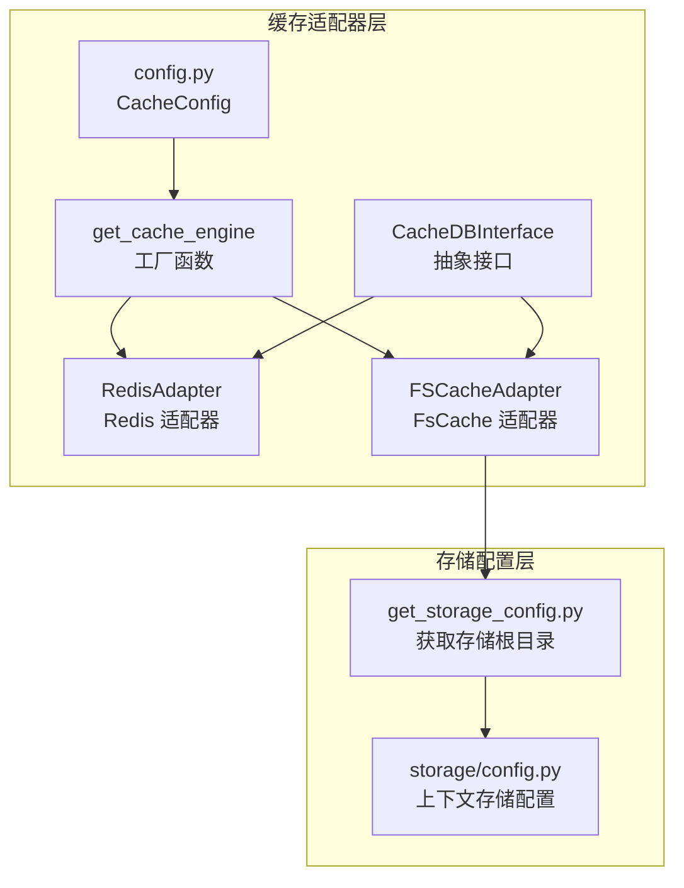
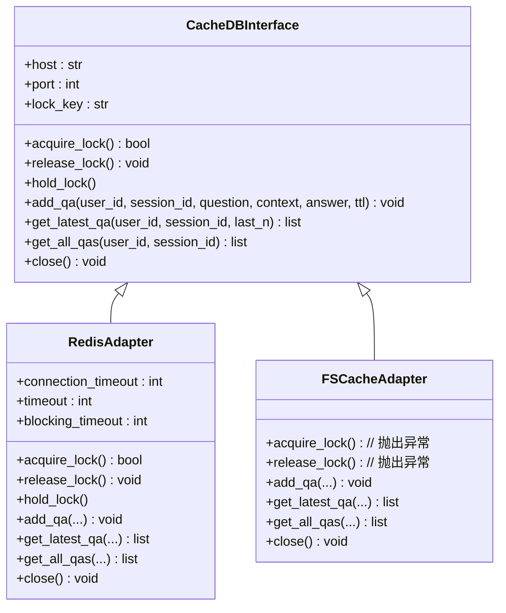
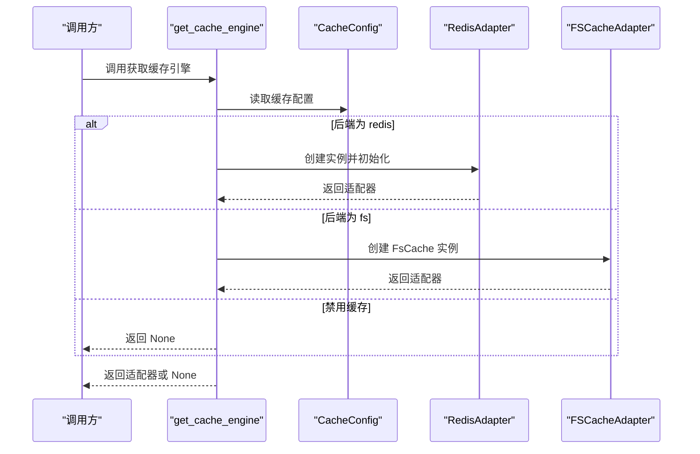
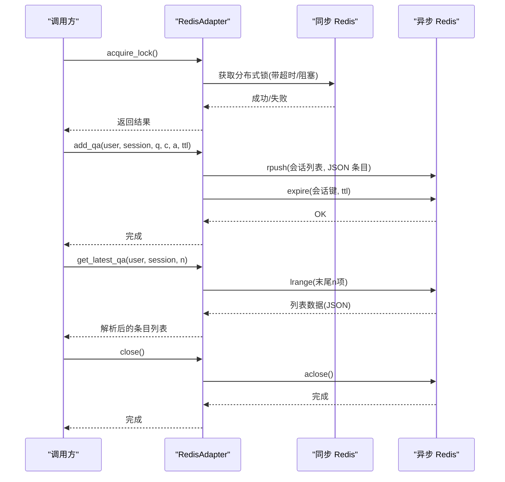
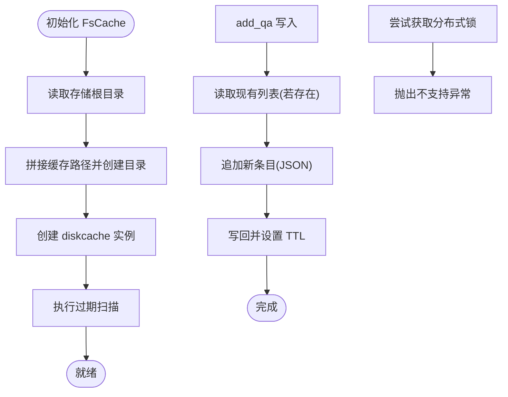
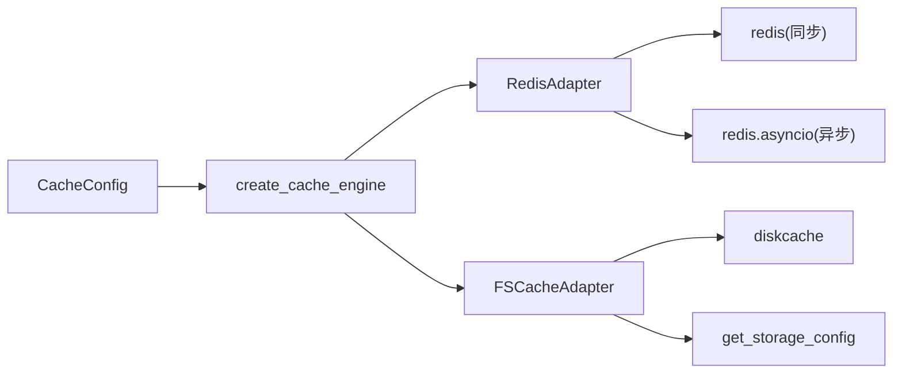

# 缓存系统适配器

<cite>
**本文引用的文件**
- [m_flow/adapters/cache/__init__.py](file://m_flow/adapters/cache/__init__.py)
- [m_flow/adapters/cache/cache_db_interface.py](file://m_flow/adapters/cache/cache_db_interface.py)
- [m_flow/adapters/cache/get_cache_engine.py](file://m_flow/adapters/cache/get_cache_engine.py)
- [m_flow/adapters/cache/config.py](file://m_flow/adapters/cache/config.py)
- [m_flow/adapters/cache/redis/RedisAdapter.py](file://m_flow/adapters/cache/redis/RedisAdapter.py)
- [m_flow/adapters/cache/fscache/FsCacheAdapter.py](file://m_flow/adapters/cache/fscache/FsCacheAdapter.py)
- [m_flow/shared/files/storage/get_storage_config.py](file://m_flow/shared/files/storage/get_storage_config.py)
- [m_flow/shared/files/storage/config.py](file://m_flow/shared/files/storage/config.py)
- [m_flow/tests/unit/infrastructure/databases/cache/test_cache_config.py](file://m_flow/tests/unit/infrastructure/databases/cache/test_cache_config.py)
</cite>

## 目录
1. [简介](#简介)
2. [项目结构](#项目结构)
3. [核心组件](#核心组件)
4. [架构总览](#架构总览)
5. [详细组件分析](#详细组件分析)
6. [依赖关系分析](#依赖关系分析)
7. [性能考量](#性能考量)
8. [故障排查指南](#故障排查指南)
9. [结论](#结论)
10. [附录](#附录)

## 简介
本文件面向缓存系统适配器的技术文档，聚焦于统一抽象接口与多后端适配器实现，覆盖以下主题：
- 适配器设计与统一接口：通过抽象接口约束分布式锁与会话问答存储能力，确保不同后端的一致行为契约。
- Redis 适配器：连接池与异步客户端、序列化与反序列化、TTL 过期策略、分布式锁实现。
- 磁盘缓存（FsCache）适配器：基于本地磁盘的持久化缓存、会话存储、过期清理与路径管理。
- 配置管理：后端选择、全局开关、网络参数、锁超时与过期时间等。
- 一致性与读写策略：锁语义、失效与同步、跨进程一致性保障。
- 性能优化：预热、批量写入、并发控制与调优建议。
- 监控与调试：命中率、内存/磁盘使用、延迟与瓶颈定位。
- 自定义适配器开发模板与测试方法。

## 项目结构
缓存适配器位于 m_flow/adapters/cache 下，采用“工厂 + 抽象接口 + 多实现”的分层组织方式：
- 抽象接口：定义统一的分布式锁与问答会话存储能力。
- 工厂函数：根据配置动态创建具体适配器实例。
- 配置模块：集中管理缓存后端类型、网络参数、锁超时与开关。
- 具体实现：Redis 适配器与 FsCache 适配器分别满足分布式共享缓存与单机本地缓存场景。

图表来源
- [m_flow/adapters/cache/get_cache_engine.py:19-78](file://m_flow/adapters/cache/get_cache_engine.py#L19-L78)
- [m_flow/adapters/cache/config.py:25-88](file://m_flow/adapters/cache/config.py#L25-L88)
- [m_flow/adapters/cache/cache_db_interface.py:12-124](file://m_flow/adapters/cache/cache_db_interface.py#L12-L124)
- [m_flow/adapters/cache/redis/RedisAdapter.py:24-178](file://m_flow/adapters/cache/redis/RedisAdapter.py#L24-L178)
- [m_flow/adapters/cache/fscache/FsCacheAdapter.py:27-110](file://m_flow/adapters/cache/fscache/FsCacheAdapter.py#L27-L110)
- [m_flow/shared/files/storage/get_storage_config.py:23-26](file://m_flow/shared/files/storage/get_storage_config.py#L23-L26)
- [m_flow/shared/files/storage/config.py:10-15](file://m_flow/shared/files/storage/config.py#L10-L15)

章节来源
- [m_flow/adapters/cache/__init__.py:1-3](file://m_flow/adapters/cache/__init__.py#L1-L3)
- [m_flow/adapters/cache/cache_db_interface.py:12-124](file://m_flow/adapters/cache/cache_db_interface.py#L12-L124)
- [m_flow/adapters/cache/get_cache_engine.py:19-78](file://m_flow/adapters/cache/get_cache_engine.py#L19-L78)
- [m_flow/adapters/cache/config.py:25-88](file://m_flow/adapters/cache/config.py#L25-L88)

## 核心组件
- 抽象接口 CacheDBInterface：定义分布式锁原语（acquire_lock/release_lock/hold_lock）、问答会话存储（add_qa/get_latest_qa/get_all_qas）以及生命周期方法（close）。该接口为所有后端实现提供一致契约。
- 工厂函数 create_cache_engine/get_cache_engine：依据配置选择后端，返回具体适配器实例；当全局开关关闭时返回空值以跳过缓存。
- 配置模块 CacheConfig：集中管理缓存后端类型、是否启用缓存、Redis 主机与端口、认证信息、分布式锁超时与过期间隔等。
- Redis 适配器 RedisAdapter：提供同步/异步 Redis 客户端、分布式锁、列表型会话存储、JSON 序列化与 TTL 控制。
- FsCache 适配器 FSCacheAdapter：基于 diskcache 的本地磁盘缓存，提供会话存储与过期清理，不支持分布式锁。

章节来源
- [m_flow/adapters/cache/cache_db_interface.py:12-124](file://m_flow/adapters/cache/cache_db_interface.py#L12-L124)
- [m_flow/adapters/cache/get_cache_engine.py:19-78](file://m_flow/adapters/cache/get_cache_engine.py#L19-L78)
- [m_flow/adapters/cache/config.py:25-88](file://m_flow/adapters/cache/config.py#L25-L88)
- [m_flow/adapters/cache/redis/RedisAdapter.py:24-178](file://m_flow/adapters/cache/redis/RedisAdapter.py#L24-L178)
- [m_flow/adapters/cache/fscache/FsCacheAdapter.py:27-110](file://m_flow/adapters/cache/fscache/FsCacheAdapter.py#L27-L110)

## 架构总览
缓存适配器采用“工厂 + 接口 + 多实现”模式，运行时根据配置选择后端。Redis 适配器适用于多实例共享缓存与分布式锁需求；FsCache 适配器适用于单机或开发环境，不提供分布式锁能力。

图表来源
- [m_flow/adapters/cache/cache_db_interface.py:12-124](file://m_flow/adapters/cache/cache_db_interface.py#L12-L124)
- [m_flow/adapters/cache/redis/RedisAdapter.py:24-178](file://m_flow/adapters/cache/redis/RedisAdapter.py#L24-L178)
- [m_flow/adapters/cache/fscache/FsCacheAdapter.py:27-110](file://m_flow/adapters/cache/fscache/FsCacheAdapter.py#L27-L110)

## 详细组件分析

### 统一接口与工厂
- CacheDBInterface：定义分布式锁与问答会话存储的抽象方法，提供属性访问与上下文管理器封装，确保实现类遵循一致的生命周期与并发语义。
- 工厂函数 create_cache_engine/get_cache_engine：从配置中读取后端类型与网络参数，按需导入 Redis 适配器或返回 FsCache 适配器；当全局开关关闭时返回空值，避免缓存层参与请求链路。
- 配置模块 CacheConfig：集中管理缓存后端、开关、网络坐标、认证与锁超时等参数，并提供 to_dict 便于导出当前状态。

图表来源
- [m_flow/adapters/cache/get_cache_engine.py:19-78](file://m_flow/adapters/cache/get_cache_engine.py#L19-L78)
- [m_flow/adapters/cache/config.py:25-88](file://m_flow/adapters/cache/config.py#L25-L88)

章节来源
- [m_flow/adapters/cache/cache_db_interface.py:12-124](file://m_flow/adapters/cache/cache_db_interface.py#L12-L124)
- [m_flow/adapters/cache/get_cache_engine.py:19-78](file://m_flow/adapters/cache/get_cache_engine.py#L19-L78)
- [m_flow/adapters/cache/config.py:25-88](file://m_flow/adapters/cache/config.py#L25-L88)

### Redis 适配器实现
- 连接与客户端
  - 同步客户端：用于分布式锁与阻塞操作，设置连接与读写超时。
  - 异步客户端：用于非阻塞的会话存储与查询，开启 decode_responses 以便直接处理字符串。
  - 初始化校验：通过 ping 检测连通性，失败抛出缓存连接错误。
- 分布式锁
  - 使用 Redis 锁，支持超时与阻塞等待时间配置；持有期间禁止其他实例获取同一资源。
  - 提供上下文管理器 hold_lock，简化加锁/释放流程。
- 会话存储
  - 使用列表结构存储问答条目，键名格式包含用户与会话标识。
  - 条目为字典对象，包含时间戳、问题、上下文与答案；序列化为 JSON 字符串写入。
  - 支持 TTL 设置，按会话维度过期，避免无限增长。
- 生命周期
  - 关闭时释放异步连接，确保资源回收。

图表来源
- [m_flow/adapters/cache/redis/RedisAdapter.py:33-178](file://m_flow/adapters/cache/redis/RedisAdapter.py#L33-L178)

章节来源
- [m_flow/adapters/cache/redis/RedisAdapter.py:24-178](file://m_flow/adapters/cache/redis/RedisAdapter.py#L24-L178)

### FsCache 适配器实现
- 存储位置
  - 基于存储配置获取数据根目录，创建独立缓存目录用于会话数据。
  - 初始化时执行过期扫描，清理已过期条目。
- 会话存储
  - 使用键名聚合用户与会话下的问答列表，条目结构与 Redis 一致。
  - 读取现有列表并追加新条目，再写回并设置过期时间。
- 分布式锁
  - 不支持分布式锁，尝试获取锁时抛出专用异常，提示需要 Redis。
- 生命周期
  - 关闭时触发过期扫描与缓存关闭，释放资源。

图表来源
- [m_flow/adapters/cache/fscache/FsCacheAdapter.py:27-110](file://m_flow/adapters/cache/fscache/FsCacheAdapter.py#L27-L110)
- [m_flow/shared/files/storage/get_storage_config.py:23-26](file://m_flow/shared/files/storage/get_storage_config.py#L23-L26)

章节来源
- [m_flow/adapters/cache/fscache/FsCacheAdapter.py:27-110](file://m_flow/adapters/cache/fscache/FsCacheAdapter.py#L27-L110)
- [m_flow/shared/files/storage/get_storage_config.py:17-26](file://m_flow/shared/files/storage/get_storage_config.py#L17-L26)

### 配置管理
- 后端类型：支持 redis 与 fs 两种后端，通过环境变量选择。
- 开关控制：caching 为 False 时，工厂返回 None，跳过缓存层。
- Redis 参数：cache_host、cache_port、cache_username、cache_password、agentic_lock_expire、agentic_lock_timeout。
- FsCache 路径：由存储配置提供数据根目录，FsCache 在其下创建 sessions_db 目录存放数据。

章节来源
- [m_flow/adapters/cache/config.py:25-88](file://m_flow/adapters/cache/config.py#L25-L88)
- [m_flow/shared/files/storage/get_storage_config.py:17-26](file://m_flow/shared/files/storage/get_storage_config.py#L17-L26)

### 一致性与读写策略
- 分布式锁：Redis 适配器提供强一致的互斥锁，确保跨进程/跨实例的并发安全；FsCache 不支持分布式锁。
- 会话存储：采用列表结构，新增条目为 O(1) 追加；读取最近 N 条为 O(N) 范围读取。
- 过期策略：按会话键设置 TTL，避免无限增长；FsCache 初始化时进行过期扫描。
- 数据同步：FsCache 仅在单机生效；Redis 适配器可跨实例共享，适合水平扩展场景。

章节来源
- [m_flow/adapters/cache/redis/RedisAdapter.py:84-178](file://m_flow/adapters/cache/redis/RedisAdapter.py#L84-L178)
- [m_flow/adapters/cache/fscache/FsCacheAdapter.py:46-110](file://m_flow/adapters/cache/fscache/FsCacheAdapter.py#L46-L110)

### 性能优化建议
- 预热：启动阶段可对热点会话键执行 lrange 读取以降低首次访问延迟。
- 批量写入：将多个问答条目合并为一次 rpush 操作，减少网络往返。
- 并发控制：使用 hold_lock 包裹关键写入路径，避免竞态条件。
- TTL 调优：根据会话活跃度调整过期时间，平衡内存占用与命中率。
- 连接复用：保持异步客户端长连接，避免频繁创建销毁带来的开销。

## 依赖关系分析
- 工厂依赖配置模块，按配置决定导入 Redis 或 FsCache 实现。
- Redis 适配器依赖 redis 与 redis.asyncio 客户端库。
- FsCache 适配器依赖 diskcache，并通过存储配置获取数据根目录。
- 异常模块提供统一的缓存连接错误与分布式锁不支持错误类型。

图表来源
- [m_flow/adapters/cache/get_cache_engine.py:19-78](file://m_flow/adapters/cache/get_cache_engine.py#L19-L78)
- [m_flow/adapters/cache/redis/RedisAdapter.py:14-15](file://m_flow/adapters/cache/redis/RedisAdapter.py#L14-L15)
- [m_flow/adapters/cache/fscache/FsCacheAdapter.py:14-21](file://m_flow/adapters/cache/fscache/FsCacheAdapter.py#L14-L21)

章节来源
- [m_flow/adapters/cache/get_cache_engine.py:19-78](file://m_flow/adapters/cache/get_cache_engine.py#L19-L78)
- [m_flow/adapters/cache/redis/RedisAdapter.py:14-15](file://m_flow/adapters/cache/redis/RedisAdapter.py#L14-L15)
- [m_flow/adapters/cache/fscache/FsCacheAdapter.py:14-21](file://m_flow/adapters/cache/fscache/FsCacheAdapter.py#L14-L21)

## 性能考量
- 连接与超时：合理设置连接超时与读写超时，避免阻塞影响整体吞吐。
- 列表长度与 TTL：控制每会话条目数量与过期时间，防止内存膨胀。
- 读写比例：高频读场景优先使用 get_latest_qa 的范围读取；写入高峰时考虑批量写入。
- 分布式锁粒度：尽量缩小锁作用域，避免长时间持锁导致排队。

## 故障排查指南
- 连接失败
  - 现象：初始化或 ping 失败。
  - 排查：核对主机、端口、认证信息；确认网络可达与防火墙放行。
- 分布式锁不支持
  - 现象：FsCache 尝试获取锁抛出异常。
  - 排查：切换到 Redis 后端以获得分布式锁能力。
- 写入异常
  - 现象：add_qa 抛出缓存连接错误。
  - 排查：检查后端可用性、磁盘空间（FsCache）或网络连通性（Redis）。
- 配置验证
  - 可参考单元测试对配置解析与单例行为的断言，确保环境变量正确加载。

章节来源
- [m_flow/adapters/cache/redis/RedisAdapter.py:72-82](file://m_flow/adapters/cache/redis/RedisAdapter.py#L72-L82)
- [m_flow/adapters/cache/fscache/FsCacheAdapter.py:46-52](file://m_flow/adapters/cache/fscache/FsCacheAdapter.py#L46-L52)
- [m_flow/tests/unit/infrastructure/databases/cache/test_cache_config.py:92-117](file://m_flow/tests/unit/infrastructure/databases/cache/test_cache_config.py#L92-L117)

## 结论
缓存适配器通过统一接口与工厂模式实现了对 Redis 与 FsCache 的无缝替换，既满足单机开发场景，又可在多实例环境下提供分布式锁与共享缓存能力。通过合理的配置与性能调优，可在不同部署形态下取得良好的吞吐与一致性表现。

## 附录

### 自定义缓存适配器开发模板
- 实现步骤
  - 新建类继承 CacheDBInterface，实现分布式锁与问答会话存储方法。
  - 在工厂函数中增加分支，按配置返回新适配器实例。
  - 在配置模块中添加必要参数，并在工厂中读取。
- 测试要点
  - 单元测试覆盖：配置解析、实例创建、锁获取与释放、问答写入与读取、异常路径。
  - 集成测试覆盖：与真实后端连通性、过期策略、并发写入一致性。

章节来源
- [m_flow/adapters/cache/cache_db_interface.py:12-124](file://m_flow/adapters/cache/cache_db_interface.py#L12-L124)
- [m_flow/adapters/cache/get_cache_engine.py:19-78](file://m_flow/adapters/cache/get_cache_engine.py#L19-L78)
- [m_flow/adapters/cache/config.py:25-88](file://m_flow/adapters/cache/config.py#L25-L88)