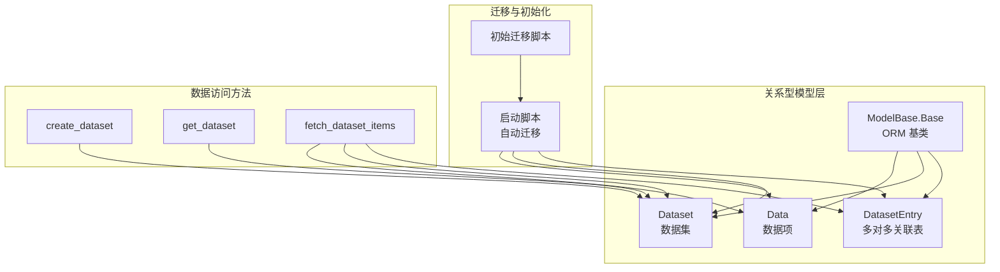
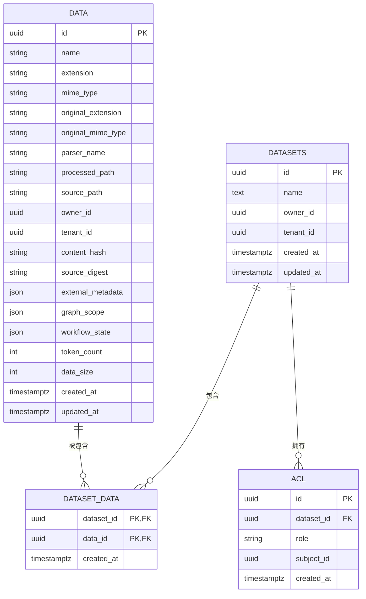
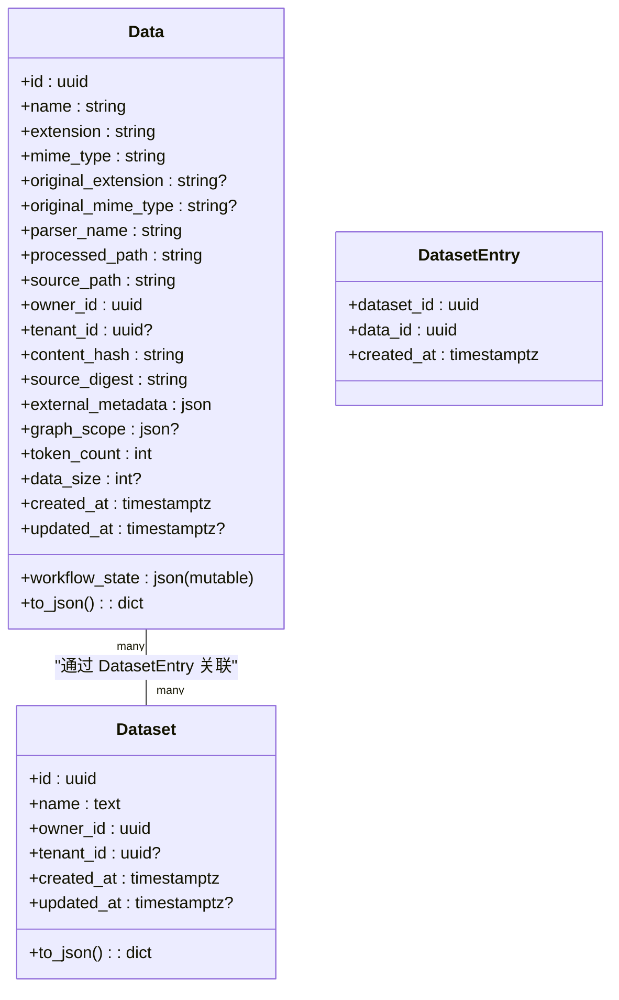
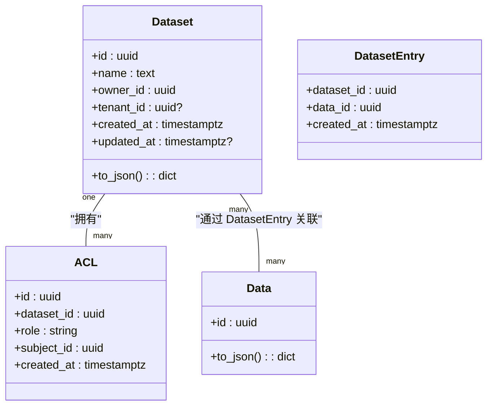
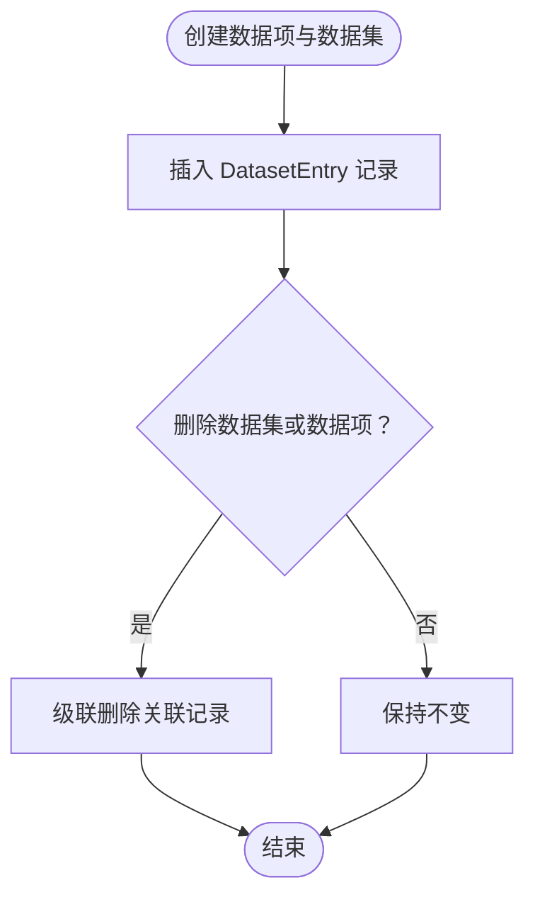
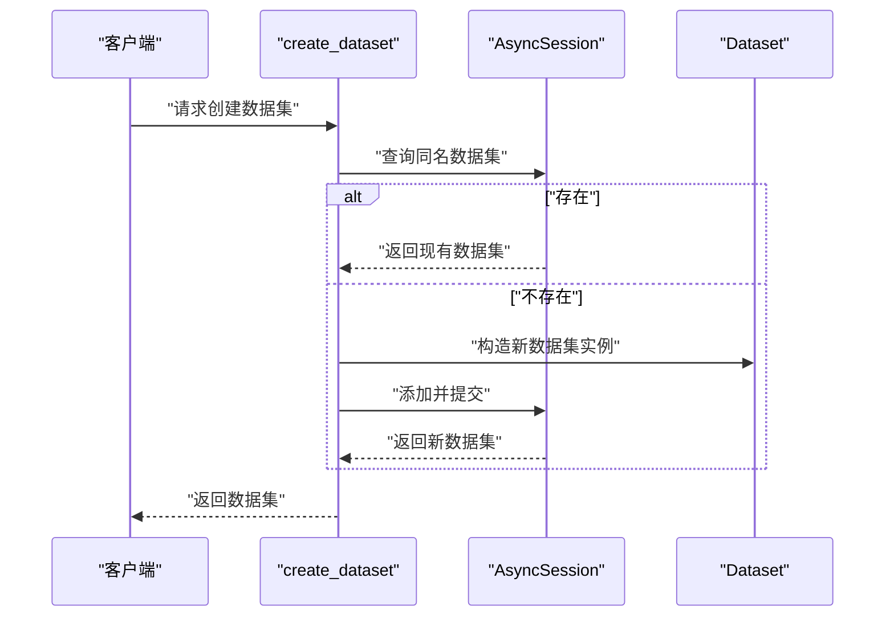
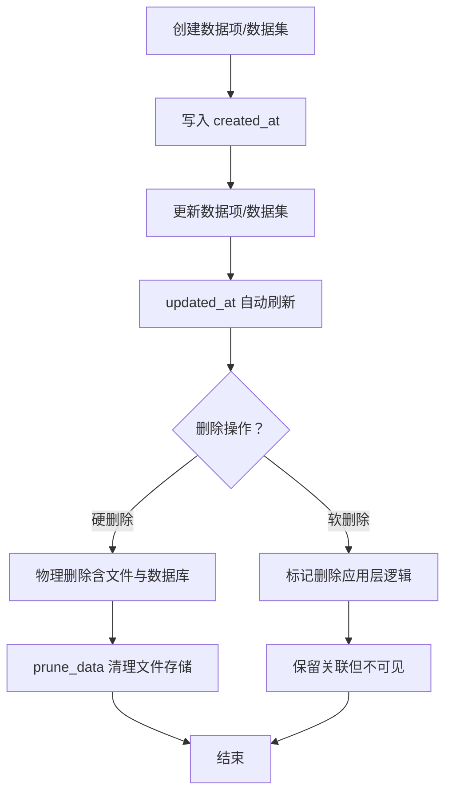
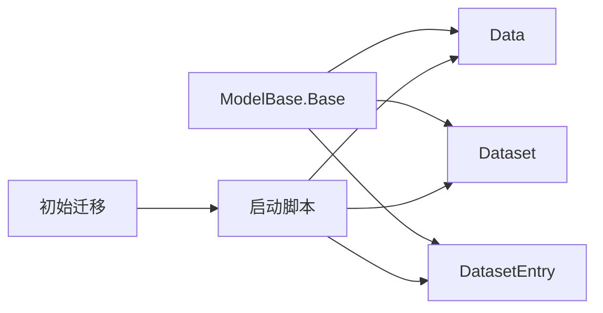

# 数据存储模型

<cite>
**本文引用的文件**
- [Data.py](file://m_flow/data/models/Data.py)
- [Dataset.py](file://m_flow/data/models/Dataset.py)
- [DatasetEntry.py](file://m_flow/data/models/DatasetEntry.py)
- [ModelBase.py](file://m_flow/adapters/relational/ModelBase.py)
- [92b3293baa66_mflow_initial_schema.py](file://alembic/versions/92b3293baa66_mflow_initial_schema.py)
- [create_dataset.py](file://m_flow/data/methods/create_dataset.py)
- [get_dataset.py](file://m_flow/data/methods/get_dataset.py)
- [fetch_dataset_items.py](file://m_flow/data/methods/fetch_dataset_items.py)
- [prune_data.py](file://m_flow/data/deletion/prune_data.py)
- [entrypoint.sh](file://entrypoint.sh)
- [test_deduplication.py](file://m_flow/tests/test_deduplication.py)
- [test_data_setup.py](file://m_flow/tests/test_data_setup.py)
</cite>

## 目录
1. [简介](#简介)
2. [项目结构](#项目结构)
3. [核心组件](#核心组件)
4. [架构总览](#架构总览)
5. [详细组件分析](#详细组件分析)
6. [依赖关系分析](#依赖关系分析)
7. [性能考虑](#性能考虑)
8. [故障排查指南](#故障排查指南)
9. [结论](#结论)
10. [附录](#附录)

## 简介
本文件系统性梳理 M-flow 的数据存储模型，聚焦于三个核心实体：Data（数据项）、Dataset（数据集）与 DatasetEntry（关联表）。文档从模型设计、字段定义、约束与业务规则出发，解释三者之间的关系映射（尤其是多对多关系），给出数据库表结构与字段说明，并覆盖数据生命周期管理（创建、更新、删除、归档）、验证机制与完整性约束、数据访问模式与性能优化策略，最后提供实际使用示例与查询示例，帮助开发者在应用中正确使用这些模型。

## 项目结构
围绕数据存储模型的相关目录与文件如下：
- 关系型 ORM 基类：adapters/relational/ModelBase.py
- 数据模型：data/models/Data.py、data/models/Dataset.py、data/models/DatasetEntry.py
- 初始迁移：alembic/versions/92b3293baa66_mflow_initial_schema.py
- 数据访问方法：data/methods/create_dataset.py、data/methods/get_dataset.py、data/methods/fetch_dataset_items.py
- 数据清理：data/deletion/prune_data.py
- 启动与迁移：entrypoint.sh
- 测试与示例：tests/test_deduplication.py、tests/test_data_setup.py

图表来源
- [ModelBase.py:14-23](file://m_flow/adapters/relational/ModelBase.py#L14-L23)
- [Data.py:35-129](file://m_flow/data/models/Data.py#L35-L129)
- [Dataset.py:33-88](file://m_flow/data/models/Dataset.py#L33-L88)
- [DatasetEntry.py:19-37](file://m_flow/data/models/DatasetEntry.py#L19-L37)
- [92b3293baa66_mflow_initial_schema.py:24-29](file://alembic/versions/92b3293baa66_mflow_initial_schema.py#L24-L29)
- [entrypoint.sh:13-35](file://entrypoint.sh#L13-L35)
- [create_dataset.py:18-66](file://m_flow/data/methods/create_dataset.py#L18-L66)
- [get_dataset.py:13-37](file://m_flow/data/methods/get_dataset.py#L13-L37)
- [fetch_dataset_items.py:14-32](file://m_flow/data/methods/fetch_dataset_items.py#L14-L32)

章节来源
- [ModelBase.py:1-24](file://m_flow/adapters/relational/ModelBase.py#L1-L24)
- [Data.py:1-156](file://m_flow/data/models/Data.py#L1-L156)
- [Dataset.py:1-111](file://m_flow/data/models/Dataset.py#L1-L111)
- [DatasetEntry.py:1-37](file://m_flow/data/models/DatasetEntry.py#L1-L37)
- [92b3293baa66_mflow_initial_schema.py:1-30](file://alembic/versions/92b3293baa66_mflow_initial_schema.py#L1-L30)
- [entrypoint.sh:1-44](file://entrypoint.sh#L1-L44)
- [create_dataset.py:1-66](file://m_flow/data/methods/create_dataset.py#L1-L66)
- [get_dataset.py:1-37](file://m_flow/data/methods/get_dataset.py#L1-L37)
- [fetch_dataset_items.py:1-32](file://m_flow/data/methods/fetch_dataset_items.py#L1-L32)

## 核心组件
本节概述三个核心模型的职责与关键属性。

- Data（数据项）
  - 表名：data
  - 主键：id（UUID）
  - 文件元数据：name、extension、mime_type、original_extension、original_mime_type、parser_name
  - 存储路径：processed_path、source_path
  - 所有权：owner_id（UUID，索引）、tenant_id（UUID，可空，索引）
  - 内容追踪：content_hash、source_digest、external_metadata（JSON）、graph_scope（JSON，可空）、workflow_state（JSON，MutableDict）
  - 文本统计：token_count（整数）、data_size（整数，可空）
  - 时间戳：created_at、updated_at（UTC，带时区）
  - 关系：与 Dataset 通过中间表 DatasetEntry 建立多对多关系；反向关系 back_populates 到 Dataset.data

- Dataset（数据集）
  - 表名：datasets
  - 主键：id（UUID）
  - 属性：name（文本）、owner_id（UUID，索引）、tenant_id（UUID，可空，索引）
  - 时间戳：created_at、updated_at（UTC，带时区）
  - 关系：与 ACL 建立一对多（级联删除或phans）；与 Data 通过 DatasetEntry 建立多对多关系；反向关系 back_populates 到 Data.datasets

- DatasetEntry（多对多关联表）
  - 表名：dataset_data
  - 复合主键：dataset_id、data_id（均为 UUID，外键，级联删除）
  - 时间戳：created_at（UTC，带时区）

章节来源
- [Data.py:35-129](file://m_flow/data/models/Data.py#L35-L129)
- [Dataset.py:33-88](file://m_flow/data/models/Dataset.py#L33-L88)
- [DatasetEntry.py:19-37](file://m_flow/data/models/DatasetEntry.py#L19-L37)

## 架构总览
下图展示了数据模型在关系型数据库中的结构与关系映射，以及启动时的迁移与初始化流程。

图表来源
- [Dataset.py:61-88](file://m_flow/data/models/Dataset.py#L61-L88)
- [Data.py:88-129](file://m_flow/data/models/Data.py#L88-L129)
- [DatasetEntry.py:24-37](file://m_flow/data/models/DatasetEntry.py#L24-L37)

## 详细组件分析

### Data 模型
- 设计要点
  - 作为“已处理内容项”的统一抽象，承载文件元数据、解析器信息、所有权、内容指纹与处理状态。
  - 使用 MutableDict 包装 JSON 字段以支持可变字典的变更跟踪。
  - created_at 默认值为当前 UTC 时间，updated_at 在每次更新时自动刷新。
- 字段与约束
  - 主键 id：默认生成 UUID。
  - 文件与格式：name、extension、mime_type、original_* 系列、parser_name。
  - 路径：processed_path、source_path。
  - 所有权：owner_id（索引）、tenant_id（索引，可空）。
  - 内容指纹与元数据：content_hash、source_digest、external_metadata（JSON）、graph_scope（JSON，可空）、workflow_state（JSON，MutableDict）。
  - 统计：token_count、data_size。
  - 时间戳：created_at、updated_at。
- 关系
  - 与 Dataset 通过 DatasetEntry 建立多对多；back_populates 到 Dataset.data。
  - 关系加载策略为 lazy="noload"，避免在默认序列化时触发额外查询。
- 序列化
  - 提供 to_json 方法，输出标准化字段，含 ISO Z 结尾的时间格式转换。

图表来源
- [Data.py:35-129](file://m_flow/data/models/Data.py#L35-L129)
- [Dataset.py:33-88](file://m_flow/data/models/Dataset.py#L33-L88)
- [DatasetEntry.py:19-37](file://m_flow/data/models/DatasetEntry.py#L19-L37)

章节来源
- [Data.py:35-156](file://m_flow/data/models/Data.py#L35-L156)

### Dataset 模型
- 设计要点
  - 作为用户内容的组织单元，支持按用户与租户隔离。
  - 与 ACL 建立一对多关系，支持权限控制。
  - 与 Data 通过 DatasetEntry 建立多对多关系，支持数据项的灵活组合。
- 字段与约束
  - 主键 id：默认生成 UUID。
  - 名称与归属：name（文本）、owner_id（索引）、tenant_id（索引，可空）。
  - 时间戳：created_at、updated_at。
- 关系
  - acls：一对多，级联删除或孤儿对象。
  - data：多对多，通过 DatasetEntry 关联，back_populates 到 Data.datasets。
- 序列化
  - 提供 to_json 方法，输出包含 data 列表的结构化数据。

图表来源
- [Dataset.py:33-111](file://m_flow/data/models/Dataset.py#L33-L111)
- [DatasetEntry.py:19-37](file://m_flow/data/models/DatasetEntry.py#L19-L37)

章节来源
- [Dataset.py:33-111](file://m_flow/data/models/Dataset.py#L33-L111)

### DatasetEntry 模型（多对多关联）
- 设计要点
  - 作为 Dataset 与 Data 的中间表，承担复合主键与级联删除策略。
  - 记录创建时间 created_at，便于审计与排序。
- 字段与约束
  - dataset_id、data_id：复合主键，均为外键，删除时级联删除。
  - created_at：UTC 时间戳。

图表来源
- [DatasetEntry.py:19-37](file://m_flow/data/models/DatasetEntry.py#L19-L37)

章节来源
- [DatasetEntry.py:19-37](file://m_flow/data/models/DatasetEntry.py#L19-L37)

### 数据访问与生命周期

#### 创建数据集
- 典型流程
  - 根据名称、用户与租户查找现有数据集；若存在则返回，否则创建新数据集并持久化。
  - 使用 joinedload 预加载 data 关系，减少后续查询。
- 关键点
  - 通过 get_unique_dataset_id 生成唯一 ID（由外部逻辑保障）。
  - owner_id 与 tenant_id 用于多租户隔离。

图表来源
- [create_dataset.py:18-66](file://m_flow/data/methods/create_dataset.py#L18-L66)

章节来源
- [create_dataset.py:1-66](file://m_flow/data/methods/create_dataset.py#L1-L66)

#### 获取数据集
- 权限校验
  - 通过 sess.get(Dataset, dataset_id) 加载后，校验 owner_id 是否匹配当前用户。
- 返回值
  - 若不匹配或不存在，返回 None。

章节来源
- [get_dataset.py:1-37](file://m_flow/data/methods/get_dataset.py#L1-L37)

#### 查询数据集中的数据项
- 功能
  - 支持按数据集 ID 查询其下的数据项，并按 data_size 降序排列。
  - 可选传入 data_ids 进行子集过滤，避免大表全 JOIN。
- 性能
  - 使用 join(Data.datasets) 限定范围，结合 order_by 与可选 in_ 条件，降低查询成本。

章节来源
- [fetch_dataset_items.py:1-32](file://m_flow/data/methods/fetch_dataset_items.py#L1-L32)

#### 数据生命周期管理
- 创建
  - Data 与 Dataset 均在创建时写入 created_at；Dataset 在更新时写入 updated_at。
- 更新
  - Data 的 updated_at 在每次更新时刷新；Dataset 的 updated_at 同步更新。
- 删除
  - DatasetEntry 的外键采用 CASCADE 删除策略，删除数据集或数据项会级联删除关联记录。
  - 删除数据项时，可通过 API 参数选择软删除或硬删除（前端类型定义中包含 soft/hard 选项）。
- 归档与清理
  - prune_data 会清空文件存储根目录下的全部数据文件。
  - entrypoint.sh 在容器启动时执行 Alembic 升级，确保模式一致。

图表来源
- [Data.py:118-121](file://m_flow/data/models/Data.py#L118-L121)
- [Dataset.py:71-74](file://m_flow/data/models/Dataset.py#L71-L74)
- [DatasetEntry.py:26-35](file://m_flow/data/models/DatasetEntry.py#L26-L35)
- [prune_data.py:8-14](file://m_flow/data/deletion/prune_data.py#L8-L14)
- [entrypoint.sh:13-35](file://entrypoint.sh#L13-L35)

章节来源
- [Data.py:118-121](file://m_flow/data/models/Data.py#L118-L121)
- [Dataset.py:71-74](file://m_flow/data/models/Dataset.py#L71-L74)
- [DatasetEntry.py:26-35](file://m_flow/data/models/DatasetEntry.py#L26-L35)
- [prune_data.py:1-14](file://m_flow/data/deletion/prune_data.py#L1-L14)
- [entrypoint.sh:13-35](file://entrypoint.sh#L13-L35)

#### 数据验证与完整性约束
- 外键约束
  - DatasetEntry 的 dataset_id 与 data_id 均为外键，删除时 CASCADE，保证引用完整性。
- 唯一性与去重
  - 测试中验证同一数据实体可被两个不同数据集共享，且通过 content_hash 与 source_digest 实现内容去重（测试中计算哈希并断言关系）。
- 时间戳一致性
  - 使用 UTC 时区时间戳，统一输出格式，避免 Postgres 时区格式差异导致的字符串拼接问题。

章节来源
- [DatasetEntry.py:26-35](file://m_flow/data/models/DatasetEntry.py#L26-L35)
- [test_deduplication.py:76-105](file://m_flow/tests/test_deduplication.py#L76-L105)

#### 数据访问模式与性能优化
- 预加载与懒加载
  - Data.datasets 与 Dataset.data 的关系默认 lazy="noload"，避免在序列化时触发额外查询。
  - create_dataset 使用 joinedload 预加载 data，减少 N+1 查询风险。
- 查询优化
  - fetch_dataset_items 对数据项按 data_size 降序排序，有利于大文件优先处理。
  - 支持 data_ids 子集过滤，避免大表 JOIN。
- 异步与基类
  - ModelBase 继承 AsyncAttrs，配合异步会话，提升并发性能。

章节来源
- [Data.py:122-129](file://m_flow/data/models/Data.py#L122-L129)
- [Dataset.py:82-88](file://m_flow/data/models/Dataset.py#L82-L88)
- [create_dataset.py:38-46](file://m_flow/data/methods/create_dataset.py#L38-L46)
- [fetch_dataset_items.py:18-31](file://m_flow/data/methods/fetch_dataset_items.py#L18-L31)
- [ModelBase.py:14-23](file://m_flow/adapters/relational/ModelBase.py#L14-L23)

## 依赖关系分析
- 模型依赖
  - Data 与 Dataset 均继承自 Base（ModelBase），确保统一的 ORM 行为与异步属性。
  - Dataset 与 ACL 为一对多关系；Dataset 与 Data 通过 DatasetEntry 建立多对多。
- 迁移与初始化
  - 初始迁移脚本为占位版本，实际模式由应用启动时创建。
  - entrypoint.sh 在容器启动时执行 Alembic 升级，确保数据库模式与代码一致。

图表来源
- [ModelBase.py:14-23](file://m_flow/adapters/relational/ModelBase.py#L14-L23)
- [Data.py:21-24](file://m_flow/data/models/Data.py#L21-L24)
- [Dataset.py:19-22](file://m_flow/data/models/Dataset.py#L19-L22)
- [DatasetEntry.py](file://m_flow/data/models/DatasetEntry.py#L12)
- [92b3293baa66_mflow_initial_schema.py:24-29](file://alembic/versions/92b3293baa66_mflow_initial_schema.py#L24-L29)
- [entrypoint.sh:13-35](file://entrypoint.sh#L13-L35)

章节来源
- [ModelBase.py:1-24](file://m_flow/adapters/relational/ModelBase.py#L1-L24)
- [Data.py:1-28](file://m_flow/data/models/Data.py#L1-L28)
- [Dataset.py:1-26](file://m_flow/data/models/Dataset.py#L1-L26)
- [DatasetEntry.py:1-13](file://m_flow/data/models/DatasetEntry.py#L1-L13)
- [92b3293baa66_mflow_initial_schema.py:1-30](file://alembic/versions/92b3293baa66_mflow_initial_schema.py#L1-L30)
- [entrypoint.sh:1-44](file://entrypoint.sh#L1-L44)

## 性能考虑
- 关系加载策略
  - Data.datasets 与 Dataset.data 默认 lazy="noload"，避免序列化时触发额外查询。
  - create_dataset 使用 joinedload 预加载 data，减少后续查询。
- 查询优化
  - fetch_dataset_items 支持按 data_ids 过滤与按 data_size 排序，降低大表 JOIN 成本。
- 异步与基类
  - ModelBase 继承 AsyncAttrs，配合异步会话，提升高并发场景下的吞吐。
- 时间戳与序列化
  - 统一 UTC 时间戳与 ISO Z 输出格式，避免时区转换开销与格式歧义。

## 故障排查指南
- 启动阶段迁移失败
  - entrypoint.sh 在 Alembic 升级失败时回退到直接初始化，检查数据库连接与权限。
- 数据重复与去重
  - 使用 content_hash 与 source_digest 进行内容去重；测试中通过哈希计算与断言验证共享数据的一致性。
- 删除行为确认
  - 确认 API 请求参数中的删除模式（soft/hard），并结合前端类型定义进行调用。
- 文件清理
  - prune_data 会清空文件存储根目录，请谨慎执行并在备份后操作。

章节来源
- [entrypoint.sh:13-35](file://entrypoint.sh#L13-L35)
- [test_deduplication.py:76-105](file://m_flow/tests/test_deduplication.py#L76-L105)
- [prune_data.py:8-14](file://m_flow/data/deletion/prune_data.py#L8-L14)

## 结论
M-flow 的数据存储模型以清晰的三层结构（Data、Dataset、DatasetEntry）为核心，通过中间表实现多对多关系，辅以外键级联删除策略与合理的加载策略，既满足业务灵活性，又兼顾性能与一致性。结合统一的 UTC 时间戳、可变 JSON 字段与异步 ORM 基类，整体设计具备良好的扩展性与可维护性。在实际使用中，建议遵循预加载策略、按需过滤与统一时间格式等最佳实践，以获得更优的查询与序列化性能。

## 附录

### 数据库表结构与字段说明
- data 表
  - id：主键（UUID）
  - name、extension、mime_type、original_extension、original_mime_type、parser_name：文件与格式信息
  - processed_path、source_path：处理后与原始路径
  - owner_id、tenant_id：所有权与租户（索引）
  - content_hash、source_digest、external_metadata、graph_scope、workflow_state：内容指纹与元数据
  - token_count、data_size：文本统计
  - created_at、updated_at：时间戳（UTC）

- datasets 表
  - id：主键（UUID）
  - name：名称（文本）
  - owner_id、tenant_id：所有权与租户（索引）
  - created_at、updated_at：时间戳（UTC）

- dataset_data 表（中间表）
  - dataset_id、data_id：复合主键（外键，CASCADE）
  - created_at：时间戳（UTC）

章节来源
- [Data.py:88-129](file://m_flow/data/models/Data.py#L88-L129)
- [Dataset.py:61-88](file://m_flow/data/models/Dataset.py#L61-L88)
- [DatasetEntry.py:24-37](file://m_flow/data/models/DatasetEntry.py#L24-L37)

### 实际使用示例与查询示例
- 创建数据集
  - 调用 create_dataset，传入 dataset_name、User 与 AsyncSession，返回 Dataset 实例。
  - 若同名数据集已存在，则返回现有实例，避免重复创建。
- 获取数据集
  - 调用 get_dataset，传入 user_id 与 dataset_id，返回 Dataset 或 None（权限校验失败）。
- 查询数据集中的数据项
  - 调用 fetch_dataset_items，传入 dataset_id 与可选 data_ids，返回按 data_size 降序的数据项列表。
- 测试数据准备与清理
  - 使用 test_data_setup 提供的工具函数准备/清理测试数据，支持并行隔离与批量清理。

章节来源
- [create_dataset.py:18-66](file://m_flow/data/methods/create_dataset.py#L18-L66)
- [get_dataset.py:13-37](file://m_flow/data/methods/get_dataset.py#L13-L37)
- [fetch_dataset_items.py:14-32](file://m_flow/data/methods/fetch_dataset_items.py#L14-L32)
- [test_data_setup.py:54-107](file://m_flow/tests/test_data_setup.py#L54-L107)