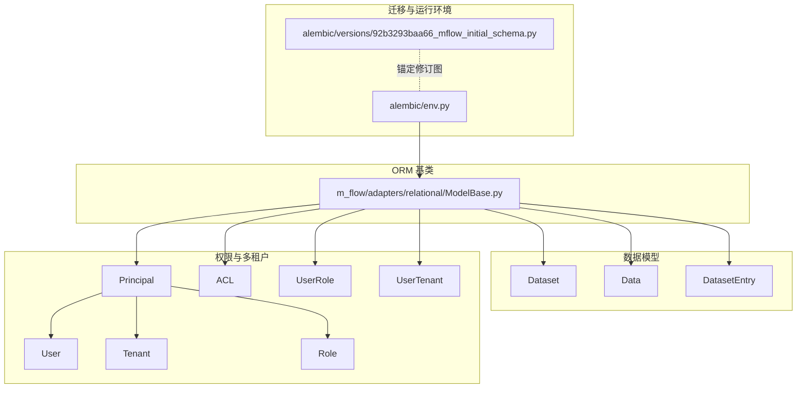
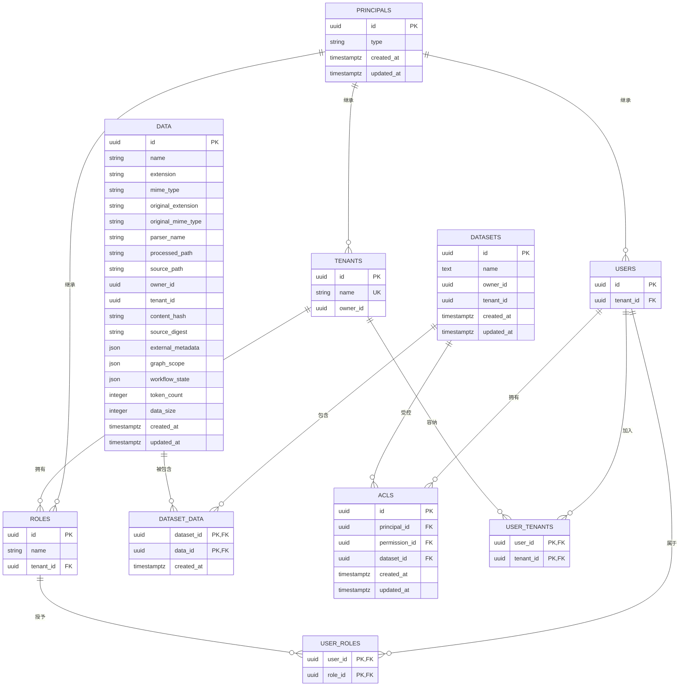
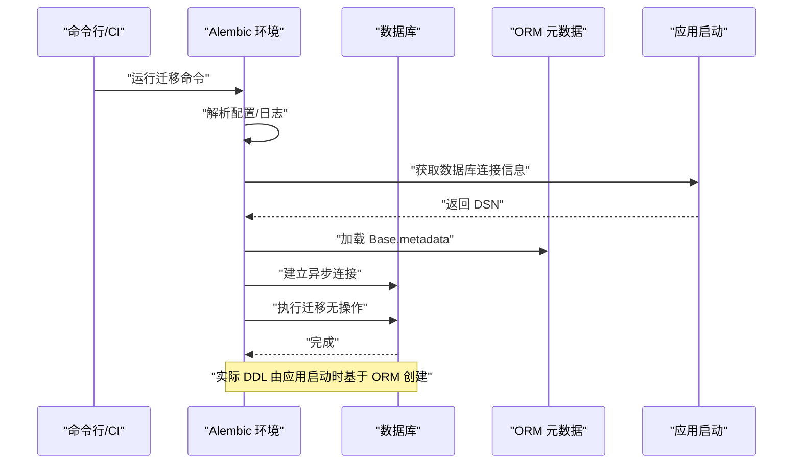
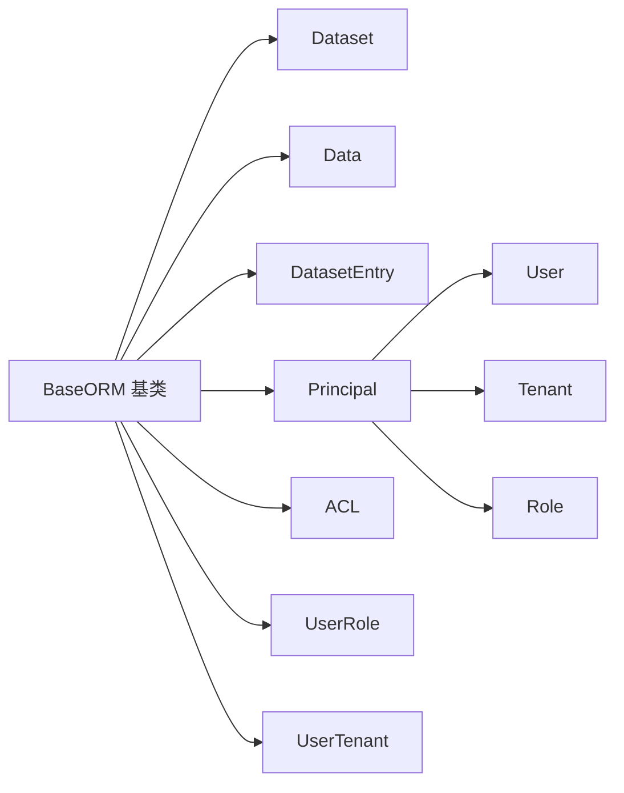

# 数据库模式

<cite>
**本文引用的文件**
- [92b3293baa66_mflow_initial_schema.py](file://alembic/versions/92b3293baa66_mflow_initial_schema.py)
- [env.py](file://alembic/env.py)
- [ModelBase.py](file://m_flow/adapters/relational/ModelBase.py)
- [Dataset.py](file://m_flow/data/models/Dataset.py)
- [Data.py](file://m_flow/data/models/Data.py)
- [DatasetEntry.py](file://m_flow/data/models/DatasetEntry.py)
- [Principal.py](file://m_flow/auth/models/Principal.py)
- [User.py](file://m_flow/auth/models/User.py)
- [Tenant.py](file://m_flow/auth/models/Tenant.py)
- [Role.py](file://m_flow/auth/models/Role.py)
- [ACL.py](file://m_flow/auth/models/ACL.py)
- [UserRole.py](file://m_flow/auth/models/UserRole.py)
- [UserTenant.py](file://m_flow/auth/models/UserTenant.py)
</cite>

## 目录
1. [简介](#简介)
2. [项目结构](#项目结构)
3. [核心组件](#核心组件)
4. [架构总览](#架构总览)
5. [详细组件分析](#详细组件分析)
6. [依赖分析](#依赖分析)
7. [性能考量](#性能考量)
8. [故障排查指南](#故障排查指南)
9. [结论](#结论)
10. [附录](#附录)

## 简介
本文件系统性梳理 M-flow 的数据库模式与迁移机制，聚焦 Alembic 初始迁移版本所锚定的数据库结构。根据仓库信息可知，当前初始迁移采用“引导式”策略：数据库结构由应用启动时通过 SQLAlchemy ORM 模型一次性创建，Alembic 的该初始版本仅作为修订图锚点，不执行实际的 DDL 变更。本文将逐表说明设计目的、字段语义、约束与索引策略，并给出 ER 关系图与典型流程图，帮助读者理解如何在不同环境部署与维护数据库结构。

## 项目结构
围绕数据库模式的关键文件分布如下：
- Alembic 引导迁移与运行环境
  - alembic/versions/92b3293baa66_mflow_initial_schema.py：初始修订，声明锚点并标注“无操作”
  - alembic/env.py：异步迁移运行器，连接数据库并驱动迁移
- ORM 基类
  - m_flow/adapters/relational/ModelBase.py：统一的 DeclarativeBase 抽象基类
- 数据集与数据模型
  - m_flow/data/models/Dataset.py：数据集实体
  - m_flow/data/models/Data.py：数据项实体
  - m_flow/data/models/DatasetEntry.py：数据集-数据的多对多关联表
- 安全与权限模型（多租户）
  - m_flow/auth/models/Principal.py：安全主体基类（单表多态）
  - m_flow/auth/models/User.py：用户实体
  - m_flow/auth/models/Tenant.py：租户实体
  - m_flow/auth/models/Role.py：角色实体
  - m_flow/auth/models/ACL.py：访问控制列表
  - m_flow/auth/models/UserRole.py：用户-角色关联
  - m_flow/auth/models/UserTenant.py：用户-租户关联

**图表来源**
- [92b3293baa66_mflow_initial_schema.py:1-30](file://alembic/versions/92b3293baa66_mflow_initial_schema.py#L1-L30)
- [env.py:1-64](file://alembic/env.py#L1-L64)
- [ModelBase.py:1-24](file://m_flow/adapters/relational/ModelBase.py#L1-L24)
- [Dataset.py:1-111](file://m_flow/data/models/Dataset.py#L1-L111)
- [Data.py:1-156](file://m_flow/data/models/Data.py#L1-L156)
- [DatasetEntry.py:1-37](file://m_flow/data/models/DatasetEntry.py#L1-L37)
- [Principal.py:1-36](file://m_flow/auth/models/Principal.py#L1-L36)
- [User.py:1-87](file://m_flow/auth/models/User.py#L1-L87)
- [Tenant.py:1-74](file://m_flow/auth/models/Tenant.py#L1-L74)
- [Role.py:1-48](file://m_flow/auth/models/Role.py#L1-L48)
- [ACL.py:1-38](file://m_flow/auth/models/ACL.py#L1-L38)
- [UserRole.py:1-29](file://m_flow/auth/models/UserRole.py#L1-L29)
- [UserTenant.py:1-29](file://m_flow/auth/models/UserTenant.py#L1-L29)

**章节来源**
- [92b3293baa66_mflow_initial_schema.py:1-30](file://alembic/versions/92b3293baa66_mflow_initial_schema.py#L1-L30)
- [env.py:1-64](file://alembic/env.py#L1-L64)
- [ModelBase.py:1-24](file://m_flow/adapters/relational/ModelBase.py#L1-L24)

## 核心组件
- 初始迁移（锚点）：声明修订 ID 并标注“无操作”，用于固定后续增量迁移的 down_revision 关系。
- 运行环境：异步迁移运行器，从配置解析数据库连接字符串，加载 ORM 元数据并执行迁移。
- ORM 基类：统一的 DeclarativeBase，确保所有关系型模型具备一致的元数据与异步属性支持。
- 数据模型族：数据集、数据项与其多对多关联表构成内容组织的核心；配合权限与多租户模型实现细粒度访问控制。

**章节来源**
- [92b3293baa66_mflow_initial_schema.py:1-30](file://alembic/versions/92b3293baa66_mflow_initial_schema.py#L1-L30)
- [env.py:1-64](file://alembic/env.py#L1-L64)
- [ModelBase.py:1-24](file://m_flow/adapters/relational/ModelBase.py#L1-L24)

## 架构总览
下图展示数据库模式的整体关系：数据模型（数据集-数据）与权限模型（主体-用户-租户-角色-ACL）相互独立但通过外键建立逻辑关联，满足多租户与细粒度权限控制需求。

**图表来源**
- [Principal.py:1-36](file://m_flow/auth/models/Principal.py#L1-L36)
- [User.py:1-87](file://m_flow/auth/models/User.py#L1-L87)
- [Tenant.py:1-74](file://m_flow/auth/models/Tenant.py#L1-L74)
- [Role.py:1-48](file://m_flow/auth/models/Role.py#L1-L48)
- [Dataset.py:1-111](file://m_flow/data/models/Dataset.py#L1-L111)
- [Data.py:1-156](file://m_flow/data/models/Data.py#L1-L156)
- [DatasetEntry.py:1-37](file://m_flow/data/models/DatasetEntry.py#L1-L37)
- [ACL.py:1-38](file://m_flow/auth/models/ACL.py#L1-L38)
- [UserRole.py:1-29](file://m_flow/auth/models/UserRole.py#L1-L29)
- [UserTenant.py:1-29](file://m_flow/auth/models/UserTenant.py#L1-L29)

## 详细组件分析

### 数据集（Datasets）
- 设计目的：作为用户内容的容器，用于分组相关数据项，支持按用户与租户进行隔离。
- 主键：id（UUID）
- 字段与约束：
  - name：文本字段，用于人类可读名称
  - owner_id：UUID，索引，标识所属用户
  - tenant_id：UUID，可空，索引，标识所属租户
  - 时间戳：created_at、updated_at，带时区
- 关系：
  - 与 Data 通过中间表 dataset_data 多对多关联
  - 与 ACL 一对多（级联删除或孤儿对象处理）

**章节来源**
- [Dataset.py:1-111](file://m_flow/data/models/Dataset.py#L1-L111)

### 数据项（Data）
- 设计目的：记录经摄取管线处理后的单个内容项，保存其元数据、存储位置与处理状态。
- 主键：id（UUID）
- 字段与约束：
  - 文件与格式：name、extension、mime_type、original_*、parser_name
  - 存储路径：processed_path、source_path
  - 所有权：owner_id（索引）、tenant_id（可空，索引）
  - 内容指纹：content_hash、source_digest
  - 结构化数据：external_metadata（JSON）、graph_scope（JSON，可空）、workflow_state（JSON，MutableDict）
  - 文档统计：token_count、data_size（可空）
  - 时间戳：created_at、updated_at
- 关系：
  - 与 Dataset 通过中间表 dataset_data 多对多关联

**章节来源**
- [Data.py:1-156](file://m_flow/data/models/Data.py#L1-L156)

### 数据集-数据关联（dataset_data）
- 设计目的：实现数据集与数据项之间的多对多关系，同时记录加入时间。
- 主键：(dataset_id, data_id)
- 外键约束：
  - dataset_id → datasets.id（级联删除）
  - data_id → data.id（级联删除）
- 时间戳：created_at

**章节来源**
- [DatasetEntry.py:1-37](file://m_flow/data/models/DatasetEntry.py#L1-L37)

### 权限主体（Principals）
- 设计目的：单表多态基类，承载用户、租户、角色等安全主体的共同属性。
- 主键：id（UUID，索引）
- 字段：type（多态标识）、created_at、updated_at

**章节来源**
- [Principal.py:1-36](file://m_flow/auth/models/Principal.py#L1-L36)

### 用户（Users）
- 设计目的：注册用户，继承自 Principal，支持多租户与角色授权。
- 主键：id（UUID，外键指向 principals.id，级联删除）
- 字段：tenant_id（外键到 tenants.id）
- 关系：
  - 与 Role 通过 user_roles 多对多
  - 与 Tenant 通过 user_tenants 多对多
  - 与 ACL 一对多（级联删除）

**章节来源**
- [User.py:1-87](file://m_flow/auth/models/User.py#L1-L87)

### 租户（Tenants）
- 设计目的：组织级隔离单元，支持多租户资源边界。
- 主键：id（UUID，外键指向 principals.id）
- 字段：name（唯一、索引）、owner_id（索引）
- 关系：
  - 与 User 通过 user_tenants 多对多
  - 与 Role 一对多

**章节来源**
- [Tenant.py:1-74](file://m_flow/auth/models/Tenant.py#L1-L74)

### 角色（Roles）
- 设计目的：在租户范围内组织权限集合。
- 主键：id（UUID，外键指向 principals.id）
- 字段：name（索引）、tenant_id（外键到 tenants.id，非空）
- 约束：tenant_id + name 唯一
- 关系：
  - 与 User 通过 user_roles 多对多
  - 与 Tenant 一对多

**章节来源**
- [Role.py:1-48](file://m_flow/auth/models/Role.py#L1-L48)

### 访问控制（ACLs）
- 设计目的：将主体（用户/组/服务账号）与权限绑定至特定数据集。
- 主键：id（UUID）
- 外键：principal_id（principals.id）、permission_id（permissions.id）、dataset_id（datasets.id，级联删除）
- 时间戳：created_at、updated_at
- 关系：
  - 与 Principal、Permission、Dataset 的关系

**章节来源**
- [ACL.py:1-38](file://m_flow/auth/models/ACL.py#L1-L38)

### 关联表
- user_roles：用户-角色多对多
- user_tenants：用户-租户多对多

**章节来源**
- [UserRole.py:1-29](file://m_flow/auth/models/UserRole.py#L1-L29)
- [UserTenant.py:1-29](file://m_flow/auth/models/UserTenant.py#L1-L29)

### 迁移与初始化流程（序列图）

**图表来源**
- [env.py:1-64](file://alembic/env.py#L1-L64)
- [92b3293baa66_mflow_initial_schema.py:1-30](file://alembic/versions/92b3293baa66_mflow_initial_schema.py#L1-L30)

## 依赖分析
- 组件耦合：
  - 所有关系型模型均继承自统一的 Base，保证元数据一致性与异步属性可用性
  - 权限模型与数据模型解耦，通过外键与中间表建立弱耦合关系
- 外部依赖：
  - Alembic 作为迁移框架，env.py 提供异步迁移运行器
  - 应用启动时通过 ORM 创建全部表结构
- 潜在循环依赖：
  - 权限模型之间通过中间表解耦，未见直接循环导入

**图表来源**
- [ModelBase.py:1-24](file://m_flow/adapters/relational/ModelBase.py#L1-L24)
- [Dataset.py:1-111](file://m_flow/data/models/Dataset.py#L1-L111)
- [Data.py:1-156](file://m_flow/data/models/Data.py#L1-L156)
- [DatasetEntry.py:1-37](file://m_flow/data/models/DatasetEntry.py#L1-L37)
- [Principal.py:1-36](file://m_flow/auth/models/Principal.py#L1-L36)
- [User.py:1-87](file://m_flow/auth/models/User.py#L1-L87)
- [Tenant.py:1-74](file://m_flow/auth/models/Tenant.py#L1-L74)
- [Role.py:1-48](file://m_flow/auth/models/Role.py#L1-L48)
- [ACL.py:1-38](file://m_flow/auth/models/ACL.py#L1-L38)
- [UserRole.py:1-29](file://m_flow/auth/models/UserRole.py#L1-L29)
- [UserTenant.py:1-29](file://m_flow/auth/models/UserTenant.py#L1-L29)

**章节来源**
- [ModelBase.py:1-24](file://m_flow/adapters/relational/ModelBase.py#L1-L24)
- [env.py:1-64](file://alembic/env.py#L1-L64)

## 性能考量
- 数据类型选择
  - UUID 主键：全局唯一、便于分布式扩展，查询需配合索引
  - JSON/JSONB：灵活存储结构化元数据，适合读多写少场景；写入频繁时建议限制字段数量或拆表
  - String(N)：对长度有限制的字段（如扩展名、MIME 类型）使用定长或上限，减少存储碎片
- 索引策略
  - owner_id、tenant_id 等过滤字段建立索引，提升查询效率
  - 唯一约束（如租户名、角色名+租户组合）避免重复与并发冲突
- 时间戳
  - 使用带时区的时间戳，避免跨时区问题；更新触发器自动维护 updated_at
- 迁移执行
  - 当前初始迁移为“无操作”，实际 DDL 在应用启动时一次性创建，避免 Alembic 频繁变更带来的复杂性

[本节为通用性能指导，无需具体文件引用]

## 故障排查指南
- 迁移无法执行
  - 检查 Alembic 环境是否正确解析数据库连接字符串
  - 确认应用已提供数据库适配器并返回有效 DSN
- 版本锚点问题
  - 若后续新增迁移，请确保 down_revision 指向当前锚点，保持修订图连贯
- 权限与多租户异常
  - 核查用户-租户、用户-角色、主体-ACL 的外键是否完整
  - 确保租户名与角色名组合唯一约束未被破坏
- 启动后表缺失
  - 确认应用启动流程确实在首次运行时调用 ORM 创建表

**章节来源**
- [env.py:1-64](file://alembic/env.py#L1-L64)
- [92b3293baa66_mflow_initial_schema.py:1-30](file://alembic/versions/92b3293baa66_mflow_initial_schema.py#L1-L30)
- [UserTenant.py:1-29](file://m_flow/auth/models/UserTenant.py#L1-L29)
- [UserRole.py:1-29](file://m_flow/auth/models/UserRole.py#L1-L29)
- [ACL.py:1-38](file://m_flow/auth/models/ACL.py#L1-L38)

## 结论
M-flow 的数据库模式以“应用启动时创建表”的方式实现初始结构，Alembic 初始迁移仅作为修订图锚点。数据模型围绕数据集与数据项构建内容组织体系，权限模型通过单表多态与中间表实现多租户与细粒度访问控制。整体设计强调清晰的职责分离与可维护性，适合在多租户与高并发场景下演进。

[本节为总结性内容，无需具体文件引用]

## 附录

### 数据库初始化与迁移命令
- 初始化步骤
  - 确保数据库连接信息已配置并可被应用解析
  - 启动应用，ORM 将根据模型创建所需表结构
- 迁移命令
  - 使用 Alembic 命令行工具执行迁移（例如：升级/降级），当前初始迁移不执行任何 DDL
- 版本管理策略
  - 以当前锚点为基准，后续增量迁移需明确 down_revision，保持修订图稳定
- 升级路径
  - 新增迁移时，遵循 Alembic 规范编写 upgrade/downgrade，确保幂等与回滚能力
- 不同环境部署
  - 开发：本地数据库，启动即创建
  - 测试/生产：通过 CI/CD 在部署阶段运行迁移，结合只读数据库快照验证结构一致性

**章节来源**
- [92b3293baa66_mflow_initial_schema.py:1-30](file://alembic/versions/92b3293baa66_mflow_initial_schema.py#L1-L30)
- [env.py:1-64](file://alembic/env.py#L1-L64)