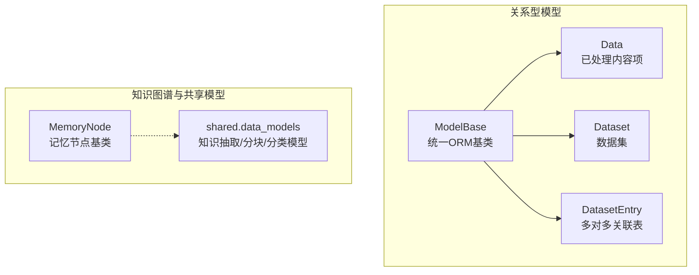
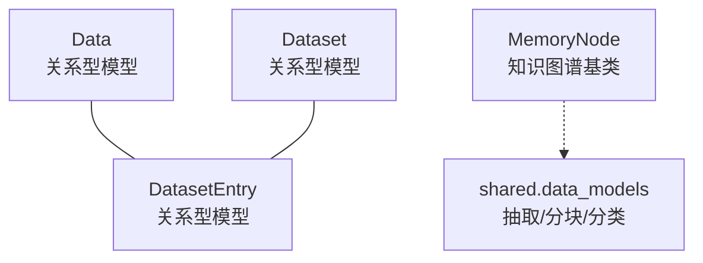
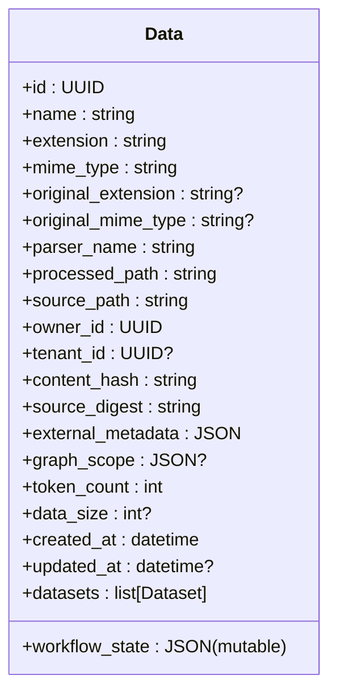
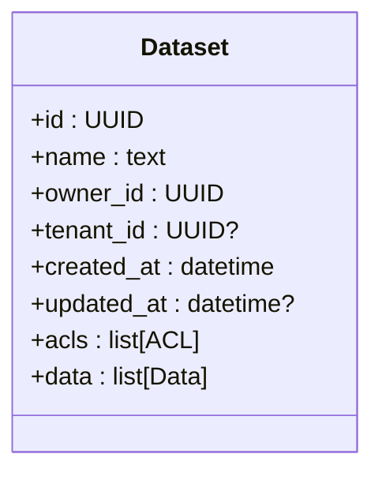
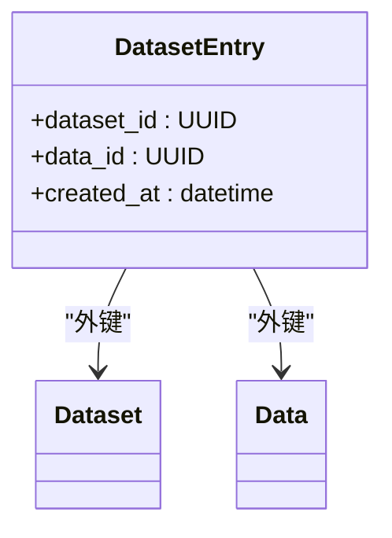
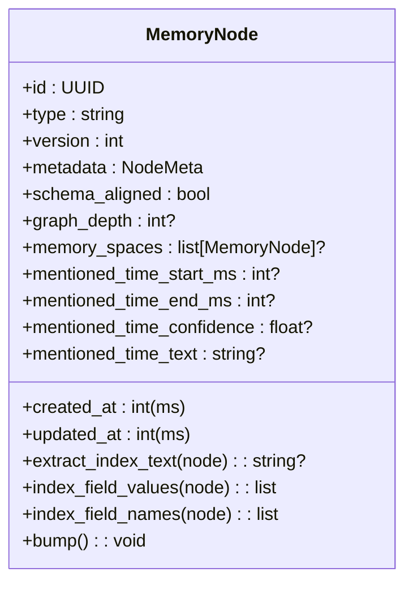
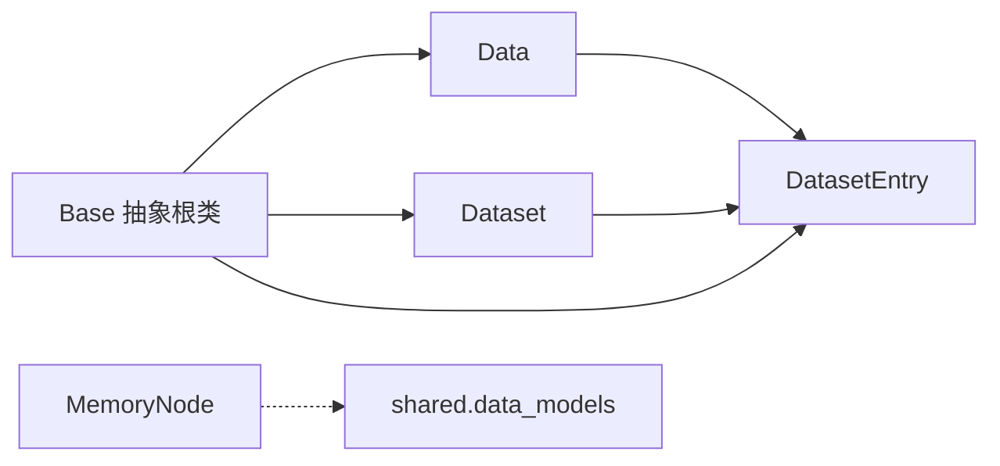
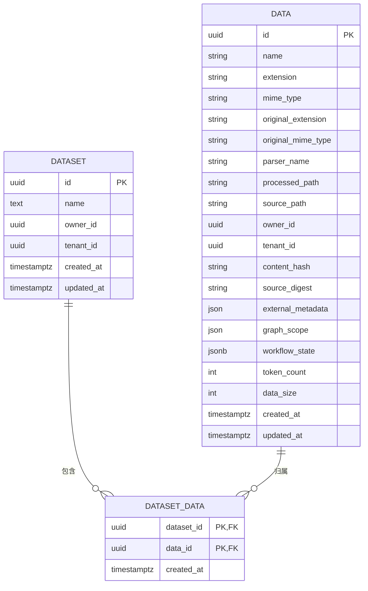
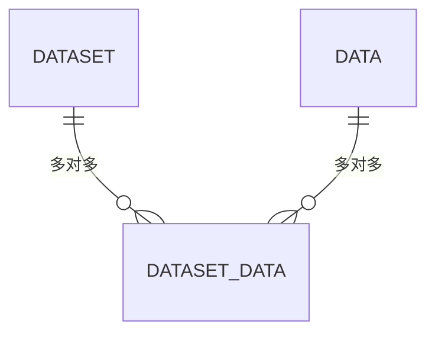

# 数据模型设计

<cite>
**本文引用的文件**
- [m_flow/data/models/Data.py](file://m_flow/data/models/Data.py)
- [m_flow/data/models/Dataset.py](file://m_flow/data/models/Dataset.py)
- [m_flow/data/models/DatasetEntry.py](file://m_flow/data/models/DatasetEntry.py)
- [m_flow/core/models/MemoryNode.py](file://m_flow/core/models/MemoryNode.py)
- [m_flow/shared/data_models.py](file://m_flow/shared/data_models.py)
- [m_flow/adapters/relational/ModelBase.py](file://m_flow/adapters/relational/ModelBase.py)
- [alembic/versions/92b3293baa66_mflow_initial_schema.py](file://alembic/versions/92b3293baa66_mflow_initial_schema.py)
</cite>

## 目录
1. [引言](#引言)
2. [项目结构](#项目结构)
3. [核心组件](#核心组件)
4. [架构总览](#架构总览)
5. [详细组件分析](#详细组件分析)
6. [依赖分析](#依赖分析)
7. [性能考虑](#性能考虑)
8. [故障排查指南](#故障排查指南)
9. [结论](#结论)
10. [附录](#附录)

## 引言
本文件系统性梳理 M-flow 的数据模型设计，聚焦于关系型数据模型与知识图谱模型的核心实体及其关系映射。重点覆盖以下模型：Data（已处理内容项）、Dataset（数据集）、DatasetEntry（多对多关联表）、MemoryNode（记忆节点基类）以及与知识抽取、分块与分类相关的共享数据模型。文档同时给出数据库模式图、实体关系图、数据生命周期管理策略、完整性约束与验证规则、访问模式与查询优化建议、迁移与版本管理方案，并辅以实际使用场景帮助理解。

## 项目结构
围绕数据模型的关键目录与文件如下：
- 关系型模型与基类
  - m_flow/adapters/relational/ModelBase.py：统一的 DeclarativeBase 抽象根类，支持异步属性访问
  - m_flow/data/models/Data.py：已处理内容项模型
  - m_flow/data/models/Dataset.py：数据集模型
  - m_flow/data/models/DatasetEntry.py：数据集与内容项的多对多关联表
- 知识图谱与通用数据模型
  - m_flow/core/models/MemoryNode.py：记忆节点基类（版本化、嵌入辅助）
  - m_flow/shared/data_models.py：知识图谱节点/边、分块策略、内容分类等共享 Pydantic 模型
- 迁移与初始化
  - alembic/versions/92b3293baa66_mflow_initial_schema.py：初始迁移脚本（应用启动时创建模式）

**图表来源**
- [m_flow/adapters/relational/ModelBase.py:14-24](file://m_flow/adapters/relational/ModelBase.py#L14-L24)
- [m_flow/data/models/Data.py:35-156](file://m_flow/data/models/Data.py#L35-L156)
- [m_flow/data/models/Dataset.py:33-111](file://m_flow/data/models/Dataset.py#L33-L111)
- [m_flow/data/models/DatasetEntry.py:19-37](file://m_flow/data/models/DatasetEntry.py#L19-L37)
- [m_flow/core/models/MemoryNode.py:27-106](file://m_flow/core/models/MemoryNode.py#L27-L106)
- [m_flow/shared/data_models.py:24-65](file://m_flow/shared/data_models.py#L24-L65)

**章节来源**
- [m_flow/adapters/relational/ModelBase.py:14-24](file://m_flow/adapters/relational/ModelBase.py#L14-L24)
- [m_flow/data/models/Data.py:35-156](file://m_flow/data/models/Data.py#L35-L156)
- [m_flow/data/models/Dataset.py:33-111](file://m_flow/data/models/Dataset.py#L33-L111)
- [m_flow/data/models/DatasetEntry.py:19-37](file://m_flow/data/models/DatasetEntry.py#L19-L37)
- [m_flow/core/models/MemoryNode.py:27-106](file://m_flow/core/models/MemoryNode.py#L27-L106)
- [m_flow/shared/data_models.py:24-65](file://m_flow/shared/data_models.py#L24-L65)
- [alembic/versions/92b3293baa66_mflow_initial_schema.py:24-30](file://alembic/versions/92b3293baa66_mflow_initial_schema.py#L24-L30)

## 核心组件
本节从“字段定义、数据类型、约束条件、业务规则”四个维度，系统描述核心数据实体。

- Data（已处理内容项）
  - 主键：UUID
  - 文件元数据：名称、扩展名、MIME 类型、原始扩展名/类型
  - 存储位置：处理后路径、原始路径
  - 所有权：owner_id（用户）、tenant_id（租户，可空）
  - 内容追踪：内容哈希、源摘要、外部元数据、图谱作用域、工作流状态、token 数、数据大小
  - 时间戳：创建时间、更新时间
  - 关系：与 Dataset 多对多（通过 DatasetEntry）
  - 业务规则：
    - content_hash 与 source_digest 用于去重与一致性校验
    - workflow_state 为可变 JSON 字典，记录处理流程状态
    - graph_scope 记录与该 Data 关联的图节点集合
    - owner_id 与 tenant_id 支持多租户隔离与权限控制
  - 约束与索引：
    - owner_id、tenant_id 建有索引，便于按用户/租户检索
    - created_at、updated_at 使用带时区的时间戳

- Dataset（数据集）
  - 主键：UUID
  - 属性：名称、所有者 owner_id、租户 tenant_id（可空）
  - 时间戳：创建时间、更新时间
  - 关系：与 Data 多对多（通过 DatasetEntry），与 ACL 一对多（级联删除）
  - 业务规则：
    - 数据集是内容组织的最小单位，支持 ACL 控制访问
    - to_json 序列化包含数据项列表，便于前端展示

- DatasetEntry（多对多关联表）
  - 复合主键：dataset_id、data_id
  - 外键约束：分别引用 datasets.id 与 data.id，删除时级联
  - 时间戳：created_at 记录加入时间
  - 业务规则：实现 Dataset 与 Data 的多对多关联，支持快速查找某数据集下的内容或某内容属于哪些数据集

- MemoryNode（记忆节点基类）
  - 标识：id（UUID）、type（自动从子类名填充）、version（版本号）
  - 元数据：metadata（包含 type 与 index_fields 列表，指示向量化索引字段）
  - 时间戳：created_at、updated_at（毫秒级时间戳）
  - 时序字段：mentioned_time_*（起止时间、置信度、原文片段）
  - 能力：提取索引文本、返回索引字段值与名称、版本递增
  - 业务规则：
    - 作为知识图谱中所有实体的基础模型
    - index_fields 决定向量化索引的内容范围
    - 版本号与更新时间用于并发控制与审计

- shared.data_models（知识抽取/分块/分类）
  - 知识图谱节点/边：KGNode、KGRelation、ExtractedGraph
  - 查询封装：GQLQuery、AnswerPayload
  - 分块策略：ChunkMode、ChunkBackend
  - 摘要结构：GraphSummary、CompressedText、TopicSection、MultiSectionSummary、SectionedSummaryWithProcedural
  - 内容分类：TextCategory、AudioCategory、ImageCategory、VideoCategory、MultimediaCategory、ThreeDCategory、ProceduralCategory
  - 文档/关系辅助：RelationSpec、DocType、CategorySpec、DocMeta、LocationSpec、UserAttrs、GraphModelDefaults
  - 业务规则：
    - 提供统一的知识抽取输出结构与分块策略枚举
    - 支持多种内容类型的细粒度分类，便于检索与路由

**章节来源**
- [m_flow/data/models/Data.py:35-156](file://m_flow/data/models/Data.py#L35-L156)
- [m_flow/data/models/Dataset.py:33-111](file://m_flow/data/models/Dataset.py#L33-L111)
- [m_flow/data/models/DatasetEntry.py:19-37](file://m_flow/data/models/DatasetEntry.py#L19-L37)
- [m_flow/core/models/MemoryNode.py:27-106](file://m_flow/core/models/MemoryNode.py#L27-L106)
- [m_flow/shared/data_models.py:24-65](file://m_flow/shared/data_models.py#L24-L65)
- [m_flow/shared/data_models.py:88-165](file://m_flow/shared/data_models.py#L88-L165)
- [m_flow/shared/data_models.py:248-431](file://m_flow/shared/data_models.py#L248-L431)

## 架构总览
下图展示关系型数据模型与知识图谱模型之间的边界与交互：

**图表来源**
- [m_flow/data/models/Data.py:35-156](file://m_flow/data/models/Data.py#L35-L156)
- [m_flow/data/models/Dataset.py:33-111](file://m_flow/data/models/Dataset.py#L33-L111)
- [m_flow/data/models/DatasetEntry.py:19-37](file://m_flow/data/models/DatasetEntry.py#L19-L37)
- [m_flow/core/models/MemoryNode.py:27-106](file://m_flow/core/models/MemoryNode.py#L27-L106)
- [m_flow/shared/data_models.py:24-65](file://m_flow/shared/data_models.py#L24-L65)

## 详细组件分析

### Data 模型分析
- 字段与类型
  - 标识与元数据：id（UUID）、name（字符串）、extension/mime_type/original_*（字符串）
  - 路径：processed_path/source_path（字符串）
  - 所有权：owner_id/tenant_id（UUID，可空）
  - 内容追踪：content_hash/source_digest（字符串）、external_metadata/workflow_state（JSON/可变字典）、graph_scope（JSON，可空）、token_count/data_size（整数/可空）
  - 时间戳：created_at/updated_at（带时区日期时间）
- 约束与索引
  - owner_id、tenant_id 建有索引，支持按用户/租户过滤
  - JSON 字段用于灵活存储结构化与半结构化元数据
- 业务规则
  - content_hash 与 source_digest 用于内容去重与一致性校验
  - workflow_state 记录处理阶段状态，支持重试与回溯
  - graph_scope 与知识图谱节点建立关联
- 序列化
  - to_json 输出标准化字段，便于 API 返回与前端渲染

**图表来源**
- [m_flow/data/models/Data.py:35-156](file://m_flow/data/models/Data.py#L35-L156)

**章节来源**
- [m_flow/data/models/Data.py:35-156](file://m_flow/data/models/Data.py#L35-L156)

### Dataset 模型分析
- 字段与类型
  - 标识与属性：id（UUID）、name（文本）、owner_id/tenant_id（UUID，可空）
  - 时间戳：created_at/updated_at（带时区日期时间）
  - 关系：acls（一对多，级联删除）、data（多对多，通过 DatasetEntry）
- 约束与索引
  - owner_id、tenant_id 建有索引，支持快速筛选
- 业务规则
  - Dataset 是内容组织的基本单元，支持 ACL 精细化访问控制
  - to_json 序列化包含 data 列表，便于前端展示数据集详情

**图表来源**
- [m_flow/data/models/Dataset.py:33-111](file://m_flow/data/models/Dataset.py#L33-L111)

**章节来源**
- [m_flow/data/models/Dataset.py:33-111](file://m_flow/data/models/Dataset.py#L33-L111)

### DatasetEntry 模型分析
- 字段与类型
  - 复合主键：dataset_id、data_id（均为 UUID）
  - 外键：分别引用 datasets.id 与 data.id，删除时级联
  - 时间戳：created_at（带时区日期时间）
- 业务规则
  - 实现 Dataset 与 Data 的多对多关联，支持快速查询某数据集包含的内容或某内容属于哪些数据集

**图表来源**
- [m_flow/data/models/DatasetEntry.py:19-37](file://m_flow/data/models/DatasetEntry.py#L19-L37)

**章节来源**
- [m_flow/data/models/DatasetEntry.py:19-37](file://m_flow/data/models/DatasetEntry.py#L19-L37)

### MemoryNode 模型分析
- 字段与类型
  - 标识：id（UUID）、type（字符串，默认为类名）、version（整数）
  - 元数据：metadata（字典，包含 type 与 index_fields 列表）
  - 时间戳：created_at/updated_at（毫秒级整数）
  - 时序字段：mentioned_time_*（可空）
  - 能力：extract_index_text、index_field_values、index_field_names、bump（版本递增）
- 业务规则
  - 作为知识图谱中所有实体的基础模型
  - index_fields 决定向量化索引的内容范围
  - 版本号与更新时间用于并发控制与审计

**图表来源**
- [m_flow/core/models/MemoryNode.py:27-106](file://m_flow/core/models/MemoryNode.py#L27-L106)

**章节来源**
- [m_flow/core/models/MemoryNode.py:27-106](file://m_flow/core/models/MemoryNode.py#L27-L106)

### shared.data_models 模型分析
- 知识图谱节点/边
  - KGNode（含/不含 label）、KGRelation、ExtractedGraph
- 查询与响应
  - GQLQuery、AnswerPayload
- 分块策略
  - ChunkMode（精确/段落/句子/代码/langchain_character）
  - ChunkBackend（langchain/default/haystack）
- 摘要结构
  - GraphSummary、CompressedText、TopicSection、MultiSectionSummary、SectionedSummaryWithProcedural
- 内容分类
  - TextCategory、AudioCategory、ImageCategory、VideoCategory、MultimediaCategory、ThreeDCategory、ProceduralCategory
- 文档/关系辅助
  - RelationSpec、DocType、CategorySpec、DocMeta、LocationSpec、UserAttrs、GraphModelDefaults

```mermaid
classDiagram
class KGNode {
+id : string
+name : string
+type : string
+description : string
+label : string?
}
class KGRelation {
+source_node_id : string
+target_node_id : string
+relationship_name : string
}
class ExtractedGraph {
+nodes : list[KGNode]
+edges : list[KGRelation]
+summary : string?
+description : string?
}
class GQLQuery {
+query : string
}
class AnswerPayload {
+answer : string
}
class ChunkMode {
<<enum>>
+EXACT
+PARAGRAPH
+SENTENCE
+CODE
+LANGCHAIN_CHARACTER
}
class ChunkBackend {
<<enum>>
+LANGCHAIN_ENGINE
+DEFAULT_ENGINE
+HAYSTACK_ENGINE
}
class GraphSummary {
+nodes : list[KGNode]
+edges : list[KGRelation]
}
class CompressedText {
+headline : string
+body : string
}
class TopicSection {
+heading : string
+text : string
}
class MultiSectionSummary {
+topic : string
+parts : list[TopicSection]
}
class SectionedSummaryWithProcedural {
+topic : string
+parts : list[TopicSection]
+candidates : list[ProceduralCandidate]
}
class ProceduralCandidate {
+search_text : string
+confidence : float
+reason : string
+procedural_type : string
}
```

**图表来源**
- [m_flow/shared/data_models.py:24-65](file://m_flow/shared/data_models.py#L24-L65)
- [m_flow/shared/data_models.py:88-165](file://m_flow/shared/data_models.py#L88-L165)
- [m_flow/shared/data_models.py:171-225](file://m_flow/shared/data_models.py#L171-L225)

**章节来源**
- [m_flow/shared/data_models.py:24-65](file://m_flow/shared/data_models.py#L24-L65)
- [m_flow/shared/data_models.py:88-165](file://m_flow/shared/data_models.py#L88-L165)
- [m_flow/shared/data_models.py:171-225](file://m_flow/shared/data_models.py#L171-L225)

## 依赖分析
- 继承与抽象
  - 所有关系型模型均继承自统一的 Base 抽象根类，确保一致的 ORM 行为与异步属性支持
- 关系映射
  - Data 与 Dataset 通过 DatasetEntry 建立多对多关系
  - Dataset 与 ACL 为一对多（级联删除）
- 外部依赖
  - shared.data_models 为抽取、分块与分类提供统一的 Pydantic 结构，供上层模块复用

**图表来源**
- [m_flow/adapters/relational/ModelBase.py:14-24](file://m_flow/adapters/relational/ModelBase.py#L14-L24)
- [m_flow/data/models/Data.py:35-156](file://m_flow/data/models/Data.py#L35-L156)
- [m_flow/data/models/Dataset.py:33-111](file://m_flow/data/models/Dataset.py#L33-L111)
- [m_flow/data/models/DatasetEntry.py:19-37](file://m_flow/data/models/DatasetEntry.py#L19-L37)
- [m_flow/core/models/MemoryNode.py:27-106](file://m_flow/core/models/MemoryNode.py#L27-L106)
- [m_flow/shared/data_models.py:24-65](file://m_flow/shared/data_models.py#L24-L65)

**章节来源**
- [m_flow/adapters/relational/ModelBase.py:14-24](file://m_flow/adapters/relational/ModelBase.py#L14-L24)
- [m_flow/data/models/Data.py:35-156](file://m_flow/data/models/Data.py#L35-L156)
- [m_flow/data/models/Dataset.py:33-111](file://m_flow/data/models/Dataset.py#L33-L111)
- [m_flow/data/models/DatasetEntry.py:19-37](file://m_flow/data/models/DatasetEntry.py#L19-L37)
- [m_flow/core/models/MemoryNode.py:27-106](file://m_flow/core/models/MemoryNode.py#L27-L106)
- [m_flow/shared/data_models.py:24-65](file://m_flow/shared/data_models.py#L24-L65)

## 性能考虑
- 索引策略
  - 在 owner_id、tenant_id 上建立索引，加速按用户/租户过滤
  - 对时间戳字段（created_at/updated_at）可按查询需求建立复合索引（如按时间范围与状态组合查询）
- 关系加载
  - Data.datasets 与 Dataset.data 默认使用惰性加载（noload），避免不必要的 N+1 查询
- JSON 字段
  - external_metadata、workflow_state、graph_scope 为灵活字段，建议在写入前进行结构校验，减少无效查询
- 向量化与检索
  - MemoryNode 的 index_fields 决定向量化索引范围，合理设置可提升检索效率；对高频检索字段建立向量索引

[本节为通用性能建议，不直接分析具体文件]

## 故障排查指南
- 时间格式问题
  - created_at/updated_at 使用带时区的时间戳，序列化时采用 to_iso_z 输出，避免 Postgres 下时区格式异常
- 多租户隔离
  - 若出现越权访问，检查 owner_id 与 tenant_id 是否正确传递与过滤
- 关系完整性
  - 删除 Dataset 或 Data 时，DatasetEntry 级联删除保证关系完整性；若发现悬挂记录，检查外键约束是否生效
- JSON 字段一致性
  - workflow_state 为可变 JSON，写入前应进行结构校验，防止后续解析失败

**章节来源**
- [m_flow/data/models/Data.py:131-156](file://m_flow/data/models/Data.py#L131-L156)
- [m_flow/data/models/Dataset.py:90-111](file://m_flow/data/models/Dataset.py#L90-L111)
- [m_flow/data/models/DatasetEntry.py:26-35](file://m_flow/data/models/DatasetEntry.py#L26-L35)

## 结论
M-flow 的数据模型以关系型模型（Data、Dataset、DatasetEntry）为核心，结合知识图谱基类（MemoryNode）与共享抽取/分块/分类模型（shared.data_models），形成“结构化存储 + 图谱表达”的双轨数据体系。通过明确的字段定义、约束与索引策略、序列化规范与版本化能力，模型既满足高可用的业务需求，又为后续检索与推理提供良好基础。配合合理的迁移与版本管理方案，可确保系统在演进过程中保持数据一致性与可维护性。

[本节为总结性内容，不直接分析具体文件]

## 附录

### 数据库模式图（ER）

**图表来源**
- [m_flow/data/models/Dataset.py:61-88](file://m_flow/data/models/Dataset.py#L61-L88)
- [m_flow/data/models/Data.py:88-129](file://m_flow/data/models/Data.py#L88-L129)
- [m_flow/data/models/DatasetEntry.py:24-36](file://m_flow/data/models/DatasetEntry.py#L24-L36)

### 实体关系图（ERD）

**图表来源**
- [m_flow/data/models/Dataset.py:82-88](file://m_flow/data/models/Dataset.py#L82-L88)
- [m_flow/data/models/Data.py:123-129](file://m_flow/data/models/Data.py#L123-L129)
- [m_flow/data/models/DatasetEntry.py:26-35](file://m_flow/data/models/DatasetEntry.py#L26-L35)

### 数据生命周期管理
- 创建
  - Data：由 ingestion 流程生成，写入文件元数据、路径、哈希、token_count、data_size 等
  - Dataset：由用户创建，绑定 owner_id/tenant_id
  - DatasetEntry：在内容加入数据集时创建，记录 created_at
- 更新
  - Data：更新 workflow_state、graph_scope、updated_at
  - Dataset：更新 name、updated_at
- 删除
  - Dataset/Delete：删除时级联删除 DatasetEntry，进而级联删除关系
  - Data/Delete：删除时级联删除关联关系
- 归档
  - 可通过软删除策略（新增 deleted_at 字段）或迁移至历史表实现，当前模型未显式定义

[本小节为概念性说明，不直接分析具体文件]

### 数据验证规则与完整性约束
- 外键约束
  - DatasetEntry.dataset_id → datasets.id（级联删除）
  - DatasetEntry.data_id → data.id（级联删除）
- 索引
  - Data.owner_id、Data.tenant_id
  - Dataset.owner_id、Dataset.tenant_id
- JSON 字段校验
  - external_metadata、workflow_state、graph_scope 在写入前进行结构校验
- 时间戳
  - created_at/updated_at 自动维护，序列化时统一输出 ISO-Z 格式

**章节来源**
- [m_flow/data/models/DatasetEntry.py:26-35](file://m_flow/data/models/DatasetEntry.py#L26-L35)
- [m_flow/data/models/Data.py:119-120](file://m_flow/data/models/Data.py#L119-L120)
- [m_flow/data/models/Dataset.py:72-73](file://m_flow/data/models/Dataset.py#L72-L73)

### 数据访问模式与查询优化策略
- 按用户/租户过滤
  - 使用 owner_id、tenant_id 索引，避免全表扫描
- 多对多查询
  - 通过 DatasetEntry 快速定位数据集包含的内容或内容所属数据集
- 惰性加载
  - Data.datasets 与 Dataset.data 默认惰性加载，减少不必要的 JOIN
- 向量化检索
  - MemoryNode 的 index_fields 限定向量化字段，结合向量索引提升检索性能

[本小节为通用优化建议，不直接分析具体文件]

### 数据迁移路径与版本管理
- 初始化
  - 初始迁移脚本仅锚定修订图，实际模式由应用启动时创建
- 迁移策略
  - 新增字段：添加列并提供默认值或可空
  - 删除字段：先迁移数据，再删除列
  - 修改约束：使用 ALTER TABLE 语句，必要时重建索引
- 版本管理
  - 基于 Alembic 的修订图，确保不同环境一致升级

**章节来源**
- [alembic/versions/92b3293baa66_mflow_initial_schema.py:24-30](file://alembic/versions/92b3293baa66_mflow_initial_schema.py#L24-L30)

### 实际使用场景
- 场景一：用户上传文档并创建数据集
  - 步骤：上传文件 → 解析与分块 → 生成 Data 记录 → 加入 Dataset → 通过 DatasetEntry 建立关联
  - 关注点：content_hash 与 source_digest 用于去重；workflow_state 记录处理进度
- 场景二：多租户环境下内容隔离
  - 步骤：为不同租户分配 owner_id/tenant_id → 按租户过滤 → 避免跨租户访问
  - 关注点：索引与权限控制共同保障隔离性
- 场景三：知识抽取与图谱构建
  - 步骤：使用 shared.data_models 中的 KGNode/KGRelation/ExtractedGraph 定义抽取结构 → 将 Data 的内容映射到图谱节点
  - 关注点：index_fields 决定向量化索引范围，提升检索效率

[本小节为概念性场景说明，不直接分析具体文件]