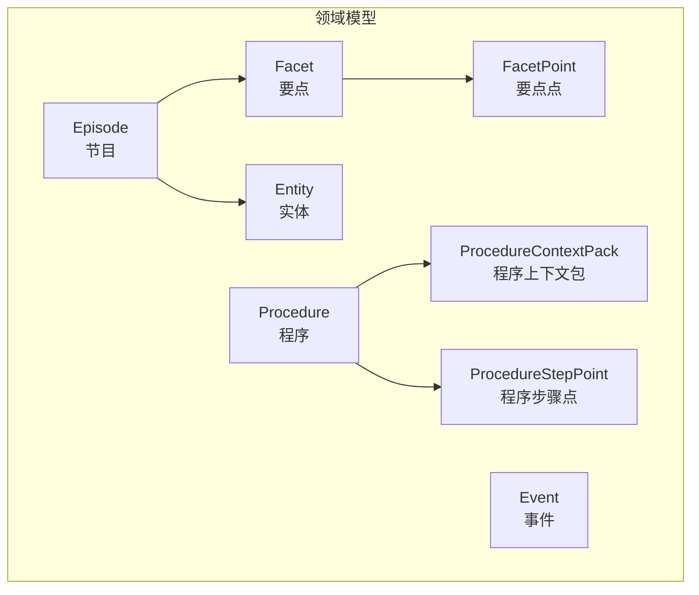
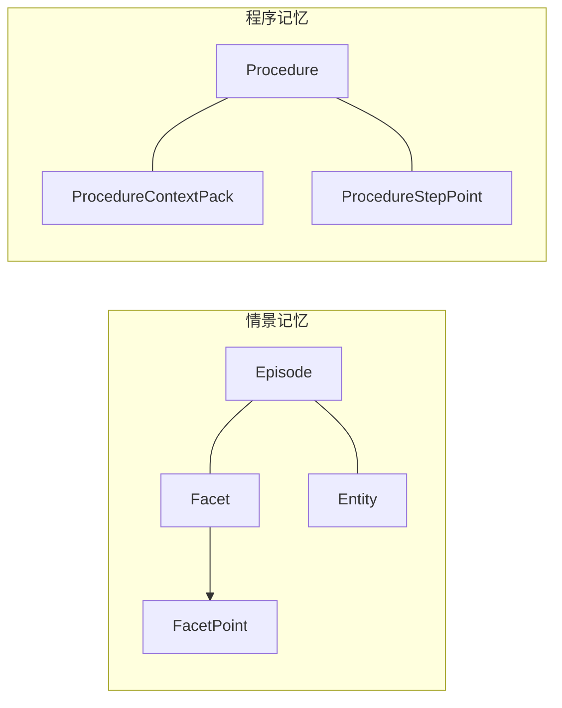
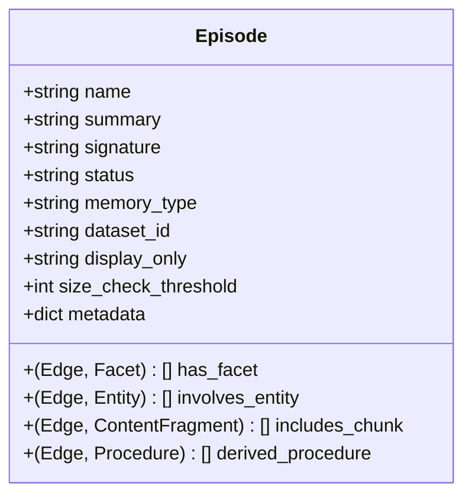
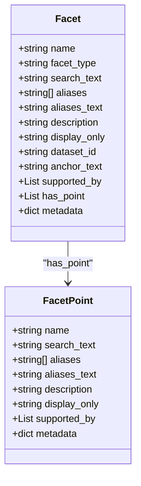
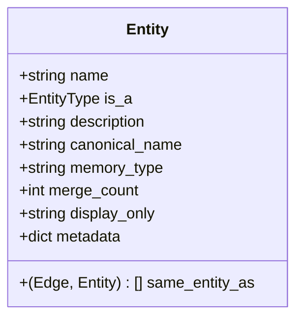
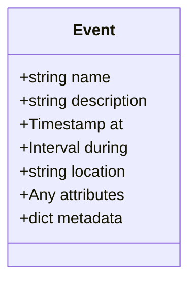
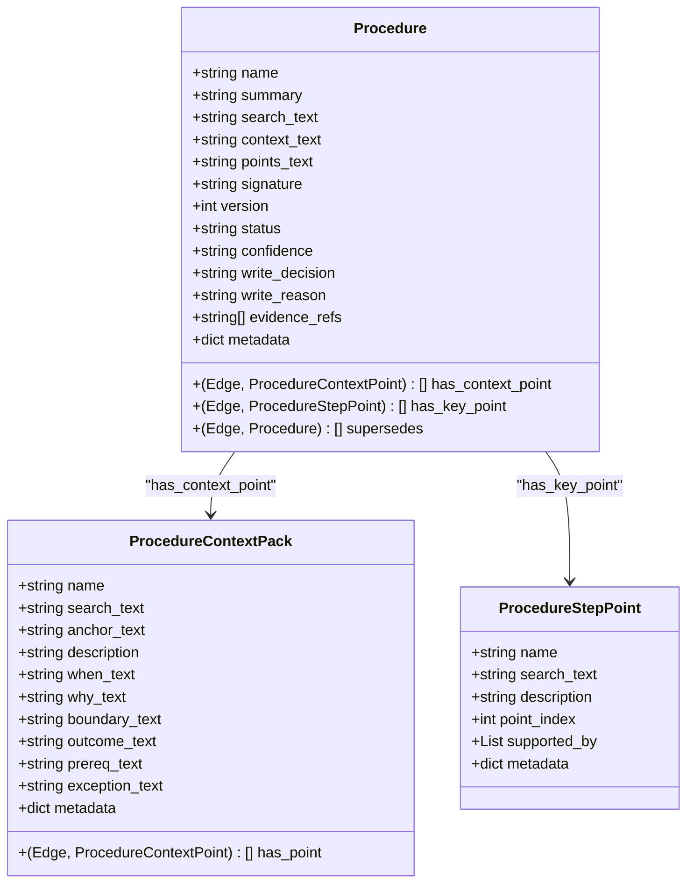
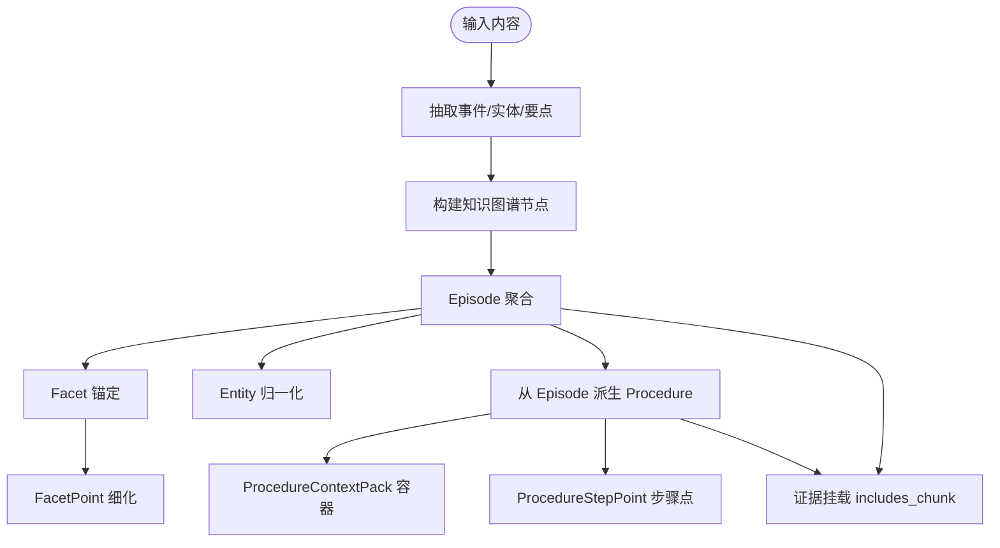
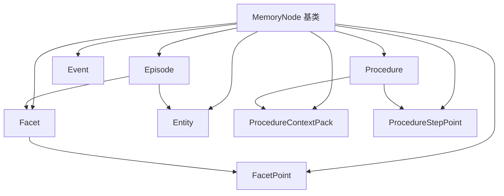

# 核心领域模型

<cite>
**本文引用的文件**
- [m_flow/core/domain/models/__init__.py](file://m_flow/core/domain/models/__init__.py)
- [m_flow/core/domain/models/Entity.py](file://m_flow/core/domain/models/Entity.py)
- [m_flow/core/domain/models/Event.py](file://m_flow/core/domain/models/Event.py)
- [m_flow/core/domain/models/Facet.py](file://m_flow/core/domain/models/Facet.py)
- [m_flow/core/domain/models/FacetPoint.py](file://m_flow/core/domain/models/FacetPoint.py)
- [m_flow/core/domain/models/Procedure.py](file://m_flow/core/domain/models/Procedure.py)
- [m_flow/core/domain/models/ProcedureContextPack.py](file://m_flow/core/domain/models/ProcedureContextPack.py)
- [m_flow/core/domain/models/ProcedureStepPoint.py](file://m_flow/core/domain/models/ProcedureStepPoint.py)
- [m_flow/core/domain/models/Episode.py](file://m_flow/core/domain/models/Episode.py)
- [m_flow/memory/episodic/models.py](file://m_flow/memory/episodic/models.py)
- [m_flow/memory/procedural/models.py](file://m_flow/memory/procedural/models.py)
- [m_flow/knowledge/graph_ops/m_flow_graph/models.py](file://m_flow/knowledge/graph_ops/m_flow_graph/models.py)
- [m_flow/adapters/relational/ModelBase.py](file://m_flow/adapters/relational/ModelBase.py)
- [alembic/versions/92b3293baa66_mflow_initial_schema.py](file://alembic/versions/92b3293baa66_mflow_initial_schema.py)
- [examples/python/simple_example.py](file://examples/python/simple_example.py)
- [examples/python/agentic_reasoning_procurement_example.py](file://examples/python/agentic_reasoning_procurement_example.py)
- [examples/python/multimedia_example.py](file://examples/python/multimedia_example.py)
</cite>

## 目录
1. [简介](#简介)
2. [项目结构](#项目结构)
3. [核心组件](#核心组件)
4. [架构总览](#架构总览)
5. [详细组件分析](#详细组件分析)
6. [依赖分析](#依赖分析)
7. [性能考虑](#性能考虑)
8. [故障排除指南](#故障排除指南)
9. [结论](#结论)
10. [附录](#附录)

## 简介
本文件系统性梳理 M-flow 的核心领域模型，围绕以下关键概念展开：实体(Entity)、事件(Event)、要点(Facet)、要点点(FacetPoint)、程序(Procedure)、程序上下文包(ProcedureContextPack)、程序步骤点(ProcedureStepPoint)、节目(Episode)。我们将从定义、属性、方法、业务逻辑、模型间层次关系与依赖关系、序列化与反序列化机制、数据库映射等方面进行深入说明，并结合实际使用场景与代码示例路径，帮助读者在系统中正确使用这些模型。

## 项目结构
M-flow 的领域模型主要位于核心域层，通过统一的内存节点基类 MemoryNode 进行抽象，形成“锚点-边-细节点”的分层结构。不同记忆子系统（情景记忆、程序记忆、偏好记忆）共享同一套基础模型，同时在具体子系统内扩展出专用的中间容器或细节点类型。

图表来源
- [m_flow/core/domain/models/__init__.py:13-37](file://m_flow/core/domain/models/__init__.py#L13-L37)
- [m_flow/core/domain/models/Episode.py:15-43](file://m_flow/core/domain/models/Episode.py#L15-L43)
- [m_flow/core/domain/models/Facet.py:22-46](file://m_flow/core/domain/models/Facet.py#L22-L46)
- [m_flow/core/domain/models/FacetPoint.py:20-28](file://m_flow/core/domain/models/FacetPoint.py#L20-L28)
- [m_flow/core/domain/models/Entity.py:10-26](file://m_flow/core/domain/models/Entity.py#L10-L26)
- [m_flow/core/domain/models/Procedure.py:22-44](file://m_flow/core/domain/models/Procedure.py#L22-L44)
- [m_flow/core/domain/models/ProcedureContextPack.py:18-37](file://m_flow/core/domain/models/ProcedureContextPack.py#L18-L37)
- [m_flow/core/domain/models/ProcedureStepPoint.py:18-34](file://m_flow/core/domain/models/ProcedureStepPoint.py#L18-L34)

章节来源
- [m_flow/core/domain/models/__init__.py:1-71](file://m_flow/core/domain/models/__init__.py#L1-L71)

## 核心组件
本节概述各核心模型的职责与关键字段，便于快速建立整体认知。

- Episode（节目）
  - 职责：作为情景记忆的锚点，聚合多个内容片段与语义要点，承载检索载体摘要。
  - 关键属性：summary、signature、status、memory_type、dataset_id、display_only、has_facet、involves_entity、includes_chunk、derived_procedure、size_check_threshold。
  - 检索索引：仅索引 summary 字段。

- Facet（要点）
  - 职责：作为 Episode 的细粒度锚点，用于粗粒度检索中的精确定位。
  - 关键属性：name、facet_type、search_text、aliases、aliases_text、description、display_only、dataset_id、anchor_text、supported_by、has_point。
  - 检索索引：索引 search_text 与 anchor_text。

- FacetPoint（要点点）
  - 职责：要点下的细粒度信息点，支持独立向量化、重排序与证据链接。
  - 关键属性：name、search_text、aliases、aliases_text、description、display_only、supported_by。
  - 检索索引：仅索引 search_text。

- Entity（实体）
  - 职责：原子级实体（名称、数字、日期、工具、人物等），支持跨事件归一化匹配。
  - 关键属性：name、is_a、description、canonical_name、memory_type、same_entity_as、merge_count、display_only、metadata。
  - 检索索引：索引 name 与 canonical_name。

- Event（事件）
  - 职责：带时间/空间上下文的离散事件，作为知识图谱构建的基础单元。
  - 关键属性：name、description、at（时刻）、during（区间）、location、attributes。
  - 检索索引：索引 name。

- Procedure（程序）
  - 职责：程序记忆的锚点，存储可复用的方法/步骤/流程；直接连接上下文点与关键点，无中间 Pack 容器。
  - 关键属性：name、summary、search_text、context_text、points_text、signature、version、status、confidence、write_decision、write_reason、evidence_refs、has_context_point、has_key_point、supersedes。
  - 检索索引：仅索引 summary。

- ProcedureContextPack（程序上下文包）
  - 职责：程序上下文的容器节点（当/因/边界/结果/前置/异常等），不参与检索，内部包含上下文点。
  - 关键属性：name、search_text（兼容保留）、anchor_text、description、when_text/why_text/boundary_text/outcome_text/prereq_text/exception_text、has_point。
  - 检索索引：空（容器不参与检索）。

- ProcedureStepPoint（程序步骤点）
  - 职责：程序记忆的细粒度锚点，用于精确匹配与检索三元组末端。
  - 关键属性：name、search_text（索引）、description、point_index、supported_by。
  - 检索索引：仅索引 search_text。

章节来源
- [m_flow/core/domain/models/Episode.py:15-104](file://m_flow/core/domain/models/Episode.py#L15-L104)
- [m_flow/core/domain/models/Facet.py:22-101](file://m_flow/core/domain/models/Facet.py#L22-L101)
- [m_flow/core/domain/models/FacetPoint.py:20-57](file://m_flow/core/domain/models/FacetPoint.py#L20-L57)
- [m_flow/core/domain/models/Entity.py:10-61](file://m_flow/core/domain/models/Entity.py#L10-L61)
- [m_flow/core/domain/models/Event.py:23-67](file://m_flow/core/domain/models/Event.py#L23-L67)
- [m_flow/core/domain/models/Procedure.py:22-107](file://m_flow/core/domain/models/Procedure.py#L22-L107)
- [m_flow/core/domain/models/ProcedureContextPack.py:18-64](file://m_flow/core/domain/models/ProcedureContextPack.py#L18-L64)
- [m_flow/core/domain/models/ProcedureStepPoint.py:18-52](file://m_flow/core/domain/models/ProcedureStepPoint.py#L18-L52)

## 架构总览
M-flow 的认知记忆架构以“锚点-边-细节点”为核心范式，不同记忆子系统的模型遵循统一的层次设计：

- 情景记忆（Episodic）
  - Episode（锚点）—[edge_text]—→ Facet（要点）—[has_point]—→ FacetPoint（要点点）
  - Episode（锚点）—[edge_text]—→ Entity（实体）

- 程序记忆（Procedural）
  - Procedure（锚点）—[has_context_point]—→ ProcedureContextPack（上下文包）
  - Procedure（锚点）—[has_key_point]—→ ProcedureStepPoint（步骤点）

- 偏好记忆（Preference）
  - 由 PreferencePoint 表示，用于偏好与倾向的记忆锚点（本节不展开细节）。

图表来源
- [m_flow/core/domain/models/Episode.py:75-82](file://m_flow/core/domain/models/Episode.py#L75-L82)
- [m_flow/core/domain/models/Facet.py:89-92](file://m_flow/core/domain/models/Facet.py#L89-L92)
- [m_flow/core/domain/models/Procedure.py:92-98](file://m_flow/core/domain/models/Procedure.py#L92-L98)

## 详细组件分析

### Episode（节目）分析
- 设计要点
  - 作为情景记忆锚点，summary 是主要检索载体，采用“整段-丰富语义边-细节”模式。
  - 使用 Edge.edge_text 承载语义化的边文本，便于后续抽取到关系集合。
  - includes_chunk 与 derived_procedure 提供证据挂载与去重溯源能力。
- 关键关系
  - Episode → Facet（通过 has_facet）
  - Episode → Entity（通过 involves_entity）
  - Episode → ContentFragment（通过 includes_chunk）
  - Episode → Procedure（通过 derived_procedure）
- 检索与索引
  - 仅索引 summary，确保“一节点一集合”的检索一致性。

图表来源
- [m_flow/core/domain/models/Episode.py:15-104](file://m_flow/core/domain/models/Episode.py#L15-L104)

章节来源
- [m_flow/core/domain/models/Episode.py:15-104](file://m_flow/core/domain/models/Episode.py#L15-L104)

### Facet（要点）与 FacetPoint（要点点）分析
- 设计要点
  - Facet 作为 Episode 的细粒度锚点，search_text 与 anchor_text 参与向量化，提升召回质量。
  - FacetPoint 将原先在 Facet.description 中枚举的信息点转化为一等公民节点，支持独立匹配、重排与证据追踪。
- 关系与索引
  - Facet —[has_point]—→ FacetPoint
  - Facet 与 FacetPoint 均对检索字段进行选择性索引，避免冗余索引带来的误召回。

图表来源
- [m_flow/core/domain/models/Facet.py:22-101](file://m_flow/core/domain/models/Facet.py#L22-L101)
- [m_flow/core/domain/models/FacetPoint.py:20-57](file://m_flow/core/domain/models/FacetPoint.py#L20-L57)

章节来源
- [m_flow/core/domain/models/Facet.py:22-101](file://m_flow/core/domain/models/Facet.py#L22-L101)
- [m_flow/core/domain/models/FacetPoint.py:20-57](file://m_flow/core/domain/models/FacetPoint.py#L20-L57)

### Entity（实体）分析
- 设计要点
  - 支持 canonical_name 归一化，same_entity_as 边用于跨事件实体发现与合并。
  - memory_type 标记用于检索过滤（atomic/episodic/None）。
  - merge_count 用于识别需要优化描述的实体。
- 关系与索引
  - Episode —[edge_text]—→ Entity（通过 involves_entity）
  - 同名实体通过 same_entity_as 边互联，edge_text 包含双方描述以增强发现能力。

图表来源
- [m_flow/core/domain/models/Entity.py:10-61](file://m_flow/core/domain/models/Entity.py#L10-L61)

章节来源
- [m_flow/core/domain/models/Entity.py:10-61](file://m_flow/core/domain/models/Entity.py#L10-L61)

### Event（事件）分析
- 设计要点
  - 支持 at（时刻）与 during（区间）两种时间表达，attributes 为跳过验证的透明负载。
  - metadata 中声明 name 字段参与索引，便于检索。
- 应用场景
  - 作为知识图谱的原子事件单元，支撑时间线与因果关系建模。

图表来源
- [m_flow/core/domain/models/Event.py:23-67](file://m_flow/core/domain/models/Event.py#L23-L67)

章节来源
- [m_flow/core/domain/models/Event.py:23-67](file://m_flow/core/domain/models/Event.py#L23-L67)

### Procedure（程序）、ProcedureContextPack（程序上下文包）、ProcedureStepPoint（程序步骤点）分析
- 设计要点
  - Procedure 为程序记忆锚点，直接连接上下文点与关键点，无中间 Pack 容器。
  - ProcedureContextPack 为容器节点（不参与检索），内部包含结构化上下文维度。
  - ProcedureStepPoint 为检索三元组末端，具备独立向量化与证据链接能力。
- 关系与索引
  - Procedure —[has_context_point]—→ ProcedureContextPack
  - Procedure —[has_key_point]—→ ProcedureStepPoint
  - 仅 Procedure.summary 与 StepPoint.search_text 参与索引。

图表来源
- [m_flow/core/domain/models/Procedure.py:22-107](file://m_flow/core/domain/models/Procedure.py#L22-L107)
- [m_flow/core/domain/models/ProcedureContextPack.py:18-64](file://m_flow/core/domain/models/ProcedureContextPack.py#L18-L64)
- [m_flow/core/domain/models/ProcedureStepPoint.py:18-52](file://m_flow/core/domain/models/ProcedureStepPoint.py#L18-L52)

章节来源
- [m_flow/core/domain/models/Procedure.py:22-107](file://m_flow/core/domain/models/Procedure.py#L22-L107)
- [m_flow/core/domain/models/ProcedureContextPack.py:18-64](file://m_flow/core/domain/models/ProcedureContextPack.py#L18-L64)
- [m_flow/core/domain/models/ProcedureStepPoint.py:18-52](file://m_flow/core/domain/models/ProcedureStepPoint.py#L18-L52)

### 概念总览
下图展示了 M-flow 记忆架构的概念流程：输入内容经由提取与路由，生成 Episode、Facet、FacetPoint、Entity 等节点；程序记忆则由 Episode 派生 Procedure，并进一步细化为上下文包与步骤点。

（该图为概念流程图，不对应具体源码文件）

## 依赖分析
- 组件耦合与内聚
  - Episode 与 Facet/FacetPoint/Entity 之间通过 Edge.edge_text 建立富语义边，耦合度适中，内聚于“锚点-细节”模式。
  - Procedure 与其上下文包/步骤点之间为直接关系，避免中间容器导致的复杂性。
- 外部依赖与集成点
  - 领域模型基于统一的 MemoryNode 抽象，便于与图数据库、向量库、关系型数据库适配。
  - 与检索模块（episodic/procedural retrieval）通过 metadata.index_fields 协作，确保索引字段与检索策略一致。
- 循环依赖规避
  - 通过 TYPE_CHECKING 或延迟导入（如 List[tuple[Edge, ...]]）避免循环导入问题。

图表来源
- [m_flow/core/domain/models/Episode.py:10-13](file://m_flow/core/domain/models/Episode.py#L10-L13)
- [m_flow/core/domain/models/Facet.py:16-19](file://m_flow/core/domain/models/Facet.py#L16-L19)
- [m_flow/core/domain/models/FacetPoint.py:17-18](file://m_flow/core/domain/models/FacetPoint.py#L17-L18)
- [m_flow/core/domain/models/Entity.py:2-4](file://m_flow/core/domain/models/Entity.py#L2-L4)
- [m_flow/core/domain/models/Event.py:15-17](file://m_flow/core/domain/models/Event.py#L15-L17)
- [m_flow/core/domain/models/Procedure.py](file://m_flow/core/domain/models/Procedure.py#L19)
- [m_flow/core/domain/models/ProcedureContextPack.py](file://m_flow/core/domain/models/ProcedureContextPack.py#L15)
- [m_flow/core/domain/models/ProcedureStepPoint.py](file://m_flow/core/domain/models/ProcedureStepPoint.py#L15)

章节来源
- [m_flow/core/domain/models/__init__.py:13-37](file://m_flow/core/domain/models/__init__.py#L13-L37)

## 性能考虑
- 索引字段最小化
  - Episode/Facet/FacetPoint/Procedure/ProcedureStepPoint 仅对必要字段建立索引，降低写入与查询成本。
- 向量化与召回
  - Facet.anchor_text 与 Facet.search_text、Procedure.summary、ProcedureStepPoint.search_text 参与向量化，提升检索精度。
- 写入阶段截断
  - 对 Facet.anchor_text 等可能超长字段，在写入/索引阶段进行安全截断，避免嵌入维度限制。
- 检索三元组
  - 程序记忆去除中间 Pack，缩短检索链路，提高响应速度。

（本节为通用指导，不涉及具体文件分析）

## 故障排除指南
- 索引字段缺失
  - 若检索效果不佳，检查各模型 metadata.index_fields 是否符合预期（Episode/Facet/Procedure/ProcedureStepPoint）。
- 边文本丢失
  - Episode 与 Facet/Entity 的语义边需通过 Edge.edge_text 传递，若发现检索上下文缺失，检查写入阶段是否正确设置 edge_text。
- 上下文包与步骤点
  - 程序记忆应直接连接 ProcedureStepPoint，避免错误地插入 ProcedureContextPack 导致检索链路中断。
- 数据隔离
  - Episode/Facet 支持 dataset_id 字段，用于跨数据集路由时的过滤，确保共享数据库模式下的访问控制。

章节来源
- [m_flow/core/domain/models/Episode.py:64-67](file://m_flow/core/domain/models/Episode.py#L64-L67)
- [m_flow/core/domain/models/Facet.py:73-76](file://m_flow/core/domain/models/Facet.py#L73-L76)
- [m_flow/core/domain/models/Procedure.py:92-98](file://m_flow/core/domain/models/Procedure.py#L92-L98)

## 结论
M-flow 的核心领域模型以统一的 MemoryNode 为基础，围绕“锚点-边-细节点”范式构建了情景记忆与程序记忆的清晰层次。Episode/Facet/FacetPoint/Entity 提供了从粗粒度到细粒度的检索与推理能力；Procedure/ProcedureContextPack/ProcedureStepPoint 则实现了程序知识的可复用与可控检索。通过合理的索引策略与边文本承载，系统在保证检索精度的同时，兼顾了写入与查询的性能。

## 附录

### 序列化与反序列化机制
- Python 类型注解与字段约束
  - 使用标准类型注解与 Pydantic Field/SkipValidation 等特性，确保模型在序列化/反序列化过程中的类型安全与灵活性。
- 元数据与索引配置
  - 每个模型的 metadata 字段定义了索引字段集合，序列化时应保持该配置不变，以维持检索一致性。

章节来源
- [m_flow/core/domain/models/Event.py:13-17](file://m_flow/core/domain/models/Event.py#L13-L17)
- [m_flow/core/domain/models/Episode.py](file://m_flow/core/domain/models/Episode.py#L104)
- [m_flow/core/domain/models/Facet.py](file://m_flow/core/domain/models/Facet.py#L101)
- [m_flow/core/domain/models/Procedure.py](file://m_flow/core/domain/models/Procedure.py#L107)
- [m_flow/core/domain/models/ProcedureStepPoint.py](file://m_flow/core/domain/models/ProcedureStepPoint.py#L52)

### 数据库映射关系
- 关系型数据库映射
  - 通过 ModelBase 基类与 Alembic 迁移版本，将领域模型映射到关系型表结构，支持迁移与版本管理。
- 图数据库与向量库
  - 领域模型通过 MemoryNode 抽象与边关系，适配图数据库与向量库的节点/边/向量存储。

章节来源
- [m_flow/adapters/relational/ModelBase.py](file://m_flow/adapters/relational/ModelBase.py)
- [alembic/versions/92b3293baa66_mflow_initial_schema.py](file://alembic/versions/92b3293baa66_mflow_initial_schema.py)

### 实际使用场景与示例路径
- 简单示例
  - 展示基础的实体、事件、要点与节目模型的组合使用方式。
  - 示例路径：[examples/python/simple_example.py](file://examples/python/simple_example.py)
- 程序化推理示例
  - 展示从情景记忆派生程序记忆的完整流程，包括上下文包与步骤点的使用。
  - 示例路径：[examples/python/agentic_reasoning_procurement_example.py](file://examples/python/agentic_reasoning_procurement_example.py)
- 多媒体示例
  - 展示多模态内容在情景记忆中的组织方式，包括要点与要点点的应用。
  - 示例路径：[examples/python/multimedia_example.py](file://examples/python/multimedia_example.py)

章节来源
- [examples/python/simple_example.py](file://examples/python/simple_example.py)
- [examples/python/agentic_reasoning_procurement_example.py](file://examples/python/agentic_reasoning_procurement_example.py)
- [examples/python/multimedia_example.py](file://examples/python/multimedia_example.py)