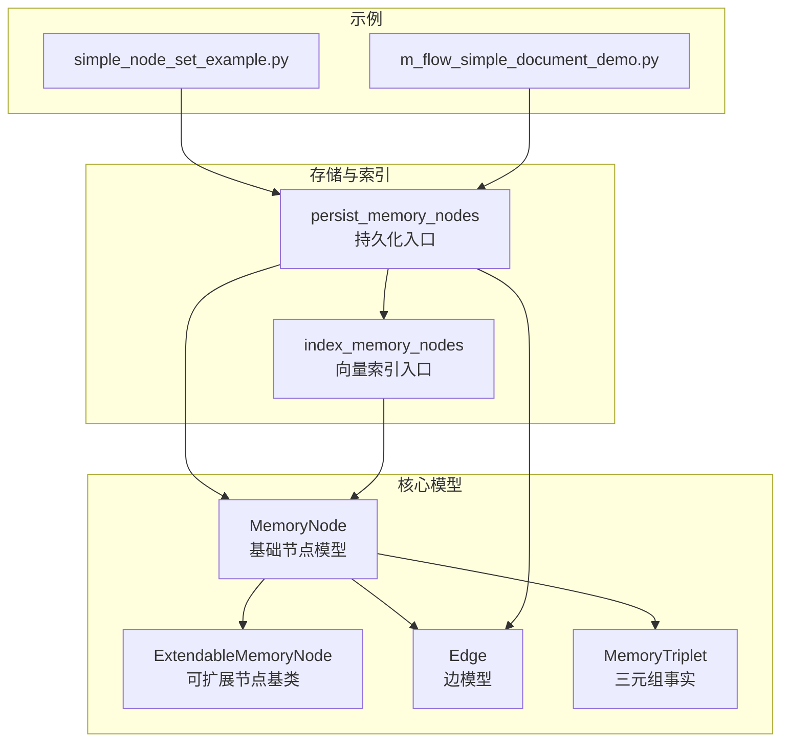
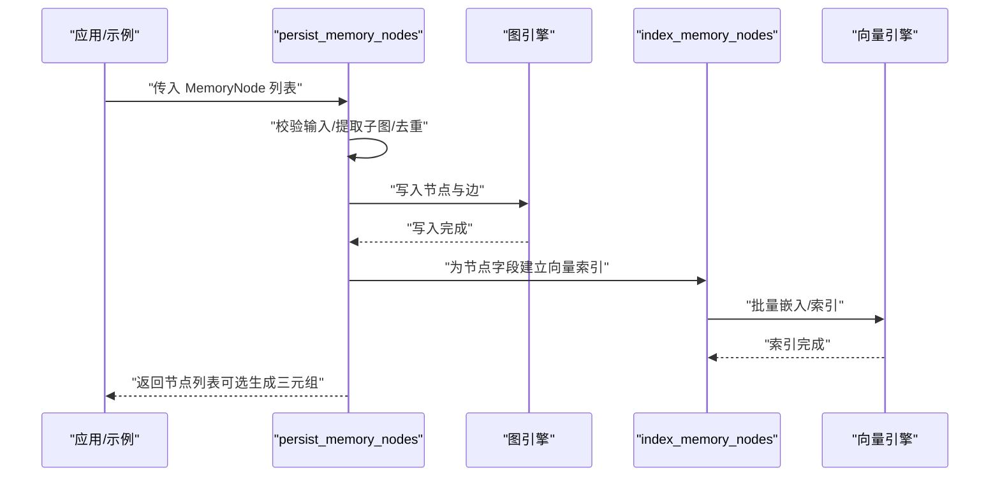
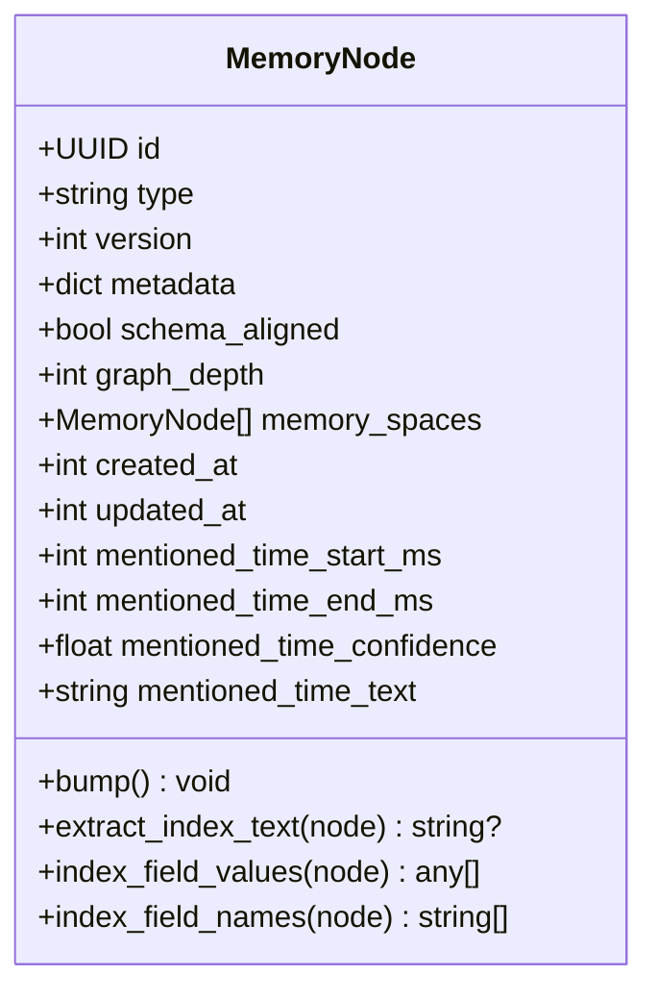
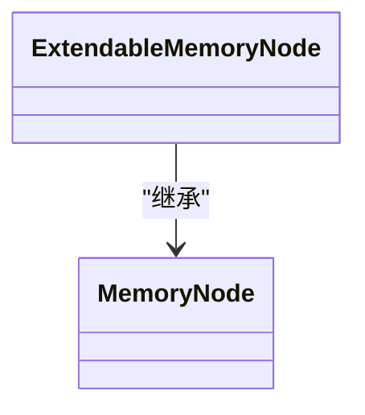
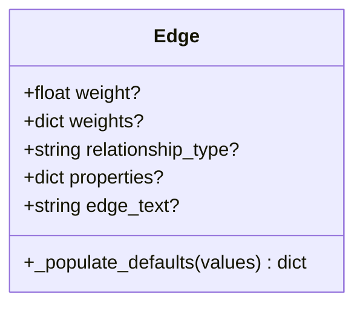
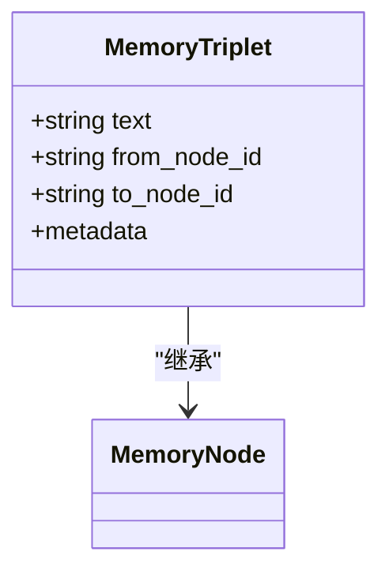
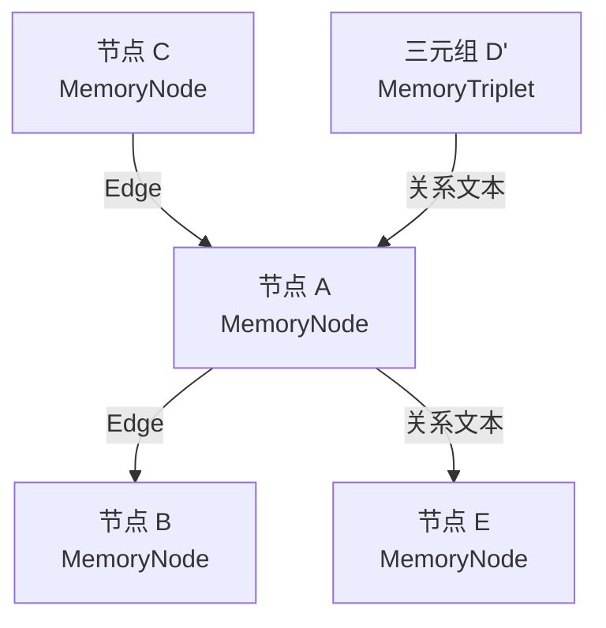
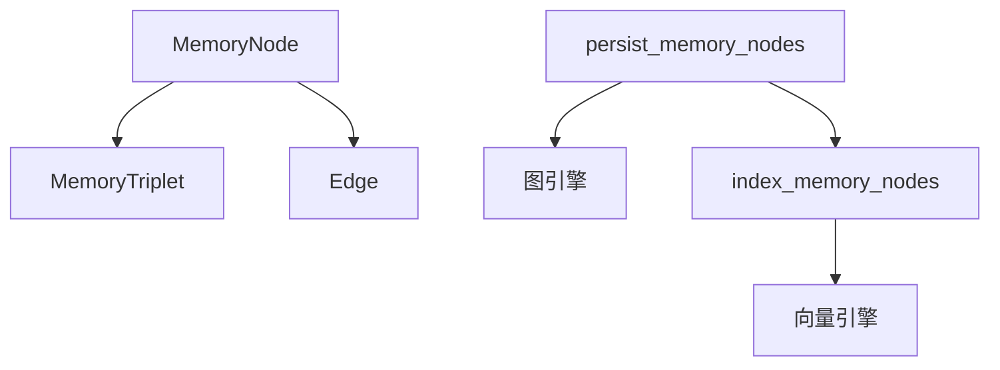
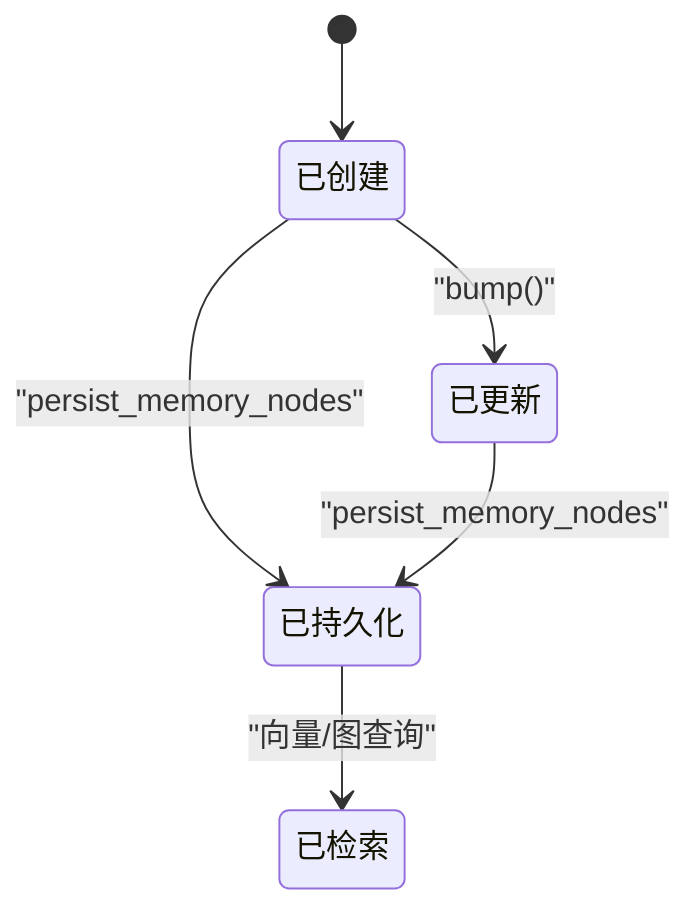

# 记忆节点模型

<cite>
**本文引用的文件**
- [MemoryNode.py](file://m_flow/core/models/MemoryNode.py)
- [ExtendableMemoryNode.py](file://m_flow/core/models/ExtendableMemoryNode.py)
- [Edge.py](file://m_flow/core/models/Edge.py)
- [MemoryTriplet.py](file://m_flow/core/domain/models/MemoryTriplet.py)
- [add_memory_nodes.py](file://m_flow/storage/add_memory_nodes.py)
- [index_memory_nodes.py](file://m_flow/storage/index_memory_nodes.py)
- [simple_node_set_example.py](file://examples/python/simple_node_set_example.py)
- [m_flow_simple_document_demo.py](file://examples/python/m_flow_simple_document_demo.py)
</cite>

## 目录
1. [简介](#简介)
2. [项目结构](#项目结构)
3. [核心组件](#核心组件)
4. [架构总览](#架构总览)
5. [详细组件分析](#详细组件分析)
6. [依赖分析](#依赖分析)
7. [性能考虑](#性能考虑)
8. [故障排查指南](#故障排查指南)
9. [结论](#结论)
10. [附录](#附录)

## 简介
本文件系统性阐述 M-flow 的记忆节点模型，重点围绕 MemoryNode 基类与 ExtendableMemoryNode 扩展基类的设计理念、属性与方法、扩展机制展开；同时说明 Edge 边模型如何连接不同记忆节点，给出节点与边的结构图以展示记忆网络的组织方式；介绍序列化与持久化策略（包括向量化索引）、生命周期与状态转换；最后通过示例路径展示如何创建、操作与查询记忆节点，并解释该模型与知识图谱的关系及在检索系统中的作用。

## 项目结构
本主题涉及的核心文件位于以下模块：
- 核心模型：m_flow/core/models/MemoryNode.py、m_flow/core/models/ExtendableMemoryNode.py、m_flow/core/models/Edge.py、m_flow/core/domain/models/MemoryTriplet.py
- 持久化与索引：m_flow/storage/add_memory_nodes.py、m_flow/storage/index_memory_nodes.py
- 使用示例：examples/python/simple_node_set_example.py、examples/python/m_flow_simple_document_demo.py

**图表来源**
- [MemoryNode.py:27-106](file://m_flow/core/models/MemoryNode.py#L27-L106)
- [ExtendableMemoryNode.py:16-30](file://m_flow/core/models/ExtendableMemoryNode.py#L16-L30)
- [Edge.py:8-36](file://m_flow/core/models/Edge.py#L8-L36)
- [MemoryTriplet.py:22-54](file://m_flow/core/domain/models/MemoryTriplet.py#L22-L54)
- [add_memory_nodes.py:220-261](file://m_flow/storage/add_memory_nodes.py#L220-L261)
- [index_memory_nodes.py:114-184](file://m_flow/storage/index_memory_nodes.py#L114-L184)
- [simple_node_set_example.py:26-43](file://examples/python/simple_node_set_example.py#L26-L43)
- [m_flow_simple_document_demo.py:12-39](file://examples/python/m_flow_simple_document_demo.py#L12-L39)

**章节来源**
- [MemoryNode.py:27-106](file://m_flow/core/models/MemoryNode.py#L27-L106)
- [ExtendableMemoryNode.py:16-30](file://m_flow/core/models/ExtendableMemoryNode.py#L16-L30)
- [Edge.py:8-36](file://m_flow/core/models/Edge.py#L8-L36)
- [MemoryTriplet.py:22-54](file://m_flow/core/domain/models/MemoryTriplet.py#L22-L54)
- [add_memory_nodes.py:220-261](file://m_flow/storage/add_memory_nodes.py#L220-L261)
- [index_memory_nodes.py:114-184](file://m_flow/storage/index_memory_nodes.py#L114-L184)
- [simple_node_set_example.py:26-43](file://examples/python/simple_node_set_example.py#L26-L43)
- [m_flow_simple_document_demo.py:12-39](file://examples/python/m_flow_simple_document_demo.py#L12-L39)

## 核心组件
- MemoryNode：带版本控制与嵌入辅助的图节点基类，自动派生类型名，提供索引字段提取、字段名/值访问与版本递增等能力。
- ExtendableMemoryNode：面向应用扩展的轻量继承基类，用于区分用户自定义模型与内部引擎模型，便于模式内省与序列化。
- Edge：图关系承载对象，支持权重、关系类型、属性字典与边文本，默认在未显式提供时从关系类型推导边文本。
- MemoryTriplet：三元组事实节点，作为知识图谱原子单元，记录主体与客体节点 ID 及其谓词文本，具备独立索引配置。

**章节来源**
- [MemoryNode.py:27-106](file://m_flow/core/models/MemoryNode.py#L27-L106)
- [ExtendableMemoryNode.py:16-30](file://m_flow/core/models/ExtendableMemoryNode.py#L16-L30)
- [Edge.py:8-36](file://m_flow/core/models/Edge.py#L8-L36)
- [MemoryTriplet.py:22-54](file://m_flow/core/domain/models/MemoryTriplet.py#L22-L54)

## 架构总览
下图展示了记忆节点、边与持久化流程的整体交互：

**图表来源**
- [add_memory_nodes.py:220-261](file://m_flow/storage/add_memory_nodes.py#L220-L261)
- [index_memory_nodes.py:114-184](file://m_flow/storage/index_memory_nodes.py#L114-L184)

## 详细组件分析

### MemoryNode 基类
- 设计要点
  - 类型标注与 Pydantic 配置：支持任意类型字段、构造后校验器自动填充 type 字段。
  - 版本控制：version 字段与 created_at/updated_at 时间戳，提供 bump() 方法推进版本并更新时间。
  - 元数据与索引：metadata 中的 index_fields 决定哪些字段参与嵌入；提供 extract_index_text、index_field_values、index_field_names 等辅助方法。
  - 时间锚点：提及时间相关字段（起止、置信度、原文）便于时序检索与上下文定位。
- 关键方法与行为
  - extract_index_text：按 index_fields 拼接可嵌入文本，为空则返回 None。
  - index_field_values / index_field_names：分别返回字段值列表与字段名列表。
  - bump：版本号递增并更新 updated_at。
- 复杂度与性能
  - 文本拼接复杂度 O(k)，k 为 index_fields 数量；字段访问 O(1)。
  - 建议在大规模节点上谨慎设置 index_fields，避免冗余字段导致嵌入成本上升。

**图表来源**
- [MemoryNode.py:27-106](file://m_flow/core/models/MemoryNode.py#L27-L106)

**章节来源**
- [MemoryNode.py:27-106](file://m_flow/core/models/MemoryNode.py#L27-L106)

### ExtendableMemoryNode 扩展基类
- 设计理念
  - 作为应用自定义节点类型的基类，框架通过该标记区分用户模型与内部模型，利于模式内省与迁移逻辑。
  - 要求子类至少声明一个可渲染的 name 字段，以便在图可视化中呈现。
- 继承关系
  - ExtendableMemoryNode 直接继承 MemoryNode，复用其版本、元数据与嵌入辅助能力。

**图表来源**
- [ExtendableMemoryNode.py:16-30](file://m_flow/core/models/ExtendableMemoryNode.py#L16-L30)
- [MemoryNode.py:27-106](file://m_flow/core/models/MemoryNode.py#L27-L106)

**章节来源**
- [ExtendableMemoryNode.py:16-30](file://m_flow/core/models/ExtendableMemoryNode.py#L16-L30)

### Edge 边模型
- 字段与默认行为
  - 支持单权重、多权重映射、关系类型、通用属性字典与边文本。
  - 在未显式提供 edge_text 时，若存在 relationship_type，则自动以其填充，确保边文本一致性。
- 连接语义
  - Edge 通常与具体节点类型组合使用，用于描述节点间的关系与权重信息，是构建知识图谱边的重要载体。

**图表来源**
- [Edge.py:8-36](file://m_flow/core/models/Edge.py#L8-L36)

**章节来源**
- [Edge.py:8-36](file://m_flow/core/models/Edge.py#L8-L36)

### MemoryTriplet 三元组
- 角色与用途
  - 作为知识图谱的原子事实单元，记录 from_node_id 与 to_node_id 之间的关系文本 text。
  - metadata 默认仅索引 text 字段，便于基于关系语义的检索。
- 与节点的关系
  - 由边关系经提取与去重后生成，形成稳定的三元组集合，支撑检索与推理。

**图表来源**
- [MemoryTriplet.py:22-54](file://m_flow/core/domain/models/MemoryTriplet.py#L22-L54)
- [MemoryNode.py:27-106](file://m_flow/core/models/MemoryNode.py#L27-L106)

**章节来源**
- [MemoryTriplet.py:22-54](file://m_flow/core/domain/models/MemoryTriplet.py#L22-L54)

### 节点与边的结构图（概念）

[此图为概念示意，不直接映射到具体源码文件]

## 依赖分析
- 组件耦合
  - MemoryNode 与 ExtendableMemoryNode 强内聚，前者提供通用能力，后者提供扩展标记。
  - Edge 与 MemoryNode 解耦，通过关系类型与属性字典描述连接。
  - MemoryTriplet 继承 MemoryNode 并专注于三元组事实。
- 存储与索引依赖
  - persist_memory_nodes 依赖图引擎与向量引擎，先写结构再做向量化，保证图完整性。
  - index_memory_nodes 将节点按类型与字段分组，批量并发嵌入，受环境变量限制并发度。

**图表来源**
- [add_memory_nodes.py:220-261](file://m_flow/storage/add_memory_nodes.py#L220-L261)
- [index_memory_nodes.py:114-184](file://m_flow/storage/index_memory_nodes.py#L114-L184)

**章节来源**
- [add_memory_nodes.py:220-261](file://m_flow/storage/add_memory_nodes.py#L220-L261)
- [index_memory_nodes.py:114-184](file://m_flow/storage/index_memory_nodes.py#L114-L184)

## 性能考虑
- 向量化并发与批大小
  - 通过环境变量控制并发度与批大小，避免外部嵌入 API 抖动；失败批次会记录但不会中断整体流程。
- 索引字段选择
  - 合理设置 metadata.index_fields，避免对大量空值或冗余字段进行嵌入，降低索引成本。
- 图写入顺序
  - 先写入节点与边，再做向量索引，确保即使向量索引失败，图结构仍可用查询。

**章节来源**
- [index_memory_nodes.py:114-184](file://m_flow/storage/index_memory_nodes.py#L114-L184)
- [add_memory_nodes.py:79-126](file://m_flow/storage/add_memory_nodes.py#L79-L126)

## 故障排查指南
- 输入校验错误
  - 若传入非列表或列表元素非 MemoryNode 实例，将触发持久化阶段的异常，需检查节点类型与列表格式。
- 向量索引失败
  - 索引阶段失败会被记录并告警，但不影响已写入的图结构；建议检查嵌入服务可用性与并发配置。
- 边文本缺失
  - Edge 未提供 edge_text 时会尝试从 relationship_type 推导；若两者均为空，可能导致可视化或检索标签缺失。

**章节来源**
- [add_memory_nodes.py:33-40](file://m_flow/storage/add_memory_nodes.py#L33-L40)
- [add_memory_nodes.py:112-122](file://m_flow/storage/add_memory_nodes.py#L112-L122)
- [Edge.py:28-36](file://m_flow/core/models/Edge.py#L28-L36)

## 结论
MemoryNode 与 ExtendableMemoryNode 提供了统一、可扩展的记忆节点抽象；Edge 与 MemoryTriplet 完成从关系到三元组的事实化；持久化与索引流程确保图结构完整且具备高效的向量检索能力。通过合理配置索引字段与并发参数，可在保证性能的同时获得良好的检索效果。

## 附录

### 序列化与持久化策略
- 持久化入口
  - persist_memory_nodes：校验输入、提取子图、去重、写入图结构、执行向量索引，并可选生成三元组嵌入。
- 向量索引入口
  - index_memory_nodes：按类型与字段分组、并发嵌入、批处理与进度日志。
- 三元组生成
  - 从最终边集合中抽取三元组，依据源/目标节点与关系标签拼接可嵌入文本，生成 MemoryTriplet 并索引。

**章节来源**
- [add_memory_nodes.py:220-261](file://m_flow/storage/add_memory_nodes.py#L220-L261)
- [index_memory_nodes.py:114-184](file://m_flow/storage/index_memory_nodes.py#L114-L184)
- [MemoryTriplet.py:22-54](file://m_flow/core/domain/models/MemoryTriplet.py#L22-L54)

### 生命周期与状态转换
- 创建：实例化节点，type 字段由构造后校验器自动填充。
- 更新：调用 bump() 推进版本并更新时间戳。
- 持久化：通过 persist_memory_nodes 写入图结构，随后执行向量索引。
- 查询：基于索引字段与三元组文本进行检索。

[此图为概念示意，不直接映射到具体源码文件]

### 实际使用示例（路径）
- 节点集标签示例：演示如何添加内容并将其纳入图谱范围，随后进行记忆化与可视化。
  - 示例路径：[simple_node_set_example.py:26-43](file://examples/python/simple_node_set_example.py#L26-L43)
- 文档简单演示：展示如何添加文档、记忆化并进行检索问答。
  - 示例路径：[m_flow_simple_document_demo.py:12-39](file://examples/python/m_flow_simple_document_demo.py#L12-L39)

**章节来源**
- [simple_node_set_example.py:26-43](file://examples/python/simple_node_set_example.py#L26-L43)
- [m_flow_simple_document_demo.py:12-39](file://examples/python/m_flow_simple_document_demo.py#L12-L39)

### 节点模型与知识图谱、检索系统的关系
- 知识图谱关系
  - 节点代表实体，边代表关系，三元组将关系事实化，形成可检索的知识单元。
- 检索系统作用
  - 通过索引字段与三元组文本进行语义检索，结合时间锚点与权重信息提升召回质量。

**章节来源**
- [MemoryTriplet.py:22-54](file://m_flow/core/domain/models/MemoryTriplet.py#L22-L54)
- [Edge.py:8-36](file://m_flow/core/models/Edge.py#L8-L36)