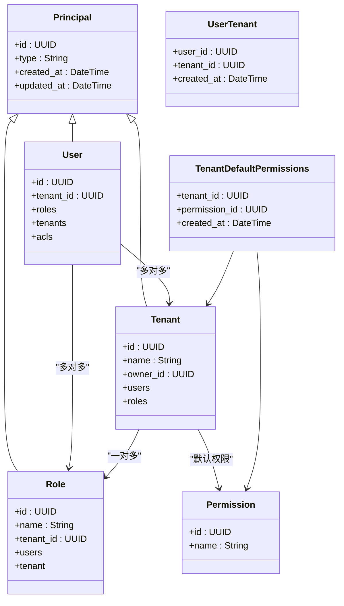
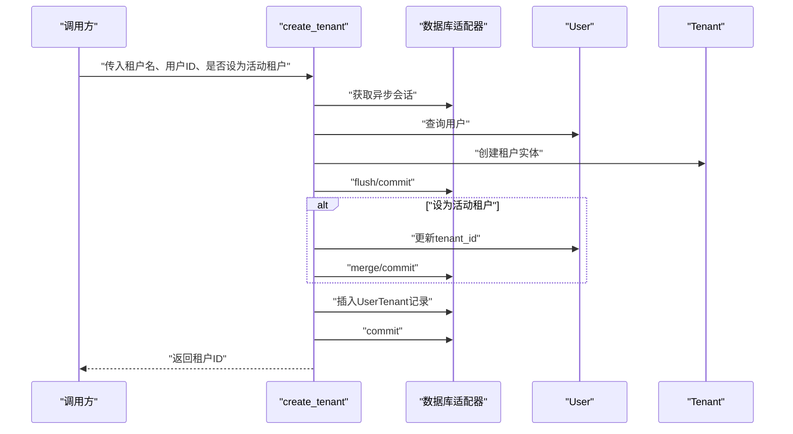
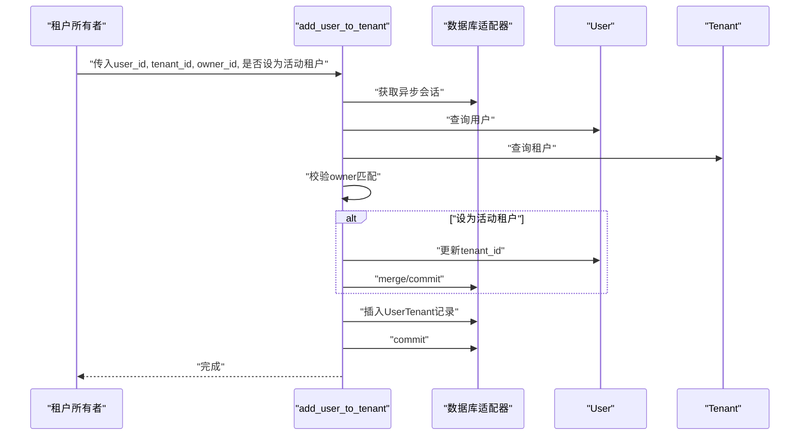
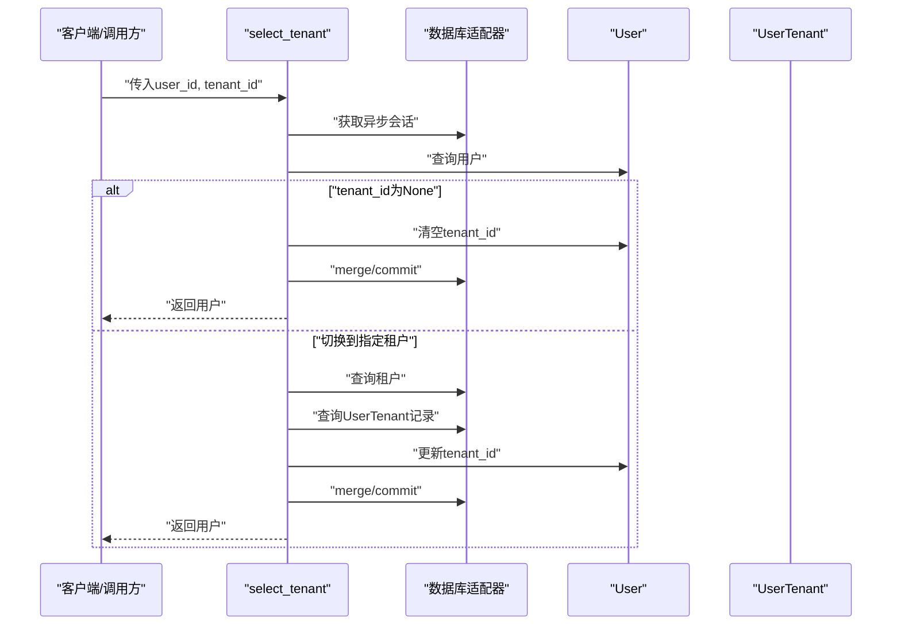
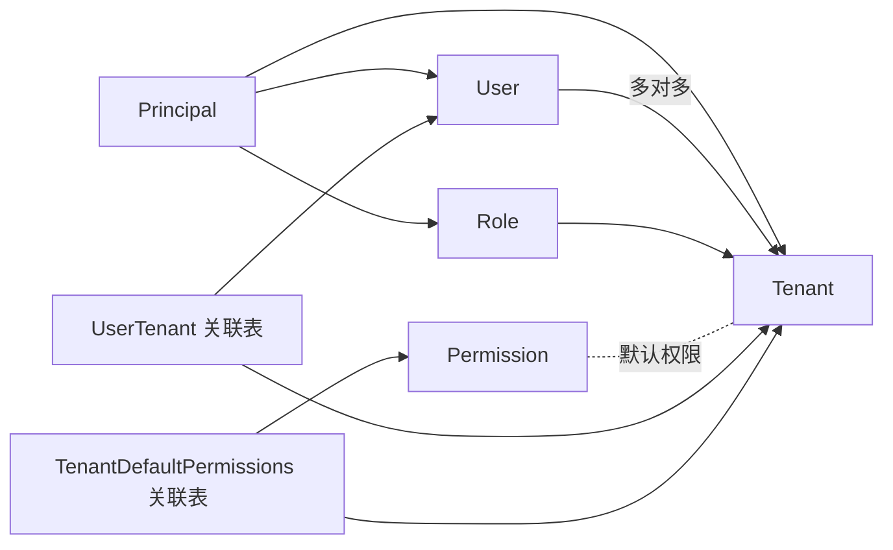

# 多租户管理

<cite>
**本文引用的文件**
- [Tenant.py](file://m_flow/auth/models/Tenant.py)
- [User.py](file://m_flow/auth/models/User.py)
- [UserTenant.py](file://m_flow/auth/models/UserTenant.py)
- [TenantDefaultPermissions.py](file://m_flow/auth/models/TenantDefaultPermissions.py)
- [Principal.py](file://m_flow/auth/models/Principal.py)
- [Role.py](file://m_flow/auth/models/Role.py)
- [Permission.py](file://m_flow/auth/models/Permission.py)
- [create_tenant.py](file://m_flow/auth/tenants/methods/create_tenant.py)
- [add_user_to_tenant.py](file://m_flow/auth/tenants/methods/add_user_to_tenant.py)
- [select_tenant.py](file://m_flow/auth/tenants/methods/select_tenant.py)
- [get_tenant.py](file://m_flow/auth/permissions/permissions_methods/get_tenant.py)
- [permissions_methods_init.py](file://m_flow/auth/permissions/permissions_methods/__init__.py)
- [test_multi_tenancy.py](file://m_flow/tests/test_multi_tenancy.py)
</cite>

## 目录
1. [引言](#引言)
2. [项目结构](#项目结构)
3. [核心组件](#核心组件)
4. [架构总览](#架构总览)
5. [详细组件分析](#详细组件分析)
6. [依赖分析](#依赖分析)
7. [性能考量](#性能考量)
8. [故障排查指南](#故障排查指南)
9. [结论](#结论)
10. [附录](#附录)

## 引言
本文件面向多租户管理系统，系统通过“租户”作为组织边界，实现用户、角色、权限与数据的逻辑隔离。本文从架构设计、数据模型、租户生命周期、权限体系、隔离策略、部署与运维、扩展与高可用、迁移与合并等维度进行系统化阐述，并结合测试用例验证跨租户隔离与上下文切换的行为。

## 项目结构
多租户能力主要位于认证与授权子系统中，围绕以下层次组织：
- 模型层：定义租户、用户、角色、权限、关联表等实体与关系
- 方法层：封装租户创建、成员加入、租户选择等业务操作
- 权限方法：提供租户查询、权限授予、默认权限注入等辅助能力
- 测试层：集成测试覆盖跨租户隔离、角色授权与租户切换

```mermaid
graph TB
subgraph "模型层"
P["Principal 基类"]
U["User 用户"]
T["Tenant 租户"]
R["Role 角色"]
Perm["Permission 权限"]
UT["UserTenant 关联表"]
TDP["TenantDefaultPermissions 关联表"]
end
subgraph "方法层"
CT["create_tenant 创建租户"]
AUM["add_user_to_tenant 添加成员"]
ST["select_tenant 切换租户"]
end
subgraph "权限方法"
GT["get_tenant 查询租户"]
PMI["permissions_methods/__init__.py 导出集合"]
end
P --> U
P --> T
P --> R
U <- --> UT
T <- --> UT
R <- --> U
T --> R
TDP --> T
TDP --> Perm
CT --> T
CT --> UT
AUM --> UT
ST --> U
GT --> T
PMI --> GT
```

图表来源
- [Principal.py:20-36](file://m_flow/auth/models/Principal.py#L20-L36)
- [User.py:25-63](file://m_flow/auth/models/User.py#L25-L63)
- [Tenant.py:24-73](file://m_flow/auth/models/Tenant.py#L24-L73)
- [Role.py:18-47](file://m_flow/auth/models/Role.py#L18-L47)
- [Permission.py:20-31](file://m_flow/auth/models/Permission.py#L20-L31)
- [UserTenant.py:19-29](file://m_flow/auth/models/UserTenant.py#L19-L29)
- [TenantDefaultPermissions.py:19-37](file://m_flow/auth/models/TenantDefaultPermissions.py#L19-L37)
- [create_tenant.py:21-67](file://m_flow/auth/tenants/methods/create_tenant.py#L21-L67)
- [add_user_to_tenant.py:27-81](file://m_flow/auth/tenants/methods/add_user_to_tenant.py#L27-L81)
- [select_tenant.py:23-80](file://m_flow/auth/tenants/methods/select_tenant.py#L23-L80)
- [get_tenant.py:13-39](file://m_flow/auth/permissions/permissions_methods/get_tenant.py#L13-L39)
- [permissions_methods_init.py:7-36](file://m_flow/auth/permissions/permissions_methods/__init__.py#L7-L36)

章节来源
- [Principal.py:20-36](file://m_flow/auth/models/Principal.py#L20-L36)
- [User.py:25-63](file://m_flow/auth/models/User.py#L25-L63)
- [Tenant.py:24-73](file://m_flow/auth/models/Tenant.py#L24-L73)
- [Role.py:18-47](file://m_flow/auth/models/Role.py#L18-L47)
- [Permission.py:20-31](file://m_flow/auth/models/Permission.py#L20-L31)
- [UserTenant.py:19-29](file://m_flow/auth/models/UserTenant.py#L19-L29)
- [TenantDefaultPermissions.py:19-37](file://m_flow/auth/models/TenantDefaultPermissions.py#L19-L37)
- [create_tenant.py:21-67](file://m_flow/auth/tenants/methods/create_tenant.py#L21-L67)
- [add_user_to_tenant.py:27-81](file://m_flow/auth/tenants/methods/add_user_to_tenant.py#L27-L81)
- [select_tenant.py:23-80](file://m_flow/auth/tenants/methods/select_tenant.py#L23-L80)
- [get_tenant.py:13-39](file://m_flow/auth/permissions/permissions_methods/get_tenant.py#L13-L39)
- [permissions_methods_init.py:7-36](file://m_flow/auth/permissions/permissions_methods/__init__.py#L7-L36)

## 核心组件
- 安全主体基类：统一抽象“用户/租户/角色”等安全主体，支持单表继承与多态标识
- 用户模型：继承主体基类，携带租户外键与角色、ACL 等关系
- 租户模型：继承主体基类，维护名称唯一性、所有者、用户与角色关系
- 角色模型：按租户域命名唯一，承载用户与租户关系
- 权限模型：命名唯一，用于授权最小单元
- 关联表：
  - 用户-租户：记录成员关系与加入时间
  - 租户默认权限：记录租户创建时绑定的权限集
- 租户方法：创建租户、添加成员、切换活动租户
- 权限方法：查询租户、权限授予与默认权限注入等

章节来源
- [Principal.py:20-36](file://m_flow/auth/models/Principal.py#L20-L36)
- [User.py:25-63](file://m_flow/auth/models/User.py#L25-L63)
- [Tenant.py:24-73](file://m_flow/auth/models/Tenant.py#L24-L73)
- [Role.py:18-47](file://m_flow/auth/models/Role.py#L18-L47)
- [Permission.py:20-31](file://m_flow/auth/models/Permission.py#L20-L31)
- [UserTenant.py:19-29](file://m_flow/auth/models/UserTenant.py#L19-L29)
- [TenantDefaultPermissions.py:19-37](file://m_flow/auth/models/TenantDefaultPermissions.py#L19-L37)
- [create_tenant.py:21-67](file://m_flow/auth/tenants/methods/create_tenant.py#L21-L67)
- [add_user_to_tenant.py:27-81](file://m_flow/auth/tenants/methods/add_user_to_tenant.py#L27-L81)
- [select_tenant.py:23-80](file://m_flow/auth/tenants/methods/select_tenant.py#L23-L80)
- [get_tenant.py:13-39](file://m_flow/auth/permissions/permissions_methods/get_tenant.py#L13-L39)
- [permissions_methods_init.py:7-36](file://m_flow/auth/permissions/permissions_methods/__init__.py#L7-L36)

## 架构总览
多租户以“租户”为边界，实现用户、角色、权限与数据的逻辑隔离。用户可在不同租户间切换，系统通过当前活动租户上下文过滤可见数据与权限。权限体系采用“权限-角色-用户”的层级映射，支持默认权限模板与租户级定制。



图表来源
- [Principal.py:20-36](file://m_flow/auth/models/Principal.py#L20-L36)
- [User.py:25-63](file://m_flow/auth/models/User.py#L25-L63)
- [Tenant.py:24-73](file://m_flow/auth/models/Tenant.py#L24-L73)
- [Role.py:18-47](file://m_flow/auth/models/Role.py#L18-L47)
- [Permission.py:20-31](file://m_flow/auth/models/Permission.py#L20-L31)
- [UserTenant.py:19-29](file://m_flow/auth/models/UserTenant.py#L19-L29)
- [TenantDefaultPermissions.py:19-37](file://m_flow/auth/models/TenantDefaultPermissions.py#L19-L37)

## 详细组件分析

### 租户创建与初始化
- 输入：租户名称、所有者用户ID、是否设为活动租户
- 步骤：
  1) 获取数据库适配器并开启异步会话
  2) 校验用户存在性
  3) 创建租户实体并持久化
  4) 可选：将租户设为用户的活动租户（更新用户主租户字段）
  5) 建立用户-租户关联记录
  6) 异常处理：名称冲突、成员重复等
- 输出：新租户的唯一标识



图表来源
- [create_tenant.py:21-67](file://m_flow/auth/tenants/methods/create_tenant.py#L21-L67)
- [User.py:25-63](file://m_flow/auth/models/User.py#L25-L63)
- [Tenant.py:24-73](file://m_flow/auth/models/Tenant.py#L24-L73)
- [UserTenant.py:19-29](file://m_flow/auth/models/UserTenant.py#L19-L29)

章节来源
- [create_tenant.py:21-67](file://m_flow/auth/tenants/methods/create_tenant.py#L21-L67)

### 成员加入与权限继承
- 输入：待加入用户ID、目标租户ID、请求者（所有者）ID、是否设为活动租户
- 步骤：
  1) 校验用户与租户存在性
  2) 验证请求者为租户所有者
  3) 可选：将该用户当前活动租户设为目标租户
  4) 建立用户-租户关联
- 权限继承：
  - 用户加入租户后，可被赋予角色；角色继承租户内权限
  - 默认权限可通过租户默认权限表注入



图表来源
- [add_user_to_tenant.py:27-81](file://m_flow/auth/tenants/methods/add_user_to_tenant.py#L27-L81)
- [User.py:25-63](file://m_flow/auth/models/User.py#L25-L63)
- [Tenant.py:24-73](file://m_flow/auth/models/Tenant.py#L24-L73)
- [UserTenant.py:19-29](file://m_flow/auth/models/UserTenant.py#L19-L29)

章节来源
- [add_user_to_tenant.py:27-81](file://m_flow/auth/tenants/methods/add_user_to_tenant.py#L27-L81)

### 租户切换与上下文验证
- 输入：用户ID、目标租户ID（可为空）
- 行为：
  - 传入空值：清空用户活动租户，回到单用户模式
  - 传入租户ID：校验租户存在且用户为成员，更新用户活动租户
- 结果：返回更新后的用户对象



图表来源
- [select_tenant.py:23-80](file://m_flow/auth/tenants/methods/select_tenant.py#L23-L80)
- [User.py:25-63](file://m_flow/auth/models/User.py#L25-L63)
- [UserTenant.py:19-29](file://m_flow/auth/models/UserTenant.py#L19-L29)

章节来源
- [select_tenant.py:23-80](file://m_flow/auth/tenants/methods/select_tenant.py#L23-L80)

### 数据边界与隔离策略
- 数据边界：搜索与授权均基于当前用户活动租户上下文进行过滤，确保跨租户不可见
- 隔离要点：
  - 用户-租户：通过UserTenant保证成员关系与上下文切换
  - 角色-权限：角色在租户域内唯一，权限通过角色继承
  - 默认权限：租户创建时绑定默认权限模板
- 集成测试验证：
  - 跨租户不可访问未授权数据
  - 在不同租户上下文中仅看到对应租户的数据

章节来源
- [test_multi_tenancy.py:70-187](file://m_flow/tests/test_multi_tenancy.py#L70-L187)

### 租户默认权限与定制
- 默认权限注入：通过租户默认权限关联表在租户创建时绑定一组权限
- 定制路径：可在租户域内为角色或用户授予额外权限，形成“系统模板 + 租户定制”的双层权限体系

章节来源
- [TenantDefaultPermissions.py:19-37](file://m_flow/auth/models/TenantDefaultPermissions.py#L19-L37)
- [permissions_methods_init.py:21-24](file://m_flow/auth/permissions/permissions_methods/__init__.py#L21-L24)

### 权限查询与租户解析
- 提供租户查询方法，供权限检查与授权流程使用
- 权限方法导出集合统一暴露常用能力（如默认权限注入、授权等）

章节来源
- [get_tenant.py:13-39](file://m_flow/auth/permissions/permissions_methods/get_tenant.py#L13-L39)
- [permissions_methods_init.py:7-36](file://m_flow/auth/permissions/permissions_methods/__init__.py#L7-L36)

## 依赖分析
- 继承关系：User、Tenant、Role 继承自 Principal，共享多态标识与基础字段
- 关联关系：User 与 Tenant 多对多，通过 UserTenant 连接；Role 属于 Tenant 并与 User 多对多
- 权限关系：Permission 为独立实体，TenantDefaultPermissions 将租户与权限建立默认绑定
- 方法依赖：租户方法依赖数据库适配器与用户/租户查询；权限方法依赖租户查询与权限实体



图表来源
- [Principal.py:20-36](file://m_flow/auth/models/Principal.py#L20-L36)
- [User.py:25-63](file://m_flow/auth/models/User.py#L25-L63)
- [Tenant.py:24-73](file://m_flow/auth/models/Tenant.py#L24-L73)
- [Role.py:18-47](file://m_flow/auth/models/Role.py#L18-L47)
- [Permission.py:20-31](file://m_flow/auth/models/Permission.py#L20-L31)
- [UserTenant.py:19-29](file://m_flow/auth/models/UserTenant.py#L19-L29)
- [TenantDefaultPermissions.py:19-37](file://m_flow/auth/models/TenantDefaultPermissions.py#L19-L37)

章节来源
- [Principal.py:20-36](file://m_flow/auth/models/Principal.py#L20-L36)
- [User.py:25-63](file://m_flow/auth/models/User.py#L25-L63)
- [Tenant.py:24-73](file://m_flow/auth/models/Tenant.py#L24-L73)
- [Role.py:18-47](file://m_flow/auth/models/Role.py#L18-L47)
- [Permission.py:20-31](file://m_flow/auth/models/Permission.py#L20-L31)
- [UserTenant.py:19-29](file://m_flow/auth/models/UserTenant.py#L19-L29)
- [TenantDefaultPermissions.py:19-37](file://m_flow/auth/models/TenantDefaultPermissions.py#L19-L37)

## 性能考量
- 查询优化
  - 为租户名称、用户ID、租户ID等关键字段建立索引，降低查询与关联成本
  - 使用异步会话与批量提交减少IO等待
- 缓存与并发
  - 对热点租户信息与权限集合进行缓存，避免重复查询
  - 在高并发场景下，优先使用事务边界内的批量写入
- 存储与迁移
  - 租户级数据分片与归档策略，避免单表膨胀
  - 通过默认权限模板与角色继承减少权限存储冗余

## 故障排查指南
- 常见错误与定位
  - 名称冲突：租户名称唯一性约束导致创建失败
  - 成员重复：用户已在租户中，再次加入触发唯一约束异常
  - 权限不足：非租户所有者尝试添加成员
  - 上下文缺失：切换租户时用户不在目标租户成员列表
- 排查步骤
  - 核对租户查询结果与用户-租户关联记录
  - 检查活动租户字段是否正确更新
  - 确认权限授予范围与租户域一致性

章节来源
- [create_tenant.py:65-67](file://m_flow/auth/tenants/methods/create_tenant.py#L65-L67)
- [add_user_to_tenant.py:56-63](file://m_flow/auth/tenants/methods/add_user_to_tenant.py#L56-L63)
- [select_tenant.py:51-72](file://m_flow/auth/tenants/methods/select_tenant.py#L51-L72)

## 结论
本系统通过“主体多态 + 租户域 + 角色权限 + 默认模板”的组合，实现了清晰的多租户隔离与灵活的权限治理。租户生命周期（创建、成员管理、切换）与权限体系（默认模板、角色继承、定制授权）协同工作，满足跨租户数据边界控制与用户上下文切换需求。建议在生产环境中配合缓存、索引与分片策略，持续监控租户级资源占用与权限变更审计。

## 附录
- 管理工具与接口
  - 租户管理：创建租户、添加成员、切换活动租户
  - 权限管理：默认权限注入、角色授权、租户查询
  - 验证测试：集成测试覆盖跨租户隔离与上下文切换
- 扩展与高可用
  - 垂直扩展：为租户域增加专用索引与缓存
  - 水平扩展：按租户ID分片存储用户、角色、权限与数据集
  - 高可用：租户元数据与权限缓存双写、读写分离
- 迁移与合并
  - 迁移：将用户与数据从源租户迁移到目标租户，同步角色与权限映射
  - 合并：合并多个租户为一个，统一角色与权限，清理冗余数据与关联

章节来源
- [test_multi_tenancy.py:70-187](file://m_flow/tests/test_multi_tenancy.py#L70-L187)
- [permissions_methods_init.py:7-36](file://m_flow/auth/permissions/permissions_methods/__init__.py#L7-L36)