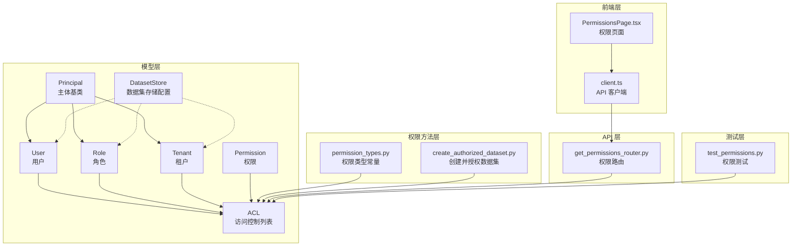
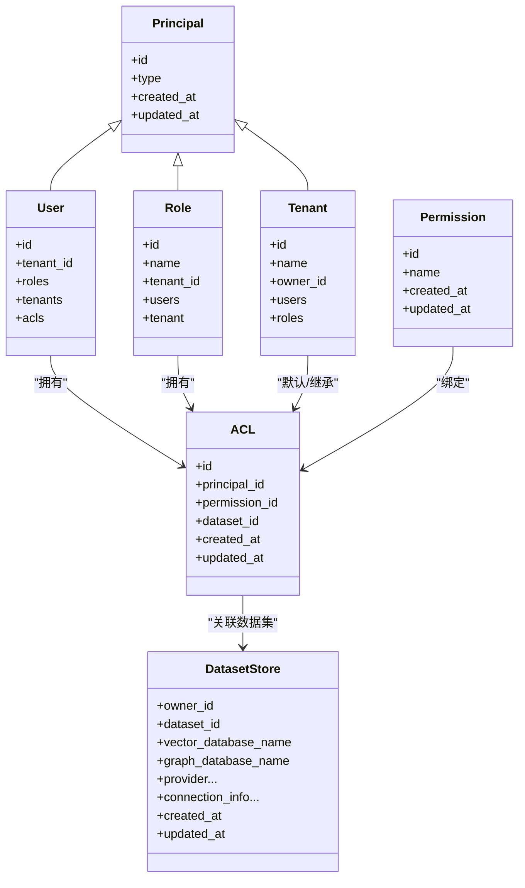
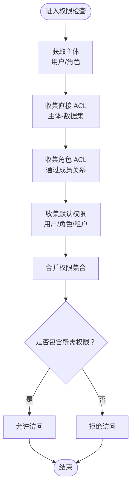
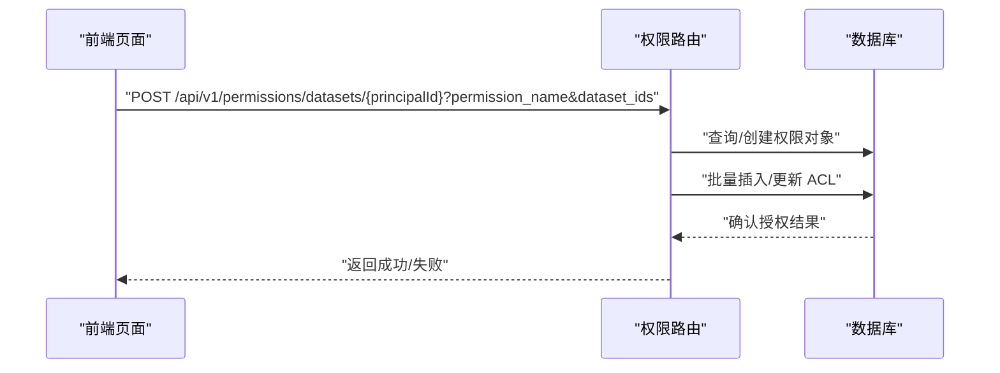
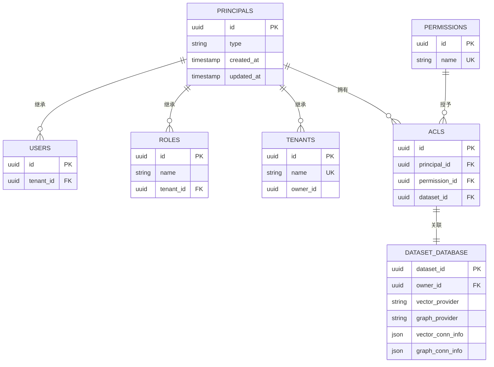

# 数据集权限控制

<cite>
**本文引用的文件**
- [Permission.py](file://m_flow/auth/models/Permission.py)
- [Principal.py](file://m_flow/auth/models/Principal.py)
- [User.py](file://m_flow/auth/models/User.py)
- [Role.py](file://m_flow/auth/models/Role.py)
- [Tenant.py](file://m_flow/auth/models/Tenant.py)
- [ACL.py](file://m_flow/auth/models/ACL.py)
- [DatasetStore.py](file://m_flow/auth/models/DatasetStore.py)
- [permission_types.py](file://m_flow/auth/permissions/permission_types.py)
- [create_authorized_dataset.py](file://m_flow/data/methods/create_authorized_dataset.py)
- [get_permissions_router.py](file://m_flow/api/v1/permissions/routers/get_permissions_router.py)
- [client.ts](file://m_flow-frontend/src/lib/api/client.ts)
- [PermissionsPage.tsx](file://m_flow-frontend/src/components/admin/PermissionsPage.tsx)
- [test_permissions.py](file://m_flow/tests/test_permissions.py)
</cite>

## 目录
1. [引言](#引言)
2. [项目结构](#项目结构)
3. [核心组件](#核心组件)
4. [架构总览](#架构总览)
5. [详细组件分析](#详细组件分析)
6. [依赖分析](#依赖分析)
7. [性能考量](#性能考量)
8. [故障排查指南](#故障排查指南)
9. [结论](#结论)
10. [附录](#附录)

## 引言
本文件系统性阐述本项目的“基于角色的数据集访问控制（RBAC）”模型与实现，覆盖以下关键主题：
- 权限类型与定义：读取、写入、删除、共享（管理）权限
- 权限检查机制：运行时校验用户对特定数据集的访问权限
- 权限继承与组合：用户权限、角色权限、租户默认权限的优先级与叠加
- 数据集存储模型：元数据与权限映射关系
- 权限缓存策略：预加载与失效机制
- 配置示例：批量授权与权限撤销
- 审计与日志：访问尝试监控与违规检测
- 性能优化与大规模部署建议

## 项目结构
围绕数据集权限控制的关键模块分布如下：
- 模型层（数据库持久化）：用户、角色、租户、权限、主体、访问控制列表、数据集存储配置
- 权限方法层：权限类型常量、授权与检查方法、默认权限授予
- API 层：权限相关路由与前端交互接口
- 前端层：权限页面与 API 客户端调用
- 测试层：权限行为与边界条件验证

图表来源
- [Principal.py:1-36](file://m_flow/auth/models/Principal.py#L1-L36)
- [User.py:1-87](file://m_flow/auth/models/User.py#L1-L87)
- [Role.py:1-48](file://m_flow/auth/models/Role.py#L1-L48)
- [Tenant.py:1-74](file://m_flow/auth/models/Tenant.py#L1-L74)
- [Permission.py:1-31](file://m_flow/auth/models/Permission.py#L1-L31)
- [ACL.py:1-38](file://m_flow/auth/models/ACL.py#L1-L38)
- [DatasetStore.py:1-49](file://m_flow/auth/models/DatasetStore.py#L1-L49)
- [permission_types.py:1-8](file://m_flow/auth/permissions/permission_types.py#L1-L8)
- [create_authorized_dataset.py:1-58](file://m_flow/data/methods/create_authorized_dataset.py#L1-L58)
- [get_permissions_router.py](file://m_flow/api/v1/permissions/routers/get_permissions_router.py)
- [client.ts:1056-1095](file://m_flow-frontend/src/lib/api/client.ts#L1056-L1095)
- [PermissionsPage.tsx:154-194](file://m_flow-frontend/src/components/admin/PermissionsPage.tsx#L154-L194)
- [test_permissions.py:189-229](file://m_flow/tests/test_permissions.py#L189-L229)

章节来源
- [Principal.py:1-36](file://m_flow/auth/models/Principal.py#L1-L36)
- [User.py:1-87](file://m_flow/auth/models/User.py#L1-L87)
- [Role.py:1-48](file://m_flow/auth/models/Role.py#L1-L48)
- [Tenant.py:1-74](file://m_flow/auth/models/Tenant.py#L1-L74)
- [Permission.py:1-31](file://m_flow/auth/models/Permission.py#L1-L31)
- [ACL.py:1-38](file://m_flow/auth/models/ACL.py#L1-L38)
- [DatasetStore.py:1-49](file://m_flow/auth/models/DatasetStore.py#L1-L49)
- [permission_types.py:1-8](file://m_flow/auth/permissions/permission_types.py#L1-L8)
- [create_authorized_dataset.py:1-58](file://m_flow/data/methods/create_authorized_dataset.py#L1-L58)
- [get_permissions_router.py](file://m_flow/api/v1/permissions/routers/get_permissions_router.py)
- [client.ts:1056-1095](file://m_flow-frontend/src/lib/api/client.ts#L1056-L1095)
- [PermissionsPage.tsx:154-194](file://m_flow-frontend/src/components/admin/PermissionsPage.tsx#L154-L194)
- [test_permissions.py:189-229](file://m_flow/tests/test_permissions.py#L189-L229)

## 核心组件
- 主体（Principal）：统一的“身份主体”抽象，派生出用户、角色、租户三类实体
- 用户（User）：应用注册用户，可归属租户、拥有角色、持有 ACL
- 角色（Role）：租户域内的命名权限集合，用户通过成员关系获得角色
- 租户（Tenant）：组织隔离单元，用户与角色归属其下
- 权限（Permission）：命名权限，如 read/write/delete/share
- 访问控制列表（ACL）：连接主体、权限与数据集的授权记录
- 数据集存储（DatasetStore）：为每个数据集维护独立的向量/图数据库配置

章节来源
- [Principal.py:1-36](file://m_flow/auth/models/Principal.py#L1-L36)
- [User.py:1-87](file://m_flow/auth/models/User.py#L1-L87)
- [Role.py:1-48](file://m_flow/auth/models/Role.py#L1-L48)
- [Tenant.py:1-74](file://m_flow/auth/models/Tenant.py#L1-L74)
- [Permission.py:1-31](file://m_flow/auth/models/Permission.py#L1-L31)
- [ACL.py:1-38](file://m_flow/auth/models/ACL.py#L1-L38)
- [DatasetStore.py:1-49](file://m_flow/auth/models/DatasetStore.py#L1-L49)

## 架构总览
权限控制采用“主体-权限-数据集”的三层映射，并结合租户域进行作用域限定。默认权限可通过“用户默认权限”“角色默认权限”“租户默认权限”注入，最终以显式 ACL 覆盖。

图表来源
- [Principal.py:1-36](file://m_flow/auth/models/Principal.py#L1-L36)
- [User.py:1-87](file://m_flow/auth/models/User.py#L1-L87)
- [Role.py:1-48](file://m_flow/auth/models/Role.py#L1-L48)
- [Tenant.py:1-74](file://m_flow/auth/models/Tenant.py#L1-L74)
- [Permission.py:1-31](file://m_flow/auth/models/Permission.py#L1-L31)
- [ACL.py:1-38](file://m_flow/auth/models/ACL.py#L1-L38)
- [DatasetStore.py:1-49](file://m_flow/auth/models/DatasetStore.py#L1-L49)

## 详细组件分析

### 权限类型与定义
- 支持的权限类型：读取（read）、写入（write）、删除（delete）、共享（share）
- 权限类型集中定义于常量文件中，供授权与检查流程使用

章节来源
- [permission_types.py:1-8](file://m_flow/auth/permissions/permission_types.py#L1-L8)

### 权限检查机制（运行时）
- 核心检查流程：根据当前用户、所选租户、目标数据集，合并“直接授权”“角色继承”“默认权限”，计算最终许可集合
- 典型检查步骤（概念流程）：
  1) 确定主体：用户或角色
  2) 收集直接 ACL：查询该主体在目标数据集上的显式授权
  3) 角色继承：收集主体所属角色的 ACL
  4) 默认权限：按租户域合并用户默认、角色默认、租户默认
  5) 合并去重：将所有来源的权限集合合并
  6) 判断：若请求的操作包含在集合内，则允许；否则拒绝

（此图为概念流程示意，不对应具体源码文件）

### 权限继承与组合规则
- 组合方式：直接 ACL 与角色继承 ACL 的权限集合进行并集
- 优先级（从高到低）：
  1) 显式 ACL（直接授权）：最高优先级，精确覆盖
  2) 角色继承：来自用户所属角色的权限
  3) 默认权限：用户默认、角色默认、租户默认的叠加
- 冲突处理：当同一权限在不同来源出现时，保留一次即可；不存在“降权”场景（仅增权）

（本节为规则说明，不直接分析具体文件）

### 数据集存储模型与权限映射
- 数据集存储模型（DatasetStore）为每个数据集保存独立的向量/图数据库连接信息，用于后续检索与图操作
- 权限映射通过 ACL 将主体、权限与数据集关联，形成“谁对哪些数据集拥有何种权限”的二维关系

章节来源
- [DatasetStore.py:1-49](file://m_flow/auth/models/DatasetStore.py#L1-L49)
- [ACL.py:1-38](file://m_flow/auth/models/ACL.py#L1-L38)

### 权限配置与批量操作
- 创建并授权数据集：新创建的数据集自动授予创建者全部权限（读/写/删/共享）
- 批量授权：前端通过 API 将指定权限一次性授予多个数据集
- 权限撤销：通过移除 ACL 或设置更严格的默认策略实现

图表来源
- [client.ts:1056-1095](file://m_flow-frontend/src/lib/api/client.ts#L1056-L1095)
- [PermissionsPage.tsx:154-194](file://m_flow-frontend/src/components/admin/PermissionsPage.tsx#L154-L194)
- [get_permissions_router.py](file://m_flow/api/v1/permissions/routers/get_permissions_router.py)

章节来源
- [create_authorized_dataset.py:1-58](file://m_flow/data/methods/create_authorized_dataset.py#L1-L58)
- [client.ts:1056-1095](file://m_flow-frontend/src/lib/api/client.ts#L1056-L1095)
- [PermissionsPage.tsx:154-194](file://m_flow-frontend/src/components/admin/PermissionsPage.tsx#L154-L194)

### 审计与日志
- 建议在权限检查路径上增加访问尝试记录（含主体、数据集、权限、结果、时间戳）
- 对拒绝访问（如越权删除）进行告警与审计日志输出
- 可结合现有日志基础设施与追踪工具实现

（本节为通用实践建议，不直接分析具体文件）

## 依赖分析
- 主体层次：User/Role/Tenant 继承自 Principal，统一身份标识与时间戳字段
- 关系映射：
  - User 与 Role 通过中间表建立多对多
  - User/Role/Tenant 与 ACL 为一对多
  - Permission 与 ACL 为多对一
  - DatasetStore 与数据集存在外键约束
- 外部依赖：权限类型常量、API 路由、前端客户端

图表来源
- [Principal.py:1-36](file://m_flow/auth/models/Principal.py#L1-L36)
- [User.py:1-87](file://m_flow/auth/models/User.py#L1-L87)
- [Role.py:1-48](file://m_flow/auth/models/Role.py#L1-L48)
- [Tenant.py:1-74](file://m_flow/auth/models/Tenant.py#L1-L74)
- [Permission.py:1-31](file://m_flow/auth/models/Permission.py#L1-L31)
- [ACL.py:1-38](file://m_flow/auth/models/ACL.py#L1-L38)
- [DatasetStore.py:1-49](file://m_flow/auth/models/DatasetStore.py#L1-L49)

章节来源
- [Principal.py:1-36](file://m_flow/auth/models/Principal.py#L1-L36)
- [User.py:1-87](file://m_flow/auth/models/User.py#L1-L87)
- [Role.py:1-48](file://m_flow/auth/models/Role.py#L1-L48)
- [Tenant.py:1-74](file://m_flow/auth/models/Tenant.py#L1-L74)
- [Permission.py:1-31](file://m_flow/auth/models/Permission.py#L1-L31)
- [ACL.py:1-38](file://m_flow/auth/models/ACL.py#L1-L38)
- [DatasetStore.py:1-49](file://m_flow/auth/models/DatasetStore.py#L1-L49)

## 性能考量
- 权限预加载：在用户会话初始化时，批量拉取其直接 ACL、角色 ACL 与默认权限，减少多次查询
- 缓存策略：
  - 短期缓存：按主体+租户+数据集维度缓存权限集合，TTL 依据业务变更频率设定
  - 失效机制：当 ACL 或默认权限发生变更时，主动失效相关缓存键
- 查询优化：
  - 在 ACL 查询中使用复合索引（主体、数据集、权限）
  - 使用批量查询减少往返次数
- 并发控制：在权限写入（授权/撤销）时使用事务与锁，避免竞态

（本节为通用优化建议，不直接分析具体文件）

## 故障排查指南
- 常见问题
  - 无权限访问：确认是否具备目标数据集的相应权限（读/写/删/共享）
  - 删除被拒：检查是否拥有删除权限，或是否为数据集所有者
  - 权限未生效：确认 ACL 是否正确创建，缓存是否已失效
- 排查步骤
  1) 核对权限类型是否正确
  2) 检查 ACL 记录是否存在
  3) 验证默认权限与角色继承是否覆盖
  4) 清理缓存后重试
- 单元测试参考
  - 测试覆盖了读取、写入、删除权限的行为与边界，可作为回归验证的基准

章节来源
- [test_permissions.py:189-229](file://m_flow/tests/test_permissions.py#L189-L229)

## 结论
本权限体系以“主体-权限-数据集”为核心，结合角色与租户域实现灵活的权限继承与组合。通过显式 ACL 与默认权限的协同，既保证了易用性，又提供了细粒度的控制能力。配合缓存与审计机制，可在大规模部署中保持高性能与可观测性。

## 附录

### API 与前端交互要点
- 前端通过 API 客户端发起批量授权请求，携带权限名称与数据集 ID 列表
- 权限路由负责解析参数、查找/创建权限对象、批量写入 ACL

章节来源
- [client.ts:1056-1095](file://m_flow-frontend/src/lib/api/client.ts#L1056-L1095)
- [PermissionsPage.tsx:154-194](file://m_flow-frontend/src/components/admin/PermissionsPage.tsx#L154-L194)
- [get_permissions_router.py](file://m_flow/api/v1/permissions/routers/get_permissions_router.py)