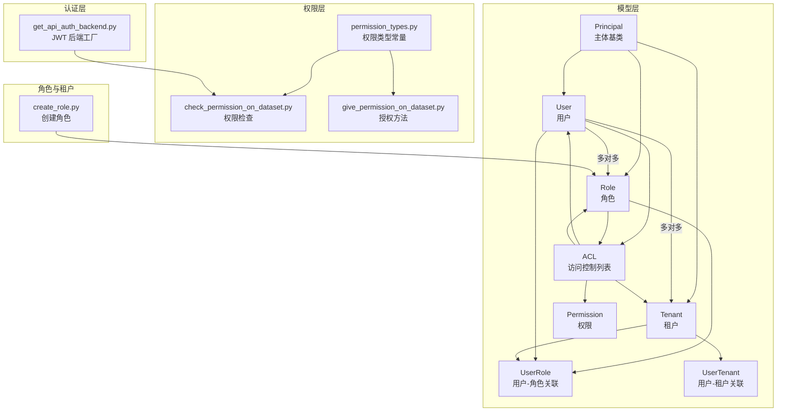
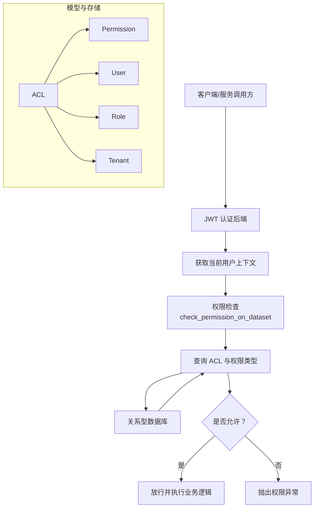
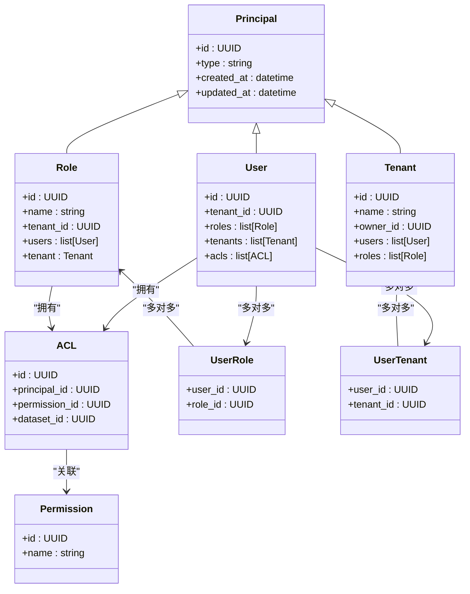
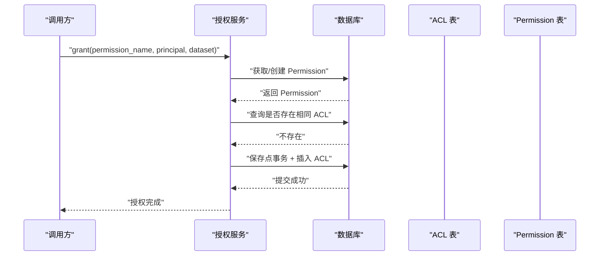
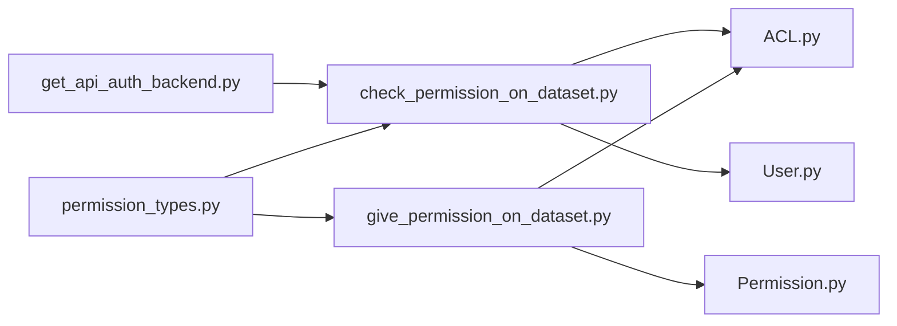

# 权限管理系统

<cite>
**本文引用的文件**
- [m_flow/auth/models/ACL.py](file://m_flow/auth/models/ACL.py)
- [m_flow/auth/models/Permission.py](file://m_flow/auth/models/Permission.py)
- [m_flow/auth/models/Role.py](file://m_flow/auth/models/Role.py)
- [m_flow/auth/models/Tenant.py](file://m_flow/auth/models/Tenant.py)
- [m_flow/auth/models/User.py](file://m_flow/auth/models/User.py)
- [m_flow/auth/models/Principal.py](file://m_flow/auth/models/Principal.py)
- [m_flow/auth/models/UserRole.py](file://m_flow/auth/models/UserRole.py)
- [m_flow/auth/models/UserTenant.py](file://m_flow/auth/models/UserTenant.py)
- [m_flow/auth/permissions/methods/check_permission_on_dataset.py](file://m_flow/auth/permissions/methods/check_permission_on_dataset.py)
- [m_flow/auth/permissions/methods/give_permission_on_dataset.py](file://m_flow/auth/permissions/methods/give_permission_on_dataset.py)
- [m_flow/auth/permissions/methods/__init__.py](file://m_flow/auth/permissions/methods/__init__.py)
- [m_flow/auth/permissions/permission_types.py](file://m_flow/auth/permissions/permission_types.py)
- [m_flow/auth/authentication/get_api_auth_backend.py](file://m_flow/auth/authentication/get_api_auth_backend.py)
- [m_flow/auth/roles/methods/create_role.py](file://m_flow/auth/roles/methods/create_role.py)
</cite>

## 目录
1. [简介](#简介)
2. [项目结构](#项目结构)
3. [核心组件](#核心组件)
4. [架构总览](#架构总览)
5. [详细组件分析](#详细组件分析)
6. [依赖分析](#依赖分析)
7. [性能考虑](#性能考虑)
8. [故障排查指南](#故障排查指南)
9. [结论](#结论)
10. [附录](#附录)

## 简介
本文件为 M-flow 权限管理系统的权威技术文档，聚焦于多租户架构设计与实现、用户认证体系（JWT 令牌、API 密钥）、数据集权限控制（基于角色与用户的细粒度访问控制）、权限模型与继承机制、权限检查与缓存策略、最佳实践与安全审计、API 与管理工具、扩展与自定义权限类型开发指南，以及与数据库适配器的集成方式。

## 项目结构
权限系统位于 m_flow/auth 子模块中，采用“模型-权限-认证-角色-租户”分层组织：
- 模型层：定义 Principal 基类与 User、Role、Tenant 的单表继承关系；ACL 作为权限与主体、数据集的关联表。
- 权限层：提供权限类型常量、权限检查与授权方法。
- 认证层：通过 FastAPI-Users 提供 JWT 策略与 API Bearer 传输。
- 角色与租户：角色与租户的创建与归属管理。

图表来源
- [m_flow/auth/models/Principal.py:20-36](file://m_flow/auth/models/Principal.py#L20-L36)
- [m_flow/auth/models/User.py:25-63](file://m_flow/auth/models/User.py#L25-L63)
- [m_flow/auth/models/Role.py:18-48](file://m_flow/auth/models/Role.py#L18-L48)
- [m_flow/auth/models/Tenant.py:24-74](file://m_flow/auth/models/Tenant.py#L24-L74)
- [m_flow/auth/models/ACL.py:21-38](file://m_flow/auth/models/ACL.py#L21-L38)
- [m_flow/auth/models/Permission.py:20-31](file://m_flow/auth/models/Permission.py#L20-L31)
- [m_flow/auth/models/UserRole.py:19-29](file://m_flow/auth/models/UserRole.py#L19-L29)
- [m_flow/auth/models/UserTenant.py:19-29](file://m_flow/auth/models/UserTenant.py#L19-L29)
- [m_flow/auth/permissions/permission_types.py:7-8](file://m_flow/auth/permissions/permission_types.py#L7-L8)
- [m_flow/auth/permissions/methods/check_permission_on_dataset.py:20-47](file://m_flow/auth/permissions/methods/check_permission_on_dataset.py#L20-L47)
- [m_flow/auth/permissions/methods/give_permission_on_dataset.py:39-93](file://m_flow/auth/permissions/methods/give_permission_on_dataset.py#L39-L93)
- [m_flow/auth/authentication/get_api_auth_backend.py:22-46](file://m_flow/auth/authentication/get_api_auth_backend.py#L22-L46)
- [m_flow/auth/roles/methods/create_role.py:24-83](file://m_flow/auth/roles/methods/create_role.py#L24-L83)

章节来源
- [m_flow/auth/models/Principal.py:20-36](file://m_flow/auth/models/Principal.py#L20-L36)
- [m_flow/auth/models/User.py:25-63](file://m_flow/auth/models/User.py#L25-L63)
- [m_flow/auth/models/Role.py:18-48](file://m_flow/auth/models/Role.py#L18-L48)
- [m_flow/auth/models/Tenant.py:24-74](file://m_flow/auth/models/Tenant.py#L24-L74)
- [m_flow/auth/models/ACL.py:21-38](file://m_flow/auth/models/ACL.py#L21-L38)
- [m_flow/auth/models/Permission.py:20-31](file://m_flow/auth/models/Permission.py#L20-L31)
- [m_flow/auth/models/UserRole.py:19-29](file://m_flow/auth/models/UserRole.py#L19-L29)
- [m_flow/auth/models/UserTenant.py:19-29](file://m_flow/auth/models/UserTenant.py#L19-L29)
- [m_flow/auth/permissions/permission_types.py:7-8](file://m_flow/auth/permissions/permission_types.py#L7-L8)
- [m_flow/auth/permissions/methods/check_permission_on_dataset.py:20-47](file://m_flow/auth/permissions/methods/check_permission_on_dataset.py#L20-L47)
- [m_flow/auth/permissions/methods/give_permission_on_dataset.py:39-93](file://m_flow/auth/permissions/methods/give_permission_on_dataset.py#L39-L93)
- [m_flow/auth/authentication/get_api_auth_backend.py:22-46](file://m_flow/auth/authentication/get_api_auth_backend.py#L22-L46)
- [m_flow/auth/roles/methods/create_role.py:24-83](file://m_flow/auth/roles/methods/create_role.py#L24-L83)

## 核心组件
- 主体与继承层次
  - Principal 为所有安全主体的基类，使用单表继承映射 type 字段区分 user、role、tenant。
  - User、Role、Tenant 继承自 Principal，分别维护与角色、租户、ACL 的关系。
- 权限与授权
  - Permission 表示可授予的权限名称集合；ACL 将主体（用户或角色）与特定数据集的权限进行绑定。
  - 权限类型由 permission_types.py 定义，当前支持读、写、删、共享四类。
- 多租户
  - Tenant 为组织级隔离单元，每个租户拥有独立的用户、角色与数据集。
  - User 与 Tenant 通过 UserTenant 关联，Role 与 Tenant 通过外键关联。
- 认证与会话
  - 通过 get_api_auth_backend 工厂创建 JWT 策略与 API Bearer 传输，支持长生命周期令牌。
- 角色管理
  - create_role 限制仅租户所有者可创建角色，并处理唯一性约束冲突。

章节来源
- [m_flow/auth/models/Principal.py:20-36](file://m_flow/auth/models/Principal.py#L20-L36)
- [m_flow/auth/models/User.py:25-63](file://m_flow/auth/models/User.py#L25-L63)
- [m_flow/auth/models/Role.py:18-48](file://m_flow/auth/models/Role.py#L18-L48)
- [m_flow/auth/models/Tenant.py:24-74](file://m_flow/auth/models/Tenant.py#L24-L74)
- [m_flow/auth/models/ACL.py:21-38](file://m_flow/auth/models/ACL.py#L21-L38)
- [m_flow/auth/models/Permission.py:20-31](file://m_flow/auth/models/Permission.py#L20-L31)
- [m_flow/auth/models/UserRole.py:19-29](file://m_flow/auth/models/UserRole.py#L19-L29)
- [m_flow/auth/models/UserTenant.py:19-29](file://m_flow/auth/models/UserTenant.py#L19-L29)
- [m_flow/auth/permissions/permission_types.py:7-8](file://m_flow/auth/permissions/permission_types.py#L7-L8)
- [m_flow/auth/authentication/get_api_auth_backend.py:22-46](file://m_flow/auth/authentication/get_api_auth_backend.py#L22-L46)
- [m_flow/auth/roles/methods/create_role.py:24-83](file://m_flow/auth/roles/methods/create_role.py#L24-L83)

## 架构总览
M-flow 权限系统以“主体-权限-资源（数据集）”为核心，结合多租户隔离与角色继承，形成可扩展的访问控制模型。认证层负责令牌签发与校验，授权层负责将权限授予主体并持久化到 ACL；运行时通过权限检查函数验证访问请求。

图表来源
- [m_flow/auth/authentication/get_api_auth_backend.py:22-46](file://m_flow/auth/authentication/get_api_auth_backend.py#L22-L46)
- [m_flow/auth/permissions/methods/check_permission_on_dataset.py:20-47](file://m_flow/auth/permissions/methods/check_permission_on_dataset.py#L20-L47)
- [m_flow/auth/models/ACL.py:21-38](file://m_flow/auth/models/ACL.py#L21-L38)
- [m_flow/auth/models/Permission.py:20-31](file://m_flow/auth/models/Permission.py#L20-L31)
- [m_flow/auth/models/User.py:25-63](file://m_flow/auth/models/User.py#L25-L63)
- [m_flow/auth/models/Role.py:18-48](file://m_flow/auth/models/Role.py#L18-L48)
- [m_flow/auth/models/Tenant.py:24-74](file://m_flow/auth/models/Tenant.py#L24-L74)

## 详细组件分析

### 数据模型与关系

图表来源
- [m_flow/auth/models/Principal.py:20-36](file://m_flow/auth/models/Principal.py#L20-L36)
- [m_flow/auth/models/User.py:25-63](file://m_flow/auth/models/User.py#L25-L63)
- [m_flow/auth/models/Role.py:18-48](file://m_flow/auth/models/Role.py#L18-L48)
- [m_flow/auth/models/Tenant.py:24-74](file://m_flow/auth/models/Tenant.py#L24-L74)
- [m_flow/auth/models/ACL.py:21-38](file://m_flow/auth/models/ACL.py#L21-L38)
- [m_flow/auth/models/Permission.py:20-31](file://m_flow/auth/models/Permission.py#L20-L31)
- [m_flow/auth/models/UserRole.py:19-29](file://m_flow/auth/models/UserRole.py#L19-L29)
- [m_flow/auth/models/UserTenant.py:19-29](file://m_flow/auth/models/UserTenant.py#L19-L29)

章节来源
- [m_flow/auth/models/Principal.py:20-36](file://m_flow/auth/models/Principal.py#L20-L36)
- [m_flow/auth/models/User.py:25-63](file://m_flow/auth/models/User.py#L25-L63)
- [m_flow/auth/models/Role.py:18-48](file://m_flow/auth/models/Role.py#L18-L48)
- [m_flow/auth/models/Tenant.py:24-74](file://m_flow/auth/models/Tenant.py#L24-L74)
- [m_flow/auth/models/ACL.py:21-38](file://m_flow/auth/models/ACL.py#L21-L38)
- [m_flow/auth/models/Permission.py:20-31](file://m_flow/auth/models/Permission.py#L20-L31)
- [m_flow/auth/models/UserRole.py:19-29](file://m_flow/auth/models/UserRole.py#L19-L29)
- [m_flow/auth/models/UserTenant.py:19-29](file://m_flow/auth/models/UserTenant.py#L19-L29)

### 权限模型与继承机制
- 权限类型
  - 通过 permission_types.py 定义受控的权限名称集合，当前包含读、写、删、共享四类。
- 角色与继承
  - Role 与 User 通过 UserRole 关联，形成“用户拥有角色”的继承链；ACL 可直接授予用户或角色对数据集的权限。
- 租户隔离
  - Tenant 作为组织边界，Role 与 User 均与租户关联，确保权限在租户内生效，避免跨租户越权。

章节来源
- [m_flow/auth/permissions/permission_types.py:7-8](file://m_flow/auth/permissions/permission_types.py#L7-L8)
- [m_flow/auth/models/Role.py:18-48](file://m_flow/auth/models/Role.py#L18-L48)
- [m_flow/auth/models/UserRole.py:19-29](file://m_flow/auth/models/UserRole.py#L19-L29)
- [m_flow/auth/models/Tenant.py:24-74](file://m_flow/auth/models/Tenant.py#L24-L74)

### 用户认证与会话管理
- JWT 策略
  - get_api_auth_backend 使用 FastAPI-Users 的 JWTStrategy，支持通过环境变量配置密钥与令牌有效期。
  - 在非开发环境强制要求正确配置密钥，防止生产风险。
- API Bearer 传输
  - 通过自定义传输层与策略组合，实现 API 调用中的 Bearer Token 认证。
- 会话与令牌生命周期
  - 默认令牌有效期为 10 小时，适用于长时间任务与后台作业场景。

章节来源
- [m_flow/auth/authentication/get_api_auth_backend.py:22-46](file://m_flow/auth/authentication/get_api_auth_backend.py#L22-L46)

### 数据集权限控制与授权流程
- 授权入口
  - give_permission_on_dataset 支持并发安全地创建权限与 ACL 条目，内部通过保存点与重试策略保证幂等性。
- 权限检查
  - check_permission_on_dataset 验证用户对目标数据集是否具备所需权限；若未提供用户则回退到种子用户。
- 幂等与冲突处理
  - 通过查询已存在 ACL 条目避免重复创建；数据库完整性错误视为幂等成功。

图表来源
- [m_flow/auth/permissions/methods/give_permission_on_dataset.py:39-93](file://m_flow/auth/permissions/methods/give_permission_on_dataset.py#L39-L93)
- [m_flow/auth/models/ACL.py:21-38](file://m_flow/auth/models/ACL.py#L21-L38)
- [m_flow/auth/models/Permission.py:20-31](file://m_flow/auth/models/Permission.py#L20-L31)

章节来源
- [m_flow/auth/permissions/methods/give_permission_on_dataset.py:39-93](file://m_flow/auth/permissions/methods/give_permission_on_dataset.py#L39-L93)
- [m_flow/auth/permissions/methods/check_permission_on_dataset.py:20-47](file://m_flow/auth/permissions/methods/check_permission_on_dataset.py#L20-L47)

### 运行时权限验证与缓存策略
- 权限检查路径
  - 通过 get_specific_user_permission_datasets 获取用户在指定数据集上的有效权限集合，随后在调用处进行判定。
- 缓存建议
  - 对热点数据集与用户组合建立短期缓存（如 Redis），减少频繁查询 ACL 的开销；缓存键可包含用户 ID、数据集 ID 与权限类型，过期时间与令牌一致或更短。
- 并发一致性
  - 授权流程使用保存点与指数退避重试，降低并发冲突概率；缓存更新需在授权完成后失效对应键，确保一致性。

章节来源
- [m_flow/auth/permissions/methods/check_permission_on_dataset.py:20-47](file://m_flow/auth/permissions/methods/check_permission_on_dataset.py#L20-L47)

### 角色与租户管理
- 创建角色
  - create_role 限定仅租户所有者可创建角色；内部校验租户所有权并处理唯一性约束冲突。
- 角色与用户
  - 通过 UserRole 将用户加入角色，从而继承该角色在租户内的权限。

章节来源
- [m_flow/auth/roles/methods/create_role.py:24-83](file://m_flow/auth/roles/methods/create_role.py#L24-L83)
- [m_flow/auth/models/UserRole.py:19-29](file://m_flow/auth/models/UserRole.py#L19-L29)

### 扩展与自定义权限类型
- 新增权限类型
  - 在 permission_types.py 中添加新类型字符串；授权与检查流程将自动识别新类型。
- 自定义权限语义
  - 可在 ACL 层引入额外字段（如条件表达式、范围限制）并通过权限检查扩展逻辑实现细粒度控制。
- 最小权限原则
  - 推荐为角色与用户分配最小必要权限，定期审计并清理冗余 ACL。

章节来源
- [m_flow/auth/permissions/permission_types.py:7-8](file://m_flow/auth/permissions/permission_types.py#L7-L8)

### 与数据库适配器的集成
- 异步会话
  - 授权与检查均通过 get_db_adapter 获取异步会话，确保与现有关系型适配器一致。
- 事务与保存点
  - 授权流程使用嵌套事务（SAVEPOINT）包裹插入操作，失败时回滚不影响外部事务。
- 错误处理
  - 对权限名不合法与数据库完整性错误进行分类处理，保障幂等与一致性。

章节来源
- [m_flow/auth/permissions/methods/give_permission_on_dataset.py:62-93](file://m_flow/auth/permissions/methods/give_permission_on_dataset.py#L62-L93)

## 依赖分析
- 组件耦合
  - 权限检查依赖权限类型常量与具体数据集授权方法；授权方法依赖权限模型与 ACL 持久化。
  - 认证后端与权限检查解耦，通过用户上下文传递当前主体。
- 外部依赖
  - FastAPI-Users 提供认证基础设施；SQLAlchemy 提供 ORM 映射与事务控制；tenacity 提供重试策略。
- 循环依赖
  - 模型间通过外键与关系定义，未见循环导入；权限方法通过相对导入组织清晰。

图表来源
- [m_flow/auth/permissions/permission_types.py:7-8](file://m_flow/auth/permissions/permission_types.py#L7-L8)
- [m_flow/auth/permissions/methods/check_permission_on_dataset.py:20-47](file://m_flow/auth/permissions/methods/check_permission_on_dataset.py#L20-L47)
- [m_flow/auth/permissions/methods/give_permission_on_dataset.py:39-93](file://m_flow/auth/permissions/methods/give_permission_on_dataset.py#L39-L93)
- [m_flow/auth/models/ACL.py:21-38](file://m_flow/auth/models/ACL.py#L21-L38)
- [m_flow/auth/models/Permission.py:20-31](file://m_flow/auth/models/Permission.py#L20-L31)
- [m_flow/auth/models/User.py:25-63](file://m_flow/auth/models/User.py#L25-L63)
- [m_flow/auth/authentication/get_api_auth_backend.py:22-46](file://m_flow/auth/authentication/get_api_auth_backend.py#L22-L46)

章节来源
- [m_flow/auth/permissions/methods/__init__.py:10-36](file://m_flow/auth/permissions/methods/__init__.py#L10-L36)

## 性能考虑
- 查询优化
  - ACL 查询应基于 principal_id、dataset_id、permission_id 建立复合索引，减少全表扫描。
- 并发控制
  - 授权流程使用保存点与重试，降低锁竞争；批量授权建议合并为单次事务，减少往返。
- 缓存策略
  - 对高频权限查询结果进行短期缓存，结合令牌过期时间同步失效。
- 日志与可观测性
  - 在权限检查与授权关键路径增加结构化日志，便于审计与问题定位。

## 故障排查指南
- 权限不足
  - 现象：调用被拒绝。
  - 排查：确认用户是否被授予目标数据集的相应权限；检查租户隔离是否正确。
- 令牌无效
  - 现象：认证失败或会话丢失。
  - 排查：核对 JWT 密钥配置与传输头格式；确认令牌未过期。
- 并发冲突
  - 现象：授权偶发失败。
  - 排查：授权流程已内置重试与保存点；检查数据库连接池与事务隔离级别。
- 角色创建失败
  - 现象：提示非租户所有者或名称冲突。
  - 排查：确认调用者为租户所有者；检查租户内角色名称唯一性。

章节来源
- [m_flow/auth/permissions/methods/give_permission_on_dataset.py:28-32](file://m_flow/auth/permissions/methods/give_permission_on_dataset.py#L28-L32)
- [m_flow/auth/roles/methods/create_role.py:62-63](file://m_flow/auth/roles/methods/create_role.py#L62-L63)

## 结论
M-flow 权限系统以清晰的模型分层与严格的租户隔离为基础，结合 RBAC 与数据集级 ACL 实现细粒度访问控制。通过 JWT 认证与幂等授权流程，系统在安全性与可用性之间取得平衡。建议在生产环境中启用强密钥配置、合理缓存策略与定期审计，持续遵循最小权限原则与安全最佳实践。

## 附录
- 最佳实践清单
  - 为每个租户设置独立的权限策略与默认权限。
  - 严格限制角色创建权限，仅授予租户所有者。
  - 对敏感数据集启用更严格的权限类型与条件控制。
  - 定期清理不再使用的 ACL 与角色，保持权限矩阵简洁。
  - 在网关或中间件层统一接入权限检查，避免遗漏。
- API 与管理工具
  - 授权接口：grant(permission_name, principal, dataset)。
  - 检查接口：check(user, permission_type, dataset_id)。
  - 角色管理：create_role(role_name, owner_id)。
  - 数据集授权查询：get_specific_user_permission_datasets(user_id, permission_type, dataset_ids)。