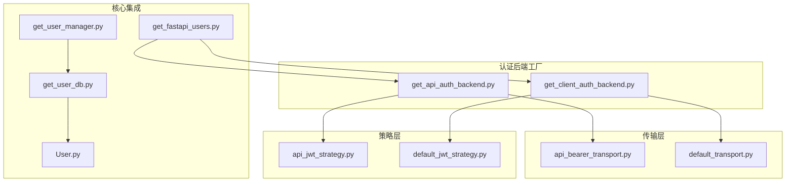
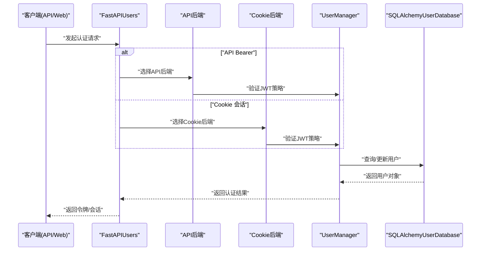
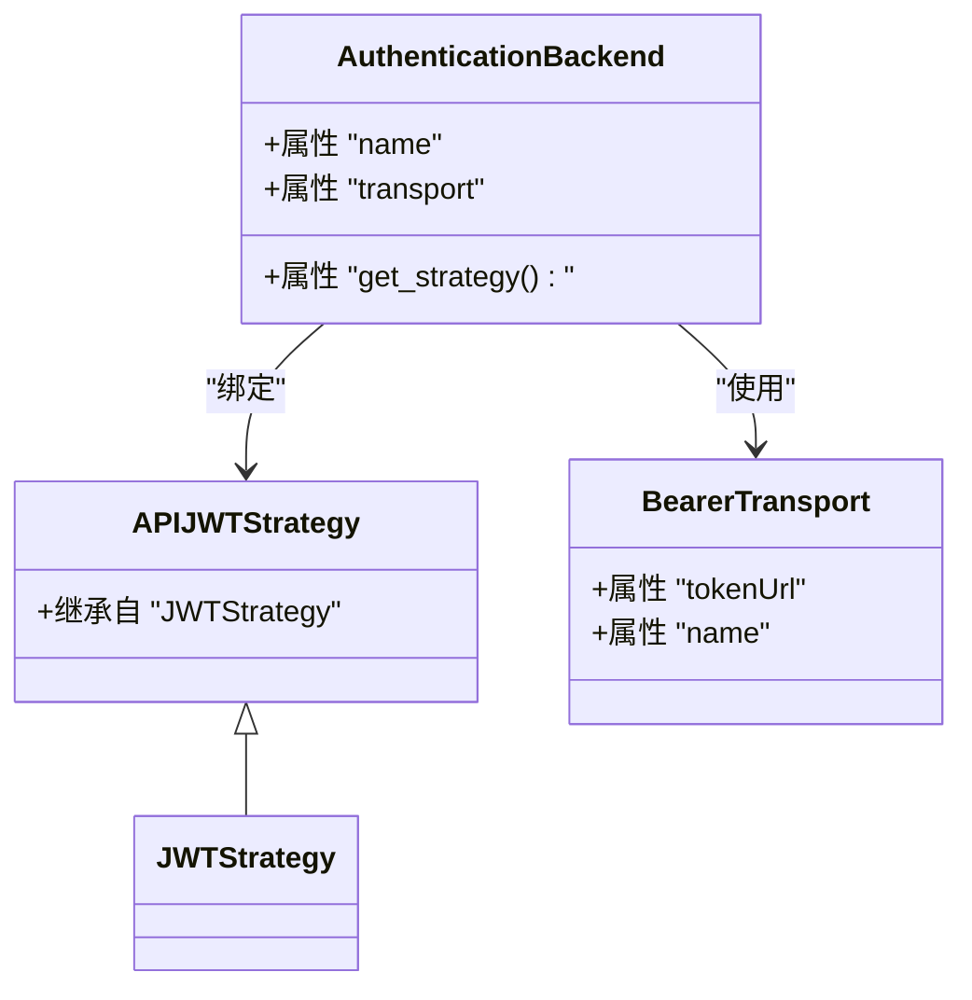
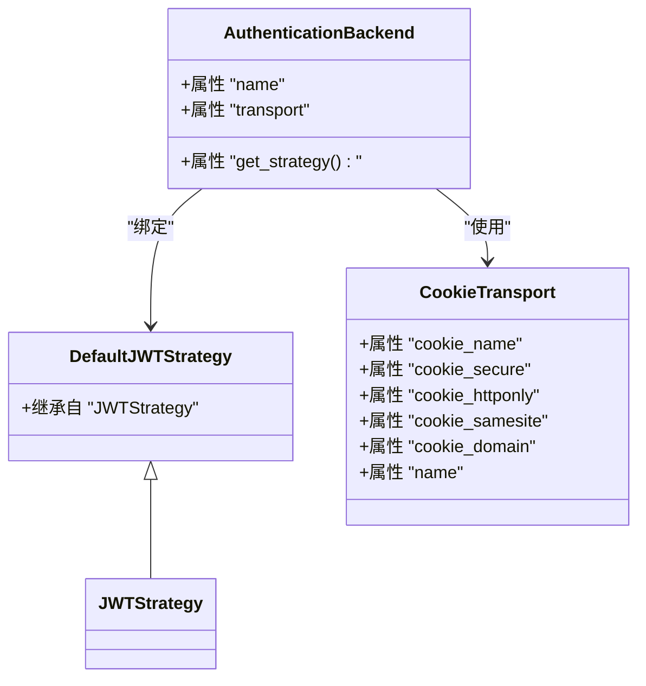
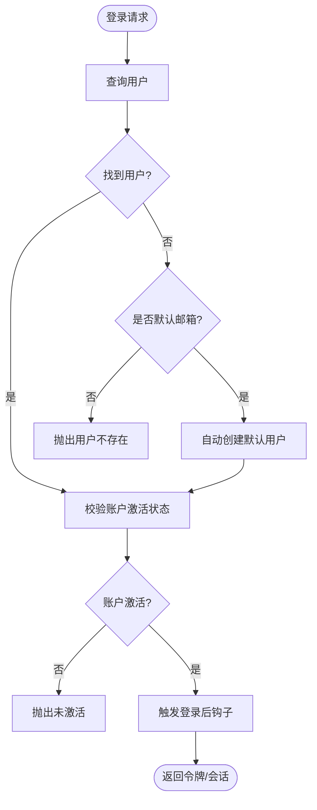
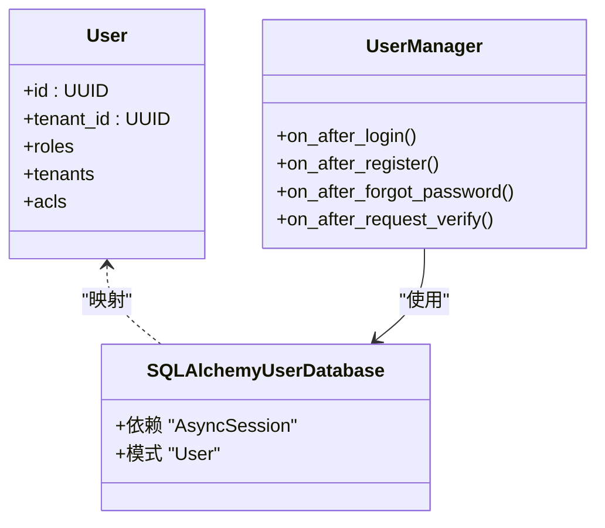
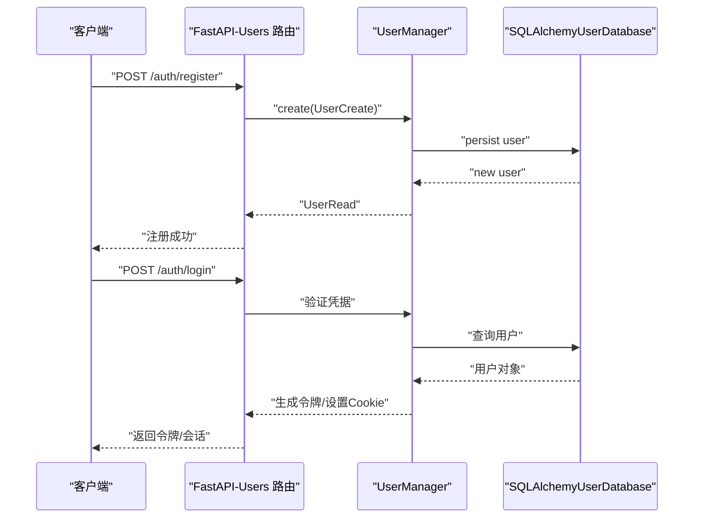
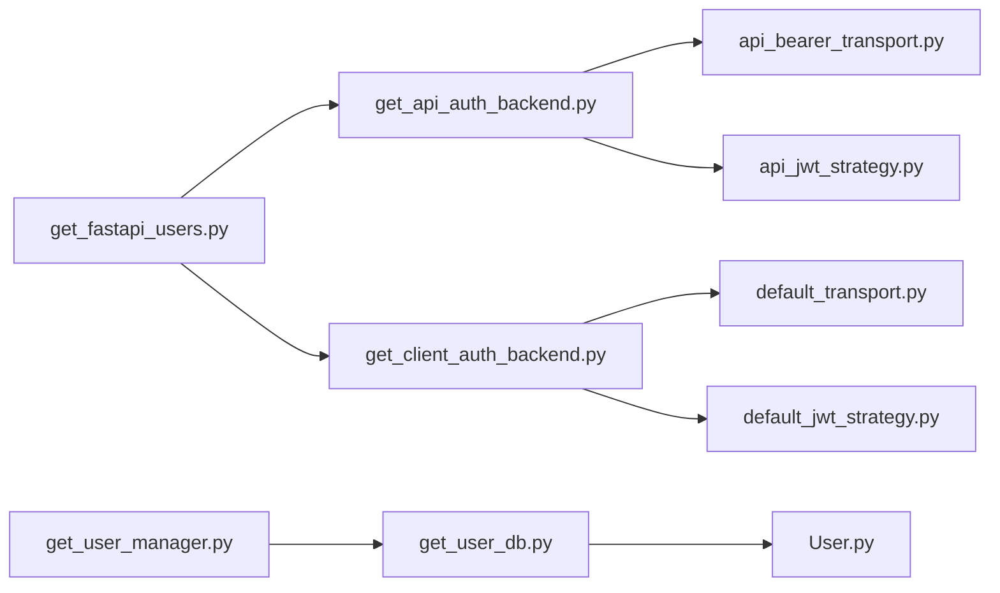

# 用户认证系统

<cite>
**本文引用的文件**
- [m_flow/auth/get_fastapi_users.py](file://m_flow/auth/get_fastapi_users.py)
- [m_flow/auth/authentication/get_api_auth_backend.py](file://m_flow/auth/authentication/get_api_auth_backend.py)
- [m_flow/auth/authentication/get_client_auth_backend.py](file://m_flow/auth/authentication/get_client_auth_backend.py)
- [m_flow/auth/authentication/api_bearer/__init__.py](file://m_flow/auth/authentication/api_bearer/__init__.py)
- [m_flow/auth/authentication/default/__init__.py](file://m_flow/auth/authentication/default/__init__.py)
- [m_flow/auth/authentication/api_bearer/api_bearer_transport.py](file://m_flow/auth/authentication/api_bearer/api_bearer_transport.py)
- [m_flow/auth/authentication/api_bearer/api_jwt_strategy.py](file://m_flow/auth/authentication/api_bearer/api_jwt_strategy.py)
- [m_flow/auth/authentication/default/default_transport.py](file://m_flow/auth/authentication/default/default_transport.py)
- [m_flow/auth/authentication/default/default_jwt_strategy.py](file://m_flow/auth/authentication/default/default_jwt_strategy.py)
- [m_flow/auth/security_check.py](file://m_flow/auth/security_check.py)
- [m_flow/auth/get_user_db.py](file://m_flow/auth/get_user_db.py)
- [m_flow/auth/get_user_manager.py](file://m_flow/auth/get_user_manager.py)
- [m_flow/auth/models/User.py](file://m_flow/auth/models/User.py)
- [m_flow/auth/methods/create_user.py](file://m_flow/auth/methods/create_user.py)
- [m_flow/auth/methods/get_authenticated_user.py](file://m_flow/auth/methods/get_authenticated_user.py)
</cite>

## 目录
1. [简介](#简介)
2. [项目结构](#项目结构)
3. [核心组件](#核心组件)
4. [架构总览](#架构总览)
5. [详细组件分析](#详细组件分析)
6. [依赖关系分析](#依赖关系分析)
7. [性能考虑](#性能考虑)
8. [故障排查指南](#故障排查指南)
9. [结论](#结论)
10. [附录](#附录)

## 简介
本文件系统性梳理基于 FastAPI Users 的用户认证体系，覆盖用户注册、登录、密码重置与邮箱验证流程；详解 JWT 令牌生成与验证机制（含过期与刷新策略）；记录 API Key 认证实现（无状态认证）；解释会话管理（存储、生命周期与安全策略）；介绍认证中间件（请求拦截、权限校验与错误处理）；提供认证配置最佳实践（安全参数与性能优化）；记录异常处理与调试方法；并给出自定义认证后端的扩展指南。

## 项目结构
认证子系统围绕 FastAPI Users 组织，采用“后端工厂 + 传输层 + 策略 + 管理器 + 模型”的分层设计：
- 后端工厂：分别创建 API Bearer 与 Cookie 客户端两种认证后端
- 传输层：BearerTransport（API）与 CookieTransport（Web 客户端）
- 策略层：JWTStrategy 子类化实现（API 与默认策略）
- 管理器：UserManager 扩展生命周期钩子与默认用户恢复逻辑
- 数据访问：SQLAlchemyUserDatabase 适配器与异步会话注入
- 模型：User ORM 映射与 FastAPI-Users 兼容的 Pydantic 模式

图表来源
- [m_flow/auth/get_fastapi_users.py:22-48](file://m_flow/auth/get_fastapi_users.py#L22-L48)
- [m_flow/auth/authentication/get_api_auth_backend.py:22-46](file://m_flow/auth/authentication/get_api_auth_backend.py#L22-L46)
- [m_flow/auth/authentication/get_client_auth_backend.py:22-48](file://m_flow/auth/authentication/get_client_auth_backend.py#L22-L48)
- [m_flow/auth/authentication/api_bearer/api_bearer_transport.py:11-17](file://m_flow/auth/authentication/api_bearer/api_bearer_transport.py#L11-L17)
- [m_flow/auth/authentication/default/default_transport.py:21-43](file://m_flow/auth/authentication/default/default_transport.py#L21-L43)
- [m_flow/auth/authentication/api_bearer/api_jwt_strategy.py:10-17](file://m_flow/auth/authentication/api_bearer/api_jwt_strategy.py#L10-L17)
- [m_flow/auth/authentication/default/default_jwt_strategy.py:8-16](file://m_flow/auth/authentication/default/default_jwt_strategy.py#L8-L16)
- [m_flow/auth/get_user_manager.py:28-169](file://m_flow/auth/get_user_manager.py#L28-L169)
- [m_flow/auth/get_user_db.py:23-58](file://m_flow/auth/get_user_db.py#L23-L58)
- [m_flow/auth/models/User.py:25-87](file://m_flow/auth/models/User.py#L25-L87)

章节来源
- [m_flow/auth/get_fastapi_users.py:22-48](file://m_flow/auth/get_fastapi_users.py#L22-L48)
- [m_flow/auth/authentication/get_api_auth_backend.py:22-46](file://m_flow/auth/authentication/get_api_auth_backend.py#L22-L46)
- [m_flow/auth/authentication/get_client_auth_backend.py:22-48](file://m_flow/auth/authentication/get_client_auth_backend.py#L22-L48)
- [m_flow/auth/get_user_manager.py:28-169](file://m_flow/auth/get_user_manager.py#L28-L169)
- [m_flow/auth/get_user_db.py:23-58](file://m_flow/auth/get_user_db.py#L23-L58)
- [m_flow/auth/models/User.py:25-87](file://m_flow/auth/models/User.py#L25-L87)

## 核心组件
- FastAPIUsers 单例：通过工厂函数集中初始化 API 与客户端双后端，确保全局唯一实例
- API Bearer 后端：面向无状态 API 的 Bearer 令牌认证，使用独立 JWT 策略与较短生命周期
- Cookie 客户端后端：面向 Web 客户端的 Cookie 会话认证，默认生命周期较短
- UserManager：扩展生命周期钩子（登录、注册、忘记密码、请求验证），内置默认用户自动恢复
- 数据访问层：SQLAlchemyUserDatabase 适配器与异步会话注入，支持并发安全与上下文管理
- 安全检查：统一从环境变量读取密钥，非开发环境强制要求配置，避免默认密钥泄露

章节来源
- [m_flow/auth/get_fastapi_users.py:22-48](file://m_flow/auth/get_fastapi_users.py#L22-L48)
- [m_flow/auth/authentication/get_api_auth_backend.py:22-46](file://m_flow/auth/authentication/get_api_auth_backend.py#L22-L46)
- [m_flow/auth/authentication/get_client_auth_backend.py:22-48](file://m_flow/auth/authentication/get_client_auth_backend.py#L22-L48)
- [m_flow/auth/get_user_manager.py:28-169](file://m_flow/auth/get_user_manager.py#L28-L169)
- [m_flow/auth/get_user_db.py:23-58](file://m_flow/auth/get_user_db.py#L23-L58)
- [m_flow/auth/security_check.py:19-80](file://m_flow/auth/security_check.py#L19-L80)

## 架构总览
下图展示认证主流程：API 与 Web 客户端分别通过各自后端进行身份验证，UserManager 负责业务钩子与默认用户恢复，数据访问通过 SQLAlchemyUserDatabase 完成持久化。

图表来源
- [m_flow/auth/get_fastapi_users.py:22-48](file://m_flow/auth/get_fastapi_users.py#L22-L48)
- [m_flow/auth/authentication/get_api_auth_backend.py:22-46](file://m_flow/auth/authentication/get_api_auth_backend.py#L22-L46)
- [m_flow/auth/authentication/get_client_auth_backend.py:22-48](file://m_flow/auth/authentication/get_client_auth_backend.py#L22-L48)
- [m_flow/auth/get_user_manager.py:28-169](file://m_flow/auth/get_user_manager.py#L28-L169)
- [m_flow/auth/get_user_db.py:23-58](file://m_flow/auth/get_user_db.py#L23-L58)

## 详细组件分析

### API Bearer 认证后端
- 传输层：以固定 tokenUrl 提供 Bearer 令牌交换接口
- 策略层：继承 JWTStrategy，令牌有效期较长，适合无状态 API 场景
- 安全检查：启动时即校验 JWT 密钥，非开发环境必须配置

图表来源
- [m_flow/auth/authentication/api_bearer/api_jwt_strategy.py:10-17](file://m_flow/auth/authentication/api_bearer/api_jwt_strategy.py#L10-L17)
- [m_flow/auth/authentication/api_bearer/api_bearer_transport.py:11-17](file://m_flow/auth/authentication/api_bearer/api_bearer_transport.py#L11-L17)
- [m_flow/auth/authentication/get_api_auth_backend.py:41-46](file://m_flow/auth/authentication/get_api_auth_backend.py#L41-L46)

章节来源
- [m_flow/auth/authentication/api_bearer/api_bearer_transport.py:11-17](file://m_flow/auth/authentication/api_bearer/api_bearer_transport.py#L11-L17)
- [m_flow/auth/authentication/api_bearer/api_jwt_strategy.py:10-17](file://m_flow/auth/authentication/api_bearer/api_jwt_strategy.py#L10-L17)
- [m_flow/auth/authentication/get_api_auth_backend.py:22-46](file://m_flow/auth/authentication/get_api_auth_backend.py#L22-L46)

### Cookie 客户端认证后端
- 传输层：CookieTransport，支持 httponly、samesite、domain 等安全字段
- 策略层：DefaultJWTStrategy（可扩展），令牌有效期较短，适合浏览器会话
- 安全检查：启动时校验密钥，非开发环境必须配置

图表来源
- [m_flow/auth/authentication/default/default_jwt_strategy.py:8-16](file://m_flow/auth/authentication/default/default_jwt_strategy.py#L8-L16)
- [m_flow/auth/authentication/default/default_transport.py:21-43](file://m_flow/auth/authentication/default/default_transport.py#L21-L43)
- [m_flow/auth/authentication/get_client_auth_backend.py:43-48](file://m_flow/auth/authentication/get_client_auth_backend.py#L43-L48)

章节来源
- [m_flow/auth/authentication/default/default_transport.py:21-43](file://m_flow/auth/authentication/default/default_transport.py#L21-L43)
- [m_flow/auth/authentication/default/default_jwt_strategy.py:8-16](file://m_flow/auth/authentication/default/default_jwt_strategy.py#L8-L16)
- [m_flow/auth/authentication/get_client_auth_backend.py:22-48](file://m_flow/auth/authentication/get_client_auth_backend.py#L22-L48)

### UserManager 生命周期钩子与默认用户恢复
- 密码重置与邮箱验证令牌密钥在类定义时校验，确保应用启动即发现配置问题
- 登录成功回调中，将 Set-Cookie 中的令牌提取并写入响应体，便于前端统一处理
- 自动恢复默认用户：当数据库重置后，首次以默认邮箱登录会自动创建该用户

图表来源
- [m_flow/auth/get_user_manager.py:47-113](file://m_flow/auth/get_user_manager.py#L47-L113)
- [m_flow/auth/get_user_manager.py:118-133](file://m_flow/auth/get_user_manager.py#L118-L133)

章节来源
- [m_flow/auth/get_user_manager.py:28-169](file://m_flow/auth/get_user_manager.py#L28-L169)

### 数据访问与模型
- 异步会话注入：通过依赖注入提供 SQLAlchemyUserDatabase，支持并发与事务
- User 模型：继承 FastAPI-Users 的 UUID 基表，扩展角色、租户、ACL 关系
- Pydantic 模式：UserRead/ UserCreate/ UserUpdate 与 FastAPI-Users 路由兼容

图表来源
- [m_flow/auth/models/User.py:25-87](file://m_flow/auth/models/User.py#L25-L87)
- [m_flow/auth/get_user_db.py:37-58](file://m_flow/auth/get_user_db.py#L37-L58)
- [m_flow/auth/get_user_manager.py:28-169](file://m_flow/auth/get_user_manager.py#L28-L169)

章节来源
- [m_flow/auth/get_user_db.py:23-58](file://m_flow/auth/get_user_db.py#L23-L58)
- [m_flow/auth/models/User.py:25-87](file://m_flow/auth/models/User.py#L25-L87)

### 注册与登录流程
- 注册：通过 create_user 封装用户创建、关系加载与可选自动登录
- 登录：API 使用 BearerTransport 交换 token；Web 使用 CookieTransport 设置会话

图表来源
- [m_flow/auth/methods/create_user.py:24-105](file://m_flow/auth/methods/create_user.py#L24-L105)
- [m_flow/auth/authentication/api_bearer/api_bearer_transport.py:11-17](file://m_flow/auth/authentication/api_bearer/api_bearer_transport.py#L11-L17)
- [m_flow/auth/authentication/default/default_transport.py:21-43](file://m_flow/auth/authentication/default/default_transport.py#L21-L43)

章节来源
- [m_flow/auth/methods/create_user.py:24-105](file://m_flow/auth/methods/create_user.py#L24-L105)

### 密码重置与邮箱验证
- 密钥校验：在类定义阶段对“重置密码令牌密钥”和“验证令牌密钥”进行生产安全检查
- 钩子扩展：on_after_forgot_password 与 on_after_request_verify 作为通知或工作流扩展点

章节来源
- [m_flow/auth/get_user_manager.py:36-45](file://m_flow/auth/get_user_manager.py#L36-L45)
- [m_flow/auth/get_user_manager.py:142-158](file://m_flow/auth/get_user_manager.py#L142-L158)

### 会话管理与安全策略
- API 会话：Bearer 令牌，适合无状态服务；建议配合速率限制与 IP 白名单
- Web 会话：Cookie 传输，支持 httponly、samesite、domain 等安全字段；生产环境需启用 secure 与 HTTPS
- 生命周期：API 默认较长有效期，Web 默认较短有效期；可根据业务调整

章节来源
- [m_flow/auth/authentication/api_bearer/api_bearer_transport.py:11-17](file://m_flow/auth/authentication/api_bearer/api_bearer_transport.py#L11-L17)
- [m_flow/auth/authentication/default/default_transport.py:21-43](file://m_flow/auth/authentication/default/default_transport.py#L21-L43)
- [m_flow/auth/authentication/get_api_auth_backend.py:17-19](file://m_flow/auth/authentication/get_api_auth_backend.py#L17-L19)
- [m_flow/auth/authentication/get_client_auth_backend.py:17-19](file://m_flow/auth/authentication/get_client_auth_backend.py#L17-L19)

### 认证中间件与权限检查
- 依赖注入：get_authenticated_user 将 FastAPIUsers.current_user 作为 FastAPI 依赖，支持可选/强制认证
- 环境开关：REQUIRE_AUTHENTICATION 与 ENABLE_BACKEND_ACCESS_CONTROL 控制是否强制认证
- 回退策略：未认证时尝试创建默认用户，失败则返回 500

章节来源
- [m_flow/auth/methods/get_authenticated_user.py:34-62](file://m_flow/auth/methods/get_authenticated_user.py#L34-L62)

## 依赖关系分析
- 组件耦合：后端工厂仅依赖传输与策略；UserManager 依赖数据库适配器；工厂依赖 UserManager 工厂
- 外部依赖：FastAPI Users、SQLAlchemy、环境变量
- 可能的循环依赖：当前结构清晰，未见循环导入

图表来源
- [m_flow/auth/get_fastapi_users.py:22-48](file://m_flow/auth/get_fastapi_users.py#L22-L48)
- [m_flow/auth/authentication/get_api_auth_backend.py:22-46](file://m_flow/auth/authentication/get_api_auth_backend.py#L22-L46)
- [m_flow/auth/authentication/get_client_auth_backend.py:22-48](file://m_flow/auth/authentication/get_client_auth_backend.py#L22-L48)
- [m_flow/auth/authentication/api_bearer/api_bearer_transport.py:11-17](file://m_flow/auth/authentication/api_bearer/api_bearer_transport.py#L11-L17)
- [m_flow/auth/authentication/api_bearer/api_jwt_strategy.py:10-17](file://m_flow/auth/authentication/api_bearer/api_jwt_strategy.py#L10-L17)
- [m_flow/auth/authentication/default/default_transport.py:21-43](file://m_flow/auth/authentication/default/default_transport.py#L21-L43)
- [m_flow/auth/authentication/default/default_jwt_strategy.py:8-16](file://m_flow/auth/authentication/default/default_jwt_strategy.py#L8-L16)
- [m_flow/auth/get_user_manager.py:28-169](file://m_flow/auth/get_user_manager.py#L28-L169)
- [m_flow/auth/get_user_db.py:23-58](file://m_flow/auth/get_user_db.py#L23-L58)
- [m_flow/auth/models/User.py:25-87](file://m_flow/auth/models/User.py#L25-L87)

章节来源
- [m_flow/auth/get_fastapi_users.py:22-48](file://m_flow/auth/get_fastapi_users.py#L22-L48)
- [m_flow/auth/get_user_manager.py:28-169](file://m_flow/auth/get_user_manager.py#L28-L169)
- [m_flow/auth/get_user_db.py:23-58](file://m_flow/auth/get_user_db.py#L23-L58)

## 性能考虑
- 缓存与单例：后端工厂与 FastAPIUsers 使用 LRU 缓存，避免重复初始化
- 异步数据库：SQLAlchemyUserDatabase 在请求上下文中按需注入，降低阻塞
- 并发安全：UserManager 对默认用户创建采用幂等与冲突检测，减少重试开销
- 令牌有效期：API 与 Web 后端分别设置不同有效期，平衡可用性与安全性

章节来源
- [m_flow/auth/get_fastapi_users.py:22-48](file://m_flow/auth/get_fastapi_users.py#L22-L48)
- [m_flow/auth/get_user_db.py:23-58](file://m_flow/auth/get_user_db.py#L23-L58)
- [m_flow/auth/get_user_manager.py:90-108](file://m_flow/auth/get_user_manager.py#L90-L108)

## 故障排查指南
- 密钥未配置：非开发环境缺少 JWT 或令牌密钥将直接抛错；请在环境变量中设置相应密钥
- 默认用户创建失败：检查数据库连接、唯一约束冲突与日志输出；必要时清理竞态条件后重试
- 登录后响应异常：确认 on_after_login 钩子是否正确设置响应头与状态码
- Cookie 安全：生产环境务必启用 cookie_secure 并使用 HTTPS；确保 samesite 与 domain 合理

章节来源
- [m_flow/auth/security_check.py:19-80](file://m_flow/auth/security_check.py#L19-L80)
- [m_flow/auth/get_user_manager.py:75-108](file://m_flow/auth/get_user_manager.py#L75-L108)
- [m_flow/auth/get_user_manager.py:118-133](file://m_flow/auth/get_user_manager.py#L118-L133)
- [m_flow/auth/authentication/default/default_transport.py:30-36](file://m_flow/auth/authentication/default/default_transport.py#L30-L36)

## 结论
本认证系统以 FastAPI Users 为核心，结合自定义传输与策略，实现了 API 与 Web 双场景认证；通过严格的密钥安全检查、生命周期钩子与默认用户恢复机制，兼顾了易用性与安全性。建议在生产环境启用 HTTPS、合理设置 Cookie 安全标志与令牌有效期，并配合速率限制与审计日志进一步强化安全。

## 附录

### API 密钥认证（无状态）最佳实践
- 使用独立的 JWT 密钥与较长有效期，适合微服务与 SDK 场景
- 建议配合 IP 白名单、速率限制与审计日志
- 前端统一从响应体提取 access_token 字段，保持与 Cookie 会话一致的交互体验

章节来源
- [m_flow/auth/authentication/get_api_auth_backend.py:17-19](file://m_flow/auth/authentication/get_api_auth_backend.py#L17-L19)
- [m_flow/auth/authentication/api_bearer/api_bearer_transport.py:11-17](file://m_flow/auth/authentication/api_bearer/api_bearer_transport.py#L11-L17)
- [m_flow/auth/get_user_manager.py:118-133](file://m_flow/auth/get_user_manager.py#L118-L133)

### 自定义认证后端扩展指南
- 新增传输：参考 CookieTransport 或 BearerTransport 的配置方式
- 新增策略：继承 JWTStrategy 并实现自定义签发/解析逻辑
- 注册后端：在工厂函数中组合新传输与策略，并加入 FastAPIUsers 实例

章节来源
- [m_flow/auth/authentication/default/default_transport.py:21-43](file://m_flow/auth/authentication/default/default_transport.py#L21-L43)
- [m_flow/auth/authentication/api_bearer/api_bearer_transport.py:11-17](file://m_flow/auth/authentication/api_bearer/api_bearer_transport.py#L11-L17)
- [m_flow/auth/authentication/default/default_jwt_strategy.py:8-16](file://m_flow/auth/authentication/default/default_jwt_strategy.py#L8-L16)
- [m_flow/auth/authentication/api_bearer/api_jwt_strategy.py:10-17](file://m_flow/auth/authentication/api_bearer/api_jwt_strategy.py#L10-L17)
- [m_flow/auth/get_fastapi_users.py:44-47](file://m_flow/auth/get_fastapi_users.py#L44-L47)