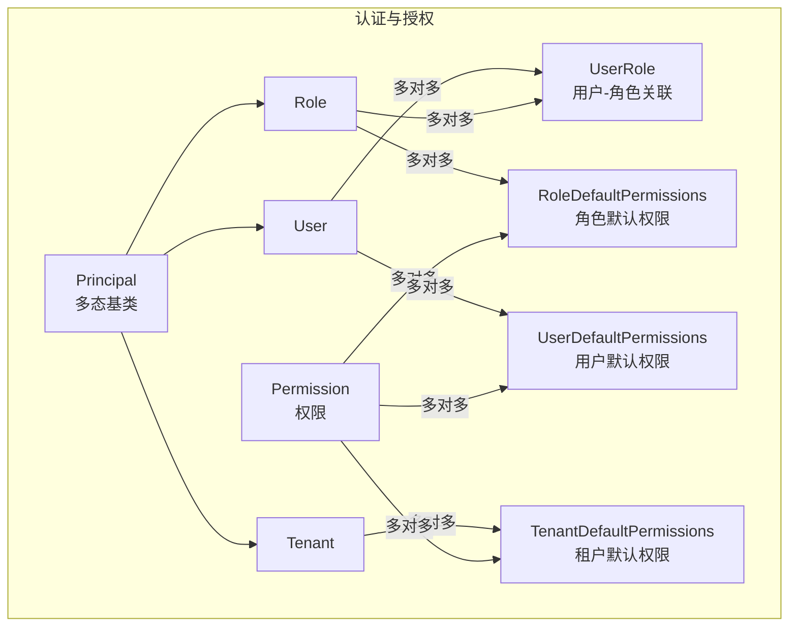
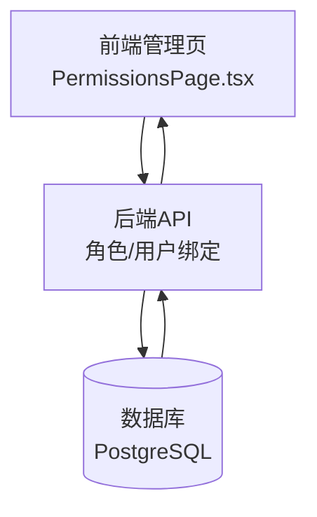
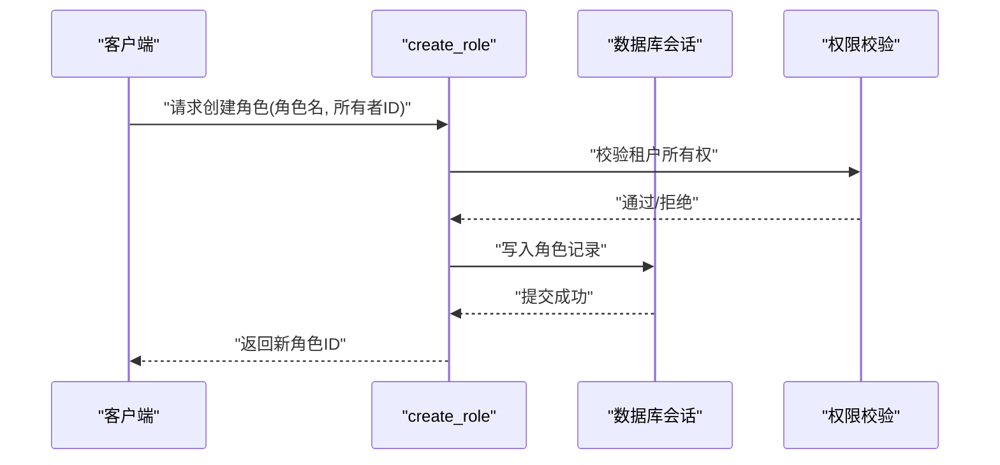
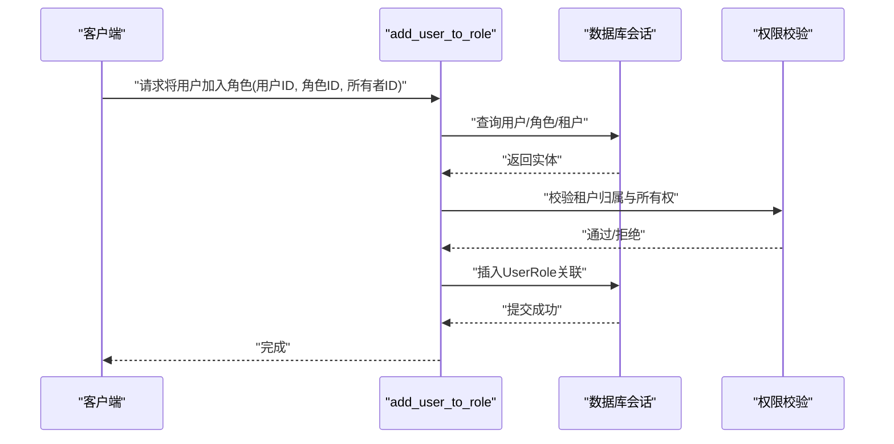
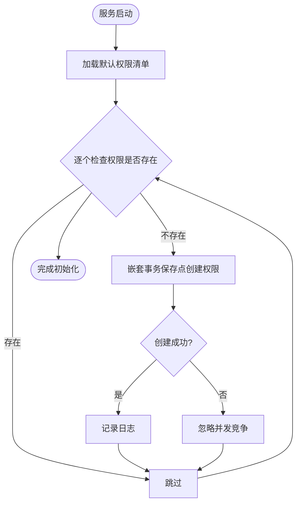
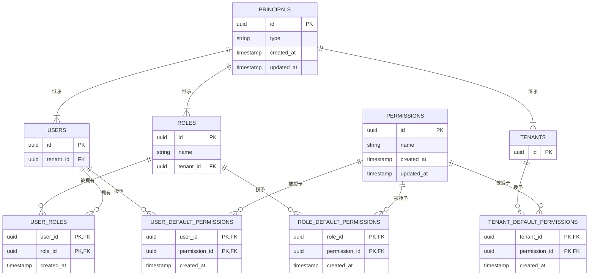
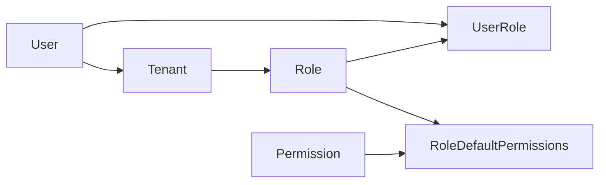

# 角色管理

<cite>
**本文引用的文件**
- [Role.py](file://m_flow/auth/models/Role.py)
- [UserRole.py](file://m_flow/auth/models/UserRole.py)
- [Permission.py](file://m_flow/auth/models/Permission.py)
- [RoleDefaultPermissions.py](file://m_flow/auth/models/RoleDefaultPermissions.py)
- [Principal.py](file://m_flow/auth/models/Principal.py)
- [Tenant.py](file://m_flow/auth/models/Tenant.py)
- [User.py](file://m_flow/auth/models/User.py)
- [create_role.py](file://m_flow/auth/roles/methods/create_role.py)
- [add_user_to_role.py](file://m_flow/auth/roles/methods/add_user_to_role.py)
- [UserDefaultPermissions.py](file://m_flow/auth/models/UserDefaultPermissions.py)
- [TenantDefaultPermissions.py](file://m_flow/auth/models/TenantDefaultPermissions.py)
- [create_db_and_tables.py](file://m_flow/adapters/relational/create_db_and_tables.py)
- [PermissionsPage.tsx](file://m_flow-frontend/src/components/admin/PermissionsPage.tsx)
</cite>

## 目录
1. [简介](#简介)
2. [项目结构](#项目结构)
3. [核心组件](#核心组件)
4. [架构总览](#架构总览)
5. [详细组件分析](#详细组件分析)
6. [依赖分析](#依赖分析)
7. [性能考量](#性能考量)
8. [故障排查指南](#故障排查指南)
9. [结论](#结论)
10. [附录](#附录)

## 简介
本文件系统性阐述基于角色的访问控制（RBAC）在本项目中的实现与使用，覆盖角色定义、权限分配、用户角色绑定、默认权限模板、多租户隔离、权限并发初始化、以及前端角色管理入口等。文档同时提供流程图与时序图帮助理解关键路径，并给出安全最佳实践与扩展指南。

## 项目结构
角色管理相关代码主要位于后端 m_flow/auth 子模块，采用“模型-方法-默认权限”三层设计：
- 模型层：定义实体关系与多态基类
- 方法层：封装角色创建、用户加入角色等业务流程
- 默认权限层：通过独立表为角色/租户/用户在创建时注入默认权限

图表来源
- [Principal.py:20-36](file://m_flow/auth/models/Principal.py#L20-L36)
- [User.py:25-63](file://m_flow/auth/models/User.py#L25-L63)
- [Tenant.py:24-74](file://m_flow/auth/models/Tenant.py#L24-L74)
- [Role.py:18-48](file://m_flow/auth/models/Role.py#L18-L48)
- [UserRole.py:19-29](file://m_flow/auth/models/UserRole.py#L19-L29)
- [Permission.py:20-31](file://m_flow/auth/models/Permission.py#L20-L31)
- [RoleDefaultPermissions.py:24-43](file://m_flow/auth/models/RoleDefaultPermissions.py#L24-L43)
- [UserDefaultPermissions.py:19-37](file://m_flow/auth/models/UserDefaultPermissions.py#L19-L37)
- [TenantDefaultPermissions.py:19-37](file://m_flow/auth/models/TenantDefaultPermissions.py#L19-L37)

章节来源
- [Principal.py:1-36](file://m_flow/auth/models/Principal.py#L1-L36)
- [User.py:1-87](file://m_flow/auth/models/User.py#L1-L87)
- [Tenant.py:1-74](file://m_flow/auth/models/Tenant.py#L1-L74)
- [Role.py:1-48](file://m_flow/auth/models/Role.py#L1-L48)
- [UserRole.py:1-29](file://m_flow/auth/models/UserRole.py#L1-L29)
- [Permission.py:1-31](file://m_flow/auth/models/Permission.py#L1-L31)
- [RoleDefaultPermissions.py:1-43](file://m_flow/auth/models/RoleDefaultPermissions.py#L1-L43)
- [UserDefaultPermissions.py:1-37](file://m_flow/auth/models/UserDefaultPermissions.py#L1-L37)
- [TenantDefaultPermissions.py:1-37](file://m_flow/auth/models/TenantDefaultPermissions.py#L1-L37)

## 核心组件
- 多态主体基类 Principal：统一用户、租户、角色的身份标识与时间戳字段，支持多态映射
- 用户 User：继承 Principal，关联租户、角色、ACL
- 租户 Tenant：继承 Principal，管理其下用户与角色
- 角色 Role：继承 Principal，限定在租户范围内，与用户通过 UserRole 关联
- 权限 Permission：独立实体，用于命名化权限
- 默认权限表：
  - RoleDefaultPermissions：角色创建时默认授予的权限集合
  - UserDefaultPermissions：用户创建时默认授予的权限集合
  - TenantDefaultPermissions：租户创建时默认授予的权限集合
- 关联表 UserRole：用户与角色的多对多关联，记录绑定时间

章节来源
- [Principal.py:20-36](file://m_flow/auth/models/Principal.py#L20-L36)
- [User.py:25-63](file://m_flow/auth/models/User.py#L25-L63)
- [Tenant.py:24-74](file://m_flow/auth/models/Tenant.py#L24-L74)
- [Role.py:18-48](file://m_flow/auth/models/Role.py#L18-L48)
- [UserRole.py:19-29](file://m_flow/auth/models/UserRole.py#L19-L29)
- [Permission.py:20-31](file://m_flow/auth/models/Permission.py#L20-L31)
- [RoleDefaultPermissions.py:24-43](file://m_flow/auth/models/RoleDefaultPermissions.py#L24-L43)
- [UserDefaultPermissions.py:19-37](file://m_flow/auth/models/UserDefaultPermissions.py#L19-L37)
- [TenantDefaultPermissions.py:19-37](file://m_flow/auth/models/TenantDefaultPermissions.py#L19-L37)

## 架构总览
RBAC 在本系统中以“多态主体 + 关联表 + 默认权限模板”的方式实现，强调：
- 多租户隔离：角色与权限均在租户维度生效
- 默认权限模板：角色/租户/用户创建时自动注入一组初始权限
- 并发安全：默认权限初始化采用保存点与异常回退策略
- 前端入口：提供角色与用户绑定的管理界面

图表来源
- [PermissionsPage.tsx:97-158](file://m_flow-frontend/src/components/admin/PermissionsPage.tsx#L97-L158)
- [PermissionsPage.tsx:214-248](file://m_flow-frontend/src/components/admin/PermissionsPage.tsx#L214-L248)

## 详细组件分析

### 角色创建与管理流程
- 角色创建：仅租户所有者可创建角色；创建成功后返回角色ID
- 用户加入角色：需验证请求者为租户所有者、用户与角色在同一租户内、且未重复绑定

图表来源
- [create_role.py:24-83](file://m_flow/auth/roles/methods/create_role.py#L24-L83)

图表来源
- [add_user_to_role.py:26-80](file://m_flow/auth/roles/methods/add_user_to_role.py#L26-L80)

章节来源
- [create_role.py:1-83](file://m_flow/auth/roles/methods/create_role.py#L1-L83)
- [add_user_to_role.py:1-80](file://m_flow/auth/roles/methods/add_user_to_role.py#L1-L80)

### 默认权限模板与并发初始化
- 默认权限模板：角色/租户/用户在创建时，从各自默认权限表中批量注入权限
- 并发初始化：启动时批量创建权限，使用嵌套事务保存点避免并发冲突

图表来源
- [create_db_and_tables.py:43-59](file://m_flow/adapters/relational/create_db_and_tables.py#L43-L59)

章节来源
- [RoleDefaultPermissions.py:1-43](file://m_flow/auth/models/RoleDefaultPermissions.py#L1-L43)
- [UserDefaultPermissions.py:1-37](file://m_flow/auth/models/UserDefaultPermissions.py#L1-L37)
- [TenantDefaultPermissions.py:1-37](file://m_flow/auth/models/TenantDefaultPermissions.py#L1-L37)
- [create_db_and_tables.py:43-59](file://m_flow/adapters/relational/create_db_and_tables.py#L43-L59)

### 数据模型与关系

图表来源
- [Principal.py:20-36](file://m_flow/auth/models/Principal.py#L20-L36)
- [User.py:25-63](file://m_flow/auth/models/User.py#L25-L63)
- [Tenant.py:24-74](file://m_flow/auth/models/Tenant.py#L24-L74)
- [Role.py:18-48](file://m_flow/auth/models/Role.py#L18-L48)
- [UserRole.py:19-29](file://m_flow/auth/models/UserRole.py#L19-L29)
- [Permission.py:20-31](file://m_flow/auth/models/Permission.py#L20-L31)
- [RoleDefaultPermissions.py:24-43](file://m_flow/auth/models/RoleDefaultPermissions.py#L24-L43)
- [UserDefaultPermissions.py:19-37](file://m_flow/auth/models/UserDefaultPermissions.py#L19-L37)
- [TenantDefaultPermissions.py:19-37](file://m_flow/auth/models/TenantDefaultPermissions.py#L19-L37)

章节来源
- [Principal.py:1-36](file://m_flow/auth/models/Principal.py#L1-L36)
- [User.py:1-87](file://m_flow/auth/models/User.py#L1-L87)
- [Tenant.py:1-74](file://m_flow/auth/models/Tenant.py#L1-L74)
- [Role.py:1-48](file://m_flow/auth/models/Role.py#L1-L48)
- [UserRole.py:1-29](file://m_flow/auth/models/UserRole.py#L1-L29)
- [Permission.py:1-31](file://m_flow/auth/models/Permission.py#L1-L31)
- [RoleDefaultPermissions.py:1-43](file://m_flow/auth/models/RoleDefaultPermissions.py#L1-L43)
- [UserDefaultPermissions.py:1-37](file://m_flow/auth/models/UserDefaultPermissions.py#L1-L37)
- [TenantDefaultPermissions.py:1-37](file://m_flow/auth/models/TenantDefaultPermissions.py#L1-L37)

### 角色层级与继承
当前代码库未实现“角色到角色”的继承关系。角色权限来源于：
- 角色默认权限模板（RoleDefaultPermissions）
- 用户直接授予的权限（ACL，由 User.acls 引用）

如需引入“角色到角色”的继承，建议新增：
- 角色到角色的继承表（例如 role_hierarchy），记录父角色与子角色
- 权限叠加算法：遍历继承链收集所有权限，去重合并
- 冲突解决策略：显式赋权优先于继承赋权，或按权限粒度进行合并

本节为概念性扩展说明，不对应具体源码。

### 多租户与默认权限
- 角色与权限均在租户维度生效：角色属于租户，权限通过默认权限表与租户/角色/用户关联
- 默认权限模板在创建时注入，确保新实体具备基础能力
- 并发初始化通过保存点与异常回退，保证幂等与一致性

章节来源
- [Tenant.py:24-74](file://m_flow/auth/models/Tenant.py#L24-L74)
- [Role.py:18-48](file://m_flow/auth/models/Role.py#L18-L48)
- [RoleDefaultPermissions.py:1-43](file://m_flow/auth/models/RoleDefaultPermissions.py#L1-L43)
- [UserDefaultPermissions.py:1-37](file://m_flow/auth/models/UserDefaultPermissions.py#L1-L37)
- [TenantDefaultPermissions.py:1-37](file://m_flow/auth/models/TenantDefaultPermissions.py#L1-L37)
- [create_db_and_tables.py:43-59](file://m_flow/adapters/relational/create_db_and_tables.py#L43-L59)

### 前端角色管理入口
- 提供“将用户分配到角色”的界面入口，便于管理员操作
- 建议后续补充“角色创建/编辑/删除”与“权限模板配置”界面

章节来源
- [PermissionsPage.tsx:97-158](file://m_flow-frontend/src/components/admin/PermissionsPage.tsx#L97-L158)
- [PermissionsPage.tsx:214-248](file://m_flow-frontend/src/components/admin/PermissionsPage.tsx#L214-L248)

## 依赖分析
- 组件耦合
  - Role 依赖 Tenant（外键）、Permission（通过 RoleDefaultPermissions）
  - User 通过 UserRole 与 Role 关联
  - 默认权限表均为 Join 表，解耦了权限与实体的直接绑定
- 外部依赖
  - 使用 SQLAlchemy 进行 ORM 映射与事务控制
  - 使用 PostgreSQL UUID 类型与唯一约束保障数据完整性
- 潜在循环依赖
  - 当前未发现循环导入；多对多通过中间表规避环状关系

图表来源
- [Role.py:18-48](file://m_flow/auth/models/Role.py#L18-L48)
- [UserRole.py:19-29](file://m_flow/auth/models/UserRole.py#L19-L29)
- [RoleDefaultPermissions.py:24-43](file://m_flow/auth/models/RoleDefaultPermissions.py#L24-L43)
- [Permission.py:20-31](file://m_flow/auth/models/Permission.py#L20-L31)
- [Tenant.py:24-74](file://m_flow/auth/models/Tenant.py#L24-L74)
- [User.py:25-63](file://m_flow/auth/models/User.py#L25-L63)

## 性能考量
- 查询路径
  - 用户-角色绑定：通过 UserRole 中间表进行多对多查询，建议在 user_id、role_id 上建立索引（已由主键隐含）
  - 角色默认权限：按角色批量读取，建议在 role_id 上保持高效
- 并发初始化
  - 使用嵌套事务保存点减少锁竞争，提升启动阶段的并发吞吐
- 建议
  - 对常用过滤字段（如 tenant_id、name、created_at）建立复合索引
  - 对默认权限表进行定期归档与清理，避免无限增长

## 故障排查指南
- 创建角色失败
  - 可能原因：非租户所有者调用、同租户下角色名冲突
  - 排查要点：确认 owner_id 与租户所有者一致；检查唯一约束冲突
- 将用户加入角色失败
  - 可能原因：用户与角色不在同一租户、请求者非租户所有者、重复绑定
  - 排查要点：核对用户所属租户集合；确认 UserRole 无重复主键
- 默认权限未生效
  - 可能原因：初始化未执行或并发竞争导致未创建
  - 排查要点：查看初始化日志；确认权限名称是否存在于清单

章节来源
- [create_role.py:73-76](file://m_flow/auth/roles/methods/create_role.py#L73-L76)
- [add_user_to_role.py:78-79](file://m_flow/auth/roles/methods/add_user_to_role.py#L78-L79)
- [create_db_and_tables.py:43-59](file://m_flow/adapters/relational/create_db_and_tables.py#L43-L59)

## 结论
本角色管理方案以多态主体与关联表为核心，结合默认权限模板与并发安全初始化，实现了清晰的多租户 RBAC 能力。当前未实现“角色到角色”的继承，但提供了扩展点。建议在后续版本中引入角色继承与权限叠加策略，并完善前端角色管理界面。

## 附录
- 安全最佳实践
  - 最小权限原则：仅授予完成任务所需的最小权限集合
  - 定期审计：对角色与权限变更进行审计，追踪权限使用情况
  - 分离职责：租户所有者与角色管理者分离，避免权限滥用
- 扩展开发指南
  - 新增角色类型：可在 Principal 基类上扩展新的多态类型，并为其建立默认权限模板表
  - 角色继承：新增角色到角色的继承表与权限叠加算法，明确冲突解决策略
  - 动态权限：在现有 ACL 与默认权限基础上，增加临时权限授予与回收接口