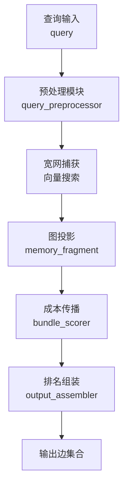
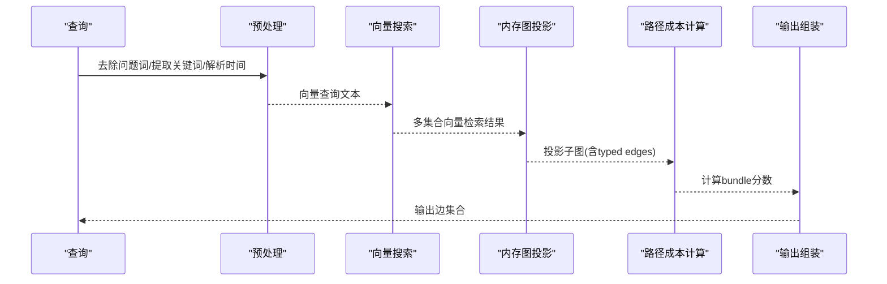
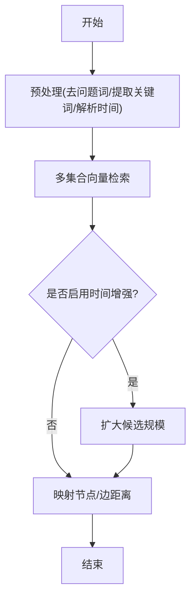
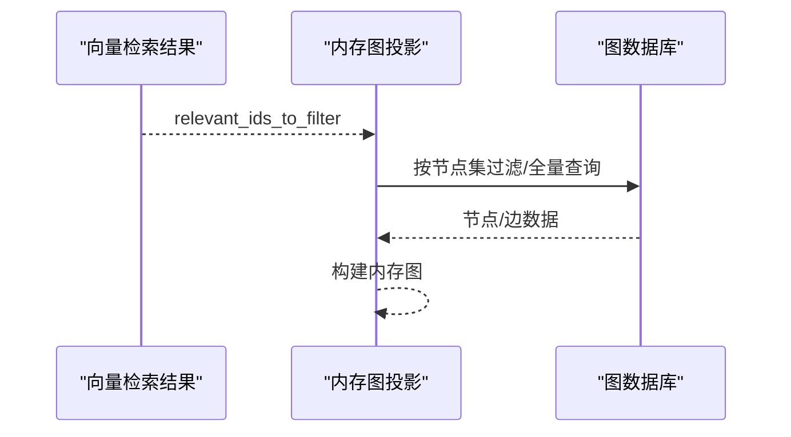
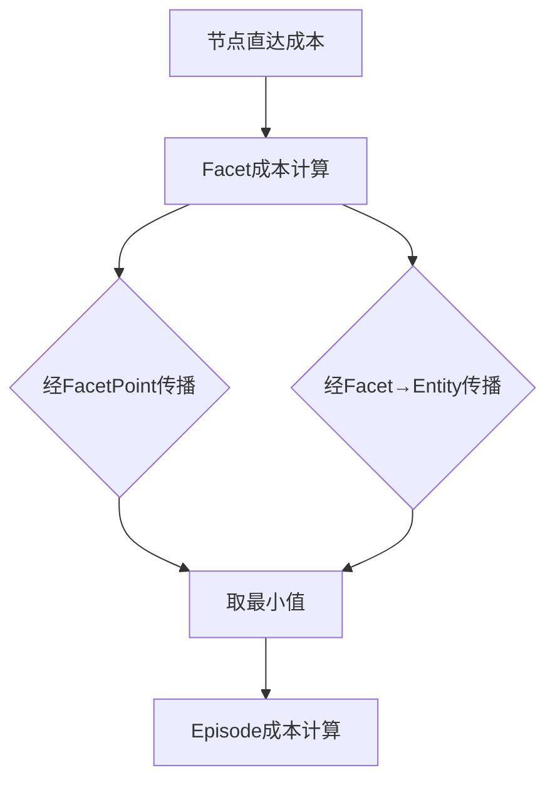
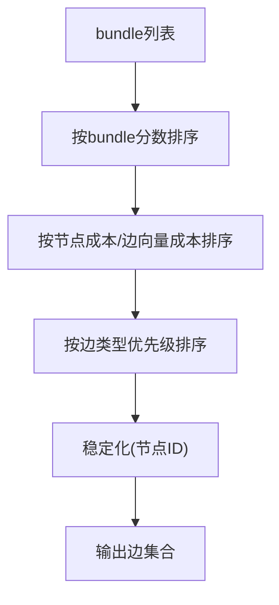
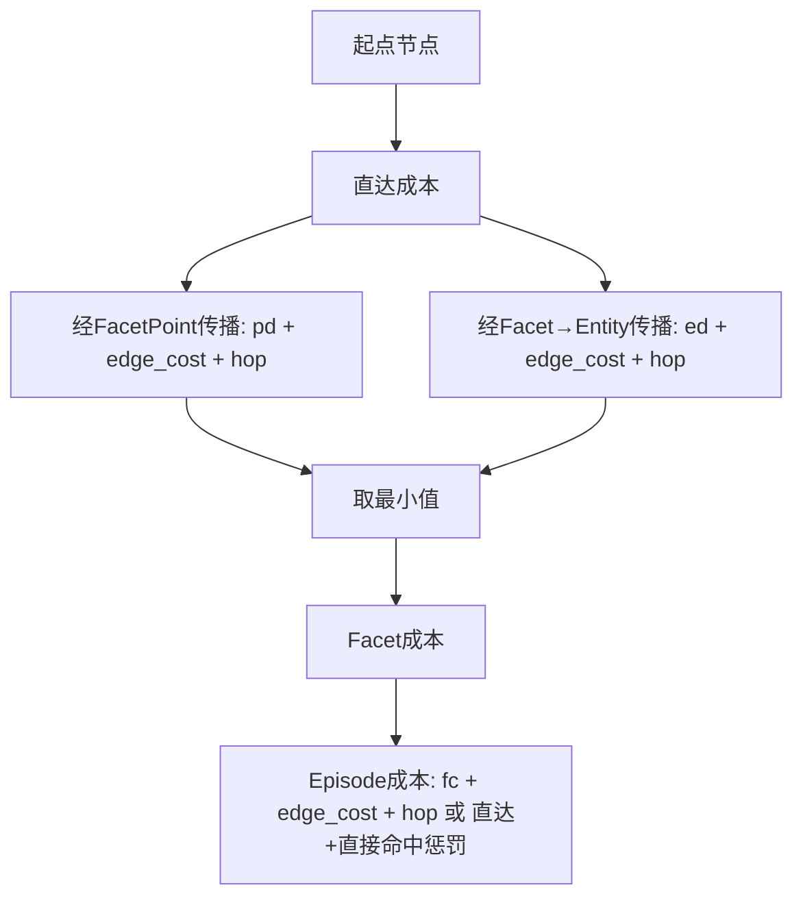
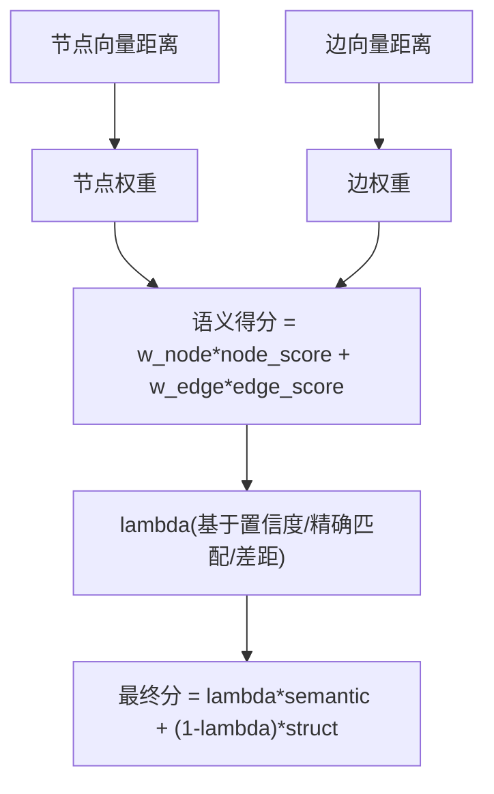
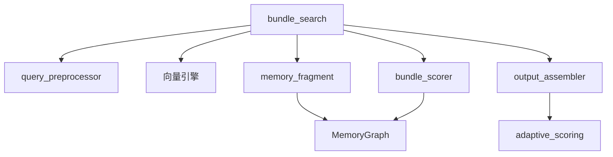

# 图路由检索机制

<cite>
**本文引用的文件**
- [bundle_search.py](file://m_flow/retrieval/episodic/bundle_search.py)
- [bundle_scorer.py](file://m_flow/retrieval/episodic/bundle_scorer.py)
- [memory_fragment.py](file://m_flow/retrieval/episodic/memory_fragment.py)
- [output_assembler.py](file://m_flow/retrieval/episodic/output_assembler.py)
- [config.py](file://m_flow/retrieval/episodic/config.py)
- [query_preprocessor.py](file://m_flow/retrieval/episodic/query_preprocessor.py)
- [exact_match_bonus.py](file://m_flow/retrieval/episodic/exact_match_bonus.py)
- [adaptive_scoring.py](file://m_flow/retrieval/episodic/adaptive_scoring.py)
- [MemoryGraph.py](file://m_flow/knowledge/graph_ops/m_flow_graph/MemoryGraph.py)
- [unified_triplet_search.py](file://m_flow/retrieval/unified_triplet_search.py)
- [fine_grained_triplet_search.py](file://m_flow/retrieval/utils/fine_grained_triplet_search.py)
</cite>

## 目录
1. [引言](#引言)
2. [项目结构](#项目结构)
3. [核心组件](#核心组件)
4. [架构总览](#架构总览)
5. [详细组件分析](#详细组件分析)
6. [依赖关系分析](#依赖关系分析)
7. [性能考量](#性能考量)
8. [故障排查指南](#故障排查指南)
9. [结论](#结论)

## 引言
本文件系统性阐述 M-flow 的“图路由检索”机制，重点对比传统扁平检索与图路由检索的根本差异，并深入解析 Episodic Bundle Search 的四个阶段：宽网捕获、图投影、成本传播、排名组装。文档还详细解释路径成本计算原理（起点成本、边成本、跳跃惩罚、缺失惩罚），阐述最小值原则的设计哲学（为何选择最优路径而非平均路径），说明直接命中惩罚的作用机制，以及“直接命中惩罚”的设计意图以防止宽泛摘要主导检索结果。此外，文档给出证据链评分机制，解释 typed edges 与语义权重如何实现精确的知识关联，并提供算法流程图与计算示例帮助理解。

## 项目结构
围绕图路由检索的关键模块主要位于 m_flow/retrieval/episodic 及其子目录，配合知识图谱投影与向量检索适配器，形成端到端的检索流水线。

图表来源
- [bundle_search.py:40-265](file://m_flow/retrieval/episodic/bundle_search.py#L40-L265)
- [query_preprocessor.py:97-142](file://m_flow/retrieval/episodic/query_preprocessor.py#L97-L142)
- [memory_fragment.py:20-84](file://m_flow/retrieval/episodic/memory_fragment.py#L20-L84)
- [bundle_scorer.py:144-301](file://m_flow/retrieval/episodic/bundle_scorer.py#L144-L301)
- [output_assembler.py:30-84](file://m_flow/retrieval/episodic/output_assembler.py#L30-L84)

章节来源
- [bundle_search.py:40-265](file://m_flow/retrieval/episodic/bundle_search.py#L40-L265)
- [config.py:12-193](file://m_flow/retrieval/episodic/config.py#L12-L193)

## 核心组件
- 预处理模块：剥离问题词、提取关键词、判断混合语言/数字/短句触发混合检索、解析时间表达式并进行时间增强。
- 宽网捕获：在多个向量集合上执行向量检索，扩大候选集，支持基于时间的召回扩展。
- 图投影：从持久化图数据库投影子图，保留 Episode/Facet/FacetPoint/Entity 等节点与 typed edges，用于后续路径成本计算。
- 成本传播：构建 Episode-Facet-Point-Entity 关系索引，计算节点直达成本与经由边的传播成本，形成最小代价路径。
- 排名组装：根据 bundle 分数与边向量距离、边类型优先级等进行排序，输出最终边集合；支持自适应打分与时间增强。

章节来源
- [query_preprocessor.py:97-142](file://m_flow/retrieval/episodic/query_preprocessor.py#L97-L142)
- [bundle_search.py:312-344](file://m_flow/retrieval/episodic/bundle_search.py#L312-L344)
- [memory_fragment.py:20-84](file://m_flow/retrieval/episodic/memory_fragment.py#L20-L84)
- [bundle_scorer.py:55-301](file://m_flow/retrieval/episodic/bundle_scorer.py#L55-L301)
- [output_assembler.py:30-84](file://m_flow/retrieval/episodic/output_assembler.py#L30-L84)

## 架构总览
下图展示从查询到最终输出边的端到端流程，强调“图路由”与“扁平检索”的差异：扁平检索仅依赖向量分数；图路由在向量基础上引入图拓扑与 typed edges 的传播成本，从而获得更可解释、更稳定的排序。

图表来源
- [bundle_search.py:104-265](file://m_flow/retrieval/episodic/bundle_search.py#L104-L265)
- [memory_fragment.py:20-84](file://m_flow/retrieval/episodic/memory_fragment.py#L20-L84)
- [bundle_scorer.py:144-301](file://m_flow/retrieval/episodic/bundle_scorer.py#L144-L301)
- [output_assembler.py:30-84](file://m_flow/retrieval/episodic/output_assembler.py#L30-L84)

## 详细组件分析

### 扁平检索 vs 图路由检索：根本差异
- 扁平检索：直接使用向量分数进行排序，不考虑节点间拓扑关系与 typed edges 的语义权重，易受宽泛摘要或噪声边影响。
- 图路由检索：在向量基础上引入“路径成本”，通过 typed edges 在 Episode/Facet/Point/Entity 之间传播成本，形成最小代价路径，提升排序稳定性与可解释性。

章节来源
- [bundle_search.py:104-265](file://m_flow/retrieval/episodic/bundle_search.py#L104-L265)
- [bundle_scorer.py:144-301](file://m_flow/retrieval/episodic/bundle_scorer.py#L144-L301)

### Bundle Search 四个阶段详解

#### 阶段一：宽网捕获（Wide Search Capture）
- 对多个向量集合执行并行检索，扩大候选集；当查询包含时间表达且置信度达标时，按倍数扩大候选规模。
- 将各集合的向量检索结果映射回节点与边，为后续图投影与成本计算提供基础。

图表来源
- [bundle_search.py:104-156](file://m_flow/retrieval/episodic/bundle_search.py#L104-L156)
- [bundle_search.py:312-344](file://m_flow/retrieval/episodic/bundle_search.py#L312-L344)

章节来源
- [bundle_search.py:104-156](file://m_flow/retrieval/episodic/bundle_search.py#L104-L156)
- [bundle_search.py:312-344](file://m_flow/retrieval/episodic/bundle_search.py#L312-L344)

#### 阶段二：图投影（Graph Projection）
- 基于宽网捕获得到的相关 ID 列表，从图数据库投影子图，保留 Episode/Facet/FacetPoint/Entity 节点与 typed edges。
- 支持严格节点集过滤模式，避免空结果导致的误判。

图表来源
- [memory_fragment.py:20-84](file://m_flow/retrieval/episodic/memory_fragment.py#L20-L84)
- [MemoryGraph.py:170-200](file://m_flow/knowledge/graph_ops/m_flow_graph/MemoryGraph.py#L170-L200)

章节来源
- [memory_fragment.py:20-84](file://m_flow/retrieval/episodic/memory_fragment.py#L20-L84)
- [MemoryGraph.py:170-200](file://m_flow/knowledge/graph_ops/m_flow_graph/MemoryGraph.py#L170-L200)

#### 阶段三：成本传播（Cost Propagation）
- 构建关系索引：Episode-Facet、Facet-FacetPoint、Episode-Entity、Facet-Entity。
- 计算节点直达成本与经由边的传播成本，采用最小值原则选择最优路径。
- 为 Facet 计算三种来源的最小成本：直达、经 FacetPoint、经 Facet→Entity。

图表来源
- [bundle_scorer.py:144-301](file://m_flow/retrieval/episodic/bundle_scorer.py#L144-L301)

章节来源
- [bundle_scorer.py:144-301](file://m_flow/retrieval/episodic/bundle_scorer.py#L144-L301)

#### 阶段四：排名组装（Ranking Assembly）
- 依据 bundle 分数与边向量距离、边类型优先级、时间增强等因素进行排序。
- 支持两种显示模式：summary（仅 Episode 摘要）与 detail（仅 Episode→Facet/Entity 边）。
- 可选自适应打分：融合语义得分与结构得分，动态调整权重。

图表来源
- [output_assembler.py:506-722](file://m_flow/retrieval/episodic/output_assembler.py#L506-L722)

章节来源
- [output_assembler.py:30-84](file://m_flow/retrieval/episodic/output_assembler.py#L30-L84)
- [output_assembler.py:506-722](file://m_flow/retrieval/episodic/output_assembler.py#L506-L722)

### 路径成本计算原理
- 起点成本：节点向量距离的最小值（同一节点在多集合命中时取最小距离）。
- 边成本：typed edge 的向量距离，若缺失则使用“缺失惩罚”。
- 跳跃惩罚：每跨越一条边增加固定成本，鼓励更短路径。
- 缺失惩罚：当边向量距离不可用时的默认惩罚，确保排序稳定性。

图表来源
- [bundle_scorer.py:164-287](file://m_flow/retrieval/episodic/bundle_scorer.py#L164-L287)
- [config.py:22-25](file://m_flow/retrieval/episodic/config.py#L22-L25)

章节来源
- [bundle_scorer.py:164-287](file://m_flow/retrieval/episodic/bundle_scorer.py#L164-L287)
- [config.py:22-25](file://m_flow/retrieval/episodic/config.py#L22-L25)

### 最小值原则的设计哲学
- 选择最优路径而非平均路径，能有效避免“路径分散”导致的排序抖动与噪声放大。
- 通过“最小值原则”保证同一节点在多集合命中时的稳定排序，减少因不同集合质量差异带来的偏差。

章节来源
- [memory_fragment.py:87-116](file://m_flow/retrieval/episodic/memory_fragment.py#L87-L116)
- [bundle_scorer.py:164-287](file://m_flow/retrieval/episodic/bundle_scorer.py#L164-L287)

### 直接命中惩罚的设计意图
- 当 Facet 的直达成本极低（例如接近零）时，降低 Facet→Episode 的边成本与跳跃成本，鼓励直接命中 Facet 的路径。
- 这有助于抑制“宽泛摘要”主导检索结果，使 Facet 层面的精确信息优先被利用。

章节来源
- [bundle_scorer.py:236-247](file://m_flow/retrieval/episodic/bundle_scorer.py#L236-L247)

### 证据链评分机制
- typed edges 与语义权重结合：边的语义权重来自边文本的向量距离与配置的边权重，节点权重来自节点向量距离与配置的节点权重。
- 自适应打分：根据各集合的置信度（基于原始距离与 Top-1/Top-2 差距）动态分配语义与结构权重，形成最终排序分。

图表来源
- [adaptive_scoring.py:322-442](file://m_flow/retrieval/episodic/adaptive_scoring.py#L322-L442)
- [output_assembler.py:636-722](file://m_flow/retrieval/episodic/output_assembler.py#L636-L722)

章节来源
- [adaptive_scoring.py:322-442](file://m_flow/retrieval/episodic/adaptive_scoring.py#L322-L442)
- [output_assembler.py:636-722](file://m_flow/retrieval/episodic/output_assembler.py#L636-L722)

### 算法流程图与计算示例（文字版）
- 流程图：见“阶段一至阶段四”的流程图与序列图。
- 计算示例（文字描述）：
  - 假设某 Facet 的直达成本为 0.1，经 FacetPoint 传播的成本为 0.2 + 0.1（边成本）+ 0.05（跳跃）= 0.35；经 Facet→Entity 传播的成本为 0.25 + 0.1 + 0.05×2 = 0.65。则 Facet 的最佳成本为 0.35。
  - Episode 的最佳成本可能来自 Facet（0.35 + 0.1 + 0.05）或 Entity（0.25 + 0.1 + 0.05），再比较直达 Episode 成本（0.1 + 直接命中惩罚）。取最小值得到 Episode 的 bundle 分数。

章节来源
- [bundle_scorer.py:180-287](file://m_flow/retrieval/episodic/bundle_scorer.py#L180-L287)
- [config.py:22-25](file://m_flow/retrieval/episodic/config.py#L22-L25)

## 依赖关系分析
- 模块耦合：
  - bundle_search 作为编排者，依赖预处理、向量检索、图投影、关系索引、bundle 计算与输出组装。
  - bundle_scorer 依赖 MemoryGraph 的关系索引与 typed edges。
  - output_assembler 依赖 bundle_scorer 的结果与 adaptive_scoring 的上下文。
- 外部依赖：
  - 向量引擎与图数据库适配器通过统一接口注入，便于替换与扩展。
  - 时间增强模块与混合检索策略通过配置开关控制。

图表来源
- [bundle_search.py:20-35](file://m_flow/retrieval/episodic/bundle_search.py#L20-L35)
- [bundle_scorer.py:14-17](file://m_flow/retrieval/episodic/bundle_scorer.py#L14-L17)
- [output_assembler.py:17-25](file://m_flow/retrieval/episodic/output_assembler.py#L17-L25)

章节来源
- [bundle_search.py:20-35](file://m_flow/retrieval/episodic/bundle_search.py#L20-L35)
- [bundle_scorer.py:14-17](file://m_flow/retrieval/episodic/bundle_scorer.py#L14-L17)
- [output_assembler.py:17-25](file://m_flow/retrieval/episodic/output_assembler.py#L17-L25)

## 性能考量
- 并行向量检索：在多个集合上并发搜索，显著缩短宽网捕获耗时。
- 投影范围控制：通过 max_relevant_ids 与两阶段邻居扩展，限制图投影规模。
- 自适应打分：在高置信场景下动态提升语义权重，减少不必要的结构打分开销。
- 时间增强：仅在高置信时间场景扩大候选池，避免全局扫描。

章节来源
- [bundle_search.py:312-344](file://m_flow/retrieval/episodic/bundle_search.py#L312-L344)
- [bundle_search.py:420-475](file://m_flow/retrieval/episodic/bundle_search.py#L420-L475)
- [adaptive_scoring.py:249-314](file://m_flow/retrieval/episodic/adaptive_scoring.py#L249-L314)

## 故障排查指南
- 向量引擎初始化失败：检查适配器配置与环境变量，确认集合存在。
- 图投影为空：确认节点集名称与过滤条件，必要时关闭严格过滤模式。
- 时间增强无效：检查时间解析置信度阈值与时间增强开关。
- 自适应打分异常：查看集合基线与置信度计算，确认 gap 与 ratio 的合理性。

章节来源
- [bundle_search.py:312-344](file://m_flow/retrieval/episodic/bundle_search.py#L312-L344)
- [memory_fragment.py:20-84](file://m_flow/retrieval/episodic/memory_fragment.py#L20-L84)
- [adaptive_scoring.py:166-246](file://m_flow/retrieval/episodic/adaptive_scoring.py#L166-L246)

## 结论
M-flow 的图路由检索通过“宽网捕获 + 图投影 + 成本传播 + 排名组装”的四阶段流程，在向量检索的基础上引入 typed edges 的传播成本与自适应打分，实现了更稳健、可解释的排序。最小值原则与直接命中惩罚有效抑制了宽泛摘要与噪声边的影响，而证据链评分机制则通过 typed edges 与语义权重的协同，提升了知识关联的精确度。该机制既兼容传统扁平检索的高效性，又具备图路由检索的结构性优势，适用于复杂知识场景下的高质量检索。