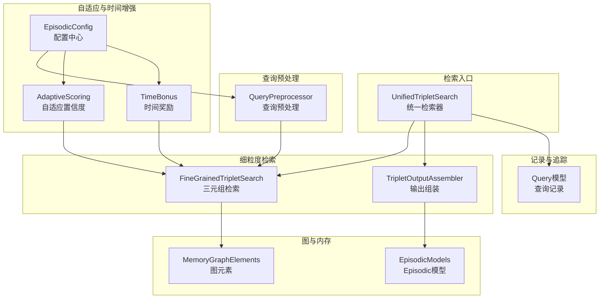
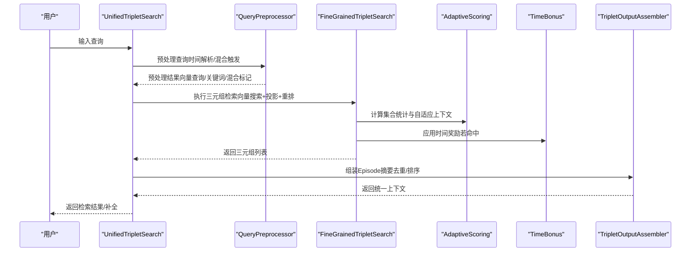
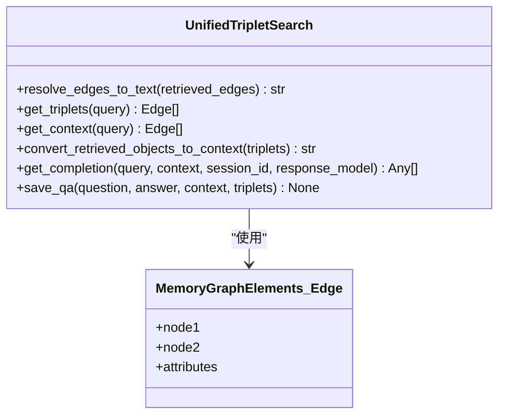
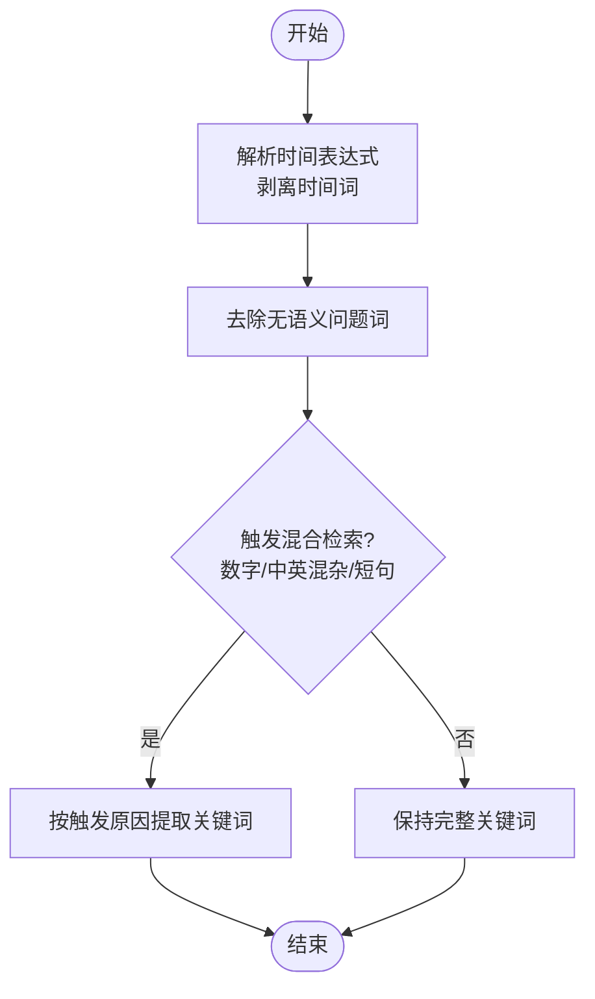
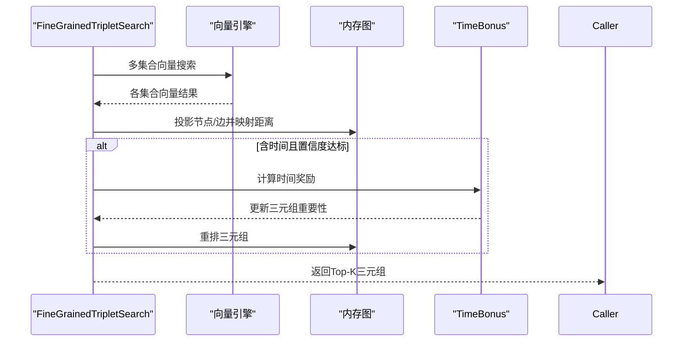
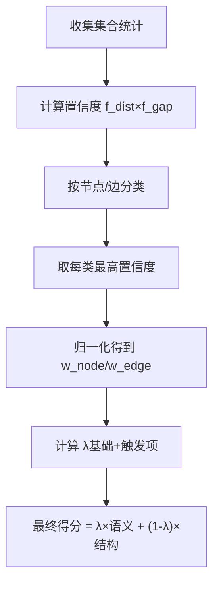
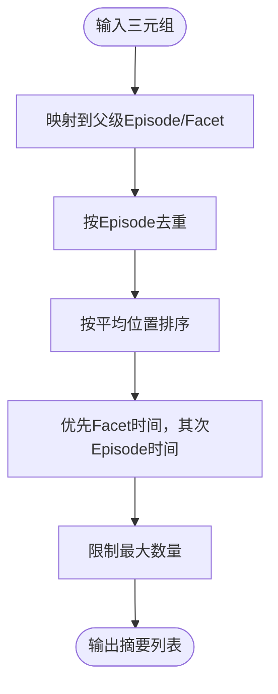
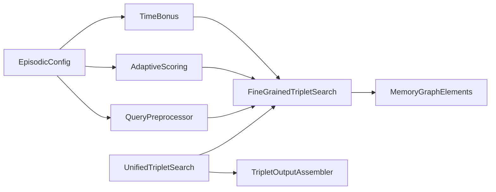

# 多粒度检索统一

<cite>
**本文引用的文件**
- [unified_triplet_search.py](file://m_flow/retrieval/unified_triplet_search.py)
- [adaptive_scoring.py](file://m_flow/retrieval/episodic/adaptive_scoring.py)
- [query_preprocessor.py](file://m_flow/retrieval/episodic/query_preprocessor.py)
- [fine_grained_triplet_search.py](file://m_flow/retrieval/utils/fine_grained_triplet_search.py)
- [triplet_output_assembler.py](file://m_flow/retrieval/utils/triplet_output_assembler.py)
- [config.py](file://m_flow/retrieval/episodic/config.py)
- [time_bonus.py](file://m_flow/retrieval/time/time_bonus.py)
- [bundle_search.py](file://m_flow/retrieval/episodic/bundle_search.py)
- [MemoryGraphElements.py](file://m_flow/knowledge/graph_ops/m_flow_graph/MemoryGraphElements.py)
- [models.py](file://m_flow/memory/episodic/models.py)
- [Query.py](file://m_flow/search/models/Query.py)
</cite>

## 目录
1. [引言](#引言)
2. [项目结构](#项目结构)
3. [核心组件](#核心组件)
4. [架构总览](#架构总览)
5. [详细组件分析](#详细组件分析)
6. [依赖分析](#依赖分析)
7. [性能考虑](#性能考虑)
8. [故障排查指南](#故障排查指南)
9. [结论](#结论)
10. [附录](#附录)

## 引言
本文件系统性阐述 M-flow 的“多粒度检索统一”能力：从原子事实到宏观事件的无缝衔接。系统通过“查询预处理—检索路径自适应—自适应置信度—跨文档实体桥接”的闭环机制，实现“无需人工指定粒度”的自动最优检索。用户只需输入自然语言查询，系统即可自动判断查询语义特征（如是否包含时间、数字、中英混杂、关键词长度等），从而选择最合适的检索路径与粒度，并在不同粒度层之间动态加权融合，最终输出从原子事实到事件摘要的完整上下文。

## 项目结构
围绕“多粒度检索统一”，相关模块主要分布在以下路径：
- 检索入口与统一检索：m_flow/retrieval/unified_triplet_search.py
- 细粒度三元组检索与投影：m_flow/retrieval/utils/fine_grained_triplet_search.py
- 输出组装与去重聚合：m_flow/retrieval/utils/triplet_output_assembler.py
- 查询预处理与混合检索触发：m_flow/retrieval/episodic/query_preprocessor.py
- 自适应置信度与权重融合：m_flow/retrieval/episodic/adaptive_scoring.py
- 时间增强与时间奖励：m_flow/retrieval/time/time_bonus.py
- 配置中心：m_flow/retrieval/episodic/config.py
- Episodic 检索主流程编排：m_flow/retrieval/episodic/bundle_search.py
- 图元素与内存图：m_flow/knowledge/graph_ops/m_flow_graph/MemoryGraphElements.py
- Episodic 内存模型：m_flow/memory/episodic/models.py
- 查询记录模型：m_flow/search/models/Query.py

图表来源
- [unified_triplet_search.py:29-306](file://m_flow/retrieval/unified_triplet_search.py#L29-L306)
- [query_preprocessor.py:97-142](file://m_flow/retrieval/episodic/query_preprocessor.py#L97-L142)
- [fine_grained_triplet_search.py:108-327](file://m_flow/retrieval/utils/fine_grained_triplet_search.py#L108-L327)
- [triplet_output_assembler.py:124-311](file://m_flow/retrieval/utils/triplet_output_assembler.py#L124-L311)
- [adaptive_scoring.py:26-314](file://m_flow/retrieval/episodic/adaptive_scoring.py#L26-L314)
- [time_bonus.py:71-186](file://m_flow/retrieval/time/time_bonus.py#L71-L186)
- [config.py:12-276](file://m_flow/retrieval/episodic/config.py#L12-L276)
- [MemoryGraphElements.py:23-195](file://m_flow/knowledge/graph_ops/m_flow_graph/MemoryGraphElements.py#L23-L195)
- [models.py:26-548](file://m_flow/memory/episodic/models.py#L26-L548)
- [Query.py:18-29](file://m_flow/search/models/Query.py#L18-L29)

章节来源
- [unified_triplet_search.py:29-306](file://m_flow/retrieval/unified_triplet_search.py#L29-L306)
- [config.py:12-276](file://m_flow/retrieval/episodic/config.py#L12-L276)

## 核心组件
- 统一检索器（UnifiedTripletSearch）：对外提供 get_context/get_completion 接口，内部协调三元组检索、上下文组装与 LLM 补全生成。
- 细粒度三元组检索（FineGrainedTripletSearch）：基于向量引擎检索多集合，投影到内存图，计算三元组重要性并支持时间增强重排。
- 查询预处理器（QueryPreprocessor）：解析时间、识别混合语言/数字/短句等特征，决定是否启用混合检索与关键词提取策略。
- 自适应置信度（AdaptiveScoring）：基于各集合的原始距离与 Top-1/Top-2 差距，计算置信度并动态分配节点/边权重，融合语义与结构信号。
- 时间增强（TimeBonus）：计算候选与查询时间范围的匹配程度，为三元组或包评分施加正向奖励或负向惩罚。
- 输出组装（TripletOutputAssembler）：将扁平三元组映射回父级 Episode，去重并按平均位置排序，生成可读摘要。
- 配置中心（EpisodicConfig）：集中管理检索参数、自适应权重、时间奖励、阈值等，支持环境变量覆盖。

章节来源
- [unified_triplet_search.py:83-167](file://m_flow/retrieval/unified_triplet_search.py#L83-L167)
- [fine_grained_triplet_search.py:108-327](file://m_flow/retrieval/utils/fine_grained_triplet_search.py#L108-L327)
- [query_preprocessor.py:97-250](file://m_flow/retrieval/episodic/query_preprocessor.py#L97-L250)
- [adaptive_scoring.py:166-314](file://m_flow/retrieval/episodic/adaptive_scoring.py#L166-L314)
- [time_bonus.py:71-186](file://m_flow/retrieval/time/time_bonus.py#L71-L186)
- [triplet_output_assembler.py:124-311](file://m_flow/retrieval/utils/triplet_output_assembler.py#L124-L311)
- [config.py:12-276](file://m_flow/retrieval/episodic/config.py#L12-L276)

## 架构总览
下图展示了从查询到统一结果的关键调用链路与数据流：

图表来源
- [unified_triplet_search.py:123-241](file://m_flow/retrieval/unified_triplet_search.py#L123-L241)
- [query_preprocessor.py:97-142](file://m_flow/retrieval/episodic/query_preprocessor.py#L97-L142)
- [fine_grained_triplet_search.py:108-327](file://m_flow/retrieval/utils/fine_grained_triplet_search.py#L108-L327)
- [adaptive_scoring.py:249-314](file://m_flow/retrieval/episodic/adaptive_scoring.py#L249-L314)
- [time_bonus.py:219-306](file://m_flow/retrieval/time/time_bonus.py#L219-L306)
- [triplet_output_assembler.py:124-311](file://m_flow/retrieval/utils/triplet_output_assembler.py#L124-L311)

## 详细组件分析

### 组件A：统一检索器（UnifiedTripletSearch）
- 职责
  - 自动发现可用向量集合，执行细粒度三元组检索。
  - 将检索到的边转换为人类可读文本或 Episode 摘要。
  - 基于检索上下文生成 LLM 补全，并可选缓存对话历史。
- 关键流程
  - get_triplets：自动推导集合、执行检索、返回三元组。
  - get_context：校验图状态、获取三元组、转为上下文。
  - convert_retrieved_objects_to_context：优先 Episode 摘要，否则回退为边文本。
  - get_completion：生成回答，支持会话缓存与交互记录持久化。
- 与图元素的关系
  - 使用 MemoryGraphElements 中的 Edge/Node 结构承载检索结果与属性。

图表来源
- [unified_triplet_search.py:29-306](file://m_flow/retrieval/unified_triplet_search.py#L29-L306)
- [MemoryGraphElements.py:124-195](file://m_flow/knowledge/graph_ops/m_flow_graph/MemoryGraphElements.py#L124-L195)

章节来源
- [unified_triplet_search.py:83-241](file://m_flow/retrieval/unified_triplet_search.py#L83-L241)
- [MemoryGraphElements.py:23-195](file://m_flow/knowledge/graph_ops/m_flow_graph/MemoryGraphElements.py#L23-L195)

### 组件B：查询预处理（QueryPreprocessor）
- 功能
  - 解析时间表达式并剥离时间词，保留有效语义。
  - 去除无语义价值的问题词，保留有语义的问题词。
  - 判定混合检索触发条件：包含数字、中英混杂、核心关键词过短。
  - 提取关键词用于混合检索与精确匹配。
- 触发逻辑
  - 当满足“数字/混杂/短句”任一条件时，启用混合检索并限定关键词提取策略。

图表来源
- [query_preprocessor.py:97-250](file://m_flow/retrieval/episodic/query_preprocessor.py#L97-L250)

章节来源
- [query_preprocessor.py:97-250](file://m_flow/retrieval/episodic/query_preprocessor.py#L97-L250)

### 组件C：细粒度三元组检索（FineGrainedTripletSearch）
- 功能
  - 多集合向量检索（默认包含 Episode_summary、Entity_name、RelationType_relationship_name 等）。
  - 投影到内存图，映射向量距离至节点与边。
  - 支持时间增强：当查询含时间且置信度达标时扩大候选池并应用时间奖励重排。
  - 支持粒度过滤：仅返回原子/事件实体（通过 where_filter 与集合名称判定）。
- 关键点
  - 通过 MemoryGraphElements 的 Node/Edge 结构组织检索结果。
  - 使用时间奖励模块计算三元组重要性并重排。

图表来源
- [fine_grained_triplet_search.py:108-327](file://m_flow/retrieval/utils/fine_grained_triplet_search.py#L108-L327)
- [time_bonus.py:219-306](file://m_flow/retrieval/time/time_bonus.py#L219-L306)
- [MemoryGraphElements.py:23-195](file://m_flow/knowledge/graph_ops/m_flow_graph/MemoryGraphElements.py#L23-L195)

章节来源
- [fine_grained_triplet_search.py:108-327](file://m_flow/retrieval/utils/fine_grained_triplet_search.py#L108-L327)
- [time_bonus.py:71-186](file://m_flow/retrieval/time/time_bonus.py#L71-L186)

### 组件D：自适应置信度（AdaptiveScoring）
- 功能
  - 对每个集合计算置信度：综合原始距离比值与 Top-1/Top-2 差距。
  - 按节点/边两类集合分别取最高置信度，动态分配权重（w_node, w_edge）。
  - 计算融合系数 λ，结合语义分数与结构分数（衰减）得到最终得分。
- 优势
  - 在不同集合质量差异较大时，自动降低弱信号权重，提升整体稳定性。
  - 通过 λ 的额外奖励（精确匹配、差距、语义优劣）进一步优化排序。

图表来源
- [adaptive_scoring.py:166-442](file://m_flow/retrieval/episodic/adaptive_scoring.py#L166-L442)

章节来源
- [adaptive_scoring.py:166-442](file://m_flow/retrieval/episodic/adaptive_scoring.py#L166-L442)

### 组件E：输出组装（TripletOutputAssembler）
- 功能
  - 将扁平三元组映射到父级 Episode，去重并按平均位置排序。
  - 优先使用 Facet 的时间信息，其次回退到 Episode 时间，最后回退到创建时间。
  - 限制最大 Episode 数，保证上下文简洁可控。
- 价值
  - 将大量重复的同一 Episode 的边合并为摘要，避免重复与冗余。
  - 为 LLM 提供结构化、可读性强的上下文。

图表来源
- [triplet_output_assembler.py:124-311](file://m_flow/retrieval/utils/triplet_output_assembler.py#L124-L311)

章节来源
- [triplet_output_assembler.py:124-311](file://m_flow/retrieval/utils/triplet_output_assembler.py#L124-L311)

### 组件F：Episodic 主流程编排（bundle_search）
- 功能
  - 协调预处理、向量搜索、两阶段图投影、关系索引构建、包评分、时间奖励、输出组装。
  - 记录检索日志与追踪事件，便于调试与性能分析。
- 与统一检索的关系
  - 统一检索器在需要时可复用该流程以获得更精细的包级排序与时间增强。

章节来源
- [bundle_search.py:40-270](file://m_flow/retrieval/episodic/bundle_search.py#L40-L270)

## 依赖分析
- 组件耦合
  - UnifiedTripletSearch 依赖 fine_grained_triplet_search 与 triplet_output_assembler，形成“检索—组装”的清晰边界。
  - query_preprocessor 与 fine_grained_triplet_search 通过“预处理结果”解耦，前者负责检索前策略，后者负责检索执行。
  - adaptive_scoring 与 time_bonus 作为独立模块，被检索流程在合适阶段调用，降低耦合度。
- 外部依赖
  - 向量引擎：提供多集合向量检索能力。
  - 图引擎：提供图投影与节点/边映射。
  - LLM：用于上下文组装后的补全生成。

图表来源
- [unified_triplet_search.py:83-167](file://m_flow/retrieval/unified_triplet_search.py#L83-L167)
- [query_preprocessor.py:97-142](file://m_flow/retrieval/episodic/query_preprocessor.py#L97-L142)
- [fine_grained_triplet_search.py:108-327](file://m_flow/retrieval/utils/fine_grained_triplet_search.py#L108-L327)
- [adaptive_scoring.py:166-314](file://m_flow/retrieval/episodic/adaptive_scoring.py#L166-L314)
- [time_bonus.py:71-186](file://m_flow/retrieval/time/time_bonus.py#L71-L186)
- [config.py:12-276](file://m_flow/retrieval/episodic/config.py#L12-L276)
- [MemoryGraphElements.py:23-195](file://m_flow/knowledge/graph_ops/m_flow_graph/MemoryGraphElements.py#L23-L195)

章节来源
- [unified_triplet_search.py:83-167](file://m_flow/retrieval/unified_triplet_search.py#L83-L167)
- [config.py:12-276](file://m_flow/retrieval/episodic/config.py#L12-L276)

## 性能考虑
- 并行检索：多集合向量检索采用并发 gather，显著缩短等待时间。
- 两阶段图投影：先聚焦命中节点，再扩展邻居，控制投影规模与内存占用。
- 时间增强：仅在查询含可信时间时扩大候选池，避免全局膨胀。
- 自适应权重：在集合质量差异大时抑制弱信号，减少无效排序开销。
- 输出去重：Episode 摘要去重避免重复信息进入 LLM 上下文，提升吞吐。

## 故障排查指南
- “检索为空”
  - 检查图是否为空或集合不存在。
  - 确认向量引擎初始化与集合可用性。
- “时间增强未生效”
  - 核对查询时间解析结果与置信度阈值。
  - 确认时间奖励配置与候选时间字段存在。
- “自适应权重异常”
  - 查看集合统计与置信度计算过程，确认阈值与权重裁剪设置。
- “Episodic 摘要缺失”
  - 检查三元组是否能映射到 Episode/Facet，确认输出组装日志。

章节来源
- [unified_triplet_search.py:138-153](file://m_flow/retrieval/unified_triplet_search.py#L138-L153)
- [fine_grained_triplet_search.py:318-326](file://m_flow/retrieval/utils/fine_grained_triplet_search.py#L318-L326)
- [time_bonus.py:219-306](file://m_flow/retrieval/time/time_bonus.py#L219-L306)
- [adaptive_scoring.py:166-246](file://m_flow/retrieval/episodic/adaptive_scoring.py#L166-L246)
- [triplet_output_assembler.py:253-255](file://m_flow/retrieval/utils/triplet_output_assembler.py#L253-L255)

## 结论
M-flow 的“多粒度检索统一”通过“查询预处理—检索路径自适应—自适应置信度—跨文档实体桥接—输出去重汇总”的闭环，实现了从原子事实到宏观事件的无缝衔接。系统无需人工指定粒度，自动根据查询语义特征选择最优检索策略，并在不同粒度层之间动态加权融合，最终输出一致、可读、可解释的检索结果。这不仅简化了用户的使用体验，也为复杂场景下的知识检索提供了稳健的工程化方案。

## 附录

### 典型检索场景示例
- 精确问题（原子事实）
  - 示例：某公司某日某产品销量。
  - 系统：识别短句/数字/时间，启用混合检索与时间增强，优先返回原子事实三元组，经输出组装后形成简洁事实摘要。
- 宽泛问题（事件摘要）
  - 示例：某产品在某时间段内的进展与决策。
  - 系统：识别宽泛语义，优先返回 Episode 摘要，按 Facet 时间排序，形成事件概览。
- 混合场景（中英混杂/长句）
  - 示例：某项目涉及中英文术语与多实体的综合评估。
  - 系统：触发混合检索，按触发原因提取关键词，结合自适应置信度与时间奖励，输出兼顾事实与事件的综合上下文。

### 跨文档实体桥接
- 机制：通过共享实体节点（Entity/Concept）在不同文档片段中建立连接，使原本分散的事实与事件得以串联。
- 实现：三元组检索与内存图投影过程中，实体节点作为桥接点，将来自不同文档的片段汇聚到同一 Episode 下进行统一排序与摘要。

章节来源
- [triplet_output_assembler.py:151-217](file://m_flow/retrieval/utils/triplet_output_assembler.py#L151-L217)
- [MemoryGraphElements.py:23-195](file://m_flow/knowledge/graph_ops/m_flow_graph/MemoryGraphElements.py#L23-L195)