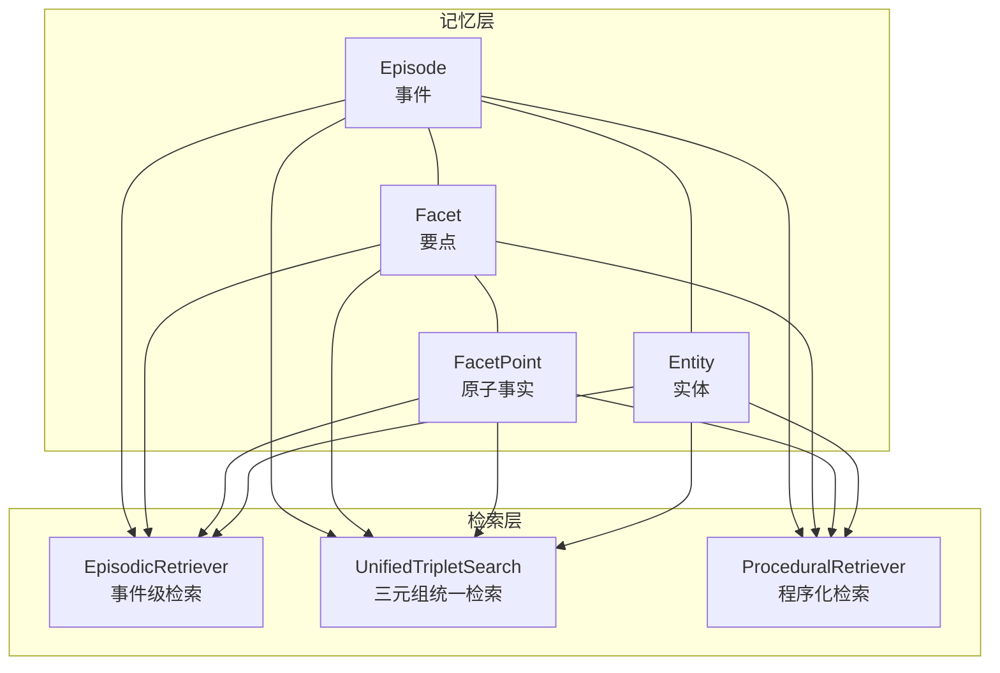
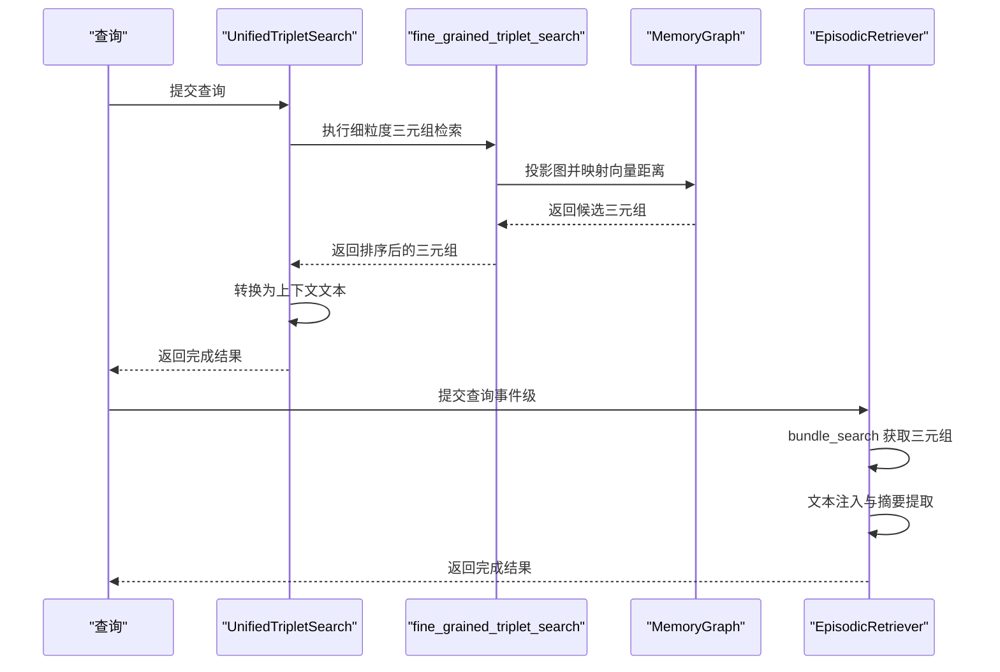
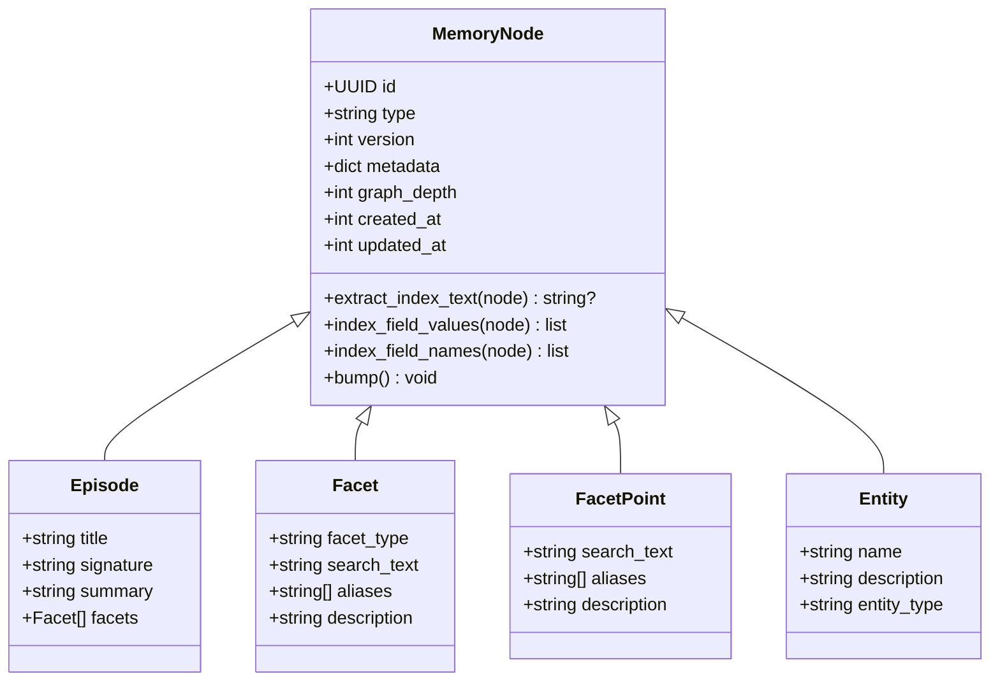
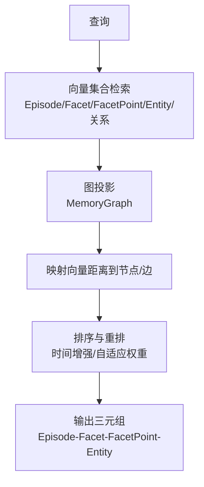
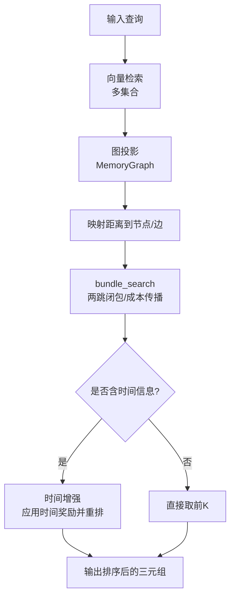
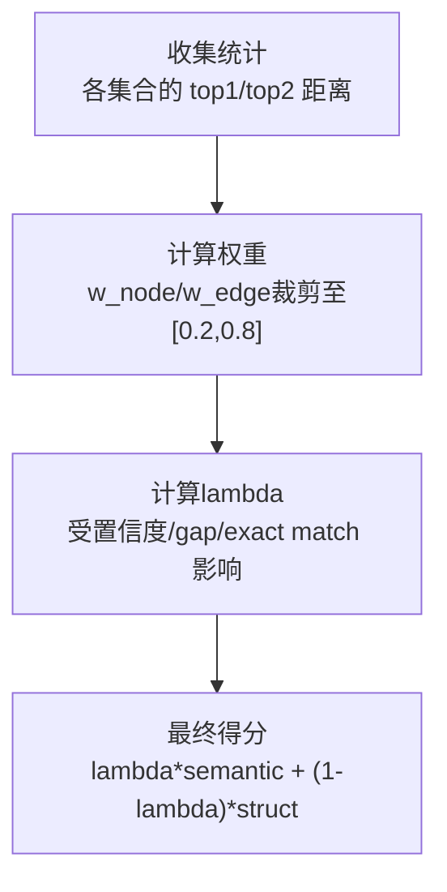
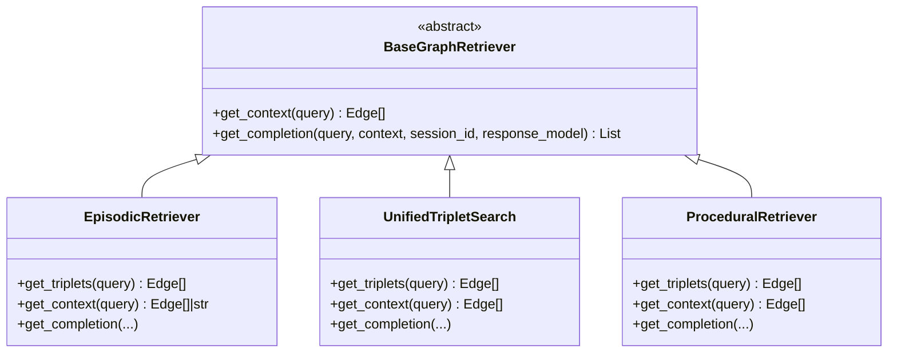
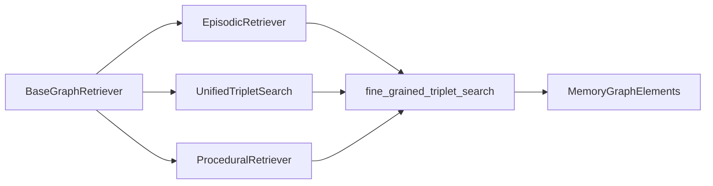

# 核心概念

<cite>
**本文引用的文件**
- [m_flow/memory/episodic/models.py](file://m_flow/memory/episodic/models.py)
- [m_flow/memory/procedural/models.py](file://m_flow/memory/procedural/models.py)
- [m_flow/knowledge/graph_ops/m_flow_graph/MemoryGraphElements.py](file://m_flow/knowledge/graph_ops/m_flow_graph/MemoryGraphElements.py)
- [m_flow/retrieval/base_graph_retriever.py](file://m_flow/retrieval/base_graph_retriever.py)
- [m_flow/retrieval/unified_triplet_search.py](file://m_flow/retrieval/unified_triplet_search.py)
- [m_flow/retrieval/episodic_retriever.py](file://m_flow/retrieval/episodic_retriever.py)
- [m_flow/retrieval/procedural_retriever.py](file://m_flow/retrieval/procedural_retriever.py)
- [m_flow/retrieval/utils/fine_grained_triplet_search.py](file://m_flow/retrieval/utils/fine_grained_triplet_search.py)
- [m_flow/core/models/MemoryNode.py](file://m_flow/core/models/MemoryNode.py)
</cite>

## 目录
1. [引言](#引言)
2. [项目结构](#项目结构)
3. [核心组件](#核心组件)
4. [架构总览](#架构总览)
5. [详细组件分析](#详细组件分析)
6. [依赖分析](#依赖分析)
7. [性能考量](#性能考量)
8. [故障排查指南](#故障排查指南)
9. [结论](#结论)
10. [附录](#附录)

## 引言
本文件面向希望深入理解 M-flow 认知记忆系统与检索机制的读者，系统阐述以下主题：
- 四层级记忆结构：Episode（事件）、Facet（要点）、FacetPoint（原子事实）、Entity（实体）
- 锥形图（Cone Graph）的架构理念与层级关系设计
- 图路由检索机制：对比传统相似度匹配与路径成本计算
- 证据链评分原理：typed edges 与语义权重如何实现精确知识关联
- 统一多粒度检索：如何让查询自动发现最合适的锚点
- 结合具体示例与图示，帮助读者建立从概念到实现的完整认知

## 项目结构
M-flow 将“认知记忆”与“检索生成”解耦为两条主线：
- 记忆层：以 Episode/Facet/FacetPoint/Entity 为核心节点，构建可检索的层级化知识图谱
- 检索层：提供统一接口，支持三类检索模式（Episodic、Triplet、Procedural），并支持时间增强、自适应打分等策略

**图表来源**
- [m_flow/memory/episodic/models.py:197-235](file://m_flow/memory/episodic/models.py#L197-L235)
- [m_flow/memory/procedural/models.py:154-183](file://m_flow/memory/procedural/models.py#L154-L183)
- [m_flow/retrieval/episodic_retriever.py:130-182](file://m_flow/retrieval/episodic_retriever.py#L130-L182)
- [m_flow/retrieval/unified_triplet_search.py:29-122](file://m_flow/retrieval/unified_triplet_search.py#L29-L122)
- [m_flow/retrieval/procedural_retriever.py:199-264](file://m_flow/retrieval/procedural_retriever.py#L199-L264)

**章节来源**
- [m_flow/retrieval/base_graph_retriever.py:13-63](file://m_flow/retrieval/base_graph_retriever.py#L13-L63)

## 核心组件
- 记忆节点基类：提供版本化、嵌入与序列化辅助能力，支撑检索投影与向量化字段选择
- 图元素：轻量内存图节点与边，支持状态位向量过滤与快速遍历
- 检索器：统一接口定义，分别实现 Episodic、Triplet、Procedural 三种检索模式

**章节来源**
- [m_flow/core/models/MemoryNode.py:27-106](file://m_flow/core/models/MemoryNode.py#L27-L106)
- [m_flow/knowledge/graph_ops/m_flow_graph/MemoryGraphElements.py:23-195](file://m_flow/knowledge/graph_ops/m_flow_graph/MemoryGraphElements.py#L23-L195)
- [m_flow/retrieval/base_graph_retriever.py:13-63](file://m_flow/retrieval/base_graph_retriever.py#L13-L63)

## 架构总览
M-flow 的检索体系以“统一接口 + 多粒度检索 + 证据链评分”为核心：
- 统一接口：所有检索器均实现 get_context/get_completion，便于前端与上层编排
- 多粒度检索：Episodic（事件-要点-原子事实-实体）与 Triplet（任意三元组）互补
- 证据链评分：基于 typed edges 与语义权重，结合路径成本与时间增强，形成可解释的排序

**图表来源**
- [m_flow/retrieval/unified_triplet_search.py:83-154](file://m_flow/retrieval/unified_triplet_search.py#L83-L154)
- [m_flow/retrieval/utils/fine_grained_triplet_search.py:108-317](file://m_flow/retrieval/utils/fine_grained_triplet_search.py#L108-L317)
- [m_flow/retrieval/episodic_retriever.py:168-250](file://m_flow/retrieval/episodic_retriever.py#L168-L250)

## 详细组件分析

### 四层级记忆结构与数据模型
- Episode（事件）：粗粒度锚点，用于信息聚合与跨片段检索；包含标题、签名、摘要与要点列表
- Facet（要点）：对事件的细化维度，作为中粒度锚点；包含类型、搜索词、别名与描述
- FacetPoint（原子事实）：最小可检索单元，强调“短而准”的检索锚点；包含搜索词、别名与解释
- Entity（实体）：与事件相关的概念载体，支持上下文特定描述

**图表来源**
- [m_flow/core/models/MemoryNode.py:27-106](file://m_flow/core/models/MemoryNode.py#L27-L106)
- [m_flow/memory/episodic/models.py:197-235](file://m_flow/memory/episodic/models.py#L197-L235)
- [m_flow/memory/episodic/models.py:328-370](file://m_flow/memory/episodic/models.py#L328-L370)
- [m_flow/memory/episodic/models.py:377-398](file://m_flow/memory/episodic/models.py#L377-L398)

**章节来源**
- [m_flow/memory/episodic/models.py:197-235](file://m_flow/memory/episodic/models.py#L197-L235)
- [m_flow/memory/episodic/models.py:328-370](file://m_flow/memory/episodic/models.py#L328-L370)
- [m_flow/memory/episodic/models.py:377-398](file://m_flow/memory/episodic/models.py#L377-L398)
- [m_flow/memory/procedural/models.py:154-183](file://m_flow/memory/procedural/models.py#L154-L183)

### 锥形图（Cone Graph）与层级关系
锥形图强调“从粗到细”的层级化检索路径：
- 顶层：Episode（事件）作为粗粒度锚点，承载摘要与主题
- 中层：Facet（要点）作为中粒度锚点，连接事件与原子事实
- 底层：FacetPoint（原子事实）与 Entity（实体）作为细粒度锚点，提供精确召回
- typed edges：通过关系名称与属性（如 edge_text、relationship_name）表达语义权重与路径成本

**图表来源**
- [m_flow/retrieval/utils/fine_grained_triplet_search.py:108-317](file://m_flow/retrieval/utils/fine_grained_triplet_search.py#L108-L317)
- [m_flow/knowledge/graph_ops/m_flow_graph/MemoryGraphElements.py:23-195](file://m_flow/knowledge/graph_ops/m_flow_graph/MemoryGraphElements.py#L23-L195)

**章节来源**
- [m_flow/retrieval/utils/fine_grained_triplet_search.py:108-317](file://m_flow/retrieval/utils/fine_grained_triplet_search.py#L108-L317)
- [m_flow/knowledge/graph_ops/m_flow_graph/MemoryGraphElements.py:23-195](file://m_flow/knowledge/graph_ops/m_flow_graph/MemoryGraphElements.py#L23-L195)

### 图路由检索机制：相似度匹配 vs 路径成本计算
- 传统相似度匹配：依赖向量检索与阈值过滤，适合关键词检索但缺乏路径语义
- 路径成本计算：在锥形图上进行 bundle search，综合考虑：
  - 两跳闭包（FacetPoint 两跳）
  - 边/节点缺失惩罚
  - hop 成本与边缺失成本
  - 时间增强（时间置信度与分数下界）
  - 自适应权重与最终得分

**图表来源**
- [m_flow/retrieval/episodic_retriever.py:168-182](file://m_flow/retrieval/episodic_retriever.py#L168-L182)
- [m_flow/retrieval/utils/fine_grained_triplet_search.py:108-317](file://m_flow/retrieval/utils/fine_grained_triplet_search.py#L108-L317)

**章节来源**
- [m_flow/retrieval/episodic_retriever.py:130-182](file://m_flow/retrieval/episodic_retriever.py#L130-L182)
- [m_flow/retrieval/utils/fine_grained_triplet_search.py:108-317](file://m_flow/retrieval/utils/fine_grained_triplet_search.py#L108-L317)

### 证据链评分原理：typed edges 与语义权重
- typed edges：通过关系名称（如 episode_summary、entity_name 等）与属性（edge_text、relationship_name）表达语义
- 语义权重：在排序时引入自适应权重与 lambda（由置信度、gap、exact match 等决定），控制结构化与语义得分的融合
- 最终得分：在 rank=0 时更偏向语义得分，在更高 rank 时引入结构化权重，形成平滑过渡

**图表来源**
- [m_flow/tests/unit/retrieval/episodic/test_adaptive_scoring.py:274-352](file://m_flow/tests/unit/retrieval/episodic/test_adaptive_scoring.py#L274-L352)

**章节来源**
- [m_flow/tests/unit/retrieval/episodic/test_adaptive_scoring.py:274-352](file://m_flow/tests/unit/retrieval/episodic/test_adaptive_scoring.py#L274-L352)

### 统一多粒度检索：自动锚点发现
- EpisodicRetriever：事件级检索，支持摘要/详情两种显示模式，优先抽取 Episode 摘要或富上下文
- UnifiedTripletSearch：统一三元组检索，自动枚举向量集合，返回精细三元组并可生成完成
- ProceduralRetriever：程序化检索，强制返回 Procedure-Context/Steps 双输出，适合方法型问题

**图表来源**
- [m_flow/retrieval/base_graph_retriever.py:13-63](file://m_flow/retrieval/base_graph_retriever.py#L13-L63)
- [m_flow/retrieval/episodic_retriever.py:130-182](file://m_flow/retrieval/episodic_retriever.py#L130-L182)
- [m_flow/retrieval/unified_triplet_search.py:29-122](file://m_flow/retrieval/unified_triplet_search.py#L29-L122)
- [m_flow/retrieval/procedural_retriever.py:199-264](file://m_flow/retrieval/procedural_retriever.py#L199-L264)

**章节来源**
- [m_flow/retrieval/episodic_retriever.py:130-182](file://m_flow/retrieval/episodic_retriever.py#L130-L182)
- [m_flow/retrieval/unified_triplet_search.py:29-122](file://m_flow/retrieval/unified_triplet_search.py#L29-L122)
- [m_flow/retrieval/procedural_retriever.py:199-264](file://m_flow/retrieval/procedural_retriever.py#L199-L264)

## 依赖分析
- 检索器依赖统一接口：确保不同检索模式的一致性与可替换性
- 图投影与向量检索：fine_grained_triplet_search 负责将向量距离映射到图节点/边，并执行排序与重排
- typed edges 与语义权重：在排序阶段融合结构化与语义信号，提升检索精度

**图表来源**
- [m_flow/retrieval/base_graph_retriever.py:13-63](file://m_flow/retrieval/base_graph_retriever.py#L13-L63)
- [m_flow/retrieval/episodic_retriever.py:168-182](file://m_flow/retrieval/episodic_retriever.py#L168-L182)
- [m_flow/retrieval/unified_triplet_search.py:83-122](file://m_flow/retrieval/unified_triplet_search.py#L83-L122)
- [m_flow/retrieval/procedural_retriever.py:247-264](file://m_flow/retrieval/procedural_retriever.py#L247-L264)
- [m_flow/retrieval/utils/fine_grained_triplet_search.py:108-317](file://m_flow/retrieval/utils/fine_grained_triplet_search.py#L108-L317)
- [m_flow/knowledge/graph_ops/m_flow_graph/MemoryGraphElements.py:23-195](file://m_flow/knowledge/graph_ops/m_flow_graph/MemoryGraphElements.py#L23-L195)

**章节来源**
- [m_flow/retrieval/base_graph_retriever.py:13-63](file://m_flow/retrieval/base_graph_retriever.py#L13-L63)
- [m_flow/retrieval/utils/fine_grained_triplet_search.py:108-317](file://m_flow/retrieval/utils/fine_grained_triplet_search.py#L108-L317)

## 性能考量
- 向量检索并发：对多个集合并行搜索，减少总体延迟
- 图投影与重排：先广域召回，再局部重排（时间增强），平衡召回与重排成本
- 显示模式优化：摘要模式仅抽取 Episode 摘要，降低 LLM 上下文长度
- 缓存与会话：支持对话历史缓存与摘要生成，减少重复计算

[本节为通用指导，无需列出具体文件来源]

## 故障排查指南
- 空图跳过：当知识图为空时，检索器会记录警告并返回空结果
- 集合不存在：向量集合未创建时返回空结果，需检查向量数据库初始化
- 时间解析失败：查询中时间表达式解析失败不影响检索，但可能丢失时间增强收益
- LLM 决策回退：当 LLM 合并决策失败时，采用保守策略（新建程序）

**章节来源**
- [m_flow/retrieval/unified_triplet_search.py:138-150](file://m_flow/retrieval/unified_triplet_search.py#L138-L150)
- [m_flow/retrieval/utils/fine_grained_triplet_search.py:318-327](file://m_flow/retrieval/utils/fine_grained_triplet_search.py#L318-L327)
- [m_flow/retrieval/procedural_retriever.py:251-259](file://m_flow/retrieval/procedural_retriever.py#L251-L259)

## 结论
M-flow 通过四层级记忆结构与锥形图设计，实现了从粗粒度事件到细粒度原子事实的多粒度检索；借助 typed edges 与语义权重，证据链评分在相似度匹配之外引入路径成本与时间增强，显著提升了检索的可解释性与准确性。统一检索接口与模块化设计，使系统既能满足方法型问题（Procedural），也能处理知识图谱关系查询（Triplet）与事件级检索（Episodic）。

[本节为总结性内容，无需列出具体文件来源]

## 附录
- 示例场景建议
  - 方法型问题：使用 ProceduralRetriever，关注 Procedure-Context/Steps 的双输出
  - 关系查询：使用 UnifiedTripletSearch，结合 typed edges 与 edge_text 进行精确三元组检索
  - 事件回顾：使用 EpisodicRetriever，按摘要/详情模式获取上下文

[本节为补充说明，无需列出具体文件来源]