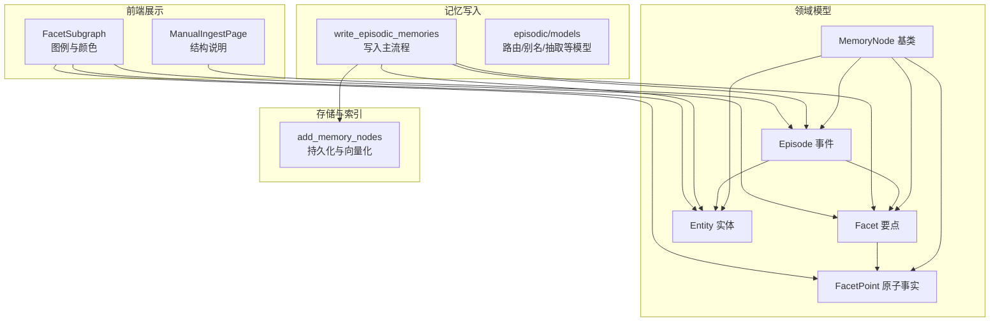
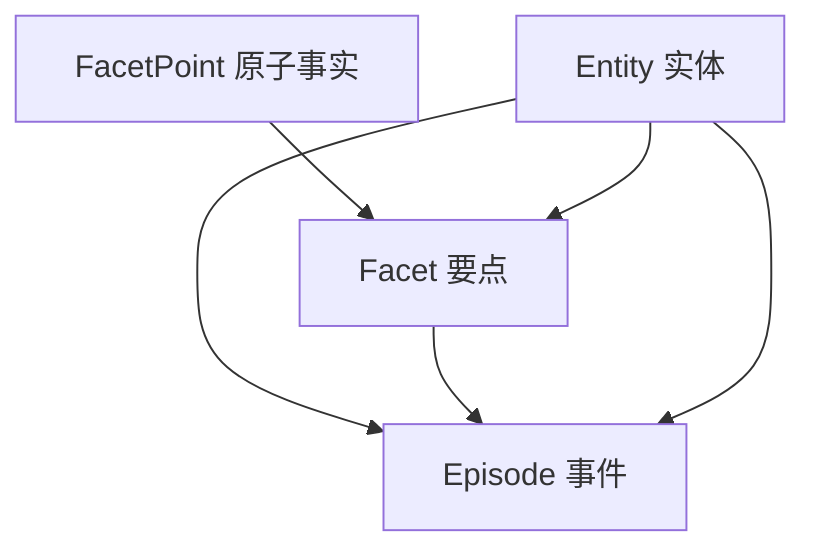
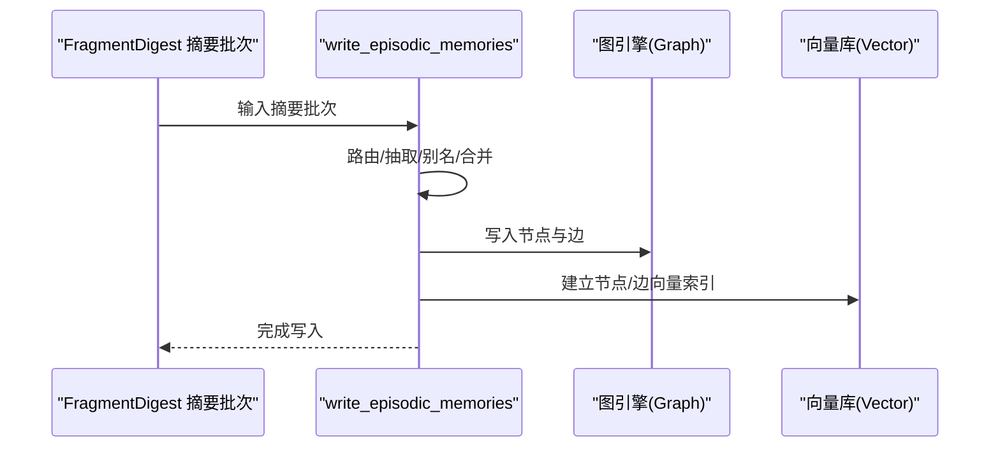
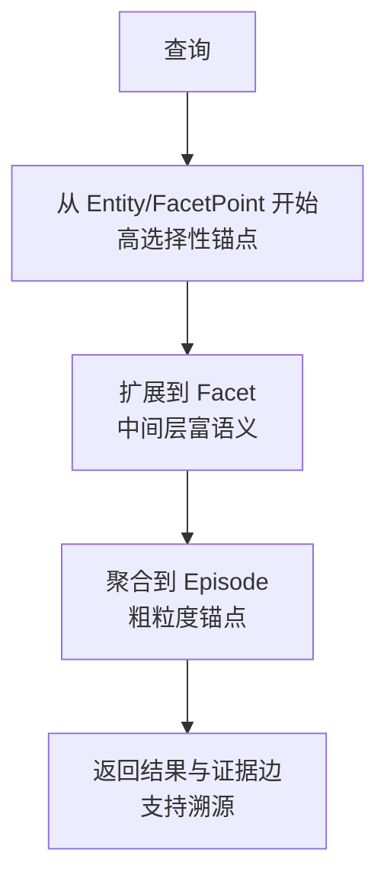
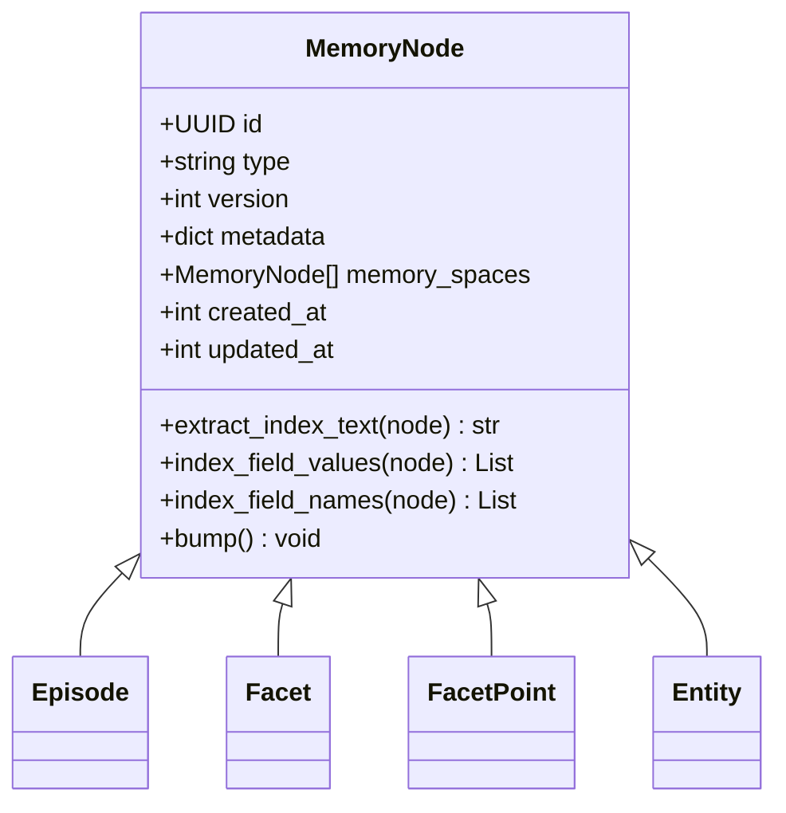

# 记忆层级结构

<cite>
**本文引用的文件**
- [m_flow/core/domain/models/__init__.py](file://m_flow/core/domain/models/__init__.py)
- [m_flow/core/domain/models/MemoryNode.py](file://m_flow/core/domain/models/MemoryNode.py)
- [m_flow/core/domain/models/Episode.py](file://m_flow/core/domain/models/Episode.py)
- [m_flow/core/domain/models/Facet.py](file://m_flow/core/domain/models/Facet.py)
- [m_flow/core/domain/models/FacetPoint.py](file://m_flow/core/domain/models/FacetPoint.py)
- [m_flow/core/domain/models/Entity.py](file://m_flow/core/domain/models/Entity.py)
- [m_flow/memory/episodic/models.py](file://m_flow/memory/episodic/models.py)
- [m_flow/memory/episodic/write_episodic_memories.py](file://m_flow/memory/episodic/write_episodic_memories.py)
- [m_flow/storage/add_memory_nodes.py](file://m_flow/storage/add_memory_nodes.py)
- [m_flow/retrieval/base_retriever.py](file://m_flow/retrieval/base_retriever.py)
- [m_flow-frontend/src/components/memorize/ManualIngestPage.tsx](file://m_flow-frontend/src/components/memorize/ManualIngestPage.tsx)
- [m_flow-frontend/src/components/graph/FacetSubgraph.tsx](file://m_flow-frontend/src/components/graph/FacetSubgraph.tsx)
</cite>

## 目录
1. [引言](#引言)
2. [项目结构](#项目结构)
3. [核心组件](#核心组件)
4. [架构总览](#架构总览)
5. [详细组件分析](#详细组件分析)
6. [依赖分析](#依赖分析)
7. [性能考量](#性能考量)
8. [故障排查指南](#故障排查指南)
9. [结论](#结论)
10. [附录](#附录)

## 引言
本文件系统性阐述 M-flow 记忆系统的四层结构：Episode（事件）、Facet（要点）、FacetPoint（原子事实）、Entity（实体），并解释其倒锥形（Inverted Cone）拓扑设计理念与信息流向。该设计以“尖端到基座”的方向组织知识：尖端层（Entity、FacetPoint）聚焦精确语义锚点，基座层（Episode）承载最丰富的语义内容；通过层级间继承与连接，实现多粒度检索与可解释的证据溯源。

## 项目结构
围绕记忆层级的核心代码位于领域模型与记忆写入流程中，并由存储与检索模块支撑。下图概览了与本主题直接相关的模块与文件：

图表来源
- [m_flow/core/domain/models/MemoryNode.py:27-106](file://m_flow/core/domain/models/MemoryNode.py#L27-L106)
- [m_flow/core/domain/models/Episode.py:15-105](file://m_flow/core/domain/models/Episode.py#L15-L105)
- [m_flow/core/domain/models/Facet.py:22-102](file://m_flow/core/domain/models/Facet.py#L22-L102)
- [m_flow/core/domain/models/FacetPoint.py:20-58](file://m_flow/core/domain/models/FacetPoint.py#L20-L58)
- [m_flow/core/domain/models/Entity.py:10-62](file://m_flow/core/domain/models/Entity.py#L10-L62)
- [m_flow/memory/episodic/write_episodic_memories.py:178-200](file://m_flow/memory/episodic/write_episodic_memories.py#L178-L200)
- [m_flow/memory/episodic/models.py:1-130](file://m_flow/memory/episodic/models.py#L1-L130)
- [m_flow/storage/add_memory_nodes.py:1-126](file://m_flow/storage/add_memory_nodes.py#L1-L126)
- [m_flow-frontend/src/components/memorize/ManualIngestPage.tsx:691-705](file://m_flow-frontend/src/components/memorize/ManualIngestPage.tsx#L691-L705)
- [m_flow-frontend/src/components/graph/FacetSubgraph.tsx:598-641](file://m_flow-frontend/src/components/graph/FacetSubgraph.tsx#L598-L641)

章节来源
- [m_flow/core/domain/models/__init__.py:13-41](file://m_flow/core/domain/models/__init__.py#L13-L41)
- [m_flow/core/domain/models/MemoryNode.py:27-106](file://m_flow/core/domain/models/MemoryNode.py#L27-L106)
- [m_flow/core/domain/models/Episode.py:15-105](file://m_flow/core/domain/models/Episode.py#L15-L105)
- [m_flow/core/domain/models/Facet.py:22-102](file://m_flow/core/domain/models/Facet.py#L22-L102)
- [m_flow/core/domain/models/FacetPoint.py:20-58](file://m_flow/core/domain/models/FacetPoint.py#L20-L58)
- [m_flow/core/domain/models/Entity.py:10-62](file://m_flow/core/domain/models/Entity.py#L10-L62)
- [m_flow/memory/episodic/models.py:1-130](file://m_flow/memory/episodic/models.py#L1-L130)
- [m_flow/memory/episodic/write_episodic_memories.py:178-200](file://m_flow/memory/episodic/write_episodic_memories.py#L178-L200)
- [m_flow/storage/add_memory_nodes.py:1-126](file://m_flow/storage/add_memory_nodes.py#L1-L126)
- [m_flow-frontend/src/components/memorize/ManualIngestPage.tsx:691-705](file://m_flow-frontend/src/components/memorize/ManualIngestPage.tsx#L691-L705)
- [m_flow-frontend/src/components/graph/FacetSubgraph.tsx:598-641](file://m_flow-frontend/src/components/graph/FacetSubgraph.tsx#L598-L641)

## 核心组件
- MemoryNode 基类：为所有记忆节点提供统一元数据、版本控制、嵌入文本提取与索引字段能力。
- Episode：事件级锚点，承载摘要与丰富语义边，作为粗粒度检索的锚定。
- Facet：事件下的要点，具备检索锚点与回退召回文本，连接证据片段。
- FacetPoint：要点下的原子事实，独立向量化与匹配，支持独立评分与证据链接。
- Entity：实体，跨事件规范化匹配，支持“同一实体”链接与类型标注。

章节来源
- [m_flow/core/domain/models/MemoryNode.py:27-106](file://m_flow/core/domain/models/MemoryNode.py#L27-L106)
- [m_flow/core/domain/models/Episode.py:15-105](file://m_flow/core/domain/models/Episode.py#L15-L105)
- [m_flow/core/domain/models/Facet.py:22-102](file://m_flow/core/domain/models/Facet.py#L22-L102)
- [m_flow/core/domain/models/FacetPoint.py:20-58](file://m_flow/core/domain/models/FacetPoint.py#L20-L58)
- [m_flow/core/domain/models/Entity.py:10-62](file://m_flow/core/domain/models/Entity.py#L10-L62)

## 架构总览
倒锥形拓扑强调“从尖端到基座”的信息流向：Entity 与 FacetPoint 作为高选择性锚点，Facet 作为中间层承载更丰富的语义，Episode 作为基座聚合多片段与上下文。写入阶段通过路由与抽取生成四层节点与边，随后持久化并建立向量索引，支持多粒度检索与证据溯源。

图表来源
- [m_flow/core/domain/models/Episode.py:75-93](file://m_flow/core/domain/models/Episode.py#L75-L93)
- [m_flow/core/domain/models/Facet.py:84-92](file://m_flow/core/domain/models/Facet.py#L84-L92)
- [m_flow/core/domain/models/FacetPoint.py:51-53](file://m_flow/core/domain/models/FacetPoint.py#L51-L53)
- [m_flow/core/domain/models/Entity.py:43-46](file://m_flow/core/domain/models/Entity.py#L43-L46)

## 详细组件分析

### Episode（事件）
- 角色与定位：事件级锚点，用于跨片段信息聚合与检索锚定。
- 关键属性与行为：
  - 摘要字段参与向量化，作为主要检索载体。
  - 与 Facet 的“has_facet”边携带富语义边文本，与 Entity 的“involves_entity”边同样携带边文本。
  - 支持证据片段挂载边与派生过程追踪边，便于后续 RAG 精确溯源。
- 设计原则：与“整体-富语义边-细节”模式一致，确保检索与写入一致性。

章节来源
- [m_flow/core/domain/models/Episode.py:15-105](file://m_flow/core/domain/models/Episode.py#L15-L105)

### Facet（要点）
- 角色与定位：事件下的细节锚点，提供短而锐利的检索锚点与回退召回文本。
- 关键属性与行为：
  - 主检索锚点“search_text”与“anchor_text”参与向量化。
  - “aliases_text”为回退召回的拼接文本，提升召回覆盖。
  - 与证据片段的“supported_by”边用于后续精确证据检索。
  - 与 FacetPoint 的“has_point”边形成细粒度集合。
- 设计原则：在“短锚点+富语义边”基础上，进一步细化到原子事实层面。

章节来源
- [m_flow/core/domain/models/Facet.py:22-102](file://m_flow/core/domain/models/Facet.py#L22-L102)

### FacetPoint（原子事实）
- 角色与定位：要点下的最小可检索单元，独立向量化、评分与证据链接。
- 关键属性与行为：
  - 主检索锚点“search_text”参与向量化。
  - 可选“aliases_text”参与回退召回。
  - 与证据片段的“supported_by”边用于精确溯源。
- 设计原则：将原本“要点描述中列举的事实”转化为一等公民节点，提升检索精度与可控性。

章节来源
- [m_flow/core/domain/models/FacetPoint.py:20-58](file://m_flow/core/domain/models/FacetPoint.py#L20-L58)

### Entity（实体）
- 角色与定位：跨事件的原子实体，支持规范化匹配与“同一实体”链接。
- 关键属性与行为：
  - 名称与规范名称用于跨事件匹配。
  - “same_entity_as”边连接同一规范名的不同实体实例，便于发现与合并。
  - 与事件的“involves_entity”边携带边文本，体现上下文特定描述。
- 设计原则：以“规范名”为中心进行跨事件实体管理，避免重复与歧义。

章节来源
- [m_flow/core/domain/models/Entity.py:10-62](file://m_flow/core/domain/models/Entity.py#L10-L62)

### 写入流程与层级连接
- 写入主流程负责将摘要批次转换为四层节点与富语义边，再交由持久化模块完成图与向量索引更新。
- 路由与抽取阶段产出 Episode、Facet、FacetPoint、Entity，并建立相应边，确保检索锚点与证据链路完整。

图表来源
- [m_flow/memory/episodic/write_episodic_memories.py:178-200](file://m_flow/memory/episodic/write_episodic_memories.py#L178-L200)
- [m_flow/storage/add_memory_nodes.py:79-126](file://m_flow/storage/add_memory_nodes.py#L79-L126)

章节来源
- [m_flow/memory/episodic/write_episodic_memories.py:178-200](file://m_flow/memory/episodic/write_episodic_memories.py#L178-L200)
- [m_flow/memory/episodic/models.py:1-130](file://m_flow/memory/episodic/models.py#L1-L130)
- [m_flow/storage/add_memory_nodes.py:79-126](file://m_flow/storage/add_memory_nodes.py#L79-L126)

### 多粒度检索与证据溯源
- 检索接口抽象定义了获取上下文与生成补全的能力，支持在不同粒度上进行检索与排序。
- 倒锥形结构使得检索可从 Entity/FacetPoint 这些高选择性锚点开始，逐步聚合到 Episode 的丰富语义，同时保留证据边以便溯源。

图表来源
- [m_flow/retrieval/base_retriever.py:11-61](file://m_flow/retrieval/base_retriever.py#L11-L61)
- [m_flow/core/domain/models/Episode.py:75-93](file://m_flow/core/domain/models/Episode.py#L75-L93)
- [m_flow/core/domain/models/Facet.py:84-92](file://m_flow/core/domain/models/Facet.py#L84-L92)
- [m_flow/core/domain/models/FacetPoint.py:51-53](file://m_flow/core/domain/models/FacetPoint.py#L51-L53)
- [m_flow/core/domain/models/Entity.py:43-46](file://m_flow/core/domain/models/Entity.py#L43-L46)

章节来源
- [m_flow/retrieval/base_retriever.py:11-61](file://m_flow/retrieval/base_retriever.py#L11-L61)

### 前端可视化与结构说明
- 手动导入页面明确展示了四层结构：Episode → Facets → FacetPoints，以及实体的存在。
- 图谱子图组件通过颜色与形状标识不同层级节点，帮助用户理解层级关系与交互。

章节来源
- [m_flow-frontend/src/components/memorize/ManualIngestPage.tsx:691-705](file://m_flow-frontend/src/components/memorize/ManualIngestPage.tsx#L691-L705)
- [m_flow-frontend/src/components/graph/FacetSubgraph.tsx:598-641](file://m_flow-frontend/src/components/graph/FacetSubgraph.tsx#L598-L641)

## 依赖分析
- 继承关系：四层节点均继承自 MemoryNode，共享元数据、版本与索引能力。
- 边与连接：Episode 与 Facet、Entity 之间通过富语义边文本连接；Facet 与 FacetPoint 之间建立“has_point”边；Entity 之间通过“same_entity_as”边建立跨事件链接。
- 写入与持久化：写入流程构建节点与边后，由持久化模块统一提取子图、去重、写入图与向量索引，保证结构完整性与检索可用性。

图表来源
- [m_flow/core/domain/models/MemoryNode.py:27-106](file://m_flow/core/domain/models/MemoryNode.py#L27-L106)
- [m_flow/core/domain/models/Episode.py:15-105](file://m_flow/core/domain/models/Episode.py#L15-L105)
- [m_flow/core/domain/models/Facet.py:22-102](file://m_flow/core/domain/models/Facet.py#L22-L102)
- [m_flow/core/domain/models/FacetPoint.py:20-58](file://m_flow/core/domain/models/FacetPoint.py#L20-L58)
- [m_flow/core/domain/models/Entity.py:10-62](file://m_flow/core/domain/models/Entity.py#L10-L62)

章节来源
- [m_flow/core/domain/models/__init__.py:13-41](file://m_flow/core/domain/models/__init__.py#L13-L41)
- [m_flow/core/domain/models/MemoryNode.py:27-106](file://m_flow/core/domain/models/MemoryNode.py#L27-L106)

## 性能考量
- 向量化优先：仅对关键检索字段建立索引，降低维度与计算开销，同时保留回退召回文本以平衡召回与精度。
- 写入顺序：先写图结构，再做向量索引，确保即使向量索引失败，图结构仍可查询。
- 并行提取：写入阶段对多个节点并行提取子图并去重，提高吞吐。

章节来源
- [m_flow/storage/add_memory_nodes.py:79-126](file://m_flow/storage/add_memory_nodes.py#L79-L126)
- [m_flow/memory/episodic/write_episodic_memories.py:178-200](file://m_flow/memory/episodic/write_episodic_memories.py#L178-L200)

## 故障排查指南
- 写入输入校验：若传入非 MemoryNode 列表或元素类型不正确，将抛出异常，需检查节点类型与序列化。
- 结构完整性：若向量索引失败，图结构仍可用；建议检查向量库配置与可用空间。
- 边文本与证据：若检索结果缺乏证据或边标签缺失，检查写入时是否正确设置边文本与证据边。

章节来源
- [m_flow/storage/add_memory_nodes.py:33-40](file://m_flow/storage/add_memory_nodes.py#L33-L40)
- [m_flow/storage/add_memory_nodes.py:107-122](file://m_flow/storage/add_memory_nodes.py#L107-L122)

## 结论
M-flow 的倒锥形记忆层级以“尖端到基座”的方式组织知识：Entity 与 FacetPoint 提供高选择性锚点，Facet 承载中间层语义，Episode 作为基座聚合丰富内容。通过富语义边与证据边，系统实现了多粒度检索与可解释的证据溯源，既满足快速召回，又支持精细解释与验证。

## 附录
- 实际检索场景示例（概念性说明）：
  - 高选择性锚点检索：从“实体名称/规范名”或“原子事实短锚点”出发，快速定位相关要点与事件。
  - 中间层扩展：基于“要点检索锚点”扩展到相关事件与上下文，提升召回覆盖面。
  - 粗粒度聚合：最终汇聚到“事件摘要”进行排序与呈现，并附带证据边以便溯源。
- 前端辅助：通过 ManualIngestPage 与 FacetSubgraph 明确层级结构与节点颜色，帮助用户理解与操作。