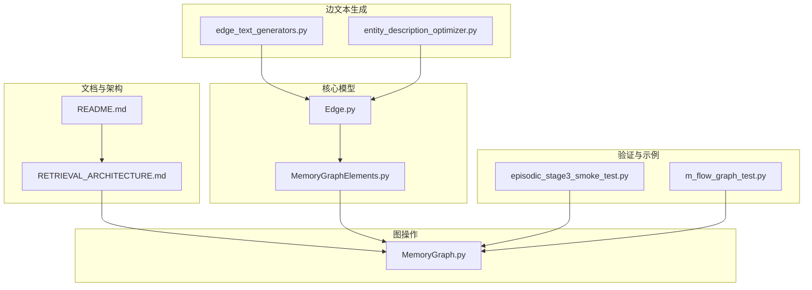
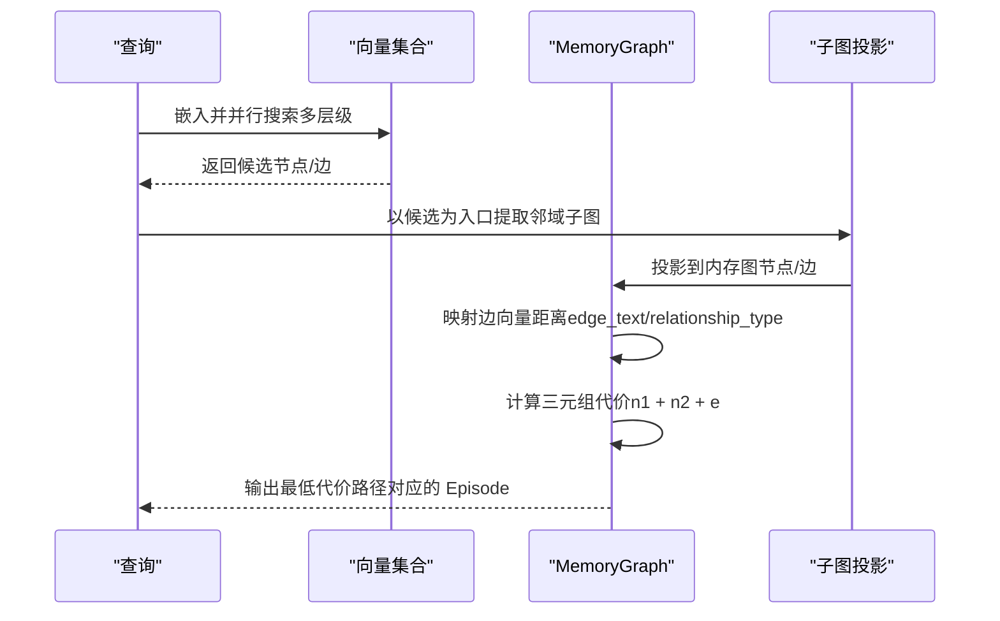
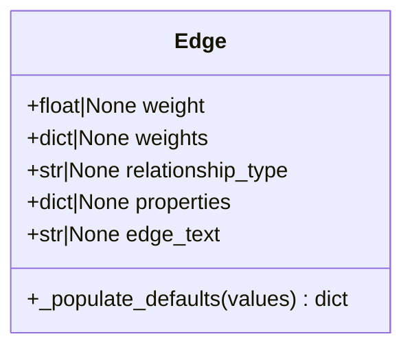
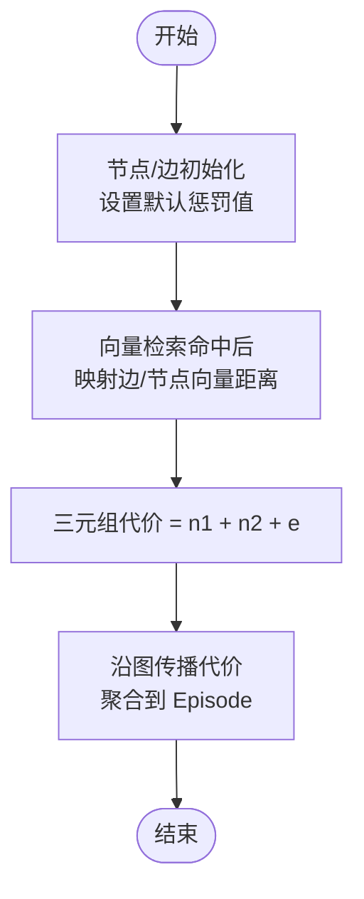
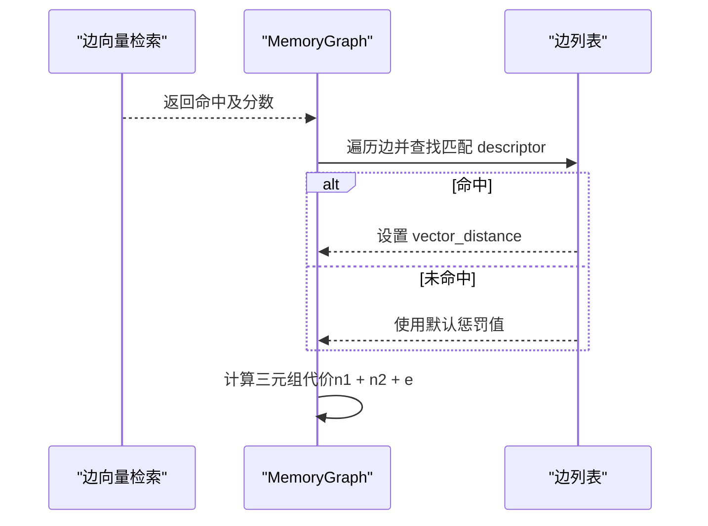
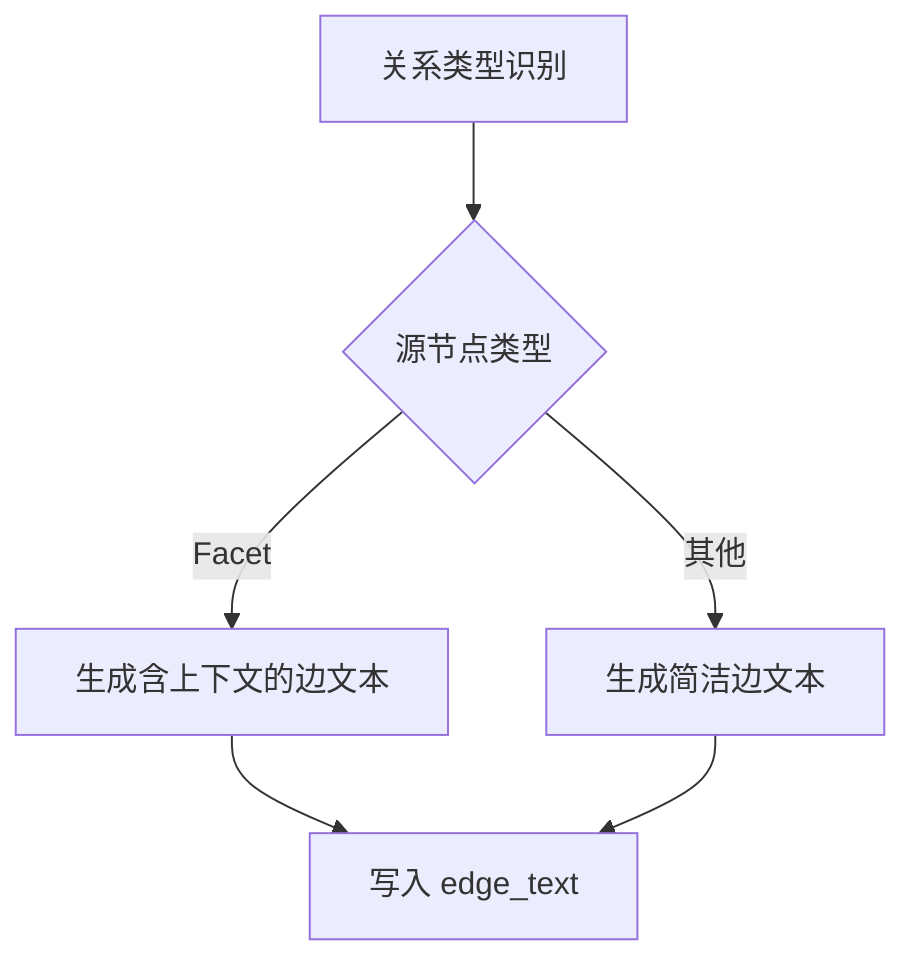
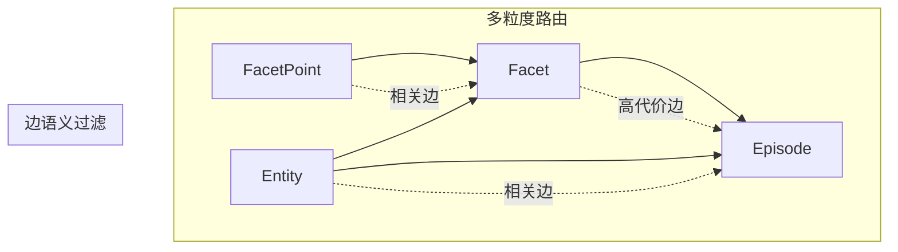
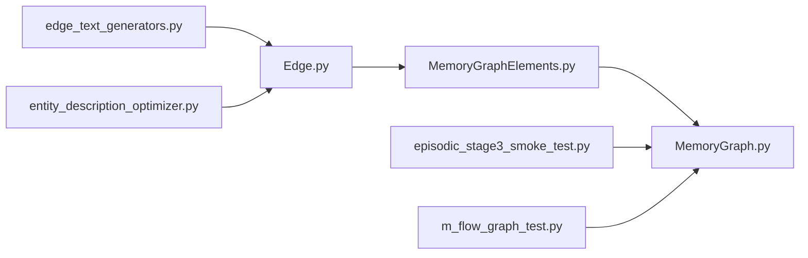

# 边语义设计

<cite>
**本文引用的文件**
- [RETRIEVAL_ARCHITECTURE.md](file://docs/RETRIEVAL_ARCHITECTURE.md)
- [Edge.py](file://m_flow/core/models/Edge.py)
- [MemoryGraphElements.py](file://m_flow/knowledge/graph_ops/m_flow_graph/MemoryGraphElements.py)
- [MemoryGraph.py](file://m_flow/knowledge/graph_ops/m_flow_graph/MemoryGraph.py)
- [edge_text_generators.py](file://m_flow/memory/episodic/edge_text_generators.py)
- [entity_description_optimizer.py](file://m_flow/memory/episodic/entity_description_optimizer.py)
- [episodic_stage3_smoke_test.py](file://examples/episodic_stage3_smoke_test.py)
- [m_flow_graph_test.py](file://m_flow/tests/unit/modules/graph/m_flow_graph_test.py)
- [README.md](file://README.md)
</cite>

## 目录
1. [引言](#引言)
2. [项目结构](#项目结构)
3. [核心组件](#核心组件)
4. [架构总览](#架构总览)
5. [详细组件分析](#详细组件分析)
6. [依赖分析](#依赖分析)
7. [性能考量](#性能考量)
8. [故障排查指南](#故障排查指南)
9. [结论](#结论)
10. [附录](#附录)

## 引言
本文件系统化阐述 M-flow 中“边语义设计”的核心创新：将传统知识图谱中被动的类型标签转变为活跃的语义过滤器。文档围绕以下关键点展开：
- 每条边携带自然语言描述，并参与向量化搜索与路径成本计算；
- 边向量在路径成本中作为“相关性度量”，有效阻止无关路径；
- 多粒度检索中，边语义帮助系统判断连接的相关性并影响最终排序；
- 边语义设计如何解决传统图数据库无法进行语义过滤的问题；
- 提供具体边类型示例与应用场景，展示其对检索精度的提升。

## 项目结构
M-flow 的检索体系以“倒锥形”拓扑组织知识，从尖端的细粒度锚点（实体、原子断言）到基部的事件汇总（Episode），通过边语义实现结构化推理与噪声过滤。核心文件分布如下：
- 文档与理念：docs/RETRIEVAL_ARCHITECTURE.md
- 边模型与默认行为：m_flow/core/models/Edge.py
- 图元素与代价模型：m_flow/knowledge/graph_ops/m_flow_graph/MemoryGraphElements.py
- 边向量映射与三元组评分：m_flow/knowledge/graph_ops/m_flow_graph/MemoryGraph.py
- 边文本生成与优化：m_flow/memory/episodic/edge_text_generators.py、m_flow/memory/episodic/entity_description_optimizer.py
- 示例与测试：examples/episodic_stage3_smoke_test.py、m_flow/tests/unit/modules/graph/m_flow_graph_test.py
- 项目概览与检索要点：README.md

图表来源
- [RETRIEVAL_ARCHITECTURE.md:1-137](file://docs/RETRIEVAL_ARCHITECTURE.md#L1-L137)
- [README.md:35-196](file://README.md#L35-L196)
- [Edge.py:1-36](file://m_flow/core/models/Edge.py#L1-L36)
- [MemoryGraphElements.py:1-195](file://m_flow/knowledge/graph_ops/m_flow_graph/MemoryGraphElements.py#L1-L195)
- [MemoryGraph.py:1-305](file://m_flow/knowledge/graph_ops/m_flow_graph/MemoryGraph.py#L1-L305)
- [edge_text_generators.py:1-197](file://m_flow/memory/episodic/edge_text_generators.py#L1-L197)
- [entity_description_optimizer.py:248-275](file://m_flow/memory/episodic/entity_description_optimizer.py#L248-L275)
- [episodic_stage3_smoke_test.py:110-146](file://examples/episodic_stage3_smoke_test.py#L110-L146)
- [m_flow_graph_test.py:277-481](file://m_flow/tests/unit/modules/graph/m_flow_graph_test.py#L277-L481)

章节来源
- [RETRIEVAL_ARCHITECTURE.md:1-137](file://docs/RETRIEVAL_ARCHITECTURE.md#L1-L137)
- [README.md:35-196](file://README.md#L35-L196)

## 核心组件
- 边模型（Edge）：承载可选元数据，支持 relationship_type 与 edge_text；当未显式提供 edge_text 时，自动回退到 relationship_type，确保所有边具备可向量化描述。
- 图元素（Node/Edge）：节点与边均维护 vector_distance 属性，作为向量搜索命中后的代价信号；默认缺失时采用统一惩罚值，保证无匹配时的鲁棒性。
- 边文本生成器：为不同关系类型生成简洁、可搜索的自然语言描述，减少结构化前缀干扰，提升向量检索质量。
- 边向量映射与三元组评分：将边向量检索结果映射至图边，结合起点/终点节点的向量距离，计算三元组代价并排序，用于路径成本传播与证据链筛选。

章节来源
- [Edge.py:1-36](file://m_flow/core/models/Edge.py#L1-L36)
- [MemoryGraphElements.py:23-195](file://m_flow/knowledge/graph_ops/m_flow_graph/MemoryGraphElements.py#L23-L195)
- [MemoryGraph.py:276-304](file://m_flow/knowledge/graph_ops/m_flow_graph/MemoryGraph.py#L276-L304)
- [edge_text_generators.py:1-197](file://m_flow/memory/episodic/edge_text_generators.py#L1-L197)

## 架构总览
M-flow 的检索以“图引导的束搜索”为核心：查询同时在多个向量集合上检索，得到细粒度锚点后，投影入图并沿边传播代价，最终在 Episode 聚合点进行最小代价路径选择。边语义在此过程中扮演“主动语义过滤器”的角色，使无关连接即便两端节点命中，也会因高代价而被抑制。

图表来源
- [RETRIEVAL_ARCHITECTURE.md:44-81](file://docs/RETRIEVAL_ARCHITECTURE.md#L44-L81)
- [MemoryGraph.py:170-200](file://m_flow/knowledge/graph_ops/m_flow_graph/MemoryGraph.py#L170-L200)
- [MemoryGraph.py:276-304](file://m_flow/knowledge/graph_ops/m_flow_graph/MemoryGraph.py#L276-L304)

章节来源
- [RETRIEVAL_ARCHITECTURE.md:44-81](file://docs/RETRIEVAL_ARCHITECTURE.md#L44-L81)

## 详细组件分析

### 边模型与默认行为
- Edge 支持 edge_text 字段；若未提供，则自动以 relationship_type 填充，确保每条边都有可向量化、可搜索的自然语言描述。
- 这一设计使得边不再是“被动类型标签”，而是“可参与检索与评分”的第一公民。

图表来源
- [Edge.py:8-36](file://m_flow/core/models/Edge.py#L8-L36)

章节来源
- [Edge.py:1-36](file://m_flow/core/models/Edge.py#L1-L36)

### 图元素与代价模型
- Node/Edge 在初始化时即设置 vector_distance 的默认惩罚值，保证在未命中向量检索时仍能给出稳定代价。
- 代价传播阶段，三元组代价由“起点节点代价 + 终点节点代价 + 边代价”构成，边代价来自向量映射或默认惩罚。

图表来源
- [MemoryGraphElements.py:23-195](file://m_flow/knowledge/graph_ops/m_flow_graph/MemoryGraphElements.py#L23-L195)
- [MemoryGraph.py:297-304](file://m_flow/knowledge/graph_ops/m_flow_graph/MemoryGraph.py#L297-L304)

章节来源
- [MemoryGraphElements.py:23-195](file://m_flow/knowledge/graph_ops/m_flow_graph/MemoryGraphElements.py#L23-L195)
- [MemoryGraph.py:297-304](file://m_flow/knowledge/graph_ops/m_flow_graph/MemoryGraph.py#L297-L304)

### 边向量映射与路径成本
- 将边向量检索结果按“边文本/关系名”映射到图边，若未命中则使用默认惩罚值。
- 三元组代价函数直接体现边语义在路径成本中的作用：边越相关（向量距离越小），三元组代价越低，路径越可能胜出。

图表来源
- [MemoryGraph.py:276-304](file://m_flow/knowledge/graph_ops/m_flow_graph/MemoryGraph.py#L276-L304)
- [m_flow_graph_test.py:308-384](file://m_flow/tests/unit/modules/graph/m_flow_graph_test.py#L308-L384)

章节来源
- [MemoryGraph.py:276-304](file://m_flow/knowledge/graph_ops/m_flow_graph/MemoryGraph.py#L276-L304)
- [m_flow_graph_test.py:308-384](file://m_flow/tests/unit/modules/graph/m_flow_graph_test.py#L308-L384)

### 边文本生成与优化
- 针对不同关系类型（如“包含断言”“涉及实体”“同一实体”等）生成简洁、可搜索的自然语言描述，减少结构化前缀干扰，提升向量检索质量。
- 对实体-实体关系，根据源节点类型（Facet/Episode）决定是否加入上下文描述，增强检索相关性。

图表来源
- [edge_text_generators.py:26-197](file://m_flow/memory/episodic/edge_text_generators.py#L26-L197)
- [entity_description_optimizer.py:248-275](file://m_flow/memory/episodic/entity_description_optimizer.py#L248-L275)

章节来源
- [edge_text_generators.py:1-197](file://m_flow/memory/episodic/edge_text_generators.py#L1-L197)
- [entity_description_optimizer.py:248-275](file://m_flow/memory/episodic/entity_description_optimizer.py#L248-L275)

### 多粒度检索中的边语义作用
- 精准锚点（FacetPoint/Entity）命中后，边语义决定是否继续向下传播到 Episode；无关边导致路径代价升高，从而抑制噪声。
- 广泛主题命中 Episode 摘要时，系统施加额外惩罚，优先选择更细粒度的锚点路径，避免“宽泛但不聚焦”的结果。

图表来源
- [RETRIEVAL_ARCHITECTURE.md:105-109](file://docs/RETRIEVAL_ARCHITECTURE.md#L105-L109)
- [README.md:125-182](file://README.md#L125-L182)

章节来源
- [RETRIEVAL_ARCHITECTURE.md:105-109](file://docs/RETRIEVAL_ARCHITECTURE.md#L105-L109)
- [README.md:125-182](file://README.md#L125-L182)

### 具体边类型示例与应用场景
- 涉及实体（involves_entity）：连接 Episode/Facet 与实体，边文本包含实体名称与上下文描述，便于跨文档实体桥接。
- 同一实体（same_entity_as）：合并同名实体，边文本简洁明确，利于去重与一致性。
- 包含断言（includes_chunk）：记录片段归属，边文本简洁，便于追踪证据来源。
- 支持关系（supported_by）：连接断言与支撑片段摘要，边文本包含断言标题与片段摘要，提升检索相关性。
- 拥有断言（has_point）：连接 Facet 与 FacetPoint，边文本包含断言标题与描述，强化主题定位。

章节来源
- [edge_text_generators.py:47-197](file://m_flow/memory/episodic/edge_text_generators.py#L47-L197)
- [entity_description_optimizer.py:248-275](file://m_flow/memory/episodic/entity_description_optimizer.py#L248-L275)

## 依赖分析
- 边模型（Edge）与图元素（Node/Edge）共同定义了代价传播的基础数据结构；
- MemoryGraph 负责将向量检索结果映射到图，并计算三元组代价；
- 边文本生成器为边提供高质量的自然语言描述，直接影响向量检索与路径评分；
- 示例与单元测试验证了边向量映射、默认惩罚与三元组评分的行为一致性。

图表来源
- [Edge.py:1-36](file://m_flow/core/models/Edge.py#L1-L36)
- [MemoryGraphElements.py:1-195](file://m_flow/knowledge/graph_ops/m_flow_graph/MemoryGraphElements.py#L1-L195)
- [MemoryGraph.py:1-305](file://m_flow/knowledge/graph_ops/m_flow_graph/MemoryGraph.py#L1-L305)
- [edge_text_generators.py:1-197](file://m_flow/memory/episodic/edge_text_generators.py#L1-L197)
- [entity_description_optimizer.py:248-275](file://m_flow/memory/episodic/entity_description_optimizer.py#L248-L275)
- [episodic_stage3_smoke_test.py:110-146](file://examples/episodic_stage3_smoke_test.py#L110-L146)
- [m_flow_graph_test.py:277-481](file://m_flow/tests/unit/modules/graph/m_flow_graph_test.py#L277-L481)

章节来源
- [m_flow_graph_test.py:277-481](file://m_flow/tests/unit/modules/graph/m_flow_graph_test.py#L277-L481)

## 性能考量
- 边向量映射采用基于描述符的查找，时间复杂度近似线性于边数量；建议在大规模图中对边文本建立索引以降低查找开销。
- 三元组代价计算为常数时间操作，整体性能主要受向量检索与子图投影规模影响。
- 默认惩罚值统一处理未命中的边，避免额外分支判断，提升稳定性与吞吐。

## 故障排查指南
- 边未映射到向量距离：检查边属性中是否存在 edge_text 或 relationship_type；若两者皆无，将使用默认惩罚值。
- 三元组代价异常：确认节点与边的 vector_distance 是否正确设置；默认惩罚值通常为固定常数。
- 路径评分不符合预期：核对边文本生成逻辑是否符合关系类型；对于 Facet→Entity 的边，需包含上下文描述以提升相关性。

章节来源
- [MemoryGraph.py:276-304](file://m_flow/knowledge/graph_ops/m_flow_graph/MemoryGraph.py#L276-L304)
- [m_flow_graph_test.py:308-423](file://m_flow/tests/unit/modules/graph/m_flow_graph_test.py#L308-L423)
- [episodic_stage3_smoke_test.py:110-146](file://examples/episodic_stage3_smoke_test.py#L110-L146)

## 结论
M-flow 的边语义设计将“连接”从“被动类型标签”升级为“主动语义过滤器”。通过为每条边生成自然语言描述并参与向量化搜索，边向量在路径成本计算中发挥关键作用，有效阻止无关路径，提升多粒度检索的准确性与鲁棒性。该设计解决了传统图数据库无法进行语义过滤的问题，使系统能够在倒锥形拓扑中自适应地路由到最合适的粒度，并以结构化推理替代纯相似度排序。

## 附录
- 边文本生成策略与示例详见边文本生成模块；
- 三元组代价与默认惩罚值的测试用例可参考单元测试与示例脚本。