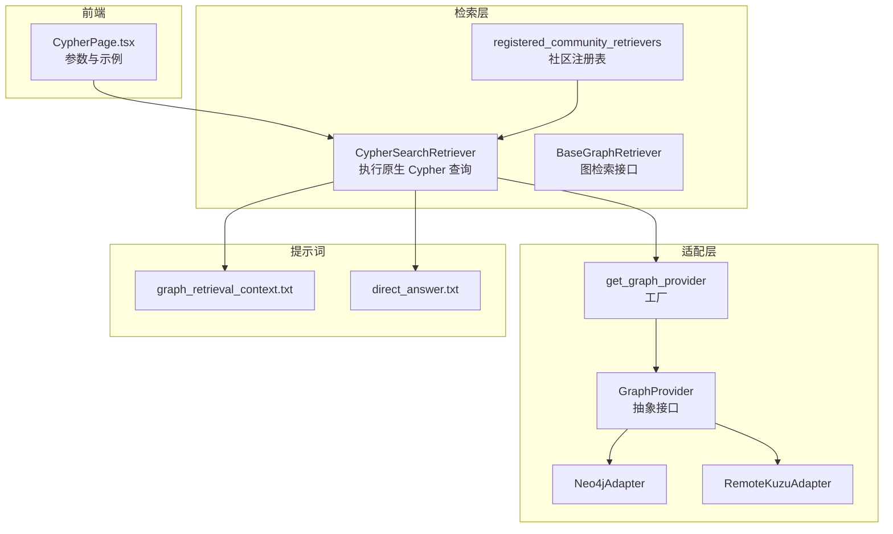
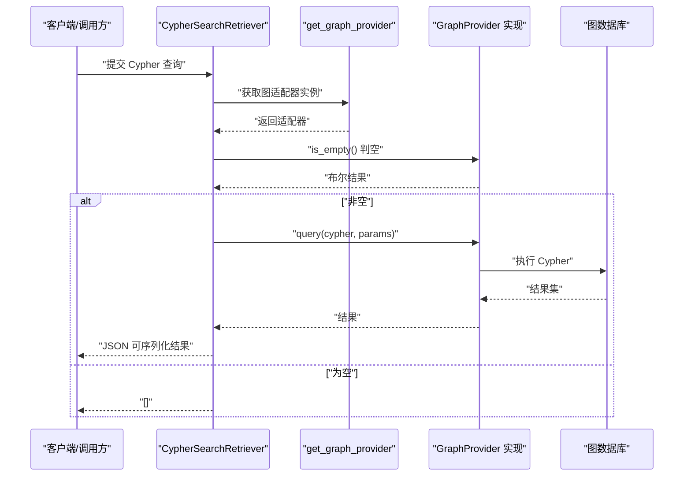
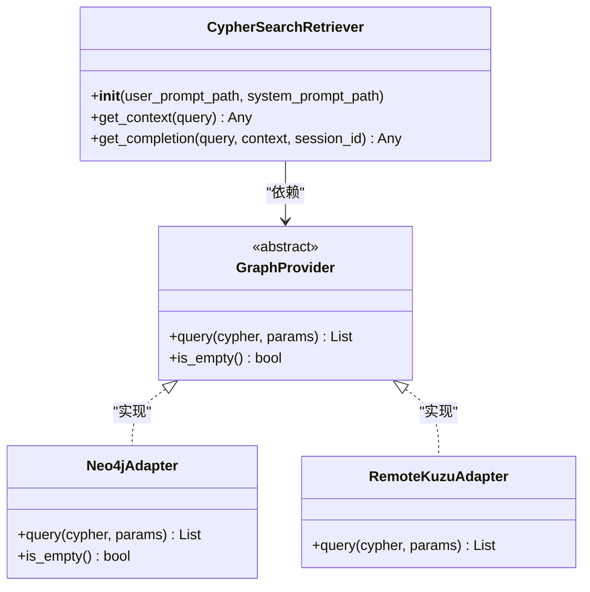
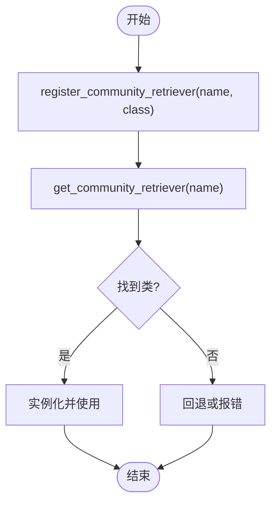
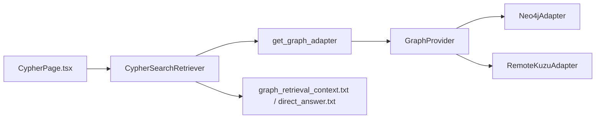

# Cypher 图查询检索

<cite>
**本文引用的文件**
- [m_flow/retrieval/cypher_search_retriever.py](file://m_flow/retrieval/cypher_search_retriever.py)
- [m_flow/retrieval/base_graph_retriever.py](file://m_flow/retrieval/base_graph_retriever.py)
- [m_flow/retrieval/registered_community_retrievers.py](file://m_flow/retrieval/registered_community_retrievers.py)
- [m_flow/adapters/graph/graph_db_interface.py](file://m_flow/adapters/graph/graph_db_interface.py)
- [m_flow/adapters/graph/get_graph_adapter.py](file://m_flow/adapters/graph/get_graph_adapter.py)
- [m_flow/adapters/graph/neo4j_driver/adapter.py](file://m_flow/adapters/graph/neo4j_driver/adapter.py)
- [m_flow/adapters/graph/kuzu/remote_kuzu_adapter.py](file://m_flow/adapters/graph/kuzu/remote_kuzu_adapter.py)
- [m_flow/llm/prompts/graph_retrieval_context.txt](file://m_flow/llm/prompts/graph_retrieval_context.txt)
- [m_flow/llm/prompts/direct_answer.txt](file://m_flow/llm/prompts/direct_answer.txt)
- [m_flow-frontend/src/components/retrieve/CypherPage.tsx](file://m_flow-frontend/src/components/retrieve/CypherPage.tsx)
</cite>

## 目录
1. [简介](#简介)
2. [项目结构](#项目结构)
3. [核心组件](#核心组件)
4. [架构总览](#架构总览)
5. [组件详解](#组件详解)
6. [依赖关系分析](#依赖关系分析)
7. [性能考量](#性能考量)
8. [故障排查指南](#故障排查指南)
9. [结论](#结论)
10. [附录：Cypher 查询示例与配置](#附录cypher-查询示例与配置)

## 简介
本文件系统性阐述基于 Cypher 的图数据库检索能力，覆盖以下主题：
- 使用 Cypher 进行图检索的语法与执行机制
- 基础图检索器的实现与工作流
- 将自然语言查询转化为 Cypher 的方法论（结合提示词模板）
- 社区注册检索器的扩展机制与自定义处理器接入方式
- Cypher 查询优化策略（索引利用、查询计划优化）
- 配置项与性能调优建议
- 实际查询示例与性能分析思路

## 项目结构
围绕“Cypher 图查询检索”的关键代码分布在如下模块：
- 检索层：CypherSearchRetriever、BaseGraphRetriever、社区注册表
- 适配层：GraphProvider 抽象、具体数据库适配器工厂与实现
- 提示词：用于将检索结果组织为可回答上下文
- 前端：Cypher 查询页面与参数参考

图表来源
- [m_flow/retrieval/cypher_search_retriever.py:21-91](file://m_flow/retrieval/cypher_search_retriever.py#L21-L91)
- [m_flow/retrieval/base_graph_retriever.py:13-63](file://m_flow/retrieval/base_graph_retriever.py#L13-L63)
- [m_flow/retrieval/registered_community_retrievers.py:14-25](file://m_flow/retrieval/registered_community_retrievers.py#L14-L25)
- [m_flow/adapters/graph/graph_db_interface.py:122-347](file://m_flow/adapters/graph/graph_db_interface.py#L122-L347)
- [m_flow/adapters/graph/get_graph_adapter.py:22-82](file://m_flow/adapters/graph/get_graph_adapter.py#L22-L82)
- [m_flow/adapters/graph/neo4j_driver/adapter.py:90-179](file://m_flow/adapters/graph/neo4j_driver/adapter.py#L90-L179)
- [m_flow/adapters/graph/kuzu/remote_kuzu_adapter.py:201-239](file://m_flow/adapters/graph/kuzu/remote_kuzu_adapter.py#L201-L239)
- [m_flow/llm/prompts/graph_retrieval_context.txt:1-3](file://m_flow/llm/prompts/graph_retrieval_context.txt#L1-L3)
- [m_flow/llm/prompts/direct_answer.txt:1-1](file://m_flow/llm/prompts/direct_answer.txt#L1-L1)
- [m_flow-frontend/src/components/retrieve/CypherPage.tsx:29-37](file://m_flow-frontend/src/components/retrieve/CypherPage.tsx#L29-L37)

章节来源
- [m_flow/retrieval/cypher_search_retriever.py:1-91](file://m_flow/retrieval/cypher_search_retriever.py#L1-L91)
- [m_flow/retrieval/base_graph_retriever.py:1-63](file://m_flow/retrieval/base_graph_retriever.py#L1-L63)
- [m_flow/retrieval/registered_community_retrievers.py:1-25](file://m_flow/retrieval/registered_community_retrievers.py#L1-L25)
- [m_flow/adapters/graph/graph_db_interface.py:1-347](file://m_flow/adapters/graph/graph_db_interface.py#L1-L347)
- [m_flow/adapters/graph/get_graph_adapter.py:1-82](file://m_flow/adapters/graph/get_graph_adapter.py#L1-L82)
- [m_flow/adapters/graph/neo4j_driver/adapter.py:1-200](file://m_flow/adapters/graph/neo4j_driver/adapter.py#L1-L200)
- [m_flow/adapters/graph/kuzu/remote_kuzu_adapter.py:197-249](file://m_flow/adapters/graph/kuzu/remote_kuzu_adapter.py#L197-L249)
- [m_flow/llm/prompts/graph_retrieval_context.txt:1-3](file://m_flow/llm/prompts/graph_retrieval_context.txt#L1-L3)
- [m_flow/llm/prompts/direct_answer.txt:1-1](file://m_flow/llm/prompts/direct_answer.txt#L1-L1)
- [m_flow-frontend/src/components/retrieve/CypherPage.tsx:29-328](file://m_flow-frontend/src/components/retrieve/CypherPage.tsx#L29-L328)

## 核心组件
- CypherSearchRetriever：直接执行用户提供的 Cypher 查询，返回可序列化结果；在空图时快速返回空列表；异常统一包装为 CypherSearchError。
- GraphProvider：图数据库适配器抽象，定义 query、is_empty、节点/边 CRUD、属性过滤、子图提取等接口。
- get_graph_provider：异步工厂，按配置选择并初始化具体适配器（如 Neo4j、Kuzu 等）。
- Neo4jAdapter：基于官方异步驱动的实现，支持会话管理、参数化查询、唯一约束初始化、属性编码等。
- RemoteKuzuAdapter：通过 REST API 执行 Cypher，负责参数序列化、响应解析与错误处理。
- 提示词模板：graph_retrieval_context.txt 与 direct_answer.txt 用于将检索结果格式化为 LLM 上下文并指导简洁回答。

章节来源
- [m_flow/retrieval/cypher_search_retriever.py:21-91](file://m_flow/retrieval/cypher_search_retriever.py#L21-L91)
- [m_flow/adapters/graph/graph_db_interface.py:122-347](file://m_flow/adapters/graph/graph_db_interface.py#L122-L347)
- [m_flow/adapters/graph/get_graph_adapter.py:22-82](file://m_flow/adapters/graph/get_graph_adapter.py#L22-L82)
- [m_flow/adapters/graph/neo4j_driver/adapter.py:90-179](file://m_flow/adapters/graph/neo4j_driver/adapter.py#L90-L179)
- [m_flow/adapters/graph/kuzu/remote_kuzu_adapter.py:201-239](file://m_flow/adapters/graph/kuzu/remote_kuzu_adapter.py#L201-L239)
- [m_flow/llm/prompts/graph_retrieval_context.txt:1-3](file://m_flow/llm/prompts/graph_retrieval_context.txt#L1-L3)
- [m_flow/llm/prompts/direct_answer.txt:1-1](file://m_flow/llm/prompts/direct_answer.txt#L1-L1)

## 架构总览
下图展示从检索器到数据库适配器再到具体数据库的调用链路与职责分工。

图表来源
- [m_flow/retrieval/cypher_search_retriever.py:44-91](file://m_flow/retrieval/cypher_search_retriever.py#L44-L91)
- [m_flow/adapters/graph/get_graph_adapter.py:22-82](file://m_flow/adapters/graph/get_graph_adapter.py#L22-L82)
- [m_flow/adapters/graph/graph_db_interface.py:131-139](file://m_flow/adapters/graph/graph_db_interface.py#L131-L139)
- [m_flow/adapters/graph/neo4j_driver/adapter.py:154-179](file://m_flow/adapters/graph/neo4j_driver/adapter.py#L154-L179)
- [m_flow/adapters/graph/kuzu/remote_kuzu_adapter.py:201-239](file://m_flow/adapters/graph/kuzu/remote_kuzu_adapter.py#L201-L239)

## 组件详解

### CypherSearchRetriever：原生 Cypher 执行器
- 职责：接收用户 Cypher 查询字符串，通过图适配器执行并返回 JSON 可序列化结果；在空图时快速短路。
- 异常处理：捕获底层异常并封装为 CypherSearchError，便于上层统一处理。
- 与提示词协作：通过模板将检索结果组织为 LLM 上下文，再由下游模型生成简洁回答。

图表来源
- [m_flow/retrieval/cypher_search_retriever.py:21-91](file://m_flow/retrieval/cypher_search_retriever.py#L21-L91)
- [m_flow/adapters/graph/graph_db_interface.py:122-139](file://m_flow/adapters/graph/graph_db_interface.py#L122-L139)
- [m_flow/adapters/graph/neo4j_driver/adapter.py:160-179](file://m_flow/adapters/graph/neo4j_driver/adapter.py#L160-L179)
- [m_flow/adapters/graph/kuzu/remote_kuzu_adapter.py:201-239](file://m_flow/adapters/graph/kuzu/remote_kuzu_adapter.py#L201-L239)

章节来源
- [m_flow/retrieval/cypher_search_retriever.py:21-91](file://m_flow/retrieval/cypher_search_retriever.py#L21-L91)

### GraphProvider 抽象与适配器实现
- 抽象接口：定义 query、is_empty、节点/边 CRUD、属性过滤、子图提取、指标统计等方法，确保不同数据库后端的一致行为契约。
- Neo4jAdapter：提供会话管理、参数化查询、唯一约束初始化、属性编码/解码、重试装饰器等能力。
- RemoteKuzuAdapter：通过 REST API 执行 Cypher，负责请求体序列化、响应解析与错误日志记录。

章节来源
- [m_flow/adapters/graph/graph_db_interface.py:122-347](file://m_flow/adapters/graph/graph_db_interface.py#L122-L347)
- [m_flow/adapters/graph/neo4j_driver/adapter.py:90-179](file://m_flow/adapters/graph/neo4j_driver/adapter.py#L90-L179)
- [m_flow/adapters/graph/kuzu/remote_kuzu_adapter.py:201-239](file://m_flow/adapters/graph/kuzu/remote_kuzu_adapter.py#L201-L239)

### 自然语言到 Cypher 的转换路径
- 当前实现采用“直接执行”模式：CypherSearchRetriever 直接执行用户提供的 Cypher 查询。
- 若需将自然语言转为 Cypher，可在上游引入查询构建器或 LLM 提示词工程，将用户意图映射为 Cypher 模式（例如 MATCH/WHERE/RETURN），再交由检索器执行。
- 提示词模板可用于将检索结果格式化为 LLM 上下文，指导简洁回答。

章节来源
- [m_flow/retrieval/cypher_search_retriever.py:44-91](file://m_flow/retrieval/cypher_search_retriever.py#L44-L91)
- [m_flow/llm/prompts/graph_retrieval_context.txt:1-3](file://m_flow/llm/prompts/graph_retrieval_context.txt#L1-L3)
- [m_flow/llm/prompts/direct_answer.txt:1-1](file://m_flow/llm/prompts/direct_answer.txt#L1-L1)

### 社区注册检索器扩展机制
- 注册表：维护社区贡献的检索器类字典，键为名称，值为类类型。
- 接口：register_community_retriever(name, retriever_class) 与 get_community_retriever(name) 提供动态加载能力。
- 应用场景：允许第三方开发者以插件形式扩展检索能力，无需修改核心代码。

图表来源
- [m_flow/retrieval/registered_community_retrievers.py:14-25](file://m_flow/retrieval/registered_community_retrievers.py#L14-L25)

章节来源
- [m_flow/retrieval/registered_community_retrievers.py:1-25](file://m_flow/retrieval/registered_community_retrievers.py#L1-L25)

## 依赖关系分析
- 检索器依赖适配器工厂与抽象接口，保证对具体数据库的解耦。
- 适配器实现遵循统一接口，便于替换与扩展。
- 前端提供参数与示例，辅助用户编写与调试 Cypher 查询。

图表来源
- [m_flow/retrieval/cypher_search_retriever.py:13-16](file://m_flow/retrieval/cypher_search_retriever.py#L13-L16)
- [m_flow/adapters/graph/get_graph_adapter.py:22-82](file://m_flow/adapters/graph/get_graph_adapter.py#L22-L82)
- [m_flow/adapters/graph/graph_db_interface.py:122-139](file://m_flow/adapters/graph/graph_db_interface.py#L122-L139)
- [m_flow/adapters/graph/neo4j_driver/adapter.py:90-126](file://m_flow/adapters/graph/neo4j_driver/adapter.py#L90-L126)
- [m_flow/adapters/graph/kuzu/remote_kuzu_adapter.py:201-210](file://m_flow/adapters/graph/kuzu/remote_kuzu_adapter.py#L201-L210)
- [m_flow/llm/prompts/graph_retrieval_context.txt:1-3](file://m_flow/llm/prompts/graph_retrieval_context.txt#L1-L3)
- [m_flow/llm/prompts/direct_answer.txt:1-1](file://m_flow/llm/prompts/direct_answer.txt#L1-L1)
- [m_flow-frontend/src/components/retrieve/CypherPage.tsx:32-37](file://m_flow-frontend/src/components/retrieve/CypherPage.tsx#L32-L37)

章节来源
- [m_flow/retrieval/cypher_search_retriever.py:1-91](file://m_flow/retrieval/cypher_search_retriever.py#L1-L91)
- [m_flow/adapters/graph/get_graph_adapter.py:1-82](file://m_flow/adapters/graph/get_graph_adapter.py#L1-L82)
- [m_flow/adapters/graph/graph_db_interface.py:1-347](file://m_flow/adapters/graph/graph_db_interface.py#L1-L347)
- [m_flow/llm/prompts/graph_retrieval_context.txt:1-3](file://m_flow/llm/prompts/graph_retrieval_context.txt#L1-L3)
- [m_flow/llm/prompts/direct_answer.txt:1-1](file://m_flow/llm/prompts/direct_answer.txt#L1-L1)
- [m_flow-frontend/src/components/retrieve/CypherPage.tsx:29-37](file://m_flow-frontend/src/components/retrieve/CypherPage.tsx#L29-L37)

## 性能考量
- 查询执行
  - 参数化查询：所有适配器均支持参数化传参，避免拼接风险与注入问题。
  - 会话与连接：Neo4jAdapter 使用异步会话管理，合理设置超时与连接生命周期。
  - 死锁重试：Neo4jAdapter 对写操作使用重试装饰器，提升稳定性。
- 数据库侧优化
  - 索引与约束：Neo4jAdapter 在初始化阶段创建唯一约束，减少重复插入与查找成本。
  - 属性编码：对 UUID、嵌套结构进行编码/扁平化，降低存储与查询复杂度。
- 结果处理
  - JSON 可序列化：检索器对结果进行编码，便于跨进程/网络传输。
  - 空图短路：在空图时直接返回空列表，避免无效查询。
- 前端交互
  - 限制输入长度：前端示例对查询文本长度进行截断，有助于控制向量搜索与查询开销。

章节来源
- [m_flow/adapters/graph/neo4j_driver/adapter.py:143-179](file://m_flow/adapters/graph/neo4j_driver/adapter.py#L143-L179)
- [m_flow/adapters/graph/neo4j_driver/adapter.py:52-87](file://m_flow/adapters/graph/neo4j_driver/adapter.py#L52-L87)
- [m_flow/retrieval/cypher_search_retriever.py:57-69](file://m_flow/retrieval/cypher_search_retriever.py#L57-L69)
- [m_flow-frontend/src/components/retrieve/CypherPage.tsx:54-55](file://m_flow-frontend/src/components/retrieve/CypherPage.tsx#L54-L55)

## 故障排查指南
- 常见错误
  - Cypher 执行失败：检查查询语法、参数绑定与权限；查看日志中的错误堆栈。
  - 空图：当 is_empty 返回真时，检索器直接返回空列表，确认数据是否已导入。
  - 连接问题：核对数据库 URL、凭据与网络连通性；Neo4jAdapter 支持匿名认证降级。
- 定位步骤
  - 启用更详细的日志级别，观察检索器与适配器的日志输出。
  - 分离问题域：先验证数据库可用性（如执行简单 MATCH/RETURN），再逐步增加复杂度。
  - 参数化与最小复现：将问题缩小到最小 Cypher 片段与参数集合。
- 相关实现参考
  - 检索器异常包装与日志记录
  - 适配器查询与错误处理
  - 前端参数校验与示例模板

章节来源
- [m_flow/retrieval/cypher_search_retriever.py:67-69](file://m_flow/retrieval/cypher_search_retriever.py#L67-L69)
- [m_flow/adapters/graph/neo4j_driver/adapter.py:176-178](file://m_flow/adapters/graph/neo4j_driver/adapter.py#L176-L178)
- [m_flow/adapters/graph/kuzu/remote_kuzu_adapter.py:234-238](file://m_flow/adapters/graph/kuzu/remote_kuzu_adapter.py#L234-L238)
- [m_flow-frontend/src/components/retrieve/CypherPage.tsx:32-37](file://m_flow-frontend/src/components/retrieve/CypherPage.tsx#L32-L37)

## 结论
- 本实现以“原生 Cypher 执行”为核心，通过 GraphProvider 抽象与适配器工厂实现对多数据库的支持。
- 借助提示词模板，检索结果可被高效组织为 LLM 上下文，指导简洁回答。
- 社区注册机制为扩展检索能力提供了开放接口，便于二次开发与集成。
- 性能方面，建议优先使用参数化查询、建立必要索引/约束，并在前端进行输入约束与示例引导。

## 附录：Cypher 查询示例与配置
- 前端参数参考
  - query_text：必填，Cypher 查询语句
  - query_type：默认 CYPHER，用于检索模式标识
  - timeout：查询超时（秒）
  - limit：默认结果上限（若查询未指定 LIMIT）
- 示例模板（来自前端组件）
  - 两跳路径示例：用于探索二跳邻域
- 建议实践
  - 先在数据库客户端验证查询正确性与性能
  - 使用参数化绑定变量，避免字符串拼接
  - 为高频过滤字段建立索引/约束
  - 控制返回字段数量与结果集大小

章节来源
- [m_flow-frontend/src/components/retrieve/CypherPage.tsx:29-37](file://m_flow-frontend/src/components/retrieve/CypherPage.tsx#L29-L37)
- [m_flow-frontend/src/components/retrieve/CypherPage.tsx:305-315](file://m_flow-frontend/src/components/retrieve/CypherPage.tsx#L305-L315)