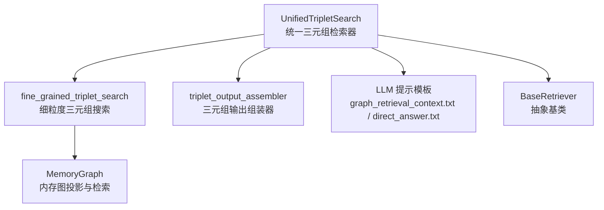
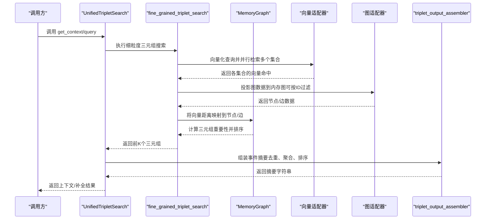
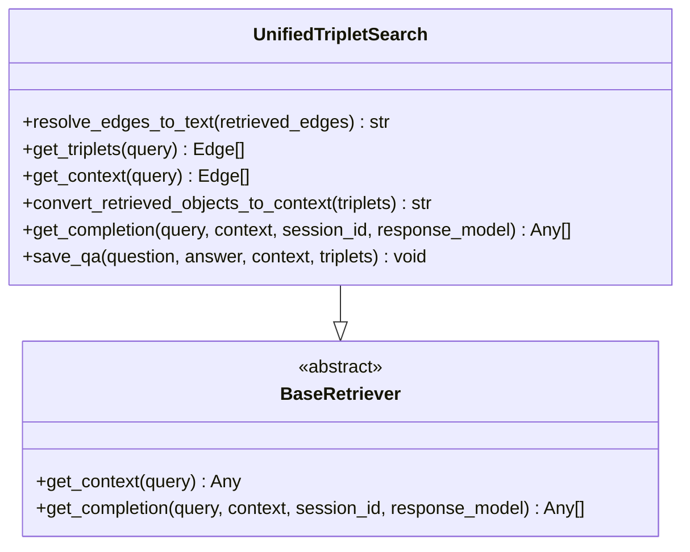
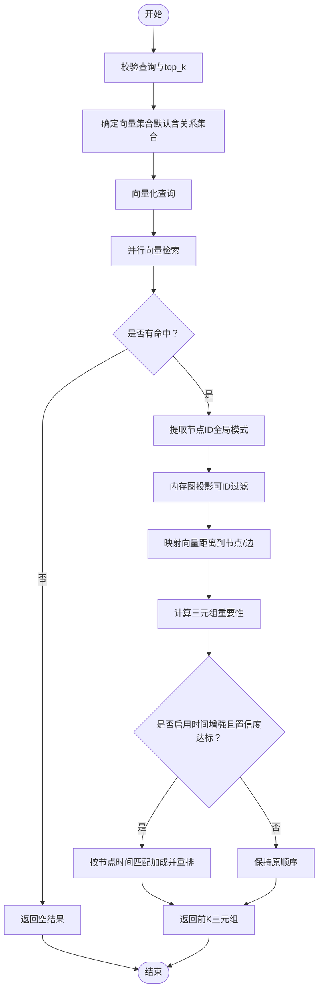
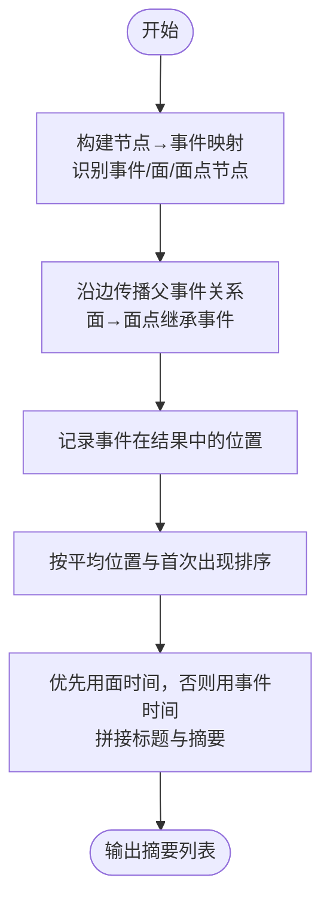
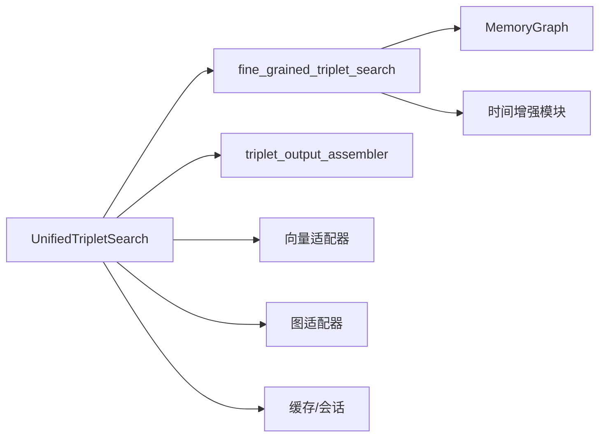

# 三元组检索模式

<cite>
**本文引用的文件**
- [unified_triplet_search.py](file://m_flow/retrieval/unified_triplet_search.py)
- [fine_grained_triplet_search.py](file://m_flow/retrieval/utils/fine_grained_triplet_search.py)
- [triplet_output_assembler.py](file://m_flow/retrieval/utils/triplet_output_assembler.py)
- [base_retriever.py](file://m_flow/retrieval/base_retriever.py)
- [MemoryGraph.py](file://m_flow/knowledge/graph_ops/m_flow_graph/MemoryGraph.py)
- [graph_retrieval_context.txt](file://m_flow/llm/prompts/graph_retrieval_context.txt)
- [direct_answer.txt](file://m_flow/llm/prompts/direct_answer.txt)
- [unified_triplet_search_test.py](file://m_flow/tests/unit/modules/retrieval/unified_triplet_search_test.py)
- [test_fine_grained_triplet_search.py](file://m_flow/tests/unit/modules/retrieval/test_fine_grained_triplet_search.py)
</cite>

## 目录
1. [简介](#简介)
2. [项目结构](#项目结构)
3. [核心组件](#核心组件)
4. [架构总览](#架构总览)
5. [详细组件分析](#详细组件分析)
6. [依赖分析](#依赖分析)
7. [性能考虑](#性能考虑)
8. [故障排查指南](#故障排查指南)
9. [结论](#结论)
10. [附录：查询语法与参数配置](#附录查询语法与参数配置)

## 简介
本文件系统性阐述“三元组检索模式”的设计与实现，重点覆盖以下方面：
- 实体-关系-实体的三元组匹配与补全流程
- 统一三元组搜索算法：如何处理不完整查询、如何从多集合向量检索中聚合与重排
- 细粒度三元组搜索：如何基于向量检索与内存图映射实现精确三元组匹配
- 三元组输出组装器：如何将检索结果去重、按事件聚合并格式化为可读摘要
- 查询语法与参数配置：支持的输入参数、过滤选项与时间增强策略
- 在知识图谱查询中的应用示例：前端页面参数、后端检索调用与测试验证

## 项目结构
围绕三元组检索的关键文件分布如下：
- 检索入口与编排：UnifiedTripletSearch
- 细粒度搜索与重排：fine_grained_triplet_search
- 输出组装与摘要：triplet_output_assembler
- 内存图投影与检索：MemoryGraph
- 基类接口：BaseRetriever
- 提示模板：graph_retrieval_context.txt、direct_answer.txt
- 单元测试：验证行为与边界条件

图表来源
- [unified_triplet_search.py:29-306](file://m_flow/retrieval/unified_triplet_search.py#L29-L306)
- [fine_grained_triplet_search.py:108-327](file://m_flow/retrieval/utils/fine_grained_triplet_search.py#L108-L327)
- [triplet_output_assembler.py:124-311](file://m_flow/retrieval/utils/triplet_output_assembler.py#L124-L311)
- [MemoryGraph.py:29-200](file://m_flow/knowledge/graph_ops/m_flow_graph/MemoryGraph.py#L29-L200)
- [base_retriever.py:11-61](file://m_flow/retrieval/base_retriever.py#L11-L61)

章节来源
- [unified_triplet_search.py:29-306](file://m_flow/retrieval/unified_triplet_search.py#L29-L306)
- [fine_grained_triplet_search.py:108-327](file://m_flow/retrieval/utils/fine_grained_triplet_search.py#L108-L327)
- [triplet_output_assembler.py:124-311](file://m_flow/retrieval/utils/triplet_output_assembler.py#L124-L311)
- [MemoryGraph.py:29-200](file://m_flow/knowledge/graph_ops/m_flow_graph/MemoryGraph.py#L29-L200)
- [base_retriever.py:11-61](file://m_flow/retrieval/base_retriever.py#L11-L61)

## 核心组件
- UnifiedTripletSearch：统一三元组检索器，负责自动发现向量集合、执行细粒度三元组搜索、可选地生成LLM补全，并保存交互记录。
- fine_grained_triplet_search：细粒度三元组搜索，执行向量检索、内存图投影、距离映射、重要性计算与重排（含时间增强）。
- triplet_output_assembler：三元组输出组装器，将扁平的三元组边去重并按事件聚合，生成带时间与标题的摘要列表。
- MemoryGraph：内存图，负责从持久存储投影图数据、按属性或ID过滤、映射向量距离到节点/边并计算三元组重要性。
- BaseRetriever：检索抽象基类，定义获取上下文与生成补全的标准接口。

章节来源
- [unified_triplet_search.py:29-306](file://m_flow/retrieval/unified_triplet_search.py#L29-L306)
- [fine_grained_triplet_search.py:108-327](file://m_flow/retrieval/utils/fine_grained_triplet_search.py#L108-L327)
- [triplet_output_assembler.py:124-311](file://m_flow/retrieval/utils/triplet_output_assembler.py#L124-L311)
- [MemoryGraph.py:29-200](file://m_flow/knowledge/graph_ops/m_flow_graph/MemoryGraph.py#L29-L200)
- [base_retriever.py:11-61](file://m_flow/retrieval/base_retriever.py#L11-L61)

## 架构总览
统一三元组检索的整体流程如下：

图表来源
- [unified_triplet_search.py:83-175](file://m_flow/retrieval/unified_triplet_search.py#L83-L175)
- [fine_grained_triplet_search.py:108-327](file://m_flow/retrieval/utils/fine_grained_triplet_search.py#L108-L327)
- [triplet_output_assembler.py:124-311](file://m_flow/retrieval/utils/triplet_output_assembler.py#L124-L311)

## 详细组件分析

### 统一三元组检索器（UnifiedTripletSearch）
- 自动发现向量集合：若未指定集合，则扫描所有MemoryNode子类的索引字段，组合为“类名_字段名”集合名。
- 细粒度三元组搜索：调用 fine_grained_triplet_search，支持 top_k、宽搜上限、节点类型/名称过滤、三元组距离惩罚等。
- 上下文解析：可将三元组转换为人类可读文本，或通过 triplet_output_assembler 聚合为事件摘要。
- 补全生成：结合提示模板与会话历史，生成简洁回答；可选择缓存会话历史。
- 交互保存：将问答对与使用的三元组边写入内存节点，并在图中建立关系边用于后续分析。

图表来源
- [unified_triplet_search.py:29-306](file://m_flow/retrieval/unified_triplet_search.py#L29-L306)
- [base_retriever.py:11-61](file://m_flow/retrieval/base_retriever.py#L11-L61)

章节来源
- [unified_triplet_search.py:29-306](file://m_flow/retrieval/unified_triplet_search.py#L29-L306)
- [base_retriever.py:11-61](file://m_flow/retrieval/base_retriever.py#L11-L61)

### 细粒度三元组搜索（fine_grained_triplet_search）
- 输入校验：查询必须非空，top_k需大于0；memory_type_filter仅支持"atomic"/"episodic"/None。
- 集合选择：默认集合包含事件摘要、实体名称、概念名称与关系类型文本；始终包含关系集合。
- 向量检索：对每个集合并行执行向量搜索，支持 where_filter 的引擎可按实体记忆类型过滤。
- 宽搜与ID提取：在全局模式下收集命中的节点ID，用于后续内存图投影时的ID过滤，减少图规模。
- 内存图投影：将向量距离映射到节点与边，计算三元组重要性，按重要性取前K。
- 时间增强：解析查询中的时间表达式，对命中节点或边按时间接近度加分，再重新排序。
- 异常处理：集合不存在或投影异常时返回空结果或降级处理。

图表来源
- [fine_grained_triplet_search.py:108-327](file://m_flow/retrieval/utils/fine_grained_triplet_search.py#L108-L327)

章节来源
- [fine_grained_triplet_search.py:108-327](file://m_flow/retrieval/utils/fine_grained_triplet_search.py#L108-L327)

### 三元组输出组装器（triplet_output_assembler）
- 目标：解决“同一事件多次出现”的问题，将扁平的三元组边去重并按事件聚合，输出唯一摘要列表。
- 步骤：
  1) 建立节点ID到事件ID的映射，识别事件、面（Facet）、面点（FacetPoint）节点。
  2) 通过三元组边传播父事件关系，将面与面点映射到其所属事件。
  3) 对每个事件统计其边在结果中的平均位置与首次出现位置，按平均位置升序、首次出现位置次序排序。
  4) 优先使用面的时间信息，其次回退到事件时间，生成带时间与标题的摘要。
- 输出：最多 max_episodes 条摘要，每条以“[时间][标题]”作为头部，后跟摘要正文。

图表来源
- [triplet_output_assembler.py:124-311](file://m_flow/retrieval/utils/triplet_output_assembler.py#L124-L311)

章节来源
- [triplet_output_assembler.py:124-311](file://m_flow/retrieval/utils/triplet_output_assembler.py#L124-L311)

### 内存图（MemoryGraph）与投影
- 支持多种投影策略：按节点类型/名称限定、按ID过滤、按属性谓词过滤、全图加载。
- 将持久存储的节点/边数据加载到内存，建立邻接结构，便于后续向量距离映射与三元组重要性计算。
- 错误处理：当查询为空或无数据时抛出概念未找到异常，保证上层逻辑可降级处理。

章节来源
- [MemoryGraph.py:29-200](file://m_flow/knowledge/graph_ops/m_flow_graph/MemoryGraph.py#L29-L200)

## 依赖分析
- UnifiedTripletSearch 依赖：
  - fine_grained_triplet_search：执行检索与重排
  - triplet_output_assembler：组装摘要
  - resolve_edges_to_text：将三元组转为文本（可选）
  - 图/向量适配器：获取图提供者与向量提供者
  - 缓存与会话：保存/读取对话历史
- fine_grained_triplet_search 依赖：
  - MemoryGraph：投影与重要性计算
  - 向量适配器：嵌入与搜索
  - 图适配器：数据投影
  - 时间增强模块：解析时间与加成
- triplet_output_assembler 依赖：
  - Edge 元素：访问节点与边属性
  - 日志工具：记录去重与聚合统计

图表来源
- [unified_triplet_search.py:29-306](file://m_flow/retrieval/unified_triplet_search.py#L29-L306)
- [fine_grained_triplet_search.py:108-327](file://m_flow/retrieval/utils/fine_grained_triplet_search.py#L108-L327)
- [triplet_output_assembler.py:124-311](file://m_flow/retrieval/utils/triplet_output_assembler.py#L124-L311)

章节来源
- [unified_triplet_search.py:29-306](file://m_flow/retrieval/unified_triplet_search.py#L29-L306)
- [fine_grained_triplet_search.py:108-327](file://m_flow/retrieval/utils/fine_grained_triplet_search.py#L108-L327)
- [triplet_output_assembler.py:124-311](file://m_flow/retrieval/utils/triplet_output_assembler.py#L124-L311)

## 性能考虑
- 并行向量检索：对多个集合并发搜索，显著降低总延迟。
- 宽搜与ID过滤：全局模式下先收集ID再投影，减少内存图规模；部分向量引擎支持 where_filter，可直接在集合层过滤。
- 时间增强：仅在查询包含明确时间且置信度达标时启用，避免不必要的二次重排。
- 输出组装：按事件去重与排序，减少重复信息对LLM的负担，提升上下文质量。

## 故障排查指南
- 查询为空或top_k非正：抛出参数错误，检查调用方传参。
- 向量引擎初始化失败：记录错误并抛出运行时异常，确认向量数据库配置。
- 集合不存在：返回空结果，确认集合名称与索引字段配置。
- 内存图投影异常：捕获概念未找到或其它异常，返回空图并继续流程。
- 无三元组可组装：记录警告并返回空摘要，检查检索结果是否包含事件节点。

章节来源
- [fine_grained_triplet_search.py:151-159](file://m_flow/retrieval/utils/fine_grained_triplet_search.py#L151-L159)
- [fine_grained_triplet_search.py:188-190](file://m_flow/retrieval/utils/fine_grained_triplet_search.py#L188-L190)
- [fine_grained_triplet_search.py:318-326](file://m_flow/retrieval/utils/fine_grained_triplet_search.py#L318-L326)
- [triplet_output_assembler.py:254](file://m_flow/retrieval/utils/triplet_output_assembler.py#L254)

## 结论
三元组检索模式通过“统一检索器 + 细粒度搜索 + 输出组装”的分层设计，实现了对不完整查询的鲁棒处理、对多集合向量检索的高效聚合、对事件层面的去重与排序，最终将高质量的上下文传递给LLM完成精准回答。该模式既适用于快速检索验证，也适用于需要结构化摘要的复杂知识图谱问答场景。

## 附录：查询语法与参数配置
- 查询语法
  - 支持自然语言查询；可包含时间表达式以启用时间增强（如“2023年5月7日”、“May 7, 2023”等），系统会解析并用于加成与重排。
  - 不完整查询（如仅实体或关系片段）可通过向量检索与内存图映射进行补全。
- 关键参数
  - top_k：返回三元组数量
  - wide_search_top_k：全局模式下的宽搜上限（默认100）
  - node_type/node_name：节点类型与名称过滤
  - collections：自定义集合列表（默认包含事件摘要、实体名称、概念名称、关系类型文本）
  - triplet_distance_penalty：图投影时的距离惩罚系数
  - memory_type_filter：仅返回原子事件或情节事件（需向量引擎支持where_filter）
  - enable_time_bonus/time_bonus_max/time_score_floor/time_conf_min：时间增强开关与阈值
  - user_prompt_path/system_prompt_path/system_prompt：LLM提示模板路径或内容
  - save_interaction：是否保存问答与三元组关系
- 提示模板
  - graph_retrieval_context.txt：定义三元组上下文呈现格式
  - direct_answer.txt：定义简洁回答的指令

章节来源
- [unified_triplet_search.py:42-66](file://m_flow/retrieval/unified_triplet_search.py#L42-L66)
- [fine_grained_triplet_search.py:108-144](file://m_flow/retrieval/utils/fine_grained_triplet_search.py#L108-L144)
- [graph_retrieval_context.txt:1-3](file://m_flow/llm/prompts/graph_retrieval_context.txt#L1-L3)
- [direct_answer.txt:1-1](file://m_flow/llm/prompts/direct_answer.txt#L1-L1)