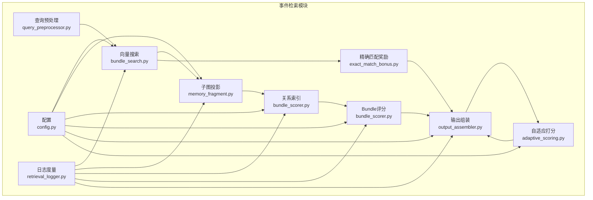
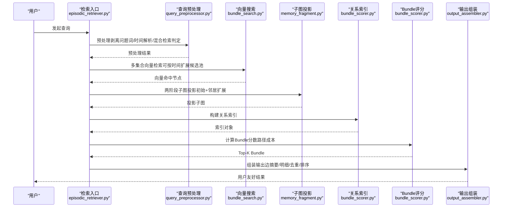
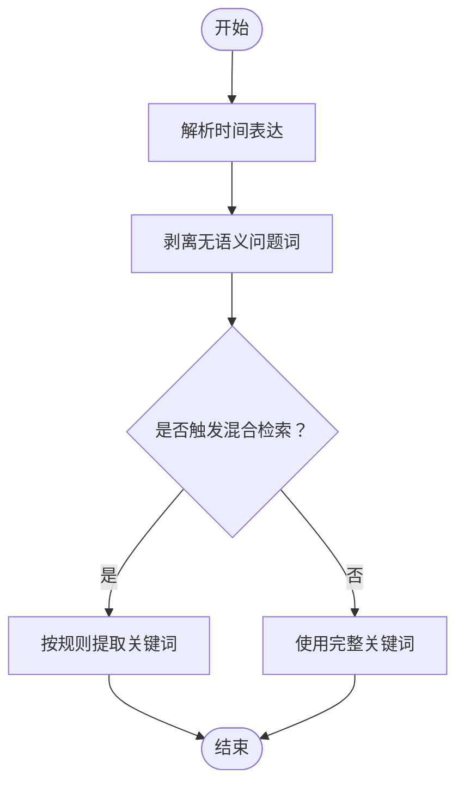
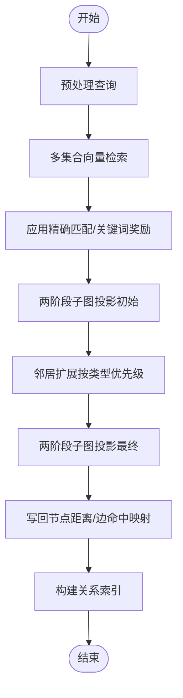
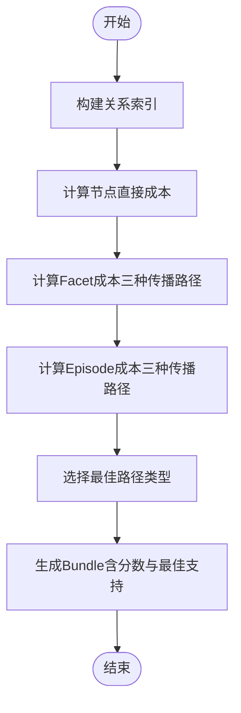
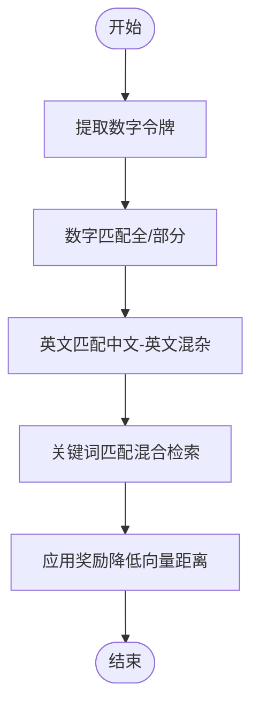
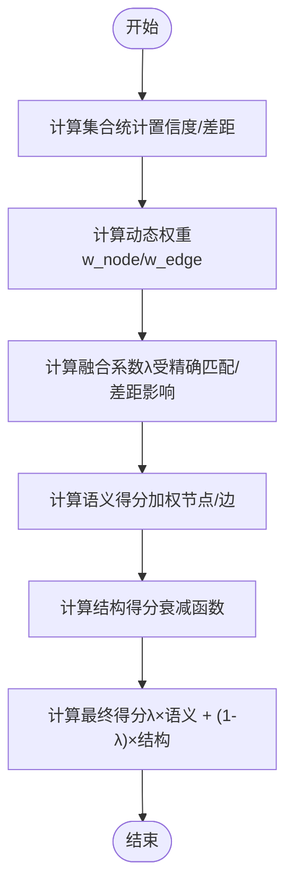
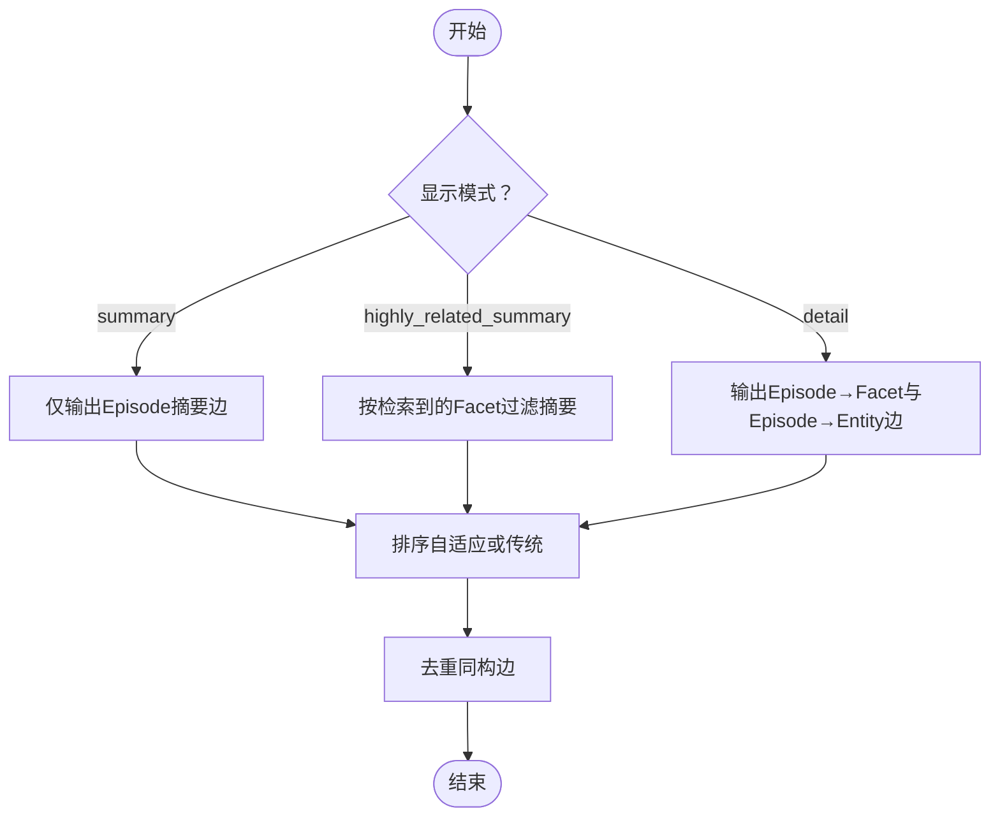
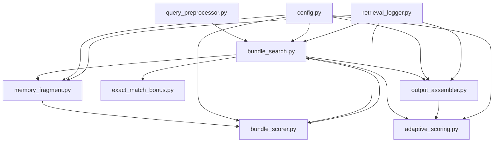

# 事件检索模式

<cite>
**本文引用的文件**
- [m_flow/retrieval/episodic/__init__.py](file://m_flow/retrieval/episodic/__init__.py)
- [m_flow/retrieval/episodic/bundle_search.py](file://m_flow/retrieval/episodic/bundle_search.py)
- [m_flow/retrieval/episodic/query_preprocessor.py](file://m_flow/retrieval/episodic/query_preprocessor.py)
- [m_flow/retrieval/episodic/output_assembler.py](file://m_flow/retrieval/episodic/output_assembler.py)
- [m_flow/retrieval/episodic/config.py](file://m_flow/retrieval/episodic/config.py)
- [m_flow/retrieval/episodic/bundle_scorer.py](file://m_flow/retrieval/episodic/bundle_scorer.py)
- [m_flow/retrieval/episodic/memory_fragment.py](file://m_flow/retrieval/episodic/memory_fragment.py)
- [m_flow/retrieval/episodic/exact_match_bonus.py](file://m_flow/retrieval/episodic/exact_match_bonus.py)
- [m_flow/retrieval/episodic/adaptive_scoring.py](file://m_flow/retrieval/episodic/adaptive_scoring.py)
- [m_flow/retrieval/episodic/retrieval_logger.py](file://m_flow/retrieval/episodic/retrieval_logger.py)
- [m_flow/retrieval/episodic_retriever.py](file://m_flow/retrieval/episodic_retriever.py)
- [m_flow/search/types/RecallMode.py](file://m_flow/search/types/RecallMode.py)
- [m_flow/search/methods/get_recall_mode_tools.py](file://m_flow/search/methods/get_recall_mode_tools.py)
- [examples/test_retrieval_15events.py](file://examples/test_retrieval_15events.py)
- [examples/test_retrieval_fast.py](file://examples/test_retrieval_fast.py)
- [examples/episodic_stage1_smoke_test.py](file://examples/episodic_stage1_smoke_test.py)
- [examples/episodic_stage2_smoke_test.py](file://examples/episodic_stage2_smoke_test.py)
- [examples/episodic_stage3_smoke_test.py](file://examples/episodic_stage3_smoke_test.py)
</cite>

## 目录
1. [简介](#简介)
2. [项目结构](#项目结构)
3. [核心组件](#核心组件)
4. [架构总览](#架构总览)
5. [详细组件分析](#详细组件分析)
6. [依赖分析](#依赖分析)
7. [性能考虑](#性能考虑)
8. [故障排查指南](#故障排查指南)
9. [结论](#结论)
10. [附录](#附录)

## 简介
本文件系统性阐述事件检索模式（Episodic Retrieval）的设计与实现，重点围绕以下目标：
- 解释 Episodic Retrieval 如何从事件记忆中检索相关信息并组织为 Episode 级别结果包（Bundle）
- 详解 Bundle Search 算法：如何将相关的 Facet Points 组织为 Episode 级别结果
- 记录查询预处理流程：查询优化、关键词提取与语义增强
- 说明输出组装器工作机制：如何将检索结果转换为用户友好的格式
- 提供配置选项与参数调优建议
- 给出实际检索示例与性能测试参考

## 项目结构
事件检索模式位于 m_flow/retrieval/episodic 目录，核心模块包括：
- 查询预处理：query_preprocessor.py
- 向量检索与两阶段图投影：bundle_search.py、memory_fragment.py
- 关系索引与 Bundle 评分：bundle_scorer.py
- 精确匹配与关键词奖励：exact_match_bonus.py
- 自适应打分与排序：adaptive_scoring.py
- 输出组装与排序：output_assembler.py
- 配置管理：config.py
- 日志与度量：retrieval_logger.py
- 检索入口与集成：episodic_retriever.py、search/types/RecallMode.py、search/methods/get_recall_mode_tools.py
- 示例与性能测试：examples 下多个 smoke test 与检索测试脚本

图表来源
- [m_flow/retrieval/episodic/bundle_search.py:40-270](file://m_flow/retrieval/episodic/bundle_search.py#L40-L270)
- [m_flow/retrieval/episodic/query_preprocessor.py:97-142](file://m_flow/retrieval/episodic/query_preprocessor.py#L97-L142)
- [m_flow/retrieval/episodic/memory_fragment.py:20-84](file://m_flow/retrieval/episodic/memory_fragment.py#L20-L84)
- [m_flow/retrieval/episodic/bundle_scorer.py:55-301](file://m_flow/retrieval/episodic/bundle_scorer.py#L55-L301)
- [m_flow/retrieval/episodic/exact_match_bonus.py:141-205](file://m_flow/retrieval/episodic/exact_match_bonus.py#L141-L205)
- [m_flow/retrieval/episodic/adaptive_scoring.py:249-442](file://m_flow/retrieval/episodic/adaptive_scoring.py#L249-L442)
- [m_flow/retrieval/episodic/output_assembler.py:30-84](file://m_flow/retrieval/episodic/output_assembler.py#L30-L84)
- [m_flow/retrieval/episodic/config.py:12-276](file://m_flow/retrieval/episodic/config.py#L12-L276)
- [m_flow/retrieval/episodic/retrieval_logger.py:102-534](file://m_flow/retrieval/episodic/retrieval_logger.py#L102-L534)

章节来源
- [m_flow/retrieval/episodic/__init__.py:1-28](file://m_flow/retrieval/episodic/__init__.py#L1-L28)

## 核心组件
- 查询预处理（query_preprocessor.py）：时间表达解析、问题词剥离、混合检索判定、关键词提取
- 向量检索与两阶段图投影（bundle_search.py、memory_fragment.py）：多集合向量检索、候选池扩展、两阶段子图投影
- 关系索引与 Bundle 评分（bundle_scorer.py）：构建 Episode-Facet-Point-Entity 关系索引，计算路径成本与 Bundle 分数
- 精确匹配与关键词奖励（exact_match_bonus.py）：数字/英文/关键词匹配奖励
- 自适应打分与排序（adaptive_scoring.py、output_assembler.py）：基于置信度的权重融合与最终排序
- 输出组装（output_assembler.py）：根据配置输出摘要或明细边，去重与稳定排序
- 配置（config.py）：统一参数与环境变量映射
- 日志（retrieval_logger.py）：步骤级日志与关键指标统计

章节来源
- [m_flow/retrieval/episodic/query_preprocessor.py:97-142](file://m_flow/retrieval/episodic/query_preprocessor.py#L97-L142)
- [m_flow/retrieval/episodic/bundle_search.py:40-270](file://m_flow/retrieval/episodic/bundle_search.py#L40-L270)
- [m_flow/retrieval/episodic/bundle_scorer.py:55-301](file://m_flow/retrieval/episodic/bundle_scorer.py#L55-L301)
- [m_flow/retrieval/episodic/exact_match_bonus.py:141-205](file://m_flow/retrieval/episodic/exact_match_bonus.py#L141-L205)
- [m_flow/retrieval/episodic/adaptive_scoring.py:249-442](file://m_flow/retrieval/episodic/adaptive_scoring.py#L249-L442)
- [m_flow/retrieval/episodic/output_assembler.py:30-84](file://m_flow/retrieval/episodic/output_assembler.py#L30-L84)
- [m_flow/retrieval/episodic/config.py:12-276](file://m_flow/retrieval/episodic/config.py#L12-L276)
- [m_flow/retrieval/episodic/retrieval_logger.py:102-534](file://m_flow/retrieval/episodic/retrieval_logger.py#L102-L534)

## 架构总览
事件检索端到端流程如下：

图表来源
- [m_flow/retrieval/episodic/bundle_search.py:104-265](file://m_flow/retrieval/episodic/bundle_search.py#L104-L265)
- [m_flow/retrieval/episodic/query_preprocessor.py:97-142](file://m_flow/retrieval/episodic/query_preprocessor.py#L97-L142)
- [m_flow/retrieval/episodic/memory_fragment.py:20-84](file://m_flow/retrieval/episodic/memory_fragment.py#L20-L84)
- [m_flow/retrieval/episodic/bundle_scorer.py:144-301](file://m_flow/retrieval/episodic/bundle_scorer.py#L144-L301)
- [m_flow/retrieval/episodic/output_assembler.py:30-84](file://m_flow/retrieval/episodic/output_assembler.py#L30-L84)

## 详细组件分析

### 查询预处理（Query Preprocessing）
职责：
- 时间表达解析与剥离（时间增强）
- 问题词剥离（去除无语义价值的问题词，保留有语义的问题词）
- 混合检索判定（中文-英文混杂、含数字、短查询触发）
- 关键词提取（依据触发原因提取数字/英文/全量关键词）

关键流程：
- 时间解析：若启用时间增强，先解析时间范围并剥离时间片段，避免日期数字污染后续混合检索与奖励
- 问题词处理：剥离无语义问题词，保留“多少/哪些/哪里/何时”等语义问题词
- 混合检索触发：中文-英文混杂、包含数字、核心关键词过短时启用混合检索
- 关键词提取：按触发原因提取数字串、英文单词或全量关键词

图表来源
- [m_flow/retrieval/episodic/query_preprocessor.py:97-142](file://m_flow/retrieval/episodic/query_preprocessor.py#L97-L142)
- [m_flow/retrieval/episodic/query_preprocessor.py:187-234](file://m_flow/retrieval/episodic/query_preprocessor.py#L187-L234)

章节来源
- [m_flow/retrieval/episodic/query_preprocessor.py:97-250](file://m_flow/retrieval/episodic/query_preprocessor.py#L97-L250)

### 向量检索与两阶段图投影（Vector Search & Two-Phase Projection）
职责：
- 多集合向量检索（支持集合级别的候选池扩展）
- 两阶段子图投影：先以命中节点为中心投影，再扩展邻居节点
- 写回节点向量距离、边命中映射、构建关系索引

关键流程：
- 参数校验与配置加载，支持参数覆盖
- 预处理后执行向量检索，按时间增强策略扩大候选池
- 应用精确匹配与关键词奖励
- 两阶段投影：初始投影后按节点类型优先级扩展邻居，限制最大扩展规模
- 将向量距离写回节点属性，映射边命中距离
- 构建关系索引（Episode-Facet-Point-Entity）

图表来源
- [m_flow/retrieval/episodic/bundle_search.py:104-204](file://m_flow/retrieval/episodic/bundle_search.py#L104-L204)
- [m_flow/retrieval/episodic/bundle_search.py:420-564](file://m_flow/retrieval/episodic/bundle_search.py#L420-L564)
- [m_flow/retrieval/episodic/memory_fragment.py:20-84](file://m_flow/retrieval/episodic/memory_fragment.py#L20-L84)

章节来源
- [m_flow/retrieval/episodic/bundle_search.py:40-270](file://m_flow/retrieval/episodic/bundle_search.py#L40-L270)
- [m_flow/retrieval/episodic/memory_fragment.py:20-116](file://m_flow/retrieval/episodic/memory_fragment.py#L20-L116)

### 关系索引与 Bundle 评分（Relationship Index & Bundle Scoring）
职责：
- 构建 Episode-Facet-Point-Entity 关系索引
- 计算 Facet/Entity 的最佳路径成本，确定 Episode 的 Bundle 分数与最佳路径类型

关键流程：
- 构建索引：识别 has_facet、has_point、involves_entity 等关系，建立邻接表
- 计算节点直接成本（Facet/Point/Entity）
- Facet 成本：直接命中、经 FacetPoint 传播、经 Facet→Entity 传播三者取最小
- Episode 成本：直接命中、经 Facet 传播、经 Entity 传播三者取最小，并考虑直连惩罚
- 选择最佳路径类型（direct_episode/facet/point/entity/facet_entity）

图表来源
- [m_flow/retrieval/episodic/bundle_scorer.py:55-301](file://m_flow/retrieval/episodic/bundle_scorer.py#L55-L301)

章节来源
- [m_flow/retrieval/episodic/bundle_scorer.py:20-321](file://m_flow/retrieval/episodic/bundle_scorer.py#L20-L321)

### 精确匹配与关键词奖励（Exact Match Bonus & Keyword Match Bonus）
职责：
- 数字匹配奖励：全量/部分匹配，降低向量距离
- 英文匹配奖励：中文-英文混杂场景下，按匹配英文词数量奖励
- 关键词匹配奖励：混合检索场景下，对命中关键词的节点给予奖励

图表来源
- [m_flow/retrieval/episodic/exact_match_bonus.py:141-205](file://m_flow/retrieval/episodic/exact_match_bonus.py#L141-L205)

章节来源
- [m_flow/retrieval/episodic/exact_match_bonus.py:18-205](file://m_flow/retrieval/episodic/exact_match_bonus.py#L18-L205)

### 自适应打分与排序（Adaptive Scoring & Sorting）
职责：
- 基于集合置信度动态调整语义与结构信号权重
- 计算融合系数 λ，结合结构得分（衰减函数）与语义得分（加权节点/边得分）
- 输出阶段采用传统排序或自适应排序，支持时间增强与去重

关键流程：
- 计算集合置信度（f_dist、f_gap）
- 动态权重（w_node、w_edge）与最佳差距（best_gap）
- 计算 λ（受精确匹配与差距影响），计算最终得分
- 输出阶段排序：Episode 排名优先、节点成本、边向量成本、边类型优先级、时间增强

图表来源
- [m_flow/retrieval/episodic/adaptive_scoring.py:249-442](file://m_flow/retrieval/episodic/adaptive_scoring.py#L249-L442)
- [m_flow/retrieval/episodic/output_assembler.py:506-722](file://m_flow/retrieval/episodic/output_assembler.py#L506-L722)

章节来源
- [m_flow/retrieval/episodic/adaptive_scoring.py:26-503](file://m_flow/retrieval/episodic/adaptive_scoring.py#L26-L503)
- [m_flow/retrieval/episodic/output_assembler.py:506-800](file://m_flow/retrieval/episodic/output_assembler.py#L506-L800)

### 输出组装器（Output Assembler）
职责：
- 根据配置输出模式（摘要/明细/高度相关摘要）组装边
- 去重与稳定排序：基于边关系、节点成本、边向量成本、时间增强、边类型优先级
- 控制每 Episode 的 Facet/Point 数量上限

图表来源
- [m_flow/retrieval/episodic/output_assembler.py:30-84](file://m_flow/retrieval/episodic/output_assembler.py#L30-L84)
- [m_flow/retrieval/episodic/output_assembler.py:299-395](file://m_flow/retrieval/episodic/output_assembler.py#L299-L395)

章节来源
- [m_flow/retrieval/episodic/output_assembler.py:30-852](file://m_flow/retrieval/episodic/output_assembler.py#L30-L852)

### 配置与参数（EpisodicConfig）
职责：
- 统一管理检索参数、显示模式、集合列表、属性投影、时间增强、自适应打分、混合检索等
- 支持环境变量覆盖

关键参数类别：
- 检索参数：top_k、wide_search_top_k、max_relevant_ids、triplet_distance_penalty
- 路径成本：edge_miss_cost、hop_cost、direct_episode_penalty
- 输出控制：max_facets_per_episode、max_points_per_facet、display_mode
- 集合与属性：collections、properties_to_project
- 混合检索：enable_hybrid_search、hybrid_threshold
- 奖励：full_number_match_bonus、partial_number_match_bonus、english_match_bonus、keyword_match_bonus
- 自适应打分：enable_adaptive_weights、collection_baselines、ratio_*、gap_*、weight_clip_*、lambda_*、struct_decay_factor、enable_consistency_bonus
- 时间增强：enable_time_bonus、time_*、time_wide_multiplier、time_wide_cap、time_debug_mode
- 不匹配惩罚：enable_mismatch_penalty、mismatch_*（可选）

章节来源
- [m_flow/retrieval/episodic/config.py:12-276](file://m_flow/retrieval/episodic/config.py#L12-L276)

### 日志与度量（RetrievalLogger）
职责：
- 记录每个阶段的输入/输出、触发条件、性能指标（耗时、命中数、唯一ID、Bundle数量、输出边数）
- 支持 INFO/DEBUG/WARNING 等级别日志
- 提供检索摘要报告

章节来源
- [m_flow/retrieval/episodic/retrieval_logger.py:102-584](file://m_flow/retrieval/episodic/retrieval_logger.py#L102-L584)

### 检索入口与集成
- 检索器：EpisodicRetriever（继承基础图检索器，提供上下文与补全接口）
- 回溯模式：RecallMode.EPISODIC（用于检索工具注册与调用）
- 工具注册：get_recall_mode_tools 将 EPISODIC 映射为检索工具

章节来源
- [m_flow/retrieval/episodic_retriever.py](file://m_flow/retrieval/episodic_retriever.py)
- [m_flow/search/types/RecallMode.py](file://m_flow/search/types/RecallMode.py)
- [m_flow/search/methods/get_recall_mode_tools.py](file://m_flow/search/methods/get_recall_mode_tools.py)

## 依赖分析
事件检索各模块之间的依赖关系如下：

图表来源
- [m_flow/retrieval/episodic/bundle_search.py:20-35](file://m_flow/retrieval/episodic/bundle_search.py#L20-L35)
- [m_flow/retrieval/episodic/bundle_scorer.py:14-17](file://m_flow/retrieval/episodic/bundle_scorer.py#L14-L17)
- [m_flow/retrieval/episodic/output_assembler.py:14-25](file://m_flow/retrieval/episodic/output_assembler.py#L14-L25)
- [m_flow/retrieval/episodic/adaptive_scoring.py:13-25](file://m_flow/retrieval/episodic/adaptive_scoring.py#L13-L25)
- [m_flow/retrieval/episodic/exact_match_bonus.py:14-15](file://m_flow/retrieval/episodic/exact_match_bonus.py#L14-L15)
- [m_flow/retrieval/episodic/config.py:12-276](file://m_flow/retrieval/episodic/config.py#L12-L276)
- [m_flow/retrieval/episodic/retrieval_logger.py:23-28](file://m_flow/retrieval/episodic/retrieval_logger.py#L23-L28)

章节来源
- [m_flow/retrieval/episodic/bundle_search.py:20-35](file://m_flow/retrieval/episodic/bundle_search.py#L20-L35)
- [m_flow/retrieval/episodic/bundle_scorer.py:14-17](file://m_flow/retrieval/episodic/bundle_scorer.py#L14-L17)
- [m_flow/retrieval/episodic/output_assembler.py:14-25](file://m_flow/retrieval/episodic/output_assembler.py#L14-L25)
- [m_flow/retrieval/episodic/adaptive_scoring.py:13-25](file://m_flow/retrieval/episodic/adaptive_scoring.py#L13-L25)
- [m_flow/retrieval/episodic/exact_match_bonus.py:14-15](file://m_flow/retrieval/episodic/exact_match_bonus.py#L14-L15)
- [m_flow/retrieval/episodic/config.py:12-276](file://m_flow/retrieval/episodic/config.py#L12-L276)
- [m_flow/retrieval/episodic/retrieval_logger.py:23-28](file://m_flow/retrieval/episodic/retrieval_logger.py#L23-L28)

## 性能考虑
- 候选池控制：wide_search_top_k 与 max_relevant_ids 控制向量检索规模，避免过度投影
- 两阶段投影：先初始投影再邻居扩展，限制扩展规模，平衡召回与性能
- 自适应打分：在高置信度场景下更信任语义信号，在低置信度场景下更依赖结构信号，减少无效排序开销
- 时间增强：当查询包含时间时扩大候选池，但需配合 cap 与 multiplier 控制成本
- 输出裁剪：max_facets_per_episode、max_points_per_facet 限制每 Episode 的输出规模
- 日志与度量：通过 RetrievalLogger 记录关键指标，便于定位瓶颈

## 故障排查指南
常见问题与定位建议：
- 向量检索无命中：检查 collections 配置、wide_search_top_k、strict_nodeset_filtering
- 子图为空：确认 memory_fragment 投影参数、节点集名称、属性投影列表
- Bundle 为空：检查关系索引构建、Facet/Entity 传播路径、edge_hit_map 映射
- 排序异常：检查 display_mode、自适应开关、时间增强开关、去重逻辑
- 日志分析：通过 RetrievalLogger 的摘要报告定位耗时最长的阶段与触发条件

章节来源
- [m_flow/retrieval/episodic/retrieval_logger.py:512-569](file://m_flow/retrieval/episodic/retrieval_logger.py#L512-L569)

## 结论
事件检索模式通过“查询预处理—向量检索—两阶段投影—关系索引—Bundle评分—输出组装”的流水线，实现了从事件记忆中高效、可控地检索与组织信息。其核心优势在于：
- 明确的路径成本模型与多传播路径聚合
- 自适应权重融合，兼顾语义与结构信号
- 可配置的输出模式与严格的规模控制
- 完备的日志与度量体系，便于性能优化与问题定位

## 附录

### 实际检索示例
- 全面检索测试（15个事件）：覆盖技术、销售、财务、HR、战略、运营、安全、行政等主题，验证关键词匹配与成功率
- 快速检索测试（不调用 LLM）：直接使用 triplet 搜索，统计耗时与命中率

章节来源
- [examples/test_retrieval_15events.py:1-180](file://examples/test_retrieval_15events.py#L1-L180)
- [examples/test_retrieval_fast.py:1-129](file://examples/test_retrieval_fast.py#L1-L129)

### 阶段性验证示例
- Stage 1：验证 Episode/Facet/Entity 图结构抽取与边属性完整性
- Stage 2：验证 write_episodic_memories 生成 Episode、Facet 与富语义边
- Stage 3：验证 episodic_triplet_search 评分函数、文本注入与 RecallMode 集成

章节来源
- [examples/episodic_stage1_smoke_test.py:1-211](file://examples/episodic_stage1_smoke_test.py#L1-L211)
- [examples/episodic_stage2_smoke_test.py:1-210](file://examples/episodic_stage2_smoke_test.py#L1-L210)
- [examples/episodic_stage3_smoke_test.py:1-283](file://examples/episodic_stage3_smoke_test.py#L1-L283)