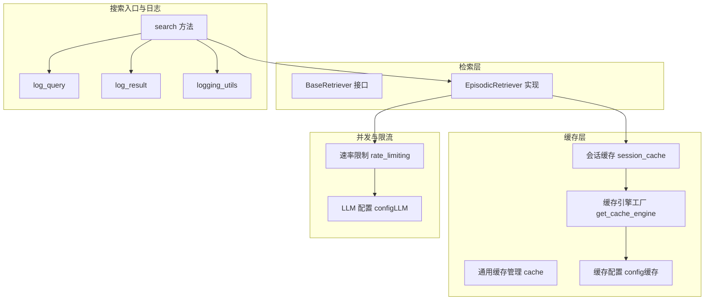
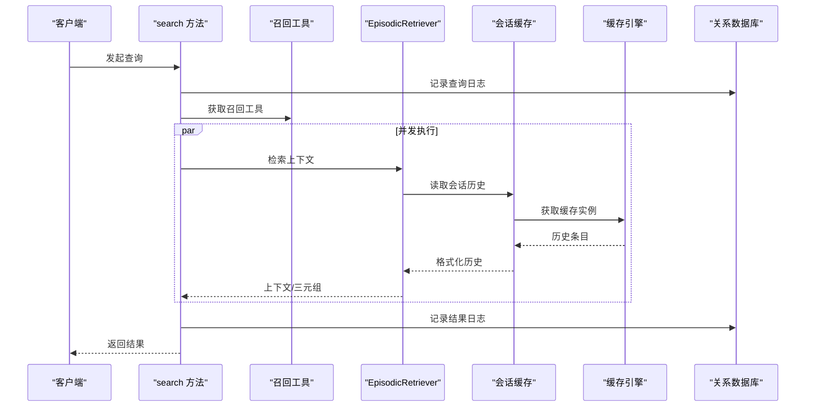
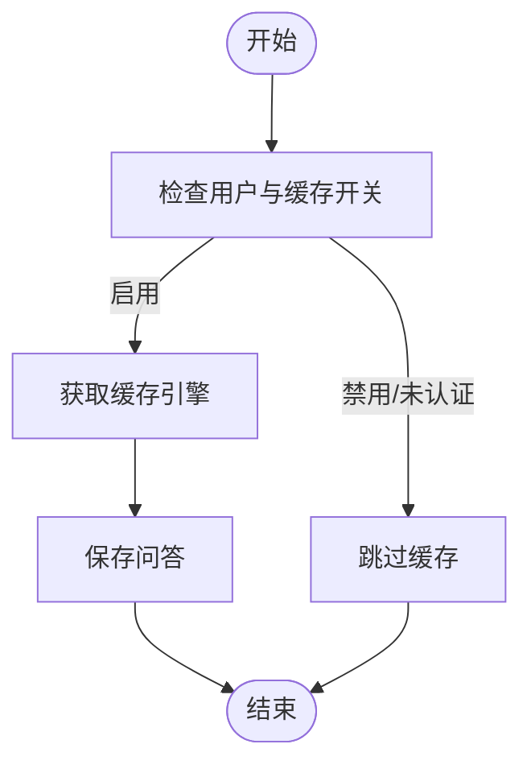
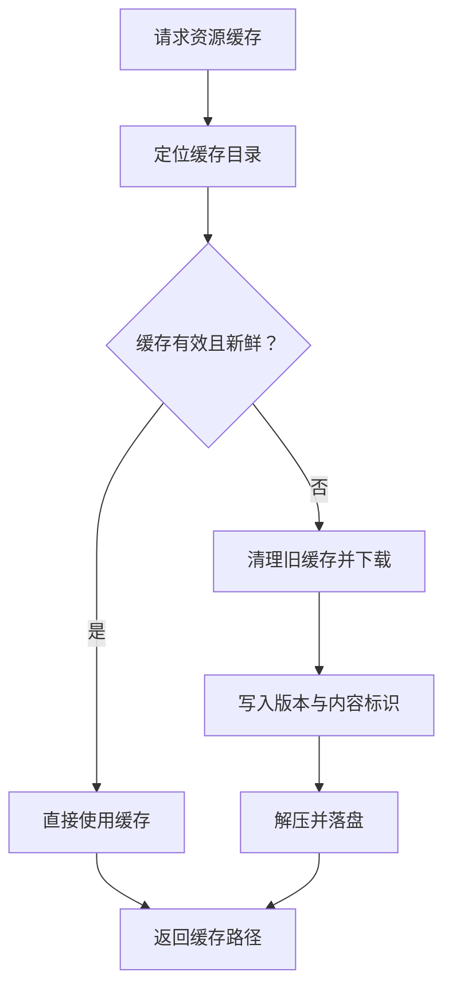
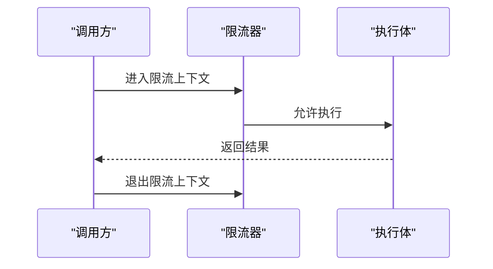
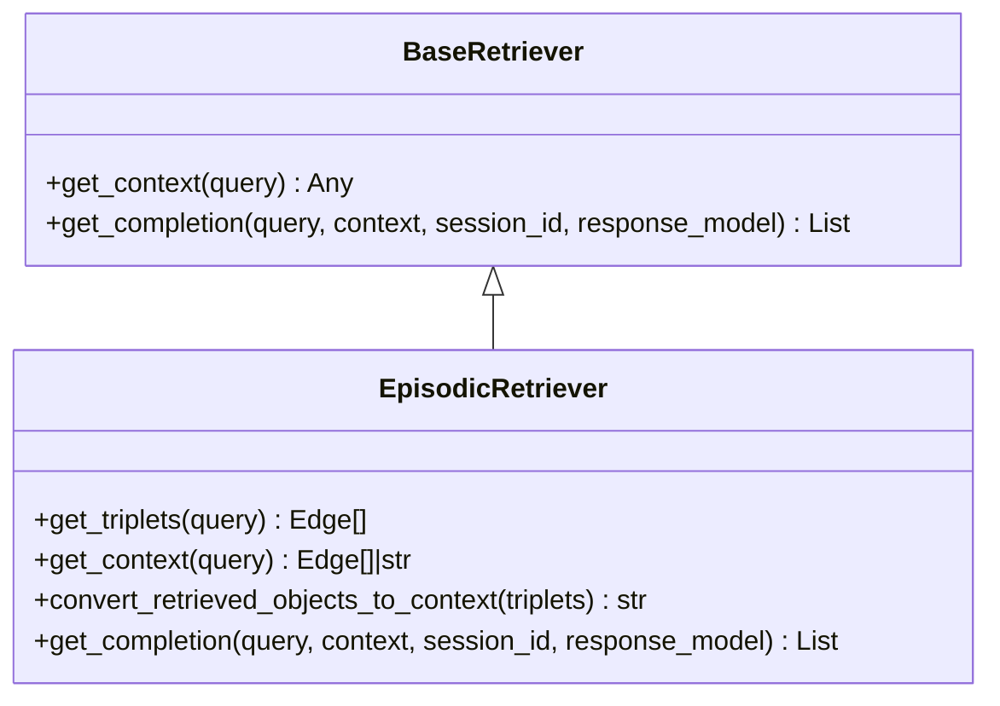
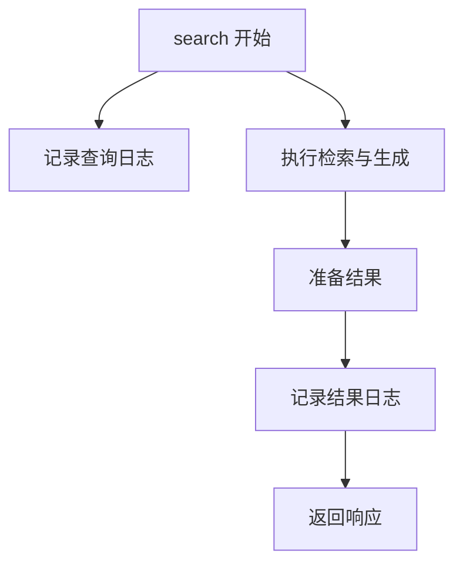
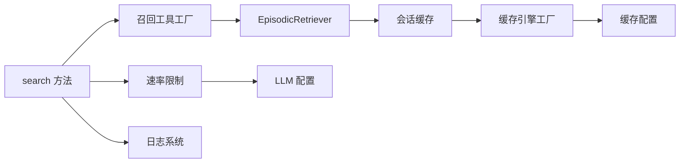

# 检索性能优化

<cite>
**本文引用的文件**
- [session_cache.py](file://m_flow/retrieval/utils/session_cache.py)
- [cache.py](file://m_flow/shared/cache.py)
- [rate_limiting.py](file://m_flow/shared/rate_limiting.py)
- [log_query.py](file://m_flow/search/operations/log_query.py)
- [log_result.py](file://m_flow/search/operations/log_result.py)
- [base_retriever.py](file://m_flow/retrieval/base_retriever.py)
- [episodic_retriever.py](file://m_flow/retrieval/episodic_retriever.py)
- [config.py（缓存）](file://m_flow/adapters/cache/config.py)
- [get_cache_engine.py](file://m_flow/adapters/cache/get_cache_engine.py)
- [search.py](file://m_flow/search/methods/search.py)
- [logging_utils.py](file://m_flow/shared/logging_utils.py)
- [config.py（LLM）](file://m_flow/llm/config.py)
- [get_settings.py](file://m_flow/config/settings/get_settings.py)
</cite>

## 目录
1. [简介](#简介)
2. [项目结构](#项目结构)
3. [核心组件](#核心组件)
4. [架构总览](#架构总览)
5. [详细组件分析](#详细组件分析)
6. [依赖分析](#依赖分析)
7. [性能考量](#性能考量)
8. [故障排查指南](#故障排查指南)
9. [结论](#结论)
10. [附录](#附录)

## 简介
本文件聚焦于检索系统的性能优化，围绕索引优化、查询优化与缓存策略展开，系统性说明会话缓存机制、速率限制与并发控制、检索日志体系、参数配置与调优建议，并结合现有代码实现给出可操作的最佳实践。

## 项目结构
检索子系统由“检索器接口”“具体检索实现”“会话缓存层”“通用缓存管理”“速率限制与并发控制”“搜索入口与日志”等模块组成，形成从查询到上下文生成再到结果返回的完整链路。

**图示来源**
- [episodic_retriever.py:130-316](file://m_flow/retrieval/episodic_retriever.py#L130-L316)
- [session_cache.py:45-156](file://m_flow/retrieval/utils/session_cache.py#L45-L156)
- [get_cache_engine.py:68-79](file://m_flow/adapters/cache/get_cache_engine.py#L68-L79)
- [config.py（缓存）:25-89](file://m_flow/adapters/cache/config.py#L25-L89)
- [rate_limiting.py:23-58](file://m_flow/shared/rate_limiting.py#L23-L58)
- [config.py（LLM）:38-93](file://m_flow/llm/config.py#L38-L93)
- [search.py:55-211](file://m_flow/search/methods/search.py#L55-L211)
- [log_query.py:12-21](file://m_flow/search/operations/log_query.py#L12-L21)
- [log_result.py:12-19](file://m_flow/search/operations/log_result.py#L12-L19)
- [logging_utils.py:340-520](file://m_flow/shared/logging_utils.py#L340-L520)

**章节来源**
- [episodic_retriever.py:130-316](file://m_flow/retrieval/episodic_retriever.py#L130-L316)
- [session_cache.py:45-156](file://m_flow/retrieval/utils/session_cache.py#L45-L156)
- [get_cache_engine.py:68-79](file://m_flow/adapters/cache/get_cache_engine.py#L68-L79)
- [config.py（缓存）:25-89](file://m_flow/adapters/cache/config.py#L25-L89)
- [rate_limiting.py:23-58](file://m_flow/shared/rate_limiting.py#L23-L58)
- [config.py（LLM）:38-93](file://m_flow/llm/config.py#L38-L93)
- [search.py:55-211](file://m_flow/search/methods/search.py#L55-L211)
- [log_query.py:12-21](file://m_flow/search/operations/log_query.py#L12-L21)
- [log_result.py:12-19](file://m_flow/search/operations/log_result.py#L12-L19)
- [logging_utils.py:340-520](file://m_flow/shared/logging_utils.py#L340-L520)

## 核心组件
- 检索器接口与实现：定义统一的上下文检索与完成生成接口；EpisodicRetriever基于捆绑搜索与显示模式过滤，支持摘要/详情两种输出路径。
- 会话缓存：为每次问答持久化历史，支持按用户与会话维度读取与格式化，提升后续查询的上下文连续性与性能。
- 通用缓存：抽象存储后端（本地/云），提供下载解压、版本校验、新鲜度检查等能力，支撑大模型权重、教程数据等资源缓存。
- 速率限制与并发：通过异步限流器对 LLM/Embedding 调用进行节流，支持按配置动态启用/禁用。
- 搜索入口与日志：集中处理权限校验、并发执行、结果格式化、查询与结果入库，配合日志系统进行可观测性与问题定位。

**章节来源**
- [base_retriever.py:11-61](file://m_flow/retrieval/base_retriever.py#L11-L61)
- [episodic_retriever.py:130-316](file://m_flow/retrieval/episodic_retriever.py#L130-L316)
- [session_cache.py:45-156](file://m_flow/retrieval/utils/session_cache.py#L45-L156)
- [cache.py:39-367](file://m_flow/shared/cache.py#L39-L367)
- [rate_limiting.py:23-58](file://m_flow/shared/rate_limiting.py#L23-L58)
- [search.py:55-211](file://m_flow/search/methods/search.py#L55-L211)

## 架构总览
检索流程从搜索入口开始，根据访问控制模式选择授权或非授权路径，随后并发执行多数据集检索，最终合并上下文并生成回答。期间可选地注入会话历史，同时受速率限制与缓存策略影响。

**图示来源**
- [search.py:139-211](file://m_flow/search/methods/search.py#L139-L211)
- [episodic_retriever.py:251-316](file://m_flow/retrieval/episodic_retriever.py#L251-L316)
- [session_cache.py:110-156](file://m_flow/retrieval/utils/session_cache.py#L110-L156)
- [log_query.py:12-21](file://m_flow/search/operations/log_query.py#L12-L21)
- [log_result.py:12-19](file://m_flow/search/operations/log_result.py#L12-L19)

## 详细组件分析

### 会话缓存机制
- 功能要点
  - 保存问答：在生成回答前，若启用缓存且已认证，将本次问答写入缓存。
  - 读取历史：在生成回答时，按用户与会话维度读取历史，格式化为带时间戳的文本，注入到提示词中以增强上下文连贯性。
  - 容错与降级：当缓存不可用或连接异常时，记录日志并静默失败，不影响主流程。
- 关键路径
  - 保存：[save_conversation_history:45-96](file://m_flow/retrieval/utils/session_cache.py#L45-L96)
  - 读取：[get_conversation_history:110-156](file://m_flow/retrieval/utils/session_cache.py#L110-L156)
  - 引擎获取：[get_cache_engine:68-79](file://m_flow/adapters/cache/get_cache_engine.py#L68-L79)
  - 配置开关：[CacheConfig.caching](file://m_flow/adapters/cache/config.py#L50)

**图示来源**
- [session_cache.py:45-96](file://m_flow/retrieval/utils/session_cache.py#L45-L96)
- [get_cache_engine.py:68-79](file://m_flow/adapters/cache/get_cache_engine.py#L68-L79)
- [config.py（缓存）](file://m_flow/adapters/cache/config.py#L50)

**章节来源**
- [session_cache.py:45-156](file://m_flow/retrieval/utils/session_cache.py#L45-L156)
- [get_cache_engine.py:68-79](file://m_flow/adapters/cache/get_cache_engine.py#L68-L79)
- [config.py（缓存）:25-89](file://m_flow/adapters/cache/config.py#L25-L89)

### 通用缓存与资源缓存
- 通用缓存（StorageAwareCache）
  - 支持本地与 S3 等存储后端，提供目录管理、文件存在性检查、列表与读取等能力。
  - 提供下载与解压 ZIP 的高级功能，包含版本标识与内容标识（ETag/Last-Modified）的新鲜度校验。
- 资源缓存场景
  - 通过短哈希生成缓存键，避免重复下载；在缓存有效且内容未更新时直接复用。
- 关键路径
  - 下载解压：[download_and_extract_zip:187-271](file://m_flow/shared/cache.py#L187-L271)
  - 版本与新鲜度：[download_and_extract_zip 内部逻辑:140-178](file://m_flow/shared/cache.py#L140-L178)
  - 文件操作封装：[file_exists/read_file/list_files:273-301](file://m_flow/shared/cache.py#L273-L301)

**图示来源**
- [cache.py:187-271](file://m_flow/shared/cache.py#L187-L271)
- [cache.py:140-178](file://m_flow/shared/cache.py#L140-L178)

**章节来源**
- [cache.py:39-367](file://m_flow/shared/cache.py#L39-L367)

### 速率限制与并发控制
- 速率限制
  - 使用异步限流器对 LLM 与 Embedding 请求进行配额控制，支持按配置启停。
  - 提供上下文管理器包装，便于在调用点透明启用/禁用。
- 并发控制
  - 搜索入口对多数据集检索采用并发执行，显著降低端到端延迟。
- 关键路径
  - 限流器初始化与上下文：[rate_limiting:23-58](file://m_flow/shared/rate_limiting.py#L23-L58)
  - 搜索并发执行：[search 并发 gather](file://m_flow/search/methods/search.py#L510)
  - LLM 配置项：[LLMConfig:75-83](file://m_flow/llm/config.py#L75-L83)

**图示来源**
- [rate_limiting.py:23-58](file://m_flow/shared/rate_limiting.py#L23-L58)
- [search.py](file://m_flow/search/methods/search.py#L510)

**章节来源**
- [rate_limiting.py:23-58](file://m_flow/shared/rate_limiting.py#L23-L58)
- [search.py](file://m_flow/search/methods/search.py#L510)
- [config.py（LLM）:75-83](file://m_flow/llm/config.py#L75-L83)

### 检索器与上下文生成
- 接口设计
  - 统一的 get_context 与 get_completion 接口，便于替换不同检索策略。
- EpisodicRetriever
  - 两阶段组装：先获取三元组，再按显示模式（摘要/详情）生成上下文。
  - 在摘要模式下去重 Episode 摘要，减少冗余；在详情模式下保留边信息用于可视化。
  - 可选注入会话历史，提升回答一致性。
- 关键路径
  - 上下文生成：[get_context/convert_retrieved_objects_to_context:183-250](file://m_flow/retrieval/episodic_retriever.py#L183-L250)
  - 回答生成与会话缓存：[get_completion:251-316](file://m_flow/retrieval/episodic_retriever.py#L251-L316)
  - 接口规范：[BaseRetriever:11-61](file://m_flow/retrieval/base_retriever.py#L11-L61)

**图示来源**
- [base_retriever.py:11-61](file://m_flow/retrieval/base_retriever.py#L11-L61)
- [episodic_retriever.py:130-316](file://m_flow/retrieval/episodic_retriever.py#L130-L316)

**章节来源**
- [base_retriever.py:11-61](file://m_flow/retrieval/base_retriever.py#L11-L61)
- [episodic_retriever.py:130-316](file://m_flow/retrieval/episodic_retriever.py#L130-L316)

### 检索日志系统
- 查询日志：将查询文本、类型与用户 ID 写入关系数据库，便于审计与统计。
- 结果日志：序列化搜索结果并写入数据库，支持调试与回放。
- 日志系统：集中化日志初始化、文件轮转、第三方噪声抑制与结构化输出。
- 关键路径
  - 记录查询：[log_query:12-21](file://m_flow/search/operations/log_query.py#L12-L21)
  - 记录结果：[log_result:12-19](file://m_flow/search/operations/log_result.py#L12-L19)
  - 日志初始化与轮转：[logging_utils.setup_logging:340-520](file://m_flow/shared/logging_utils.py#L340-L520)

**图示来源**
- [search.py:139-211](file://m_flow/search/methods/search.py#L139-L211)
- [log_query.py:12-21](file://m_flow/search/operations/log_query.py#L12-L21)
- [log_result.py:12-19](file://m_flow/search/operations/log_result.py#L12-L19)
- [logging_utils.py:340-520](file://m_flow/shared/logging_utils.py#L340-L520)

**章节来源**
- [log_query.py:12-21](file://m_flow/search/operations/log_query.py#L12-L21)
- [log_result.py:12-19](file://m_flow/search/operations/log_result.py#L12-L19)
- [logging_utils.py:340-520](file://m_flow/shared/logging_utils.py#L340-L520)

## 依赖分析
- 模块耦合
  - 搜索入口与检索器松耦合，通过工具工厂获取具体实现，便于扩展与替换。
  - 会话缓存与缓存引擎解耦，通过工厂按配置选择后端（Redis/FS）。
  - 速率限制与 LLM 配置解耦，通过配置中心统一读取。
- 外部依赖
  - 存储后端（本地/S3）、缓存后端（Redis/FS）、关系数据库、LLM 提供商等均通过适配器与配置驱动。

**图示来源**
- [search.py:55-211](file://m_flow/search/methods/search.py#L55-L211)
- [episodic_retriever.py:130-316](file://m_flow/retrieval/episodic_retriever.py#L130-L316)
- [session_cache.py:45-156](file://m_flow/retrieval/utils/session_cache.py#L45-L156)
- [get_cache_engine.py:68-79](file://m_flow/adapters/cache/get_cache_engine.py#L68-L79)
- [config.py（缓存）:25-89](file://m_flow/adapters/cache/config.py#L25-L89)
- [rate_limiting.py:23-58](file://m_flow/shared/rate_limiting.py#L23-L58)
- [config.py（LLM）:38-93](file://m_flow/llm/config.py#L38-L93)
- [logging_utils.py:340-520](file://m_flow/shared/logging_utils.py#L340-L520)

**章节来源**
- [search.py:55-211](file://m_flow/search/methods/search.py#L55-L211)
- [episodic_retriever.py:130-316](file://m_flow/retrieval/episodic_retriever.py#L130-L316)
- [session_cache.py:45-156](file://m_flow/retrieval/utils/session_cache.py#L45-L156)
- [get_cache_engine.py:68-79](file://m_flow/adapters/cache/get_cache_engine.py#L68-L79)
- [config.py（缓存）:25-89](file://m_flow/adapters/cache/config.py#L25-L89)
- [rate_limiting.py:23-58](file://m_flow/shared/rate_limiting.py#L23-L58)
- [config.py（LLM）:38-93](file://m_flow/llm/config.py#L38-L93)
- [logging_utils.py:340-520](file://m_flow/shared/logging_utils.py#L340-L520)

## 性能考量
- 索引优化
  - 向量/图混合召回：EpisodicRetriever 支持混合检索与路径成本传播，有助于在大规模图上快速收敛。
  - 显示模式过滤：摘要模式减少上下文长度，降低 LLM 输入开销；详情模式用于需要可视化与丰富上下文的场景。
- 查询优化
  - 并发检索：多数据集检索并发执行，显著缩短端到端时延。
  - 去重与摘要：对 Episode 摘要去重，避免重复信息进入 LLM。
- 缓存策略
  - 会话缓存：将问答历史持久化，减少重复构建上下文的成本。
  - 资源缓存：对 ZIP 资源进行版本与新鲜度校验，避免重复下载。
  - 速率限制：在高并发场景下保护外部服务，避免被限流或熔断。
- 并发与负载
  - 搜索入口并发执行多个数据集任务，合理设置 top_k 与宽召回参数，避免过度扫描。
  - 通过速率限制器平滑突发流量，结合 LLM 配置中的请求配额与间隔，平衡吞吐与稳定性。

[本节为通用性能讨论，无需列出具体文件来源]

## 故障排查指南
- 缓存不可用
  - 现象：会话历史读取为空、保存失败。
  - 排查：确认缓存开关与后端配置，检查缓存引擎初始化与连接状态。
  - 参考路径：[session_cache:66-96](file://m_flow/retrieval/utils/session_cache.py#L66-L96)、[get_cache_engine:68-79](file://m_flow/adapters/cache/get_cache_engine.py#L68-L79)、[CacheConfig](file://m_flow/adapters/cache/config.py#L50)
- 查询/结果未落库
  - 现象：无法审计或回溯查询。
  - 排查：确认日志记录函数是否被调用，数据库连接是否正常。
  - 参考路径：[log_query:12-21](file://m_flow/search/operations/log_query.py#L12-L21)、[log_result:12-19](file://m_flow/search/operations/log_result.py#L12-L19)
- 日志过多或噪音
  - 现象：日志文件过大或第三方库噪声干扰。
  - 排查：调整日志级别与轮转策略，启用噪声抑制。
  - 参考路径：[logging_utils:340-520](file://m_flow/shared/logging_utils.py#L340-L520)
- LLM 调用受限
  - 现象：频繁触发限流或超时。
  - 排查：检查 LLM 配置中的速率限制开关与数值，适当降低并发或增大间隔。
  - 参考路径：[rate_limiting:23-58](file://m_flow/shared/rate_limiting.py#L23-L58)、[LLMConfig:75-83](file://m_flow/llm/config.py#L75-L83)

**章节来源**
- [session_cache.py:66-96](file://m_flow/retrieval/utils/session_cache.py#L66-L96)
- [get_cache_engine.py:68-79](file://m_flow/adapters/cache/get_cache_engine.py#L68-L79)
- [config.py（缓存）](file://m_flow/adapters/cache/config.py#L50)
- [log_query.py:12-21](file://m_flow/search/operations/log_query.py#L12-L21)
- [log_result.py:12-19](file://m_flow/search/operations/log_result.py#L12-L19)
- [logging_utils.py:340-520](file://m_flow/shared/logging_utils.py#L340-L520)
- [rate_limiting.py:23-58](file://m_flow/shared/rate_limiting.py#L23-L58)
- [config.py（LLM）:75-83](file://m_flow/llm/config.py#L75-L83)

## 结论
通过“检索器接口抽象 + Episodic 检索 + 会话缓存 + 通用缓存 + 速率限制 + 并发执行 + 日志体系”的组合，系统在保证检索质量的同时，实现了良好的性能与可观测性。建议在生产环境中启用缓存与速率限制，合理设置并发与召回参数，并持续监控日志与指标以指导进一步优化。

[本节为总结性内容，无需列出具体文件来源]

## 附录

### 参数配置指南（环境变量与配置项）
- 缓存配置（缓存后端与开关）
  - cache_backend：后端类型（redis 或 fs）
  - caching：全局开关
  - cache_host/port/username/password：Redis 连接参数
  - agentic_lock_expire/timeout：分布式锁超时与过期
  - 参考路径：[CacheConfig:25-89](file://m_flow/adapters/cache/config.py#L25-L89)
- 缓存引擎工厂
  - 依据配置创建缓存引擎实例，支持 Redis 与文件系统后端
  - 参考路径：[get_cache_engine:68-79](file://m_flow/adapters/cache/get_cache_engine.py#L68-L79)
- 通用缓存管理
  - cache_root_directory：缓存根目录
  - 参考路径：[StorageAwareCache 初始化:57-67](file://m_flow/shared/cache.py#L57-L67)
- 速率限制与 LLM 配置
  - llm_rate_limit_enabled/requests/interval
  - embedding_rate_limit_enabled/requests/interval
  - 参考路径：[LLMConfig:75-83](file://m_flow/llm/config.py#L75-L83)
- 搜索入口参数
  - top_k、wide_search_top_k、display_mode、collections 等
  - 参考路径：[search:55-211](file://m_flow/search/methods/search.py#L55-L211)
- 设置页面导出
  - 提供 LLM 与向量数据库配置的 UI 导出结构
  - 参考路径：[get_settings:123-151](file://m_flow/config/settings/get_settings.py#L123-L151)

**章节来源**
- [config.py（缓存）:25-89](file://m_flow/adapters/cache/config.py#L25-L89)
- [get_cache_engine.py:68-79](file://m_flow/adapters/cache/get_cache_engine.py#L68-L79)
- [cache.py:57-67](file://m_flow/shared/cache.py#L57-L67)
- [config.py（LLM）:75-83](file://m_flow/llm/config.py#L75-L83)
- [search.py:55-211](file://m_flow/search/methods/search.py#L55-L211)
- [get_settings.py:123-151](file://m_flow/config/settings/get_settings.py#L123-L151)