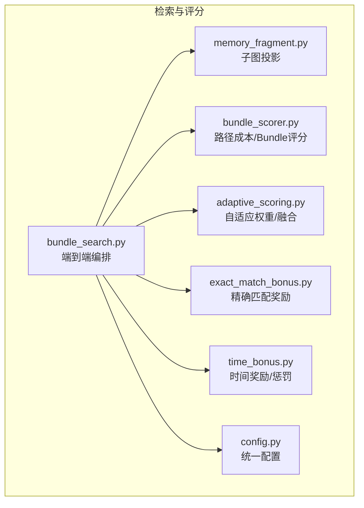
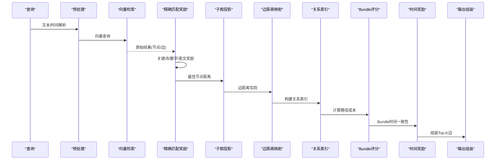
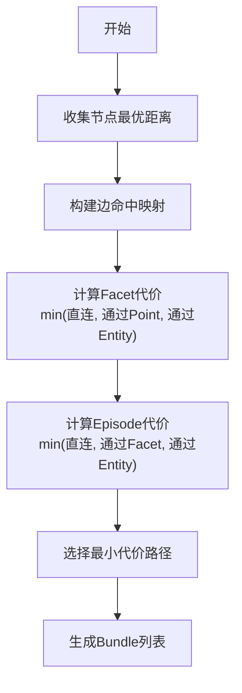
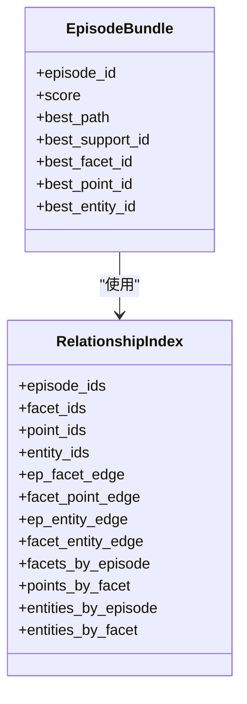
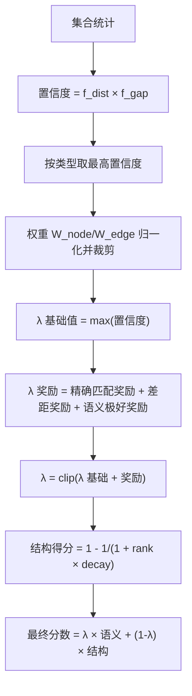
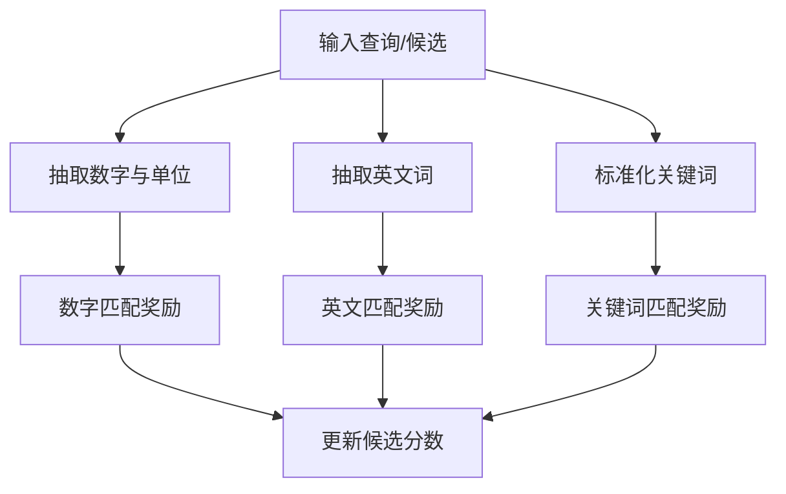
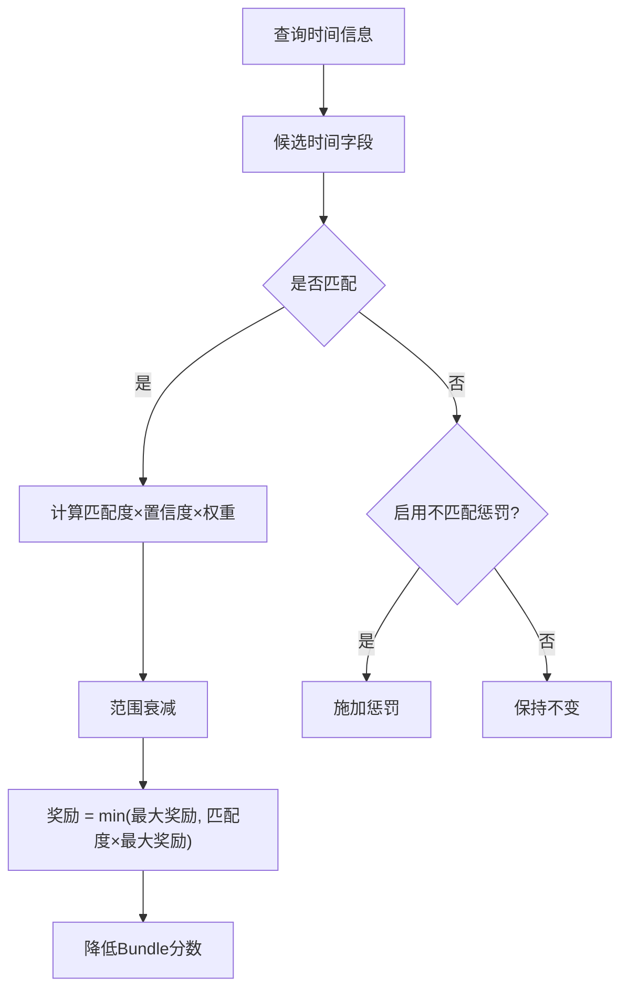
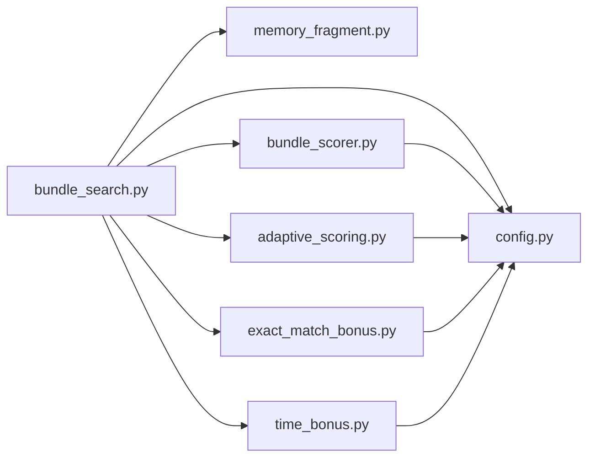

# 检索算法和评分机制

<cite>
**本文引用的文件**
- [bundle_scorer.py](file://m_flow/retrieval/episodic/bundle_scorer.py)
- [adaptive_scoring.py](file://m_flow/retrieval/episodic/adaptive_scoring.py)
- [exact_match_bonus.py](file://m_flow/retrieval/episodic/exact_match_bonus.py)
- [time_bonus.py](file://m_flow/retrieval/time/time_bonus.py)
- [config.py](file://m_flow/retrieval/episodic/config.py)
- [memory_fragment.py](file://m_flow/retrieval/episodic/memory_fragment.py)
- [bundle_search.py](file://m_flow/retrieval/episodic/bundle_search.py)
- [RETRIEVAL_ARCHITECTURE.md](file://docs/RETRIEVAL_ARCHITECTURE.md)
</cite>

## 目录
1. [简介](#简介)
2. [项目结构](#项目结构)
3. [核心组件](#核心组件)
4. [架构总览](#架构总览)
5. [详细组件分析](#详细组件分析)
6. [依赖分析](#依赖分析)
7. [性能考量](#性能考量)
8. [故障排查指南](#故障排查指南)
9. [结论](#结论)
10. [附录](#附录)

## 简介
本文件系统化阐述检索算法与评分机制，重点覆盖以下方面：
- 路径成本算法与 Typed Edges 权重设置
- 证据链评分机制与 Bundle 排序
- 自适应评分算法：基于查询特征动态调整语义与结构信号权重
- 精确匹配奖励机制：完全匹配的实体与关系的额外分数
- 时间奖励机制：时间一致性对检索结果的影响
- 完成度计算算法：如何评估检索结果的完整性
- 评分参数调优指南与最佳实践

## 项目结构
检索与评分相关模块主要位于 episodic 与 time 子目录中，围绕“向量检索 → 图投影 → 路径成本计算 → 自适应融合 → 时间增强 → 输出组装”的主流程展开。

**图表来源**
- [bundle_search.py:40-270](file://m_flow/retrieval/episodic/bundle_search.py#L40-L270)
- [memory_fragment.py:20-84](file://m_flow/retrieval/episodic/memory_fragment.py#L20-L84)
- [bundle_scorer.py:144-301](file://m_flow/retrieval/episodic/bundle_scorer.py#L144-L301)
- [adaptive_scoring.py:166-314](file://m_flow/retrieval/episodic/adaptive_scoring.py#L166-L314)
- [exact_match_bonus.py:141-168](file://m_flow/retrieval/episodic/exact_match_bonus.py#L141-L168)
- [time_bonus.py:219-306](file://m_flow/retrieval/time/time_bonus.py#L219-L306)
- [config.py:12-276](file://m_flow/retrieval/episodic/config.py#L12-L276)

**章节来源**
- [bundle_search.py:40-270](file://m_flow/retrieval/episodic/bundle_search.py#L40-L270)
- [RETRIEVAL_ARCHITECTURE.md:60-85](file://docs/RETRIEVAL_ARCHITECTURE.md#L60-L85)

## 核心组件
- 路径成本与 Bundle 评分：通过构建关系索引，计算从锚点到 Episode 的最小代价路径，并据此对 Episode 进行排序。
- 自适应评分：基于集合统计（Top-1/Top-2 距离与差距）估计置信度，动态分配节点/边权重，融合语义与结构信号。
- 精确匹配奖励：针对数字、英文词、关键词进行匹配，降低向量距离以提升排名。
- 时间奖励/惩罚：优先使用提及时间，其次使用创建时间，结合查询时间置信度与范围衰减，对匹配或不匹配进行奖励/惩罚。
- 配置中心：集中管理检索参数、权重阈值、时间增强开关等。

**章节来源**
- [bundle_scorer.py:144-301](file://m_flow/retrieval/episodic/bundle_scorer.py#L144-L301)
- [adaptive_scoring.py:166-442](file://m_flow/retrieval/episodic/adaptive_scoring.py#L166-L442)
- [exact_match_bonus.py:110-168](file://m_flow/retrieval/episodic/exact_match_bonus.py#L110-L168)
- [time_bonus.py:71-306](file://m_flow/retrieval/time/time_bonus.py#L71-L306)
- [config.py:12-276](file://m_flow/retrieval/episodic/config.py#L12-L276)

## 架构总览
检索流程分为多阶段：查询预处理（含时间解析）、向量检索、应用匹配奖励、两阶段图投影、写回节点距离、边距离映射、关系索引构建、Bundle 评分、时间增强、排序与输出组装。

**图表来源**
- [bundle_search.py:104-265](file://m_flow/retrieval/episodic/bundle_search.py#L104-L265)
- [bundle_scorer.py:144-301](file://m_flow/retrieval/episodic/bundle_scorer.py#L144-L301)
- [exact_match_bonus.py:141-168](file://m_flow/retrieval/episodic/exact_match_bonus.py#L141-L168)
- [time_bonus.py:219-306](file://m_flow/retrieval/time/time_bonus.py#L219-L306)

## 详细组件分析

### 路径成本算法与 Typed Edges 权重
- 节点直接代价：取各集合中同一节点的最优向量距离（去重后取最小）。
- 边代价：优先使用向量检索命中边的嵌入距离，未命中的边采用“miss 成本”作为惩罚。
- 跳跃代价：每跨越一条边增加固定“hop 成本”，用于抑制过长链路。
- 缺省距离：当节点/边无向量距离时，按配置的惩罚值填充，确保可比较性。
- Typed Edges 权重：通过边文本键（edge_text/relationship_name/relationship_type）建立边命中映射，不同关系类型的集合（如 RelationType_relationship_name）在边命中映射中独立处理。

**图表来源**
- [bundle_scorer.py:164-301](file://m_flow/retrieval/episodic/bundle_scorer.py#L164-L301)
- [memory_fragment.py:87-116](file://m_flow/retrieval/episodic/memory_fragment.py#L87-L116)

**章节来源**
- [bundle_scorer.py:144-301](file://m_flow/retrieval/episodic/bundle_scorer.py#L144-L301)
- [memory_fragment.py:87-116](file://m_flow/retrieval/episodic/memory_fragment.py#L87-L116)

### 证据链评分机制
- 关系索引：构建 Episode-Facet-FacetPoint-Entity 的邻接与边映射，支持多路径聚合。
- 聚合策略：对每个 Episode，遍历所有可达路径，取最小代价作为 Bundle 分数。
- 路径类型：直接命中、经 Facet、经 FacetPoint、经 Entity、经 Facet→Entity。
- 折扣与惩罚：若 Facet 直连质量极高，对边代价与跳跃代价施加折扣；Episode 直连路径施加“直接命中惩罚”。

**图表来源**
- [bundle_scorer.py:20-53](file://m_flow/retrieval/episodic/bundle_scorer.py#L20-L53)
- [bundle_scorer.py:144-301](file://m_flow/retrieval/episodic/bundle_scorer.py#L144-L301)

**章节来源**
- [bundle_scorer.py:144-301](file://m_flow/retrieval/episodic/bundle_scorer.py#L144-L301)

### 自适应评分算法
- 集合统计：对每个集合计算 Top-1/Top-2 距离与差距，得到比率与置信度。
- 置信度因子：距离因子 f_dist 与差距因子 f_gap 的乘积，衡量集合信号质量。
- 权重分配：按节点/边置信度加权归一化，裁剪至配置范围，避免忽略某一信号。
- 融合系数 λ：在基础 λ（最高置信度）基础上叠加“精确匹配奖励触发”“差距触发”“语义极好触发”等增量，再裁剪至 [λ_min, λ_max]。
- 结构得分：随 Episode 排名递增趋近 1，体现“越靠前越重要”的理念。
- 最终分数：final = λ × 语义 + (1−λ) × 结构。

**图表来源**
- [adaptive_scoring.py:166-442](file://m_flow/retrieval/episodic/adaptive_scoring.py#L166-L442)
- [config.py:87-157](file://m_flow/retrieval/episodic/config.py#L87-L157)

**章节来源**
- [adaptive_scoring.py:76-442](file://m_flow/retrieval/episodic/adaptive_scoring.py#L76-L442)
- [config.py:87-157](file://m_flow/retrieval/episodic/config.py#L87-L157)

### 精确匹配奖励机制
- 数字匹配：提取查询与候选中的数字与单位，进行全匹配与部分匹配奖励，上限约束。
- 英文匹配：在中英混合场景下，对英文单词匹配给予奖励。
- 关键词匹配：对标准化后的关键词进行子串匹配，减少候选分数。
- 应用策略：仅对高于阈值的候选进行奖励，避免过度干预。

**图表来源**
- [exact_match_bonus.py:27-168](file://m_flow/retrieval/episodic/exact_match_bonus.py#L27-L168)

**章节来源**
- [exact_match_bonus.py:73-168](file://m_flow/retrieval/episodic/exact_match_bonus.py#L73-L168)

### 时间奖励机制
- 匹配优先级：优先使用“提及时间”，其次使用“创建时间”。
- 匹配度：计算两个时间区间的重叠比例，乘以置信度与权重。
- 范围衰减：查询时间跨度越大，匹配度权重越小，避免宽泛查询稀释奖励。
- 奖励应用：匹配成功则降低分数（更优），否则保持不变；可选启用“不匹配惩罚”。
- Bundle 级别：对 Bundle 的 Episode 及其路径节点进行时间一致性评估，进一步优化排序。

**图表来源**
- [time_bonus.py:71-306](file://m_flow/retrieval/time/time_bonus.py#L71-L306)
- [bundle_search.py:630-719](file://m_flow/retrieval/episodic/bundle_search.py#L630-L719)

**章节来源**
- [time_bonus.py:71-306](file://m_flow/retrieval/time/time_bonus.py#L71-L306)
- [bundle_search.py:630-719](file://m_flow/retrieval/episodic/bundle_search.py#L630-L719)

### 完成度计算算法
- 完整性评估维度：
  - 覆盖面：包含 Episode/Facet/FacetPoint/Entity 的数量与分布。
  - 证据链强度：最小路径代价越低，证据链越强。
  - 时间一致性：Bundle 与查询时间范围的匹配程度。
  - 自适应融合：语义与结构信号的平衡程度。
- 输出装配时的完成度体现：根据显示模式（摘要/详情）决定返回内容粒度，摘要模式强调 Episode 概要，详情模式强调 Facet 与 Entity 边。

**章节来源**
- [bundle_scorer.py:144-301](file://m_flow/retrieval/episodic/bundle_scorer.py#L144-L301)
- [bundle_search.py:240-251](file://m_flow/retrieval/episodic/bundle_search.py#L240-L251)
- [RETRIEVAL_ARCHITECTURE.md:60-85](file://docs/RETRIEVAL_ARCHITECTURE.md#L60-L85)

## 依赖分析
- 模块耦合：
  - bundle_search 作为编排器，依赖预处理、向量检索、奖励模块、子图投影、索引构建、Bundle 评分、时间模块与输出组装。
  - bundle_scorer 依赖 MemoryGraph 元素与配置，负责路径成本与 Bundle 评分。
  - adaptive_scoring 依赖集合统计与配置，提供权重与融合系数。
  - exact_match_bonus 与 time_bonus 作为独立奖励/惩罚模块，被 bundle_search 统一调度。
- 外部依赖：
  - 向量引擎提供嵌入与检索能力。
  - 图数据库提供子图投影与节点/边属性访问。

**图表来源**
- [bundle_search.py:20-36](file://m_flow/retrieval/episodic/bundle_search.py#L20-L36)
- [bundle_scorer.py:14-17](file://m_flow/retrieval/episodic/bundle_scorer.py#L14-L17)
- [adaptive_scoring.py:13-18](file://m_flow/retrieval/episodic/adaptive_scoring.py#L13-L18)
- [exact_match_bonus.py:14-15](file://m_flow/retrieval/episodic/exact_match_bonus.py#L14-L15)
- [time_bonus.py:18-19](file://m_flow/retrieval/time/time_bonus.py#L18-L19)
- [config.py:12-276](file://m_flow/retrieval/episodic/config.py#L12-L276)

**章节来源**
- [bundle_search.py:20-36](file://m_flow/retrieval/episodic/bundle_search.py#L20-L36)

## 性能考量
- 并行检索：对多个集合并行执行向量检索，显著降低端到端延迟。
- 两阶段投影：先以命中节点为中心投影，再扩展邻居，控制图规模与内存占用。
- 最佳节点距离合并：避免同一节点在多集合中重复覆盖导致的排序抖动。
- 时间扩展：当查询包含时间且置信度达标时扩大候选池，提高召回但需注意成本。
- 参数裁剪：权重与 λ 的裁剪避免极端偏向，保证稳定性。

[本节为通用指导，无需特定文件引用]

## 故障排查指南
- 无结果返回：
  - 检查集合是否存在与可用（集合不存在会返回空）。
  - 确认查询预处理是否正确（时间解析、混合检索开关）。
  - 查看日志统计：向量检索命中数、唯一 ID 数、投影阶段节点/边数量。
- 排序异常：
  - 检查自适应权重是否被禁用或参数异常。
  - 核对时间奖励配置（启用、最大奖励、置信度阈值、范围衰减）。
  - 确认精确匹配奖励是否过度抑制低分候选。
- 性能问题：
  - 调整 wide_search_top_k 与 max_relevant_ids。
  - 评估 edge_miss_cost 与 hop_cost 对路径成本的影响。
  - 检查集合基线（baseline）是否合理，避免误判置信度。

**章节来源**
- [bundle_search.py:158-161](file://m_flow/retrieval/episodic/bundle_search.py#L158-L161)
- [bundle_search.py:174-184](file://m_flow/retrieval/episodic/bundle_search.py#L174-L184)
- [config.py:195-276](file://m_flow/retrieval/episodic/config.py#L195-L276)

## 结论
该检索系统通过“路径成本 + 自适应融合 + 精确匹配 + 时间一致性”的多维评分机制，在保证稳定性的同时实现对复杂知识图谱的高效检索。Typed Edges 的权重设置与边命中映射确保了关系层面的精细控制；自适应评分使系统能够依据查询特征动态调整语义与结构信号的权重；精确匹配与时间奖励进一步提升了检索结果的相关性与可解释性。建议在实际部署中结合业务数据校准配置参数，并持续监控评分统计以优化整体效果。

[本节为总结性内容，无需特定文件引用]

## 附录

### 评分参数调优指南与最佳实践
- 自适应权重
  - 启用条件：开启 enable_adaptive_weights；确保集合基线（collection_baselines）与阈值（ratio_*、gap_*）合理。
  - 调参建议：在低置信度场景适度提高 weight_clip_min，避免结构信号被忽略；在高区分度场景提高 gap_* 阈值以稳定权重。
- 路径成本
  - edge_miss_cost：对未命中的边施加较高惩罚，抑制长链路；在关系稀疏场景适当下调。
  - hop_cost：控制跨边传播的成本，避免过度扩散；与 edge_miss_cost 协同调优。
  - direct_episode_penalty：鼓励经由 Facet/Entity 的证据链，避免直接命中导致的证据链薄弱。
- 精确匹配奖励
  - full_number_match_bonus、partial_number_match_bonus：根据业务中数字匹配的重要性设定；建议上限不超过 0.2。
  - english_match_bonus、keyword_match_bonus：在中英混合或多语言场景下启用；注意与 hybrid 检索配合。
- 时间增强
  - enable_time_bonus：默认启用；time_bonus_max 控制奖励上限，time_conf_min 控制启用阈值。
  - wide_range_penalty_days：对超长时间跨度查询进行权重衰减，避免奖励过大。
  - mismatch_penalty：谨慎启用，仅在明确需要惩罚不匹配时开启，并设置合理阈值。
- 输出控制
  - display_mode：摘要模式适合 LLM 上下文，详情模式适合精细展示。
  - max_facets_per_episode、max_points_per_facet：限制输出规模，避免冗余。

**章节来源**
- [config.py:87-193](file://m_flow/retrieval/episodic/config.py#L87-L193)
- [adaptive_scoring.py:249-314](file://m_flow/retrieval/episodic/adaptive_scoring.py#L249-L314)
- [bundle_scorer.py:22-26](file://m_flow/retrieval/episodic/bundle_scorer.py#L22-L26)
- [time_bonus.py:35-70](file://m_flow/retrieval/time/time_bonus.py#L35-L70)