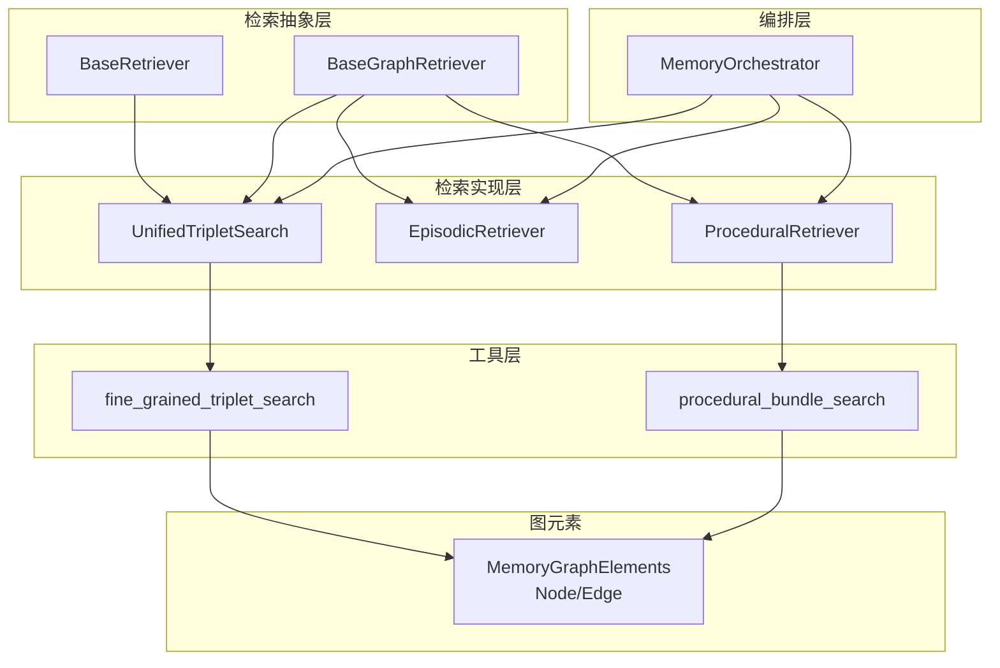
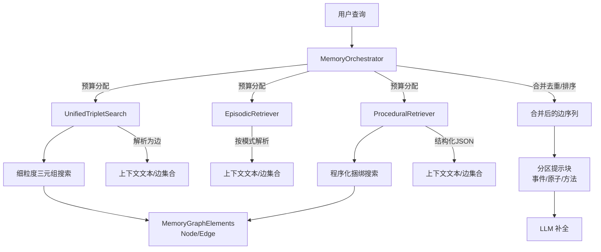
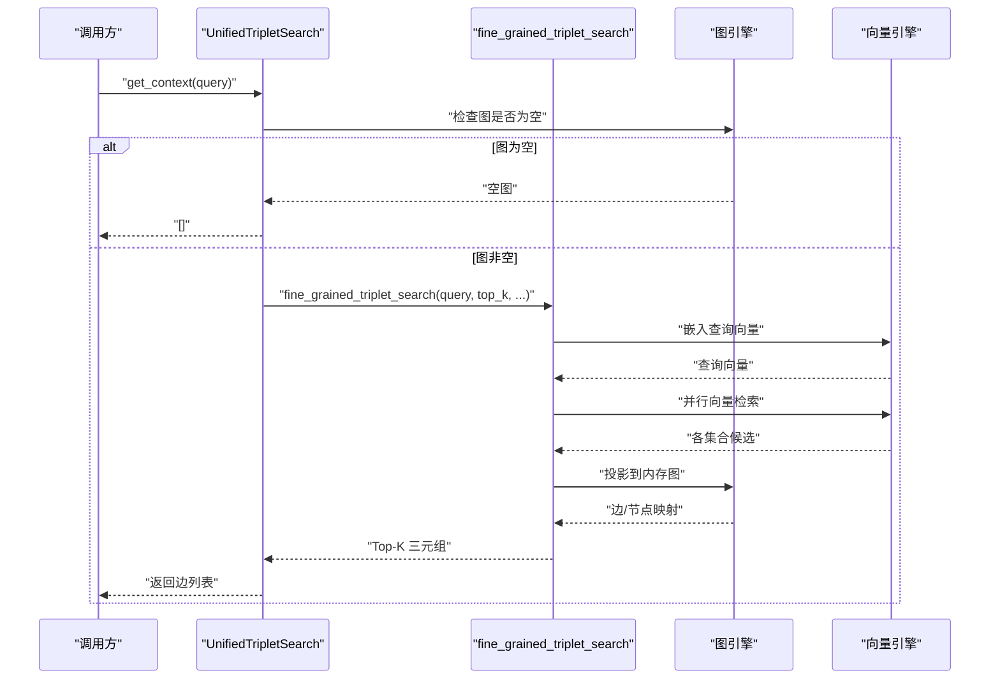
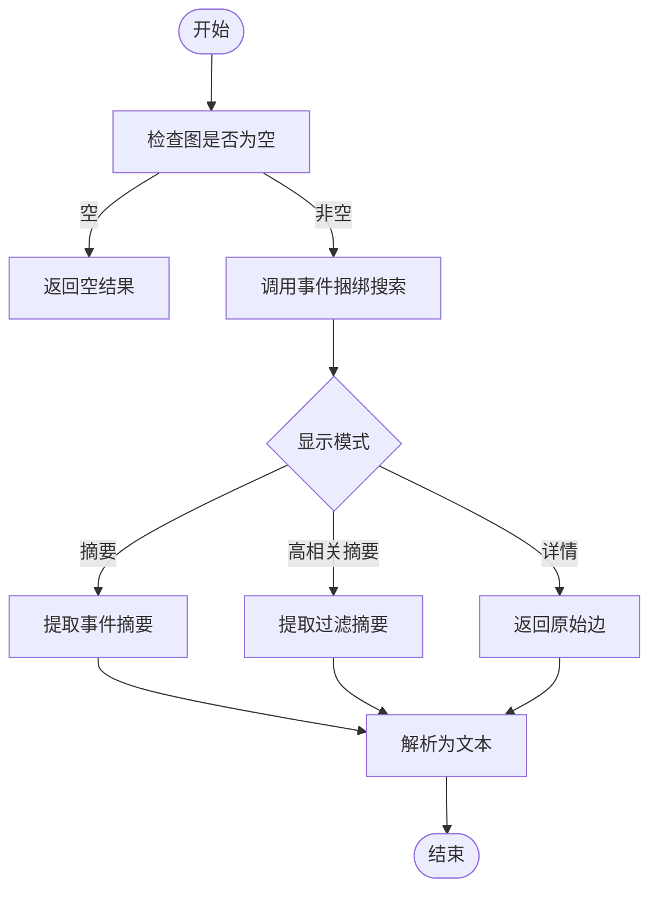
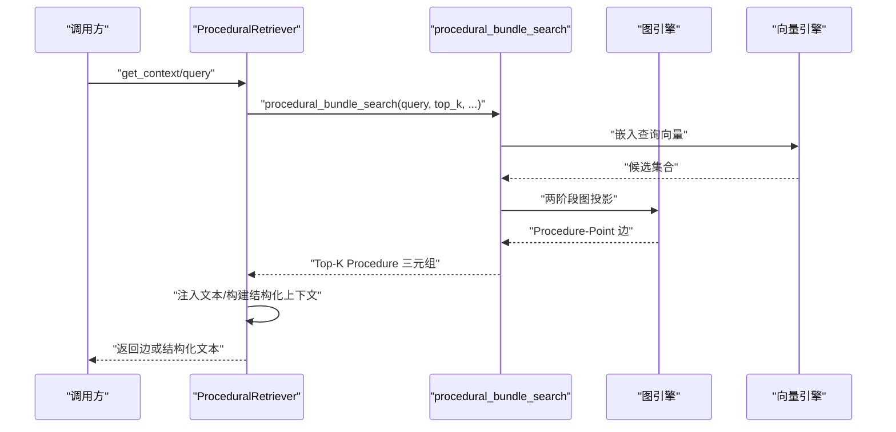
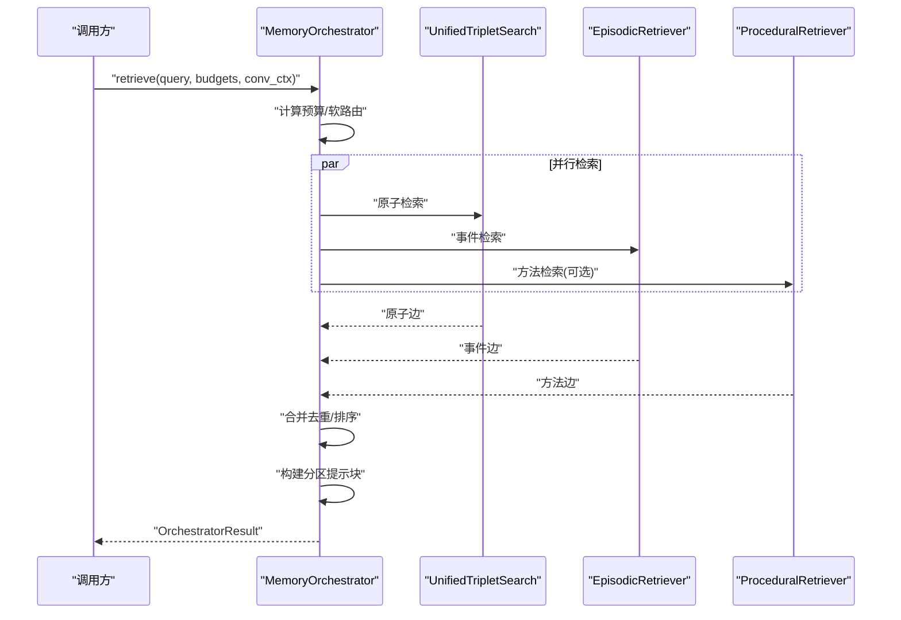
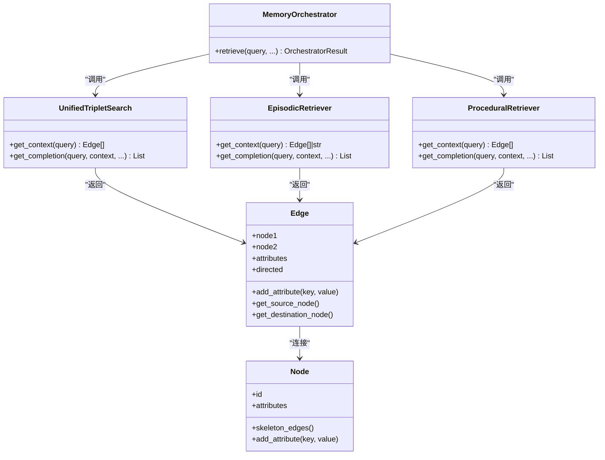
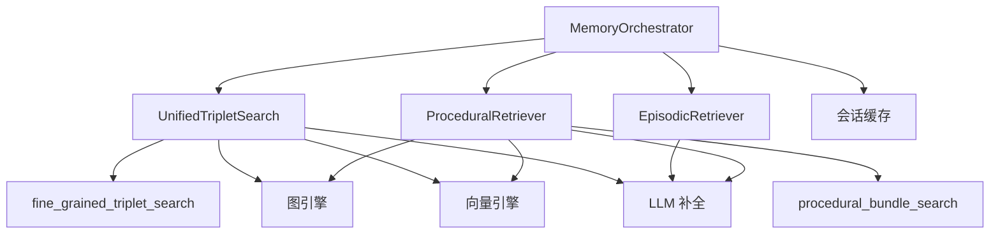

# 检索系统概览

<cite>
**本文档引用的文件**
- [m_flow/retrieval/__init__.py](file://m_flow/retrieval/__init__.py)
- [m_flow/retrieval/base_retriever.py](file://m_flow/retrieval/base_retriever.py)
- [m_flow/retrieval/base_graph_retriever.py](file://m_flow/retrieval/base_graph_retriever.py)
- [m_flow/retrieval/unified_triplet_search.py](file://m_flow/retrieval/unified_triplet_search.py)
- [m_flow/retrieval/procedural_retriever.py](file://m_flow/retrieval/procedural_retriever.py)
- [m_flow/retrieval/memory_orchestrator.py](file://m_flow/retrieval/memory_orchestrator.py)
- [m_flow/retrieval/utils/fine_grained_triplet_search.py](file://m_flow/retrieval/utils/fine_grained_triplet_search.py)
- [m_flow/retrieval/utils/procedural_bundle_search.py](file://m_flow/retrieval/utils/procedural_bundle_search.py)
- [m_flow/knowledge/graph_ops/m_flow_graph/MemoryGraphElements.py](file://m_flow/knowledge/graph_ops/m_flow_graph/MemoryGraphElements.py)
- [docs/RETRIEVAL_ARCHITECTURE.md](file://docs/RETRIEVAL_ARCHITECTURE.md)
- [m_flow/search/models/Query.py](file://m_flow/search/models/Query.py)
- [m_flow/search/models/Result.py](file://m_flow/search/models/Result.py)
- [m_flow/retrieval/episodic_retriever.py](file://m_flow/retrieval/episodic_retriever.py)
</cite>

## 目录
1. [简介](#简介)
2. [项目结构](#项目结构)
3. [核心组件](#核心组件)
4. [架构总览](#架构总览)
5. [详细组件分析](#详细组件分析)
6. [依赖关系分析](#依赖关系分析)
7. [性能考量](#性能考量)
8. [故障排除指南](#故障排除指南)
9. [结论](#结论)
10. [附录](#附录)

## 简介
本文件面向 M-flow 检索系统，系统性阐述其统一多粒度检索架构、路径成本计算的理论基础，以及 Typed Edges 在证据链评分中的作用。文档同时说明检索系统与记忆系统的集成关系、检索触发条件与执行流程，并总结性能特征与适用场景，最后给出扩展性设计建议，帮助开发者在不破坏现有能力的前提下添加新的检索模式与优化策略。

## 项目结构
检索系统位于 m_flow/retrieval 目录下，采用“抽象接口 + 具体实现 + 统一编排”的分层组织方式：
- 抽象层：BaseRetriever、BaseGraphRetriever 定义检索接口
- 实现层：UnifiedTripletSearch（原子/细粒度）、EpisodicRetriever（事件/粗粒度）、ProceduralRetriever（方法/程序化）
- 编排层：MemoryOrchestrator 提供并行检索、软路由与分区输出
- 工具层：fine_grained_triplet_search、procedural_bundle_search 等实现底层搜索与评分
- 图元素：MemoryGraphElements 定义节点与边的轻量结构，支撑评分与传播

**图表来源**
- [m_flow/retrieval/base_retriever.py:11-61](file://m_flow/retrieval/base_retriever.py#L11-L61)
- [m_flow/retrieval/base_graph_retriever.py:13-63](file://m_flow/retrieval/base_graph_retriever.py#L13-L63)
- [m_flow/retrieval/unified_triplet_search.py:29-306](file://m_flow/retrieval/unified_triplet_search.py#L29-L306)
- [m_flow/retrieval/episodic_retriever.py:130-448](file://m_flow/retrieval/episodic_retriever.py#L130-L448)
- [m_flow/retrieval/procedural_retriever.py:199-513](file://m_flow/retrieval/procedural_retriever.py#L199-L513)
- [m_flow/retrieval/memory_orchestrator.py:148-655](file://m_flow/retrieval/memory_orchestrator.py#L148-L655)
- [m_flow/retrieval/utils/fine_grained_triplet_search.py:108-327](file://m_flow/retrieval/utils/fine_grained_triplet_search.py#L108-L327)
- [m_flow/retrieval/utils/procedural_bundle_search.py:203-614](file://m_flow/retrieval/utils/procedural_bundle_search.py#L203-L614)
- [m_flow/knowledge/graph_ops/m_flow_graph/MemoryGraphElements.py:23-195](file://m_flow/knowledge/graph_ops/m_flow_graph/MemoryGraphElements.py#L23-L195)

**章节来源**
- [m_flow/retrieval/__init__.py:14-106](file://m_flow/retrieval/__init__.py#L14-L106)
- [m_flow/retrieval/base_retriever.py:11-61](file://m_flow/retrieval/base_retriever.py#L11-L61)
- [m_flow/retrieval/base_graph_retriever.py:13-63](file://m_flow/retrieval/base_graph_retriever.py#L13-L63)

## 核心组件
- 基类接口
  - BaseRetriever：定义异步 get_context 与 get_completion 接口，统一检索与补全流程
  - BaseGraphRetriever：面向图边（三元组）的检索接口，返回 Edge 列表作为上下文
- 统一检索器
  - UnifiedTripletSearch：自动发现向量集合，进行细粒度三元组检索，支持文本解析与 LLM 补全
- 事件检索器
  - EpisodicRetriever：基于 Bundle Search 的事件/粗粒度检索，支持摘要/详情两种显示模式
- 方法检索器
  - ProceduralRetriever：面向“方法型”问题的程序化检索，构建结构化 JSON 上下文
- 编排器
  - MemoryOrchestrator：并行检索原子/事件/方法三类记忆，软路由动态调整预算，分区输出提示块

**章节来源**
- [m_flow/retrieval/base_retriever.py:11-61](file://m_flow/retrieval/base_retriever.py#L11-L61)
- [m_flow/retrieval/base_graph_retriever.py:13-63](file://m_flow/retrieval/base_graph_retriever.py#L13-L63)
- [m_flow/retrieval/unified_triplet_search.py:29-306](file://m_flow/retrieval/unified_triplet_search.py#L29-L306)
- [m_flow/retrieval/episodic_retriever.py:130-448](file://m_flow/retrieval/episodic_retriever.py#L130-L448)
- [m_flow/retrieval/procedural_retriever.py:199-513](file://m_flow/retrieval/procedural_retriever.py#L199-L513)
- [m_flow/retrieval/memory_orchestrator.py:148-655](file://m_flow/retrieval/memory_orchestrator.py#L148-L655)

## 架构总览
M-flow 检索系统以“图路由 + 成本传播”为核心，替代传统扁平向量检索。其关键理念包括：
- 多粒度统一：通过统一的 Edge 结构承载不同粒度的知识片段，实现原子事实、事件聚合与方法程序化的无缝衔接
- 路径成本计算：以最小代价路径为准则，从尖端锚点（实体/事实点）向下传播到事件基座，避免“宽泛匹配”主导
- Typed Edges 的证据链评分：边不仅是连接符，更是语义过滤器，参与路径代价计算，阻断无关连接
- 时间增强：对包含明确时间的查询，引入时间匹配奖励，提升时序相关检索效果
- 记忆系统集成：检索与记忆写入、路由、合并等阶段协同，形成“写—记—检—用”的闭环

**图表来源**
- [m_flow/retrieval/memory_orchestrator.py:148-298](file://m_flow/retrieval/memory_orchestrator.py#L148-L298)
- [m_flow/retrieval/unified_triplet_search.py:123-153](file://m_flow/retrieval/unified_triplet_search.py#L123-L153)
- [m_flow/retrieval/episodic_retriever.py:183-250](file://m_flow/retrieval/episodic_retriever.py#L183-L250)
- [m_flow/retrieval/procedural_retriever.py:282-370](file://m_flow/retrieval/procedural_retriever.py#L282-L370)
- [m_flow/retrieval/utils/fine_grained_triplet_search.py:108-327](file://m_flow/retrieval/utils/fine_grained_triplet_search.py#L108-L327)
- [m_flow/retrieval/utils/procedural_bundle_search.py:203-614](file://m_flow/retrieval/utils/procedural_bundle_search.py#L203-L614)
- [m_flow/knowledge/graph_ops/m_flow_graph/MemoryGraphElements.py:124-195](file://m_flow/knowledge/graph_ops/m_flow_graph/MemoryGraphElements.py#L124-L195)

**章节来源**
- [docs/RETRIEVAL_ARCHITECTURE.md:15-137](file://docs/RETRIEVAL_ARCHITECTURE.md#L15-L137)

## 详细组件分析

### 统一三元组检索（UnifiedTripletSearch）
- 设计目标：自动发现向量集合，检索细粒度三元组，支持文本解析与可选的 LLM 补全
- 关键流程
  - 自动推导集合：若未指定集合，则扫描 MemoryNode 子类的 metadata.index_fields，生成集合名
  - 细粒度三元组搜索：调用 fine_grained_triplet_search，支持宽搜 top_k、三元组距离惩罚、节点类型/名称过滤
  - 文本解析：resolve_edges_to_text 将边转换为人类可读字符串；或使用 assemble_episode_summaries 进行摘要去重
  - 可选补全：generate_completion 结合用户/系统提示词与会话缓存，生成回答
- 证据链评分要点
  - 使用 MemoryGraphElements 中的 Edge/Node 轻量结构，边携带 vector_distance 与属性，参与路径代价计算
  - 支持时间增强：对命中时间表达式的查询，应用时间匹配奖励，重新排序

**图表来源**
- [m_flow/retrieval/unified_triplet_search.py:123-153](file://m_flow/retrieval/unified_triplet_search.py#L123-L153)
- [m_flow/retrieval/utils/fine_grained_triplet_search.py:108-327](file://m_flow/retrieval/utils/fine_grained_triplet_search.py#L108-L327)
- [m_flow/knowledge/graph_ops/m_flow_graph/MemoryGraphElements.py:124-195](file://m_flow/knowledge/graph_ops/m_flow_graph/MemoryGraphElements.py#L124-L195)

**章节来源**
- [m_flow/retrieval/unified_triplet_search.py:29-306](file://m_flow/retrieval/unified_triplet_search.py#L29-L306)
- [m_flow/retrieval/utils/fine_grained_triplet_search.py:108-327](file://m_flow/retrieval/utils/fine_grained_triplet_search.py#L108-L327)

### 事件检索（EpisodicRetriever）
- 设计目标：面向“发生了什么”类问题，返回事件-方面-事实点-实体的三元组，支持摘要/详情两种显示模式
- 关键流程
  - 通过 episodic_bundle_search 获取三元组
  - 显示模式控制：摘要模式仅提取事件摘要；高相关摘要模式使用过滤后的 edge_text；详情模式返回原始边用于可视化
  - 文本注入：_inject_text_for_episodic_nodes 为节点注入 text 属性，便于 resolve_edges_to_text 渲染
- 证据链评分要点
  - 采用 Bundle Search 的最小代价路径策略，优先从事实点/实体向上汇聚到事件
  - 支持时间格式识别与时间字段渲染，提升事件上下文可读性

**图表来源**
- [m_flow/retrieval/episodic_retriever.py:183-250](file://m_flow/retrieval/episodic_retriever.py#L183-L250)
- [m_flow/retrieval/episodic_retriever.py:319-404](file://m_flow/retrieval/episodic_retriever.py#L319-L404)

**章节来源**
- [m_flow/retrieval/episodic_retriever.py:130-448](file://m_flow/retrieval/episodic_retriever.py#L130-L448)

### 方法检索（ProceduralRetriever）
- 设计目标：面向“如何做”类方法型问题，返回程序化三元组（Procedure-Context/Steps + Points），并可生成结构化 JSON 上下文
- 关键流程
  - procedural_bundle_search：两阶段图投影，从 Procedure/Step/Context 点构建捆绑，按最小代价选择 Procedure
  - 文本注入：_inject_text_for_procedural_nodes 为节点注入 text，确保 resolve_edges_to_text 正确渲染
  - 结构化上下文：_build_procedural_structured_json 将 Procedure、步骤、上下文点整理为 JSON，便于前端展示
- 证据链评分要点
  - 1跳评分：从 Procedure 的 Step/Context 点出发，累加起点向量距离、边向量距离与跃迁惩罚
  - 激活状态惩罚：非 active 的 Procedure 增加额外代价
  - 时间增强：对含时间的查询，对 Procedure 应用时间匹配奖励

**图表来源**
- [m_flow/retrieval/procedural_retriever.py:247-281](file://m_flow/retrieval/procedural_retriever.py#L247-L281)
- [m_flow/retrieval/procedural_retriever.py:297-370](file://m_flow/retrieval/procedural_retriever.py#L297-L370)
- [m_flow/retrieval/utils/procedural_bundle_search.py:203-614](file://m_flow/retrieval/utils/procedural_bundle_search.py#L203-L614)

**章节来源**
- [m_flow/retrieval/procedural_retriever.py:199-513](file://m_flow/retrieval/procedural_retriever.py#L199-L513)
- [m_flow/retrieval/utils/procedural_bundle_search.py:203-614](file://m_flow/retrieval/utils/procedural_bundle_search.py#L203-L614)

### 编排器（MemoryOrchestrator）
- 设计目标：并行检索原子/事件/方法三类记忆，软路由根据查询意图动态调整预算，输出分区提示块
- 关键流程
  - 预算计算：支持环境变量与覆盖参数，分别控制三类检索的 top_k
  - 并行检索：原子（UnifiedTripletSearch）、事件（EpisodicRetriever）、方法（ProceduralRetriever）
  - 合并策略：按“事件优先/方法优先”两种优先级顺序去重合并
  - 分区输出：事件/原子/方法三块提示文本，便于 LLM 有序消费
- 触发与执行
  - 默认不启用“触发器”逻辑，方法检索由配置开关控制
  - 可选 P5 流水线：QueryBuilder → Recaller → Injector → Formatter，生成建议卡片与注入文本

**图表来源**
- [m_flow/retrieval/memory_orchestrator.py:173-298](file://m_flow/retrieval/memory_orchestrator.py#L173-L298)

**章节来源**
- [m_flow/retrieval/memory_orchestrator.py:148-655](file://m_flow/retrieval/memory_orchestrator.py#L148-L655)

### 类关系与数据模型
- Edge/Node 轻量结构
  - Node/Edge 为轻量对象，具备 attributes、邻接关系与状态位向量，支持多维/多租户过滤
  - 边携带 vector_distance 与属性，参与路径代价计算
- 检索结果模型
  - OrchestratorResult：封装三类检索结果、合并边、分区提示块与元数据
  - Query/Result：持久化用户查询与结果，便于审计与回放

**图表来源**
- [m_flow/knowledge/graph_ops/m_flow_graph/MemoryGraphElements.py:23-195](file://m_flow/knowledge/graph_ops/m_flow_graph/MemoryGraphElements.py#L23-L195)
- [m_flow/retrieval/unified_triplet_search.py:123-153](file://m_flow/retrieval/unified_triplet_search.py#L123-L153)
- [m_flow/retrieval/episodic_retriever.py:183-250](file://m_flow/retrieval/episodic_retriever.py#L183-L250)
- [m_flow/retrieval/procedural_retriever.py:282-370](file://m_flow/retrieval/procedural_retriever.py#L282-L370)
- [m_flow/retrieval/memory_orchestrator.py:173-298](file://m_flow/retrieval/memory_orchestrator.py#L173-L298)

**章节来源**
- [m_flow/knowledge/graph_ops/m_flow_graph/MemoryGraphElements.py:23-195](file://m_flow/knowledge/graph_ops/m_flow_graph/MemoryGraphElements.py#L23-L195)
- [m_flow/search/models/Query.py:18-29](file://m_flow/search/models/Query.py#L18-L29)
- [m_flow/search/models/Result.py:18-29](file://m_flow/search/models/Result.py#L18-L29)

## 依赖关系分析
- 组件耦合
  - 编排器与具体检索器解耦：通过统一接口与 Lazy Import，降低循环依赖风险
  - 检索器依赖工具层：fine_grained_triplet_search 与 procedural_bundle_search 提供底层搜索与评分
  - 图元素与适配器：Edge/Node 作为通用载体，与图/向量适配器交互
- 外部依赖
  - 图数据库与向量数据库：通过 get_graph_provider/get_vector_provider 注入
  - LLM 补全：generate_completion/summarize_text 统一补全与摘要
  - 缓存：会话缓存与交互保存，提升用户体验与可追溯性

**图表来源**
- [m_flow/retrieval/memory_orchestrator.py:173-298](file://m_flow/retrieval/memory_orchestrator.py#L173-L298)
- [m_flow/retrieval/unified_triplet_search.py:193-241](file://m_flow/retrieval/unified_triplet_search.py#L193-L241)
- [m_flow/retrieval/episodic_retriever.py:251-316](file://m_flow/retrieval/episodic_retriever.py#L251-L316)
- [m_flow/retrieval/procedural_retriever.py:372-430](file://m_flow/retrieval/procedural_retriever.py#L372-L430)

**章节来源**
- [m_flow/retrieval/__init__.py:49-106](file://m_flow/retrieval/__init__.py#L49-L106)

## 性能考量
- 延迟
  - 并行检索：编排器对原子/事件/方法三类检索并行执行，显著降低端到端延迟
  - 会话缓存：开启缓存时，摘要与补全可并发执行，减少重复计算
- 吞吐量
  - 向量检索采用并行集合查询，结合宽搜 top_k 与边映射，提升召回效率
  - 内存图投影与两阶段扩展，平衡召回与计算复杂度
- 准确性
  - 最小代价路径策略：避免平均噪声影响，强调单一强证据链
  - 边语义过滤：无关边贡献高代价，有效抑制结构噪声
  - 时间增强：对明确时间查询施加奖励，提升时序相关性

[本节为通用性能讨论，无需特定文件引用]

## 故障排除指南
- 图为空
  - 现象：检索直接返回空结果
  - 处理：确认知识图谱已正确写入数据，或检查图引擎初始化
- 向量集合缺失
  - 现象：某些集合未创建导致检索为空
  - 处理：检查向量引擎初始化与集合存在性，必要时迁移或重建集合
- 查询无效
  - 现象：抛出参数错误异常
  - 处理：确保 query 非空且 top_k > 0；检查 memory_type_filter 参数合法性
- 时间增强未生效
  - 现象：查询含时间但未获得奖励
  - 处理：确认向量引擎支持 where_filter；否则忽略 memory_type_filter 并切换至支持该特性的引擎

**章节来源**
- [m_flow/retrieval/unified_triplet_search.py:141-149](file://m_flow/retrieval/unified_triplet_search.py#L141-L149)
- [m_flow/retrieval/utils/fine_grained_triplet_search.py:151-154](file://m_flow/retrieval/utils/fine_grained_triplet_search.py#L151-L154)
- [m_flow/retrieval/utils/fine_grained_triplet_search.py:205-213](file://m_flow/retrieval/utils/fine_grained_triplet_search.py#L205-L213)

## 结论
M-flow 检索系统通过“图路由 + 成本传播”的统一架构，实现了多粒度检索的一致性与高效性。Typed Edges 将边从被动连接符转变为语义过滤器，配合最小代价路径策略与时间增强机制，显著提升了检索的准确性与鲁棒性。编排器的并行检索与软路由设计，使系统能够在不同粒度间自动切换，满足多样化的问答需求。未来可在检索模式扩展、评分策略优化与跨模态融合等方面持续演进。

[本节为总结性内容，无需特定文件引用]

## 附录
- 扩展性设计建议
  - 新增检索模式：实现 BaseGraphRetriever 或 BaseRetriever 接口，接入编排器的并行检索与预算管理
  - 优化策略：引入自适应权重、多信号融合、跨模态向量检索等机制
  - 集成记忆系统：通过记忆写入与检索的统一接口，实现“写—记—检—用”的闭环
- 性能监控
  - 建议在检索关键路径埋点，统计向量检索耗时、图投影耗时与 LLM 补全耗时，辅助容量规划与优化

[本节为通用指导，无需特定文件引用]