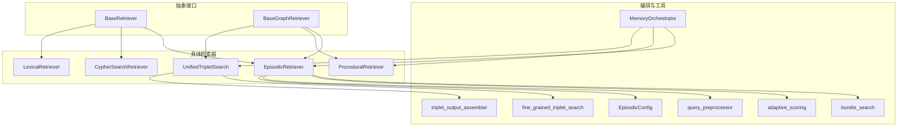
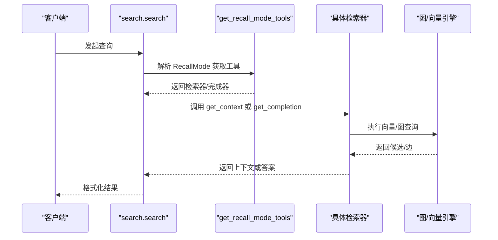
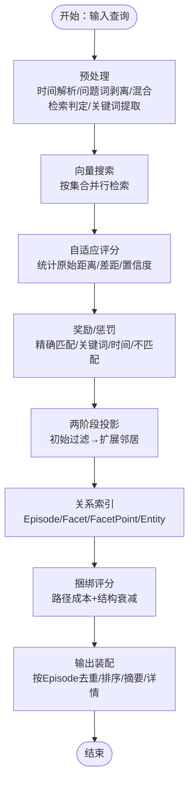
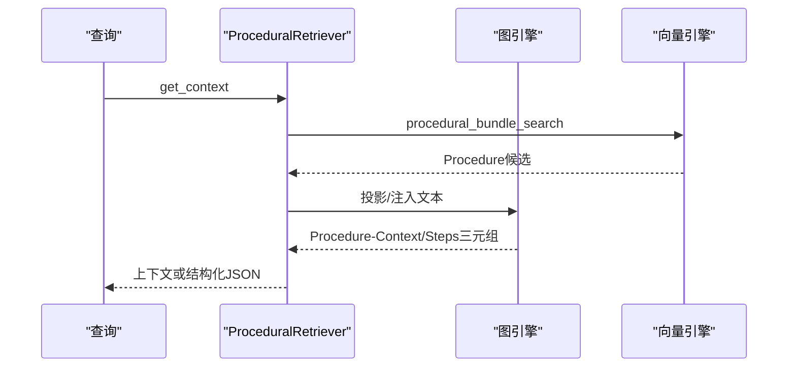
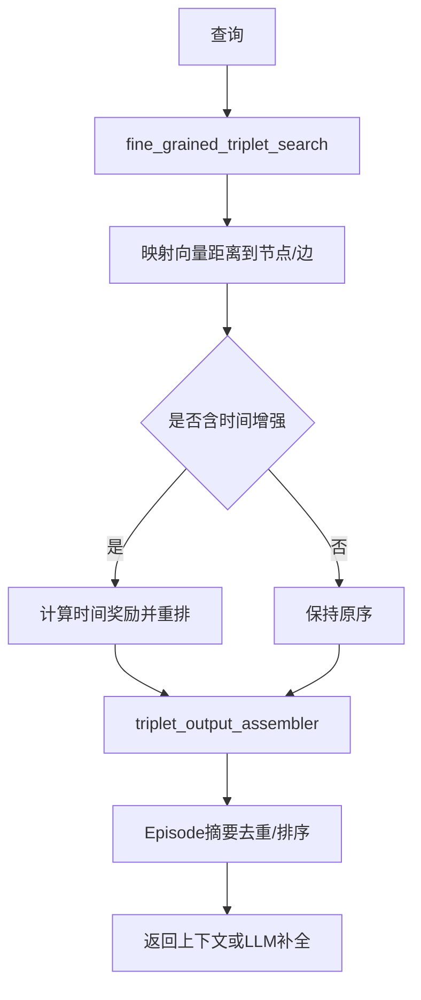
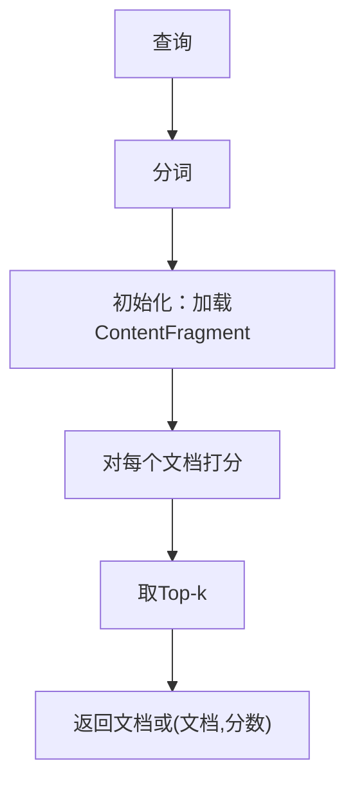
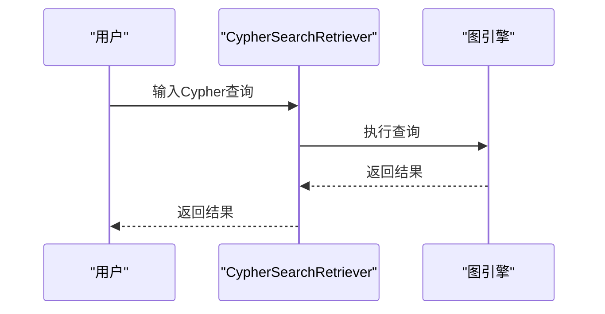
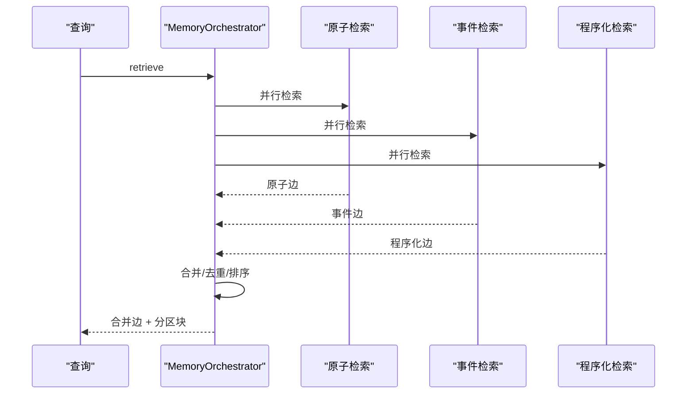
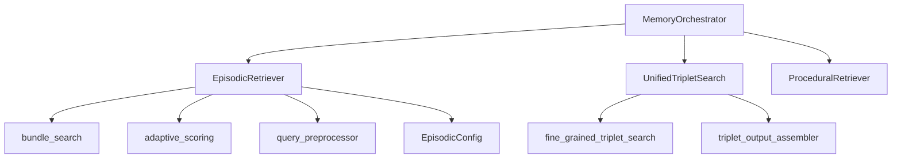

# 检索系统设计

<cite>
**本文引用的文件**
- [retrieval/__init__.py](file://m_flow/retrieval/__init__.py)
- [retrieval/base_retriever.py](file://m_flow/retrieval/base_retriever.py)
- [retrieval/base_graph_retriever.py](file://m_flow/retrieval/base_graph_retriever.py)
- [retrieval/episodic_retriever.py](file://m_flow/retrieval/episodic_retriever.py)
- [retrieval/procedural_retriever.py](file://m_flow/retrieval/procedural_retriever.py)
- [retrieval/cypher_search_retriever.py](file://m_flow/retrieval/cypher_search_retriever.py)
- [retrieval/lexical_retriever.py](file://m_flow/retrieval/lexical_retriever.py)
- [retrieval/unified_triplet_search.py](file://m_flow/retrieval/unified_triplet_search.py)
- [retrieval/memory_orchestrator.py](file://m_flow/retrieval/memory_orchestrator.py)
- [retrieval/episodic/bundle_search.py](file://m_flow/retrieval/episodic/bundle_search.py)
- [retrieval/episodic/adaptive_scoring.py](file://m_flow/retrieval/episodic/adaptive_scoring.py)
- [retrieval/episodic/query_preprocessor.py](file://m_flow/retrieval/episodic/query_preprocessor.py)
- [retrieval/episodic/config.py](file://m_flow/retrieval/episodic/config.py)
- [retrieval/utils/fine_grained_triplet_search.py](file://m_flow/retrieval/utils/fine_grained_triplet_search.py)
- [retrieval/utils/triplet_output_assembler.py](file://m_flow/retrieval/utils/triplet_output_assembler.py)
- [search/methods/search.py](file://m_flow/search/methods/search.py)
</cite>

## 目录
1. [简介](#简介)
2. [项目结构](#项目结构)
3. [核心组件](#核心组件)
4. [架构总览](#架构总览)
5. [详细组件分析](#详细组件分析)
6. [依赖分析](#依赖分析)
7. [性能考虑](#性能考虑)
8. [故障排查指南](#故障排查指南)
9. [结论](#结论)
10. [附录](#附录)

## 简介
本设计文档面向 M-flow 检索系统，系统性阐述五种检索模式的实现原理与适用场景：事件检索（Episodic）、程序化检索（Procedural）、三元组补全（UnifiedTripletSearch/Triplet）、词汇检索（Lexical）、图查询（Cypher）。重点解析路径成本算法、typed edges 与语义权重在证据链评分中的作用、自适应评分机制（精确匹配奖励与广域匹配惩罚）、Bundle Search 的端到端流程、查询预处理与后处理、检索性能优化策略以及扩展点与自定义方法。同时提供检索示例与性能基准建议。

## 项目结构
检索模块位于 m_flow/retrieval 及其子目录，围绕“抽象接口 + 具体实现 + 工具函数”的分层组织：
- 抽象层：BaseRetriever、BaseGraphRetriever 定义统一检索接口
- 具体检索器：EpisodicRetriever、ProceduralRetriever、CypherSearchRetriever、LexicalRetriever、UnifiedTripletSearch
- Orchestrator：MemoryOrchestrator 实现多内存类型并行检索与软路由
- Episodic 子系统：bundle_search、adaptive_scoring、query_preprocessor、config 等
- 工具与通用搜索：fine_grained_triplet_search、triplet_output_assembler、search 方法入口

图表来源
- [retrieval/base_retriever.py:11-61](file://m_flow/retrieval/base_retriever.py#L11-L61)
- [retrieval/base_graph_retriever.py:13-63](file://m_flow/retrieval/base_graph_retriever.py#L13-L63)
- [retrieval/episodic_retriever.py:130-448](file://m_flow/retrieval/episodic_retriever.py#L130-L448)
- [retrieval/procedural_retriever.py:199-513](file://m_flow/retrieval/procedural_retriever.py#L199-L513)
- [retrieval/cypher_search_retriever.py:21-91](file://m_flow/retrieval/cypher_search_retriever.py#L21-L91)
- [retrieval/lexical_retriever.py:21-175](file://m_flow/retrieval/lexical_retriever.py#L21-L175)
- [retrieval/unified_triplet_search.py:29-306](file://m_flow/retrieval/unified_triplet_search.py#L29-L306)
- [retrieval/memory_orchestrator.py:148-655](file://m_flow/retrieval/memory_orchestrator.py#L148-L655)
- [retrieval/episodic/bundle_search.py:40-720](file://m_flow/retrieval/episodic/bundle_search.py#L40-L720)
- [retrieval/episodic/adaptive_scoring.py:26-503](file://m_flow/retrieval/episodic/adaptive_scoring.py#L26-L503)
- [retrieval/episodic/query_preprocessor.py:97-250](file://m_flow/retrieval/episodic/query_preprocessor.py#L97-L250)
- [retrieval/episodic/config.py:12-276](file://m_flow/retrieval/episodic/config.py#L12-L276)
- [retrieval/utils/fine_grained_triplet_search.py:108-327](file://m_flow/retrieval/utils/fine_grained_triplet_search.py#L108-L327)
- [retrieval/utils/triplet_output_assembler.py:124-311](file://m_flow/retrieval/utils/triplet_output_assembler.py#L124-L311)

章节来源
- [retrieval/__init__.py:14-106](file://m_flow/retrieval/__init__.py#L14-L106)

## 核心组件
- 抽象接口
  - BaseRetriever：定义 get_context 与 get_completion 的异步接口，支持会话标识与响应模型类型
  - BaseGraphRetriever：面向图检索，返回 Edge 列表作为上下文
- 具体检索器
  - EpisodicRetriever：基于 Bundle Search 的事件检索，支持摘要/详情两种输出模式、时间增强、自适应权重融合
  - ProceduralRetriever：程序化检索，返回 Procedure-Context/Steps 三元组，支持结构化 JSON 输出
  - UnifiedTripletSearch：细粒度三元组检索，自动发现向量集合，可生成 LLM 补全
  - CypherSearchRetriever：直接执行 Cypher 查询，适合已知图遍历结构的精确查询
  - LexicalRetriever：基于 BM25 风格的词法检索，支持可插拔分词与打分函数
- 编排与工具
  - MemoryOrchestrator：并行检索原子/事件/程序化记忆，软路由与分区提示输出
  - Episodic 子系统：bundle_search、adaptive_scoring、query_preprocessor、config
  - 细粒度检索工具：fine_grained_triplet_search、triplet_output_assembler

章节来源
- [retrieval/base_retriever.py:11-61](file://m_flow/retrieval/base_retriever.py#L11-L61)
- [retrieval/base_graph_retriever.py:13-63](file://m_flow/retrieval/base_graph_retriever.py#L13-L63)
- [retrieval/episodic_retriever.py:130-448](file://m_flow/retrieval/episodic_retriever.py#L130-L448)
- [retrieval/procedural_retriever.py:199-513](file://m_flow/retrieval/procedural_retriever.py#L199-L513)
- [retrieval/unified_triplet_search.py:29-306](file://m_flow/retrieval/unified_triplet_search.py#L29-L306)
- [retrieval/cypher_search_retriever.py:21-91](file://m_flow/retrieval/cypher_search_retriever.py#L21-L91)
- [retrieval/lexical_retriever.py:21-175](file://m_flow/retrieval/lexical_retriever.py#L21-L175)
- [retrieval/memory_orchestrator.py:148-655](file://m_flow/retrieval/memory_orchestrator.py#L148-L655)

## 架构总览
检索系统采用“模式化检索器 + 编排器 + 工具函数”的分层架构。入口通过 search 方法根据 RecallMode 调用相应工具，Episodic/Procedural/UnifiedTriplet/Cypher/Lexical 各司其职；Episodic 通过 Bundle Search 将向量候选投影到图上，结合 typed edges 与语义权重进行证据链评分；Procedural 以 Procedure 为中心组织步骤与上下文点；UnifiedTripletSearch 提供细粒度三元组检索与摘要去重；MemoryOrchestrator 实现多模式并行与软路由。

图表来源
- [search/methods/search.py:55-621](file://m_flow/search/methods/search.py#L55-L621)
- [retrieval/memory_orchestrator.py:355-414](file://m_flow/retrieval/memory_orchestrator.py#L355-L414)

## 详细组件分析

### 事件检索（Episodic）
- 核心流程
  - 查询预处理：时间表达式解析、问题词剥离、混合检索触发判断、关键词提取
  - 向量搜索：按集合并行检索，扩大候选池以提升时间增强效果
  - 自适应评分：统计各集合原始距离与 Top-1/Top-2 差距，计算置信度，动态分配节点/边权重
  - 奖励与惩罚：精确匹配奖励、关键词匹配奖励、时间匹配奖励、不匹配惩罚
  - 两阶段投影：先以最佳节点距离过滤，再扩展邻居节点，构建记忆片段
  - 关系索引与捆绑评分：建立 Episode-Facet-FacetPoint-Entity 关系索引，计算路径成本与捆绑得分
  - 输出装配：按 Episode 去重与排序，支持摘要/详情两种模式
- 路径成本算法
  - 节点/边距离映射：将向量距离写回节点属性，边命中映射到边文本最小距离
  - Facet 成本计算：Facet 成本 = min(点距离 + 边命中成本 + 跳跃成本)，用于 Facet 选择与排序
  - Bundle 得分：综合语义得分与结构得分（随 Episode 排名指数衰减），融合自适应权重 λ
- typed edges 与证据链评分
  - typed edges：Episode→Facet→FacetPoint→Entity 的层级关系，每条边携带 edge_text/relationship_name
  - 证据链：从候选节点出发，经由 typed edges 连接至 Episode，形成“事件-方面-要点-实体”的证据链
  - 评分：语义得分（节点/边加权）+ 结构得分（排名衰减），时间匹配进一步调整
- 时间增强
  - 当查询包含明确时间范围且置信度达标时，扩大候选池并为匹配 Bundle 减分，未匹配则加分（惩罚）

图表来源
- [retrieval/episodic/bundle_search.py:40-270](file://m_flow/retrieval/episodic/bundle_search.py#L40-L270)
- [retrieval/episodic/adaptive_scoring.py:166-314](file://m_flow/retrieval/episodic/adaptive_scoring.py#L166-L314)
- [retrieval/episodic/query_preprocessor.py:97-250](file://m_flow/retrieval/episodic/query_preprocessor.py#L97-L250)
- [retrieval/episodic/config.py:12-276](file://m_flow/retrieval/episodic/config.py#L12-L276)

章节来源
- [retrieval/episodic_retriever.py:130-448](file://m_flow/retrieval/episodic_retriever.py#L130-L448)
- [retrieval/episodic/bundle_search.py:40-720](file://m_flow/retrieval/episodic/bundle_search.py#L40-L720)
- [retrieval/episodic/adaptive_scoring.py:26-503](file://m_flow/retrieval/episodic/adaptive_scoring.py#L26-L503)
- [retrieval/episodic/query_preprocessor.py:97-250](file://m_flow/retrieval/episodic/query_preprocessor.py#L97-L250)
- [retrieval/episodic/config.py:12-276](file://m_flow/retrieval/episodic/config.py#L12-L276)

### 程序化检索（Procedural）
- 特点
  - 以 Procedure 为核心，返回 Procedure-Context/Steps 三元组
  - 支持结构化 JSON 输出，便于前端渲染与 LLM 消费
  - 默认 top_k 较小，适合方法类问题的精准检索
- 关键流程
  - procedural_bundle_search：按 Procedure 节点集检索，严格节点集过滤，支持宽召回
  - 文本注入：为 Procedure/ContextPoint/StepPoint 注入 text 属性，兼容 resolve_edges_to_text
  - 结构化组装：抽取 Procedure 名称、摘要、上下文点、步骤，去噪与去重
  - 时间增强：可启用时间奖励，提升与事件时间匹配的 Procedure

图表来源
- [retrieval/procedural_retriever.py:247-430](file://m_flow/retrieval/procedural_retriever.py#L247-L430)

章节来源
- [retrieval/procedural_retriever.py:199-513](file://m_flow/retrieval/procedural_retriever.py#L199-L513)

### 三元组补全（UnifiedTripletSearch/Triplet）
- 功能
  - 自动发现向量集合，检索细粒度三元组
  - 可选生成 LLM 补全，或仅返回上下文
  - 输出装配：对非 Episodic 图结构，回退到完整边文本
- 流程
  - fine_grained_triplet_search：按集合检索，映射向量距离到节点/边，必要时二次检索并时间增强重排
  - triplet_output_assembler：将扁平三元组映射到父级 Episode，去重并按平均位置排序生成摘要

图表来源
- [retrieval/utils/fine_grained_triplet_search.py:108-327](file://m_flow/retrieval/utils/fine_grained_triplet_search.py#L108-L327)
- [retrieval/utils/triplet_output_assembler.py:124-311](file://m_flow/retrieval/utils/triplet_output_assembler.py#L124-L311)
- [retrieval/unified_triplet_search.py:83-167](file://m_flow/retrieval/unified_triplet_search.py#L83-L167)

章节来源
- [retrieval/unified_triplet_search.py:29-306](file://m_flow/retrieval/unified_triplet_search.py#L29-L306)
- [retrieval/utils/fine_grained_triplet_search.py:108-327](file://m_flow/retrieval/utils/fine_grained_triplet_search.py#L108-L327)
- [retrieval/utils/triplet_output_assembler.py:124-311](file://m_flow/retrieval/utils/triplet_output_assembler.py#L124-L311)

### 词汇检索（Lexical）
- 设计
  - 基于 BM25 风格的词法检索，支持可插拔分词与打分函数
  - 预加载 ContentFragment 文档，按查询分词后计算相似度
- 参数
  - tokenizer：文本转 token 列表
  - scorer：(query_tokens, doc_tokens) -> score
  - top_k：返回数量
  - with_scores：是否包含分数

图表来源
- [retrieval/lexical_retriever.py:108-175](file://m_flow/retrieval/lexical_retriever.py#L108-L175)

章节来源
- [retrieval/lexical_retriever.py:21-175](file://m_flow/retrieval/lexical_retriever.py#L21-L175)

### 图查询（Cypher）
- 用途
  - 面向已知图遍历结构的精确查询
- 行为
  - 执行 Cypher 并返回 JSON 可序列化结果
  - 失败抛出 CypherSearchError

图表来源
- [retrieval/cypher_search_retriever.py:44-91](file://m_flow/retrieval/cypher_search_retriever.py#L44-L91)

章节来源
- [retrieval/cypher_search_retriever.py:21-91](file://m_flow/retrieval/cypher_search_retriever.py#L21-L91)

### 多模式编排（MemoryOrchestrator）
- 功能
  - 并行检索原子/事件/程序化记忆
  - 软路由：根据预算与意图调整 top_k
  - 分区提示输出：procedural/episodic/atomic 三块内容
- 流程
  - 并行执行检索任务
  - 合并去重：按关系名与端点唯一键去重
  - 构建分区块：分别解析三类边为文本块
  - 可选 P5 管线：QueryBuilder→Recaller→Injector→Formatter

图表来源
- [retrieval/memory_orchestrator.py:173-487](file://m_flow/retrieval/memory_orchestrator.py#L173-L487)

章节来源
- [retrieval/memory_orchestrator.py:148-655](file://m_flow/retrieval/memory_orchestrator.py#L148-L655)

## 依赖分析
- 组件耦合
  - EpisodicRetriever 依赖 bundle_search、adaptive_scoring、query_preprocessor、config，耦合度较高但职责清晰
  - UnifiedTripletSearch 依赖 fine_grained_triplet_search 与 triplet_output_assembler，关注点分离良好
  - MemoryOrchestrator 作为编排器，对具体检索器采用延迟导入，降低循环依赖风险
- 外部依赖
  - 图/向量引擎适配器：通过 get_graph_provider/get_vector_provider 获取实例
  - 日志与追踪：使用 get_logger 与 TraceManager 记录检索过程
  - 缓存：会话缓存用于对话历史与摘要缓存

图表来源
- [retrieval/episodic_retriever.py:130-182](file://m_flow/retrieval/episodic_retriever.py#L130-L182)
- [retrieval/unified_triplet_search.py:83-121](file://m_flow/retrieval/unified_triplet_search.py#L83-L121)
- [retrieval/memory_orchestrator.py:322-353](file://m_flow/retrieval/memory_orchestrator.py#L322-L353)

章节来源
- [retrieval/episodic_retriever.py:130-182](file://m_flow/retrieval/episodic_retriever.py#L130-L182)
- [retrieval/unified_triplet_search.py:83-121](file://m_flow/retrieval/unified_triplet_search.py#L83-L121)
- [retrieval/memory_orchestrator.py:322-353](file://m_flow/retrieval/memory_orchestrator.py#L322-L353)

## 性能考虑
- 索引与集合
  - Episodic：针对 Episode/Facet/FacetPoint/Entity/RelationType 等集合建立向量索引，合理设置 wide_search_top_k 与 top_k
  - Triplet：Fine-grained 检索按集合并行搜索，必要时开启 where_filter 以减少扫描
- 时间增强
  - 启用时间增强时扩大候选池，注意 wide_search_top_k 与 time_wide_cap 的平衡
- 自适应评分
  - 通过 collection_baselines 与 gap/ratio 计算置信度，避免极端权重导致信号被忽略
- 缓存
  - 会话缓存：保存对话历史与摘要，减少重复计算
  - 预热：LexicalRetriever 初始化时批量加载 ContentFragment
- 并行与并发
  - 多集合向量搜索与多数据集检索采用 gather 并发执行
  - 编排器并行检索多模式记忆，合并时使用去重键避免重复边

## 故障排查指南
- 常见错误与定位
  - 图为空：当图为空时返回空结果并记录警告，检查数据是否已 memorize
  - 向量集合不存在：捕获 CollectionNotFoundError，返回空结果
  - 查询失败：CypherSearchRetriever 捕获异常并抛出 CypherSearchError
  - 无数据：LexicalRetriever 在无法加载 chunk 时抛出 NoDataError
- 日志与追踪
  - 使用 get_logger 记录检索阶段信息与统计
  - TraceManager 记录检索事件与耗时
- 建议排查步骤
  - 检查数据集权限与图状态
  - 核对 RecallMode 与检索器配置
  - 查看检索日志与追踪事件
  - 调整 top_k、wide_search_top_k、时间增强参数

章节来源
- [retrieval/cypher_search_retriever.py:57-69](file://m_flow/retrieval/cypher_search_retriever.py#L57-L69)
- [retrieval/lexical_retriever.py:68-103](file://m_flow/retrieval/lexical_retriever.py#L68-L103)
- [search/methods/search.py:604-616](file://m_flow/search/methods/search.py#L604-L616)

## 结论
M-flow 检索系统通过五种模式覆盖不同检索需求：事件检索强调 typed edges 与路径成本、程序化检索聚焦 Procedure-Steps、三元组补全提供细粒度上下文、词汇检索满足关键词场景、图查询支持精确遍历。Episodic 采用 Bundle Search 与自适应评分，结合时间增强与奖励/惩罚策略，形成稳健的证据链评分体系。编排器实现多模式并行与软路由，确保在不同场景下获得高质量上下文与答案。

## 附录
- 检索示例
  - 事件检索：查询“某日期的会议纪要”，启用时间增强，返回 Episode 摘要与 Facet/Entity 详情
  - 程序化检索：查询“如何备份数据库”，返回 Procedure 步骤与上下文点
  - 三元组补全：查询“产品特性对比”，返回细粒度三元组并去重 Episode 摘要
  - 词汇检索：查询“技术规范”，返回关键词匹配的文档片段
  - 图查询：执行已知 Cypher，返回特定关系的结果
- 性能基准建议
  - 针对不同 RecallMode 设置合理的 top_k 与 wide_search_top_k
  - 启用自适应评分与时间增强时监控候选池规模与重排效果
  - 使用会话缓存与预热策略提升交互响应速度
  - 对高频查询建立索引与缓存策略