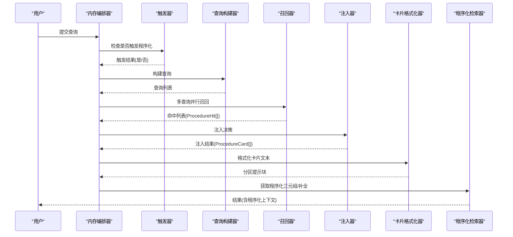
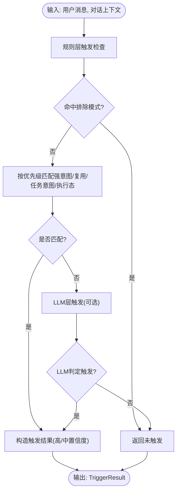
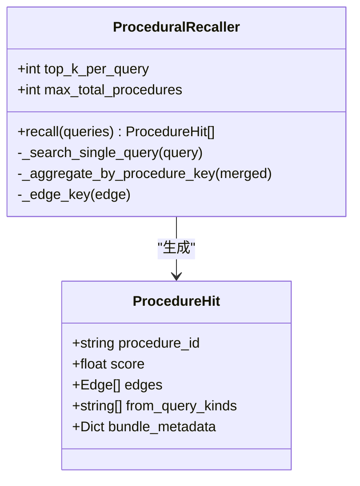
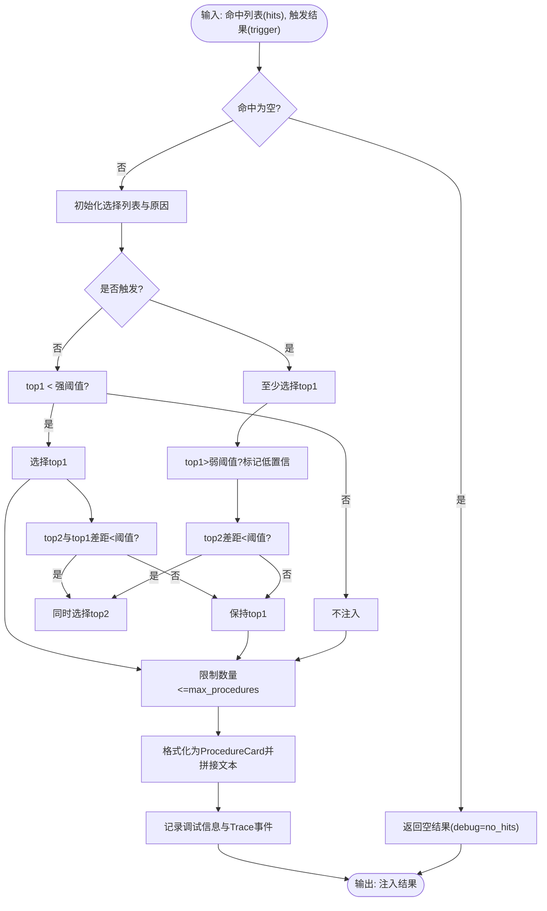
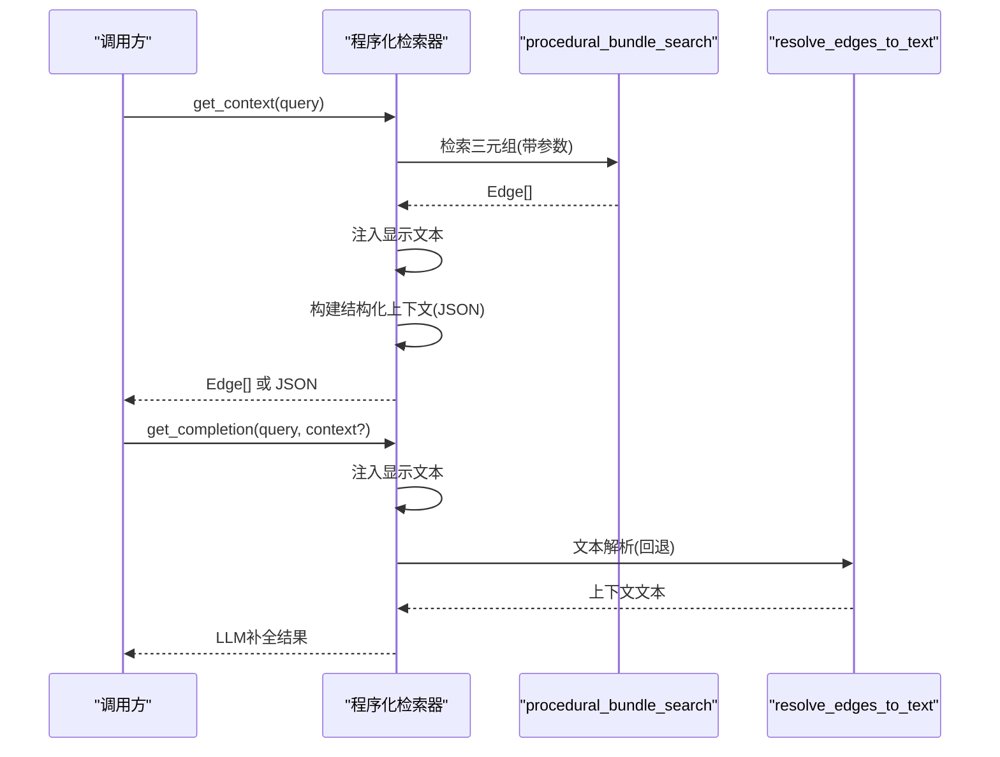
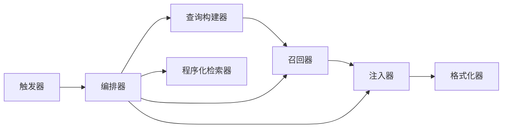

# 程序化检索模式

<cite>
**本文引用的文件**
- [procedural_trigger.py](file://m_flow/retrieval/gating/procedural_trigger.py)
- [procedural_injector.py](file://m_flow/retrieval/injection/procedural_injector.py)
- [procedural_recaller.py](file://m_flow/retrieval/orchestrators/procedural_recaller.py)
- [procedural_retriever.py](file://m_flow/retrieval/procedural_retriever.py)
- [procedural_query_builder.py](file://m_flow/retrieval/querying/procedural_query_builder.py)
- [procedural_card_formatter.py](file://m_flow/retrieval/formatters/procedural_card_formatter.py)
- [memory_orchestrator.py](file://m_flow/retrieval/memory_orchestrator.py)
- [models.py（程序化记忆）](file://m_flow/memory/procedural/models.py)
- [procedural_eval_v1.jsonl](file://m_flow/eval/datasets/procedural_eval_v1.jsonl)
- [procedural_eval_v1_baseline.json](file://m_flow/eval/baselines/procedural_eval_v1_baseline.json)
- [extract_from_episodic_router.py](file://m_flow/api/v1/procedural/routers/extract_from_episodic_router.py)
</cite>

## 目录
1. [引言](#引言)
2. [项目结构](#项目结构)
3. [核心组件](#核心组件)
4. [架构总览](#架构总览)
5. [详细组件分析](#详细组件分析)
6. [依赖关系分析](#依赖关系分析)
7. [性能考量](#性能考量)
8. [故障排查指南](#故障排查指南)
9. [结论](#结论)
10. [附录](#附录)

## 引言
本文件系统性阐述“程序化检索模式”的设计与实现，聚焦于如何从程序化记忆中提取可重用的步骤与流程，并在合适的时机将其注入到当前检索会话中，以增强对“方法类”问题的回答质量。内容涵盖：
- 程序化触发器：识别用户意图并决定是否启动程序化检索
- 程序化召回器：多查询召回、合并去重与打分融合
- 程序化注入器：基于阈值与置信度的软门控注入策略
- 程序化检索器：面向方法类问题的三元组检索与补全
- 配置参数与优化策略
- 实际应用场景与效果评估

## 项目结构
程序化检索相关代码主要分布在以下模块：
- 触发与路由：retrieval/gating、retrieval/memory_orchestrator
- 召回与注入：retrieval/orchestrators、retrieval/injection、retrieval/querying
- 格式化输出：retrieval/formatters
- 检索器：retrieval/procedural_retriever
- 程序化记忆建模：memory/procedural/models.py
- API 路由：api/v1/procedural/routers
- 评估数据与基线：eval/datasets、eval/baselines

```mermaid
graph TB
subgraph "检索层"
TRG["触发器<br/>procedural_trigger.py"]
QRY["查询构建器<br/>procedural_query_builder.py"]
REC["召回器<br/>procedural_recaller.py"]
INJ["注入器<br/>procedural_injector.py"]
FMT["卡片格式化器<br/>procedural_card_formatter.py"]
RET["程序化检索器<br/>procedural_retriever.py"]
end
subgraph "编排层"
ORCH["内存编排器<br/>memory_orchestrator.py"]
end
subgraph "记忆层"
MEM["程序化记忆模型<br/>memory/procedural/models.py"]
end
subgraph "API"
API["提取路由<br/>extract_from_episodic_router.py"]
end
TRG --> ORCH
QRY --> REC
REC --> INJ
INJ --> FMT
ORCH --> RET
ORCH --> QRY
ORCH --> REC
ORCH --> INJ
API --> MEM
```

图表来源
- [procedural_trigger.py:1-302](file://m_flow/retrieval/gating/procedural_trigger.py#L1-L302)
- [procedural_query_builder.py:1-62](file://m_flow/retrieval/querying/procedural_query_builder.py#L1-L62)
- [procedural_recaller.py:1-266](file://m_flow/retrieval/orchestrators/procedural_recaller.py#L1-L266)
- [procedural_injector.py:1-218](file://m_flow/retrieval/injection/procedural_injector.py#L1-L218)
- [procedural_card_formatter.py:1-336](file://m_flow/retrieval/formatters/procedural_card_formatter.py#L1-L336)
- [procedural_retriever.py:1-513](file://m_flow/retrieval/procedural_retriever.py#L1-L513)
- [memory_orchestrator.py:1-655](file://m_flow/retrieval/memory_orchestrator.py#L1-L655)
- [models.py（程序化记忆）:1-249](file://m_flow/memory/procedural/models.py#L1-L249)
- [extract_from_episodic_router.py:1-188](file://m_flow/api/v1/procedural/routers/extract_from_episodic_router.py#L1-L188)

章节来源
- [procedural_trigger.py:1-302](file://m_flow/retrieval/gating/procedural_trigger.py#L1-L302)
- [memory_orchestrator.py:1-655](file://m_flow/retrieval/memory_orchestrator.py#L1-L655)

## 核心组件
- 程序化触发器：双层触发机制（规则层+可选LLM层），用于判断是否进入程序化检索阶段
- 程序化召回器：多查询并行召回、按 procedure_id 合并去重、最小化打分融合
- 程序化注入器：基于阈值与置信度的软门控注入策略，控制注入数量与来源
- 程序化检索器：面向方法类问题的三元组检索，支持结构化上下文与LLM补全
- 查询构建器：简化策略，直接使用原始查询
- 卡片格式化器：将召回结果统一为 ProcedureCard，便于注入提示词
- 内存编排器：协调原子/事件/程序化三层检索，软路由与分区输出

章节来源
- [procedural_trigger.py:43-302](file://m_flow/retrieval/gating/procedural_trigger.py#L43-L302)
- [procedural_recaller.py:47-266](file://m_flow/retrieval/orchestrators/procedural_recaller.py#L47-L266)
- [procedural_injector.py:54-218](file://m_flow/retrieval/injection/procedural_injector.py#L54-L218)
- [procedural_retriever.py:199-513](file://m_flow/retrieval/procedural_retriever.py#L199-L513)
- [procedural_query_builder.py:31-62](file://m_flow/retrieval/querying/procedural_query_builder.py#L31-L62)
- [procedural_card_formatter.py:116-336](file://m_flow/retrieval/formatters/procedural_card_formatter.py#L116-L336)
- [memory_orchestrator.py:148-655](file://m_flow/retrieval/memory_orchestrator.py#L148-L655)

## 架构总览
程序化检索采用“触发-查询-召回-注入-格式化-检索器”的完整流水线，其中触发器与注入器承担软门控职责，确保仅在合适场景注入程序化知识，避免“程序化洪水”。



图表来源
- [memory_orchestrator.py:355-414](file://m_flow/retrieval/memory_orchestrator.py#L355-L414)
- [procedural_trigger.py:149-182](file://m_flow/retrieval/gating/procedural_trigger.py#L149-L182)
- [procedural_query_builder.py:31-62](file://m_flow/retrieval/querying/procedural_query_builder.py#L31-L62)
- [procedural_recaller.py:82-184](file://m_flow/retrieval/orchestrators/procedural_recaller.py#L82-L184)
- [procedural_injector.py:86-197](file://m_flow/retrieval/injection/procedural_injector.py#L86-L197)
- [procedural_card_formatter.py:303-336](file://m_flow/retrieval/formatters/procedural_card_formatter.py#L303-L336)
- [procedural_retriever.py:247-430](file://m_flow/retrieval/procedural_retriever.py#L247-L430)

## 详细组件分析

### 组件A：程序化触发器（ProceduralTrigger）
- 设计要点
  - 双层触发：规则层（零成本）+ 可选LLM层（低成本）
  - 规则层覆盖强意图词、复用词、任务意图、执行态上下文等
  - 排除型模式过滤“状态询问”等非方法类意图
  - 支持中英双语信号词
- 关键行为
  - 返回 TriggerResult，包含是否触发、原因、意图短语、置信度与来源
  - 执行态上下文需检测助手上次回复是否包含“计划/步骤”信号
- 使用建议
  - 默认启用规则层；LLM层暂未实现，保留扩展空间



图表来源
- [procedural_trigger.py:149-282](file://m_flow/retrieval/gating/procedural_trigger.py#L149-L282)

章节来源
- [procedural_trigger.py:43-302](file://m_flow/retrieval/gating/procedural_trigger.py#L43-L302)

### 组件B：程序化召回器（ProceduralRecaller）
- 设计要点
  - 多查询并行召回，聚合后按 procedure_id 去重
  - 最小化打分融合：对不同查询权重调整后取最小得分
  - 可选按 procedure_key 聚合，保留最佳版本
  - 输出 ProcedureHit 列表，包含 procedure_id、edges、from_query_kinds、bundle_metadata
- 性能特性
  - 并行执行多个查询任务，提升吞吐
  - 边界去重与合并减少冗余



图表来源
- [procedural_recaller.py:47-266](file://m_flow/retrieval/orchestrators/procedural_recaller.py#L47-L266)

章节来源
- [procedural_recaller.py:47-266](file://m_flow/retrieval/orchestrators/procedural_recaller.py#L47-L266)

### 组件C：程序化注入器（ProceduralInjector）
- 设计要点
  - 软门控策略：宽松是否注入，严格控制注入量（通常1-2条流程卡）
  - 无触发时仅当 top1 得分低于阈值才注入；有触发时至少注入 top1
  - 当 top1 与 top2 得分差小于阈值时，同时注入两条
  - 可配置最大注入条数、强弱阈值、是否包含来源信息
- 输出
  - ProceduralInjectionResult：包含卡片、卡片文本、所选流程ID与调试信息
  - TraceManager 记录注入决策事件



图表来源
- [procedural_injector.py:86-197](file://m_flow/retrieval/injection/procedural_injector.py#L86-L197)

章节来源
- [procedural_injector.py:54-218](file://m_flow/retrieval/injection/procedural_injector.py#L54-L218)

### 组件D：程序化检索器（ProceduralRetriever）
- 设计要点
  - 对齐统一三元组检索接口，返回 Procedure-Context-Steps 三元组
  - 在结构化上下文与文本渲染之间切换，优先结构化JSON
  - 注入文本属性以兼容解析器，强制“上下文+步骤”双输出
  - 支持时间奖励、边缺失惩罚、跳步代价等参数
- 补全路径
  - 将三元组转换为结构化JSON或回退到文本解析
  - 可选会话缓存与摘要，提高大上下文效率



图表来源
- [procedural_retriever.py:247-430](file://m_flow/retrieval/procedural_retriever.py#L247-L430)

章节来源
- [procedural_retriever.py:199-513](file://m_flow/retrieval/procedural_retriever.py#L199-L513)

### 组件E：查询构建器（QuerySpec）
- 设计要点
  - 简化策略：直接使用原始用户查询，不做关键词抽取或多级查询
  - 保持长度限制，避免向量搜索过长输入

章节来源
- [procedural_query_builder.py:31-62](file://m_flow/retrieval/querying/procedural_query_builder.py#L31-L62)

### 组件F：卡片格式化器（ProcedureCardFormatter）
- 设计要点
  - 将边集合聚合为 ProcedureCard，包含标题、摘要、适用场景、步骤、备注与来源
  - 支持截断与排序，保证输出稳定且成本可控
  - 提供卡片转文本与字典格式，便于前端与API使用

章节来源
- [procedural_card_formatter.py:116-336](file://m_flow/retrieval/formatters/procedural_card_formatter.py#L116-L336)

### 组件G：内存编排器（MemoryOrchestrator）
- 设计要点
  - 并行检索原子/事件/程序化三层记忆
  - 软路由：根据查询意图动态调整预算（默认预算与意图增强预算）
  - 分区输出：程序化/事件/原子三块提示文本
  - P5 完整管线：触发→查询→召回→注入→格式化
- 配置
  - 通过环境变量控制启用开关与预算分配

章节来源
- [memory_orchestrator.py:148-655](file://m_flow/retrieval/memory_orchestrator.py#L148-L655)

## 依赖关系分析
- 触发器与编排器：触发器结果影响编排器的预算与优先级
- 查询构建器与召回器：查询构建器输出作为召回器输入
- 召回器与注入器：召回器输出命中列表作为注入器输入
- 注入器与格式化器：注入器输出 ProcedureCard 列表，格式化器生成提示块
- 编排器与检索器：编排器协调各组件，检索器负责最终三元组与补全



图表来源
- [memory_orchestrator.py:355-414](file://m_flow/retrieval/memory_orchestrator.py#L355-L414)
- [procedural_trigger.py:149-182](file://m_flow/retrieval/gating/procedural_trigger.py#L149-L182)
- [procedural_query_builder.py:31-62](file://m_flow/retrieval/querying/procedural_query_builder.py#L31-L62)
- [procedural_recaller.py:82-184](file://m_flow/retrieval/orchestrators/procedural_recaller.py#L82-L184)
- [procedural_injector.py:86-197](file://m_flow/retrieval/injection/procedural_injector.py#L86-L197)
- [procedural_card_formatter.py:303-336](file://m_flow/retrieval/formatters/procedural_card_formatter.py#L303-L336)
- [procedural_retriever.py:247-430](file://m_flow/retrieval/procedural_retriever.py#L247-L430)

## 性能考量
- 并行化：召回器对多个查询并行执行，显著降低延迟
- 轻量化：规则层触发零成本，LLM层可选
- 去重与聚合：按 procedure_id/ key 聚合，减少冗余
- 参数调优
  - top_k_per_query、max_total_procedures 控制召回规模
  - strong_threshold、gap_threshold、weak_score_threshold 控制注入强度
  - edge_miss_cost、hop_cost、enable_time_bonus 影响评分与相关性
- 缓存与摘要：检索器在会话模式下可缓存历史并摘要上下文，降低重复计算

[本节为通用指导，无需列出具体文件来源]

## 故障排查指南
- 触发失败
  - 检查用户消息是否被排除模式误伤（如“怎么样/怎么了”）
  - 确认执行态上下文是否包含“计划/步骤”信号
- 注入异常
  - 检查命中列表是否为空（可能未召回到流程）
  - 核对阈值设置是否过于严格
- 召回质量
  - 调整 top_k_per_query 与 max_total_procedures
  - 开启按 procedure_key 聚合以避免版本碎片
- 输出格式
  - 若结构化JSON构建失败，回退到文本解析
  - 检查节点文本注入逻辑是否生效

章节来源
- [procedural_trigger.py:184-282](file://m_flow/retrieval/gating/procedural_trigger.py#L184-L282)
- [procedural_injector.py:86-197](file://m_flow/retrieval/injection/procedural_injector.py#L86-L197)
- [procedural_recaller.py:105-184](file://m_flow/retrieval/orchestrators/procedural_recaller.py#L105-L184)
- [procedural_retriever.py:282-430](file://m_flow/retrieval/procedural_retriever.py#L282-L430)

## 结论
程序化检索模式通过“规则触发+软门控注入+结构化输出”的设计，在不破坏现有原子/事件检索的前提下，为“方法类”问题提供了精准、可解释的流程补充。其关键在于：
- 明确的触发边界与排除规则
- 可调的注入阈值与注入上限
- 清晰的召回与格式化流程
- 可观测的追踪与调试信息

[本节为总结性内容，无需列出具体文件来源]

## 附录

### 配置参数与优化策略
- 环境变量（检索层）
  - MFLOW_PROCEDURAL_TOP_K：程序化召回预算，默认2
  - MFLOW_PROCEDURAL_INTENT_PROCEDURAL_TOP_K：强意图时程序化预算，默认5
  - MFLOW_PROCEDURAL_INTENT_EPISODIC_TOP_K：强意图时事件预算，默认3
  - MFLOW_PROCEDURAL_EDGE_MISS_COST：边缺失惩罚，默认0.9
  - MFLOW_PROCEDURAL_HOP_COST：跳步代价，默认0.05
  - MFLOW_ENABLE_PROCEDURAL：启用程序化检索，默认true
  - MFLOW_ENABLE_SOFT_ROUTING：启用软路由，默认true
- 程序化注入器参数
  - strong_threshold：无触发时注入阈值，默认0.25
  - gap_threshold：top1与top2差距阈值，默认0.1
  - max_procedures：最大注入流程数，默认2
  - weak_score_threshold：触发时弱置信阈值，默认0.5
  - include_provenance：是否包含来源信息，默认false
- 程序化记忆写入阈值
  - MFLOW_PROCEDURAL_CONFIDENCE_THRESHOLD：写入置信阈值，默认0.5

章节来源
- [memory_orchestrator.py:76-89](file://m_flow/retrieval/memory_orchestrator.py#L76-L89)
- [procedural_retriever.py:259-262](file://m_flow/retrieval/procedural_retriever.py#L259-L262)
- [procedural_injector.py:61-84](file://m_flow/retrieval/injection/procedural_injector.py#L61-L84)
- [write_procedural_memories.py:284-284](file://m_flow/memory/procedural/write_procedural_memories.py#L284-L284)

### 实际应用场景与效果评估
- 应用场景
  - 部署/回滚/配置/上线等流程类任务
  - 故障排查与检查清单
  - 基于历史复用的操作流程
- 评估数据
  - 数据集包含显式流程、隐式任务与微操作三类正例，以及负例（闲聊/知识/事件查询）
  - 基线报告包含整体与按类型指标，如召回@1/2/3、活跃命中率、上下文完整性、步骤存在率、触发准确率等

章节来源
- [procedural_eval_v1.jsonl:1-21](file://m_flow/eval/datasets/procedural_eval_v1.jsonl#L1-L21)
- [procedural_eval_v1_baseline.json:1-86](file://m_flow/eval/baselines/procedural_eval_v1_baseline.json#L1-L86)

### 程序化记忆的来源与提取
- API 路由：支持从既有事件记忆中批量提取程序化记忆，提交后台任务并记录工作流运行状态
- 模型定义：程序化记忆的中间输出结构（草稿）与图节点类型分离，便于后续版本管理与治理

章节来源
- [extract_from_episodic_router.py:42-188](file://m_flow/api/v1/procedural/routers/extract_from_episodic_router.py#L42-L188)
- [models.py（程序化记忆）:1-249](file://m_flow/memory/procedural/models.py#L1-L249)