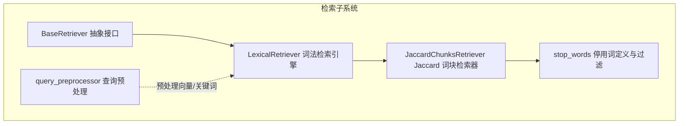
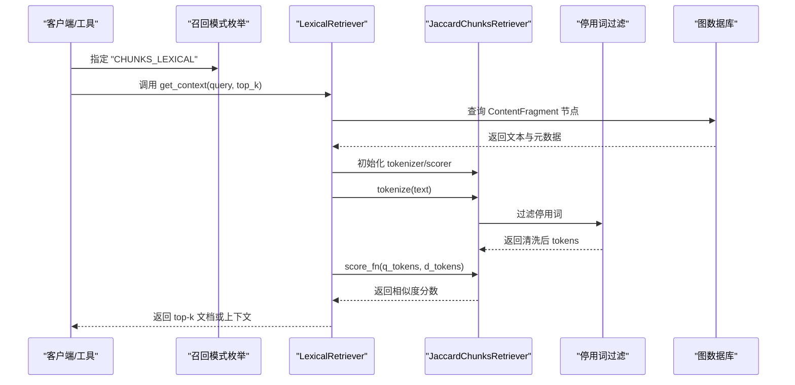
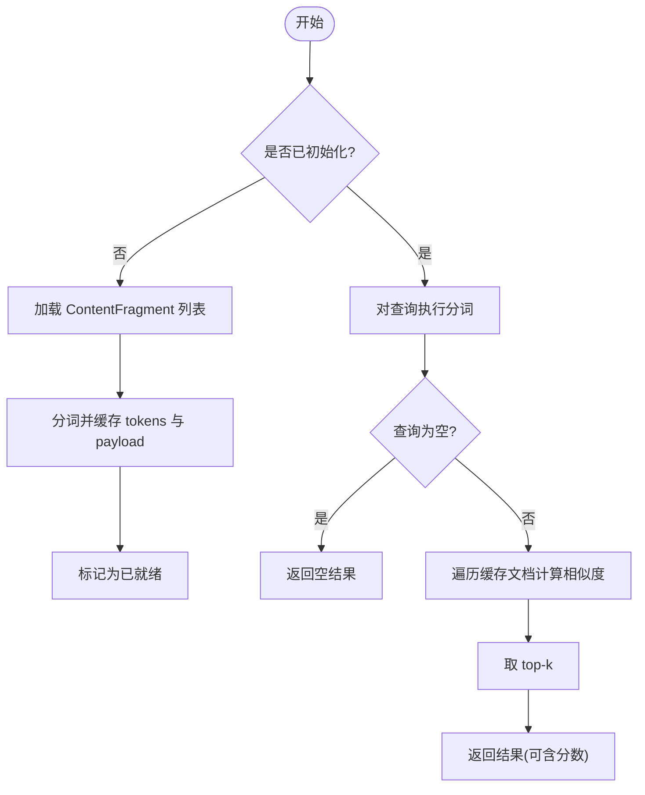
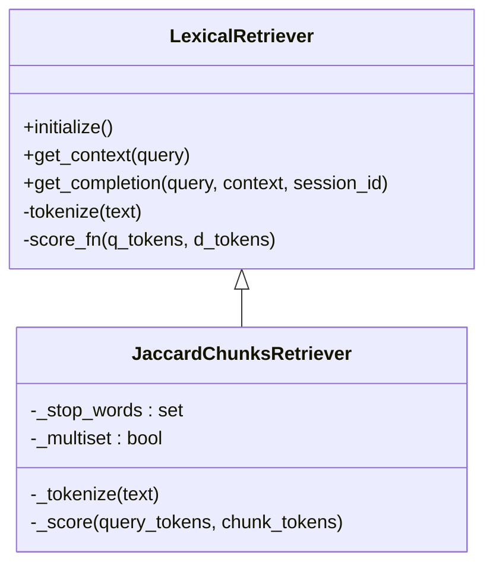
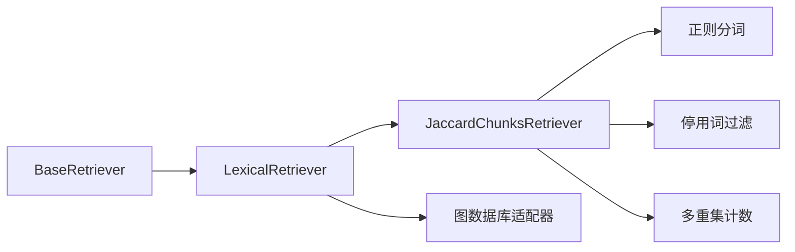

# 词汇检索模式

<cite>
**本文引用的文件**
- [lexical_retriever.py](file://m_flow/retrieval/lexical_retriever.py)
- [jaccard_retrival.py](file://m_flow/retrieval/jaccard_retrival.py)
- [stop_words.py](file://m_flow/retrieval/utils/stop_words.py)
- [query_preprocessor.py](file://m_flow/retrieval/episodic/query_preprocessor.py)
- [RecallMode.py](file://m_flow/search/types/RecallMode.py)
- [test_e2e_real.py](file://m_flow-mcp/src/test_e2e_real.py)
- [env_registry.py](file://m_flow/config/env_registry.py)
- [base_retriever.py](file://m_flow/retrieval/base_retriever.py)
</cite>

## 目录
1. [引言](#引言)
2. [项目结构](#项目结构)
3. [核心组件](#核心组件)
4. [架构总览](#架构总览)
5. [详细组件分析](#详细组件分析)
6. [依赖分析](#依赖分析)
7. [性能考虑](#性能考虑)
8. [故障排查指南](#故障排查指南)
9. [结论](#结论)
10. [附录](#附录)

## 引言
本文件系统性阐述“词汇检索模式”的设计与实现，重点覆盖以下方面：
- 基于关键词与词汇的文本检索流程与控制流
- Jaccard 相似度算法在检索中的实现与两种变体（集合型与多重集型）
- 停用词过滤机制及其对相关性与准确性的提升
- 词汇检索的预处理流程（分词、标准化、特征提取）
- 参数配置与优化策略
- 在不同应用场景下的效果对比与性能测试实践

## 项目结构
词汇检索模式位于检索子系统中，采用“可插拔分词器 + 可插拔评分器”的架构，支持通过继承基类快速扩展新的匹配策略。

图表来源
- [base_retriever.py:11-61](file://m_flow/retrieval/base_retriever.py#L11-L61)
- [lexical_retriever.py:21-175](file://m_flow/retrieval/lexical_retriever.py#L21-L175)
- [jaccard_retrival.py:14-68](file://m_flow/retrieval/jaccard_retrival.py#L14-L68)
- [stop_words.py:12-104](file://m_flow/retrieval/utils/stop_words.py#L12-L104)
- [query_preprocessor.py:97-142](file://m_flow/retrieval/episodic/query_preprocessor.py#L97-L142)

章节来源
- [lexical_retriever.py:1-175](file://m_flow/retrieval/lexical_retriever.py#L1-L175)
- [jaccard_retrival.py:1-68](file://m_flow/retrieval/jaccard_retrival.py#L1-L68)
- [stop_words.py:1-104](file://m_flow/retrieval/utils/stop_words.py#L1-L104)
- [query_preprocessor.py:1-250](file://m_flow/retrieval/episodic/query_preprocessor.py#L1-L250)
- [RecallMode.py:10-28](file://m_flow/search/types/RecallMode.py#L10-L28)

## 核心组件
- 词法检索引擎（LexicalRetriever）：提供统一的检索框架，负责从图数据库加载内容片段、执行分词与评分、返回 top-k 结果。
- Jaccard 词块检索器（JaccardChunksRetriever）：基于 Jaccard 相似度的词块级检索器，支持集合型与多重集型两种相似度计算方式，并内置停用词过滤。
- 停用词工具（stop_words）：提供默认英文停用词集合及过滤函数，用于提升检索关键词的有效性。
- 查询预处理（query_preprocessor）：为向量检索与关键词检索分别生成预处理后的查询文本，辅助混合检索触发与关键词抽取。

章节来源
- [lexical_retriever.py:21-175](file://m_flow/retrieval/lexical_retriever.py#L21-L175)
- [jaccard_retrival.py:14-68](file://m_flow/retrieval/jaccard_retrival.py#L14-L68)
- [stop_words.py:12-104](file://m_flow/retrieval/utils/stop_words.py#L12-L104)
- [query_preprocessor.py:97-142](file://m_flow/retrieval/episodic/query_preprocessor.py#L97-L142)

## 架构总览
下图展示了词汇检索模式在系统中的位置与交互关系，以及检索调用链路。

图表来源
- [RecallMode.py:10-28](file://m_flow/search/types/RecallMode.py#L10-L28)
- [lexical_retriever.py:60-153](file://m_flow/retrieval/lexical_retriever.py#L60-L153)
- [jaccard_retrival.py:19-67](file://m_flow/retrieval/jaccard_retrival.py#L19-L67)
- [stop_words.py:101-104](file://m_flow/retrieval/utils/stop_words.py#L101-L104)

## 详细组件分析

### 组件一：词法检索引擎（LexicalRetriever）
- 职责
  - 从图数据库加载 ContentFragment 节点，构建文档索引（文档ID -> tokens 与 payload）
  - 对查询与每个文档执行分词与评分，按分数取 top-k
  - 支持返回带分数或不带分数的结果
- 关键流程
  - initialize：异步加载并缓存所有文档的 tokens 与元数据
  - get_context：对查询分词，遍历文档计算相似度，返回 top-k
  - get_completion：直接返回上下文（与 get_context 等价）

图表来源
- [lexical_retriever.py:60-153](file://m_flow/retrieval/lexical_retriever.py#L60-L153)

章节来源
- [lexical_retriever.py:21-175](file://m_flow/retrieval/lexical_retriever.py#L21-L175)
- [base_retriever.py:11-61](file://m_flow/retrieval/base_retriever.py#L11-L61)

### 组件二：Jaccard 词块检索器（JaccardChunksRetriever）
- 功能特性
  - 使用正则表达式提取词元并统一转小写
  - 内置停用词集合，过滤低信息词
  - 提供两种相似度计算：
    - 集合型：基于 set 的交并比
    - 多重集型：基于 Counter 的最小/最大值聚合，考虑词频
- 参数
  - top_k：返回数量
  - with_scores：是否返回分数
  - stop_words：自定义停用词列表
  - multiset_jaccard：是否启用多重集型 Jaccard

图表来源
- [lexical_retriever.py:21-175](file://m_flow/retrieval/lexical_retriever.py#L21-L175)
- [jaccard_retrival.py:14-68](file://m_flow/retrieval/jaccard_retrival.py#L14-L68)

章节来源
- [jaccard_retrival.py:14-68](file://m_flow/retrieval/jaccard_retrival.py#L14-L68)
- [stop_words.py:12-104](file://m_flow/retrieval/utils/stop_words.py#L12-L104)

### 组件三：停用词过滤机制
- 默认停用词类别
  - 冠词、连词、介词、代词、指示词、系动词、助动词、情态动词、疑问词、否定词等
- 过滤策略
  - 在分词后统一小写化，移除停用词
  - 既可用于 Jaccard 分词，也可用于通用关键词抽取
- 影响
  - 减少噪声词对相似度的影响，提升关键词检索的准确性与相关性

章节来源
- [stop_words.py:12-104](file://m_flow/retrieval/utils/stop_words.py#L12-L104)

### 组件四：查询预处理（面向向量/关键词检索）
- 作用
  - 解析时间表达式，剥离时间信息以增强向量检索
  - 移除对向量检索无语义价值的问题词
  - 根据规则判定是否启用混合检索（如包含数字、中英混杂、关键词过短）
  - 提取关键词（依据触发原因选择不同抽取策略）
- 与词汇检索的关系
  - 为向量检索提供更干净的查询文本
  - 为关键词/词汇检索提供核心关键词集合

章节来源
- [query_preprocessor.py:97-142](file://m_flow/retrieval/episodic/query_preprocessor.py#L97-L142)
- [query_preprocessor.py:187-234](file://m_flow/retrieval/episodic/query_preprocessor.py#L187-L234)

## 依赖分析
- 继承关系
  - JaccardChunksRetriever 继承 LexicalRetriever，复用其加载与评分框架
- 外部依赖
  - 图数据库适配器：用于加载 ContentFragment
  - 正则表达式：用于分词与模式匹配
  - 计数器（Counter）：用于多重集型 Jaccard 计算
- 内聚与耦合
  - LexicalRetriever 与具体分词/评分解耦，通过回调注入
  - JaccardChunksRetriever 仅耦合于分词与评分两个接口

图表来源
- [base_retriever.py:11-61](file://m_flow/retrieval/base_retriever.py#L11-L61)
- [lexical_retriever.py:69-106](file://m_flow/retrieval/lexical_retriever.py#L69-L106)
- [jaccard_retrival.py:50-67](file://m_flow/retrieval/jaccard_retrival.py#L50-L67)
- [stop_words.py:101-104](file://m_flow/retrieval/utils/stop_words.py#L101-L104)

## 性能考虑
- 分词与评分复杂度
  - 分词：O(n)，n 为文本长度
  - 集合型 Jaccard：O(|A| + |B|)，其中 A、B 为去重后的词集合
  - 多重集型 Jaccard：O(|V|)，V 为词汇表大小（去重后）
- 缓存与并发
  - 初始化阶段一次性加载并缓存 tokens，避免重复 IO
  - 使用异步锁保证初始化幂等
- 评分与排序
  - 使用堆选择 top-k，避免全排序带来的 O(N log N) 开销
- 停用词过滤
  - 在分词后过滤，减少后续相似度计算的词项数量

章节来源
- [lexical_retriever.py:60-153](file://m_flow/retrieval/lexical_retriever.py#L60-L153)
- [jaccard_retrival.py:55-67](file://m_flow/retrieval/jaccard_retrival.py#L55-L67)

## 故障排查指南
- 常见问题与定位
  - 未加载到任何文档：检查图数据库中是否存在 ContentFragment 类型节点，确认初始化日志输出
  - 查询为空或分词后为空：确认输入是否为空或仅包含停用词
  - 评分异常：检查评分函数返回值类型，确保为数值
- 日志与错误
  - 初始化失败会抛出特定异常，需检查图数据库连接与权限
  - 分词失败或无效节点结构会记录警告并跳过

章节来源
- [lexical_retriever.py:60-106](file://m_flow/retrieval/lexical_retriever.py#L60-L106)
- [lexical_retriever.py:125-144](file://m_flow/retrieval/lexical_retriever.py#L125-L144)

## 结论
词汇检索模式通过“可插拔分词 + 可插拔评分”的架构，实现了高效且可扩展的关键词/词汇检索。Jaccard 相似度提供了简洁而有效的匹配能力，结合停用词过滤与查询预处理，能够在多种场景下显著提升检索的相关性与准确性。通过合理的参数配置与性能优化策略，可在大规模文档集合上稳定运行。

## 附录

### 参数配置与优化策略
- 常用参数
  - top_k：控制返回结果数量
  - with_scores：是否需要相似度分数
  - stop_words：自定义停用词列表
  - multiset_jaccard：是否启用多重集型 Jaccard
- 环境变量（与检索相关）
  - 可通过环境变量注册表集中管理检索相关配置（例如宽搜候选数、显示模式等），便于部署与运维
- 优化建议
  - 合理设置 top_k，避免过多无关结果干扰
  - 在多语言混合场景下启用多重集型 Jaccard 以提升稳定性
  - 结合查询预处理，针对向量检索与关键词检索分别优化输入

章节来源
- [jaccard_retrival.py:19-48](file://m_flow/retrieval/jaccard_retrival.py#L19-L48)
- [env_registry.py:14-352](file://m_flow/config/env_registry.py#L14-L352)

### 应用场景与效果对比
- 场景示例
  - 实体与概念检索：如“爱因斯坦”“相对论”，适合使用关键词匹配与 Jaccard 相似度
  - 混合检索：结合向量检索与关键词检索，提升召回质量
- 测试实践
  - 端到端测试中演示了“CHUNKS_LEXICAL”模式的调用方式与期望命中关键词的行为

章节来源
- [test_e2e_real.py:159-171](file://m_flow-mcp/src/test_e2e_real.py#L159-L171)
- [RecallMode.py:17-18](file://m_flow/search/types/RecallMode.py#L17-L18)