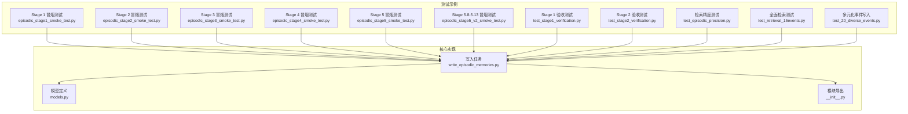
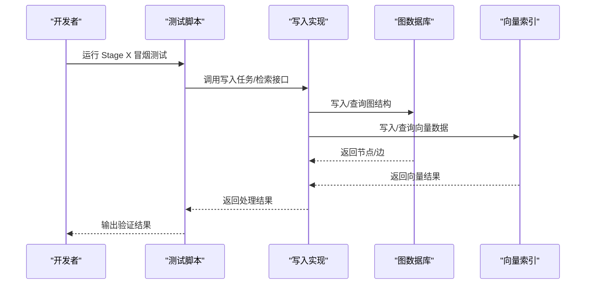
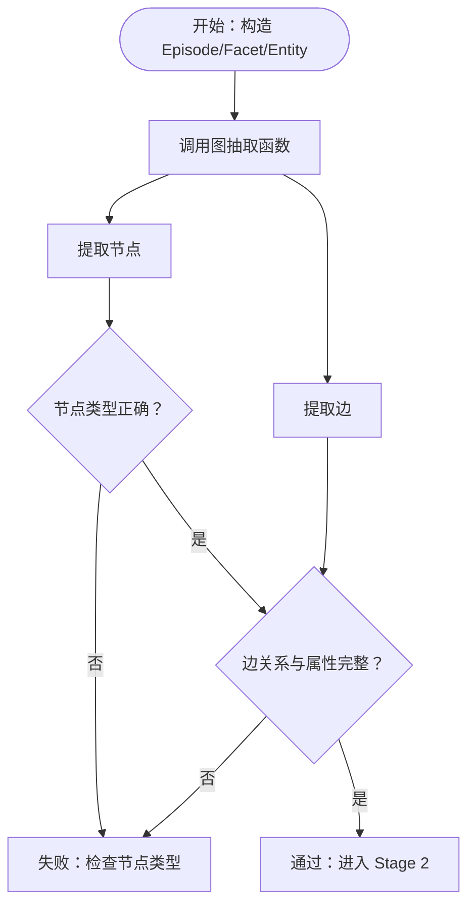
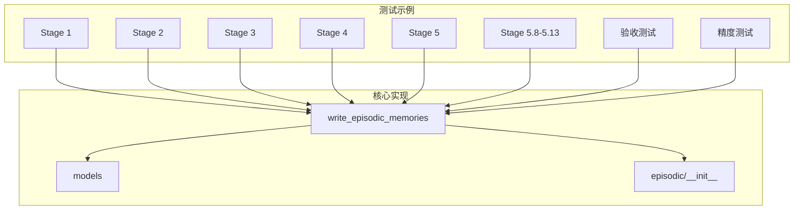

# 事件记忆测试示例

<cite>
**本文档引用的文件**
- [episodic_stage1_smoke_test.py](file://examples/episodic_stage1_smoke_test.py)
- [episodic_stage2_smoke_test.py](file://examples/episodic_stage2_smoke_test.py)
- [episodic_stage3_smoke_test.py](file://examples/episodic_stage3_smoke_test.py)
- [episodic_stage4_smoke_test.py](file://examples/episodic_stage4_smoke_test.py)
- [episodic_stage5_smoke_test.py](file://examples/episodic_stage5_smoke_test.py)
- [episodic_stage5_v2_smoke_test.py](file://examples/episodic_stage5_v2_smoke_test.py)
- [test_stage1_verification.py](file://examples/test_stage1_verification.py)
- [test_stage2_verification.py](file://examples/test_stage2_verification.py)
- [test_episodic_precision.py](file://examples/test_episodic_precision.py)
- [test_retrieval_15events.py](file://examples/test_retrieval_15events.py)
- [test_20_diverse_events.py](file://examples/test_20_diverse_events.py)
- [write_episodic_memories.py](file://m_flow/memory/episodic/write_episodic_memories.py)
- [models.py](file://m_flow/memory/episodic/models.py)
- [__init__.py](file://m_flow/memory/episodic/__init__.py)
</cite>

## 目录
1. [简介](#简介)
2. [项目结构](#项目结构)
3. [核心组件](#核心组件)
4. [架构概览](#架构概览)
5. [详细组件分析](#详细组件分析)
6. [依赖分析](#依赖分析)
7. [性能考虑](#性能考虑)
8. [故障排除指南](#故障排除指南)
9. [结论](#结论)
10. [附录](#附录)

## 简介
本文件为 M-flow 事件记忆测试示例的专门文档，系统性介绍事件记忆系统的五个阶段冒烟测试与版本 2 改进测试。文档涵盖事件记忆的构建过程、验证方法与性能指标，提供完整的测试流程说明（数据准备、执行步骤与结果分析），并详细阐述每个阶段的目标、测试用例与预期行为。此外，文档包含事件记忆的质量评估、精度测量与稳定性测试方法，并提供调试信息与故障排除指南。

## 项目结构
事件记忆测试示例位于 examples 目录，围绕 Stage 1 至 Stage 5 的冒烟测试与版本 2 改进测试展开，配套的验收测试与检索精度测试进一步完善了验证体系。

**图表来源**
- [episodic_stage1_smoke_test.py:1-211](file://examples/episodic_stage1_smoke_test.py#L1-L211)
- [episodic_stage2_smoke_test.py:1-210](file://examples/episodic_stage2_smoke_test.py#L1-L210)
- [episodic_stage3_smoke_test.py:1-283](file://examples/episodic_stage3_smoke_test.py#L1-L283)
- [episodic_stage4_smoke_test.py:1-223](file://examples/episodic_stage4_smoke_test.py#L1-L223)
- [episodic_stage5_smoke_test.py:1-256](file://examples/episodic_stage5_smoke_test.py#L1-L256)
- [episodic_stage5_v2_smoke_test.py:1-237](file://examples/episodic_stage5_v2_smoke_test.py#L1-L237)
- [test_stage1_verification.py:1-191](file://examples/test_stage1_verification.py#L1-L191)
- [test_stage2_verification.py:1-170](file://examples/test_stage2_verification.py#L1-L170)
- [test_episodic_precision.py:1-203](file://examples/test_episodic_precision.py#L1-L203)
- [test_retrieval_15events.py:1-180](file://examples/test_retrieval_15events.py#L1-L180)
- [test_20_diverse_events.py:1-800](file://examples/test_20_diverse_events.py#L1-L800)
- [write_episodic_memories.py:1-1002](file://m_flow/memory/episodic/write_episodic_memories.py#L1-L1002)
- [models.py:1-548](file://m_flow/memory/episodic/models.py#L1-L548)
- [__init__.py:1-269](file://m_flow/memory/episodic/__init__.py#L1-L269)

**章节来源**
- [episodic_stage1_smoke_test.py:1-211](file://examples/episodic_stage1_smoke_test.py#L1-L211)
- [episodic_stage2_smoke_test.py:1-210](file://examples/episodic_stage2_smoke_test.py#L1-L210)
- [episodic_stage3_smoke_test.py:1-283](file://examples/episodic_stage3_smoke_test.py#L1-L283)
- [episodic_stage4_smoke_test.py:1-223](file://examples/episodic_stage4_smoke_test.py#L1-L223)
- [episodic_stage5_smoke_test.py:1-256](file://examples/episodic_stage5_smoke_test.py#L1-L256)
- [episodic_stage5_v2_smoke_test.py:1-237](file://examples/episodic_stage5_v2_smoke_test.py#L1-L237)
- [test_stage1_verification.py:1-191](file://examples/test_stage1_verification.py#L1-L191)
- [test_stage2_verification.py:1-170](file://examples/test_stage2_verification.py#L1-L170)
- [test_episodic_precision.py:1-203](file://examples/test_episodic_precision.py#L1-L203)
- [test_retrieval_15events.py:1-180](file://examples/test_retrieval_15events.py#L1-L180)
- [test_20_diverse_events.py:1-800](file://examples/test_20_diverse_events.py#L1-L800)

## 核心组件
- 事件记忆写入任务：负责将内容摘要转换为 Episode、Facet 与富语义边，并持久化到图数据库与向量索引。
- 检索与评分：提供三元组检索、评分函数与文本注入逻辑，支持严格模式与上限裁剪。
- 模型与工具：包含别名处理、语义合并、规范化与提示词升级等增强功能。
- 验收与精度测试：验证静态结构、写入质量与检索精度。

**章节来源**
- [write_episodic_memories.py:1-1002](file://m_flow/memory/episodic/write_episodic_memories.py#L1-L1002)
- [models.py:1-548](file://m_flow/memory/episodic/models.py#L1-L548)
- [__init__.py:1-269](file://m_flow/memory/episodic/__init__.py#L1-L269)

## 架构概览
事件记忆测试示例围绕五个阶段展开，从图结构抽取到写入质量增强，再到别名兜底召回与语义同义合并，形成完整的冒烟与验收测试链路。

**图表来源**
- [write_episodic_memories.py:178-663](file://m_flow/memory/episodic/write_episodic_memories.py#L178-L663)
- [episodic_stage1_smoke_test.py:53-210](file://examples/episodic_stage1_smoke_test.py#L53-L210)
- [episodic_stage2_smoke_test.py:37-210](file://examples/episodic_stage2_smoke_test.py#L37-L210)
- [episodic_stage3_smoke_test.py:213-283](file://examples/episodic_stage3_smoke_test.py#L213-L283)
- [episodic_stage4_smoke_test.py:157-223](file://examples/episodic_stage4_smoke_test.py#L157-L223)
- [episodic_stage5_smoke_test.py:213-256](file://examples/episodic_stage5_smoke_test.py#L213-L256)
- [episodic_stage5_v2_smoke_test.py:189-237](file://examples/episodic_stage5_v2_smoke_test.py#L189-L237)

## 详细组件分析

### Stage 1 冒烟测试：图结构抽取
- 目标：验证 Episode/Facet/Entity 节点与 has_facet、involves_entity 边的抽取正确性，以及边属性 edge_text 的完整性。
- 关键验证点：
  - 节点类型：Episode、Facet、Entity
  - 边关系：has_facet、involves_entity
  - 边属性：edge_text、relationship_name
- 执行流程：
  - 构造 Entity、Facet、Episode
  - 调用图抽取函数提取节点与边
  - 校验节点/边数量与属性存在性
- 预期结果：全部通过表示图结构抽取正确，可进入 Stage 2。

**图表来源**
- [episodic_stage1_smoke_test.py:53-210](file://examples/episodic_stage1_smoke_test.py#L53-L210)

**章节来源**
- [episodic_stage1_smoke_test.py:1-211](file://examples/episodic_stage1_smoke_test.py#L1-L211)

### Stage 2 冒烟测试：写入任务验证
- 目标：验证 write_episodic_memories 任务在 MOCK 模式下的正确性，包括 Episode、Facet 的生成与富语义边的写入。
- 关键验证点：
  - 保持原始摘要
  - 新增 MemorySpace（Episodic）
  - Episode 带有 has_facet/involves_entity 关系
  - Episode 的 memory_spaces 指向 Episodic MemorySpace
- 执行流程：
  - 设置 MOCK_EPISODIC 环境变量
  - 构造 Document、ContentFragment、FragmentDigest
  - 调用写入任务并分析返回结果
  - 使用图抽取验证 Episode 的图结构
- 预期结果：返回包含 FragmentDigest、MemorySpace、Episode 的列表，且 Episode 具备正确的边关系。

**章节来源**
- [episodic_stage2_smoke_test.py:1-210](file://examples/episodic_stage2_smoke_test.py#L1-L210)
- [write_episodic_memories.py:178-663](file://m_flow/memory/episodic/write_episodic_memories.py#L178-L663)

### Stage 3 冒烟测试：检索逻辑验证
- 目标：验证 episodic_triplet_search 的检索逻辑、评分函数与文本注入功能。
- 关键验证点：
  - 导入与接口：episodic_triplet_search、EpisodicRetriever、RecallMode.EPISODIC
  - 评分函数：_score_triplet 的距离计算
  - 文本注入：_inject_text_for_episodic_nodes 的 text 字段注入
  - 集成：get_recall_mode_tools 返回检索工具
- 执行流程：
  - 逐项测试导入与接口
  - 验证评分函数与文本注入逻辑
  - 验证 RecallMode.EPISODIC 集成
- 预期结果：所有测试通过，可使用 RecallMode.EPISODIC 进行检索。

**章节来源**
- [episodic_stage3_smoke_test.py:1-283](file://examples/episodic_stage3_smoke_test.py#L1-L283)

### Stage 4 冒烟测试：ID 过滤投影与严格模式
- 目标：验证 MemorySpace ID 过滤投影、严格模式与上限裁剪。
- 关键验证点：
  - KuzuAdapter 新增方法：get_nodeset_id_filtered_graph_data
  - MemoryGraph 支持 strict_nodeset_filtering 与 relevant_ids 过滤
  - episodic_triplet_search 启用 strict_nodeset_filtering 与 max_relevant_ids
  - 向后兼容：strict 默认 False
- 执行流程：
  - 验证方法签名与参数
  - 检查 strict 模式逻辑与上限裁剪
  - 验证向后兼容性
- 预期结果：严格模式下查询命中范围受限，日志显示投影规模，向后兼容性良好。

**章节来源**
- [episodic_stage4_smoke_test.py:1-223](file://examples/episodic_stage4_smoke_test.py#L1-L223)

### Stage 5 冒烟测试：写入质量增强
- 目标：验证 Facet/Episode 模型增强、Prompt 升级、Facet 去重合并、证据回溯边与 PGVector upsert 修正。
- 关键验证点：
  - 模型增强：Facet.aliases、Facet.supported_by、Episode.includes_chunk
  - Episode State：fetch_episode_state 与 EpisodeState/ExistingFacet
  - Prompt 升级：v2 prompt 包含 EXISTING_FACETS 与去重指令
  - Facet 合并：normalize + merge_facets_by_string
  - 证据回溯：supported_by、includes_chunk 边
  - PGVector upsert：on_conflict_do_update
- 执行流程：
  - 逐一测试模型增强与函数存在性
  - 验证 Prompt 内容与指令
  - 验证 Facet 合并逻辑
  - 验证证据边生成函数
  - 检查 PGVector 源码修正
- 预期结果：所有增强功能通过，写入质量显著提升。

**章节来源**
- [episodic_stage5_smoke_test.py:1-256](file://examples/episodic_stage5_smoke_test.py#L1-L256)

### Stage 5.8-5.13 冒烟测试：别名兜底召回与语义合并
- 目标：验证 Facet.aliases_text 索引字段、别名更新、语义合并与检索 v2。
- 关键验证点：
  - Facet.aliases_text 参与索引
  - LLM 输出模型：EpisodicFacetDraft.aliases、EpisodicAliasUpdate、EpisodicWriteDraft.alias_updates
  - 别名工具：is_bad_alias、clean_aliases、make_aliases_text
  - 语义合并：SemanticFacetMatcher、ExistingFacetInfo
  - 写入 v3：alias_updates、aliases_text、make_aliases_text、SemanticFacetMatcher
  - 检索 v2：Facet_anchor_text 集合、best-by-id 聚合
- 执行流程：
  - 测试别名索引字段与 LLM 模型
  - 验证别名工具与语义合并
  - 验证写入 v3 与检索 v2
- 预期结果：别名兜底召回与语义合并功能完备，检索稳定性提升。

**章节来源**
- [episodic_stage5_v2_smoke_test.py:1-237](file://examples/episodic_stage5_v2_smoke_test.py#L1-L237)

### 验收测试与精度评估
- Stage 1 验收测试：验证 FacetPoint 文件存在、Facet.metadata.index_fields 包含 anchor_text、episodic_triplet_search 投影字段包含 anchor_text，并构造 Facet-has_point 边进行结构验收。
- Stage 2 验收测试：通过真实数据写入，检查图数据库中的 FacetPoint 节点、has_point 边、Facet.anchor_text 与向量库集合（Facet_anchor_text、FacetPoint_search_text、FacetPoint_aliases_text）。
- 精度测试：对多个查询进行检索精度评估，统计关键词匹配率与最佳匹配排名，评估 Top-K 结果的相关性。

**章节来源**
- [test_stage1_verification.py:1-191](file://examples/test_stage1_verification.py#L1-L191)
- [test_stage2_verification.py:1-170](file://examples/test_stage2_verification.py#L1-L170)
- [test_episodic_precision.py:1-203](file://examples/test_episodic_precision.py#L1-L203)
- [test_retrieval_15events.py:1-180](file://examples/test_retrieval_15events.py#L1-L180)
- [test_20_diverse_events.py:1-800](file://examples/test_20_diverse_events.py#L1-L800)

## 依赖分析
事件记忆测试示例与核心实现之间的依赖关系如下：

**图表来源**
- [write_episodic_memories.py:1-1002](file://m_flow/memory/episodic/write_episodic_memories.py#L1-L1002)
- [models.py:1-548](file://m_flow/memory/episodic/models.py#L1-L548)
- [__init__.py:1-269](file://m_flow/memory/episodic/__init__.py#L1-L269)
- [episodic_stage1_smoke_test.py:1-211](file://examples/episodic_stage1_smoke_test.py#L1-L211)
- [episodic_stage2_smoke_test.py:1-210](file://examples/episodic_stage2_smoke_test.py#L1-L210)
- [episodic_stage3_smoke_test.py:1-283](file://examples/episodic_stage3_smoke_test.py#L1-L283)
- [episodic_stage4_smoke_test.py:1-223](file://examples/episodic_stage4_smoke_test.py#L1-L223)
- [episodic_stage5_smoke_test.py:1-256](file://examples/episodic_stage5_smoke_test.py#L1-L256)
- [episodic_stage5_v2_smoke_test.py:1-237](file://examples/episodic_stage5_v2_smoke_test.py#L1-L237)
- [test_stage1_verification.py:1-191](file://examples/test_stage1_verification.py#L1-L191)
- [test_stage2_verification.py:1-170](file://examples/test_stage2_verification.py#L1-L170)
- [test_episodic_precision.py:1-203](file://examples/test_episodic_precision.py#L1-L203)
- [test_retrieval_15events.py:1-180](file://examples/test_retrieval_15events.py#L1-L180)
- [test_20_diverse_events.py:1-800](file://examples/test_20_diverse_events.py#L1-L800)

**章节来源**
- [write_episodic_memories.py:1-1002](file://m_flow/memory/episodic/write_episodic_memories.py#L1-L1002)
- [models.py:1-548](file://m_flow/memory/episodic/models.py#L1-L548)
- [__init__.py:1-269](file://m_flow/memory/episodic/__init__.py#L1-L269)

## 性能考虑
- 严格模式与上限裁剪：Stage 4 引入 strict_nodeset_filtering 与 max_relevant_ids，减少投影规模，避免全量扫描带来的性能开销。
- 向后兼容：strict 默认 False，确保现有 MemorySpace 检索不受影响。
- 检索稳定性：Stage 5.8-5.13 的 best-by-id 聚合防止多集合命中时排序抖动，提升检索稳定性。
- 写入优化：别名与语义合并减少冗余 Facet，降低存储与检索压力。

[本节为通用指导，无需特定文件引用]

## 故障排除指南
- 图结构抽取失败：检查节点类型与边属性是否存在，确保 edge_text 与 relationship_name 完整。
- 写入任务异常：确认 MOCK_EPISODIC 环境变量设置，验证输入数据结构（Document、ContentFragment、FragmentDigest）。
- 检索无结果：检查 RecallMode.EPISODIC 是否正确集成，确认向量库集合存在且包含相应索引字段。
- 严格模式误判：确认 strict_nodeset_filtering 配置，必要时关闭严格模式以验证全量投影。
- 写入质量异常：检查 Facet.aliases_text 生成与 PGVector upsert 逻辑，确保 on_conflict_do_update 正确应用。

**章节来源**
- [episodic_stage1_smoke_test.py:133-206](file://examples/episodic_stage1_smoke_test.py#L133-L206)
- [episodic_stage2_smoke_test.py:169-202](file://examples/episodic_stage2_smoke_test.py#L169-L202)
- [episodic_stage3_smoke_test.py:241-278](file://examples/episodic_stage3_smoke_test.py#L241-L278)
- [episodic_stage4_smoke_test.py:181-218](file://examples/episodic_stage4_smoke_test.py#L181-L218)
- [episodic_stage5_smoke_test.py:213-251](file://examples/episodic_stage5_smoke_test.py#L213-L251)
- [episodic_stage5_v2_smoke_test.py:189-232](file://examples/episodic_stage5_v2_smoke_test.py#L189-L232)

## 结论
事件记忆测试示例通过 Stage 1 至 Stage 5 的冒烟测试与版本 2 改进测试，系统验证了图结构抽取、写入任务、检索逻辑、严格模式、写入质量增强与别名兜底召回等关键能力。配合验收测试与精度评估，确保事件记忆系统在准确性、稳定性与性能方面达到预期。开发者可依据本指南快速定位问题并进行针对性优化。

[本节为总结性内容，无需特定文件引用]

## 附录
- 测试执行建议：
  - Stage 1-2：使用 Python 直接运行对应测试脚本，观察节点/边与写入结果。
  - Stage 3-4：在具备图数据库与向量索引的环境中运行，验证检索与投影逻辑。
  - Stage 5/5.8-5.13：启用相关环境变量，验证模型增强与别名/语义合并功能。
- 数据准备：
  - 使用 test_20_diverse_events.py 生成多元化事件数据，覆盖不同格式与主题。
  - 使用 test_retrieval_15events.py 进行全面检索测试，评估跨领域检索能力。
- 结果分析：
  - 精度测试通过关键词匹配率与最佳排名评估检索质量。
  - 验收测试通过图数据库与向量库的实际查询结果验证结构完整性。

**章节来源**
- [test_20_diverse_events.py:1-800](file://examples/test_20_diverse_events.py#L1-L800)
- [test_retrieval_15events.py:1-180](file://examples/test_retrieval_15events.py#L1-L180)
- [test_episodic_precision.py:1-203](file://examples/test_episodic_precision.py#L1-L203)