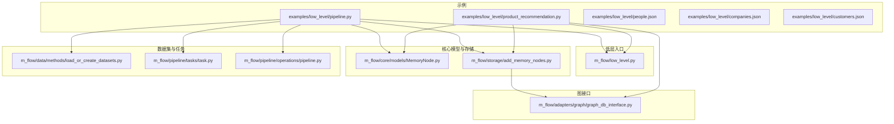
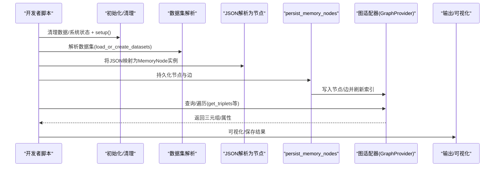
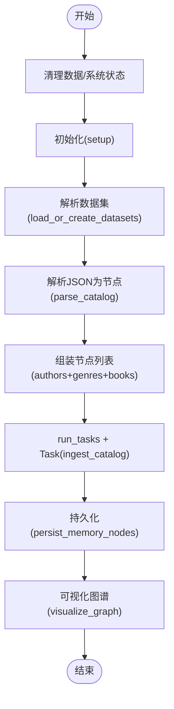
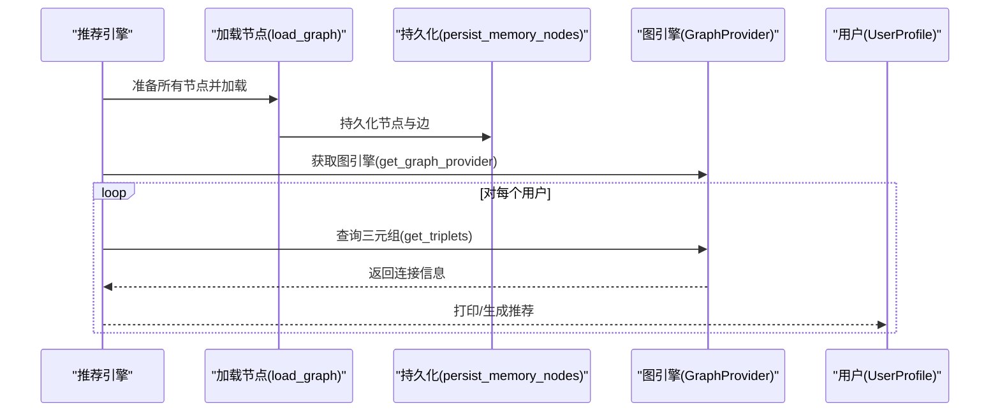
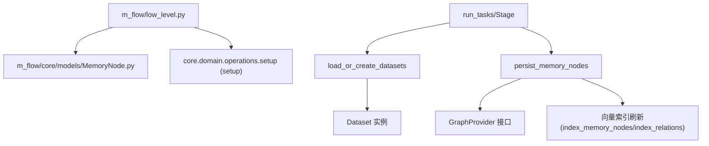

# 低层 API 使用示例

<cite>
**本文引用的文件**
- [examples/low_level/pipeline.py](file://examples/low_level/pipeline.py)
- [examples/low_level/product_recommendation.py](file://examples/low_level/product_recommendation.py)
- [examples/low_level/people.json](file://examples/low_level/people.json)
- [examples/low_level/companies.json](file://examples/low_level/companies.json)
- [examples/low_level/customers.json](file://examples/low_level/customers.json)
- [m_flow/low_level.py](file://m_flow/low_level.py)
- [m_flow/core/models/MemoryNode.py](file://m_flow/core/models/MemoryNode.py)
- [m_flow/storage/add_memory_nodes.py](file://m_flow/storage/add_memory_nodes.py)
- [m_flow/adapters/graph/graph_db_interface.py](file://m_flow/adapters/graph/graph_db_interface.py)
- [m_flow/data/methods/load_or_create_datasets.py](file://m_flow/data/methods/load_or_create_datasets.py)
- [m_flow/pipeline/tasks/task.py](file://m_flow/pipeline/tasks/task.py)
- [m_flow/pipeline/operations/pipeline.py](file://m_flow/pipeline/operations/pipeline.py)
</cite>

## 目录
1. [简介](#简介)
2. [项目结构](#项目结构)
3. [核心组件](#核心组件)
4. [架构总览](#架构总览)
5. [详细组件分析](#详细组件分析)
6. [依赖分析](#依赖分析)
7. [性能考量](#性能考量)
8. [故障排查指南](#故障排查指南)
9. [结论](#结论)
10. [附录](#附录)

## 简介
本文件面向需要对 M-flow 行为进行精细控制的高级开发者，系统性讲解“低层 API”的使用方法与最佳实践。内容涵盖：
- 直接调用底层功能（图存储、节点持久化、任务编排）的实现方式
- 管道配置与产品推荐系统的低层实现
- JSON 数据格式与结构说明，以及如何准备和处理原始数据
- 完整的低层 API 调用示例：参数设置、错误处理、返回值解析
- 与高层 API 的区别与适用场景
- 性能、内存管理与并发处理建议
- 调试技巧与常见问题解决方案

## 项目结构
本次文档聚焦于“低层 API”相关的示例与核心模块，主要涉及以下路径：
- 示例：examples/low_level 下的管道与推荐示例及测试数据
- 核心模型与存储：m_flow/core/models/MemoryNode.py、m_flow/storage/add_memory_nodes.py
- 图接口：m_flow/adapters/graph/graph_db_interface.py
- 数据集与任务：m_flow/data/methods/load_or_create_datasets.py、m_flow/pipeline/tasks/task.py、m_flow/pipeline/operations/pipeline.py
- 低层入口：m_flow/low_level.py

图表来源
- [examples/low_level/pipeline.py:1-109](file://examples/low_level/pipeline.py#L1-L109)
- [examples/low_level/product_recommendation.py:1-151](file://examples/low_level/product_recommendation.py#L1-L151)
- [m_flow/low_level.py:1-23](file://m_flow/low_level.py#L1-L23)
- [m_flow/core/models/MemoryNode.py:1-106](file://m_flow/core/models/MemoryNode.py#L1-L106)
- [m_flow/storage/add_memory_nodes.py:1-261](file://m_flow/storage/add_memory_nodes.py#L1-L261)
- [m_flow/adapters/graph/graph_db_interface.py:1-347](file://m_flow/adapters/graph/graph_db_interface.py#L1-L347)
- [m_flow/data/methods/load_or_create_datasets.py:1-69](file://m_flow/data/methods/load_or_create_datasets.py#L1-L69)
- [m_flow/pipeline/tasks/task.py:1-152](file://m_flow/pipeline/tasks/task.py#L1-L152)
- [m_flow/pipeline/operations/pipeline.py:1-139](file://m_flow/pipeline/operations/pipeline.py#L1-L139)

章节来源
- [examples/low_level/pipeline.py:1-109](file://examples/low_level/pipeline.py#L1-L109)
- [examples/low_level/product_recommendation.py:1-151](file://examples/low_level/product_recommendation.py#L1-L151)
- [m_flow/low_level.py:1-23](file://m_flow/low_level.py#L1-L23)

## 核心组件
- 低层入口与基础类型
  - 通过 m_flow/low_level.py 暴露 MemoryNode 与 setup，作为低层使用的最小集合
- 内存节点模型
  - m_flow/core/models/MemoryNode.py 提供带版本、元数据、向量索引字段的基类，并支持 index_fields 元数据用于嵌入文本拼接
- 存储与图写入
  - m_flow/storage/add_memory_nodes.py 提供 persist_memory_nodes，负责输入校验、子图提取、去重、结构写入与向量索引刷新
- 图数据库适配器接口
  - m_flow/adapters/graph/graph_db_interface.py 定义统一的图操作接口（增删改查、遍历、指标等），并提供装饰器记录变更
- 数据集解析与任务编排
  - m_flow/data/methods/load_or_create_datasets.py 将标识符解析为 Dataset 实例
  - m_flow/pipeline/tasks/task.py 与 m_flow/pipeline/operations/pipeline.py 提供基于 Stage 的任务执行与工作流编排

章节来源
- [m_flow/low_level.py:1-23](file://m_flow/low_level.py#L1-L23)
- [m_flow/core/models/MemoryNode.py:1-106](file://m_flow/core/models/MemoryNode.py#L1-L106)
- [m_flow/storage/add_memory_nodes.py:1-261](file://m_flow/storage/add_memory_nodes.py#L1-L261)
- [m_flow/adapters/graph/graph_db_interface.py:1-347](file://m_flow/adapters/graph/graph_db_interface.py#L1-L347)
- [m_flow/data/methods/load_or_create_datasets.py:1-69](file://m_flow/data/methods/load_or_create_datasets.py#L1-L69)
- [m_flow/pipeline/tasks/task.py:1-152](file://m_flow/pipeline/tasks/task.py#L1-L152)
- [m_flow/pipeline/operations/pipeline.py:1-139](file://m_flow/pipeline/operations/pipeline.py#L1-L139)

## 架构总览
低层 API 的典型调用链路如下：
- 初始化与清理：prune + setup
- 解析数据集：load_or_create_datasets
- 定义领域模型：继承 MemoryNode 并声明 metadata.index_fields
- 解析原始 JSON 为 MemoryNode 实例
- 持久化：persist_memory_nodes（写入图结构 + 向量索引）
- 查询/遍历：通过 get_graph_provider 获取适配器，执行 get_triplets 等查询
- 可选：可视化图谱或导出结果

图表来源
- [examples/low_level/pipeline.py:77-104](file://examples/low_level/pipeline.py#L77-L104)
- [examples/low_level/product_recommendation.py:135-147](file://examples/low_level/product_recommendation.py#L135-L147)
- [m_flow/storage/add_memory_nodes.py:220-261](file://m_flow/storage/add_memory_nodes.py#L220-L261)
- [m_flow/adapters/graph/graph_db_interface.py:270-275](file://m_flow/adapters/graph/graph_db_interface.py#L270-L275)

## 详细组件分析

### 组件一：低层管道示例（书籍目录到知识图谱）
该示例演示了从结构化 JSON 到知识图谱的完整流程，重点在于：
- 自定义 MemoryNode 类型（作者、类别、书等）
- 原始 JSON 的解析与节点构建
- 使用 run_tasks 与 Task 进行异步流水线执行
- 最终持久化与图可视化

图表来源
- [examples/low_level/pipeline.py:77-104](file://examples/low_level/pipeline.py#L77-L104)
- [m_flow/data/methods/load_or_create_datasets.py:17-57](file://m_flow/data/methods/load_or_create_datasets.py#L17-L57)
- [m_flow/storage/add_memory_nodes.py:220-261](file://m_flow/storage/add_memory_nodes.py#L220-L261)
- [m_flow/pipeline/operations/pipeline.py:46-84](file://m_flow/pipeline/operations/pipeline.py#L46-L84)

章节来源
- [examples/low_level/pipeline.py:1-109](file://examples/low_level/pipeline.py#L1-L109)
- [examples/low_level/people.json:1-17](file://examples/low_level/people.json#L1-L17)
- [m_flow/data/methods/load_or_create_datasets.py:1-69](file://m_flow/data/methods/load_or_create_datasets.py#L1-L69)
- [m_flow/pipeline/operations/pipeline.py:1-139](file://m_flow/pipeline/operations/pipeline.py#L1-L139)

### 组件二：产品推荐系统（菜系-食材-食谱-用户画像）
该示例展示了如何用低层 API 构建一个基于知识图谱的产品推荐系统：
- 定义领域模型（菜系、食材、饮食类型、食谱、用户画像）
- 将样本数据映射为节点与关系
- 通过 get_graph_provider 获取引擎，使用 get_triplets 遍历用户相关三元组
- 输出匹配结果

图表来源
- [examples/low_level/product_recommendation.py:120-147](file://examples/low_level/product_recommendation.py#L120-L147)
- [m_flow/storage/add_memory_nodes.py:220-261](file://m_flow/storage/add_memory_nodes.py#L220-L261)
- [m_flow/adapters/graph/graph_db_interface.py:270-275](file://m_flow/adapters/graph/graph_db_interface.py#L270-L275)

章节来源
- [examples/low_level/product_recommendation.py:1-151](file://examples/low_level/product_recommendation.py#L1-L151)
- [examples/low_level/companies.json:1-6](file://examples/low_level/companies.json#L1-L6)
- [examples/low_level/customers.json:1-7](file://examples/low_level/customers.json#L1-L7)

### 组件三：JSON 数据格式与结构
- 书籍目录样例（people.json）
  - 结构要点：顶层数组；每项包含作者列表与书籍条目；书籍条目包含标题、类型、作者列表
  - 用途：演示多对多关系与父子类型（如 BookCategory）
- 公司样例（companies.json）
  - 结构要点：公司名称、行业、员工数
  - 用途：演示简单实体与属性索引
- 客户样例（customers.json）
  - 结构要点：客户ID、姓名、等级、订单数
  - 用途：演示唯一标识与属性检索

章节来源
- [examples/low_level/people.json:1-17](file://examples/low_level/people.json#L1-L17)
- [examples/low_level/companies.json:1-6](file://examples/low_level/companies.json#L1-L6)
- [examples/low_level/customers.json:1-7](file://examples/low_level/customers.json#L1-L7)

### 组件四：低层 API 调用示例与参数设置
- 初始化与清理
  - prune.prune_data() 与 prune.prune_system(metadata=True) 清理历史数据与系统元数据
  - setup() 完成一次性数据库与索引初始化
- 数据集解析
  - load_or_create_datasets 将字符串名或 UUID 解析为 Dataset 实例，支持已存在数据集匹配与新数据集创建
- 节点持久化
  - persist_memory_nodes 接收 MemoryNode 列表，自动提取子图、去重、写入图结构并刷新向量索引
  - 支持传入 custom_edges 进行额外边的写入
- 图查询
  - get_graph_provider 获取具体图引擎后，可调用 get_triplets 等方法进行遍历与查询
- 任务编排
  - run_tasks + Task 包装任意可调用对象，统一异步迭代接口，便于流水线化执行

章节来源
- [examples/low_level/pipeline.py:77-104](file://examples/low_level/pipeline.py#L77-L104)
- [examples/low_level/product_recommendation.py:135-147](file://examples/low_level/product_recommendation.py#L135-L147)
- [m_flow/data/methods/load_or_create_datasets.py:17-57](file://m_flow/data/methods/load_or_create_datasets.py#L17-L57)
- [m_flow/storage/add_memory_nodes.py:220-261](file://m_flow/storage/add_memory_nodes.py#L220-L261)
- [m_flow/adapters/graph/graph_db_interface.py:270-275](file://m_flow/adapters/graph/graph_db_interface.py#L270-L275)
- [m_flow/pipeline/operations/pipeline.py:46-84](file://m_flow/pipeline/operations/pipeline.py#L46-L84)

### 组件五：错误处理与返回值解析
- 输入校验
  - persist_memory_nodes 在内部对传入节点进行类型校验，非列表或非 MemoryNode 将抛出异常
- 异常定位
  - 通过日志与异常消息快速定位问题（如无效输入、索引失败等）
- 返回值
  - persist_memory_nodes 返回传入的节点列表，便于链式调用
  - get_triplets 返回三元组列表，包含源节点属性、边属性与目标节点属性

章节来源
- [m_flow/storage/add_memory_nodes.py:33-39](file://m_flow/storage/add_memory_nodes.py#L33-L39)
- [m_flow/storage/add_memory_nodes.py:220-261](file://m_flow/storage/add_memory_nodes.py#L220-L261)
- [m_flow/adapters/graph/graph_db_interface.py:270-275](file://m_flow/adapters/graph/graph_db_interface.py#L270-L275)

### 组件六：与高层 API 的区别与适用场景
- 低层 API
  - 直接使用 MemoryNode、persist_memory_nodes、get_graph_provider 等，适合需要精细控制图结构、索引与查询的场景
  - 适用于自定义领域模型、复杂关系建模、离线批处理与可视化导出
- 高层 API
  - 通过内置工作流（如 add/memorize/search）完成端到端处理，适合快速集成与标准流程
- 选择建议
  - 若需完全掌控节点类型、索引策略与查询逻辑，优先低层 API
  - 若追求开箱即用与一致性，优先高层 API

章节来源
- [m_flow/low_level.py:1-23](file://m_flow/low_level.py#L1-L23)
- [examples/python/run_custom_pipeline_example.py:1-84](file://examples/python/run_custom_pipeline_example.py#L1-L84)

## 依赖分析
低层 API 的关键依赖关系如下：
- 低层入口依赖核心模型与初始化操作
- 节点持久化依赖图适配器接口与向量索引工具
- 任务编排依赖数据集解析与上下文设置

图表来源
- [m_flow/low_level.py:1-23](file://m_flow/low_level.py#L1-L23)
- [m_flow/core/models/MemoryNode.py:1-106](file://m_flow/core/models/MemoryNode.py#L1-L106)
- [m_flow/storage/add_memory_nodes.py:1-261](file://m_flow/storage/add_memory_nodes.py#L1-L261)
- [m_flow/adapters/graph/graph_db_interface.py:1-347](file://m_flow/adapters/graph/graph_db_interface.py#L1-L347)
- [m_flow/data/methods/load_or_create_datasets.py:1-69](file://m_flow/data/methods/load_or_create_datasets.py#L1-L69)
- [m_flow/pipeline/tasks/task.py:1-152](file://m_flow/pipeline/tasks/task.py#L1-L152)
- [m_flow/pipeline/operations/pipeline.py:1-139](file://m_flow/pipeline/operations/pipeline.py#L1-L139)

章节来源
- [m_flow/storage/add_memory_nodes.py:1-261](file://m_flow/storage/add_memory_nodes.py#L1-L261)
- [m_flow/adapters/graph/graph_db_interface.py:1-347](file://m_flow/adapters/graph/graph_db_interface.py#L1-L347)
- [m_flow/data/methods/load_or_create_datasets.py:1-69](file://m_flow/data/methods/load_or_create_datasets.py#L1-L69)
- [m_flow/pipeline/tasks/task.py:1-152](file://m_flow/pipeline/tasks/task.py#L1-L152)
- [m_flow/pipeline/operations/pipeline.py:1-139](file://m_flow/pipeline/operations/pipeline.py#L1-L139)

## 性能考量
- 并发与批量
  - 使用 asyncio.gather 并行提取子图，减少整体延迟
  - 通过 Stage 的 batch_size 控制批次大小，平衡吞吐与内存占用
- 写入顺序
  - 先写入图结构（节点/边），再进行向量索引；即使索引失败，也能保证查询可用
- 索引策略
  - 仅对 metadata.index_fields 中声明的字段进行嵌入文本拼接与索引，避免冗余计算
- I/O 与持久化
  - 针对 WAL 模式的嵌入数据库，可在关键写入后调用 checkpoint 以确保持久化

章节来源
- [m_flow/storage/add_memory_nodes.py:56-73](file://m_flow/storage/add_memory_nodes.py#L56-L73)
- [m_flow/storage/add_memory_nodes.py:94-125](file://m_flow/storage/add_memory_nodes.py#L94-L125)
- [m_flow/core/models/MemoryNode.py:64-98](file://m_flow/core/models/MemoryNode.py#L64-L98)
- [m_flow/pipeline/tasks/task.py:108-121](file://m_flow/pipeline/tasks/task.py#L108-L121)
- [m_flow/adapters/graph/graph_db_interface.py:332-346](file://m_flow/adapters/graph/graph_db_interface.py#L332-L346)

## 故障排查指南
- 输入类型错误
  - 现象：抛出“必须是列表”或“必须是 MemoryNode”的异常
  - 处理：确认传入为 MemoryNode 列表，且每个元素均为 MemoryNode 实例
- 索引失败
  - 现象：向量索引阶段报错但图结构仍可用
  - 处理：检查 index_fields 配置与字段值；必要时降低批次或禁用部分索引
- 查询为空
  - 现象：get_triplets 返回空列表
  - 处理：确认节点已持久化、metadata.index_fields 已正确设置、查询节点 ID 正确
- 权限与数据集
  - 现象：无法解析数据集或无权访问
  - 处理：使用 load_or_create_datasets 解析名称或 UUID，确保用户具备权限

章节来源
- [m_flow/storage/add_memory_nodes.py:33-39](file://m_flow/storage/add_memory_nodes.py#L33-L39)
- [m_flow/storage/add_memory_nodes.py:112-121](file://m_flow/storage/add_memory_nodes.py#L112-L121)
- [m_flow/data/methods/load_or_create_datasets.py:40-57](file://m_flow/data/methods/load_or_create_datasets.py#L40-L57)

## 结论
低层 API 为高级开发者提供了对 M-flow 的细粒度控制能力，包括领域模型设计、图结构写入、向量索引与查询遍历。通过合理的数据准备、参数配置与错误处理，可以在保证性能与稳定性的同时，灵活实现复杂的知识图谱应用（如产品推荐）。对于标准化流程，建议优先采用高层 API；当需要深度定制时，低层 API 是更优选择。

## 附录
- 快速上手步骤
  - 清理与初始化：prune + setup
  - 解析数据集：load_or_create_datasets
  - 定义领域模型：继承 MemoryNode 并设置 metadata.index_fields
  - 解析 JSON：将原始数据映射为节点实例
  - 持久化：persist_memory_nodes
  - 查询：get_graph_provider + get_triplets
  - 可选：run_tasks + Task 进行流水线执行

章节来源
- [examples/low_level/pipeline.py:77-104](file://examples/low_level/pipeline.py#L77-L104)
- [examples/low_level/product_recommendation.py:135-147](file://examples/low_level/product_recommendation.py#L135-L147)
- [m_flow/storage/add_memory_nodes.py:220-261](file://m_flow/storage/add_memory_nodes.py#L220-L261)
- [m_flow/adapters/graph/graph_db_interface.py:270-275](file://m_flow/adapters/graph/graph_db_interface.py#L270-L275)
- [m_flow/pipeline/operations/pipeline.py:46-84](file://m_flow/pipeline/operations/pipeline.py#L46-L84)