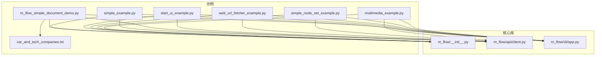
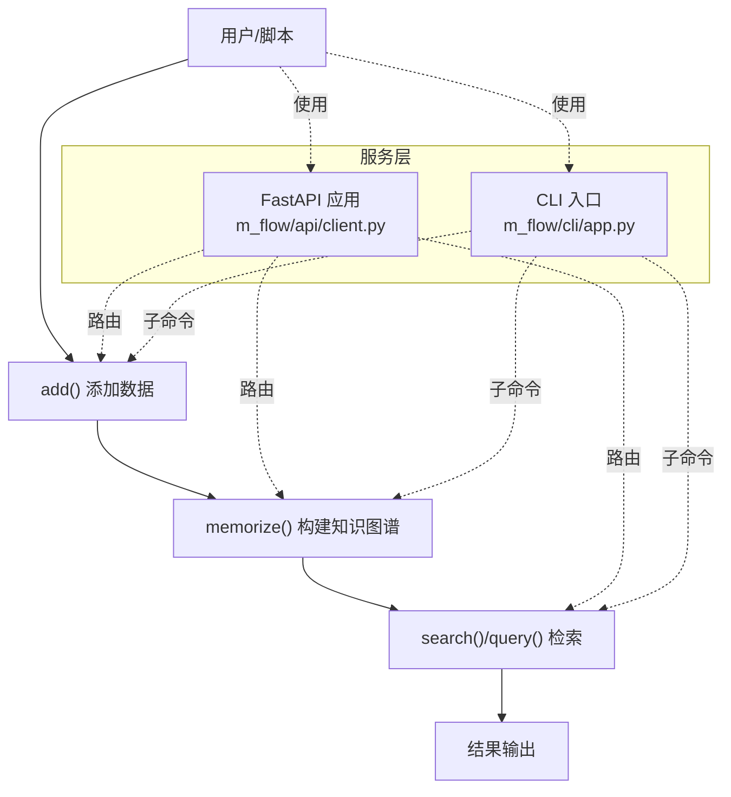
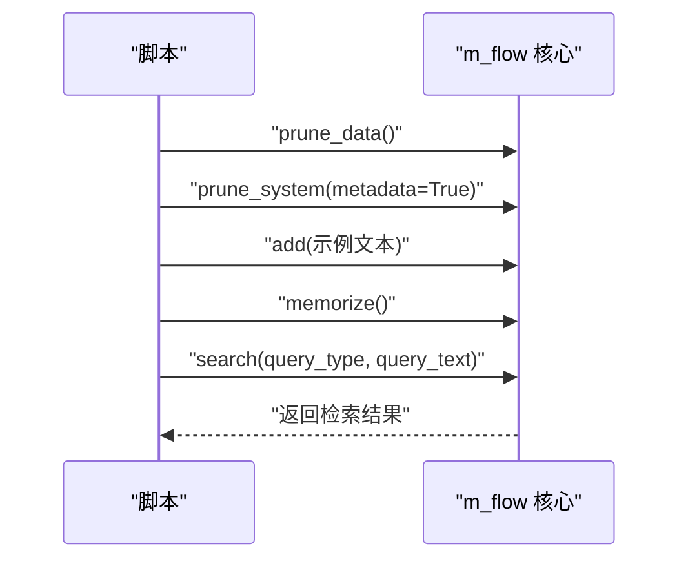
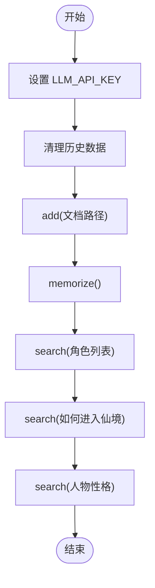
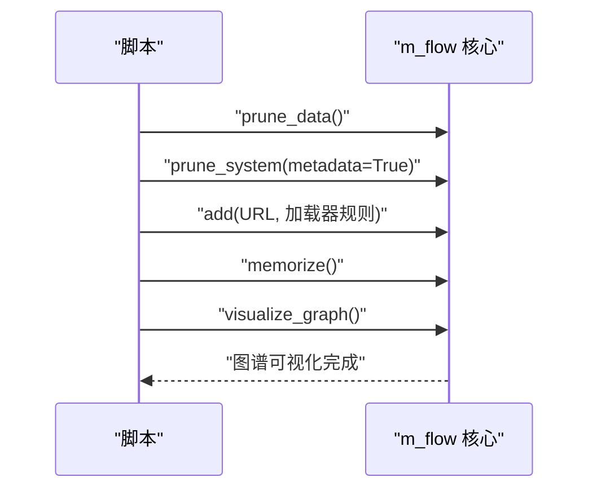
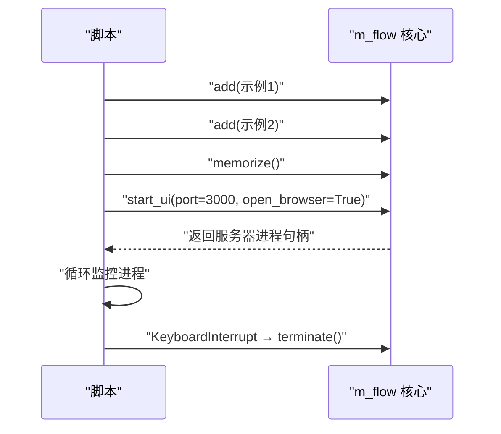
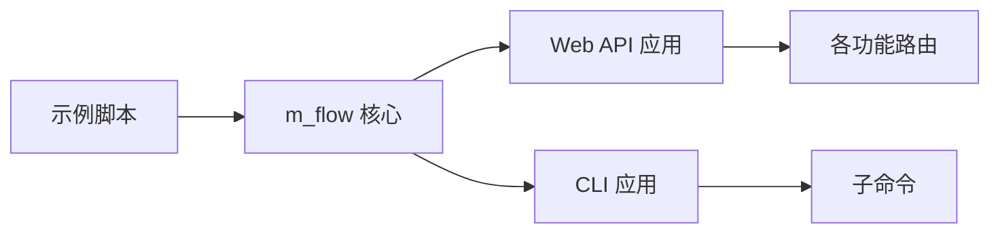

# 基础使用示例

<cite>
**本文引用的文件**
- [README.md](file://README.md)
- [m_flow/__init__.py](file://m_flow/__init__.py)
- [m_flow/api/client.py](file://m_flow/api/client.py)
- [m_flow/cli/app.py](file://m_flow/cli/app.py)
- [examples/python/simple_example.py](file://examples/python/simple_example.py)
- [examples/python/m_flow_simple_document_demo.py](file://examples/python/m_flow_simple_document_demo.py)
- [examples/start_ui_example.py](file://examples/start_ui_example.py)
- [examples/python/web_url_fetcher_example.py](file://examples/python/web_url_fetcher_example.py)
- [examples/python/simple_node_set_example.py](file://examples/python/simple_node_set_example.py)
- [examples/python/multimedia_example.py](file://examples/python/multimedia_example.py)
- [examples/data/car_and_tech_companies.txt](file://examples/data/car_and_tech_companies.txt)
</cite>

## 目录
1. [简介](#简介)
2. [项目结构](#项目结构)
3. [核心组件](#核心组件)
4. [架构总览](#架构总览)
5. [详细组件分析](#详细组件分析)
6. [依赖分析](#依赖分析)
7. [性能考虑](#性能考虑)
8. [故障排查指南](#故障排查指南)
9. [结论](#结论)
10. [附录](#附录)

## 简介
本文件面向初学者，系统讲解 M-flow 的基础使用示例与核心流程：数据添加（add）、知识图谱构建（memorize）、检索查询（search）与结果处理，并补充网页抓取、UI 启动等实用示例。文档逐层展开，既给出代码结构与关键函数调用说明，也提供可操作的运行步骤、常见错误处理与调试技巧，帮助你在最短时间内上手 M-flow 的核心能力。

## 项目结构
围绕“基础使用示例”，以下目录与文件最为相关：
- 示例脚本：examples/python/*.py
- 文档样例数据：examples/data/*.txt
- 核心入口与导出：m_flow/__init__.py
- Web API 服务：m_flow/api/client.py
- CLI 入口：m_flow/cli/app.py
- 顶层说明与快速开始：README.md

**图表来源**
- [examples/python/simple_example.py:1-51](file://examples/python/simple_example.py#L1-L51)
- [examples/python/m_flow_simple_document_demo.py:1-39](file://examples/python/m_flow_simple_document_demo.py#L1-L39)
- [examples/start_ui_example.py:1-40](file://examples/start_ui_example.py#L1-L40)
- [examples/python/web_url_fetcher_example.py:1-34](file://examples/python/web_url_fetcher_example.py#L1-L34)
- [examples/python/simple_node_set_example.py:1-43](file://examples/python/simple_node_set_example.py#L1-L43)
- [examples/python/multimedia_example.py:1-50](file://examples/python/multimedia_example.py#L1-L50)
- [examples/data/car_and_tech_companies.txt:1-18](file://examples/data/car_and_tech_companies.txt#L1-L18)
- [m_flow/__init__.py:21-51](file://m_flow/__init__.py#L21-L51)
- [m_flow/api/client.py:268-337](file://m_flow/api/client.py#L268-L337)
- [m_flow/cli/app.py:120-144](file://m_flow/cli/app.py#L120-L144)

**章节来源**
- [README.md:344-365](file://README.md#L344-L365)
- [m_flow/__init__.py:21-51](file://m_flow/__init__.py#L21-L51)

## 核心组件
- 数据添加（add）：将文本、文件路径或网页 URL 等输入接入 M-flow 管道，支持增量加载与自定义加载器规则。
- 知识图谱构建（memorize）：基于已入库存储的数据抽取实体、关系与语义片段，形成多粒度的知识图谱。
- 检索查询（search/query）：根据查询类型（如三元组补全、摘要、词法、过程式等）在图中进行路径成本传播与评分，返回高相关性记忆束。
- UI 启动（start_ui）：一键启动后端 API、前端控制台与 MCP 服务，便于可视化与交互。
- CLI 命令：提供 add、memorize、search 等子命令，便于批处理与自动化。

这些能力在顶层导出中统一暴露，便于直接从 m_flow 包导入使用。

**章节来源**
- [m_flow/__init__.py:21-51](file://m_flow/__init__.py#L21-L51)
- [README.md:274-327](file://README.md#L274-L327)

## 架构总览
下图展示了“数据输入 → 抽取/分块 → 记忆化 → 搜索”的端到端流程，以及与 Web API、CLI 的集成关系。

**图表来源**
- [m_flow/api/client.py:268-337](file://m_flow/api/client.py#L268-L337)
- [m_flow/cli/app.py:120-144](file://m_flow/cli/app.py#L120-L144)
- [m_flow/__init__.py:21-51](file://m_flow/__init__.py#L21-L51)

## 详细组件分析

### 示例一：最简文本添加与检索（simple_example）
- 目标：演示“文本入库存储 → 构建知识图谱 → 查询”的完整链路。
- 关键步骤
  - 清理历史数据：清理数据与系统元数据，确保示例可重复。
  - 添加数据：将一段示例文本加入系统。
  - 构建图谱：触发记忆化，生成多粒度知识表示。
  - 执行查询：以指定召回模式发起检索，打印结果。
- 关键函数与参数
  - 清理：prune_data()、prune_system(metadata=True)
  - 添加：add(text)
  - 构建：memorize()
  - 查询：search(query_type=RecallMode.TRIPLET_COMPLETION, query_text=query)
- 运行方式
  - 直接运行脚本；需设置 LLM_API_KEY 环境变量。
- 输出要点
  - 控制台打印查询与结果列表，结果为检索命中项。

**图表来源**
- [examples/python/simple_example.py:21-50](file://examples/python/simple_example.py#L21-L50)
- [m_flow/__init__.py:21-51](file://m_flow/__init__.py#L21-L51)

**章节来源**
- [examples/python/simple_example.py:1-51](file://examples/python/simple_example.py#L1-L51)
- [README.md:274-327](file://README.md#L274-L327)

### 示例二：文档处理与检索（m_flow_simple_document_demo）
- 目标：对本地文档进行处理，构建图谱并回答问题。
- 关键步骤
  - 设置 LLM_API_KEY 环境变量。
  - 清理历史状态。
  - 通过 add() 处理文档文件路径。
  - 触发 memorize()。
  - 使用 search() 提问并打印答案。
- 关键函数与参数
  - add(file_path)
  - memorize()
  - search(query_text)
- 运行方式
  - 直接运行脚本，确保文档存在且路径正确。
- 输出要点
  - 控制台打印多次查询的结果。

**图表来源**
- [examples/python/m_flow_simple_document_demo.py:12-38](file://examples/python/m_flow_simple_document_demo.py#L12-L38)

**章节来源**
- [examples/python/m_flow_simple_document_demo.py:1-39](file://examples/python/m_flow_simple_document_demo.py#L1-L39)
- [examples/data/car_and_tech_companies.txt:1-18](file://examples/data/car_and_tech_companies.txt#L1-L18)

### 示例三：网页抓取与图谱可视化（web_url_fetcher_example）
- 目标：抓取网页内容（标题、段落、链接等），构建知识图谱并可视化。
- 关键步骤
  - 清理历史数据。
  - 使用 add() 指定 URL 与提取规则（BeautifulSoup 加载器与 CSS 选择器）。
  - 触发 memorize()。
  - 调用可视化接口展示图谱。
- 关键函数与参数
  - add(url, incremental_loading=False, preferred_loaders=...)
  - memorize()
  - visualize_graph()
- 运行方式
  - 直接运行脚本，网络可达目标站点。
- 输出要点
  - 控制台提示抓取与图谱就绪，随后打开可视化页面。

**图表来源**
- [examples/python/web_url_fetcher_example.py:16-33](file://examples/python/web_url_fetcher_example.py#L16-L33)
- [m_flow/__init__.py:21-51](file://m_flow/__init__.py#L21-L51)

**章节来源**
- [examples/python/web_url_fetcher_example.py:1-34](file://examples/python/web_url_fetcher_example.py#L1-L34)

### 示例四：UI 启动与预置数据（start_ui_example）
- 目标：预置少量示例数据，启动 Web UI 并在浏览器中打开。
- 关键步骤
  - 预置两段示例文本并构建图谱。
  - 调用 start_ui() 启动后端、前端与 MCP 服务。
  - 循环等待进程，支持 Ctrl+C 停止。
- 关键函数与参数
  - add(text) × 2
  - memorize()
  - start_ui(port=3000, open_browser=True, pid_callback=...)
- 运行方式
  - 直接运行脚本，默认访问 http://localhost:3000。
- 输出要点
  - 控制台提示 UI 已启动，按提示停止。

**图表来源**
- [examples/start_ui_example.py:8-35](file://examples/start_ui_example.py#L8-L35)
- [m_flow/__init__.py:49-51](file://m_flow/__init__.py#L49-L51)

**章节来源**
- [examples/start_ui_example.py:1-40](file://examples/start_ui_example.py#L1-L40)

### 示例五：节点集标签与图谱可视化（simple_node_set_example）
- 目标：为多条内容分别打上主题标签，构建图谱并保存可视化。
- 关键步骤
  - 清理历史数据。
  - 对每条内容调用 add() 并传入 graph_scope（标签集合）。
  - 触发 memorize()。
  - 可视化并保存为 HTML 文件。
- 关键函数与参数
  - add(text, graph_scope=tags)
  - memorize()
  - visualize_graph(out_path)
- 运行方式
  - 直接运行脚本，确保输出目录存在。
- 输出要点
  - 控制台提示图谱保存路径。

**章节来源**
- [examples/python/simple_node_set_example.py:1-43](file://examples/python/simple_node_set_example.py#L1-L43)

### 示例六：多媒体文件检索（multimedia_example）
- 目标：对音频与图像进行内容理解，构建图谱并查询摘要。
- 关键步骤
  - 清理历史数据。
  - 将音频与图片路径传给 add()。
  - 触发 memorize()。
  - 使用 search() 并指定召回模式为摘要，打印结果。
- 关键函数与参数
  - add([audio, image])
  - memorize()
  - search(query_type=RecallMode.SUMMARIES, query_text=...)
- 运行方式
  - 直接运行脚本，确保媒体文件存在。
- 输出要点
  - 控制台打印多媒体内容摘要。

**章节来源**
- [examples/python/multimedia_example.py:1-50](file://examples/python/multimedia_example.py#L1-L50)

## 依赖分析
- 示例脚本依赖 m_flow 核心包提供的 add、memorize、search、start_ui 等高层 API。
- Web API 层（FastAPI）与 CLI 层分别提供 HTTP 接口与命令行入口，二者均通过路由挂载到应用实例。
- 示例与核心库之间为“直接调用”关系，耦合度低、内聚性强。

**图表来源**
- [m_flow/api/client.py:268-337](file://m_flow/api/client.py#L268-L337)
- [m_flow/cli/app.py:120-144](file://m_flow/cli/app.py#L120-L144)
- [m_flow/__init__.py:21-51](file://m_flow/__init__.py#L21-L51)

**章节来源**
- [m_flow/api/client.py:268-337](file://m_flow/api/client.py#L268-L337)
- [m_flow/cli/app.py:120-144](file://m_flow/cli/app.py#L120-L144)

## 性能考虑
- 数据量与图谱规模：大规模数据会增加抽取与嵌入时间，建议先小批量验证流程。
- LLM 调用：检索与抽取依赖外部 LLM，注意配额与延迟，必要时开启缓存或降采样。
- 可视化：图谱越大，渲染越慢，建议仅在开发阶段使用可视化。
- 并发与批处理：CLI 与 API 支持并发请求，但底层数据库与向量库的连接池需合理配置。

## 故障排查指南
- 环境变量缺失
  - 症状：运行时报错或功能异常。
  - 处理：确保设置 LLM_API_KEY；参考示例脚本中的环境变量设置方式。
- 权限与认证
  - 症状：API 返回未授权或鉴权失败。
  - 处理：检查认证配置与安全头；CLI 与 API 的安全方案一致。
- 端口占用
  - 症状：UI 或 API 启动失败。
  - 处理：更换端口或释放占用端口。
- 网络与抓取
  - 症状：网页抓取超时或解析失败。
  - 处理：检查网络连通性与目标站点可用性；调整加载器规则。
- 日志与调试
  - 症状：错误定位困难。
  - 处理：启用调试模式（CLI 的 --debug），查看详细堆栈；检查服务日志。

**章节来源**
- [m_flow/api/client.py:169-198](file://m_flow/api/client.py#L169-L198)
- [m_flow/cli/app.py:231-270](file://m_flow/cli/app.py#L231-L270)

## 结论
通过上述六个基础示例，你可以快速掌握 M-flow 的核心工作流：数据添加、知识图谱构建与检索查询，并进一步探索网页抓取、UI 启动与多媒体处理等扩展场景。建议先从最简文本示例入手，再逐步尝试文档、网页与多媒体示例，最后结合 UI 体验交互式检索。

## 附录

### 快速运行指南（基于示例）
- 准备环境
  - 安装依赖：pip 安装 mflow-ai 或从源码安装。
  - 设置 LLM_API_KEY 环境变量。
- 运行命令
  - 文本示例：直接运行 simple_example.py。
  - 文档示例：运行 m_flow_simple_document_demo.py。
  - 网页抓取：运行 web_url_fetcher_example.py。
  - UI 启动：运行 start_ui_example.py，默认访问 http://localhost:3000。
  - 多媒体示例：运行 multimedia_example.py。
- 常见输出
  - 控制台打印“查询：...”、“结果：...”或“图谱可视化完成”。

**章节来源**
- [README.md:274-327](file://README.md#L274-L327)
- [examples/python/simple_example.py:48-50](file://examples/python/simple_example.py#L48-L50)
- [examples/python/m_flow_simple_document_demo.py:37-38](file://examples/python/m_flow_simple_document_demo.py#L37-L38)
- [examples/start_ui_example.py:16-35](file://examples/start_ui_example.py#L16-L35)
- [examples/python/web_url_fetcher_example.py:27-29](file://examples/python/web_url_fetcher_example.py#L27-L29)
- [examples/python/multimedia_example.py:37-45](file://examples/python/multimedia_example.py#L37-L45)