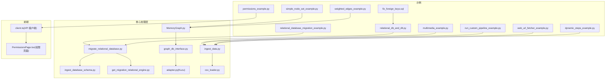
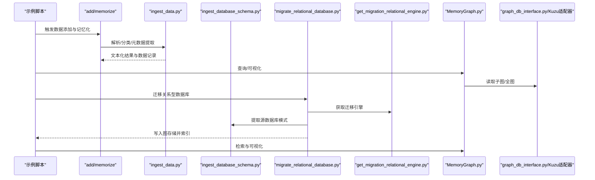
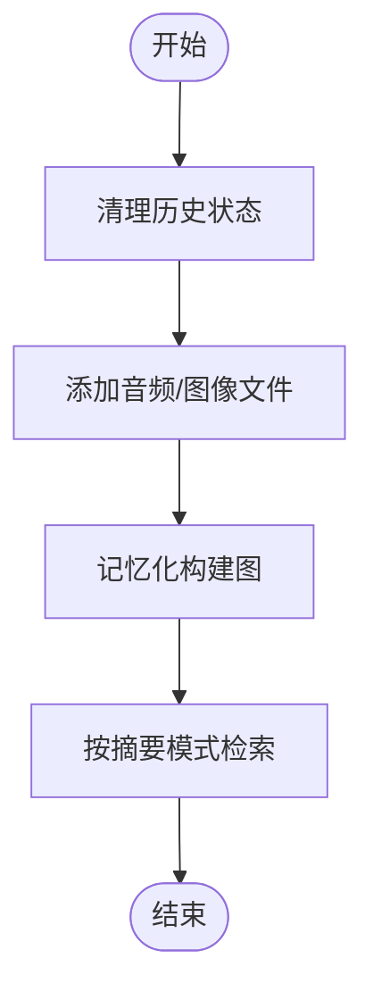
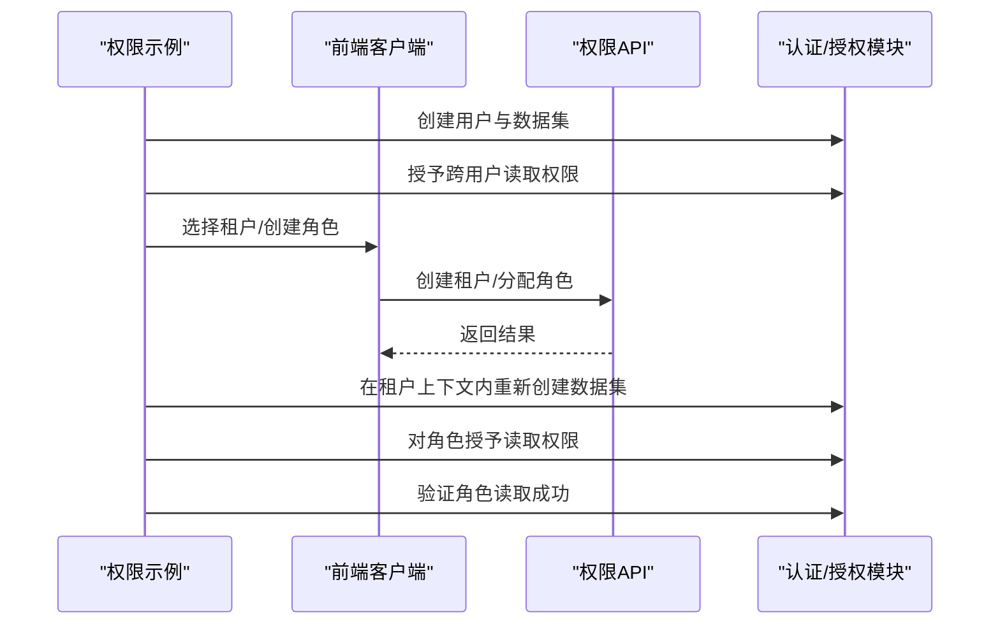
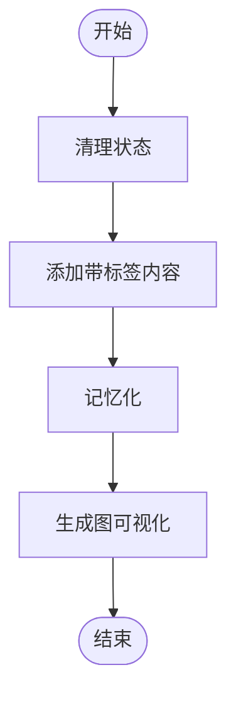
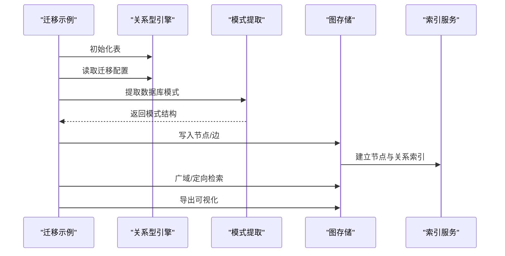
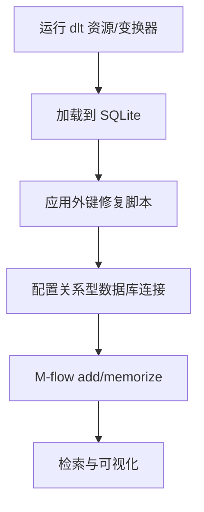
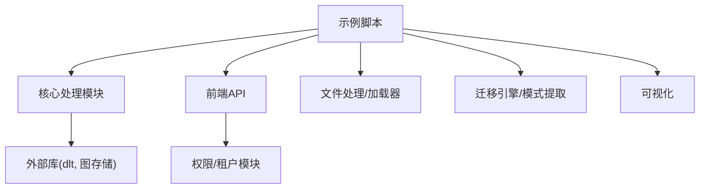

# 数据处理示例

<cite>
**本文引用的文件**
- [multimedia_example.py](file://examples/python/multimedia_example.py)
- [permissions_example.py](file://examples/python/permissions_example.py)
- [simple_node_set_example.py](file://examples/python/simple_node_set_example.py)
- [relational_database_migration_example.py](file://examples/python/relational_database_migration_example.py)
- [relational_db_and_dlt.py](file://examples/relational_db_with_dlt/relational_db_and_dlt.py)
- [fix_foreign_keys.sql](file://examples/relational_db_with_dlt/fix_foreign_keys.sql)
- [run_custom_pipeline_example.py](file://examples/python/run_custom_pipeline_example.py)
- [web_url_fetcher_example.py](file://examples/python/web_url_fetcher_example.py)
- [weighted_edges_example.py](file://examples/python/weighted_edges_example.py)
- [dynamic_steps_example.py](file://examples/python/dynamic_steps_example.py)
- [ingest_data.py](file://m_flow/ingestion/pipeline_tasks/ingest_data.py)
- [ingest_database_schema.py](file://m_flow/ingestion/schema/ingest_database_schema.py)
- [migrate_relational_database.py](file://m_flow/ingestion/pipeline_tasks/migrate_relational_database.py)
- [get_migration_relational_engine.py](file://m_flow/adapters/relational/get_migration_relational_engine.py)
- [MemoryGraph.py](file://m_flow/knowledge/graph_ops/m_flow_graph/MemoryGraph.py)
- [graph_db_interface.py](file://m_flow/adapters/graph/graph_db_interface.py)
- [adapter.py](file://m_flow/adapters/graph/kuzu/adapter.py)
- [client.ts](file://m_flow-frontend/src/lib/api/client.ts)
- [PermissionsPage.tsx](file://m_flow-frontend/src/components/admin/PermissionsPage.tsx)
- [csv_loader.py](file://m_flow/shared/loaders/core/csv_loader.py)
</cite>

## 目录
1. [简介](#简介)
2. [项目结构](#项目结构)
3. [核心组件](#核心组件)
4. [架构总览](#架构总览)
5. [详细组件分析](#详细组件分析)
6. [依赖分析](#依赖分析)
7. [性能考虑](#性能考虑)
8. [故障排除指南](#故障排除指南)
9. [结论](#结论)
10. [附录](#附录)

## 简介
本文件面向希望在 M-flow 中实现“数据处理示例”的工程师与技术文档读者，系统性地介绍以下主题：
- 多媒体数据处理：PDF、音频、图像等非结构化数据的加载、解析与知识图谱构建。
- 权限管理：用户权限、数据集访问控制与多租户支持的端到端演示。
- 节点集合操作：基于标签的节点集合管理与可视化输出。
- 关系型数据库迁移：从传统关系型数据库迁移到 M-flow 图存储，并结合 DLT（Data Layer Transformation）的完整流程。
- SQL 脚本：外键修复与索引优化脚本的说明与使用。
- 数据格式转换、批量处理与性能优化最佳实践。

## 项目结构
围绕“数据处理示例”，本仓库中与之直接相关的示例与核心模块分布如下：
- 示例脚本位于 examples/python 与 examples/relational_db_with_dlt 目录。
- 核心数据处理逻辑集中在 m_flow/ingestion、m_flow/adapters、m_flow/knowledge 等子系统。
- 前端权限管理界面位于 m_flow-frontend，提供 API 客户端调用示例。

图表来源
- [multimedia_example.py:1-50](file://examples/python/multimedia_example.py#L1-L50)
- [permissions_example.py:1-183](file://examples/python/permissions_example.py#L1-L183)
- [simple_node_set_example.py:1-43](file://examples/python/simple_node_set_example.py#L1-L43)
- [relational_database_migration_example.py:1-97](file://examples/python/relational_database_migration_example.py#L1-L97)
- [relational_db_and_dlt.py:1-126](file://examples/relational_db_with_dlt/relational_db_and_dlt.py#L1-L126)
- [fix_foreign_keys.sql:1-24](file://examples/relational_db_with_dlt/fix_foreign_keys.sql#L1-L24)
- [run_custom_pipeline_example.py:1-84](file://examples/python/run_custom_pipeline_example.py#L1-L84)
- [web_url_fetcher_example.py:1-34](file://examples/python/web_url_fetcher_example.py#L1-L34)
- [weighted_edges_example.py:1-70](file://examples/python/weighted_edges_example.py#L1-L70)
- [dynamic_steps_example.py:1-81](file://examples/python/dynamic_steps_example.py#L1-L81)
- [ingest_data.py:83-153](file://m_flow/ingestion/pipeline_tasks/ingest_data.py#L83-L153)
- [ingest_database_schema.py:112-144](file://m_flow/ingestion/schema/ingest_database_schema.py#L112-L144)
- [migrate_relational_database.py:43-177](file://m_flow/ingestion/pipeline_tasks/migrate_relational_database.py#L43-L177)
- [get_migration_relational_engine.py:1-43](file://m_flow/adapters/relational/get_migration_relational_engine.py#L1-L43)
- [MemoryGraph.py:104-132](file://m_flow/knowledge/graph_ops/m_flow_graph/MemoryGraph.py#L104-L132)
- [graph_db_interface.py:266-329](file://m_flow/adapters/graph/graph_db_interface.py#L266-L329)
- [adapter.py:668-699](file://m_flow/adapters/graph/kuzu/adapter.py#L668-L699)
- [client.ts:1056-1095](file://m_flow-frontend/src/lib/api/client.ts#L1056-L1095)
- [PermissionsPage.tsx:154-248](file://m_flow-frontend/src/components/admin/PermissionsPage.tsx#L154-L248)
- [csv_loader.py:82-99](file://m_flow/shared/loaders/core/csv_loader.py#L82-L99)

章节来源
- [multimedia_example.py:1-50](file://examples/python/multimedia_example.py#L1-L50)
- [permissions_example.py:1-183](file://examples/python/permissions_example.py#L1-L183)
- [relational_database_migration_example.py:1-97](file://examples/python/relational_database_migration_example.py#L1-L97)
- [relational_db_and_dlt.py:1-126](file://examples/relational_db_with_dlt/relational_db_and_dlt.py#L1-L126)

## 核心组件
- 多媒体与非结构化数据处理：通过统一的 add/memorize 流程，将音频、图像等文件转换为文本并构建知识图谱。
- 权限与多租户：通过后端访问控制开关、用户/角色/租户模型与数据集权限授予，实现细粒度访问控制。
- 节点集合与可视化：以标签驱动的节点集合过滤与全图提取，支持交互式可视化导出。
- 关系型数据库迁移：从源数据库提取模式与数据，去重边并写入图存储，随后进行检索与可视化。
- DLT 集成：使用 dlt 将外部数据（如 API）抽取到本地 SQLite，再通过 M-flow 迁移至图存储。
- 批量处理与性能：分批写入、分区边、去重策略与索引建立，提升吞吐与查询效率。

章节来源
- [multimedia_example.py:20-45](file://examples/python/multimedia_example.py#L20-L45)
- [permissions_example.py:38-178](file://examples/python/permissions_example.py#L38-L178)
- [simple_node_set_example.py:26-37](file://examples/python/simple_node_set_example.py#L26-L37)
- [relational_database_migration_example.py:32-93](file://examples/python/relational_database_migration_example.py#L32-L93)
- [relational_db_and_dlt.py:51-121](file://examples/relational_db_with_dlt/relational_db_and_dlt.py#L51-L121)

## 架构总览
下图展示了从数据输入到知识图谱检索的整体流程，涵盖示例脚本与核心处理模块之间的关系。

图表来源
- [multimedia_example.py:20-45](file://examples/python/multimedia_example.py#L20-L45)
- [run_custom_pipeline_example.py:23-79](file://examples/python/run_custom_pipeline_example.py#L23-L79)
- [relational_database_migration_example.py:32-93](file://examples/python/relational_database_migration_example.py#L32-L93)
- [relational_db_and_dlt.py:86-121](file://examples/relational_db_with_dlt/relational_db_and_dlt.py#L86-L121)
- [ingest_data.py:90-153](file://m_flow/ingestion/pipeline_tasks/ingest_data.py#L90-L153)
- [ingest_database_schema.py:112-144](file://m_flow/ingestion/schema/ingest_database_schema.py#L112-L144)
- [migrate_relational_database.py:43-177](file://m_flow/ingestion/pipeline_tasks/migrate_relational_database.py#L43-L177)
- [get_migration_relational_engine.py:13-43](file://m_flow/adapters/relational/get_migration_relational_engine.py#L13-L43)
- [MemoryGraph.py:104-132](file://m_flow/knowledge/graph_ops/m_flow_graph/MemoryGraph.py#L104-L132)
- [graph_db_interface.py:266-329](file://m_flow/adapters/graph/graph_db_interface.py#L266-L329)
- [adapter.py:668-699](file://m_flow/adapters/graph/kuzu/adapter.py#L668-L699)

## 详细组件分析

### 多媒体数据处理示例
- 功能概述：清理状态、添加音频/图像样本、记忆化构建知识图谱、按摘要模式检索。
- 关键流程：
  - 清理与准备：调用修剪接口清空历史状态。
  - 添加数据：将本地音频与图像路径传入 add 接口。
  - 记忆化：触发图构建与索引。
  - 检索：以 SUMMARIES 模式查询，输出摘要结果。
- 数据格式转换：底层通过加载器将非文本文件转换为可处理的文本表示；CSV 加载器展示了结构化数据的格式化与存储流程。

图表来源
- [multimedia_example.py:20-45](file://examples/python/multimedia_example.py#L20-L45)
- [csv_loader.py:82-99](file://m_flow/shared/loaders/core/csv_loader.py#L82-L99)

章节来源
- [multimedia_example.py:20-45](file://examples/python/multimedia_example.py#L20-L45)
- [csv_loader.py:82-99](file://m_flow/shared/loaders/core/csv_loader.py#L82-L99)

### 权限管理与多租户示例
- 功能概述：启用后端访问控制，创建用户与数据集，授予跨用户读取权限，创建租户与角色，验证角色级权限对租户内数据集的生效。
- 关键流程：
  - 启用访问控制：设置环境变量开启后端权限校验。
  - 用户与数据集：创建用户并分别向其个人数据集添加内容，分别记忆化。
  - 权限授予：用户间授予读取权限，验证读取与写入拒绝场景。
  - 多租户与角色：创建租户与角色，将用户加入租户并分配角色；在租户上下文内重新创建数据集以使角色授权生效。
- 前端集成：前端提供数据集权限授予与租户选择的交互入口，对应 API 客户端方法。

图表来源
- [permissions_example.py:38-178](file://examples/python/permissions_example.py#L38-L178)
- [client.ts:1056-1095](file://m_flow-frontend/src/lib/api/client.ts#L1056-L1095)
- [PermissionsPage.tsx:154-248](file://m_flow-frontend/src/components/admin/PermissionsPage.tsx#L154-L248)

章节来源
- [permissions_example.py:38-178](file://examples/python/permissions_example.py#L38-L178)
- [client.ts:1056-1095](file://m_flow-frontend/src/lib/api/client.ts#L1056-L1095)
- [PermissionsPage.tsx:154-248](file://m_flow-frontend/src/components/admin/PermissionsPage.tsx#L154-L248)

### 节点集合操作示例
- 功能概述：通过 graph_scope 参数为内容打上标签，构建节点集合，最终生成交互式图可视化。
- 关键流程：
  - 清理与添加：逐条添加带标签的内容。
  - 记忆化：构建知识图谱。
  - 可视化：导出 HTML 图形文件，便于查看节点与关系。

图表来源
- [simple_node_set_example.py:26-37](file://examples/python/simple_node_set_example.py#L26-L37)

章节来源
- [simple_node_set_example.py:26-37](file://examples/python/simple_node_set_example.py#L26-L37)

### 关系型数据库迁移示例
- 功能概述：初始化关系型与向量存储，提取源数据库模式，迁移数据到图存储，执行广域与定向检索，并生成可视化。
- 关键流程：
  - 准备存储：初始化关系型与向量表。
  - 解析配置：读取迁移数据库的提供方、路径与名称。
  - 提取模式：调用迁移引擎提取源数据库结构。
  - 迁移写入：去重边后写入图存储并建立索引。
  - 检索与可视化：执行宽泛与聚焦查询，并导出图可视化。

图表来源
- [relational_database_migration_example.py:32-93](file://examples/python/relational_database_migration_example.py#L32-L93)
- [get_migration_relational_engine.py:13-43](file://m_flow/adapters/relational/get_migration_relational_engine.py#L13-L43)
- [ingest_database_schema.py:112-144](file://m_flow/ingestion/schema/ingest_database_schema.py#L112-L144)
- [migrate_relational_database.py:43-177](file://m_flow/ingestion/pipeline_tasks/migrate_relational_database.py#L43-L177)

章节来源
- [relational_database_migration_example.py:32-93](file://examples/python/relational_database_migration_example.py#L32-L93)
- [get_migration_relational_engine.py:13-43](file://m_flow/adapters/relational/get_migration_relational_engine.py#L13-L43)
- [ingest_database_schema.py:112-144](file://m_flow/ingestion/schema/ingest_database_schema.py#L112-L144)
- [migrate_relational_database.py:43-177](file://m_flow/ingestion/pipeline_tasks/migrate_relational_database.py#L43-L177)

### DLT 集成与 SQL 脚本
- DLT 流程：定义资源与变换器，运行 dlt 将 API 数据加载到 SQLite；应用外键修复脚本；配置关系型数据库连接；通过 M-flow 的 add/memorize 完成图构建与检索。
- SQL 脚本作用：
  - 开启 WAL 模式以提升并发访问。
  - 为 pokemon_details 到 pokemon_list 建立外键约束，确保关系完整性。
  - 创建索引以优化图遍历性能。
  - 最后验证表结构。

图表来源
- [relational_db_and_dlt.py:51-121](file://examples/relational_db_with_dlt/relational_db_and_dlt.py#L51-L121)
- [fix_foreign_keys.sql:1-24](file://examples/relational_db_with_dlt/fix_foreign_keys.sql#L1-L24)

章节来源
- [relational_db_and_dlt.py:51-121](file://examples/relational_db_with_dlt/relational_db_and_dlt.py#L51-L121)
- [fix_foreign_keys.sql:1-24](file://examples/relational_db_with_dlt/fix_foreign_keys.sql#L1-L24)

### 自定义流水线与动态步骤
- 自定义流水线：演示如何使用低层任务 API 组装 add 与 memorize 流水线，复现内置工作流。
- 动态步骤：根据启用开关选择性执行分类、分块、提取、重建图谱与检索等步骤，便于调试与性能优化。

章节来源
- [run_custom_pipeline_example.py:23-79](file://examples/python/run_custom_pipeline_example.py#L23-L79)
- [dynamic_steps_example.py:59-81](file://examples/python/dynamic_steps_example.py#L59-L81)

### Web 抓取与加权边示例
- Web 抓取：通过指定 CSS 选择器抓取网页内容，构建知识图谱并可视化。
- 加权边：在自定义节点类中使用 Edge 定义关系权重，持久化后进行可视化，体现关系强度。

章节来源
- [web_url_fetcher_example.py:16-30](file://examples/python/web_url_fetcher_example.py#L16-L30)
- [weighted_edges_example.py:33-66](file://examples/python/weighted_edges_example.py#L33-L66)

## 依赖分析
- 示例与核心模块耦合：
  - 多媒体示例依赖 ingest_data 的文件处理与数据记录更新逻辑。
  - 权限示例依赖前端 API 客户端与后端权限授予方法。
  - 节点集合示例依赖图查询接口与可视化工具。
  - 迁移示例依赖迁移引擎工厂、模式提取与图写入。
  - DLT 示例依赖 SQL 脚本修复与关系型配置。
- 外部依赖：
  - dlt：用于从外部源抽取数据到关系型存储。
  - Kuzu/Neo4j/Neptune：图存储适配器，负责节点/边写入与查询。

图表来源
- [multimedia_example.py:20-45](file://examples/python/multimedia_example.py#L20-L45)
- [permissions_example.py:38-178](file://examples/python/permissions_example.py#L38-L178)
- [relational_db_and_dlt.py:51-121](file://examples/relational_db_with_dlt/relational_db_and_dlt.py#L51-L121)
- [ingest_data.py:90-153](file://m_flow/ingestion/pipeline_tasks/ingest_data.py#L90-L153)
- [migrate_relational_database.py:43-177](file://m_flow/ingestion/pipeline_tasks/migrate_relational_database.py#L43-L177)
- [client.ts:1056-1095](file://m_flow-frontend/src/lib/api/client.ts#L1056-L1095)

章节来源
- [multimedia_example.py:20-45](file://examples/python/multimedia_example.py#L20-L45)
- [permissions_example.py:38-178](file://examples/python/permissions_example.py#L38-L178)
- [relational_db_and_dlt.py:51-121](file://examples/relational_db_with_dlt/relational_db_and_dlt.py#L51-L121)
- [ingest_data.py:90-153](file://m_flow/ingestion/pipeline_tasks/ingest_data.py#L90-L153)
- [migrate_relational_database.py:43-177](file://m_flow/ingestion/pipeline_tasks/migrate_relational_database.py#L43-L177)
- [client.ts:1056-1095](file://m_flow-frontend/src/lib/api/client.ts#L1056-L1095)

## 性能考虑
- 批量写入与冲突回退：Kuzu 适配器在批量 MERGE 冲突时自动降级为顺序写入，保证一致性与稳定性。
- 边分区与去重：针对同一批次内共享端点的边进行分区，避免并发修改导致的冲突；迁移过程中对重复边进行去重。
- 索引建立：迁移完成后对节点与关系建立索引，显著提升检索性能。
- 分步执行：动态步骤示例允许仅执行必要步骤，减少不必要的计算与 IO。
- 存储格式：CSV 加载器将结构化数据格式化为文本并落盘，便于后续统一处理。

章节来源
- [adapter.py:668-699](file://m_flow/adapters/graph/kuzu/adapter.py#L668-L699)
- [migrate_relational_database.py:69-82](file://m_flow/ingestion/pipeline_tasks/migrate_relational_database.py#L69-L82)
- [dynamic_steps_example.py:59-81](file://examples/python/dynamic_steps_example.py#L59-L81)
- [csv_loader.py:82-99](file://m_flow/shared/loaders/core/csv_loader.py#L82-L99)

## 故障排除指南
- 权限被拒：当尝试读取或写入未授权数据集时会抛出权限异常。请先确认数据集权限是否已授予，或检查当前用户/租户上下文。
- 租户内角色授权失败：角色授权仅对属于该租户的数据集有效。若目标数据集不在租户内，需在租户上下文内重新创建数据集后再授予。
- 迁移失败或数据不完整：检查迁移数据库配置（提供方、路径、名称），确认模式提取成功且图写入完成；必要时重新执行迁移。
- DLT 外键问题：dlt 默认不创建外键，需应用修复脚本以建立约束与索引，确保关系完整性与查询性能。
- 图查询为空：若节点集合过滤严格，可能导致返回为空。可放宽过滤条件或改为全图查询以定位问题。

章节来源
- [permissions_example.py:92-152](file://examples/python/permissions_example.py#L92-L152)
- [relational_db_and_dlt.py:70-83](file://examples/relational_db_with_dlt/relational_db_and_dlt.py#L70-L83)
- [relational_database_migration_example.py:60-69](file://examples/python/relational_database_migration_example.py#L60-L69)

## 结论
本文件梳理了 M-flow 在多媒体数据处理、权限与多租户管理、节点集合操作、关系型数据库迁移与 DLT 集成等方面的示例与最佳实践。通过统一的 add/memorize 工作流、灵活的权限模型、可扩展的图存储适配器与完善的索引机制，M-flow 能够高效处理从非结构化到结构化的多源数据，并支持企业级的访问控制与性能优化需求。

## 附录
- 使用建议：
  - 多媒体数据：优先使用统一的 add/memorize 流程，结合标签驱动的节点集合进行组织。
  - 权限管理：在租户上下文中创建数据集，配合角色授权实现最小权限原则。
  - 迁移与 DLT：先用 dlt 快速抽取，再通过修复脚本完善关系约束，最后迁移至图存储并建立索引。
  - 性能优化：采用分批写入、边分区与去重策略，合理设置检索 top_k，避免上下文溢出。