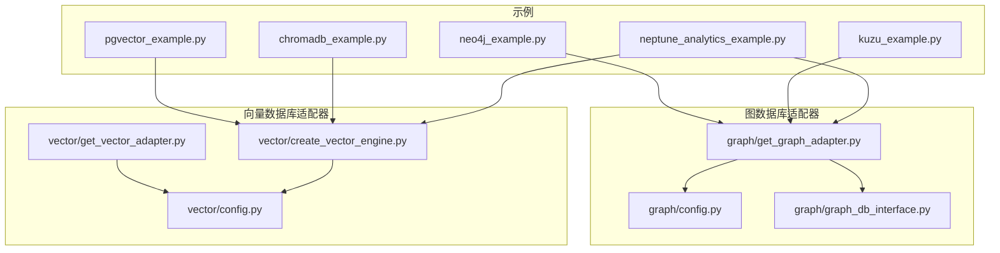
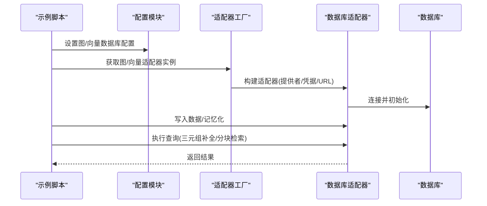
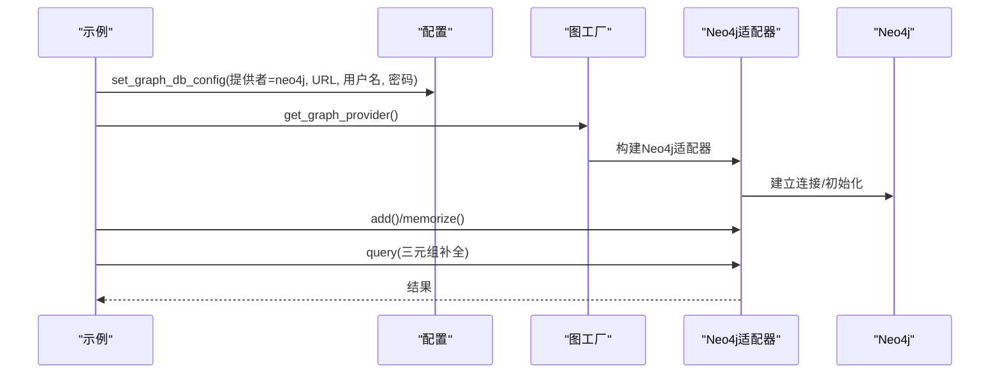
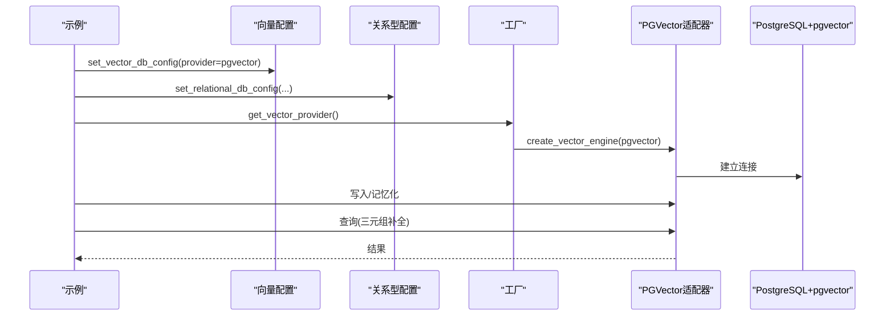
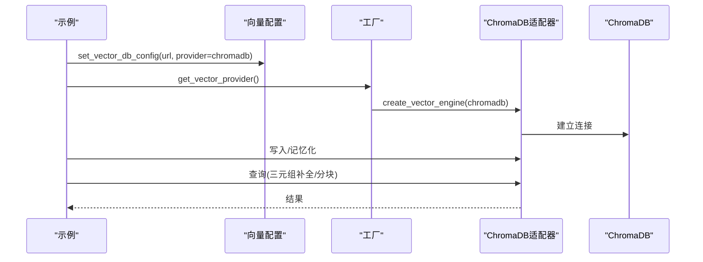
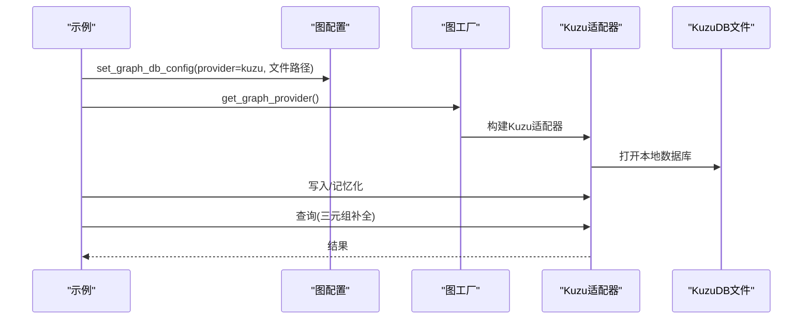
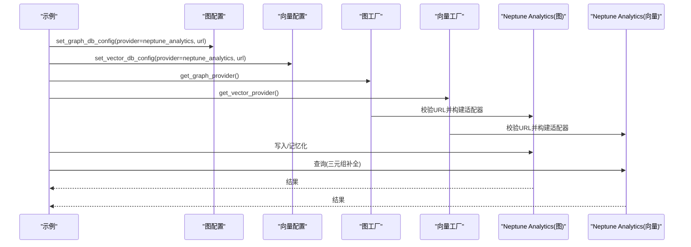
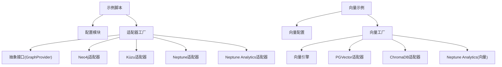

# 数据库集成示例

<cite>
**本文档引用的文件**
- [examples/database_examples/neo4j_example.py](file://examples/database_examples/neo4j_example.py)
- [examples/database_examples/pgvector_example.py](file://examples/database_examples/pgvector_example.py)
- [examples/database_examples/chromadb_example.py](file://examples/database_examples/chromadb_example.py)
- [examples/database_examples/kuzu_example.py](file://examples/database_examples/kuzu_example.py)
- [examples/database_examples/neptune_analytics_example.py](file://examples/database_examples/neptune_analytics_example.py)
- [m_flow/adapters/graph/config.py](file://m_flow/adapters/graph/config.py)
- [m_flow/adapters/graph/get_graph_adapter.py](file://m_flow/adapters/graph/get_graph_adapter.py)
- [m_flow/adapters/graph/graph_db_interface.py](file://m_flow/adapters/graph/graph_db_interface.py)
- [m_flow/adapters/vector/config.py](file://m_flow/adapters/vector/config.py)
- [m_flow/adapters/vector/get_vector_adapter.py](file://m_flow/adapters/vector/get_vector_adapter.py)
- [m_flow/adapters/vector/create_vector_engine.py](file://m_flow/adapters/vector/create_vector_engine.py)
</cite>

## 目录
1. [简介](#简介)
2. [项目结构](#项目结构)
3. [核心组件](#核心组件)
4. [架构总览](#架构总览)
5. [详细组件分析](#详细组件分析)
6. [依赖关系分析](#依赖关系分析)
7. [性能考虑](#性能考虑)
8. [故障排除指南](#故障排除指南)
9. [结论](#结论)
10. [附录](#附录)

## 简介
本文件面向需要在 M-flow 中集成多种数据库（图数据库与向量数据库）的开发者，系统性介绍如何配置与使用以下数据库后端：
- Neo4j：原生图数据库，支持 Cypher 查询语言
- PostgreSQL + pgvector：扩展向量相似搜索的关系型数据库
- ChromaDB：开源嵌入式向量数据库
- KùzuDB：嵌入式列式图数据库，适合分析查询
- Amazon Neptune Analytics：托管图与向量混合服务

文档涵盖配置参数、连接方式、数据读写与查询方法、性能优化技巧、常见问题与解决方案，以及数据库选型指南。

## 项目结构
与数据库集成相关的核心代码位于 m_flow/adapters 目录下，分别管理图数据库与向量数据库的配置、工厂与接口；示例代码位于 examples/database_examples 目录，演示了各数据库的最小可用示例。

**图表来源**
- [examples/database_examples/neo4j_example.py:1-50](file://examples/database_examples/neo4j_example.py#L1-L50)
- [examples/database_examples/pgvector_example.py:1-49](file://examples/database_examples/pgvector_example.py#L1-L49)
- [examples/database_examples/chromadb_example.py:1-49](file://examples/database_examples/chromadb_example.py#L1-L49)
- [examples/database_examples/kuzu_example.py:1-37](file://examples/database_examples/kuzu_example.py#L1-L37)
- [examples/database_examples/neptune_analytics_example.py:1-50](file://examples/database_examples/neptune_analytics_example.py#L1-L50)
- [m_flow/adapters/graph/config.py:1-128](file://m_flow/adapters/graph/config.py#L1-L128)
- [m_flow/adapters/graph/get_graph_adapter.py:1-159](file://m_flow/adapters/graph/get_graph_adapter.py#L1-L159)
- [m_flow/adapters/graph/graph_db_interface.py:1-347](file://m_flow/adapters/graph/graph_db_interface.py#L1-L347)
- [m_flow/adapters/vector/config.py:1-77](file://m_flow/adapters/vector/config.py#L1-L77)
- [m_flow/adapters/vector/get_vector_adapter.py:1-19](file://m_flow/adapters/vector/get_vector_adapter.py#L1-L19)
- [m_flow/adapters/vector/create_vector_engine.py:1-166](file://m_flow/adapters/vector/create_vector_engine.py#L1-L166)

**章节来源**
- [examples/database_examples/neo4j_example.py:1-50](file://examples/database_examples/neo4j_example.py#L1-L50)
- [examples/database_examples/pgvector_example.py:1-49](file://examples/database_examples/pgvector_example.py#L1-L49)
- [examples/database_examples/chromadb_example.py:1-49](file://examples/database_examples/chromadb_example.py#L1-L49)
- [examples/database_examples/kuzu_example.py:1-37](file://examples/database_examples/kuzu_example.py#L1-L37)
- [examples/database_examples/neptune_analytics_example.py:1-50](file://examples/database_examples/neptune_analytics_example.py#L1-L50)
- [m_flow/adapters/graph/config.py:1-128](file://m_flow/adapters/graph/config.py#L1-L128)
- [m_flow/adapters/vector/config.py:1-77](file://m_flow/adapters/vector/config.py#L1-L77)

## 核心组件
本节概述图数据库与向量数据库的配置模型、工厂与抽象接口，它们是所有示例的基础。

- 图数据库配置模型
  - 提供统一字段：提供者、URL、名称、用户名、密码、端口、密钥、文件路径等
  - 路径解析：自动解析系统根目录下的数据库文件路径
  - 上下文配置：支持异步上下文覆盖全局配置
  - 参考路径：[m_flow/adapters/graph/config.py:29-106](file://m_flow/adapters/graph/config.py#L29-L106)

- 向量数据库配置模型
  - 提供统一字段：URL、端口、名称、密钥、提供者
  - 默认行为：未设置 URL 时默认指向本地 LanceDB 存储
  - 上下文配置：支持异步上下文覆盖全局配置
  - 参考路径：[m_flow/adapters/vector/config.py:26-63](file://m_flow/adapters/vector/config.py#L26-L63)

- 图数据库工厂
  - 支持内置提供者：Neo4j、Kùzu、Kùzu-Remote、Neptune、Neptune Analytics
  - 支持注册表扩展：通过 supported_databases 注册自定义提供者
  - 初始化流程：按需执行异步初始化
  - 参考路径：[m_flow/adapters/graph/get_graph_adapter.py:22-131](file://m_flow/adapters/graph/get_graph_adapter.py#L22-L131)

- 向量数据库工厂
  - 支持内置提供者：PGVector、ChromaDB、LanceDB、Neptune Analytics、Pinecone、Milvus
  - 依赖检查：缺失依赖时抛出 ImportError 并提示安装命令
  - 关系型配置：PGVector 从关系型配置构建连接字符串
  - 参考路径：[m_flow/adapters/vector/create_vector_engine.py:15-111](file://m_flow/adapters/vector/create_vector_engine.py#L15-L111)

- 图数据库抽象接口
  - 定义节点/边的增删改查、图级操作、遍历辅助方法
  - 提供变更跟踪装饰器，用于记录关系账本
  - 提供持久化检查点（可选）
  - 参考路径：[m_flow/adapters/graph/graph_db_interface.py:122-346](file://m_flow/adapters/graph/graph_db_interface.py#L122-L346)

**章节来源**
- [m_flow/adapters/graph/config.py:29-106](file://m_flow/adapters/graph/config.py#L29-L106)
- [m_flow/adapters/vector/config.py:26-63](file://m_flow/adapters/vector/config.py#L26-L63)
- [m_flow/adapters/graph/get_graph_adapter.py:22-131](file://m_flow/adapters/graph/get_graph_adapter.py#L22-L131)
- [m_flow/adapters/vector/create_vector_engine.py:15-111](file://m_flow/adapters/vector/create_vector_engine.py#L15-L111)
- [m_flow/adapters/graph/graph_db_interface.py:122-346](file://m_flow/adapters/graph/graph_db_interface.py#L122-L346)

## 架构总览
下图展示了示例程序如何通过配置与工厂调用底层数据库适配器，完成数据写入与查询。

**图表来源**
- [examples/database_examples/neo4j_example.py:18-46](file://examples/database_examples/neo4j_example.py#L18-L46)
- [examples/database_examples/pgvector_example.py:18-41](file://examples/database_examples/pgvector_example.py#L18-L41)
- [examples/database_examples/chromadb_example.py:17-44](file://examples/database_examples/chromadb_example.py#L17-L44)
- [examples/database_examples/kuzu_example.py:16-32](file://examples/database_examples/kuzu_example.py#L16-L32)
- [examples/database_examples/neptune_analytics_example.py:17-45](file://examples/database_examples/neptune_analytics_example.py#L17-L45)
- [m_flow/adapters/graph/get_graph_adapter.py:22-35](file://m_flow/adapters/graph/get_graph_adapter.py#L22-L35)
- [m_flow/adapters/vector/create_vector_engine.py:15-44](file://m_flow/adapters/vector/create_vector_engine.py#L15-L44)

## 详细组件分析

### Neo4j 集成
- 配置要点
  - 提供者：neo4j
  - 必填参数：graph_database_url、graph_database_username、graph_database_password
  - 示例中通过环境变量设置连接参数
  - 参考路径：[examples/database_examples/neo4j_example.py:21-32](file://examples/database_examples/neo4j_example.py#L21-L32)

- 连接与初始化
  - 工厂会校验 URL 并加载 Neo4j 适配器
  - 初始化阶段可能执行模式同步等异步操作
  - 参考路径：[m_flow/adapters/graph/get_graph_adapter.py:76-85](file://m_flow/adapters/graph/get_graph_adapter.py#L76-L85)

- 读写与查询
  - 示例执行添加数据、记忆化、三元组补全查询
  - 参考路径：[examples/database_examples/neo4j_example.py:39-45](file://examples/database_examples/neo4j_example.py#L39-L45)

- 性能优化建议
  - 使用索引与约束提升查询性能
  - 分批写入与事务提交
  - 合理使用 Cypher 模板与参数绑定

**图表来源**
- [examples/database_examples/neo4j_example.py:18-46](file://examples/database_examples/neo4j_example.py#L18-L46)
- [m_flow/adapters/graph/get_graph_adapter.py:76-85](file://m_flow/adapters/graph/get_graph_adapter.py#L76-L85)

**章节来源**
- [examples/database_examples/neo4j_example.py:18-46](file://examples/database_examples/neo4j_example.py#L18-L46)
- [m_flow/adapters/graph/get_graph_adapter.py:76-85](file://m_flow/adapters/graph/get_graph_adapter.py#L76-L85)

### PostgreSQL + pgvector 集成
- 配置要点
  - 向量提供者：pgvector
  - 关系型数据库配置：db_host、db_port、db_name、db_username、db_password
  - 适配器通过关系型配置构造连接字符串
  - 参考路径：[examples/database_examples/pgvector_example.py:21-31](file://examples/database_examples/pgvector_example.py#L21-L31), [m_flow/adapters/vector/create_vector_engine.py:114-131](file://m_flow/adapters/vector/create_vector_engine.py#L114-L131)

- 连接与初始化
  - 缺少依赖会抛出 ImportError 并提示安装命令
  - 参考路径：[m_flow/adapters/vector/create_vector_engine.py:126-129](file://m_flow/adapters/vector/create_vector_engine.py#L126-L129)

- 读写与查询
  - 示例执行添加数据、记忆化、三元组补全查询
  - 参考路径：[examples/database_examples/pgvector_example.py:38-44](file://examples/database_examples/pgvector_example.py#L38-L44)

- 性能优化建议
  - 在向量列上建立索引（如 ivfflat、hnsw）
  - 合理设置标量过滤条件以减少候选集
  - 使用批量插入与事务控制

**图表来源**
- [examples/database_examples/pgvector_example.py:18-41](file://examples/database_examples/pgvector_example.py#L18-L41)
- [m_flow/adapters/vector/create_vector_engine.py:114-131](file://m_flow/adapters/vector/create_vector_engine.py#L114-L131)

**章节来源**
- [examples/database_examples/pgvector_example.py:18-41](file://examples/database_examples/pgvector_example.py#L18-L41)
- [m_flow/adapters/vector/create_vector_engine.py:114-131](file://m_flow/adapters/vector/create_vector_engine.py#L114-L131)

### ChromaDB 集成
- 配置要点
  - 向量提供者：chromadb
  - 必填参数：vector_db_url（客户端/服务器地址）
  - 示例中使用默认本地客户端端口
  - 参考路径：[examples/database_examples/chromadb_example.py:21-27](file://examples/database_examples/chromadb_example.py#L21-L27)

- 连接与初始化
  - 缺少依赖会抛出 ImportError 并提示安装命令
  - 参考路径：[m_flow/adapters/vector/create_vector_engine.py:134-143](file://m_flow/adapters/vector/create_vector_engine.py#L134-L143)

- 读写与查询
  - 示例执行添加数据、记忆化，并进行三元组补全与分块检索
  - 参考路径：[examples/database_examples/chromadb_example.py:34-44](file://examples/database_examples/chromadb_example.py#L34-L44)

- 性能优化建议
  - 选择合适的数据类型与距离度量
  - 合理设置集合数量与命名空间
  - 使用分页与过滤减少单次返回量

**图表来源**
- [examples/database_examples/chromadb_example.py:17-44](file://examples/database_examples/chromadb_example.py#L17-L44)
- [m_flow/adapters/vector/create_vector_engine.py:134-143](file://m_flow/adapters/vector/create_vector_engine.py#L134-L143)

**章节来源**
- [examples/database_examples/chromadb_example.py:17-44](file://examples/database_examples/chromadb_example.py#L17-L44)
- [m_flow/adapters/vector/create_vector_engine.py:134-143](file://m_flow/adapters/vector/create_vector_engine.py#L134-L143)

### KùzuDB 集成
- 配置要点
  - 提供者：kuzu
  - 必填参数：graph_file_path（本地数据库文件路径）
  - 示例中通过配置模块生成默认文件名与绝对路径
  - 参考路径：[examples/database_examples/kuzu_example.py:19-21](file://examples/database_examples/kuzu_example.py#L19-L21), [m_flow/adapters/graph/config.py:58-74](file://m_flow/adapters/graph/config.py#L58-L74)

- 连接与初始化
  - 工厂会校验文件路径并加载 Kùzu 适配器
  - 参考路径：[m_flow/adapters/graph/get_graph_adapter.py:87-91](file://m_flow/adapters/graph/get_graph_adapter.py#L87-L91)

- 读写与查询
  - 示例执行添加数据、记忆化、三元组补全查询
  - 参考路径：[examples/database_examples/kuzu_example.py:26-32](file://examples/database_examples/kuzu_example.py#L26-L32)

- 性能优化建议
  - 列式存储与向量化执行适合大规模分析查询
  - 合理规划图模式与属性索引
  - 使用检查点确保写入持久化

**图表来源**
- [examples/database_examples/kuzu_example.py:16-32](file://examples/database_examples/kuzu_example.py#L16-L32)
- [m_flow/adapters/graph/get_graph_adapter.py:87-91](file://m_flow/adapters/graph/get_graph_adapter.py#L87-L91)

**章节来源**
- [examples/database_examples/kuzu_example.py:16-32](file://examples/database_examples/kuzu_example.py#L16-L32)
- [m_flow/adapters/graph/config.py:58-74](file://m_flow/adapters/graph/config.py#L58-L74)
- [m_flow/adapters/graph/get_graph_adapter.py:87-91](file://m_flow/adapters/graph/get_graph_adapter.py#L87-L91)

### Amazon Neptune Analytics 集成
- 配置要点
  - 提供者：neptune_analytics
  - 必填参数：graph_database_url、vector_db_url（需以特定前缀开头）
  - 示例同时配置图与向量提供者为同一端点
  - 参考路径：[examples/database_examples/neptune_analytics_example.py:21-32](file://examples/database_examples/neptune_analytics_example.py#L21-L32)

- 连接与初始化
  - 工厂校验 URL 前缀并提取图 ID
  - 缺少依赖会抛出 ImportError 并提示安装命令
  - 参考路径：[m_flow/adapters/graph/get_graph_adapter.py:112-122](file://m_flow/adapters/graph/get_graph_adapter.py#L112-L122), [m_flow/adapters/vector/create_vector_engine.py:146-165](file://m_flow/adapters/vector/create_vector_engine.py#L146-L165)

- 读写与查询
  - 示例执行添加数据、记忆化、三元组补全查询
  - 参考路径：[examples/database_examples/neptune_analytics_example.py:39-45](file://examples/database_examples/neptune_analytics_example.py#L39-L45)

- 性能优化建议
  - 使用服务器端向量化与图分析能力
  - 合理划分数据集与命名空间
  - 控制查询复杂度与超时时间

**图表来源**
- [examples/database_examples/neptune_analytics_example.py:17-45](file://examples/database_examples/neptune_analytics_example.py#L17-L45)
- [m_flow/adapters/graph/get_graph_adapter.py:112-122](file://m_flow/adapters/graph/get_graph_adapter.py#L112-L122)
- [m_flow/adapters/vector/create_vector_engine.py:146-165](file://m_flow/adapters/vector/create_vector_engine.py#L146-L165)

**章节来源**
- [examples/database_examples/neptune_analytics_example.py:17-45](file://examples/database_examples/neptune_analytics_example.py#L17-L45)
- [m_flow/adapters/graph/get_graph_adapter.py:112-122](file://m_flow/adapters/graph/get_graph_adapter.py#L112-L122)
- [m_flow/adapters/vector/create_vector_engine.py:146-165](file://m_flow/adapters/vector/create_vector_engine.py#L146-L165)

## 依赖关系分析
下图展示示例与适配器工厂之间的依赖关系，以及工厂到具体适配器类的映射。

**图表来源**
- [m_flow/adapters/graph/get_graph_adapter.py:76-122](file://m_flow/adapters/graph/get_graph_adapter.py#L76-L122)
- [m_flow/adapters/vector/create_vector_engine.py:57-100](file://m_flow/adapters/vector/create_vector_engine.py#L57-L100)

**章节来源**
- [m_flow/adapters/graph/get_graph_adapter.py:76-122](file://m_flow/adapters/graph/get_graph_adapter.py#L76-L122)
- [m_flow/adapters/vector/create_vector_engine.py:57-100](file://m_flow/adapters/vector/create_vector_engine.py#L57-L100)

## 性能考虑
- 图数据库
  - Neo4j：合理建立索引与约束，避免 N+1 查询；使用事务批量写入；对热点查询建立复合索引
  - KùzuDB：利用列式存储与向量化执行；定期检查点确保持久化；避免大图一次性加载
  - Neptune/Neptune Analytics：使用服务器端向量化与图分析；控制查询深度与返回量；合理分区数据集

- 向量数据库
  - PGVector：在向量列上建立索引；结合标量过滤减少候选；批量插入与事务控制
  - ChromaDB：选择合适距离度量与数据类型；分页与过滤；控制集合规模
  - Neptune Analytics：利用托管能力与向量化；避免过深的图遍历；合理命名空间

- 通用建议
  - 使用异步写入与批量提交
  - 对高频查询结果进行缓存
  - 监控资源使用并设置超时与重试策略

[本节为通用指导，无需列出具体文件来源]

## 故障排除指南
- 缺少依赖
  - PGVector：提示安装 postgres 依赖
  - ChromaDB：提示安装 chromadb
  - Neptune Analytics：提示安装 langchain_aws
  - 参考路径：[m_flow/adapters/vector/create_vector_engine.py:126-129](file://m_flow/adapters/vector/create_vector_engine.py#L126-L129), [m_flow/adapters/vector/create_vector_engine.py:134-143](file://m_flow/adapters/vector/create_vector_engine.py#L134-L143), [m_flow/adapters/vector/create_vector_engine.py:146-165](file://m_flow/adapters/vector/create_vector_engine.py#L146-L165)

- 配置错误
  - 缺少必要参数：工厂会抛出 EnvironmentError
  - URL 前缀不匹配：Neptune/Neptune Analytics 会校验前缀
  - 参考路径：[m_flow/adapters/graph/get_graph_adapter.py:139-146](file://m_flow/adapters/graph/get_graph_adapter.py#L139-L146), [m_flow/adapters/vector/create_vector_engine.py:161-162](file://m_flow/adapters/vector/create_vector_engine.py#L161-L162)

- 连接失败
  - 检查网络连通性与凭据
  - 确认端点 URL 正确且可访问
  - 参考路径：[examples/database_examples/neo4j_example.py:21-23](file://examples/database_examples/neo4j_example.py#L21-L23), [examples/database_examples/chromadb_example.py:21-27](file://examples/database_examples/chromadb_example.py#L21-L27)

**章节来源**
- [m_flow/adapters/vector/create_vector_engine.py:126-129](file://m_flow/adapters/vector/create_vector_engine.py#L126-L129)
- [m_flow/adapters/vector/create_vector_engine.py:134-143](file://m_flow/adapters/vector/create_vector_engine.py#L134-L143)
- [m_flow/adapters/vector/create_vector_engine.py:146-165](file://m_flow/adapters/vector/create_vector_engine.py#L146-L165)
- [m_flow/adapters/graph/get_graph_adapter.py:139-146](file://m_flow/adapters/graph/get_graph_adapter.py#L139-L146)
- [examples/database_examples/neo4j_example.py:21-23](file://examples/database_examples/neo4j_example.py#L21-L23)
- [examples/database_examples/chromadb_example.py:21-27](file://examples/database_examples/chromadb_example.py#L21-L27)

## 结论
M-flow 提供了统一的配置与工厂机制，使开发者能够以一致的方式接入多种图数据库与向量数据库。通过示例脚本与适配器接口，可以快速完成数据的写入、记忆化与查询。在实际部署中，应根据场景选择合适的数据库后端，并遵循相应的性能与故障排除建议。

[本节为总结性内容，无需列出具体文件来源]

## 附录

### 数据库选择指南
- 需要原生图查询与成熟生态：Neo4j
- 需要与关系型数据协同、向量相似搜索：PostgreSQL + pgvector
- 需要轻量级嵌入式向量检索：ChromaDB
- 需要本地嵌入式高性能分析查询：KùzuDB
- 需要托管图与向量混合能力：Amazon Neptune Analytics

[本节为概念性内容，无需列出具体文件来源]