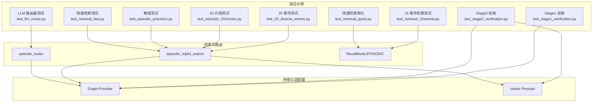
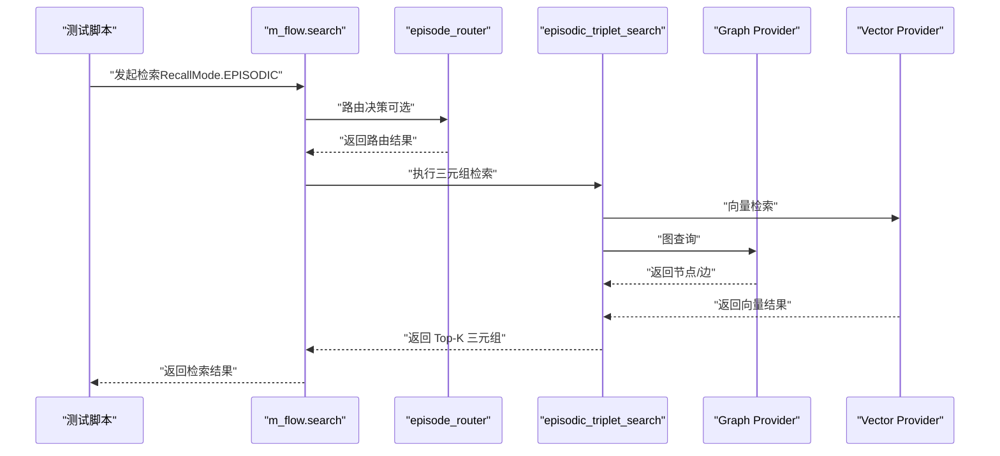
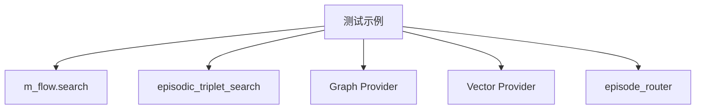

# 测试和验证示例

<cite>
**本文引用的文件**
- [examples/test_20_diverse_events.py](file://examples/test_20_diverse_events.py)
- [examples/test_episodic_20chunks.py](file://examples/test_episodic_20chunks.py)
- [examples/test_episodic_precision.py](file://examples/test_episodic_precision.py)
- [examples/test_llm_router.py](file://examples/test_llm_router.py)
- [examples/test_retrieval_15events.py](file://examples/test_retrieval_15events.py)
- [examples/test_retrieval_fast.py](file://examples/test_retrieval_fast.py)
- [examples/test_retrieval_quick.py](file://examples/test_retrieval_quick.py)
- [examples/test_stage1_verification.py](file://examples/test_stage1_verification.py)
- [examples/test_stage2_verification.py](file://examples/test_stage2_verification.py)
- [docker-compose.yml](file://docker-compose.yml)
- [deployment/helm/values.yaml](file://deployment/helm/values.yaml)
- [alembic/versions/92b3293baa66_mflow_initial_schema.py](file://alembic/versions/92b3293baa66_mflow_initial_schema.py)
- [m_flow/search/types.py](file://m_flow/search/types.py)
- [m_flow/retrieval/utils/episodic_triplet_search.py](file://m_flow/retrieval/utils/episodic_triplet_search.py)
- [m_flow/adapters/graph/get_graph_provider.py](file://m_flow/adapters/graph/get_graph_provider.py)
- [m_flow/adapters/vector/get_vector_provider.py](file://m_flow/adapters/vector/get_vector_provider.py)
- [m_flow/memory/episodic/episode_router.py](file://m_flow/memory/episodic/episode_router.py)
- [m_flow/memory/episodic/models.py](file://m_flow/memory/episodic/models.py)
- [m_flow/core/domain/models.py](file://m_flow/core/domain/models.py)
- [m_flow/shared/tracing/__init__.py](file://m_flow/shared/tracing/__init__.py)
- [m_flow/shared/logging_utils.py](file://m_flow/shared/logging_utils.py)
</cite>

## 目录
1. [简介](#简介)
2. [项目结构](#项目结构)
3. [核心组件](#核心组件)
4. [架构概览](#架构概览)
5. [详细组件分析](#详细组件分析)
6. [依赖分析](#依赖分析)
7. [性能考量](#性能考量)
8. [故障排除指南](#故障排除指南)
9. [结论](#结论)
10. [附录](#附录)

## 简介
本文件面向开发者与质量保证工程师，系统化整理并说明 M-flow 的测试与验证示例，涵盖：
- 20 个多样化事件的记忆写入与检索验证
- 20 个片段的 episodic 写入与检索精度验证
- LLM 路由器的合并/新建判断验证
- 15 个事件的记忆库检索验证
- 快速检索与快速检索（简化）验证
- Stage1/Stage2 验收测试（Facet/FacetPoint 结构与向量集合）
- 回归测试、压力测试与边界条件测试的实施建议
- 测试自动化与持续集成配置建议

目标是帮助读者快速理解每个测试的目的、执行方法、预期结果与解读方式，并提供可操作的测试数据准备、配置与自动化建议。

## 项目结构
测试相关的核心文件位于 examples 目录，围绕 episodic 记忆、检索、路由与阶段性结构验证展开；同时配合 docker-compose 与 Helm 配置用于本地与容器化环境的快速搭建。

```mermaid
graph TB
subgraph "测试示例"
T1["test_20_diverse_events.py"]
T2["test_episodic_20chunks.py"]
T3["test_episodic_precision.py"]
T4["test_llm_router.py"]
T5["test_retrieval_15events.py"]
T6["test_retrieval_fast.py"]
T7["test_retrieval_quick.py"]
T8["test_stage1_verification.py"]
T9["test_stage2_verification.py"]
end
subgraph "检索与路由"
R1["episodic_triplet_search.py"]
R2["episode_router.py"]
R3["search/types.py"]
end
subgraph "适配器与存储"
A1["get_graph_provider.py"]
A2["get_vector_provider.py"]
end
subgraph "部署与配置"
D1["docker-compose.yml"]
D2["deployment/helm/values.yaml"]
D3["alembic/versions/92b3293baa66_mflow_initial_schema.py"]
end
T1 --> R1
T2 --> R1
T3 --> R1
T4 --> R2
T5 --> R3
T6 --> R1
T7 --> R3
T8 --> A1
T9 --> A1
T9 --> A2
D1 --> A1
D1 --> A2
D2 --> A1
D2 --> A2
```

图表来源
- [examples/test_20_diverse_events.py:1-1282](file://examples/test_20_diverse_events.py#L1-L1282)
- [examples/test_episodic_20chunks.py:1-370](file://examples/test_episodic_20chunks.py#L1-L370)
- [examples/test_episodic_precision.py:1-203](file://examples/test_episodic_precision.py#L1-L203)
- [examples/test_llm_router.py:1-156](file://examples/test_llm_router.py#L1-L156)
- [examples/test_retrieval_15events.py:1-180](file://examples/test_retrieval_15events.py#L1-L180)
- [examples/test_retrieval_fast.py:1-129](file://examples/test_retrieval_fast.py#L1-L129)
- [examples/test_retrieval_quick.py:1-79](file://examples/test_retrieval_quick.py#L1-L79)
- [examples/test_stage1_verification.py:1-191](file://examples/test_stage1_verification.py#L1-L191)
- [examples/test_stage2_verification.py:1-170](file://examples/test_stage2_verification.py#L1-L170)
- [m_flow/retrieval/utils/episodic_triplet_search.py](file://m_flow/retrieval/utils/episodic_triplet_search.py)
- [m_flow/memory/episodic/episode_router.py](file://m_flow/memory/episodic/episode_router.py)
- [m_flow/search/types.py](file://m_flow/search/types.py)
- [m_flow/adapters/graph/get_graph_provider.py](file://m_flow/adapters/graph/get_graph_provider.py)
- [m_flow/adapters/vector/get_vector_provider.py](file://m_flow/adapters/vector/get_vector_provider.py)
- [docker-compose.yml:1-227](file://docker-compose.yml#L1-L227)
- [deployment/helm/values.yaml:1-23](file://deployment/helm/values.yaml#L1-L23)
- [alembic/versions/92b3293baa66_mflow_initial_schema.py:1-30](file://alembic/versions/92b3293baa66_mflow_initial_schema.py#L1-L30)

章节来源
- [docker-compose.yml:1-227](file://docker-compose.yml#L1-L227)
- [deployment/helm/values.yaml:1-23](file://deployment/helm/values.yaml#L1-L23)
- [alembic/versions/92b3293baa66_mflow_initial_schema.py:1-30](file://alembic/versions/92b3293baa66_mflow_initial_schema.py#L1-L30)

## 核心组件
- 测试示例：examples 目录下的各个脚本，分别覆盖不同维度的验证目标（多样性、精度、路由、检索、阶段结构）。
- 检索与路由：episodic_triplet_search 提供基于三元组的检索；episode_router 控制 episodic 的合并/新建决策。
- 适配器与存储：get_graph_provider 与 get_vector_provider 提供图数据库与向量数据库访问。
- 搜索类型：RecallMode.EPISODIC 用于指定检索模式。
- 部署与配置：docker-compose 与 Helm values 提供本地与容器化部署参考。

章节来源
- [examples/test_20_diverse_events.py:1-1282](file://examples/test_20_diverse_events.py#L1-L1282)
- [examples/test_episodic_20chunks.py:1-370](file://examples/test_episodic_20chunks.py#L1-L370)
- [examples/test_episodic_precision.py:1-203](file://examples/test_episodic_precision.py#L1-L203)
- [examples/test_llm_router.py:1-156](file://examples/test_llm_router.py#L1-L156)
- [examples/test_retrieval_15events.py:1-180](file://examples/test_retrieval_15events.py#L1-L180)
- [examples/test_retrieval_fast.py:1-129](file://examples/test_retrieval_fast.py#L1-L129)
- [examples/test_retrieval_quick.py:1-79](file://examples/test_retrieval_quick.py#L1-L79)
- [examples/test_stage1_verification.py:1-191](file://examples/test_stage1_verification.py#L1-L191)
- [examples/test_stage2_verification.py:1-170](file://examples/test_stage2_verification.py#L1-L170)
- [m_flow/retrieval/utils/episodic_triplet_search.py](file://m_flow/retrieval/utils/episodic_triplet_search.py)
- [m_flow/memory/episodic/episode_router.py](file://m_flow/memory/episodic/episode_router.py)
- [m_flow/search/types.py](file://m_flow/search/types.py)
- [m_flow/adapters/graph/get_graph_provider.py](file://m_flow/adapters/graph/get_graph_provider.py)
- [m_flow/adapters/vector/get_vector_provider.py](file://m_flow/adapters/vector/get_vector_provider.py)

## 架构概览
下图展示了测试示例与核心检索/路由模块之间的交互关系，以及与图/向量存储的连接。

图表来源
- [examples/test_20_diverse_events.py:1-1282](file://examples/test_20_diverse_events.py#L1-L1282)
- [examples/test_episodic_20chunks.py:1-370](file://examples/test_episodic_20chunks.py#L1-L370)
- [examples/test_episodic_precision.py:1-203](file://examples/test_episodic_precision.py#L1-L203)
- [examples/test_llm_router.py:1-156](file://examples/test_llm_router.py#L1-L156)
- [examples/test_retrieval_15events.py:1-180](file://examples/test_retrieval_15events.py#L1-L180)
- [examples/test_retrieval_fast.py:1-129](file://examples/test_retrieval_fast.py#L1-L129)
- [examples/test_retrieval_quick.py:1-79](file://examples/test_retrieval_quick.py#L1-L79)
- [examples/test_stage1_verification.py:1-191](file://examples/test_stage1_verification.py#L1-L191)
- [examples/test_stage2_verification.py:1-170](file://examples/test_stage2_verification.py#L1-L170)
- [m_flow/retrieval/utils/episodic_triplet_search.py](file://m_flow/retrieval/utils/episodic_triplet_search.py)
- [m_flow/memory/episodic/episode_router.py](file://m_flow/memory/episodic/episode_router.py)
- [m_flow/search/types.py](file://m_flow/search/types.py)
- [m_flow/adapters/graph/get_graph_provider.py](file://m_flow/adapters/graph/get_graph_provider.py)
- [m_flow/adapters/vector/get_vector_provider.py](file://m_flow/adapters/vector/get_vector_provider.py)

## 详细组件分析

### 20 个多样化事件测试
- 目的：验证系统对多种文档形态（会议纪要、邮件、对话、报告、公告、故障报告等）、表达方式（正式/非正式、中英混用、列表/叙述）与内容主题（技术、产品、运营、客户、团队、法务等）的写入与检索能力。
- 执行方法：设置环境变量启用 episodic，准备包含 20 个事件样本的数据，调用写入与记忆化流程，随后进行检索验证。
- 预期结果：写入成功，检索返回与查询语义相关的片段，关键词命中率达标。
- 测试数据准备：使用 examples/test_20_diverse_events.py 中的事件集合，确保环境变量 MFLOW_EPISODIC_ENABLED=true。
- 解读与评估：统计检索命中关键词的比例，观察 Top-K 结果的相关性；若多数查询达到 50% 以上命中则视为通过。

章节来源
- [examples/test_20_diverse_events.py:1-1282](file://examples/test_20_diverse_events.py#L1-L1282)

### 20 个片段的事件测试
- 目的：验证将长文档拆分为多个 chunk 后，episodic 写入与检索的准确性与性能。
- 执行方法：准备完整项目报告文档，调用 add 与 memorize（chunk_size=200），随后查询图数据库中的 Episode/Facet/ContentFragment 数量，并执行 episodic_triplet_search 进行关键词匹配。
- 预期结果：ContentFragment 数量与 chunk 数量一致；Facet 描述可被提取；triplet 检索返回与查询相关的三元组。
- 测试数据准备：使用 examples/test_episodic_20chunks.py 中的 TEST_DOCUMENT，可选 --reset 重置数据库。
- 解读与评估：统计返回 triplets 数量与关键词匹配数；Top-1 匹配度越高，检索质量越好。

章节来源
- [examples/test_episodic_20chunks.py:1-370](file://examples/test_episodic_20chunks.py#L1-L370)

### 事件精度测试
- 目的：评估检索结果的排序与相关性，给出 Top-K 的详细信息与关键词匹配度。
- 执行方法：调用 episodic_triplet_search 获取 top_k=10 的结果，计算每个三元组的关键词匹配数，记录最佳匹配排名。
- 预期结果：最佳匹配通常在 Top 3 内；关键词匹配数越多，相关性越强。
- 测试数据准备：确保已有 Episode 数据（可先运行 20 片段测试），使用 examples/test_episodic_precision.py。
- 解读与评估：以“最佳匹配排名”和“关键词命中比例”作为评估指标；Top 1 通过为优秀，Top 3 通过为良好。

章节来源
- [examples/test_episodic_precision.py:1-203](file://examples/test_episodic_precision.py#L1-L203)

### LLM 路由器测试
- 目的：验证 LLM 驱动的 episodic 路由器能否正确区分相关/无关文档，从而进行合并或新建。
- 执行方法：依次添加三个文档（初始项目文档、相关跟进文档、无关文档），统计 Episode 数量变化。
- 预期结果：初始创建 1 个 Episode；相关文档合并后仍为 1；无关文档新建为 2。
- 测试数据准备：使用 examples/test_llm_router.py，需启用 MFLOW_EPISODIC_ENABLE_ROUTING 与 MFLOW_EPISODIC_ROUTING_USE_LLM。
- 解读与评估：通过 Episode 数量变化判断路由器决策是否符合预期；可进一步查看图数据库中的 Episode 摘要核验。

章节来源
- [examples/test_llm_router.py:1-156](file://examples/test_llm_router.py#L1-L156)

### 15 个事件的检索测试
- 目的：覆盖技术、销售、财务、HR、战略、运营、安全、行政等多类事件的记忆库检索。
- 执行方法：使用 m_flow.search（RecallMode.EPISODIC）执行查询，收集结果文本并进行关键词匹配。
- 预期结果：成功率 ≥ 50%（按关键词匹配率计算）；失败查询可定位缺失关键词并优化。
- 测试数据准备：使用 examples/test_retrieval_15events.py 中的查询列表，确保已有记忆数据。
- 解读与评估：统计总体成功率与按类别成功率；对失败查询进行关键词补充与查询优化。

章节来源
- [examples/test_retrieval_15events.py:1-180](file://examples/test_retrieval_15events.py#L1-L180)
- [m_flow/search/types.py](file://m_flow/search/types.py)

### 快速检索测试（直接 triplet search）
- 目的：不依赖 LLM，直接使用 episodic_triplet_search 进行检索，评估检索速度与关键词命中情况。
- 执行方法：遍历查询列表，调用 episodic_triplet_search，提取三元组文本进行关键词匹配，记录耗时。
- 预期结果：平均响应时间合理，关键词命中率稳定；可作为性能基线。
- 测试数据准备：使用 examples/test_retrieval_fast.py。
- 解读与评估：关注平均耗时与命中率；异常耗时或低命中率需检查向量索引与检索参数。

章节来源
- [examples/test_retrieval_fast.py:1-129](file://examples/test_retrieval_fast.py#L1-L129)
- [m_flow/retrieval/utils/episodic_triplet_search.py](file://m_flow/retrieval/utils/episodic_triplet_search.py)

### 快速检索测试（简化）
- 目的：用较少查询快速验证检索链路的可用性与基本性能。
- 执行方法：使用 m_flow.search（RecallMode.EPISODIC）执行少量查询，统计成功率与耗时。
- 预期结果：成功率 ≥ 50%，耗时可接受。
- 测试数据准备：使用 examples/test_retrieval_quick.py。
- 解读与评估：作为日常回归测试的轻量版本，便于快速反馈。

章节来源
- [examples/test_retrieval_quick.py:1-79](file://examples/test_retrieval_quick.py#L1-L79)
- [m_flow/search/types.py](file://m_flow/search/types.py)

### Stage1 验收测试
- 目的：静态与结构验收，确保 FacetPoint 可导入、Facet.metadata.index_fields 包含 anchor_text、episodic_triplet_search 投影包含 anchor_text，以及 Facet-has_point 关系结构正确。
- 执行方法：导入模型、读取模型字段、构造 Facet/FacetPoint/Edge 并验证关系。
- 预期结果：所有验收项通过，FacetPoint 与 has_point 关系结构可用。
- 测试数据准备：使用 examples/test_stage1_verification.py。
- 解读与评估：通过后方可进入 Stage2 的写入端实现。

章节来源
- [examples/test_stage1_verification.py:1-191](file://examples/test_stage1_verification.py#L1-L191)
- [m_flow/core/domain/models.py](file://m_flow/core/domain/models.py)

### Stage2 验收测试
- 目的：验证 FacetPoint 写入 MVP 的结构与向量集合创建情况。
- 执行方法：清空数据库，添加测试内容并执行 memorize，查询图数据库中的 FacetPoint/has_point/anchor_text，检查向量库集合。
- 预期结果：FacetPoint 节点与 has_point 边存在，Facet.anchor_text 有值，向量集合创建成功。
- 测试数据准备：使用 examples/test_stage2_verification.py，需启用 MFLOW_EPISODIC_ENABLE_FACET_POINTS。
- 解读与评估：若未生成 FacetPoint，检查日志中 FacetPoint 构建输出与 LLM 生成内容。

章节来源
- [examples/test_stage2_verification.py:1-170](file://examples/test_stage2_verification.py#L1-L170)
- [m_flow/adapters/graph/get_graph_provider.py](file://m_flow/adapters/graph/get_graph_provider.py)
- [m_flow/adapters/vector/get_vector_provider.py](file://m_flow/adapters/vector/get_vector_provider.py)

### 检索流程序列图（基于示例）

图表来源
- [examples/test_retrieval_15events.py:1-180](file://examples/test_retrieval_15events.py#L1-L180)
- [examples/test_retrieval_fast.py:1-129](file://examples/test_retrieval_fast.py#L1-L129)
- [examples/test_episodic_20chunks.py:1-370](file://examples/test_episodic_20chunks.py#L1-L370)
- [examples/test_llm_router.py:1-156](file://examples/test_llm_router.py#L1-L156)
- [m_flow/memory/episodic/episode_router.py](file://m_flow/memory/episodic/episode_router.py)
- [m_flow/retrieval/utils/episodic_triplet_search.py](file://m_flow/retrieval/utils/episodic_triplet_search.py)
- [m_flow/adapters/graph/get_graph_provider.py](file://m_flow/adapters/graph/get_graph_provider.py)
- [m_flow/adapters/vector/get_vector_provider.py](file://m_flow/adapters/vector/get_vector_provider.py)

## 依赖分析
- 测试示例依赖 m_flow.search 与检索工具（episodic_triplet_search），以及图/向量适配器。
- LLM 路由器依赖 episode_router 与图数据库。
- Stage1/Stage2 验收依赖图数据库与向量数据库的可用性与集合创建。

图表来源
- [examples/test_20_diverse_events.py:1-1282](file://examples/test_20_diverse_events.py#L1-L1282)
- [examples/test_episodic_20chunks.py:1-370](file://examples/test_episodic_20chunks.py#L1-L370)
- [examples/test_episodic_precision.py:1-203](file://examples/test_episodic_precision.py#L1-L203)
- [examples/test_llm_router.py:1-156](file://examples/test_llm_router.py#L1-L156)
- [examples/test_retrieval_15events.py:1-180](file://examples/test_retrieval_15events.py#L1-L180)
- [examples/test_retrieval_fast.py:1-129](file://examples/test_retrieval_fast.py#L1-L129)
- [examples/test_retrieval_quick.py:1-79](file://examples/test_retrieval_quick.py#L1-L79)
- [examples/test_stage1_verification.py:1-191](file://examples/test_stage1_verification.py#L1-L191)
- [examples/test_stage2_verification.py:1-170](file://examples/test_stage2_verification.py#L1-L170)
- [m_flow/retrieval/utils/episodic_triplet_search.py](file://m_flow/retrieval/utils/episodic_triplet_search.py)
- [m_flow/memory/episodic/episode_router.py](file://m_flow/memory/episodic/episode_router.py)
- [m_flow/adapters/graph/get_graph_provider.py](file://m_flow/adapters/graph/get_graph_provider.py)
- [m_flow/adapters/vector/get_vector_provider.py](file://m_flow/adapters/vector/get_vector_provider.py)

## 性能考量
- 检索延迟：快速检索测试可作为性能基线；若平均耗时显著上升，需检查向量索引、检索 top_k 与 wide_search_top_k 设置。
- 数据规模：20 片段测试模拟真实分块场景，建议在相同硬件条件下对比不同 chunk_size 的性能表现。
- LLM 路由器：启用 LLM 路由会增加推理开销，建议在生产中结合缓存与批处理优化。
- 向量集合：FacetPoint/Facet anchor_text 等集合的创建与维护会影响检索性能，需定期检查集合大小与重建策略。

## 故障排除指南
- 无检索结果：检查 RecallMode 是否为 EPISODIC，确认数据已写入并完成 memorize。
- Episode 数量异常：确认 LLM 路由器开关与模型配置，检查图数据库查询语句。
- FacetPoint 未生成：检查日志中 FacetPoint 构建输出，确认 LLM 输出与环境变量 MFLOW_EPISODIC_ENABLE_FACET_POINTS。
- 向量集合缺失：确认向量引擎初始化与集合创建逻辑，检查 has_collection 调用。
- 环境变量：确保 ENABLE_BACKEND_ACCESS_CONTROL=false、MFLOW_EPISODIC_ENABLED=true 等关键开关正确设置。

章节来源
- [examples/test_stage2_verification.py:1-170](file://examples/test_stage2_verification.py#L1-L170)
- [examples/test_llm_router.py:1-156](file://examples/test_llm_router.py#L1-L156)
- [examples/test_episodic_20chunks.py:1-370](file://examples/test_episodic_20chunks.py#L1-L370)

## 结论
本文档系统梳理了 M-flow 的测试与验证示例，覆盖多样性写入、片段写入与精度、LLM 路由器、多事件检索、快速检索与阶段性结构验收。通过这些测试，开发者可以快速定位问题、评估性能并指导回归与自动化测试的开展。建议在持续集成中纳入快速检索与阶段性验收测试，以保障核心能力的稳定性。

## 附录
- 测试自动化与持续集成建议
  - 在 CI 中固定 Python 版本与依赖安装方式，使用 docker-compose 或 Helm 启动后端与数据库服务。
  - 将快速检索与阶段性验收测试作为必跑步骤，将 20 事件与 15 事件检索作为可选步骤。
  - 对 LLM 路由器测试设置稳定的环境变量与模型配置，避免外部依赖波动影响结果。
  - 使用日志与指标采集（如 tracing、logging_utils）记录每次测试的关键指标，便于趋势分析。
- 部署与配置参考
  - 本地开发可参考 docker-compose.yml，按需启用 neo4j、postgres、chromadb、redis 等服务。
  - 容器化部署可参考 deployment/helm/values.yaml，按需调整镜像、资源与存储。
  - 初始数据库迁移参考 alembic/versions/92b3293baa66_mflow_initial_schema.py，确保应用启动时 schema 初始化。

章节来源
- [docker-compose.yml:1-227](file://docker-compose.yml#L1-L227)
- [deployment/helm/values.yaml:1-23](file://deployment/helm/values.yaml#L1-L23)
- [alembic/versions/92b3293baa66_mflow_initial_schema.py:1-30](file://alembic/versions/92b3293baa66_mflow_initial_schema.py#L1-L30)
- [m_flow/shared/tracing/__init__.py](file://m_flow/shared/tracing/__init__.py)
- [m_flow/shared/logging_utils.py](file://m_flow/shared/logging_utils.py)