# 示例和教程

<cite>
**本文引用的文件**
- [simple_example.py](file://examples/python/simple_example.py)
- [m_flow_simple_document_demo.py](file://examples/python/m_flow_simple_document_demo.py)
- [multimedia_example.py](file://examples/python/multimedia_example.py)
- [run_custom_pipeline_example.py](file://examples/python/run_custom_pipeline_example.py)
- [relational_database_migration_example.py](file://examples/python/relational_database_migration_example.py)
- [neo4j_example.py](file://examples/database_examples/neo4j_example.py)
- [pgvector_example.py](file://examples/database_examples/pgvector_example.py)
- [chromadb_example.py](file://examples/database_examples/chromadb_example.py)
- [pipeline.py](file://examples/low_level/pipeline.py)
- [agentic_reasoning_procurement_example.py](file://examples/python/agentic_reasoning_procurement_example.py)
- [web_url_fetcher_example.py](file://examples/python/web_url_fetcher_example.py)
- [dynamic_multiple_edges_example.py](file://examples/python/dynamic_multiple_edges_example.py)
- [weighted_edges_example.py](file://examples/python/weighted_edges_example.py)
- [simple_node_set_example.py](file://examples/python/simple_node_set_example.py)
- [dynamic_steps_example.py](file://examples/python/dynamic_steps_example.py)
</cite>

## 目录
1. [简介](#简介)
2. [项目结构](#项目结构)
3. [核心组件](#核心组件)
4. [架构总览](#架构总览)
5. [详细组件分析](#详细组件分析)
6. [依赖分析](#依赖分析)
7. [性能考虑](#性能考虑)
8. [故障排查指南](#故障排查指南)
9. [结论](#结论)
10. [附录](#附录)

## 简介
本文件系统性整理 M-flow 的示例与教程集合，覆盖从基础到高级的完整使用路径：简单数据添加、复杂知识图谱构建、多粒度检索；数据库集成（Neo4j、PostgreSQL/pgvector、ChromaDB）；低层 API 使用；关系型数据库迁移；代理智能体集成；多媒体数据处理；自定义管道配置；最佳实践与常见场景。

## 项目结构
示例主要分布在以下位置：
- examples/python：高层 API 示例，演示典型工作流与高级特性
- examples/database_examples：数据库适配器示例
- examples/low_level：低层 API 与自定义节点/管道示例
- examples/relational_db_with_dlt：配合数据加载工具的关系型迁移示例

```mermaid
graph TB
A["examples/python"] --> A1["simple_example.py"]
A --> A2["m_flow_simple_document_demo.py"]
A --> A3["multimedia_example.py"]
A --> A4["run_custom_pipeline_example.py"]
A --> A5["relational_database_migration_example.py"]
A --> A6["agentic_reasoning_procurement_example.py"]
A --> A7["web_url_fetcher_example.py"]
A --> A8["dynamic_multiple_edges_example.py"]
A --> A9["weighted_edges_example.py"]
A --> A10["simple_node_set_example.py"]
A --> A11["dynamic_steps_example.py"]
B["examples/database_examples"] --> B1["neo4j_example.py"]
B --> B2["pgvector_example.py"]
B --> B3["chromadb_example.py"]
C["examples/low_level"] --> C1["pipeline.py"]
```

**图表来源**
- [simple_example.py:1-51](file://examples/python/simple_example.py#L1-L51)
- [m_flow_simple_document_demo.py:1-39](file://examples/python/m_flow_simple_document_demo.py#L1-L39)
- [multimedia_example.py:1-50](file://examples/python/multimedia_example.py#L1-L50)
- [run_custom_pipeline_example.py:1-84](file://examples/python/run_custom_pipeline_example.py#L1-L84)
- [relational_database_migration_example.py:1-97](file://examples/python/relational_database_migration_example.py#L1-L97)
- [neo4j_example.py:1-50](file://examples/database_examples/neo4j_example.py#L1-L50)
- [pgvector_example.py:1-49](file://examples/database_examples/pgvector_example.py#L1-L49)
- [chromadb_example.py:1-49](file://examples/database_examples/chromadb_example.py#L1-L49)
- [pipeline.py:1-109](file://examples/low_level/pipeline.py#L1-L109)

**章节来源**
- [simple_example.py:1-51](file://examples/python/simple_example.py#L1-L51)
- [m_flow_simple_document_demo.py:1-39](file://examples/python/m_flow_simple_document_demo.py#L1-L39)
- [multimedia_example.py:1-50](file://examples/python/multimedia_example.py#L1-L50)
- [run_custom_pipeline_example.py:1-84](file://examples/python/run_custom_pipeline_example.py#L1-L84)
- [relational_database_migration_example.py:1-97](file://examples/python/relational_database_migration_example.py#L1-L97)
- [neo4j_example.py:1-50](file://examples/database_examples/neo4j_example.py#L1-L50)
- [pgvector_example.py:1-49](file://examples/database_examples/pgvector_example.py#L1-L49)
- [chromadb_example.py:1-49](file://examples/database_examples/chromadb_example.py#L1-L49)
- [pipeline.py:1-109](file://examples/low_level/pipeline.py#L1-L109)

## 核心组件
- 数据添加与检索：通过 add/memorize/search 实现“入 -> 记忆 -> 检索”的闭环
- 知识图谱构建：基于抽取、分类、分块、总结生成三元组与实体描述
- 多模态支持：音频、图像等非结构化数据的嵌入与检索
- 自定义管道：使用任务级 API 组装可插拔的处理步骤
- 数据库适配：Neo4j 图库、pgvector 向量库、ChromaDB 向量库
- 关系型迁移：从关系型数据库抽取模式与数据，导入图存储
- 代理智能体：将 M-flow 作为外部记忆后端，驱动跨域推理

**章节来源**
- [simple_example.py:21-46](file://examples/python/simple_example.py#L21-L46)
- [m_flow_simple_document_demo.py:12-35](file://examples/python/m_flow_simple_document_demo.py#L12-L35)
- [multimedia_example.py:20-44](file://examples/python/multimedia_example.py#L20-L44)
- [run_custom_pipeline_example.py:23-78](file://examples/python/run_custom_pipeline_example.py#L23-L78)
- [relational_database_migration_example.py:32-92](file://examples/python/relational_database_migration_example.py#L32-L92)

## 架构总览
下图展示了高层示例的工作流与关键交互点。

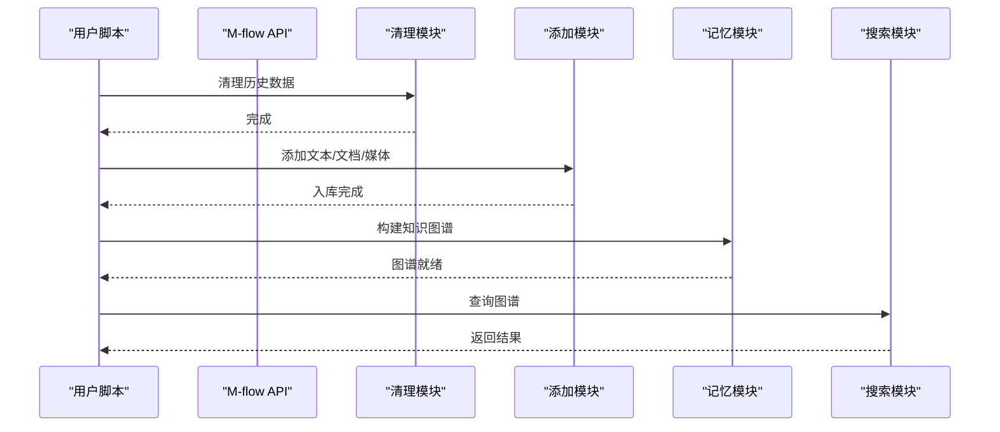

**图表来源**
- [simple_example.py:21-46](file://examples/python/simple_example.py#L21-L46)
- [m_flow_simple_document_demo.py:12-35](file://examples/python/m_flow_simple_document_demo.py#L12-L35)
- [multimedia_example.py:20-44](file://examples/python/multimedia_example.py#L20-L44)

## 详细组件分析

### 基础示例：快速入门
- 目标：演示“入 -> 记忆 -> 检索”的最小闭环
- 关键步骤：清理状态、添加样本文本、构建图谱、按三元组补全检索
- 适用场景：首次上手、验证环境

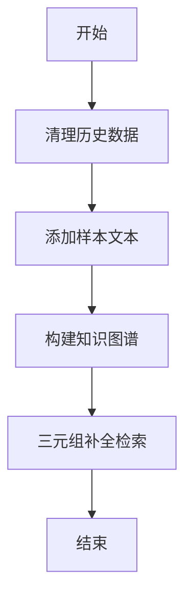

**图表来源**
- [simple_example.py:21-46](file://examples/python/simple_example.py#L21-L46)

**章节来源**
- [simple_example.py:1-51](file://examples/python/simple_example.py#L1-L51)

### 文档示例：结构化文档处理
- 目标：对本地文档进行入 -> 记忆 -> 检索
- 特点：自动识别文档类型，抽取关键信息，回答领域问题
- 适用场景：知识库问答、文档摘要

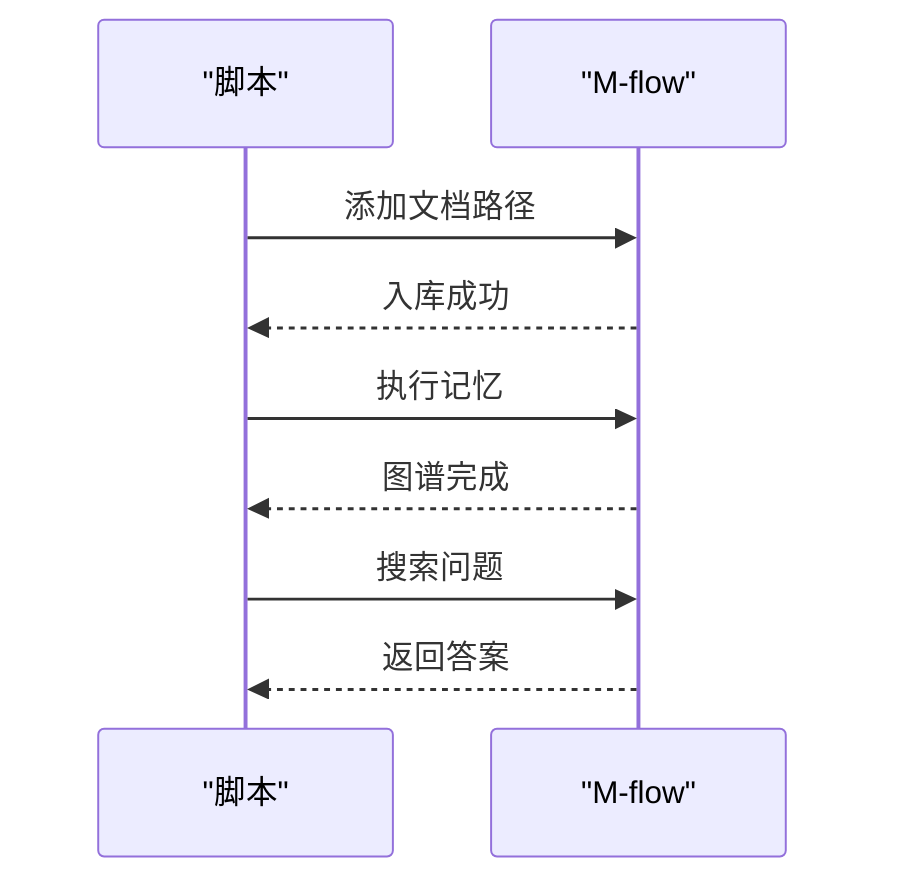

**图表来源**
- [m_flow_simple_document_demo.py:12-35](file://examples/python/m_flow_simple_document_demo.py#L12-L35)

**章节来源**
- [m_flow_simple_document_demo.py:1-39](file://examples/python/m_flow_simple_document_demo.py#L1-L39)

### 多媒体示例：音频与图像
- 目标：对音频与图像进行内容理解，生成知识图谱并检索摘要
- 关键点：RecallMode.SUMMARIES 用于多媒体摘要检索
- 适用场景：资产库检索、内容审核

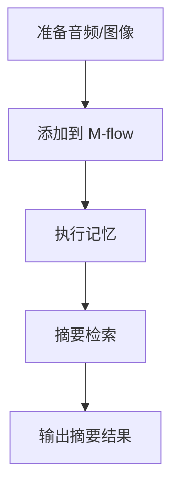

**图表来源**
- [multimedia_example.py:20-44](file://examples/python/multimedia_example.py#L20-L44)

**章节来源**
- [multimedia_example.py:1-50](file://examples/python/multimedia_example.py#L1-L50)

### 自定义管道示例：任务级组装
- 目标：使用低层 Task API 重现实例内置 add/memorize 流程
- 关键点：resolve_data_directories + ingest_data 组成 add；memorize 默认任务组成记忆
- 适用场景：需要细粒度控制或扩展处理步骤

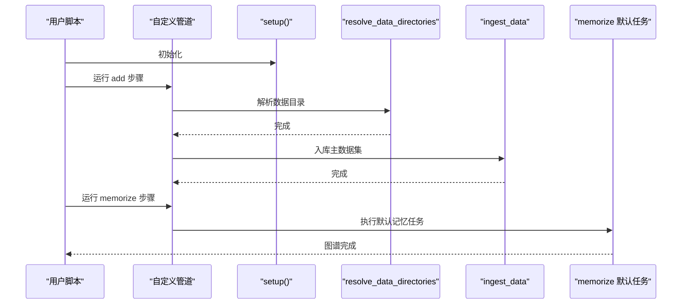

**图表来源**
- [run_custom_pipeline_example.py:23-78](file://examples/python/run_custom_pipeline_example.py#L23-L78)

**章节来源**
- [run_custom_pipeline_example.py:1-84](file://examples/python/run_custom_pipeline_example.py#L1-L84)

### 关系型数据库迁移示例
- 目标：从关系型数据库抽取模式与数据，导入图存储，并可视化
- 关键点：extract_schema -> migrate_relational_database -> search -> visualize
- 适用场景：遗留系统迁移、统一查询接口

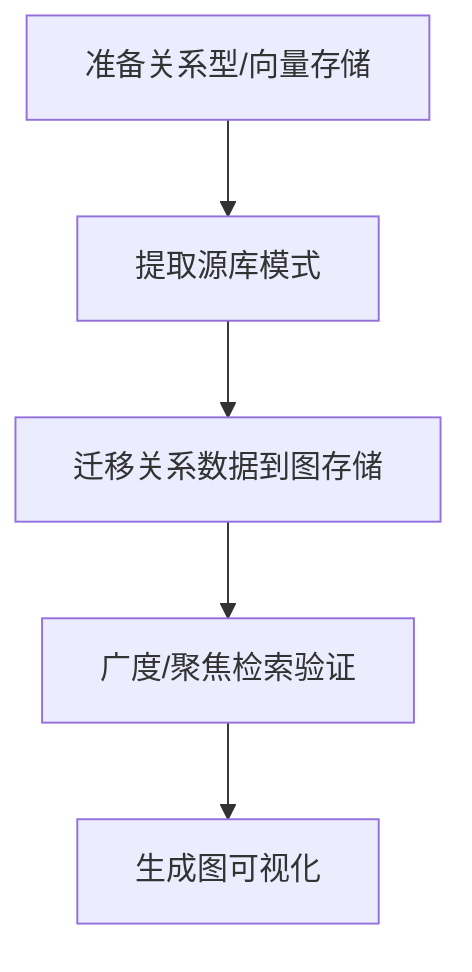

**图表来源**
- [relational_database_migration_example.py:32-92](file://examples/python/relational_database_migration_example.py#L32-L92)

**章节来源**
- [relational_database_migration_example.py:1-97](file://examples/python/relational_database_migration_example.py#L1-L97)

### 数据库集成示例

#### Neo4j 集成
- 目标：将 Neo4j 作为图存储后端
- 关键点：设置图数据库配置、添加数据、记忆、检索
- 适用场景：已有 Neo4j 基础设施的企业环境

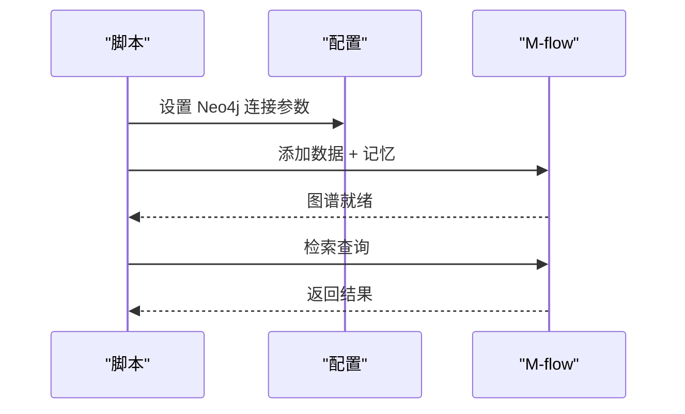

**图表来源**
- [neo4j_example.py:18-45](file://examples/database_examples/neo4j_example.py#L18-L45)

**章节来源**
- [neo4j_example.py:1-50](file://examples/database_examples/neo4j_example.py#L1-L50)

#### PostgreSQL/pgvector 集成
- 目标：使用 pgvector 作为向量后端，结合关系型存储
- 关键点：设置向量/关系数据库配置、添加数据、记忆、检索
- 适用场景：混合查询（结构化过滤 + 语义相似）

**章节来源**
- [pgvector_example.py:1-49](file://examples/database_examples/pgvector_example.py#L1-L49)

#### ChromaDB 集成
- 目标：使用 ChromaDB 作为向量存储后端
- 关键点：设置向量数据库配置、添加数据、记忆、检索（三元组/词块）
- 适用场景：RAG/语义搜索流水线

**章节来源**
- [chromadb_example.py:1-49](file://examples/database_examples/chromadb_example.py#L1-L49)

### 低层 API 示例：自定义节点与管道
- 目标：定义自定义 MemoryNode 模型，解析结构化 JSON，持久化节点
- 关键点：Author/Genre/Book/BookCategory 类型定义；parse_catalog 转换；persist_memory_nodes 存储
- 适用场景：业务模型映射、定制化图谱

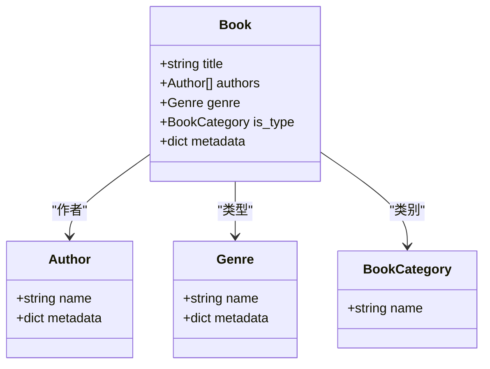

**图表来源**
- [pipeline.py:18-38](file://examples/low_level/pipeline.py#L18-L38)

**章节来源**
- [pipeline.py:1-109](file://examples/low_level/pipeline.py#L1-L109)

### 代理智能体集成示例
- 目标：将 M-flow 作为采购代理的记忆后端，进行跨域推理
- 关键点：初始化三个知识域（供应商目录、采购历史、政策），按需检索
- 适用场景：智能决策、合规检查、跨域问答

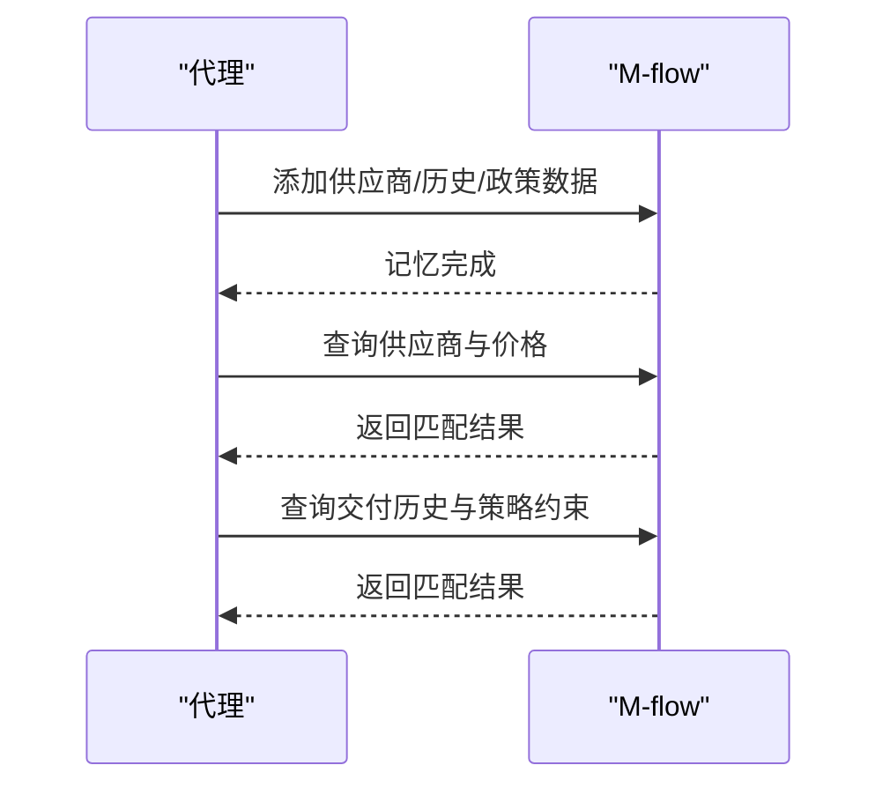

**图表来源**
- [agentic_reasoning_procurement_example.py:31-57](file://examples/python/agentic_reasoning_procurement_example.py#L31-L57)

**章节来源**
- [agentic_reasoning_procurement_example.py:1-76](file://examples/python/agentic_reasoning_procurement_example.py#L1-L76)

### 多媒体数据处理示例
- 目标：对音频与图像进行内容理解与检索
- 关键点：RecallMode.SUMMARIES 用于摘要检索
- 适用场景：资产库检索、内容审核

**章节来源**
- [multimedia_example.py:1-50](file://examples/python/multimedia_example.py#L1-L50)

### 自定义管道配置示例
- 动态步骤选择：根据启用开关分别执行分类、分块抽取、重建图谱、检索
- 适用场景：渐进式处理、按需启用能力

**章节来源**
- [dynamic_steps_example.py:1-81](file://examples/python/dynamic_steps_example.py#L1-L81)

### 边关系示例
- 加权边：为关系赋予权重（如播放次数、评分），支持带权重与不带权重的混合
- 多关系边：同一实体可有多条不同类型的边
- 适用场景：推荐系统、社交网络、课程选课

**章节来源**
- [weighted_edges_example.py:1-70](file://examples/python/weighted_edges_example.py#L1-L70)
- [dynamic_multiple_edges_example.py:1-68](file://examples/python/dynamic_multiple_edges_example.py#L1-L68)

### 节点集标签示例
- 目标：为入站内容打上主题标签，限定检索范围
- 适用场景：多主题知识库、按域检索

**章节来源**
- [simple_node_set_example.py:1-43](file://examples/python/simple_node_set_example.py#L1-L43)

### 网页抓取示例
- 目标：通过 CSS 选择器抓取网页内容，构建知识图谱并可视化
- 适用场景：知识采集、主题建模

**章节来源**
- [web_url_fetcher_example.py:1-34](file://examples/python/web_url_fetcher_example.py#L1-L34)

## 依赖分析
- 示例与核心 API 的耦合：多数示例直接调用 m_flow.add/memorize/search
- 数据库适配：通过配置函数设置图/向量/关系数据库参数
- 低层 API：使用 MemoryNode、Edge、persist_memory_nodes、run_tasks 等

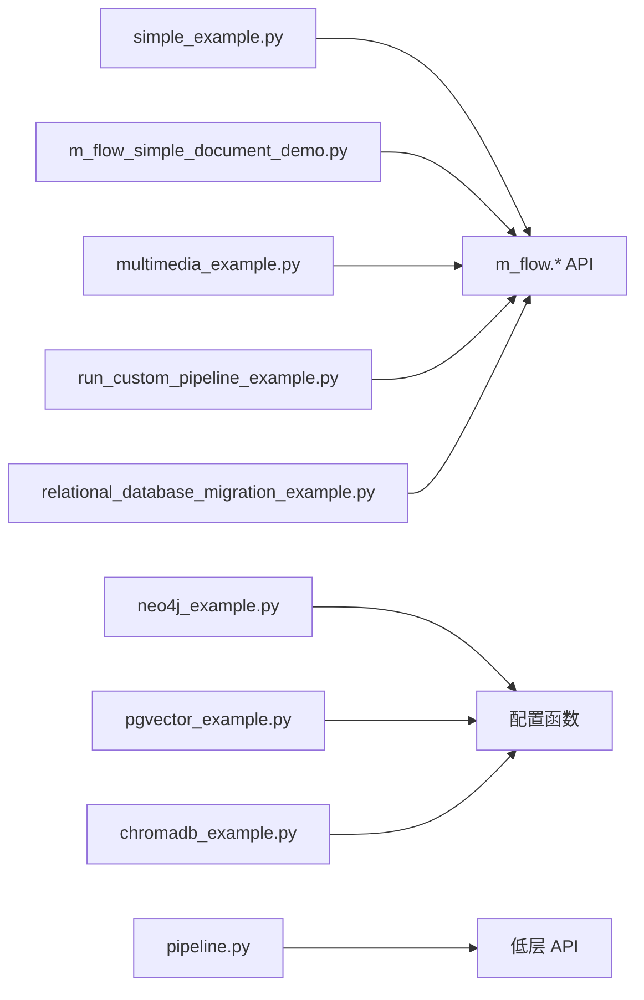

**图表来源**
- [simple_example.py:10-12](file://examples/python/simple_example.py#L10-L12)
- [m_flow_simple_document_demo.py:2-3](file://examples/python/m_flow_simple_document_demo.py#L2-L3)
- [multimedia_example.py:12-13](file://examples/python/multimedia_example.py#L12-L13)
- [run_custom_pipeline_example.py:10-11](file://examples/python/run_custom_pipeline_example.py#L10-L11)
- [relational_database_migration_example.py:11-12](file://examples/python/relational_database_migration_example.py#L11-L12)
- [neo4j_example.py:25-31](file://examples/database_examples/neo4j_example.py#L25-L31)
- [pgvector_example.py:21-31](file://examples/database_examples/pgvector_example.py#L21-L31)
- [chromadb_example.py:21-27](file://examples/database_examples/chromadb_example.py#L21-L27)
- [pipeline.py:8-12](file://examples/low_level/pipeline.py#L8-L12)

**章节来源**
- [simple_example.py:10-12](file://examples/python/simple_example.py#L10-L12)
- [m_flow_simple_document_demo.py:2-3](file://examples/python/m_flow_simple_document_demo.py#L2-L3)
- [multimedia_example.py:12-13](file://examples/python/multimedia_example.py#L12-L13)
- [run_custom_pipeline_example.py:10-11](file://examples/python/run_custom_pipeline_example.py#L10-L11)
- [relational_database_migration_example.py:11-12](file://examples/python/relational_database_migration_example.py#L11-L12)
- [neo4j_example.py:25-31](file://examples/database_examples/neo4j_example.py#L25-L31)
- [pgvector_example.py:21-31](file://examples/database_examples/pgvector_example.py#L21-L31)
- [chromadb_example.py:21-27](file://examples/database_examples/chromadb_example.py#L21-L27)
- [pipeline.py:8-12](file://examples/low_level/pipeline.py#L8-L12)

## 性能考虑
- 分步处理：先分类/分块，再抽取/记忆，最后检索，避免一次性处理大量数据
- 检索参数：根据上下文大小调整 top_k，避免上下文溢出
- 可视化成本：大规模图谱可视化会消耗较多资源，建议按需生成
- 数据库选择：向量库与图库的选择影响检索速度与查询能力，应结合业务场景评估

## 故障排查指南
- 环境变量缺失：确保 LLM/数据库连接参数正确设置
- 权限与访问控制：迁移示例中关闭了后端访问控制以简化演示
- 日志级别：示例脚本通常设置为 ERROR/INFO，便于定位问题
- 数据清理：若出现状态异常，优先执行清理流程

**章节来源**
- [relational_database_migration_example.py:35-35](file://examples/python/relational_database_migration_example.py#L35-L35)
- [run_custom_pipeline_example.py:82-82](file://examples/python/run_custom_pipeline_example.py#L82-L82)

## 结论
本教程集合覆盖了 M-flow 的核心能力与典型使用路径，从高层 API 到低层 API，从单库到多库，从结构化到非结构化，从静态到动态，均可在此找到参考实现。建议按“基础 -> 高级 -> 集成 -> 迁移”的顺序学习，并结合自身数据形态与业务目标选择合适的数据库与检索模式。

## 附录

### 示例运行方法与注意事项
- 运行环境：Python 异步运行时，确保安装依赖与环境变量
- 常见前置条件：清理历史数据、设置数据库配置、准备 LLM 凭证
- 注意事项：避免一次性处理超大数据集；合理设置检索 top_k；必要时关闭访问控制以便演示