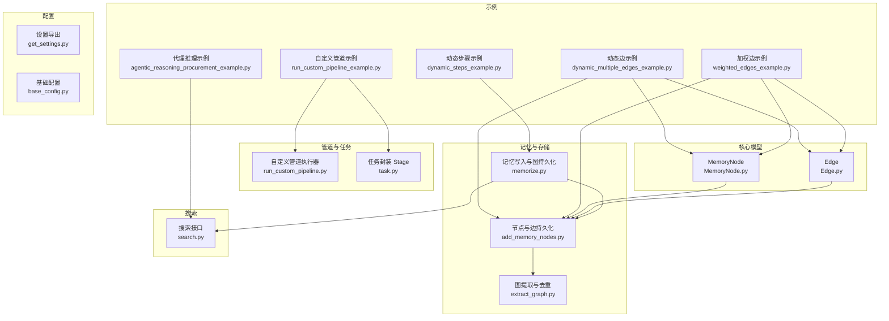
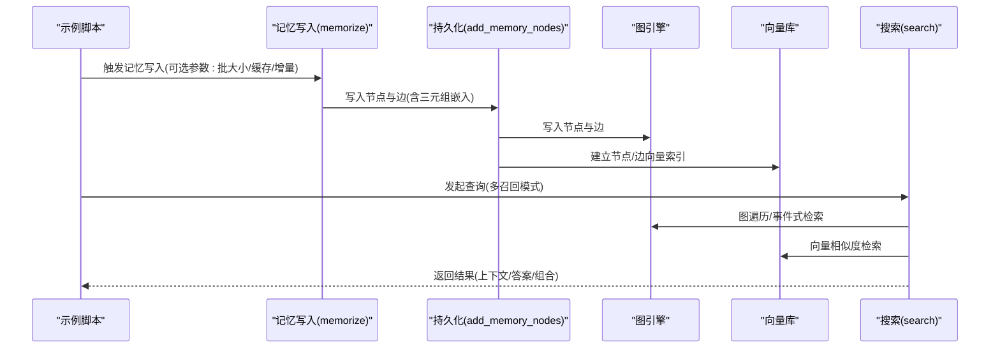
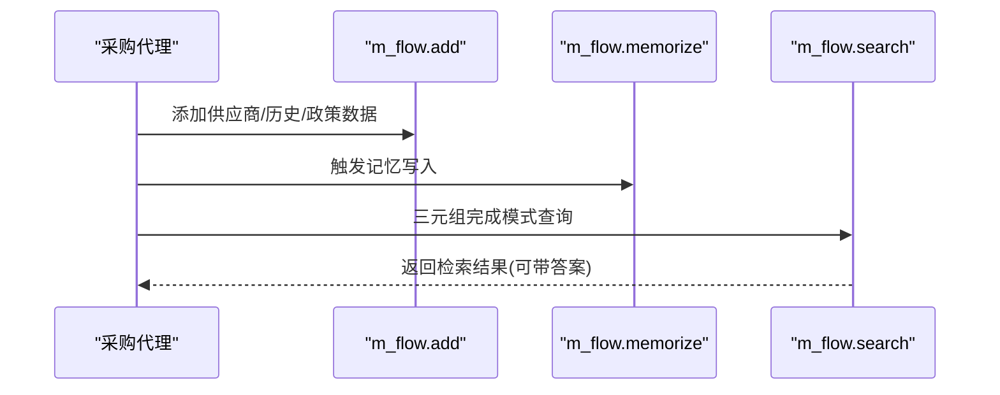
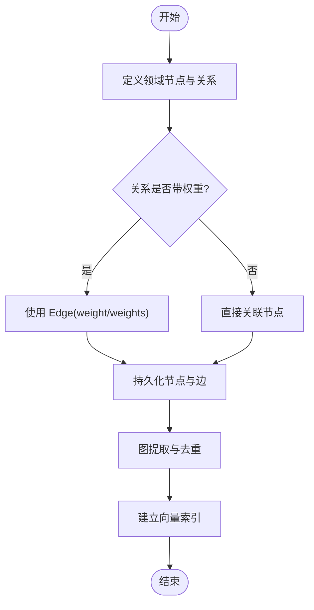
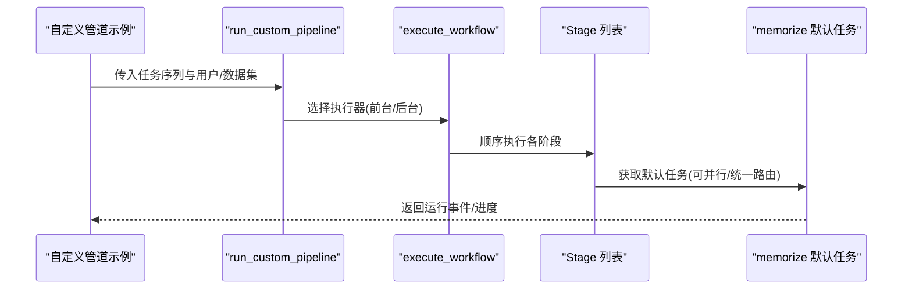
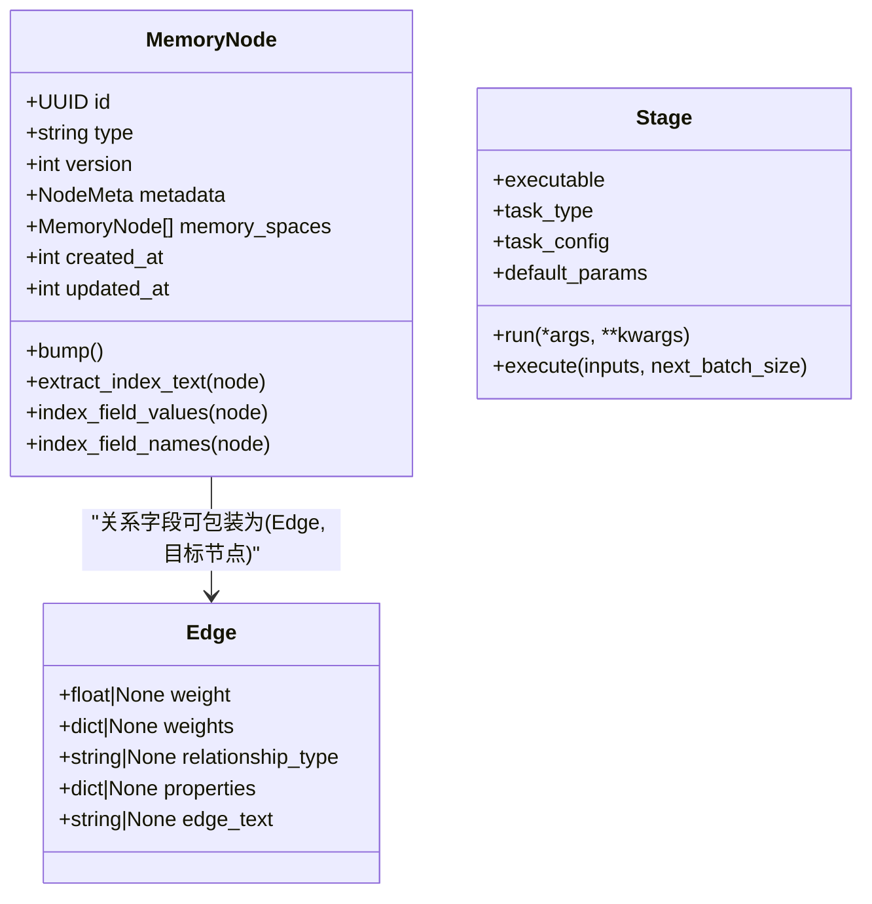
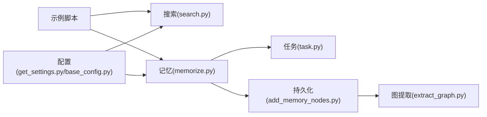

# 高级功能示例

<cite>
**本文引用的文件**
- [agentic_reasoning_procurement_example.py](file://examples/python/agentic_reasoning_procurement_example.py)
- [dynamic_multiple_edges_example.py](file://examples/python/dynamic_multiple_edges_example.py)
- [dynamic_steps_example.py](file://examples/python/dynamic_steps_example.py)
- [run_custom_pipeline_example.py](file://examples/python/run_custom_pipeline_example.py)
- [weighted_edges_example.py](file://examples/python/weighted_edges_example.py)
- [MemoryNode.py](file://m_flow/core/models/MemoryNode.py)
- [Edge.py](file://m_flow/core/models/Edge.py)
- [run_custom_pipeline.py](file://m_flow/pipeline/custom/run_custom_pipeline.py)
- [memorize.py](file://m_flow/api/v1/memorize/memorize.py)
- [add_memory_nodes.py](file://m_flow/storage/add_memory_nodes.py)
- [task.py](file://m_flow/pipeline/tasks/task.py)
- [write_episodic_memories.py](file://m_flow/memory/episodic/write_episodic_memories.py)
- [extract_graph.py](file://m_flow/knowledge/graph_ops/utils/extract_graph.py)
- [search.py](file://m_flow/api/v1/search/search.py)
- [get_settings.py](file://m_flow/config/settings/get_settings.py)
- [base_config.py](file://m_flow/base_config.py)
</cite>

## 目录
1. [简介](#简介)
2. [项目结构](#项目结构)
3. [核心组件](#核心组件)
4. [架构总览](#架构总览)
5. [详细组件分析](#详细组件分析)
6. [依赖分析](#依赖分析)
7. [性能考虑](#性能考虑)
8. [故障排查指南](#故障排查指南)
9. [结论](#结论)
10. [附录](#附录)

## 简介
本文件面向有经验的开发者，系统化讲解 M-flow 的高级功能与实践案例，涵盖：
- 代理智能体推理：如何以 M-flow 为记忆后端构建 AI 采购代理，进行跨域检索与决策支持
- 动态边与动态步骤：基于领域模型的动态关系建模与可插拔流水线步骤
- 自定义管道配置：使用低层任务 API 组装个性化数据处理与工作流
- 加权边：在知识图谱中表达带权重的关系，提升检索与推理的语义强度
- 参数调优与性能优化：结合源码中的配置项与执行路径，给出实操建议

## 项目结构
围绕“高级功能示例”，本仓库的关键目录与文件如下：
- 示例脚本位于 examples/python，包含代理推理、动态边、动态步骤、自定义管道、加权边等示例
- 核心模型位于 m_flow/core/models，包含 MemoryNode 与 Edge
- 管道与任务系统位于 m_flow/pipeline，支持自定义流水线调度
- 记忆与图写入位于 m_flow/api/v1/memorize 与 m_flow/storage
- 图提取与去重位于 m_flow/knowledge/graph_ops/utils
- 搜索接口位于 m_flow/api/v1/search
- 配置位于 m_flow/config 与 m_flow/base_config

图表来源
- [agentic_reasoning_procurement_example.py:1-76](file://examples/python/agentic_reasoning_procurement_example.py#L1-L76)
- [dynamic_multiple_edges_example.py:1-68](file://examples/python/dynamic_multiple_edges_example.py#L1-L68)
- [dynamic_steps_example.py:1-81](file://examples/python/dynamic_steps_example.py#L1-L81)
- [run_custom_pipeline_example.py:1-84](file://examples/python/run_custom_pipeline_example.py#L1-L84)
- [weighted_edges_example.py:1-70](file://examples/python/weighted_edges_example.py#L1-L70)
- [MemoryNode.py:1-106](file://m_flow/core/models/MemoryNode.py#L1-L106)
- [Edge.py:1-36](file://m_flow/core/models/Edge.py#L1-L36)
- [run_custom_pipeline.py:1-95](file://m_flow/pipeline/custom/run_custom_pipeline.py#L1-L95)
- [task.py:1-152](file://m_flow/pipeline/tasks/task.py#L1-L152)
- [memorize.py:1-548](file://m_flow/api/v1/memorize/memorize.py#L1-L548)
- [add_memory_nodes.py:1-261](file://m_flow/storage/add_memory_nodes.py#L1-L261)
- [extract_graph.py:1-271](file://m_flow/knowledge/graph_ops/utils/extract_graph.py#L1-L271)
- [search.py:1-415](file://m_flow/api/v1/search/search.py#L1-L415)
- [get_settings.py:1-151](file://m_flow/config/settings/get_settings.py#L1-L151)
- [base_config.py:1-121](file://m_flow/base_config.py#L1-L121)

章节来源
- [agentic_reasoning_procurement_example.py:1-76](file://examples/python/agentic_reasoning_procurement_example.py#L1-L76)
- [dynamic_multiple_edges_example.py:1-68](file://examples/python/dynamic_multiple_edges_example.py#L1-L68)
- [dynamic_steps_example.py:1-81](file://examples/python/dynamic_steps_example.py#L1-L81)
- [run_custom_pipeline_example.py:1-84](file://examples/python/run_custom_pipeline_example.py#L1-L84)
- [weighted_edges_example.py:1-70](file://examples/python/weighted_edges_example.py#L1-L70)

## 核心组件
- MemoryNode：所有知识图谱节点的基类，具备版本控制、元数据索引字段、时间戳等能力
- Edge：关系元数据容器，支持权重、属性、关系类型、边文本等
- 自定义管道执行器：run_custom_pipeline 提供灵活的任务编排与执行模式
- 记忆写入管线：memorize 将文档分块、路由、摘要、写入图与向量库，并生成三元组嵌入
- 图持久化：add_memory_nodes 负责提取子图、去重、写入图数据库并建立向量索引
- 搜索接口：search 提供多种召回模式（三元组完成、事件式、过程式、Cypher、词块检索）

章节来源
- [MemoryNode.py:1-106](file://m_flow/core/models/MemoryNode.py#L1-L106)
- [Edge.py:1-36](file://m_flow/core/models/Edge.py#L1-L36)
- [run_custom_pipeline.py:1-95](file://m_flow/pipeline/custom/run_custom_pipeline.py#L1-L95)
- [memorize.py:1-548](file://m_flow/api/v1/memorize/memorize.py#L1-L548)
- [add_memory_nodes.py:1-261](file://m_flow/storage/add_memory_nodes.py#L1-L261)
- [search.py:1-415](file://m_flow/api/v1/search/search.py#L1-L415)

## 架构总览
下图展示了从“示例脚本”到“图写入与搜索”的完整链路，体现高级功能的落地路径。

图表来源
- [memorize.py:157-360](file://m_flow/api/v1/memorize/memorize.py#L157-L360)
- [add_memory_nodes.py:79-126](file://m_flow/storage/add_memory_nodes.py#L79-L126)
- [search.py:135-302](file://m_flow/api/v1/search/search.py#L135-L302)

## 详细组件分析

### 代理智能体推理示例
该示例演示如何将 M-flow 作为 AI 代理的记忆后端，进行跨域检索与决策支持。核心流程：
- 初始化：清理历史数据，添加供应商目录、采购历史、政策规则，触发记忆写入
- 查询：按域选择性检索，支持三元组完成模式的问答
- 分析：跨域对比与条件筛选（如缺陷率阈值）

图表来源
- [agentic_reasoning_procurement_example.py:31-71](file://examples/python/agentic_reasoning_procurement_example.py#L31-L71)
- [search.py:135-302](file://m_flow/api/v1/search/search.py#L135-L302)

章节来源
- [agentic_reasoning_procurement_example.py:1-76](file://examples/python/agentic_reasoning_procurement_example.py#L1-L76)
- [search.py:1-415](file://m_flow/api/v1/search/search.py#L1-L415)

### 动态边与动态步骤
- 动态边：通过在领域模型中混合使用带权重与不带权重的 Edge，实现关系强度的差异化表达；图提取时会扁平化权重字段，便于后续检索与排序
- 动态步骤：通过注册表选择性启用/禁用流水线步骤（分类、分块、抽取、重建知识图、检索），实现按需执行

图表来源
- [dynamic_multiple_edges_example.py:24-64](file://examples/python/dynamic_multiple_edges_example.py#L24-L64)
- [weighted_edges_example.py:33-66](file://examples/python/weighted_edges_example.py#L33-L66)
- [extract_graph.py:87-119](file://m_flow/knowledge/graph_ops/utils/extract_graph.py#L87-L119)
- [add_memory_nodes.py:79-126](file://m_flow/storage/add_memory_nodes.py#L79-L126)

章节来源
- [dynamic_multiple_edges_example.py:1-68](file://examples/python/dynamic_multiple_edges_example.py#L1-L68)
- [weighted_edges_example.py:1-70](file://examples/python/weighted_edges_example.py#L1-L70)
- [extract_graph.py:1-271](file://m_flow/knowledge/graph_ops/utils/extract_graph.py#L1-L271)
- [add_memory_nodes.py:1-261](file://m_flow/storage/add_memory_nodes.py#L1-L261)

### 自定义管道配置
使用低层任务 API 组装“添加 + 记忆写入”工作流，支持覆盖向量/图存储配置、批大小、缓存与增量加载等参数，并可在前台或后台运行。

图表来源
- [run_custom_pipeline_example.py:23-80](file://examples/python/run_custom_pipeline_example.py#L23-L80)
- [run_custom_pipeline.py:25-95](file://m_flow/pipeline/custom/run_custom_pipeline.py#L25-L95)
- [memorize.py:361-548](file://m_flow/api/v1/memorize/memorize.py#L361-L548)
- [task.py:16-152](file://m_flow/pipeline/tasks/task.py#L16-L152)

章节来源
- [run_custom_pipeline_example.py:1-84](file://examples/python/run_custom_pipeline_example.py#L1-L84)
- [run_custom_pipeline.py:1-95](file://m_flow/pipeline/custom/run_custom_pipeline.py#L1-L95)
- [task.py:1-152](file://m_flow/pipeline/tasks/task.py#L1-L152)
- [memorize.py:1-548](file://m_flow/api/v1/memorize/memorize.py#L1-L548)

### 加权边的使用场景与配置
- 使用场景：在音乐库中表达“播放偏好”“收藏权重”“关注强度”等语义强度
- 配置方法：在关系字段上使用 Edge 并设置 weight 或 weights；图提取时会将权重扁平化为 weight_* 字段，便于查询与排序
- 可视化：示例脚本调用可视化工具查看图结构

章节来源
- [weighted_edges_example.py:1-70](file://examples/python/weighted_edges_example.py#L1-L70)
- [Edge.py:1-36](file://m_flow/core/models/Edge.py#L1-L36)
- [extract_graph.py:87-119](file://m_flow/knowledge/graph_ops/utils/extract_graph.py#L87-L119)

### 类与关系图（代码级）

图表来源
- [MemoryNode.py:27-106](file://m_flow/core/models/MemoryNode.py#L27-L106)
- [Edge.py:8-36](file://m_flow/core/models/Edge.py#L8-L36)
- [task.py:16-152](file://m_flow/pipeline/tasks/task.py#L16-L152)

## 依赖分析
- 示例脚本依赖搜索接口与记忆写入管线
- 记忆写入依赖任务系统与图/向量适配器
- 图持久化依赖图提取与去重工具
- 配置模块提供 LLM/向量库设置与基础路径

图表来源
- [search.py:1-415](file://m_flow/api/v1/search/search.py#L1-L415)
- [memorize.py:1-548](file://m_flow/api/v1/memorize/memorize.py#L1-L548)
- [task.py:1-152](file://m_flow/pipeline/tasks/task.py#L1-L152)
- [add_memory_nodes.py:1-261](file://m_flow/storage/add_memory_nodes.py#L1-L261)
- [extract_graph.py:1-271](file://m_flow/knowledge/graph_ops/utils/extract_graph.py#L1-L271)
- [get_settings.py:1-151](file://m_flow/config/settings/get_settings.py#L1-L151)
- [base_config.py:1-121](file://m_flow/base_config.py#L1-L121)

章节来源
- [search.py:1-415](file://m_flow/api/v1/search/search.py#L1-L415)
- [memorize.py:1-548](file://m_flow/api/v1/memorize/memorize.py#L1-L548)
- [task.py:1-152](file://m_flow/pipeline/tasks/task.py#L1-L152)
- [add_memory_nodes.py:1-261](file://m_flow/storage/add_memory_nodes.py#L1-L261)
- [extract_graph.py:1-271](file://m_flow/knowledge/graph_ops/utils/extract_graph.py#L1-L271)
- [get_settings.py:1-151](file://m_flow/config/settings/get_settings.py#L1-L151)
- [base_config.py:1-121](file://m_flow/base_config.py#L1-L121)

## 性能考虑
- 批处理与并发
  - memorize 支持 chunks_per_batch 与 items_per_batch 控制批大小
  - 任务系统 Stage 支持 batch_size 与并行执行 execute_parallel
- 缓存与增量
  - enable_cache 与 incremental_loading 可减少重复处理
- 向量索引与图完整性
  - 先写结构再建索引，确保即使索引失败也能查询图结构
- 三元组嵌入
  - 可选开启 embed_triplets，将图结构转为三元组并建立嵌入索引
- 搜索参数
  - top_k、wide_search_top_k、triplet_distance_penalty 等影响召回质量与速度
- LLM 调用优化
  - 统一路由与统一写入可减少 LLM 调用次数（见统一路由逻辑）

章节来源
- [memorize.py:157-360](file://m_flow/api/v1/memorize/memorize.py#L157-L360)
- [task.py:16-152](file://m_flow/pipeline/tasks/task.py#L16-L152)
- [add_memory_nodes.py:79-126](file://m_flow/storage/add_memory_nodes.py#L79-L126)
- [search.py:135-302](file://m_flow/api/v1/search/search.py#L135-L302)

## 故障排查指南
- 并发冲突
  - memorize 内置并发保护，可通过 conflict_mode 控制“忽略/警告/报错”
- 数据集权限
  - 搜索前需解析并授权目标数据集，否则抛出未找到异常
- 图写入失败
  - 若向量索引失败，图结构仍可用；检查日志定位具体失败点
- 权限与用户
  - 未指定用户时回退至默认种子用户；若失败则跳过冲突检测

章节来源
- [memorize.py:53-102](file://m_flow/api/v1/memorize/memorize.py#L53-L102)
- [search.py:115-133](file://m_flow/api/v1/search/search.py#L115-L133)
- [add_memory_nodes.py:107-122](file://m_flow/storage/add_memory_nodes.py#L107-L122)

## 结论
通过上述高级功能示例，开发者可以：
- 将 M-flow 作为智能体的记忆后端，实现跨域检索与推理
- 在领域模型中灵活表达关系强度，借助加权边提升检索与排序效果
- 以任务为粒度组装自定义流水线，按需启用/禁用步骤，获得更高的灵活性与可控性
- 结合配置与参数调优，在性能与效果之间取得平衡

## 附录
- 运行说明
  - 安装依赖后，直接运行 examples/python 下的示例脚本即可体验
  - 如需可视化图结构，请确保已安装可视化依赖并在示例中调用相应接口
- 参数参考
  - 记忆写入：chunks_per_batch、items_per_batch、enable_cache、incremental_loading、run_in_background
  - 搜索：top_k、wide_search_top_k、triplet_distance_penalty、use_combined_context、verbose
  - 配置：LLM 提供商/模型、向量库提供商/URL、日志与监控工具

章节来源
- [run_custom_pipeline_example.py:1-84](file://examples/python/run_custom_pipeline_example.py#L1-L84)
- [dynamic_steps_example.py:1-81](file://examples/python/dynamic_steps_example.py#L1-L81)
- [weighted_edges_example.py:1-70](file://examples/python/weighted_edges_example.py#L1-L70)
- [get_settings.py:1-151](file://m_flow/config/settings/get_settings.py#L1-L151)
- [base_config.py:1-121](file://m_flow/base_config.py#L1-L121)