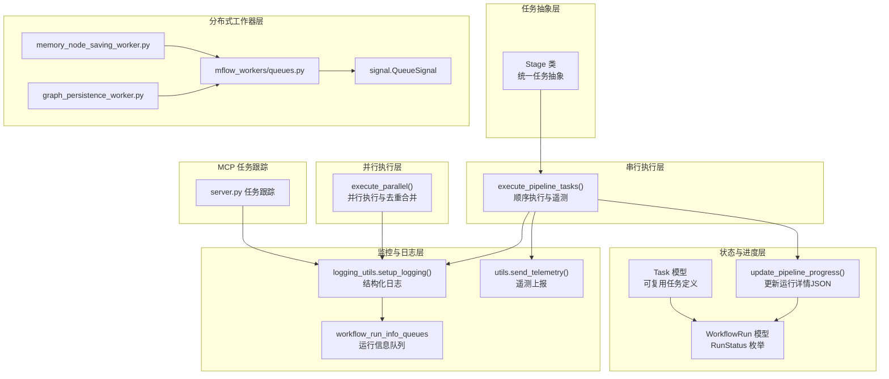
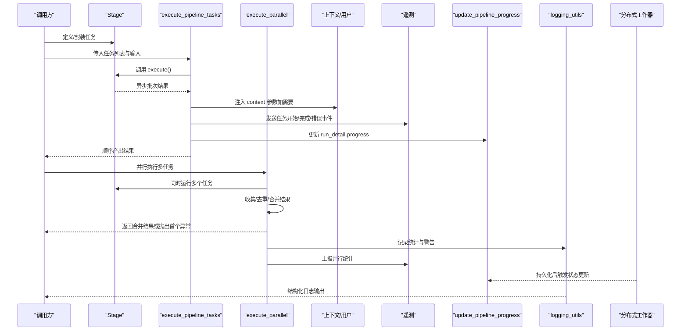
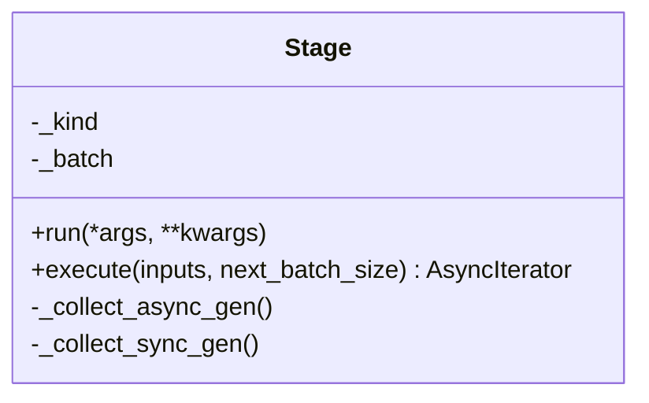
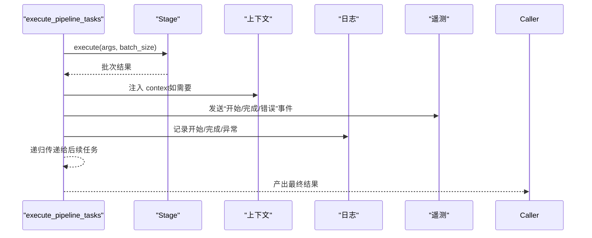
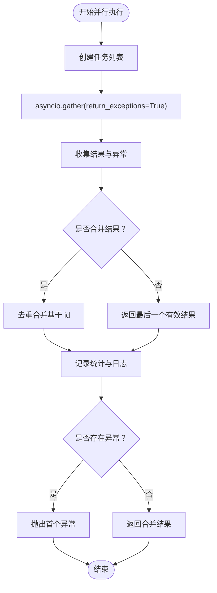
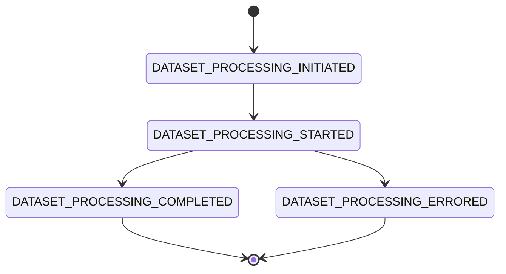
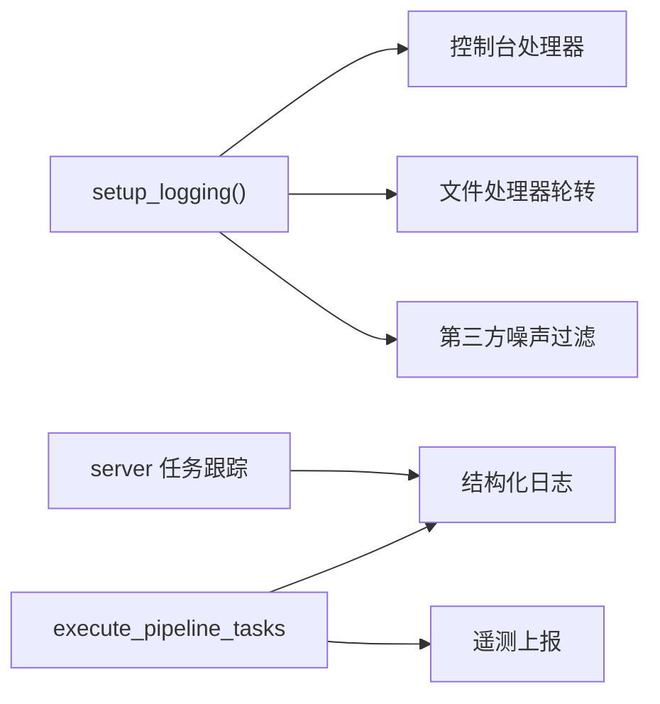
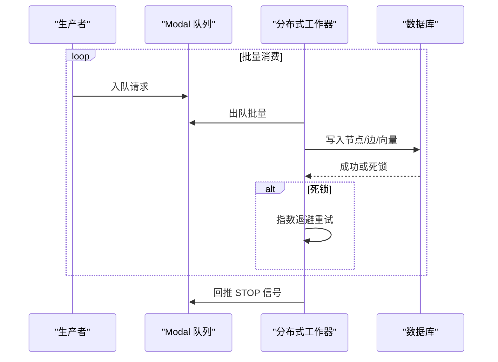
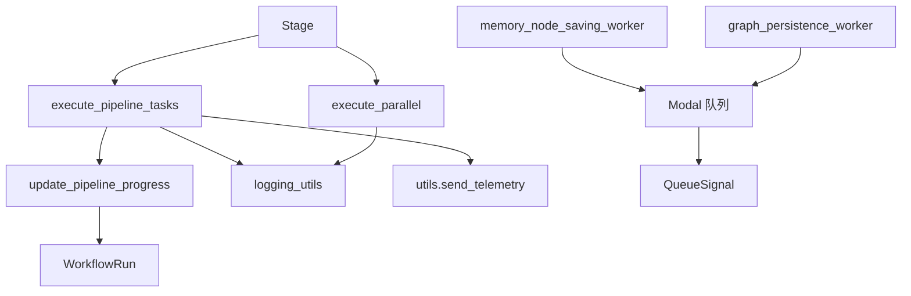

# 任务执行引擎

<cite>
**本文引用的文件**
- [m_flow/pipeline/tasks/task.py](file://m_flow/pipeline/tasks/task.py)
- [m_flow/pipeline/operations/execute_pipeline_tasks.py](file://m_flow/pipeline/operations/execute_pipeline_tasks.py)
- [m_flow/pipeline/operations/execute_parallel.py](file://m_flow/pipeline/operations/execute_parallel.py)
- [m_flow/pipeline/operations/update_pipeline_progress.py](file://m_flow/pipeline/operations/update_pipeline_progress.py)
- [m_flow/pipeline/models/PipelineRun.py](file://m_flow/pipeline/models/PipelineRun.py)
- [m_flow/pipeline/models/Task.py](file://m_flow/pipeline/models/Task.py)
- [m_flow/shared/logging_utils.py](file://m_flow/shared/logging_utils.py)
- [m_flow/shared/utils.py](file://m_flow/shared/utils.py)
- [m_flow/pipeline/queues/workflow_run_info_queues.py](file://m_flow/pipeline/queues/workflow_run_info_queues.py)
- [mflow_workers/workers/memory_node_saving_worker.py](file://mflow_workers/workers/memory_node_saving_worker.py)
- [mflow_workers/workers/graph_persistence_worker.py](file://mflow_workers/workers/graph_persistence_worker.py)
- [mflow_workers/queues.py](file://mflow_workers/queues.py)
- [mflow_workers/signal.py](file://mflow_workers/signal.py)
- [m_flow-mcp/src/server.py](file://m_flow-mcp/src/server.py)
- [m_flow-mcp/src/test_server_task_tracking.py](file://m_flow-mcp/src/test_server_task_tracking.py)
- [m_flow/tests/unit/modules/pipelines/run_tasks_test.py](file://m_flow/tests/unit/modules/pipelines/run_tasks_test.py)
- [m_flow/tests/unit/pipelines/test_run_parallel.py](file://m_flow/tests/unit/pipelines/test_run_parallel.py)
</cite>

## 目录
1. [简介](#简介)
2. [项目结构](#项目结构)
3. [核心组件](#核心组件)
4. [架构总览](#架构总览)
5. [详细组件分析](#详细组件分析)
6. [依赖分析](#依赖分析)
7. [性能考虑](#性能考虑)
8. [故障排查指南](#故障排查指南)
9. [结论](#结论)
10. [附录](#附录)

## 简介
本文件系统性阐述任务执行引擎的设计与实现，覆盖任务调度、执行上下文管理、状态转换、并发控制、错误处理、监控与日志、性能优化以及调试与排障。目标是帮助开发者与运维人员快速理解并高效使用该引擎。

## 项目结构
任务执行引擎由“任务抽象层”“执行编排层”“并发执行层”“状态与进度层”“监控与日志层”“分布式工作器层”等组成。核心文件分布如下：
- 任务抽象：m_flow/pipeline/tasks/task.py
- 串行执行：m_flow/pipeline/operations/execute_pipeline_tasks.py
- 并行执行：m_flow/pipeline/operations/execute_parallel.py
- 进度与状态：m_flow/pipeline/operations/update_pipeline_progress.py、m_flow/pipeline/models/PipelineRun.py、m_flow/pipeline/models/Task.py
- 日志与遥测：m_flow/shared/logging_utils.py、m_flow/shared/utils.py
- 队列与事件：m_flow/pipeline/queues/workflow_run_info_queues.py
- 分布式工作器：mflow_workers/workers/*.py、mflow_workers/queues.py、mflow_workers/signal.py
- MCP 任务跟踪：m_flow-mcp/src/server.py、m_flow-mcp/src/test_server_task_tracking.py
- 单元测试：m_flow/tests/unit/modules/pipelines/run_tasks_test.py、m_flow/tests/unit/pipelines/test_run_parallel.py

图表来源
- [m_flow/pipeline/tasks/task.py:1-152](file://m_flow/pipeline/tasks/task.py#L1-L152)
- [m_flow/pipeline/operations/execute_pipeline_tasks.py:1-144](file://m_flow/pipeline/operations/execute_pipeline_tasks.py#L1-L144)
- [m_flow/pipeline/operations/execute_parallel.py:1-162](file://m_flow/pipeline/operations/execute_parallel.py#L1-L162)
- [m_flow/pipeline/operations/update_pipeline_progress.py:1-159](file://m_flow/pipeline/operations/update_pipeline_progress.py#L1-L159)
- [m_flow/pipeline/models/PipelineRun.py:1-52](file://m_flow/pipeline/models/PipelineRun.py#L1-L52)
- [m_flow/pipeline/models/Task.py:1-50](file://m_flow/pipeline/models/Task.py#L1-L50)
- [m_flow/shared/logging_utils.py:1-533](file://m_flow/shared/logging_utils.py#L1-L533)
- [m_flow/shared/utils.py:1-226](file://m_flow/shared/utils.py#L1-L226)
- [m_flow/pipeline/queues/workflow_run_info_queues.py:1-66](file://m_flow/pipeline/queues/workflow_run_info_queues.py#L1-L66)
- [mflow_workers/workers/memory_node_saving_worker.py:1-122](file://mflow_workers/workers/memory_node_saving_worker.py#L1-L122)
- [mflow_workers/workers/graph_persistence_worker.py:1-157](file://mflow_workers/workers/graph_persistence_worker.py#L1-L157)
- [mflow_workers/queues.py:1-16](file://mflow_workers/queues.py#L1-L16)
- [mflow_workers/signal.py:1-25](file://mflow_workers/signal.py#L1-L25)
- [m_flow-mcp/src/server.py:158-193](file://m_flow-mcp/src/server.py#L158-L193)

章节来源
- [m_flow/pipeline/tasks/task.py:1-152](file://m_flow/pipeline/tasks/task.py#L1-L152)
- [m_flow/pipeline/operations/execute_pipeline_tasks.py:1-144](file://m_flow/pipeline/operations/execute_pipeline_tasks.py#L1-L144)
- [m_flow/pipeline/operations/execute_parallel.py:1-162](file://m_flow/pipeline/operations/execute_parallel.py#L1-L162)
- [m_flow/pipeline/operations/update_pipeline_progress.py:1-159](file://m_flow/pipeline/operations/update_pipeline_progress.py#L1-L159)
- [m_flow/pipeline/models/PipelineRun.py:1-52](file://m_flow/pipeline/models/PipelineRun.py#L1-L52)
- [m_flow/pipeline/models/Task.py:1-50](file://m_flow/pipeline/models/Task.py#L1-L50)
- [m_flow/shared/logging_utils.py:1-533](file://m_flow/shared/logging_utils.py#L1-L533)
- [m_flow/shared/utils.py:1-226](file://m_flow/shared/utils.py#L1-L226)
- [m_flow/pipeline/queues/workflow_run_info_queues.py:1-66](file://m_flow/pipeline/queues/workflow_run_info_queues.py#L1-L66)
- [mflow_workers/workers/memory_node_saving_worker.py:1-122](file://mflow_workers/workers/memory_node_saving_worker.py#L1-L122)
- [mflow_workers/workers/graph_persistence_worker.py:1-157](file://mflow_workers/workers/graph_persistence_worker.py#L1-L157)
- [mflow_workers/queues.py:1-16](file://mflow_workers/queues.py#L1-L16)
- [mflow_workers/signal.py:1-25](file://mflow_workers/signal.py#L1-L25)
- [m_flow-mcp/src/server.py:158-193](file://m_flow-mcp/src/server.py#L158-L193)

## 核心组件
- 任务抽象 Stage：统一包装同步/异步/生成器/异步生成器，提供一致的异步迭代接口，支持按批次产出结果。
- 串行执行 execute_pipeline_tasks：顺序执行多个 Stage，自动注入上下文、记录步骤、发送遥测、传播异常。
- 并行执行 execute_parallel：并发运行多个 Stage，收集结果、去重合并、异常聚合与首异常抛出。
- 状态与进度 update_pipeline_progress：在运行记录的 JSON 字段中维护进度（总数、已处理、当前步骤、时间戳）。
- 日志与遥测 logging_utils、utils：集中式结构化日志初始化与遥测上报。
- 分布式工作器：内存节点与图数据持久化工作器，带批处理与死锁重试。
- 队列与事件：按运行 ID 维护异步队列，推送运行事件；MCP 提供任务跟踪注册表。

章节来源
- [m_flow/pipeline/tasks/task.py:16-152](file://m_flow/pipeline/tasks/task.py#L16-L152)
- [m_flow/pipeline/operations/execute_pipeline_tasks.py:46-144](file://m_flow/pipeline/operations/execute_pipeline_tasks.py#L46-L144)
- [m_flow/pipeline/operations/execute_parallel.py:39-162](file://m_flow/pipeline/operations/execute_parallel.py#L39-L162)
- [m_flow/pipeline/operations/update_pipeline_progress.py:27-159](file://m_flow/pipeline/operations/update_pipeline_progress.py#L27-L159)
- [m_flow/shared/logging_utils.py:340-533](file://m_flow/shared/logging_utils.py#L340-L533)
- [m_flow/shared/utils.py:66-103](file://m_flow/shared/utils.py#L66-L103)
- [mflow_workers/workers/memory_node_saving_worker.py:46-122](file://mflow_workers/workers/memory_node_saving_worker.py#L46-L122)
- [mflow_workers/workers/graph_persistence_worker.py:63-157](file://mflow_workers/workers/graph_persistence_worker.py#L63-L157)
- [m_flow/pipeline/queues/workflow_run_info_queues.py:19-66](file://m_flow/pipeline/queues/workflow_run_info_queues.py#L19-L66)

## 架构总览
下图展示从任务定义到执行、状态更新、日志遥测、分布式持久化的端到端流程。

图表来源
- [m_flow/pipeline/tasks/task.py:94-152](file://m_flow/pipeline/tasks/task.py#L94-L152)
- [m_flow/pipeline/operations/execute_pipeline_tasks.py:46-144](file://m_flow/pipeline/operations/execute_pipeline_tasks.py#L46-L144)
- [m_flow/pipeline/operations/execute_parallel.py:70-162](file://m_flow/pipeline/operations/execute_parallel.py#L70-L162)
- [m_flow/pipeline/operations/update_pipeline_progress.py:27-159](file://m_flow/pipeline/operations/update_pipeline_progress.py#L27-L159)
- [m_flow/shared/logging_utils.py:340-533](file://m_flow/shared/logging_utils.py#L340-L533)
- [m_flow/shared/utils.py:66-103](file://m_flow/shared/utils.py#L66-L103)

## 详细组件分析

### 任务抽象与生命周期
- 统一包装：Stage 接受任意可调用对象，识别其类型（协程/生成器/普通函数），暴露统一的 execute 接口。
- 执行模式：根据任务类型选择直接返回单值或异步迭代；支持通过 next_batch_size 覆盖配置的 batch_size。
- 生命周期钩子：在 execute 中按需缓冲并分批产出；异常在上层捕获并传播。

图表来源
- [m_flow/pipeline/tasks/task.py:16-152](file://m_flow/pipeline/tasks/task.py#L16-L152)

章节来源
- [m_flow/pipeline/tasks/task.py:16-152](file://m_flow/pipeline/tasks/task.py#L16-L152)

### 串行任务执行与上下文管理
- 顺序执行：execute_pipeline_tasks 逐个执行任务，将前一任务的批次结果作为下一任务的输入。
- 上下文注入：若任务签名包含 context，则自动追加传入；同时异步更新当前步骤。
- 遥测与日志：每个任务开始/完成/失败均发送事件并记录日志。
- 异常传播：任一任务异常即向上抛出，保证失败可见。

图表来源
- [m_flow/pipeline/operations/execute_pipeline_tasks.py:46-144](file://m_flow/pipeline/operations/execute_pipeline_tasks.py#L46-L144)

章节来源
- [m_flow/pipeline/operations/execute_pipeline_tasks.py:46-144](file://m_flow/pipeline/operations/execute_pipeline_tasks.py#L46-L144)

### 并发执行与资源竞争处理
- 并发策略：execute_parallel 使用 asyncio.gather 并发运行多个任务，设置 return_exceptions=True 确保全部完成。
- 结果合并与去重：对列表结果进行合并，基于 MemoryNode.id 或字典的 id 字段去重；统计移除数量。
- 异常聚合：收集所有异常，最终抛出第一个异常，保留成功结果以最大化收益。
- 资源竞争：分布式工作器对数据库死锁进行检测与指数退避重试，避免瞬时冲突放大。

图表来源
- [m_flow/pipeline/operations/execute_parallel.py:70-162](file://m_flow/pipeline/operations/execute_parallel.py#L70-L162)
- [mflow_workers/workers/memory_node_saving_worker.py:95-112](file://mflow_workers/workers/memory_node_saving_worker.py#L95-L112)
- [mflow_workers/workers/graph_persistence_worker.py:120-145](file://mflow_workers/workers/graph_persistence_worker.py#L120-L145)

章节来源
- [m_flow/pipeline/operations/execute_parallel.py:39-162](file://m_flow/pipeline/operations/execute_parallel.py#L39-L162)
- [mflow_workers/workers/memory_node_saving_worker.py:46-122](file://mflow_workers/workers/memory_node_saving_worker.py#L46-L122)
- [mflow_workers/workers/graph_persistence_worker.py:63-157](file://mflow_workers/workers/graph_persistence_worker.py#L63-L157)

### 状态转换与进度追踪
- 状态枚举：WorkflowRun.RunStatus 定义了数据集处理的生命周期状态。
- 运行详情：update_pipeline_progress 将进度写入 run_detail 的 JSON 字段，包含 total_items、processed_items、current_step、updated_at 等。
- 查询策略：按 workflow_run_id 与最新 STARTED 记录定位，确保确定性 run_id 场景下的正确更新。
- 初始化：set_pipeline_started 在启动时初始化进度字段。

图表来源
- [m_flow/pipeline/models/PipelineRun.py:21-52](file://m_flow/pipeline/models/PipelineRun.py#L21-L52)
- [m_flow/pipeline/operations/update_pipeline_progress.py:27-159](file://m_flow/pipeline/operations/update_pipeline_progress.py#L27-L159)

章节来源
- [m_flow/pipeline/models/PipelineRun.py:1-52](file://m_flow/pipeline/models/PipelineRun.py#L1-L52)
- [m_flow/pipeline/operations/update_pipeline_progress.py:27-159](file://m_flow/pipeline/operations/update_pipeline_progress.py#L27-L159)

### 监控与日志记录
- 结构化日志：setup_logging 配置 structlog 处理器链、控制台与文件处理器、异常钩子、第三方噪声过滤。
- 日志文件：自动轮转与清理，支持环境变量控制最大文件大小与保留数量。
- 遥测：send_telemetry 在非测试/开发环境且未禁用时上报匿名安装标识、用户标识与附加属性。
- 任务跟踪（MCP）：server 提供后台任务包装与注册表，记录任务状态与错误，支持 LRU 淘汰与最近使用刷新。

图表来源
- [m_flow/shared/logging_utils.py:340-533](file://m_flow/shared/logging_utils.py#L340-L533)
- [m_flow/shared/utils.py:66-103](file://m_flow/shared/utils.py#L66-L103)
- [m_flow-mcp/src/server.py:162-193](file://m_flow-mcp/src/server.py#L162-L193)

章节来源
- [m_flow/shared/logging_utils.py:340-533](file://m_flow/shared/logging_utils.py#L340-L533)
- [m_flow/shared/utils.py:66-103](file://m_flow/shared/utils.py#L66-L103)
- [m_flow-mcp/src/server.py:158-193](file://m_flow-mcp/src/server.py#L158-L193)

### 分布式执行与队列
- 队列管理：mflow_workers/queues.py 定义 Modal 队列；signal.QueueSignal 用于停止信号。
- 内存节点持久化：memory_node_saving_worker 从队列取批，按集合名聚合，指数退避重试死锁。
- 图数据持久化：graph_persistence_worker 批量写入节点与边，检测不同图数据库的死锁并重试。
- 工作器幂等：遇到 STOP 信号时回推继续传播，确保消费循环有序退出。

图表来源
- [mflow_workers/queues.py:1-16](file://mflow_workers/queues.py#L1-L16)
- [mflow_workers/signal.py:13-25](file://mflow_workers/signal.py#L13-L25)
- [mflow_workers/workers/memory_node_saving_worker.py:53-122](file://mflow_workers/workers/memory_node_saving_worker.py#L53-L122)
- [mflow_workers/workers/graph_persistence_worker.py:70-157](file://mflow_workers/workers/graph_persistence_worker.py#L70-L157)

章节来源
- [mflow_workers/queues.py:1-16](file://mflow_workers/queues.py#L1-L16)
- [mflow_workers/signal.py:1-25](file://mflow_workers/signal.py#L1-L25)
- [mflow_workers/workers/memory_node_saving_worker.py:46-122](file://mflow_workers/workers/memory_node_saving_worker.py#L46-L122)
- [mflow_workers/workers/graph_persistence_worker.py:63-157](file://mflow_workers/workers/graph_persistence_worker.py#L63-L157)

## 依赖分析
- 组件耦合
  - Stage 仅依赖于被包装的可调用对象与内部类型识别，内聚性高。
  - execute_pipeline_tasks 依赖 Stage、上下文、遥测与进度更新，耦合于运行时环境。
  - execute_parallel 依赖 asyncio、Stage 列表与去重逻辑，耦合于结果数据结构。
  - 进度更新依赖数据库适配器与 WorkflowRun 模型，耦合于 ORM 层。
  - 分布式工作器依赖队列、信号与具体数据库适配器，耦合于外部系统。
- 外部依赖
  - 结构化日志与请求库用于日志与遥测。
  - Modal 用于分布式队列与函数部署。
  - 数据库驱动用于图/向量/关系型存储。

图表来源
- [m_flow/pipeline/tasks/task.py:16-152](file://m_flow/pipeline/tasks/task.py#L16-L152)
- [m_flow/pipeline/operations/execute_pipeline_tasks.py:46-144](file://m_flow/pipeline/operations/execute_pipeline_tasks.py#L46-L144)
- [m_flow/pipeline/operations/execute_parallel.py:39-162](file://m_flow/pipeline/operations/execute_parallel.py#L39-L162)
- [m_flow/pipeline/operations/update_pipeline_progress.py:27-159](file://m_flow/pipeline/operations/update_pipeline_progress.py#L27-L159)
- [mflow_workers/workers/memory_node_saving_worker.py:46-122](file://mflow_workers/workers/memory_node_saving_worker.py#L46-L122)
- [mflow_workers/workers/graph_persistence_worker.py:63-157](file://mflow_workers/workers/graph_persistence_worker.py#L63-L157)
- [mflow_workers/queues.py:1-16](file://mflow_workers/queues.py#L1-L16)
- [mflow_workers/signal.py:13-25](file://mflow_workers/signal.py#L13-L25)

章节来源
- [m_flow/pipeline/tasks/task.py:16-152](file://m_flow/pipeline/tasks/task.py#L16-L152)
- [m_flow/pipeline/operations/execute_pipeline_tasks.py:46-144](file://m_flow/pipeline/operations/execute_pipeline_tasks.py#L46-L144)
- [m_flow/pipeline/operations/execute_parallel.py:39-162](file://m_flow/pipeline/operations/execute_parallel.py#L39-L162)
- [m_flow/pipeline/operations/update_pipeline_progress.py:27-159](file://m_flow/pipeline/operations/update_pipeline_progress.py#L27-L159)
- [mflow_workers/workers/memory_node_saving_worker.py:46-122](file://mflow_workers/workers/memory_node_saving_worker.py#L46-L122)
- [mflow_workers/workers/graph_persistence_worker.py:63-157](file://mflow_workers/workers/graph_persistence_worker.py#L63-L157)
- [mflow_workers/queues.py:1-16](file://mflow_workers/queues.py#L1-L16)
- [mflow_workers/signal.py:13-25](file://mflow_workers/signal.py#L13-L25)

## 性能考虑
- 批处理策略
  - 通过 Stage 的 batch_size 与 execute_pipeline_tasks 的 next_batch_size 控制批次大小，减少 IO 与网络往返。
  - 分布式工作器采用固定批大小（如 25）聚合写入，降低数据库压力。
- 资源利用率
  - 并行执行 execute_parallel 使用 gather 并发，结合 return_exceptions=True 最大化吞吐。
  - 死锁重试：指数退避（tenacity）降低冲突峰值，提升整体可用性。
- 日志与遥测
  - 结构化日志与文件轮转避免磁盘膨胀；遥测在生产环境启用，避免测试/开发干扰。
- 数据库兼容
  - 进度更新对 SQLite 友好的字符串比较与 ORDER BY 最新记录策略，确保确定性 run_id 场景稳定。

章节来源
- [m_flow/pipeline/tasks/task.py:94-152](file://m_flow/pipeline/tasks/task.py#L94-L152)
- [m_flow/pipeline/operations/execute_pipeline_tasks.py:74-82](file://m_flow/pipeline/operations/execute_pipeline_tasks.py#L74-L82)
- [mflow_workers/workers/memory_node_saving_worker.py:57-112](file://mflow_workers/workers/memory_node_saving_worker.py#L57-L112)
- [mflow_workers/workers/graph_persistence_worker.py:94-150](file://mflow_workers/workers/graph_persistence_worker.py#L94-L150)
- [m_flow/shared/logging_utils.py:340-533](file://m_flow/shared/logging_utils.py#L340-L533)
- [m_flow/shared/utils.py:66-103](file://m_flow/shared/utils.py#L66-L103)
- [m_flow/pipeline/operations/update_pipeline_progress.py:54-62](file://m_flow/pipeline/operations/update_pipeline_progress.py#L54-L62)

## 故障排查指南
- 串行执行失败
  - 现象：某个任务抛出异常导致整个流水线中断。
  - 处理：查看日志中的“failed”条目与遥测事件；确认用户与租户信息；定位具体任务名称。
  - 参考路径：[execute_pipeline_tasks 异常分支:122-126](file://m_flow/pipeline/operations/execute_pipeline_tasks.py#L122-L126)
- 并行执行异常
  - 现象：部分任务失败但其他任务成功；最终抛出首个异常。
  - 处理：检查日志中的“failed”统计与警告；核对去重策略是否误删；必要时关闭去重验证。
  - 参考路径：[execute_parallel 异常聚合与去重:89-156](file://m_flow/pipeline/operations/execute_parallel.py#L89-L156)
- 死锁与资源竞争
  - 现象：数据库写入失败，提示死锁或数据库锁定。
  - 处理：启用指数退避重试；检查批大小与并发度；确认数据库驱动版本与连接池配置。
  - 参考路径：[内存节点工作器死锁检测:22-41](file://mflow_workers/workers/memory_node_saving_worker.py#L22-L41)、[图工作器死锁检测:43-61](file://mflow_workers/workers/graph_persistence_worker.py#L43-L61)
- 进度未更新
  - 现象：前端进度停滞。
  - 处理：确认 workflow_run_id 与 RunStatus.STARTED；检查 run_detail 是否存在；查看数据库查询日志。
  - 参考路径：[update_pipeline_progress 查询与更新:54-96](file://m_flow/pipeline/operations/update_pipeline_progress.py#L54-L96)
- 遥测未上报
  - 现象：无遥测数据。
  - 处理：检查 TELETMETRY_DISABLED 与 ENV 环境变量；确认遥测端点配置。
  - 参考路径：[send_telemetry 条件判断:74-78](file://m_flow/shared/utils.py#L74-L78)
- MCP 任务跟踪异常
  - 现象：任务状态不刷新或注册表越界。
  - 处理：检查任务注册表上限与 LRU 行为；确认后台任务包装与错误捕获。
  - 参考路径：[server 任务跟踪包装:162-180](file://m_flow-mcp/src/server.py#L162-L180)、[注册表 LRU 测试:288-320](file://m_flow-mcp/src/test_server_task_tracking.py#L288-L320)

章节来源
- [m_flow/pipeline/operations/execute_pipeline_tasks.py:122-126](file://m_flow/pipeline/operations/execute_pipeline_tasks.py#L122-L126)
- [m_flow/pipeline/operations/execute_parallel.py:89-156](file://m_flow/pipeline/operations/execute_parallel.py#L89-L156)
- [mflow_workers/workers/memory_node_saving_worker.py:22-41](file://mflow_workers/workers/memory_node_saving_worker.py#L22-L41)
- [mflow_workers/workers/graph_persistence_worker.py:43-61](file://mflow_workers/workers/graph_persistence_worker.py#L43-L61)
- [m_flow/pipeline/operations/update_pipeline_progress.py:54-96](file://m_flow/pipeline/operations/update_pipeline_progress.py#L54-L96)
- [m_flow/shared/utils.py:74-78](file://m_flow/shared/utils.py#L74-L78)
- [m_flow-mcp/src/server.py:162-180](file://m_flow-mcp/src/server.py#L162-L180)
- [m_flow-mcp/src/test_server_task_tracking.py:288-320](file://m_flow-mcp/src/test_server_task_tracking.py#L288-L320)

## 结论
该任务执行引擎通过统一的任务抽象、严谨的串并行执行策略、完善的日志与遥测、可控的状态与进度追踪，以及健壮的分布式工作器与死锁重试机制，实现了高可靠、可观测、可扩展的任务执行体系。建议在生产环境中合理设置批大小与并发度，开启遥测与结构化日志，并结合单元测试与集成测试保障稳定性。

## 附录
- 单元测试参考
  - 串行任务与批处理：[run_tasks_test.py:32-61](file://m_flow/tests/unit/modules/pipelines/run_tasks_test.py#L32-L61)
  - 并行任务与异常处理：[test_run_parallel.py:134-171](file://m_flow/tests/unit/pipelines/test_run_parallel.py#L134-L171)、[test_run_parallel.py:252-275](file://m_flow/tests/unit/pipelines/test_run_parallel.py#L252-L275)

章节来源
- [m_flow/tests/unit/modules/pipelines/run_tasks_test.py:32-61](file://m_flow/tests/unit/modules/pipelines/run_tasks_test.py#L32-L61)
- [m_flow/tests/unit/pipelines/test_run_parallel.py:134-171](file://m_flow/tests/unit/pipelines/test_run_parallel.py#L134-L171)
- [m_flow/tests/unit/pipelines/test_run_parallel.py:252-275](file://m_flow/tests/unit/pipelines/test_run_parallel.py#L252-L275)