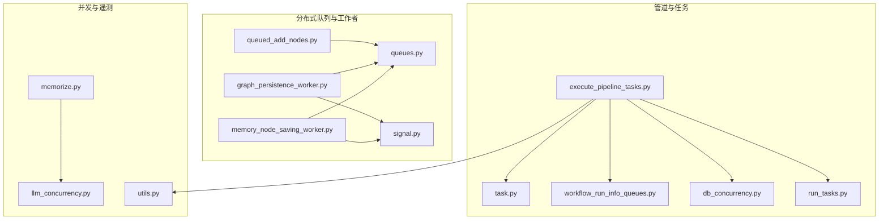
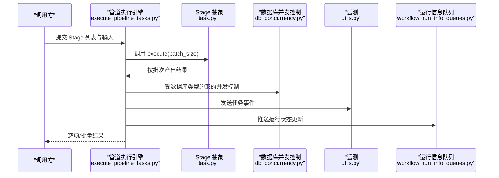
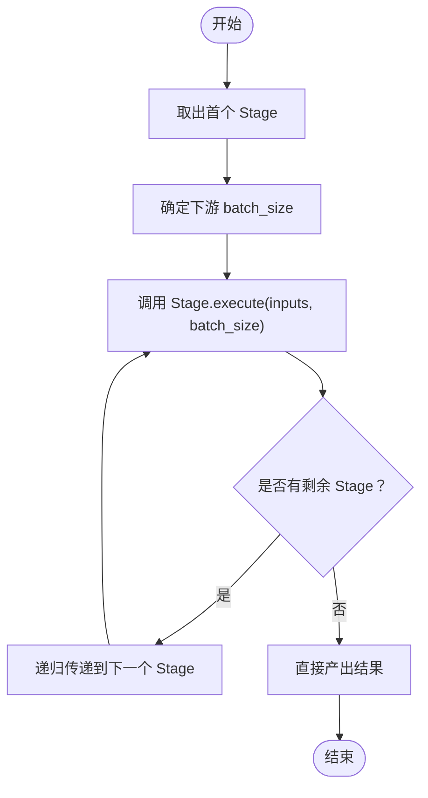
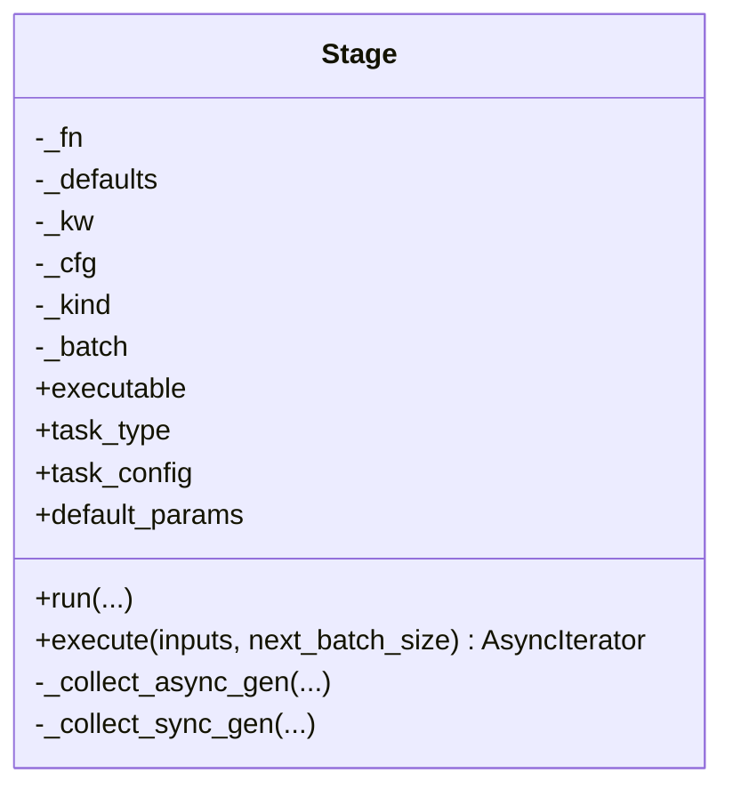
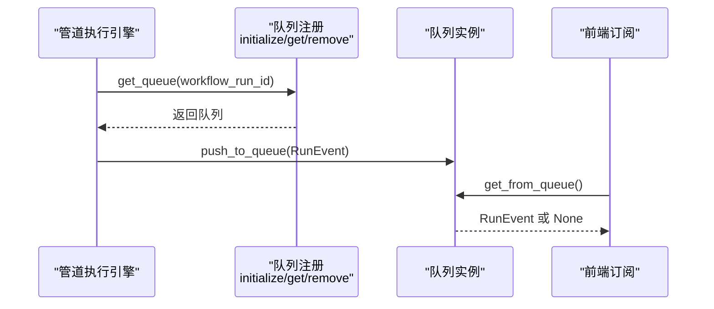
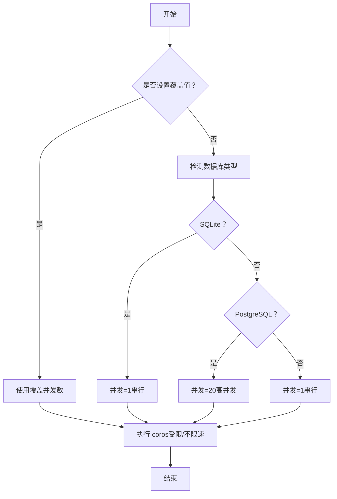
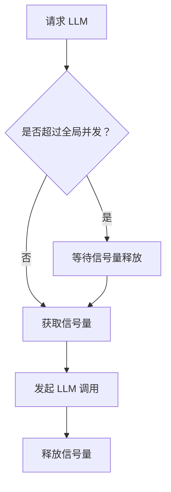
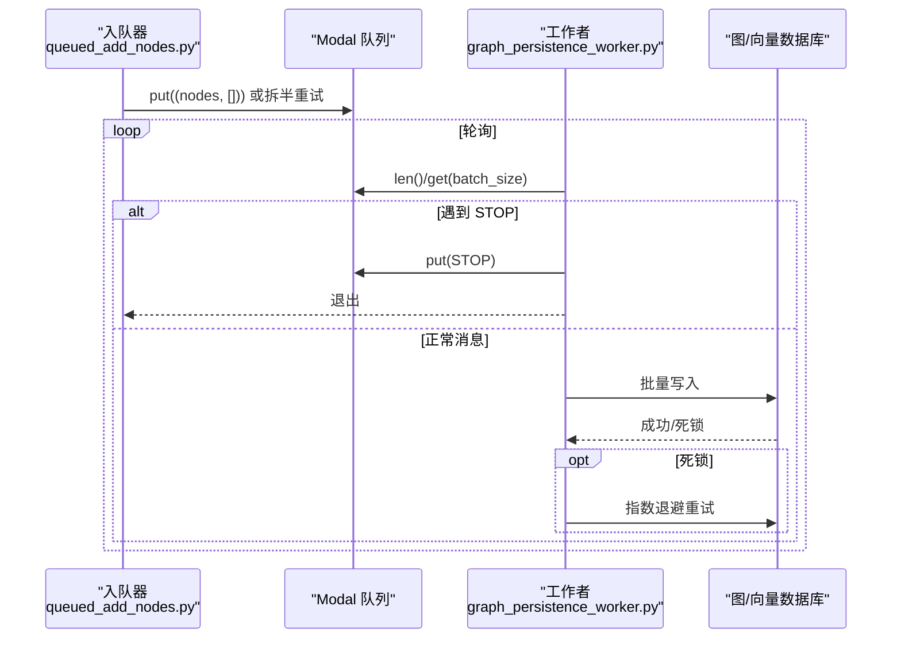
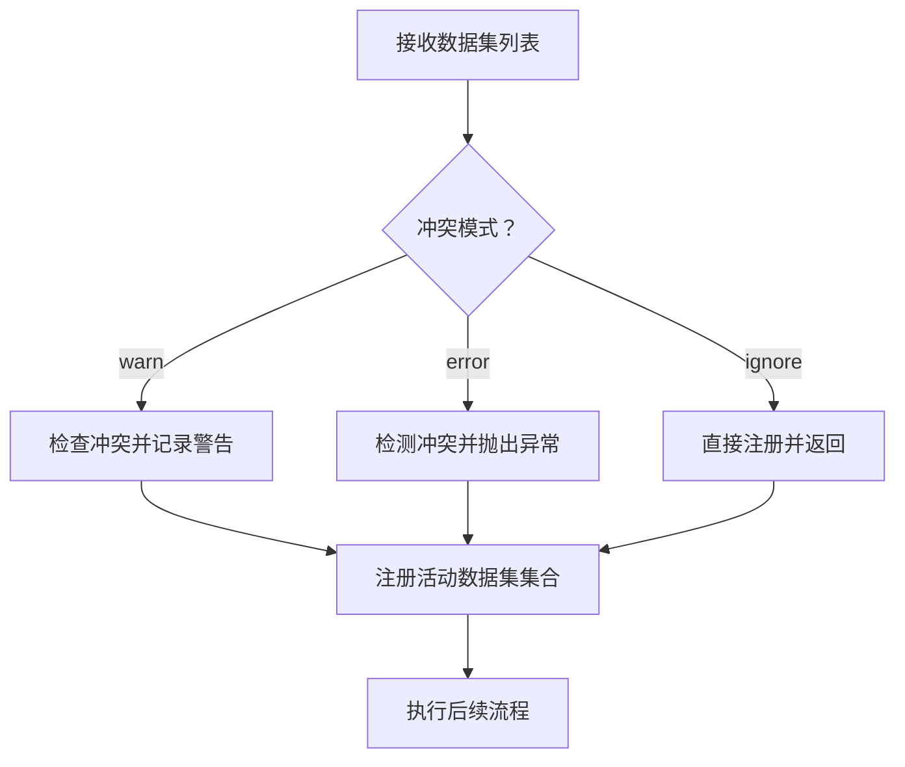
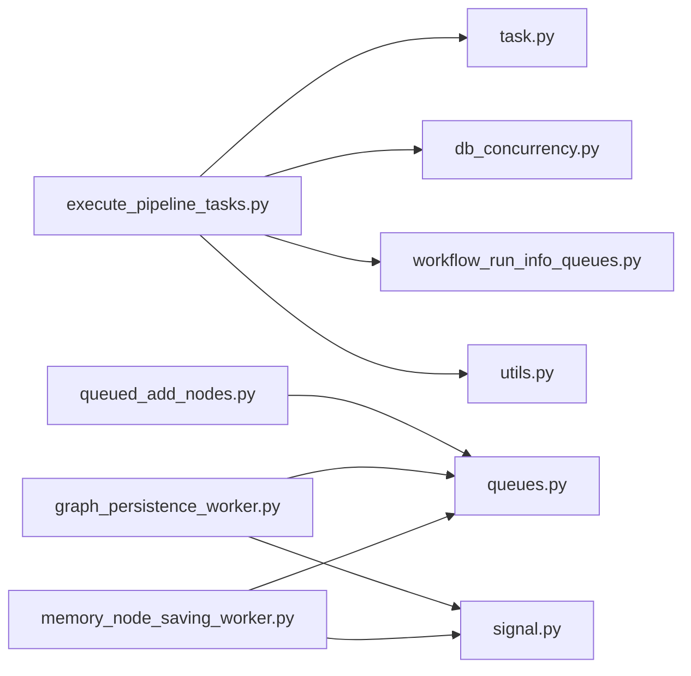

# 任务调度机制

<cite>
**本文引用的文件**
- [execute_pipeline_tasks.py](file://m_flow/pipeline/operations/execute_pipeline_tasks.py)
- [task.py](file://m_flow/pipeline/tasks/task.py)
- [workflow_run_info_queues.py](file://m_flow/pipeline/queues/workflow_run_info_queues.py)
- [db_concurrency.py](file://m_flow/pipeline/operations/db_concurrency.py)
- [llm_concurrency.py](file://m_flow/shared/llm_concurrency.py)
- [memorize.py](file://m_flow/api/v1/memorize/memorize.py)
- [run_task_from_queue_test.py](file://m_flow/tests/unit/modules/pipelines/run_task_from_queue_test.py)
- [run_tasks_test.py](file://m_flow/tests/unit/modules/pipelines/run_tasks_test.py)
- [queues.py](file://mflow_workers/queues.py)
- [graph_persistence_worker.py](file://mflow_workers/workers/graph_persistence_worker.py)
- [memory_node_saving_worker.py](file://mflow_workers/workers/memory_node_saving_worker.py)
- [signal.py](file://mflow_workers/signal.py)
- [queued_add_nodes.py](file://mflow_workers/tasks/queued_add_nodes.py)
- [utils.py](file://m_flow/shared/utils.py)
- [run_tasks.py](file://m_flow/pipeline/methods/run_tasks.py)
</cite>

## 目录
1. [简介](#简介)
2. [项目结构](#项目结构)
3. [核心组件](#核心组件)
4. [架构总览](#架构总览)
5. [详细组件分析](#详细组件分析)
6. [依赖分析](#依赖分析)
7. [性能考量](#性能考量)
8. [故障排查指南](#故障排查指南)
9. [结论](#结论)
10. [附录](#附录)

## 简介
本文件系统性阐述 m_flow 的任务调度机制，覆盖以下方面：
- 核心算法与策略：优先级调度、轮询调度、负载均衡
- 任务队列管理：组织与维护待执行任务
- 并发控制：最大并发数限制与资源分配
- 动态调整：基于系统负载与资源的自适应调度
- 监控指标：队列长度、等待时间、吞吐量等
- 性能调优建议与最佳实践

## 项目结构
围绕任务调度的关键目录与文件：
- 管道与任务执行
  - m_flow/pipeline/operations/execute_pipeline_tasks.py
  - m_flow/pipeline/tasks/task.py
  - m_flow/pipeline/queues/workflow_run_info_queues.py
  - m_flow/pipeline/operations/db_concurrency.py
  - m_flow/pipeline/methods/run_tasks.py
- 分布式队列与工作者
  - mflow_workers/queues.py
  - mflow_workers/workers/graph_persistence_worker.py
  - mflow_workers/workers/memory_node_saving_worker.py
  - mflow_workers/tasks/queued_add_nodes.py
  - mflow_workers/signal.py
- 并发与遥测
  - m_flow/shared/llm_concurrency.py
  - m_flow/shared/utils.py
  - m_flow/api/v1/memorize/memorize.py
- 测试与示例
  - m_flow/tests/unit/modules/pipelines/run_task_from_queue_test.py
  - m_flow/tests/unit/modules/pipelines/run_tasks_test.py

**图表来源**
- [execute_pipeline_tasks.py:1-144](file://m_flow/pipeline/operations/execute_pipeline_tasks.py#L1-L144)
- [task.py:1-152](file://m_flow/pipeline/tasks/task.py#L1-L152)
- [workflow_run_info_queues.py:1-66](file://m_flow/pipeline/queues/workflow_run_info_queues.py#L1-L66)
- [db_concurrency.py:1-200](file://m_flow/pipeline/operations/db_concurrency.py#L1-L200)
- [run_tasks.py](file://m_flow/pipeline/methods/run_tasks.py)
- [queues.py:1-16](file://mflow_workers/queues.py#L1-L16)
- [graph_persistence_worker.py:1-157](file://mflow_workers/workers/graph_persistence_worker.py#L1-L157)
- [memory_node_saving_worker.py:1-122](file://mflow_workers/workers/memory_node_saving_worker.py#L1-L122)
- [signal.py:1-25](file://mflow_workers/signal.py#L1-L25)
- [queued_add_nodes.py:1-23](file://mflow_workers/tasks/queued_add_nodes.py#L1-L23)
- [llm_concurrency.py:1-46](file://m_flow/shared/llm_concurrency.py#L1-L46)
- [utils.py:84-127](file://m_flow/shared/utils.py#L84-L127)
- [memorize.py:36-80](file://m_flow/api/v1/memorize/memorize.py#L36-L80)

**章节来源**
- [execute_pipeline_tasks.py:1-144](file://m_flow/pipeline/operations/execute_pipeline_tasks.py#L1-L144)
- [task.py:1-152](file://m_flow/pipeline/tasks/task.py#L1-L152)
- [workflow_run_info_queues.py:1-66](file://m_flow/pipeline/queues/workflow_run_info_queues.py#L1-L66)
- [db_concurrency.py:1-200](file://m_flow/pipeline/operations/db_concurrency.py#L1-L200)
- [run_tasks.py](file://m_flow/pipeline/methods/run_tasks.py)
- [queues.py:1-16](file://mflow_workers/queues.py#L1-L16)
- [graph_persistence_worker.py:1-157](file://mflow_workers/workers/graph_persistence_worker.py#L1-L157)
- [memory_node_saving_worker.py:1-122](file://mflow_workers/workers/memory_node_saving_worker.py#L1-L122)
- [signal.py:1-25](file://mflow_workers/signal.py#L1-L25)
- [queued_add_nodes.py:1-23](file://mflow_workers/tasks/queued_add_nodes.py#L1-L23)
- [llm_concurrency.py:1-46](file://m_flow/shared/llm_concurrency.py#L1-L46)
- [utils.py:84-127](file://m_flow/shared/utils.py#L84-L127)
- [memorize.py:36-80](file://m_flow/api/v1/memorize/memorize.py#L36-L80)

## 核心组件
- 任务抽象与批处理
  - Stage 统一包装任意可调用体（同步/异步/生成器/异步生成器），提供统一的异步迭代接口，并支持按 batch_size 分组产出结果。
- 管道执行引擎
  - execute_pipeline_tasks 以递归方式顺序执行 Stage 列表，自动注入上下文、发送遥测事件、传播异常。
- 队列与状态流
  - workflow_run_info_queues 提供按运行 ID 维度的内存异步队列，用于推送/拉取运行状态更新。
- 数据库感知并发控制
  - db_concurrency 基于数据库类型自动选择并发策略：SQLite 强制串行；PostgreSQL 默认高并发；可通过环境变量覆盖。
- 全局 LLM 并发限制
  - llm_concurrency 提供全局信号量，受环境变量控制，避免 LLM 资源竞争导致的过载。
- 分布式工作者与队列
  - mflow_workers 定义 Modal 队列与工作者，实现节点/边与向量记忆节点的批量持久化，具备重试与死锁检测。

**章节来源**
- [task.py:16-152](file://m_flow/pipeline/tasks/task.py#L16-L152)
- [execute_pipeline_tasks.py:46-144](file://m_flow/pipeline/operations/execute_pipeline_tasks.py#L46-L144)
- [workflow_run_info_queues.py:19-66](file://m_flow/pipeline/queues/workflow_run_info_queues.py#L19-L66)
- [db_concurrency.py:77-199](file://m_flow/pipeline/operations/db_concurrency.py#L77-L199)
- [llm_concurrency.py:15-46](file://m_flow/shared/llm_concurrency.py#L15-L46)
- [queues.py:6-16](file://mflow_workers/queues.py#L6-L16)

## 架构总览
下图展示从任务定义到分布式执行与状态反馈的整体流程。

**图表来源**
- [execute_pipeline_tasks.py:46-144](file://m_flow/pipeline/operations/execute_pipeline_tasks.py#L46-L144)
- [task.py:94-152](file://m_flow/pipeline/tasks/task.py#L94-L152)
- [db_concurrency.py:122-176](file://m_flow/pipeline/operations/db_concurrency.py#L122-L176)
- [utils.py:84-127](file://m_flow/shared/utils.py#L84-L127)
- [workflow_run_info_queues.py:48-66](file://m_flow/pipeline/queues/workflow_run_info_queues.py#L48-L66)

## 详细组件分析

### 管道执行引擎与批处理
- 顺序执行与递归传递
  - execute_pipeline_tasks 依次取出首个 Stage，确定下游 batch_size，然后将结果递归传递给剩余 Stage。
- 上下文与遥测
  - 自动注入 context 并触发当前步骤更新；在开始/结束/异常时发送遥测事件。
- 结果产出
  - 通过异步迭代器逐项或按批次返回，便于与队列/工作者对接。

**图表来源**
- [execute_pipeline_tasks.py:46-126](file://m_flow/pipeline/operations/execute_pipeline_tasks.py#L46-L126)
- [task.py:94-122](file://m_flow/pipeline/tasks/task.py#L94-L122)

**章节来源**
- [execute_pipeline_tasks.py:46-144](file://m_flow/pipeline/operations/execute_pipeline_tasks.py#L46-L144)
- [task.py:94-152](file://m_flow/pipeline/tasks/task.py#L94-L152)

### 任务抽象与批处理收集
- 多类型适配
  - 支持异步生成器、同步生成器、协程与普通函数，统一通过 execute 返回异步迭代器。
- 批处理缓冲
  - _collect_async_gen/_collect_sync_gen 使用内部缓冲区按 batch_size 聚合输出，确保下游处理的一致性。

**图表来源**
- [task.py:16-152](file://m_flow/pipeline/tasks/task.py#L16-L152)

**章节来源**
- [task.py:16-152](file://m_flow/pipeline/tasks/task.py#L16-L152)

### 运行状态队列与信息流
- 内存异步队列
  - 按 workflow_run_id 注册/获取队列，支持非阻塞推入/弹出。
- 状态推送
  - 在任务执行过程中推送 RunEvent，前端可通过 WebSocket 订阅进度。

**图表来源**
- [workflow_run_info_queues.py:19-66](file://m_flow/pipeline/queues/workflow_run_info_queues.py#L19-L66)

**章节来源**
- [workflow_run_info_queues.py:1-66](file://m_flow/pipeline/queues/workflow_run_info_queues.py#L1-L66)

### 数据库感知的并发控制
- 自动检测
  - 基于配置检测数据库类型：SQLite 强制串行；PostgreSQL 默认高并发。
- 环境变量覆盖
  - MFLOW_PIPELINE_CONCURRENCY 可强制串行或指定并发上限。
- 执行策略
  - 串行、全并行或信号量限速并行，保证不同后端的稳定性与性能。

**图表来源**
- [db_concurrency.py:48-176](file://m_flow/pipeline/operations/db_concurrency.py#L48-L176)

**章节来源**
- [db_concurrency.py:1-200](file://m_flow/pipeline/operations/db_concurrency.py#L1-L200)

### 全局 LLM 并发限制
- 全局信号量
  - 通过环境变量 MFLOW_LLM_CONCURRENCY_LIMIT 控制最大并发，默认 20。
- 应用场景
  - 统一控制 LLM 调用，避免资源争用与超卖。

**图表来源**
- [llm_concurrency.py:15-46](file://m_flow/shared/llm_concurrency.py#L15-L46)

**章节来源**
- [llm_concurrency.py:1-46](file://m_flow/shared/llm_concurrency.py#L1-L46)

### 分布式队列与工作者
- 队列定义
  - Modal 队列 add_nodes_and_edges_queue、add_memory_nodes_queue。
- 工作者行为
  - 周期性检查队列长度，按固定批次大小批量消费；遇到停止信号（STOP）时广播并优雅退出。
- 死锁检测与重试
  - 对图数据库与向量数据库的死锁/锁定错误进行识别与指数退避重试。
- 节点入队
  - queued_add_nodes 将大批量节点拆半重试入队，提升可靠性。

**图表来源**
- [queues.py:6-16](file://mflow_workers/queues.py#L6-L16)
- [graph_persistence_worker.py:70-157](file://mflow_workers/workers/graph_persistence_worker.py#L70-L157)
- [memory_node_saving_worker.py:53-122](file://mflow_workers/workers/memory_node_saving_worker.py#L53-L122)
- [signal.py:13-25](file://mflow_workers/signal.py#L13-L25)
- [queued_add_nodes.py:8-23](file://mflow_workers/tasks/queued_add_nodes.py#L8-L23)

**章节来源**
- [queues.py:1-16](file://mflow_workers/queues.py#L1-L16)
- [graph_persistence_worker.py:1-157](file://mflow_workers/workers/graph_persistence_worker.py#L1-L157)
- [memory_node_saving_worker.py:1-122](file://mflow_workers/workers/memory_node_saving_worker.py#L1-L122)
- [signal.py:1-25](file://mflow_workers/signal.py#L1-L25)
- [queued_add_nodes.py:1-23](file://mflow_workers/tasks/queued_add_nodes.py#L1-L23)

### 并发冲突保护与资源隔离
- 数据集并发保护
  - memorize 接口通过内存锁与集合跟踪活动数据集，支持忽略/告警/报错三种冲突模式。
- LLM 并发保护
  - 全局信号量统一限制 LLM 并发，避免跨路径竞争。

**图表来源**
- [memorize.py:53-80](file://m_flow/api/v1/memorize/memorize.py#L53-L80)
- [llm_concurrency.py:15-46](file://m_flow/shared/llm_concurrency.py#L15-L46)

**章节来源**
- [memorize.py:36-80](file://m_flow/api/v1/memorize/memorize.py#L36-L80)
- [llm_concurrency.py:1-46](file://m_flow/shared/llm_concurrency.py#L1-L46)

### 测试与用例参考
- 队列驱动的任务链验证
  - 通过自定义可关闭队列模拟生产者-消费者流水线，验证链路正确性。
- 批处理与多阶段执行
  - 验证 batch_size 与多 Stage 串联的输出一致性。

**章节来源**
- [run_task_from_queue_test.py:1-75](file://m_flow/tests/unit/modules/pipelines/run_task_from_queue_test.py#L1-L75)
- [run_tasks_test.py:1-64](file://m_flow/tests/unit/modules/pipelines/run_tasks_test.py#L1-L64)

## 依赖分析
- 组件耦合
  - 管道执行引擎依赖任务抽象与数据库并发控制；状态队列独立但被广泛使用；分布式工作者依赖 Modal 队列与信号枚举。
- 外部依赖
  - Modal、tenacity、SQLAlchemy/asyncpg、Neo4j 驱动等。
- 潜在循环依赖
  - 当前文件未见直接循环导入；注意在运行时动态导入以避免循环。

**图表来源**
- [execute_pipeline_tasks.py:1-144](file://m_flow/pipeline/operations/execute_pipeline_tasks.py#L1-L144)
- [task.py:1-152](file://m_flow/pipeline/tasks/task.py#L1-L152)
- [db_concurrency.py:1-200](file://m_flow/pipeline/operations/db_concurrency.py#L1-L200)
- [workflow_run_info_queues.py:1-66](file://m_flow/pipeline/queues/workflow_run_info_queues.py#L1-L66)
- [utils.py:84-127](file://m_flow/shared/utils.py#L84-L127)
- [queued_add_nodes.py:1-23](file://mflow_workers/tasks/queued_add_nodes.py#L1-L23)
- [queues.py:1-16](file://mflow_workers/queues.py#L1-L16)
- [graph_persistence_worker.py:1-157](file://mflow_workers/workers/graph_persistence_worker.py#L1-L157)
- [memory_node_saving_worker.py:1-122](file://mflow_workers/workers/memory_node_saving_worker.py#L1-L122)
- [signal.py:1-25](file://mflow_workers/signal.py#L1-L25)

**章节来源**
- 同上

## 性能考量
- 并发策略
  - SQLite 强制串行避免“database is locked”；PostgreSQL 默认高并发，必要时通过环境变量降低风险。
  - LLM 并发默认上限 20，可根据模型服务容量调整。
- 批处理优化
  - 在 Stage 中合理设置 batch_size，减少网络/IO 往返与事务开销。
- 分布式工作者
  - 固定批次大小与指数退避重试，平衡吞吐与稳定性。
- 遥测与可观测性
  - 通过遥测事件统计任务耗时、失败率与版本信息，辅助定位瓶颈。

[本节为通用指导，无需特定文件来源]

## 故障排查指南
- 队列空闲与停止信号
  - 工作者在队列为空时进入休眠；遇到 STOP 信号需广播并优雅退出。
- 死锁与锁定错误
  - 图数据库（Neo4j/Kuzu）与向量数据库（PostgreSQL/asyncpg/SQLite）的死锁/锁定错误会被识别并重试。
- 数据库并发问题
  - 若出现 SQLite 锁争用，确认已启用串行执行或降低并发。
- LLM 调用过载
  - 检查全局并发信号量与环境变量设置，避免超出服务承载能力。

**章节来源**
- [graph_persistence_worker.py:43-61](file://mflow_workers/workers/graph_persistence_worker.py#L43-L61)
- [memory_node_saving_worker.py:18-41](file://mflow_workers/workers/memory_node_saving_worker.py#L18-L41)
- [db_concurrency.py:106-118](file://m_flow/pipeline/operations/db_concurrency.py#L106-L118)
- [llm_concurrency.py:25-29](file://m_flow/shared/llm_concurrency.py#L25-L29)

## 结论
m_flow 的任务调度以“统一任务抽象 + 管道执行引擎 + 数据库感知并发控制”为核心，结合分布式 Modal 队列与工作者实现高可靠、可扩展的任务执行。通过批处理、信号量与死锁重试等机制，系统在不同后端与负载条件下均能保持稳定与高效。建议在生产环境中：
- 明确数据库类型并按需设置并发上限
- 合理配置 LLM 并发与批处理大小
- 借助遥测与运行队列监控关键指标
- 针对热点路径引入缓存与限流

[本节为总结，无需特定文件来源]

## 附录
- 关键环境变量
  - MFLOW_PIPELINE_CONCURRENCY：管道并发上限（0 表示自动）
  - MFLOW_LLM_CONCURRENCY_LIMIT：LLM 全局并发上限
  - TELEMETRY_DISABLED：禁用遥测
  - ENV：开发/生产环境影响遥测行为
- 监控指标建议
  - 队列长度、平均/峰值等待时间、吞吐量（任务/秒）、失败率、重试次数、LLM 调用延迟分布

**章节来源**
- [db_concurrency.py:8-15](file://m_flow/pipeline/operations/db_concurrency.py#L8-L15)
- [llm_concurrency.py:19-46](file://m_flow/shared/llm_concurrency.py#L19-L46)
- [utils.py:84-127](file://m_flow/shared/utils.py#L84-L127)
- [memorize.py:45-50](file://m_flow/api/v1/memorize/memorize.py#L45-L50)