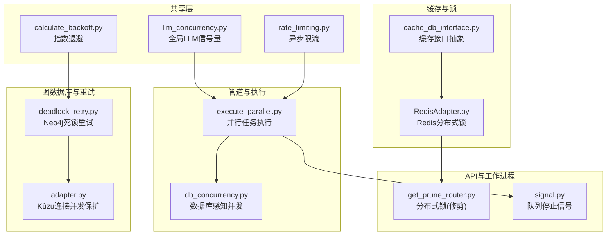
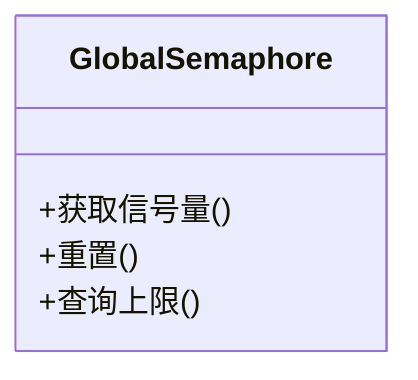
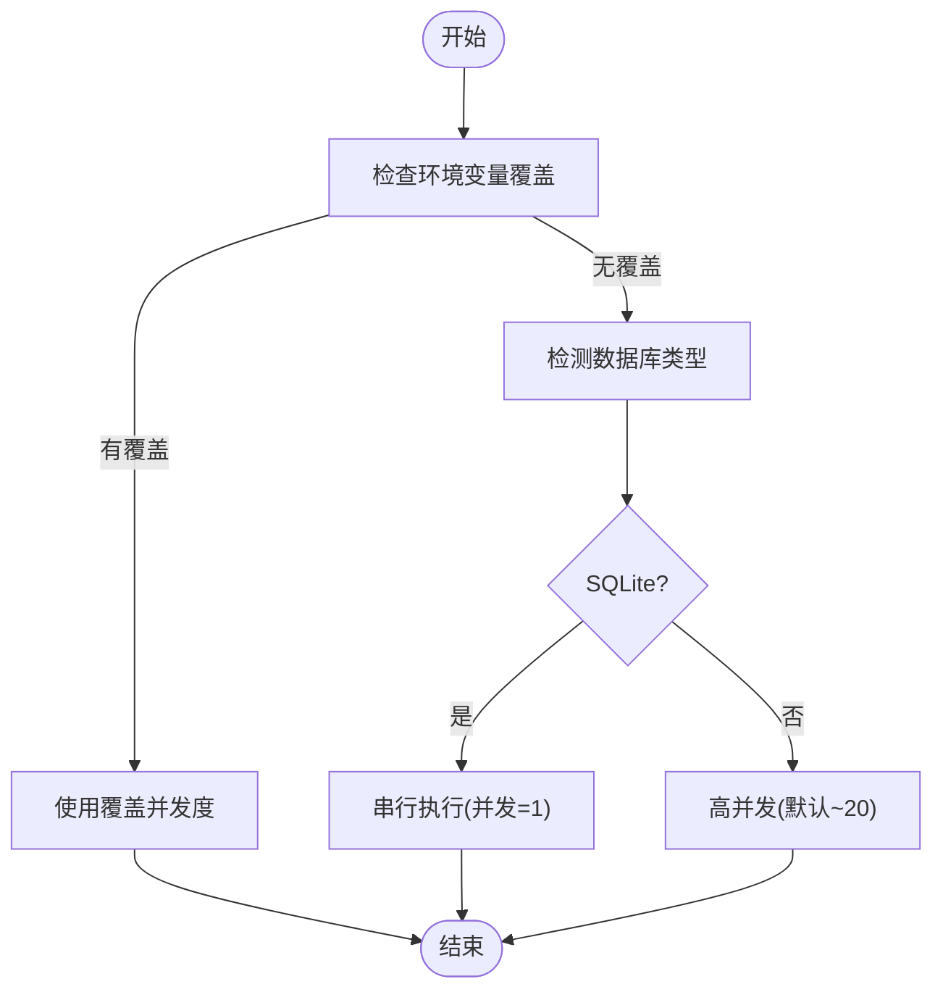
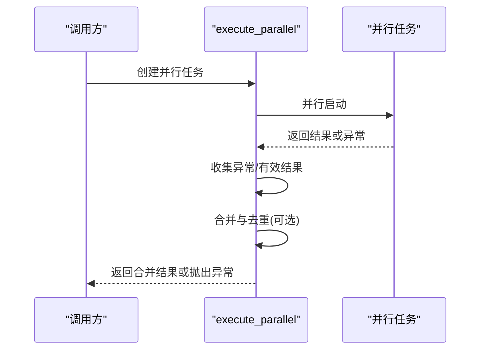
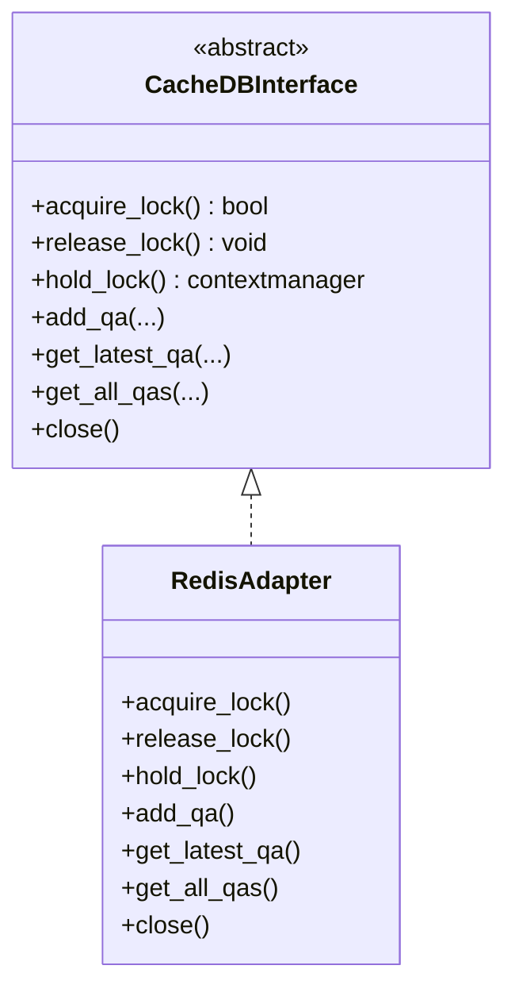
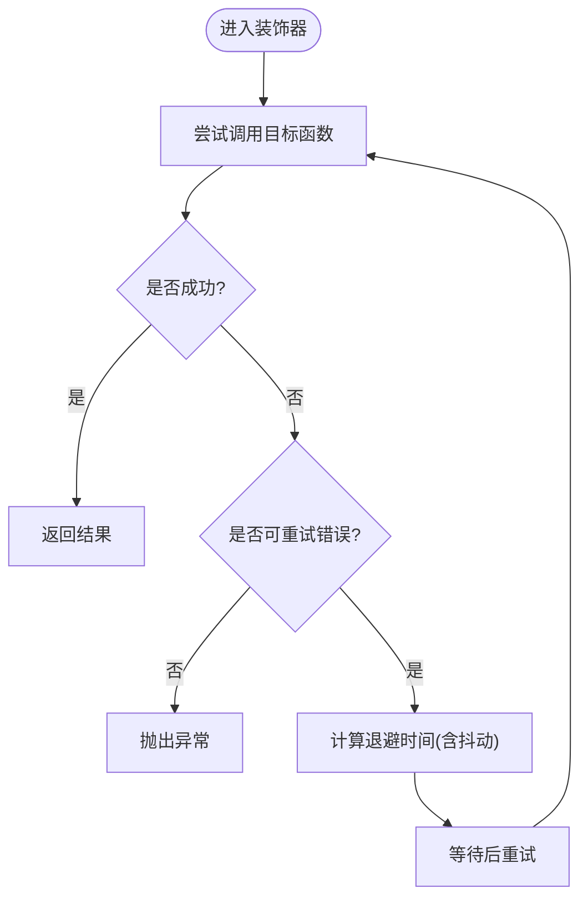
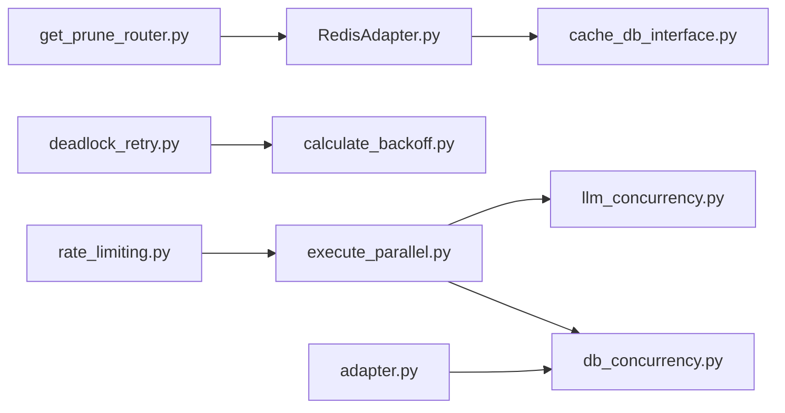

# 并发控制机制

<cite>
**本文引用的文件**
- [llm_concurrency.py](file://m_flow/shared/llm_concurrency.py)
- [cache_db_interface.py](file://m_flow/adapters/cache/cache_db_interface.py)
- [RedisAdapter.py](file://m_flow/adapters/cache/redis/RedisAdapter.py)
- [db_concurrency.py](file://m_flow/pipeline/operations/db_concurrency.py)
- [execute_parallel.py](file://m_flow/pipeline/operations/execute_parallel.py)
- [deadlock_retry.py](file://m_flow/adapters/graph/neo4j_driver/deadlock_retry.py)
- [calculate_backoff.py](file://m_flow/shared/infra_utils/calculate_backoff.py)
- [get_prune_router.py](file://m_flow/api/v1/prune/routers/get_prune_router.py)
- [adapter.py](file://m_flow/adapters/graph/kuzu/adapter.py)
- [rate_limiting.py](file://m_flow/shared/rate_limiting.py)
- [signal.py](file://mflow_workers/signal.py)
- [run_task_from_queue_test.py](file://m_flow/tests/unit/modules/pipelines/run_task_from_queue_test.py)
- [test_run_parallel.py](file://m_flow/tests/unit/pipelines/test_run_parallel.py)
- [neo4j_deadlock_test.py](file://m_flow/tests/unit/infrastructure/databases/graph/neo4j_deadlock_test.py)
</cite>

## 目录
1. [简介](#简介)
2. [项目结构](#项目结构)
3. [核心组件](#核心组件)
4. [架构总览](#架构总览)
5. [详细组件分析](#详细组件分析)
6. [依赖分析](#依赖分析)
7. [性能考虑](#性能考虑)
8. [故障排查指南](#故障排查指南)
9. [结论](#结论)
10. [附录](#附录)

## 简介
本文件系统性梳理 m_flow 在并发控制方面的机制与实践，覆盖以下主题：
- 并发控制核心原理：通过信号量、分布式锁、重试与退避等手段协调多任务执行，避免资源冲突
- 同步机制：锁、信号量、条件变量（在本代码库中主要体现为信号量与锁）
- 资源管理：内存、CPU、网络资源的分配与限制策略
- 异常处理：死锁检测与预防、瞬时故障重试、超时与回退
- 性能监控与调优：并发度设置、瓶颈识别与优化建议
- 调试技巧与最佳实践

## 项目结构
围绕并发控制的关键模块分布如下：
- 全局 LLM 并发控制：统一的全局信号量，限制 LLM 调用并发度
- 数据库并发控制：基于数据库类型自动选择串行或并行策略，并可覆盖
- 并行任务执行：管道阶段的并行执行与结果合并、去重
- 分布式锁与缓存：Redis 分布式锁与会话存储，用于跨进程/跨实例协调
- 死锁与瞬时错误处理：Neo4j 死锁重试装饰器与指数退避
- 速率限制：对 LLM 与嵌入调用进行异步限流
- 工作进程信号：队列中的停止信号，用于优雅关闭
- 测试与验证：单元测试覆盖并行执行、死锁重试等关键行为



**图表来源**
- [llm_concurrency.py:1-46](file://m_flow/shared/llm_concurrency.py#L1-L46)
- [rate_limiting.py:1-59](file://m_flow/shared/rate_limiting.py#L1-L59)
- [calculate_backoff.py:1-34](file://m_flow/shared/infra_utils/calculate_backoff.py#L1-L34)
- [execute_parallel.py:1-162](file://m_flow/pipeline/operations/execute_parallel.py#L1-L162)
- [db_concurrency.py:1-200](file://m_flow/pipeline/operations/db_concurrency.py#L1-L200)
- [cache_db_interface.py:1-125](file://m_flow/adapters/cache/cache_db_interface.py#L1-L125)
- [RedisAdapter.py:1-179](file://m_flow/adapters/cache/redis/RedisAdapter.py#L1-L179)
- [deadlock_retry.py:1-85](file://m_flow/adapters/graph/neo4j_driver/deadlock_retry.py#L1-L85)
- [adapter.py:533-565](file://m_flow/adapters/graph/kuzu/adapter.py#L533-L565)
- [get_prune_router.py:234-256](file://m_flow/api/v1/prune/routers/get_prune_router.py#L234-L256)
- [signal.py:1-25](file://mflow_workers/signal.py#L1-L25)

**章节来源**
- [llm_concurrency.py:1-46](file://m_flow/shared/llm_concurrency.py#L1-L46)
- [db_concurrency.py:1-200](file://m_flow/pipeline/operations/db_concurrency.py#L1-L200)
- [execute_parallel.py:1-162](file://m_flow/pipeline/operations/execute_parallel.py#L1-L162)
- [cache_db_interface.py:1-125](file://m_flow/adapters/cache/cache_db_interface.py#L1-L125)
- [RedisAdapter.py:1-179](file://m_flow/adapters/cache/redis/RedisAdapter.py#L1-L179)
- [deadlock_retry.py:1-85](file://m_flow/adapters/graph/neo4j_driver/deadlock_retry.py#L1-L85)
- [calculate_backoff.py:1-34](file://m_flow/shared/infra_utils/calculate_backoff.py#L1-L34)
- [get_prune_router.py:234-256](file://m_flow/api/v1/prune/routers/get_prune_router.py#L234-L256)
- [adapter.py:533-565](file://m_flow/adapters/graph/kuzu/adapter.py#L533-L565)
- [rate_limiting.py:1-59](file://m_flow/shared/rate_limiting.py#L1-L59)
- [signal.py:1-25](file://mflow_workers/signal.py#L1-L25)

## 核心组件
- 全局 LLM 并发信号量：集中控制 LLM 调用并发度，避免资源争抢与过载
- 数据库感知并发：根据数据库类型自动选择串行或高并发策略，并支持显式覆盖
- 并行任务执行：管道阶段的并行执行、结果合并与去重、异常收集与传播
- 分布式锁：Redis 分布式锁与上下文管理器，保障跨实例临界区互斥
- 死锁与瞬时错误重试：Neo4j 操作的透明重试与指数退避，降低瞬时故障影响
- 速率限制：对 LLM 与嵌入调用进行异步限流，结合配置开关启用/禁用
- 工作进程信号：队列中的停止信号，实现优雅关闭与广播通知
- 测试验证：单元测试覆盖并行执行、死锁重试、异常处理等关键场景

**章节来源**
- [llm_concurrency.py:15-45](file://m_flow/shared/llm_concurrency.py#L15-L45)
- [db_concurrency.py:77-119](file://m_flow/pipeline/operations/db_concurrency.py#L77-L119)
- [execute_parallel.py:39-158](file://m_flow/pipeline/operations/execute_parallel.py#L39-L158)
- [cache_db_interface.py:55-79](file://m_flow/adapters/cache/cache_db_interface.py#L55-L79)
- [RedisAdapter.py:84-114](file://m_flow/adapters/cache/redis/RedisAdapter.py#L84-L114)
- [deadlock_retry.py:24-84](file://m_flow/adapters/graph/neo4j_driver/deadlock_retry.py#L24-L84)
- [calculate_backoff.py:19-34](file://m_flow/shared/infra_utils/calculate_backoff.py#L19-L34)
- [rate_limiting.py:43-59](file://m_flow/shared/rate_limiting.py#L43-L59)
- [signal.py:13-22](file://mflow_workers/signal.py#L13-L22)

## 架构总览
下图展示并发控制在系统中的交互路径：从管道执行到数据库与图数据库操作，再到缓存与外部服务。

```mermaid
sequenceDiagram
participant Pipe as "管道执行"
participant Par as "并行执行"
participant Sem as "全局信号量"
participant DB as "数据库并发控制"
participant Kuzu as "Kùzu适配器"
participant Redis as "Redis分布式锁"
participant Neo4j as "Neo4j死锁重试"
Pipe->>Par : 触发并行任务
Par->>Sem : 获取LLM信号量
Par->>DB : 执行数据库写入(受并发限制)
DB->>Kuzu : 连接并发保护
Par->>Redis : 获取分布式锁(必要时)
Par->>Neo4j : 图操作(带重试/退避)
Neo4j-->>Par : 成功或重试
Par-->>Pipe : 合并结果/异常
```

**图表来源**
- [execute_parallel.py:70-158](file://m_flow/pipeline/operations/execute_parallel.py#L70-L158)
- [llm_concurrency.py:15-29](file://m_flow/shared/llm_concurrency.py#L15-L29)
- [db_concurrency.py:122-176](file://m_flow/pipeline/operations/db_concurrency.py#L122-L176)
- [adapter.py:533-565](file://m_flow/adapters/graph/kuzu/adapter.py#L533-L565)
- [RedisAdapter.py:84-114](file://m_flow/adapters/cache/redis/RedisAdapter.py#L84-L114)
- [deadlock_retry.py:24-84](file://m_flow/adapters/graph/neo4j_driver/deadlock_retry.py#L24-L84)

## 详细组件分析

### 全局 LLM 并发控制
- 设计目标：统一限制 LLM 调用并发度，避免嵌套信号量问题与资源争抢
- 关键点：
  - 使用全局信号量，按环境变量配置并发上限
  - 提供重置函数，便于测试隔离
  - 提供查询上限的便捷方法
- 使用建议：
  - 生产环境通过环境变量调整并发度
  - 对于高延迟模型或受限 API，适当降低并发度



**图表来源**
- [llm_concurrency.py:15-45](file://m_flow/shared/llm_concurrency.py#L15-L45)

**章节来源**
- [llm_concurrency.py:15-45](file://m_flow/shared/llm_concurrency.py#L15-L45)

### 数据库感知并发控制
- 自动检测数据库类型并设置并发策略：
  - SQLite：强制串行执行，避免“database is locked”
  - PostgreSQL：默认高并发（如 20），可被显式覆盖
- 支持通过环境变量覆盖自动检测
- 提供缓存清理能力，便于测试或配置变更后的刷新



**图表来源**
- [db_concurrency.py:48-119](file://m_flow/pipeline/operations/db_concurrency.py#L48-L119)

**章节来源**
- [db_concurrency.py:48-119](file://m_flow/pipeline/operations/db_concurrency.py#L48-L119)

### 并行任务执行与结果合并
- 功能要点：
  - 并行启动多个阶段任务
  - 使用返回异常收集策略，确保所有任务完成
  - 可选合并列表输出并去重（基于 MemoryNode.id 或字典 id）
  - 记录进度更新与统计信息
- 异常处理：
  - 收集所有异常，最终抛出首个异常
  - 若存在有效结果，优先返回有效结果



**图表来源**
- [execute_parallel.py:70-158](file://m_flow/pipeline/operations/execute_parallel.py#L70-L158)

**章节来源**
- [execute_parallel.py:39-158](file://m_flow/pipeline/operations/execute_parallel.py#L39-L158)
- [test_run_parallel.py:129-255](file://m_flow/tests/unit/pipelines/test_run_parallel.py#L129-L255)

### 分布式锁与缓存协调
- 接口抽象：
  - 定义分布式锁原语与上下文管理器
  - 提供问答会话存储接口（异步）
- Redis 实现：
  - 提供同步/异步客户端
  - 基于锁键名获取/释放分布式锁
  - 上下文管理器保证锁生命周期
  - 会话存储支持 TTL



**图表来源**
- [cache_db_interface.py:12-125](file://m_flow/adapters/cache/cache_db_interface.py#L12-L125)
- [RedisAdapter.py:24-179](file://m_flow/adapters/cache/redis/RedisAdapter.py#L24-L179)

**章节来源**
- [cache_db_interface.py:55-125](file://m_flow/adapters/cache/cache_db_interface.py#L55-L125)
- [RedisAdapter.py:84-179](file://m_flow/adapters/cache/redis/RedisAdapter.py#L84-L179)

### 死锁检测与预防（Neo4j）
- 重试装饰器：
  - 捕获特定标记的瞬时错误与数据库不可用
  - 指数退避+抖动，避免“惊群效应”
  - 最大重试次数可配置
- 退避算法：
  - 可配置基础延迟、增长因子与抖动比例
  - 返回每次重试的等待秒数



**图表来源**
- [deadlock_retry.py:24-84](file://m_flow/adapters/graph/neo4j_driver/deadlock_retry.py#L24-L84)
- [calculate_backoff.py:19-34](file://m_flow/shared/infra_utils/calculate_backoff.py#L19-L34)

**章节来源**
- [deadlock_retry.py:24-84](file://m_flow/adapters/graph/neo4j_driver/deadlock_retry.py#L24-L84)
- [calculate_backoff.py:19-34](file://m_flow/shared/infra_utils/calculate_backoff.py#L19-L34)
- [neo4j_deadlock_test.py:26-79](file://m_flow/tests/unit/infrastructure/databases/graph/neo4j_deadlock_test.py#L26-L79)

### 资源管理策略
- 内存与 CPU：
  - 并行执行采用信号量限制并发，避免过多协程导致内存峰值过高
  - 数据库并发控制根据后端类型自动选择串行或高并发
- 网络资源：
  - LLM 与嵌入调用支持异步限流，减少突发请求
  - 缓存与图数据库访问通过连接池与超时参数控制
- 锁与会话：
  - Redis 分布式锁用于跨实例互斥
  - 问答会话存储支持 TTL，避免无限增长

**章节来源**
- [rate_limiting.py:23-36](file://m_flow/shared/rate_limiting.py#L23-L36)
- [RedisAdapter.py:52-67](file://m_flow/adapters/cache/redis/RedisAdapter.py#L52-L67)
- [db_concurrency.py:14-15](file://m_flow/pipeline/operations/db_concurrency.py#L14-L15)

### 异常处理与死锁预防
- 死锁与瞬时错误：
  - Neo4j 操作通过装饰器自动重试，指数退避降低拥塞
- 并行异常：
  - 并行执行收集所有异常，最终抛出首个异常
  - 保留有效结果，提升鲁棒性
- 分布式锁异常：
  - Redis 锁释放时捕获锁错误，防止二次释放异常

**章节来源**
- [deadlock_retry.py:46-80](file://m_flow/adapters/graph/neo4j_driver/deadlock_retry.py#L46-L80)
- [execute_parallel.py:90-111](file://m_flow/pipeline/operations/execute_parallel.py#L90-L111)
- [RedisAdapter.py:97-105](file://m_flow/adapters/cache/redis/RedisAdapter.py#L97-L105)

### 并发度设置与性能调优
- LLM 并发度：通过环境变量设置全局上限
- 数据库并发度：自动检测数据库类型；可显式覆盖
- 并行任务合并：合理开启/关闭合并与去重，平衡吞吐与一致性
- 限流策略：根据外部服务配额启用异步限流

**章节来源**
- [llm_concurrency.py:25-28](file://m_flow/shared/llm_concurrency.py#L25-L28)
- [db_concurrency.py:56-70](file://m_flow/pipeline/operations/db_concurrency.py#L56-L70)
- [rate_limiting.py:51-58](file://m_flow/shared/rate_limiting.py#L51-L58)

### 调试技巧与最佳实践
- 并行执行调试：
  - 使用日志观察并行步骤名称与完成统计
  - 通过测试用例验证异常收集与结果合并行为
- 死锁与重试：
  - 利用测试用例验证重试次数与成功路径
  - 结合日志级别定位瞬时错误与退避行为
- 优雅关闭：
  - 使用队列停止信号实现广播关闭
  - 在 API 层面使用分布式锁避免竞态

**章节来源**
- [execute_parallel.py:17-37](file://m_flow/pipeline/operations/execute_parallel.py#L17-L37)
- [test_run_parallel.py:133-171](file://m_flow/tests/unit/pipelines/test_run_parallel.py#L133-L171)
- [signal.py:13-22](file://mflow_workers/signal.py#L13-L22)
- [get_prune_router.py:234-256](file://m_flow/api/v1/prune/routers/get_prune_router.py#L234-L256)

## 依赖分析
- 组件耦合：
  - 并行执行依赖全局信号量与数据库并发控制
  - 图数据库重试依赖退避工具
  - 缓存接口由 Redis 适配实现
  - API 层使用分布式锁协调后台操作
- 外部依赖：
  - Redis 用于分布式锁与会话存储
  - Neo4j 驱动用于图数据库操作
  - aiolimiter 用于异步限流



**图表来源**
- [execute_parallel.py:1-162](file://m_flow/pipeline/operations/execute_parallel.py#L1-L162)
- [llm_concurrency.py:1-46](file://m_flow/shared/llm_concurrency.py#L1-L46)
- [db_concurrency.py:1-200](file://m_flow/pipeline/operations/db_concurrency.py#L1-L200)
- [deadlock_retry.py:1-85](file://m_flow/adapters/graph/neo4j_driver/deadlock_retry.py#L1-L85)
- [calculate_backoff.py:1-34](file://m_flow/shared/infra_utils/calculate_backoff.py#L1-L34)
- [RedisAdapter.py:1-179](file://m_flow/adapters/cache/redis/RedisAdapter.py#L1-L179)
- [cache_db_interface.py:1-125](file://m_flow/adapters/cache/cache_db_interface.py#L1-L125)
- [get_prune_router.py:234-256](file://m_flow/api/v1/prune/routers/get_prune_router.py#L234-L256)
- [adapter.py:533-565](file://m_flow/adapters/graph/kuzu/adapter.py#L533-L565)
- [rate_limiting.py:1-59](file://m_flow/shared/rate_limiting.py#L1-L59)

**章节来源**
- [execute_parallel.py:1-162](file://m_flow/pipeline/operations/execute_parallel.py#L1-L162)
- [llm_concurrency.py:1-46](file://m_flow/shared/llm_concurrency.py#L1-L46)
- [db_concurrency.py:1-200](file://m_flow/pipeline/operations/db_concurrency.py#L1-L200)
- [deadlock_retry.py:1-85](file://m_flow/adapters/graph/neo4j_driver/deadlock_retry.py#L1-L85)
- [calculate_backoff.py:1-34](file://m_flow/shared/infra_utils/calculate_backoff.py#L1-L34)
- [RedisAdapter.py:1-179](file://m_flow/adapters/cache/redis/RedisAdapter.py#L1-L179)
- [cache_db_interface.py:1-125](file://m_flow/adapters/cache/cache_db_interface.py#L1-L125)
- [get_prune_router.py:234-256](file://m_flow/api/v1/prune/routers/get_prune_router.py#L234-L256)
- [adapter.py:533-565](file://m_flow/adapters/graph/kuzu/adapter.py#L533-L565)
- [rate_limiting.py:1-59](file://m_flow/shared/rate_limiting.py#L1-L59)

## 性能考虑
- 并发度设置：
  - LLM 并发度应与外部服务配额匹配，避免限流或熔断
  - 数据库并发度在 PostgreSQL 下可提高吞吐，在 SQLite 下必须串行
- 退避与抖动：
  - 指数退避与抖动降低瞬时故障的放大效应
- 结果合并与去重：
  - 合理使用去重可减少重复处理，但会增加内存与 CPU 开销
- 限流：
  - 异步限流在不牺牲吞吐的前提下平滑请求曲线

[本节为通用指导，无需具体文件引用]

## 故障排查指南
- 并行执行异常：
  - 检查异常收集逻辑与首个异常抛出时机
  - 验证结果合并与去重策略是否符合预期
- 死锁与重试：
  - 查看重试日志与退避间隔
  - 确认错误标记集合是否包含目标错误类型
- 分布式锁：
  - 确认锁键名与超时配置
  - 检查锁释放时的异常处理
- 优雅关闭：
  - 确认队列停止信号的发送与接收路径
  - 验证 API 层分布式锁的获取与释放

**章节来源**
- [test_run_parallel.py:133-171](file://m_flow/tests/unit/pipelines/test_run_parallel.py#L133-L171)
- [deadlock_retry.py:50-80](file://m_flow/adapters/graph/neo4j_driver/deadlock_retry.py#L50-L80)
- [RedisAdapter.py:97-105](file://m_flow/adapters/cache/redis/RedisAdapter.py#L97-L105)
- [signal.py:13-22](file://mflow_workers/signal.py#L13-L22)

## 结论
m_flow 的并发控制体系通过“全局信号量 + 数据库感知并发 + 并行执行 + 分布式锁 + 死锁重试 + 速率限制”形成闭环，既保证了资源安全，又兼顾了性能与可维护性。实践中应结合数据库类型、外部服务配额与业务负载动态调整并发度与限流策略，并通过日志与测试持续验证关键路径的正确性。

[本节为总结，无需具体文件引用]

## 附录
- 关键流程参考：
  - 并行执行与结果合并：[execute_parallel.py:70-158](file://m_flow/pipeline/operations/execute_parallel.py#L70-L158)
  - 数据库并发控制：[db_concurrency.py:122-176](file://m_flow/pipeline/operations/db_concurrency.py#L122-L176)
  - 分布式锁与缓存：[cache_db_interface.py:55-125](file://m_flow/adapters/cache/cache_db_interface.py#L55-L125)、[RedisAdapter.py:84-179](file://m_flow/adapters/cache/redis/RedisAdapter.py#L84-L179)
  - 死锁重试与退避：[deadlock_retry.py:24-84](file://m_flow/adapters/graph/neo4j_driver/deadlock_retry.py#L24-L84)、[calculate_backoff.py:19-34](file://m_flow/shared/infra_utils/calculate_backoff.py#L19-L34)
  - 速率限制：[rate_limiting.py:43-58](file://m_flow/shared/rate_limiting.py#L43-L58)
  - 工作进程信号：[signal.py:13-22](file://mflow_workers/signal.py#L13-L22)
  - 队列驱动任务链验证：[run_task_from_queue_test.py:23-71](file://m_flow/tests/unit/modules/pipelines/run_task_from_queue_test.py#L23-L71)

[本节为补充材料，无需具体文件引用]