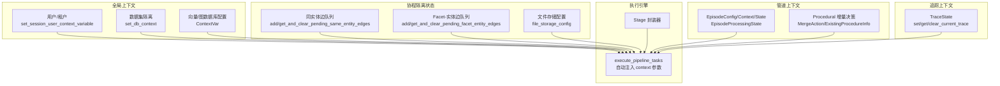
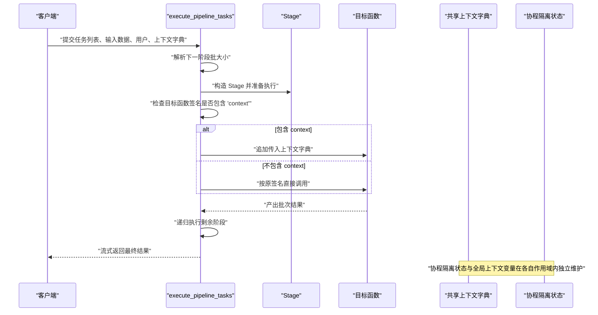
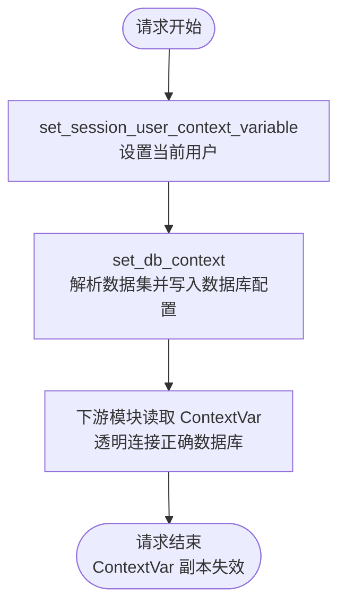
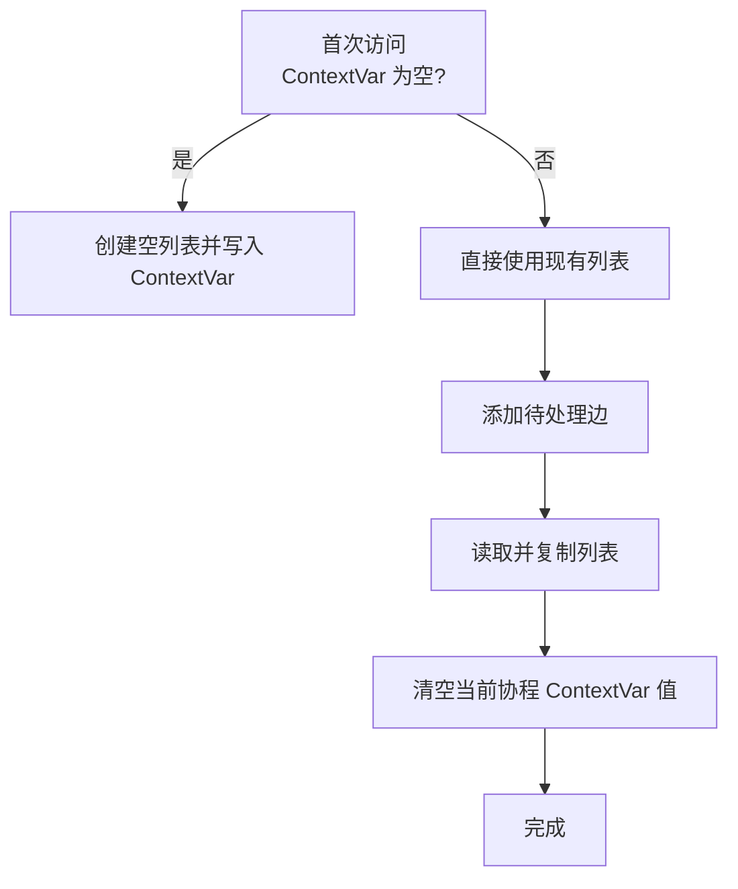
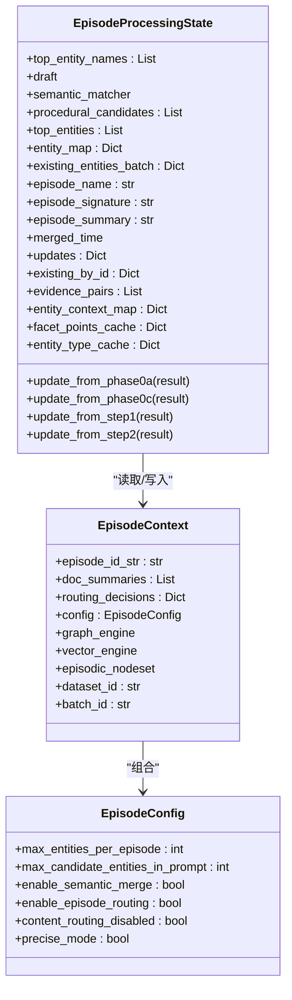
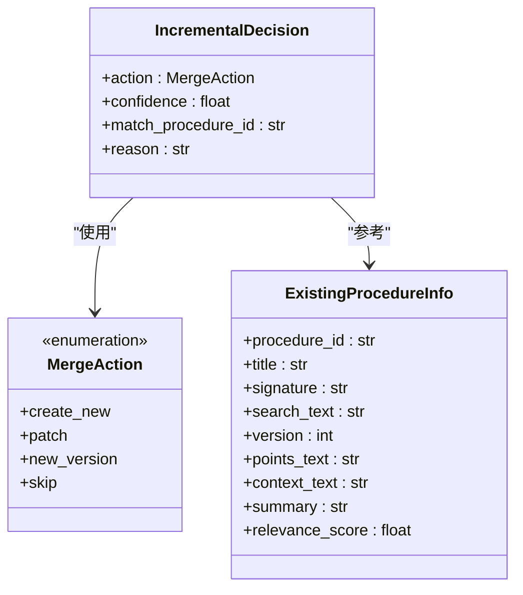
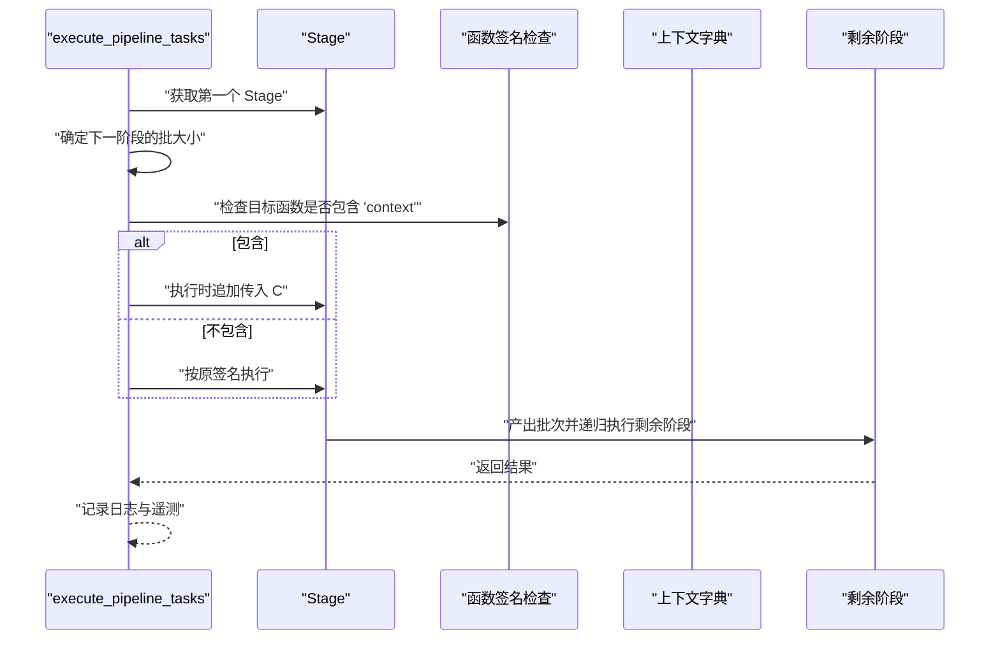
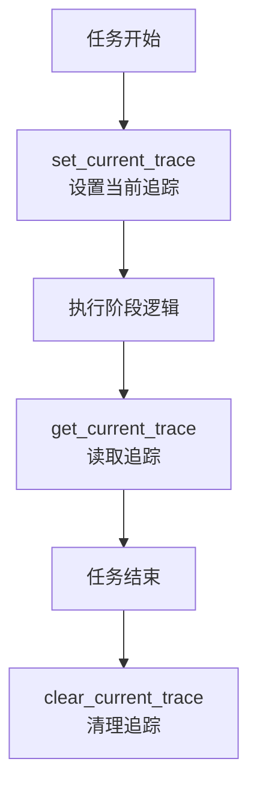
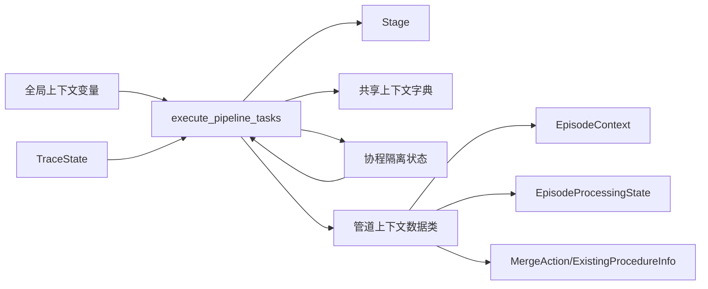

# 执行上下文管理

<cite>
**本文档引用的文件**
- [context_global_variables.py](file://m_flow/context_global_variables.py)
- [context_vars.py](file://m_flow/memory/episodic/context_vars.py)
- [pipeline_contexts.py（记忆模块）](file://m_flow/memory/episodic/episode_builder/pipeline_contexts.py)
- [pipeline_contexts.py（程序化模块）](file://m_flow/memory/procedural/procedure_builder/pipeline_contexts.py)
- [execute_pipeline_tasks.py](file://m_flow/pipeline/operations/execute_pipeline_tasks.py)
- [task.py](file://m_flow/pipeline/tasks/task.py)
- [context.py（追踪）](file://m_flow/shared/tracing/context.py)
- [config.py（文件存储配置）](file://m_flow/shared/files/storage/config.py)
- [__init__.py（共享上下文包）](file://m_flow/shared/context/__init__.py)
- [run_tasks_with_context_test.py](file://m_flow/tests/unit/modules/pipelines/run_tasks_with_context_test.py)
- [test_context_isolation.py](file://m_flow/tests/unit/tasks/episodic/test_context_isolation.py)
</cite>

## 目录
1. [简介](#简介)
2. [项目结构](#项目结构)
3. [核心组件](#核心组件)
4. [架构总览](#架构总览)
5. [详细组件分析](#详细组件分析)
6. [依赖关系分析](#依赖关系分析)
7. [性能考量](#性能考量)
8. [故障排除指南](#故障排除指南)
9. [结论](#结论)

## 简介
本文件系统性阐述 M-flow 中“执行上下文”的概念、设计与实现，覆盖以下主题：
- 上下文在任务执行中的重要性与应用场景
- 上下文的创建、初始化与参数传递
- 上下文的状态管理（保存、恢复、清理）
- 生命周期管理（从创建到销毁）
- 隔离与保护机制（确保并发安全）
- 最佳实践与常见陷阱

## 项目结构
围绕执行上下文的关键模块分布如下：
- 全局请求级上下文：用户、数据集、数据库配置等
- 协程隔离的临时状态：事件边队列、文件存储配置等
- 管道阶段间的数据上下文：Episode/Procedural 处理的配置与结果容器
- 管道执行引擎：负责注入上下文、批处理、遥测与错误传播
- 追踪上下文：跨异步任务的链路追踪状态

图表来源
- [context_global_variables.py:128-184](file://m_flow/context_global_variables.py#L128-L184)
- [context_vars.py:22-62](file://m_flow/memory/episodic/context_vars.py#L22-L62)
- [config.py（文件存储配置）:12-18](file://m_flow/shared/files/storage/config.py#L12-L18)
- [pipeline_contexts.py（记忆模块）:47-146](file://m_flow/memory/episodic/episode_builder/pipeline_contexts.py#L47-L146)
- [pipeline_contexts.py（程序化模块）:21-81](file://m_flow/memory/procedural/procedure_builder/pipeline_contexts.py#L21-L81)
- [execute_pipeline_tasks.py:46-126](file://m_flow/pipeline/operations/execute_pipeline_tasks.py#L46-L126)
- [context.py（追踪）:15-33](file://m_flow/shared/tracing/context.py#L15-L33)

章节来源
- [context_global_variables.py:1-184](file://m_flow/context_global_variables.py#L1-L184)
- [context_vars.py:1-124](file://m_flow/memory/episodic/context_vars.py#L1-L124)
- [config.py（文件存储配置）:1-18](file://m_flow/shared/files/storage/config.py#L1-L18)
- [pipeline_contexts.py（记忆模块）:1-341](file://m_flow/memory/episodic/episode_builder/pipeline_contexts.py#L1-L341)
- [pipeline_contexts.py（程序化模块）:1-82](file://m_flow/memory/procedural/procedure_builder/pipeline_contexts.py#L1-L82)
- [execute_pipeline_tasks.py:1-144](file://m_flow/pipeline/operations/execute_pipeline_tasks.py#L1-L144)
- [context.py（追踪）:1-33](file://m_flow/shared/tracing/context.py#L1-L33)

## 核心组件
- 全局请求级上下文变量
  - 用户与租户信息、当前数据集 ID、向量/图数据库配置均通过 ContextVar 存储，支持每个协程独立访问。
  - 提供设置函数以在进入请求时填充上下文槽位。
- 协程隔离的临时状态
  - 同实体边队列、Facet-实体边队列等，通过 ContextVar 实现协程隔离，避免并发写入互相污染。
  - 文件存储配置同样采用协程作用域覆盖，不影响全局默认值。
- 管道上下文数据类
  - EpisodeConfig/EpisodeContext/EpisodeProcessingState 等用于在记忆模块各阶段之间传递配置与中间结果。
  - 程序化模块定义了增量合并动作与现有程序信息等数据模型。
- 管道执行引擎
  - Stage 统一封装不同类型的可调用对象，提供统一的异步迭代接口。
  - execute_pipeline_tasks 自动检测目标函数签名，将共享上下文字典作为参数注入到需要的阶段。
- 追踪上下文
  - TraceState 通过 ContextVar 在异步任务链中隐式传播，便于统一采集链路信息。

章节来源
- [context_global_variables.py:25-37](file://m_flow/context_global_variables.py#L25-L37)
- [context_vars.py:18-62](file://m_flow/memory/episodic/context_vars.py#L18-L62)
- [config.py（文件存储配置）:7-18](file://m_flow/shared/files/storage/config.py#L7-L18)
- [pipeline_contexts.py（记忆模块）:47-146](file://m_flow/memory/episodic/episode_builder/pipeline_contexts.py#L47-L146)
- [pipeline_contexts.py（程序化模块）:21-81](file://m_flow/memory/procedural/procedure_builder/pipeline_contexts.py#L21-L81)
- [task.py:16-152](file://m_flow/pipeline/tasks/task.py#L16-L152)
- [execute_pipeline_tasks.py:46-126](file://m_flow/pipeline/operations/execute_pipeline_tasks.py#L46-L126)
- [context.py（追踪）:15-33](file://m_flow/shared/tracing/context.py#L15-L33)

## 架构总览
下图展示从请求进入、上下文初始化、管道执行到状态清理的全链路：

图表来源
- [execute_pipeline_tasks.py:46-126](file://m_flow/pipeline/operations/execute_pipeline_tasks.py#L46-L126)
- [task.py:94-122](file://m_flow/pipeline/tasks/task.py#L94-L122)

章节来源
- [execute_pipeline_tasks.py:46-126](file://m_flow/pipeline/operations/execute_pipeline_tasks.py#L46-L126)
- [task.py:94-122](file://m_flow/pipeline/tasks/task.py#L94-L122)

## 详细组件分析

### 全局请求级上下文（多租户数据库隔离）
- 设计要点
  - 使用 ContextVar 存储向量/图数据库配置、当前会话用户、当前数据集 ID。
  - 提供 set_db_context 异步函数，在启用后端访问控制时为每个数据集生成独立连接信息，并写入 ContextVar 槽位。
  - 提供 set_session_user_context_variable 用于在请求开始时设置当前用户。
- 生命周期
  - 创建：请求进入时调用 set_db_context 与 set_session_user_context_variable。
  - 使用：下游模块通过 ContextVar 获取当前配置，透明地连接到正确的数据库。
  - 清理：协程结束时 ContextVar 自然失效，无需显式清理。
- 隔离与保护
  - 每个协程拥有独立的 ContextVar 副本，互不干扰；并发请求不会互相污染数据库配置。

图表来源
- [context_global_variables.py:128-184](file://m_flow/context_global_variables.py#L128-L184)

章节来源
- [context_global_variables.py:25-37](file://m_flow/context_global_variables.py#L25-L37)
- [context_global_variables.py:128-184](file://m_flow/context_global_variables.py#L128-L184)

### 协程隔离的临时状态（事件边队列与文件存储配置）
- 设计要点
  - 同实体边队列与 Facet-实体边队列通过 ContextVar 实现协程隔离，支持添加、复制与清空操作。
  - 文件存储配置同样采用 ContextVar，允许在协程内覆盖默认配置而不影响全局。
- 生命周期
  - 创建：首次访问时若未初始化则自动创建空列表并写入 ContextVar。
  - 使用：在写入阶段累积，在读取阶段获取并清空。
  - 清理：清空操作仅影响当前协程副本，不影响其他协程。
- 隔离与保护
  - 测试验证了同一数据源在多个协程中并发写入时的隔离性，以及清空操作不会影响其他协程的数据。

图表来源
- [context_vars.py:27-62](file://m_flow/memory/episodic/context_vars.py#L27-L62)
- [config.py（文件存储配置）:12-18](file://m_flow/shared/files/storage/config.py#L12-L18)

章节来源
- [context_vars.py:18-124](file://m_flow/memory/episodic/context_vars.py#L18-L124)
- [config.py（文件存储配置）:1-18](file://m_flow/shared/files/storage/config.py#L1-L18)
- [test_context_isolation.py:16-94](file://m_flow/tests/unit/tasks/episodic/test_context_isolation.py#L16-L94)

### 管道上下文数据类（记忆模块）
- 设计要点
  - EpisodeConfig：集中管理处理所需的配置参数（如实体/候选数量限制、提示词长度限制、特征开关等）。
  - EpisodeContext：承载单次 Episode 处理所需的所有输入（标题、摘要、路由结果、配置、数据库引擎、共享对象等）。
  - EpisodeProcessingState：跨阶段累加器，收集各阶段输出以便后续阶段复用。
- 数据流
  - 在管道启动时构建 EpisodeContext，随后在各阶段更新 EpisodeProcessingState，最终由下游阶段读取。

图表来源
- [pipeline_contexts.py（记忆模块）:47-326](file://m_flow/memory/episodic/episode_builder/pipeline_contexts.py#L47-L326)

章节来源
- [pipeline_contexts.py（记忆模块）:47-326](file://m_flow/memory/episodic/episode_builder/pipeline_contexts.py#L47-L326)

### 管道上下文数据类（程序化模块）
- 设计要点
  - MergeAction：描述增量合并动作类型（新建、补丁、新版本、跳过）。
  - ExistingProcedureInfo：从召回结果中提取的既有程序信息，用于决策与编译。
  - IncrementalDecision：LLM 对候选的决策结果，包含动作、置信度、匹配 ID、原因等。

图表来源
- [pipeline_contexts.py（程序化模块）:21-81](file://m_flow/memory/procedural/procedure_builder/pipeline_contexts.py#L21-L81)

章节来源
- [pipeline_contexts.py（程序化模块）:21-81](file://m_flow/memory/procedural/procedure_builder/pipeline_contexts.py#L21-L81)

### 管道执行引擎与上下文注入
- 设计要点
  - Stage 统一封装任意可调用对象，暴露统一的异步迭代接口，支持同步/异步/生成器/异步生成器。
  - execute_pipeline_tasks 自动检测目标函数签名，若包含 "context" 参数，则将共享上下文字典追加传入。
  - 支持批处理（batch_size），并进行遥测事件上报与异常传播。
- 生命周期
  - 创建：构建 Stage 列表并传入 execute_pipeline_tasks。
  - 使用：逐阶段执行，必要时注入上下文；递归处理剩余阶段。
  - 清理：协程结束时上下文自然失效，无需手动清理。
- 隔离与保护
  - 通过函数签名检测注入，避免对不需要上下文的阶段造成侵入。
  - 与协程隔离状态配合，确保并发场景下的数据一致性。

图表来源
- [execute_pipeline_tasks.py:46-126](file://m_flow/pipeline/operations/execute_pipeline_tasks.py#L46-L126)
- [task.py:94-122](file://m_flow/pipeline/tasks/task.py#L94-L122)

章节来源
- [execute_pipeline_tasks.py:46-126](file://m_flow/pipeline/operations/execute_pipeline_tasks.py#L46-L126)
- [task.py:16-152](file://m_flow/pipeline/tasks/task.py#L16-L152)

### 追踪上下文（TraceState）
- 设计要点
  - 通过 ContextVar 存储当前 TraceState，支持在所有异步任务中隐式传播。
  - 提供 set/get/clear 接口，便于在任务链中统一采集与清理链路信息。
- 生命周期
  - 创建：在任务开始时设置 TraceState。
  - 使用：在各阶段读取并附加到日志或遥测。
  - 清理：任务结束时清除，避免泄漏。

图表来源
- [context.py（追踪）:20-33](file://m_flow/shared/tracing/context.py#L20-L33)

章节来源
- [context.py（追踪）:15-33](file://m_flow/shared/tracing/context.py#L15-L33)

### 上下文使用示例与验证
- 管道上下文传递示例
  - 通过 execute_pipeline_tasks 的 context 参数，将共享上下文字典贯穿整个管道。
  - 目标函数若声明 context 参数，将自动接收该字典。
- 协程隔离验证
  - 并发写入不同协程的同实体边队列，彼此互不干扰。
  - 清空操作仅影响当前协程副本，不影响其他协程。

章节来源
- [run_tasks_with_context_test.py:45-67](file://m_flow/tests/unit/modules/pipelines/run_tasks_with_context_test.py#L45-L67)
- [test_context_isolation.py:16-94](file://m_flow/tests/unit/tasks/episodic/test_context_isolation.py#L16-L94)

## 依赖关系分析
- 组件耦合
  - execute_pipeline_tasks 与 Stage 解耦良好，通过统一接口与签名检测实现上下文注入。
  - 全局上下文与协程隔离状态分别服务于不同粒度的隔离需求，互不依赖。
  - 管道上下文数据类与执行引擎通过共享字典或数据类对象进行协作。
- 外部依赖
  - 使用 Python contextvars 实现协程隔离。
  - 使用 typing/asyncio 等标准库保证类型与异步特性。

图表来源
- [execute_pipeline_tasks.py:46-126](file://m_flow/pipeline/operations/execute_pipeline_tasks.py#L46-L126)
- [task.py:16-152](file://m_flow/pipeline/tasks/task.py#L16-L152)
- [pipeline_contexts.py（记忆模块）:47-326](file://m_flow/memory/episodic/episode_builder/pipeline_contexts.py#L47-L326)
- [pipeline_contexts.py（程序化模块）:21-81](file://m_flow/memory/procedural/procedure_builder/pipeline_contexts.py#L21-L81)
- [context_vars.py:22-62](file://m_flow/memory/episodic/context_vars.py#L22-L62)
- [context.py（追踪）:15-33](file://m_flow/shared/tracing/context.py#L15-L33)

章节来源
- [execute_pipeline_tasks.py:46-126](file://m_flow/pipeline/operations/execute_pipeline_tasks.py#L46-L126)
- [task.py:16-152](file://m_flow/pipeline/tasks/task.py#L16-L152)
- [pipeline_contexts.py（记忆模块）:47-326](file://m_flow/memory/episodic/episode_builder/pipeline_contexts.py#L47-L326)
- [pipeline_contexts.py（程序化模块）:21-81](file://m_flow/memory/procedural/procedure_builder/pipeline_contexts.py#L21-L81)
- [context_vars.py:22-62](file://m_flow/memory/episodic/context_vars.py#L22-L62)
- [context.py（追踪）:15-33](file://m_flow/shared/tracing/context.py#L15-L33)

## 性能考量
- 批处理优化
  - 通过 Stage 的 batch_size 配置减少调用开销，提升吞吐。
- 异步与并发
  - 协程隔离避免锁竞争，提高并发效率；但需注意避免在协程间共享可变对象。
- 遥测与可观测性
  - 执行引擎内置遥测事件，便于定位性能瓶颈与异常路径。

## 故障排除指南
- 上下文未注入
  - 现象：目标函数声明了 context 参数但未收到上下文。
  - 排查：确认 execute_pipeline_tasks 调用时传入了 context 字典，且目标函数签名包含 "context"。
- 协程隔离问题
  - 现象：并发场景下数据互相污染。
  - 排查：确认使用 ContextVar 管理状态，避免使用全局变量；验证测试用例中的并发行为。
- 数据库连接错误
  - 现象：连接到错误的数据集或凭据。
  - 排查：确认 set_db_context 已在请求开始时调用；检查 ContextVar 中的配置是否正确。
- 追踪缺失
  - 现象：链路信息不完整。
  - 排查：确认在任务开始时设置 TraceState，在结束时清理。

章节来源
- [execute_pipeline_tasks.py:109-113](file://m_flow/pipeline/operations/execute_pipeline_tasks.py#L109-L113)
- [context_global_variables.py:128-184](file://m_flow/context_global_variables.py#L128-L184)
- [context.py（追踪）:20-33](file://m_flow/shared/tracing/context.py#L20-L33)

## 结论
M-flow 的执行上下文体系通过“全局请求级上下文 + 协程隔离状态 + 管道上下文数据类 + 执行引擎注入”实现了：
- 明确的上下文边界与生命周期
- 高效的参数传递与状态管理
- 强隔离与并发安全性
- 良好的扩展性与可观测性

遵循本文的最佳实践，可在复杂异步工作流中稳定、高效地管理执行上下文。