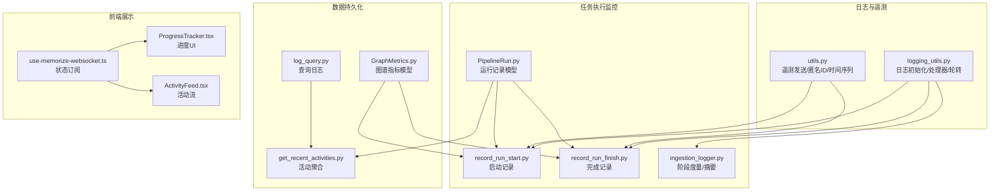
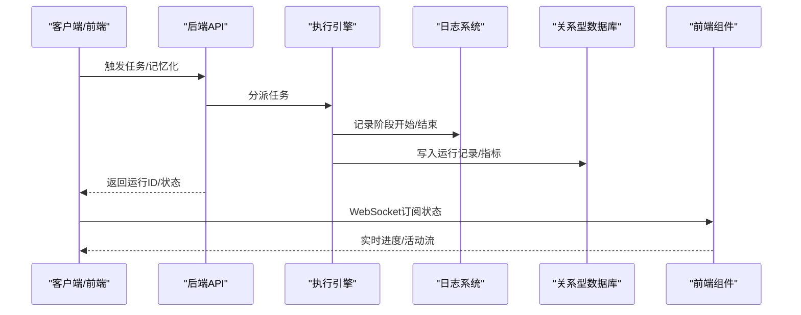
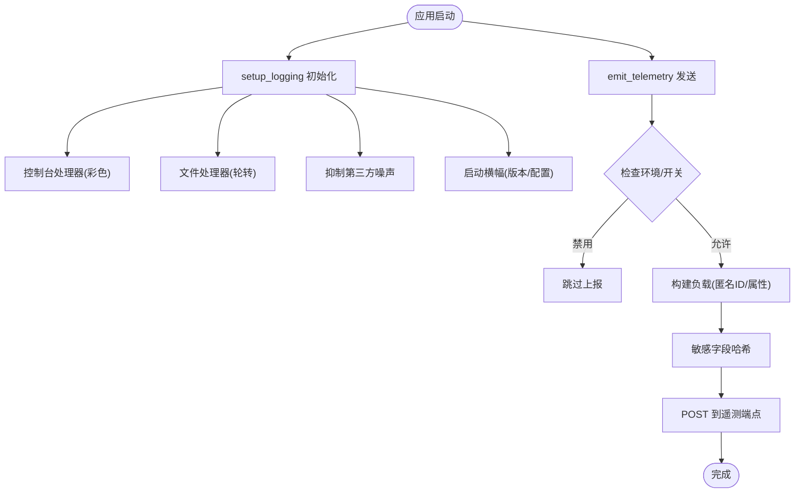
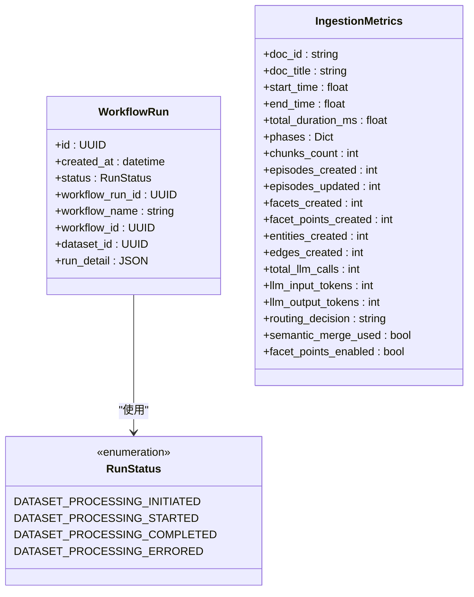
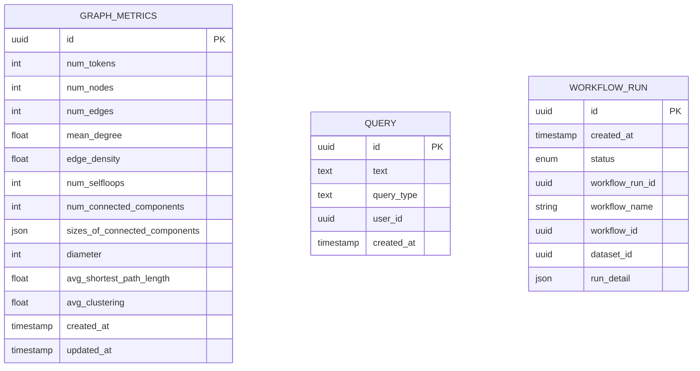
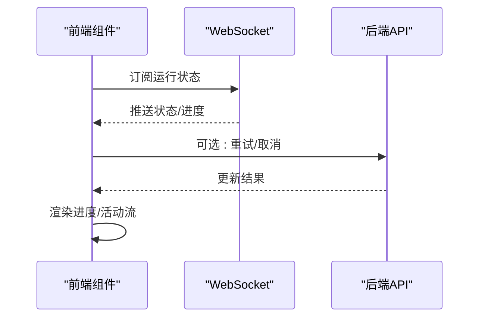
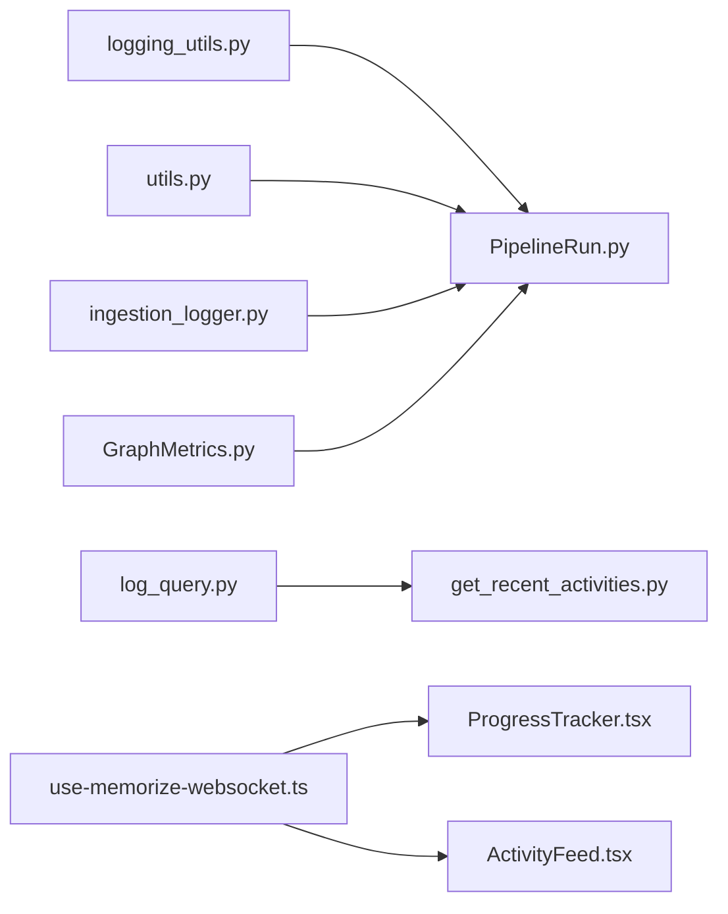

# 监控与日志记录

<cite>
**本文档引用的文件**
- [m_flow/shared/logging_utils.py](file://m_flow/shared/logging_utils.py)
- [m_flow/shared/utils.py](file://m_flow/shared/utils.py)
- [m_flow/memory/episodic/ingestion_logger.py](file://m_flow/memory/episodic/ingestion_logger.py)
- [m_flow/pipeline/models/PipelineRun.py](file://m_flow/pipeline/models/PipelineRun.py)
- [m_flow/pipeline/operations/record_run_start.py](file://m_flow/pipeline/operations/record_run_start.py)
- [m_flow/pipeline/operations/record_run_finish.py](file://m_flow/pipeline/operations/record_run_finish.py)
- [m_flow/data/methods/get_recent_activities.py](file://m_flow/data/methods/get_recent_activities.py)
- [m_flow/search/operations/log_query.py](file://m_flow/search/operations/log_query.py)
- [m_flow/data/models/GraphMetrics.py](file://m_flow/data/models/GraphMetrics.py)
- [m_flow/tests/test_telemetry.py](file://m_flow/tests/test_telemetry.py)
- [m_flow-frontend/src/hooks/use-memorize-websocket.ts](file://m_flow-frontend/src/hooks/use-memorize-websocket.ts)
- [m_flow-frontend/src/components/common/ProgressTracker.tsx](file://m_flow-frontend/src/components/common/ProgressTracker.tsx)
- [m_flow-frontend/src/components/dashboard/ActivityFeed.tsx](file://m_flow-frontend/src/components/dashboard/ActivityFeed.tsx)
</cite>

## 目录
1. [简介](#简介)
2. [项目结构](#项目结构)
3. [核心组件](#核心组件)
4. [架构总览](#架构总览)
5. [详细组件分析](#详细组件分析)
6. [依赖关系分析](#依赖关系分析)
7. [性能考虑](#性能考虑)
8. [故障排查指南](#故障排查指南)
9. [结论](#结论)
10. [附录](#附录)

## 简介
本文件系统性梳理 m_flow 的监控与日志记录体系，覆盖以下方面：
- 任务执行监控的关键指标与测量方法：执行时间、成功率、资源消耗（如 LLM Token 消耗）等
- 日志记录的结构与格式：统一的日志初始化、级别与输出、文件轮转策略
- 监控数据的采集与存储：数据库持久化、时序与聚合指标模型
- 实时监控与历史数据分析：前端活动流、进度跟踪与状态可视化
- 告警与阈值：当前未内置告警机制，建议基于现有指标扩展
- 运维建议与故障排查：日志目录、轮转、第三方噪声过滤、遥测开关

## 项目结构
围绕监控与日志的核心模块分布如下：
- 日志基础设施：集中式日志初始化与输出（控制台与文件）
- 遥测与分析：可选的遥测上报（生产/禁用控制）
- 任务执行监控：管道运行记录、阶段度量、摘要报告
- 数据持久化：工作流运行记录、图谱指标、查询日志
- 前端展示：活动流、进度跟踪、WebSocket 状态

**图表来源**
- [m_flow/shared/logging_utils.py:340-519](file://m_flow/shared/logging_utils.py#L340-L519)
- [m_flow/shared/utils.py:66-102](file://m_flow/shared/utils.py#L66-L102)
- [m_flow/pipeline/models/PipelineRun.py:36-52](file://m_flow/pipeline/models/PipelineRun.py#L36-L52)
- [m_flow/pipeline/operations/record_run_start.py:18-56](file://m_flow/pipeline/operations/record_run_start.py#L18-L56)
- [m_flow/pipeline/operations/record_run_finish.py:18-56](file://m_flow/pipeline/operations/record_run_finish.py#L18-L56)
- [m_flow/memory/episodic/ingestion_logger.py:104-531](file://m_flow/memory/episodic/ingestion_logger.py#L104-L531)
- [m_flow/data/models/GraphMetrics.py:17-47](file://m_flow/data/models/GraphMetrics.py#L17-L47)
- [m_flow/data/methods/get_recent_activities.py:21-99](file://m_flow/data/methods/get_recent_activities.py#L21-L99)
- [m_flow/search/operations/log_query.py:12-21](file://m_flow/search/operations/log_query.py#L12-L21)
- [m_flow-frontend/src/hooks/use-memorize-websocket.ts:235-285](file://m_flow-frontend/src/hooks/use-memorize-websocket.ts#L235-L285)
- [m_flow-frontend/src/components/common/ProgressTracker.tsx:140-341](file://m_flow-frontend/src/components/common/ProgressTracker.tsx#L140-L341)
- [m_flow-frontend/src/components/dashboard/ActivityFeed.tsx:1-140](file://m_flow-frontend/src/components/dashboard/ActivityFeed.tsx#L1-L140)

**章节来源**
- [m_flow/shared/logging_utils.py:340-519](file://m_flow/shared/logging_utils.py#L340-L519)
- [m_flow/shared/utils.py:66-102](file://m_flow/shared/utils.py#L66-L102)
- [m_flow/pipeline/models/PipelineRun.py:36-52](file://m_flow/pipeline/models/PipelineRun.py#L36-L52)
- [m_flow/pipeline/operations/record_run_start.py:18-56](file://m_flow/pipeline/operations/record_run_start.py#L18-L56)
- [m_flow/pipeline/operations/record_run_finish.py:18-56](file://m_flow/pipeline/operations/record_run_finish.py#L18-L56)
- [m_flow/memory/episodic/ingestion_logger.py:104-531](file://m_flow/memory/episodic/ingestion_logger.py#L104-L531)
- [m_flow/data/models/GraphMetrics.py:17-47](file://m_flow/data/models/GraphMetrics.py#L17-L47)
- [m_flow/data/methods/get_recent_activities.py:21-99](file://m_flow/data/methods/get_recent_activities.py#L21-L99)
- [m_flow/search/operations/log_query.py:12-21](file://m_flow/search/operations/log_query.py#L12-L21)
- [m_flow-frontend/src/hooks/use-memorize-websocket.ts:235-285](file://m_flow-frontend/src/hooks/use-memorize-websocket.ts#L235-L285)
- [m_flow-frontend/src/components/common/ProgressTracker.tsx:140-341](file://m_flow-frontend/src/components/common/ProgressTracker.tsx#L140-L341)
- [m_flow-frontend/src/components/dashboard/ActivityFeed.tsx:1-140](file://m_flow-frontend/src/components/dashboard/ActivityFeed.tsx#L1-L140)

## 核心组件
- 统一日志系统：通过结构化日志初始化，支持控制台彩色输出与文本文件轮转；自动抑制第三方噪声日志；提供便捷获取器
- 遥测上报：按环境变量控制是否启用，生产环境默认上报，开发/测试环境默认禁用；对敏感字段做哈希处理
- 任务执行监控：
  - 工作流运行记录：状态枚举、运行详情 JSON 字段、时间戳
  - 阶段度量：按阶段统计耗时、输入输出数量、LLM 调用次数与 Token 消耗
  - 完成摘要：汇总阶段耗时、关键实体计数、LLM 使用情况
- 数据持久化：
  - 图谱指标模型：节点/边/连通分量/平均聚类等结构化指标
  - 查询日志：搜索请求持久化
  - 活动聚合：统一检索与导入活动，供仪表板使用
- 前端监控展示：WebSocket 订阅、进度 UI、活动流

**章节来源**
- [m_flow/shared/logging_utils.py:340-519](file://m_flow/shared/logging_utils.py#L340-L519)
- [m_flow/shared/utils.py:66-102](file://m_flow/shared/utils.py#L66-L102)
- [m_flow/pipeline/models/PipelineRun.py:21-52](file://m_flow/pipeline/models/PipelineRun.py#L21-L52)
- [m_flow/memory/episodic/ingestion_logger.py:48-103](file://m_flow/memory/episodic/ingestion_logger.py#L48-L103)
- [m_flow/data/models/GraphMetrics.py:17-47](file://m_flow/data/models/GraphMetrics.py#L17-L47)
- [m_flow/data/methods/get_recent_activities.py:21-99](file://m_flow/data/methods/get_recent_activities.py#L21-L99)
- [m_flow/search/operations/log_query.py:12-21](file://m_flow/search/operations/log_query.py#L12-L21)
- [m_flow-frontend/src/hooks/use-memorize-websocket.ts:235-285](file://m_flow-frontend/src/hooks/use-memorize-websocket.ts#L235-L285)
- [m_flow-frontend/src/components/common/ProgressTracker.tsx:140-341](file://m_flow-frontend/src/components/common/ProgressTracker.tsx#L140-L341)
- [m_flow-frontend/src/components/dashboard/ActivityFeed.tsx:1-140](file://m_flow-frontend/src/components/dashboard/ActivityFeed.tsx#L1-L140)

## 架构总览
下图展示了从任务执行到日志/指标持久化的整体流程，以及前端的实时监控视图。

**图表来源**
- [m_flow/pipeline/operations/record_run_start.py:18-56](file://m_flow/pipeline/operations/record_run_start.py#L18-L56)
- [m_flow/pipeline/operations/record_run_finish.py:18-56](file://m_flow/pipeline/operations/record_run_finish.py#L18-L56)
- [m_flow/memory/episodic/ingestion_logger.py:181-214](file://m_flow/memory/episodic/ingestion_logger.py#L181-L214)
- [m_flow/data/methods/get_recent_activities.py:21-99](file://m_flow/data/methods/get_recent_activities.py#L21-L99)
- [m_flow-frontend/src/hooks/use-memorize-websocket.ts:235-285](file://m_flow-frontend/src/hooks/use-memorize-websocket.ts#L235-L285)

## 详细组件分析

### 日志系统与遥测
- 日志初始化：一次性配置结构化流水线、控制台处理器、文件处理器（轮转）、异常钩子、第三方噪声过滤
- 输出格式：统一时间戳、级别、消息体与附加键值；支持结构化事件与纯文本混合
- 文件轮转：按大小限制与保留数量清理旧日志，支持 CLI 模式下的清理提示
- 遥测上报：按环境变量控制，生产环境默认启用；对 URL 等敏感键做确定性哈希；静默失败

**图表来源**
- [m_flow/shared/logging_utils.py:340-519](file://m_flow/shared/logging_utils.py#L340-L519)
- [m_flow/shared/utils.py:66-102](file://m_flow/shared/utils.py#L66-L102)

**章节来源**
- [m_flow/shared/logging_utils.py:340-519](file://m_flow/shared/logging_utils.py#L340-L519)
- [m_flow/shared/utils.py:66-102](file://m_flow/shared/utils.py#L66-L102)
- [m_flow/tests/test_telemetry.py:47-97](file://m_flow/tests/test_telemetry.py#L47-L97)

### 任务执行监控与指标
- 运行记录模型：包含运行状态枚举、运行ID、工作流名称/ID、数据集ID、运行详情（JSON）
- 启动/完成记录：在任务开始与结束时写入数据库，便于后续统计与回溯
- 阶段度量与摘要：按阶段记录耗时、输入输出数量、LLM 调用次数与 Token 消耗，最终生成摘要报告
- 指标聚合：活动聚合接口将检索与导入活动统一输出，前端用于活动流展示

**图表来源**
- [m_flow/pipeline/models/PipelineRun.py:21-52](file://m_flow/pipeline/models/PipelineRun.py#L21-L52)
- [m_flow/memory/episodic/ingestion_logger.py:68-103](file://m_flow/memory/episodic/ingestion_logger.py#L68-L103)

**章节来源**
- [m_flow/pipeline/models/PipelineRun.py:21-52](file://m_flow/pipeline/models/PipelineRun.py#L21-L52)
- [m_flow/pipeline/operations/record_run_start.py:18-56](file://m_flow/pipeline/operations/record_run_start.py#L18-L56)
- [m_flow/pipeline/operations/record_run_finish.py:18-56](file://m_flow/pipeline/operations/record_run_finish.py#L18-L56)
- [m_flow/memory/episodic/ingestion_logger.py:104-531](file://m_flow/memory/episodic/ingestion_logger.py#L104-L531)
- [m_flow/data/methods/get_recent_activities.py:21-99](file://m_flow/data/methods/get_recent_activities.py#L21-L99)

### 数据持久化与指标模型
- 图谱指标模型：记录节点/边/连通性/密度/聚类等结构化指标，并带审计时间戳
- 查询日志：将用户搜索请求持久化，便于后续审计与分析
- 活动聚合：统一检索与导入活动，前端以时间线形式展示

**图表来源**
- [m_flow/data/models/GraphMetrics.py:17-47](file://m_flow/data/models/GraphMetrics.py#L17-L47)
- [m_flow/search/operations/log_query.py:12-21](file://m_flow/search/operations/log_query.py#L12-L21)
- [m_flow/pipeline/models/PipelineRun.py:36-52](file://m_flow/pipeline/models/PipelineRun.py#L36-L52)

**章节来源**
- [m_flow/data/models/GraphMetrics.py:17-47](file://m_flow/data/models/GraphMetrics.py#L17-L47)
- [m_flow/search/operations/log_query.py:12-21](file://m_flow/search/operations/log_query.py#L12-L21)
- [m_flow/data/methods/get_recent_activities.py:21-99](file://m_flow/data/methods/get_recent_activities.py#L21-L99)

### 前端监控与实时展示
- WebSocket 状态订阅：提取运行ID、判断完成/错误状态、支持重试/取消
- 进度跟踪组件：根据状态渲染颜色与图标，显示运行ID与操作按钮
- 活动流组件：按类型映射图标与状态，相对时间显示，点击查看详情

**图表来源**
- [m_flow-frontend/src/hooks/use-memorize-websocket.ts:235-285](file://m_flow-frontend/src/hooks/use-memorize-websocket.ts#L235-L285)
- [m_flow-frontend/src/components/common/ProgressTracker.tsx:140-341](file://m_flow-frontend/src/components/common/ProgressTracker.tsx#L140-L341)
- [m_flow-frontend/src/components/dashboard/ActivityFeed.tsx:1-140](file://m_flow-frontend/src/components/dashboard/ActivityFeed.tsx#L1-L140)

**章节来源**
- [m_flow-frontend/src/hooks/use-memorize-websocket.ts:235-285](file://m_flow-frontend/src/hooks/use-memorize-websocket.ts#L235-L285)
- [m_flow-frontend/src/components/common/ProgressTracker.tsx:140-341](file://m_flow-frontend/src/components/common/ProgressTracker.tsx#L140-L341)
- [m_flow-frontend/src/components/dashboard/ActivityFeed.tsx:1-140](file://m_flow-frontend/src/components/dashboard/ActivityFeed.tsx#L1-L140)

## 依赖关系分析
- 日志系统依赖结构化日志框架与标准库日志模块，提供统一入口与处理器链
- 遥测模块依赖网络请求与环境变量，对敏感字段进行哈希处理
- 执行监控依赖数据库适配器与关系型模型，确保运行状态与指标可持久化
- 前端组件依赖后端 API 与 WebSocket，实现状态订阅与 UI 展示

**图表来源**
- [m_flow/shared/logging_utils.py:340-519](file://m_flow/shared/logging_utils.py#L340-L519)
- [m_flow/shared/utils.py:66-102](file://m_flow/shared/utils.py#L66-L102)
- [m_flow/pipeline/models/PipelineRun.py:36-52](file://m_flow/pipeline/models/PipelineRun.py#L36-L52)
- [m_flow/memory/episodic/ingestion_logger.py:104-531](file://m_flow/memory/episodic/ingestion_logger.py#L104-L531)
- [m_flow/data/models/GraphMetrics.py:17-47](file://m_flow/data/models/GraphMetrics.py#L17-L47)
- [m_flow/search/operations/log_query.py:12-21](file://m_flow/search/operations/log_query.py#L12-L21)
- [m_flow/data/methods/get_recent_activities.py:21-99](file://m_flow/data/methods/get_recent_activities.py#L21-L99)
- [m_flow-frontend/src/hooks/use-memorize-websocket.ts:235-285](file://m_flow-frontend/src/hooks/use-memorize-websocket.ts#L235-L285)
- [m_flow-frontend/src/components/common/ProgressTracker.tsx:140-341](file://m_flow-frontend/src/components/common/ProgressTracker.tsx#L140-L341)
- [m_flow-frontend/src/components/dashboard/ActivityFeed.tsx:1-140](file://m_flow-frontend/src/components/dashboard/ActivityFeed.tsx#L1-L140)

**章节来源**
- [m_flow/shared/logging_utils.py:340-519](file://m_flow/shared/logging_utils.py#L340-L519)
- [m_flow/shared/utils.py:66-102](file://m_flow/shared/utils.py#L66-L102)
- [m_flow/pipeline/models/PipelineRun.py:36-52](file://m_flow/pipeline/models/PipelineRun.py#L36-L52)
- [m_flow/memory/episodic/ingestion_logger.py:104-531](file://m_flow/memory/episodic/ingestion_logger.py#L104-L531)
- [m_flow/data/models/GraphMetrics.py:17-47](file://m_flow/data/models/GraphMetrics.py#L17-L47)
- [m_flow/search/operations/log_query.py:12-21](file://m_flow/search/operations/log_query.py#L12-L21)
- [m_flow/data/methods/get_recent_activities.py:21-99](file://m_flow/data/methods/get_recent_activities.py#L21-L99)
- [m_flow-frontend/src/hooks/use-memorize-websocket.ts:235-285](file://m_flow-frontend/src/hooks/use-memorize-websocket.ts#L235-L285)
- [m_flow-frontend/src/components/common/ProgressTracker.tsx:140-341](file://m_flow-frontend/src/components/common/ProgressTracker.tsx#L140-L341)
- [m_flow-frontend/src/components/dashboard/ActivityFeed.tsx:1-140](file://m_flow-frontend/src/components/dashboard/ActivityFeed.tsx#L1-L140)

## 性能考虑
- 日志性能：文件轮转与磁盘写入需结合磁盘 IOPS 与日志级别；建议在高吞吐场景降低 DEBUG 级别或增加异步写入
- 遥测开销：POST 请求超时短、失败静默，避免阻塞主流程；生产环境建议配合降采样或批量上报
- 数据库写入：运行记录与指标写入应尽量合并事务，减少往返；对高频指标可采用批处理
- 前端渲染：活动流与进度组件应做虚拟滚动与节流，避免大数据量导致卡顿

## 故障排查指南
- 日志路径与轮转
  - 确认日志目录可写，查看环境变量对最大文件大小与保留数量的控制
  - 若出现“无法创建日志文件”，检查权限与路径
- 第三方噪声
  - 结构化日志已过滤常见噪声；若仍有干扰，检查相关环境变量与过滤器
- 遥测问题
  - 确认遥测端点与开关；开发/测试环境默认禁用；URL 等敏感字段会被哈希
- 数据库初始化
  - 启动时预创建默认权限，避免并发冲突；若出现完整性错误，确认已有权限存在
- 前端状态
  - WebSocket 订阅需正确提取运行ID；错误状态时可触发重试或取消

**章节来源**
- [m_flow/shared/logging_utils.py:269-316](file://m_flow/shared/logging_utils.py#L269-L316)
- [m_flow/shared/utils.py:74-78](file://m_flow/shared/utils.py#L74-L78)
- [m_flow/adapters/relational/create_db_and_tables.py:26-60](file://m_flow/adapters/relational/create_db_and_tables.py#L26-L60)
- [m_flow-frontend/src/hooks/use-memorize-websocket.ts:235-285](file://m_flow-frontend/src/hooks/use-memorize-websocket.ts#L235-L285)

## 结论
m_flow 的监控与日志体系以统一日志系统为基础，结合任务执行阶段度量与数据库持久化，提供了可观测性的关键能力。当前未内置告警机制，建议基于现有运行记录与指标模型扩展阈值告警与通知通道。通过前端实时展示与历史数据分析，可支撑性能趋势分析与容量规划。

## 附录
- 关键指标清单
  - 执行时间：阶段耗时、总耗时
  - 成功率：运行状态（完成/错误）、阶段触发率
  - 资源消耗：LLM 调用次数、输入/输出 Token 数
  - 图谱指标：节点/边数量、连通性、密度、聚类系数
- 收集与存储策略
  - 时序数据：阶段度量与运行记录按时间戳存储
  - 聚合数据：活动聚合、图谱指标定期快照
- 实时与历史分析
  - 实时：WebSocket 推送运行状态与进度
  - 历史：活动流与运行记录用于回溯与报表
- 告警建议
  - 阈值：阶段耗时超过阈值、错误率上升、Token 消耗异常
  - 通知：邮件/IM/Webhook
  - 扩展：在运行记录与指标模型基础上增加告警规则引擎