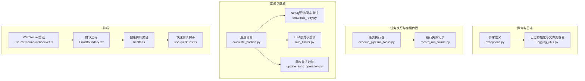
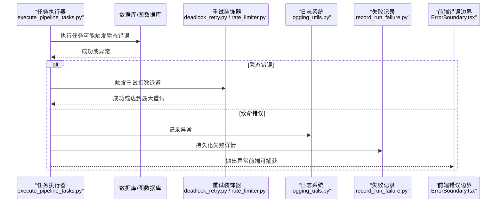
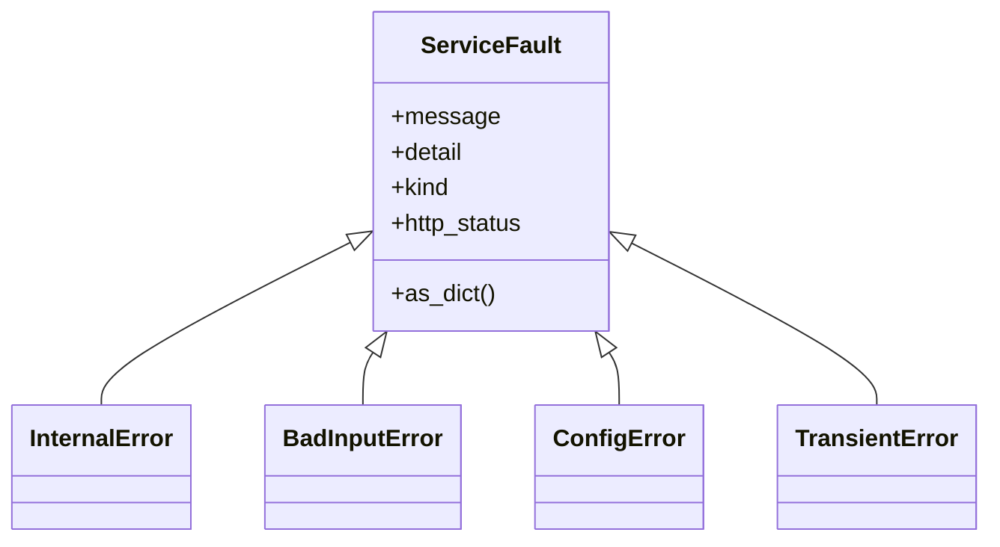
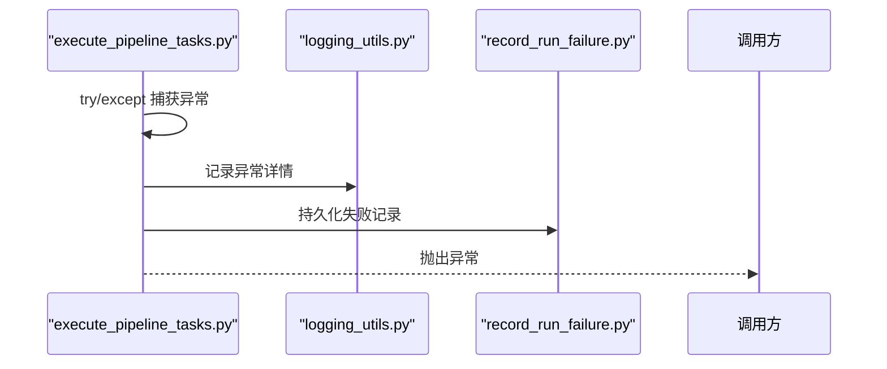
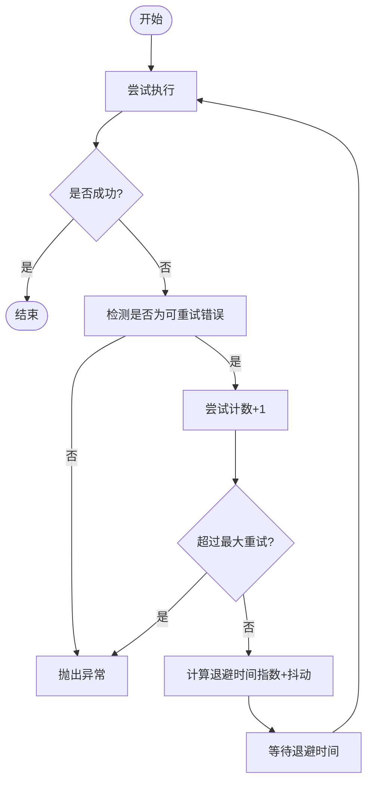
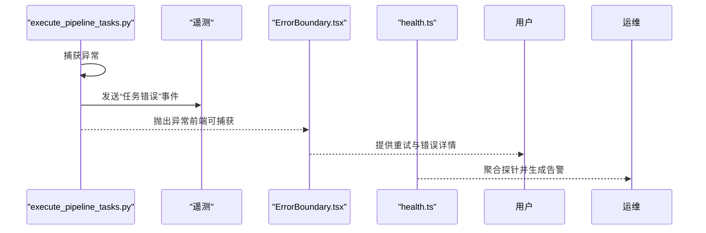
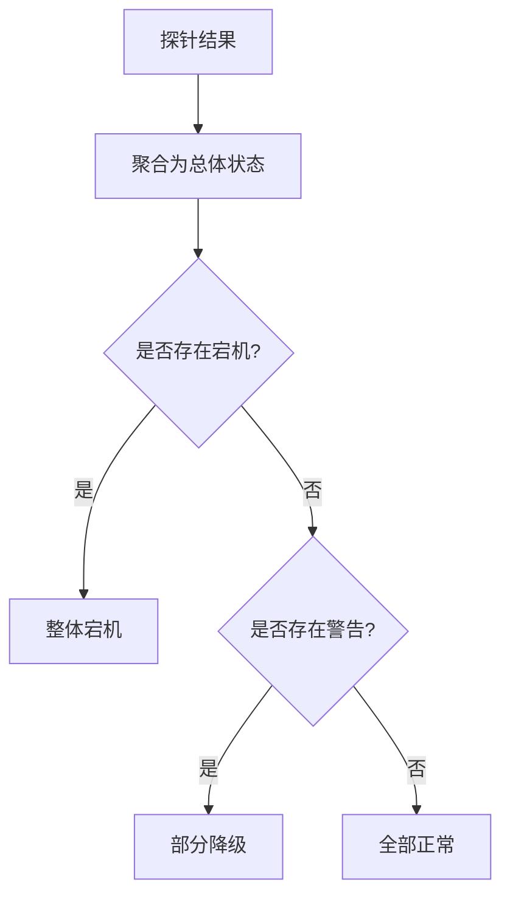
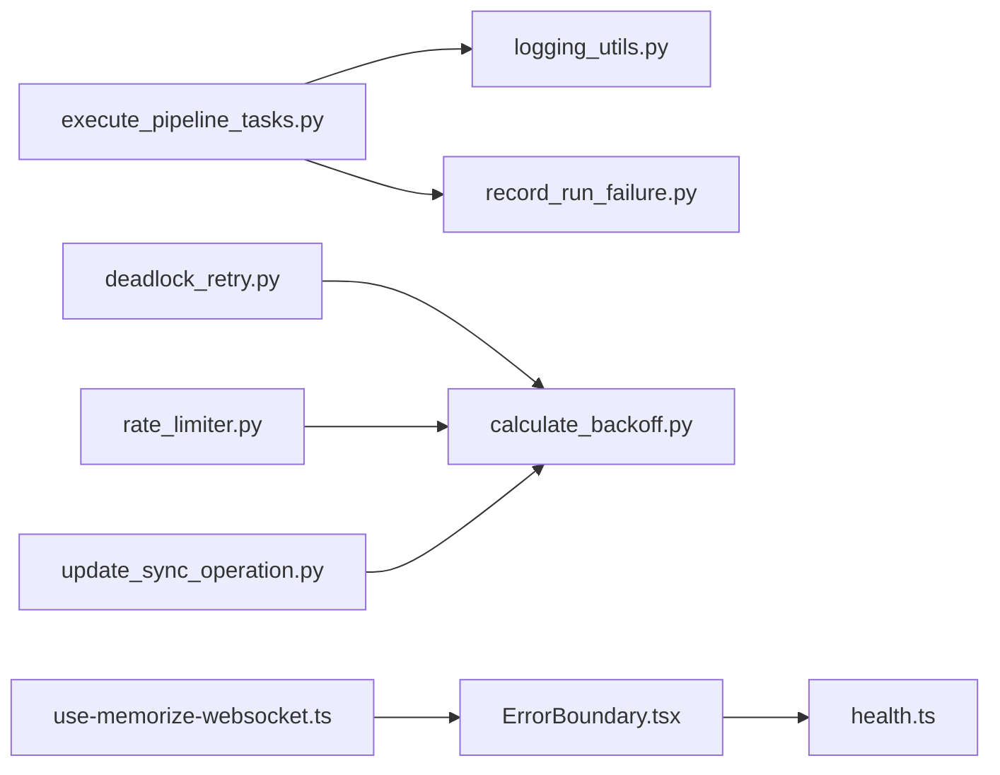

# 错误处理与恢复

<cite>
**本文引用的文件**
- [m_flow/exceptions/exceptions.py](file://m_flow/exceptions/exceptions.py)
- [m_flow/shared/infra_utils/calculate_backoff.py](file://m_flow/shared/infra_utils/calculate_backoff.py)
- [m_flow/shared/logging_utils.py](file://m_flow/shared/logging_utils.py)
- [m_flow/pipeline/operations/execute_pipeline_tasks.py](file://m_flow/pipeline/operations/execute_pipeline_tasks.py)
- [m_flow/pipeline/operations/record_run_failure.py](file://m_flow/pipeline/operations/record_run_failure.py)
- [m_flow/adapters/graph/neo4j_driver/deadlock_retry.py](file://m_flow/adapters/graph/neo4j_driver/deadlock_retry.py)
- [m_flow/shared/sync/methods/update_sync_operation.py](file://m_flow/shared/sync/methods/update_sync_operation.py)
- [m_flow/llm/backends/litellm_instructor/llm/rate_limiter.py](file://m_flow/llm/backends/litellm_instructor/llm/rate_limiter.py)
- [m_flow/tests/unit/infrastructure/test_rate_limiting_retry.py](file://m_flow/tests/unit/infrastructure/test_rate_limiting_retry.py)
- [m_flow/tests/unit/infrastructure/databases/graph/neo4j_deadlock_test.py](file://m_flow/tests/unit/infrastructure/databases/graph/neo4j_deadlock_test.py)
- [m_flow-frontend/src/hooks/use-quick-test.ts](file://m_flow-frontend/src/hooks/use-quick-test.ts)
- [m_flow-frontend/src/lib/utils/health.ts](file://m_flow-frontend/src/lib/utils/health.ts)
- [m_flow-frontend/src/components/common/ErrorBoundary.tsx](file://m_flow-frontend/src/components/common/ErrorBoundary.tsx)
- [m_flow-frontend/src/hooks/use-memorize-websocket.ts](file://m_flow-frontend/src/hooks/use-memorize-websocket.ts)
</cite>

## 目录
1. [简介](#简介)
2. [项目结构](#项目结构)
3. [核心组件](#核心组件)
4. [架构总览](#架构总览)
5. [详细组件分析](#详细组件分析)
6. [依赖分析](#依赖分析)
7. [性能考量](#性能考量)
8. [故障排查指南](#故障排查指南)
9. [结论](#结论)
10. [附录](#附录)

## 简介
本文件聚焦于任务执行中的错误处理与恢复机制，系统性阐述错误分类、捕获与报告、自动重试（含指数退避与最大重试次数）、错误传播与通知、监控与告警以及最佳实践与常见问题。内容基于仓库中实际实现进行归纳总结，并通过图示展示关键流程。

## 项目结构
围绕错误处理与恢复的关键模块分布如下：
- 异常体系与日志：统一异常基类、具体异常类型、日志初始化与文件落盘
- 任务执行与错误传播：管道任务执行器、失败记录持久化
- 自动重试与退避：通用退避计算、数据库与图数据库重试装饰器、LLM限流与重试
- 前端错误边界与健康探测：前端错误兜底、健康探针聚合与告警
- 单元测试：验证重试行为、最大重试阈值与错误检测

**图表来源**
- [m_flow/exceptions/exceptions.py:20-147](file://m_flow/exceptions/exceptions.py#L20-L147)
- [m_flow/shared/logging_utils.py:340-520](file://m_flow/shared/logging_utils.py#L340-L520)
- [m_flow/pipeline/operations/execute_pipeline_tasks.py:46-144](file://m_flow/pipeline/operations/execute_pipeline_tasks.py#L46-L144)
- [m_flow/pipeline/operations/record_run_failure.py:18-64](file://m_flow/pipeline/operations/record_run_failure.py#L18-L64)
- [m_flow/shared/infra_utils/calculate_backoff.py:19-34](file://m_flow/shared/infra_utils/calculate_backoff.py#L19-L34)
- [m_flow/adapters/graph/neo4j_driver/deadlock_retry.py:24-85](file://m_flow/adapters/graph/neo4j_driver/deadlock_retry.py#L24-L85)
- [m_flow/shared/sync/methods/update_sync_operation.py:48-92](file://m_flow/shared/sync/methods/update_sync_operation.py#L48-L92)
- [m_flow/llm/backends/litellm_instructor/llm/rate_limiter.py:182-245](file://m_flow/llm/backends/litellm_instructor/llm/rate_limiter.py#L182-L245)
- [m_flow-frontend/src/components/common/ErrorBoundary.tsx:241-343](file://m_flow-frontend/src/components/common/ErrorBoundary.tsx#L241-L343)
- [m_flow-frontend/src/lib/utils/health.ts:151-173](file://m_flow-frontend/src/lib/utils/health.ts#L151-L173)
- [m_flow-frontend/src/hooks/use-quick-test.ts:90-141](file://m_flow-frontend/src/hooks/use-quick-test.ts#L90-L141)
- [m_flow-frontend/src/hooks/use-memorize-websocket.ts:195-242](file://m_flow-frontend/src/hooks/use-memorize-websocket.ts#L195-L242)

**章节来源**
- [m_flow/exceptions/exceptions.py:20-147](file://m_flow/exceptions/exceptions.py#L20-L147)
- [m_flow/shared/logging_utils.py:340-520](file://m_flow/shared/logging_utils.py#L340-L520)

## 核心组件
- 统一异常体系
  - 根异常：承载错误描述、类型、HTTP状态码与自动日志记录能力
  - 具体异常：内部错误、输入错误、配置错误、临时性错误（可重试）
- 日志系统
  - 结构化日志初始化、文件处理器、异常增强、全局未处理异常钩子
- 任务执行与错误传播
  - 顺序执行任务、上下文注入、遥测事件发送、异常捕获并向上抛出
- 失败记录持久化
  - 将运行失败详情写入数据库，包含数据标识与错误文本
- 自动重试与退避
  - 指数退避带抖动、最大重试次数、针对不同场景（LLM限流、Neo4j瞬态错误、数据库瞬态错误）的装饰器
- 前端错误边界与健康探测
  - React 错误边界捕获与降级、健康探针聚合与告警、WebSocket 连接指数退避重连

**章节来源**
- [m_flow/exceptions/exceptions.py:20-147](file://m_flow/exceptions/exceptions.py#L20-L147)
- [m_flow/shared/logging_utils.py:340-520](file://m_flow/shared/logging_utils.py#L340-L520)
- [m_flow/pipeline/operations/execute_pipeline_tasks.py:46-144](file://m_flow/pipeline/operations/execute_pipeline_tasks.py#L46-L144)
- [m_flow/pipeline/operations/record_run_failure.py:18-64](file://m_flow/pipeline/operations/record_run_failure.py#L18-L64)
- [m_flow/shared/infra_utils/calculate_backoff.py:19-34](file://m_flow/shared/infra_utils/calculate_backoff.py#L19-L34)
- [m_flow/adapters/graph/neo4j_driver/deadlock_retry.py:24-85](file://m_flow/adapters/graph/neo4j_driver/deadlock_retry.py#L24-L85)
- [m_flow/shared/sync/methods/update_sync_operation.py:48-92](file://m_flow/shared/sync/methods/update_sync_operation.py#L48-L92)
- [m_flow/llm/backends/litellm_instructor/llm/rate_limiter.py:182-245](file://m_flow/llm/backends/litellm_instructor/llm/rate_limiter.py#L182-L245)
- [m_flow-frontend/src/components/common/ErrorBoundary.tsx:241-343](file://m_flow-frontend/src/components/common/ErrorBoundary.tsx#L241-L343)
- [m_flow-frontend/src/lib/utils/health.ts:151-173](file://m_flow-frontend/src/lib/utils/health.ts#L151-L173)

## 架构总览
下图展示了从任务执行到错误捕获、记录与重试的整体流程，以及前端错误边界与健康监控的联动。

**图表来源**
- [m_flow/pipeline/operations/execute_pipeline_tasks.py:114-126](file://m_flow/pipeline/operations/execute_pipeline_tasks.py#L114-L126)
- [m_flow/adapters/graph/neo4j_driver/deadlock_retry.py:40-81](file://m_flow/adapters/graph/neo4j_driver/deadlock_retry.py#L40-L81)
- [m_flow/llm/backends/litellm_instructor/llm/rate_limiter.py:182-245](file://m_flow/llm/backends/litellm_instructor/llm/rate_limiter.py#L182-L245)
- [m_flow/shared/logging_utils.py:340-520](file://m_flow/shared/logging_utils.py#L340-L520)
- [m_flow/pipeline/operations/record_run_failure.py:18-64](file://m_flow/pipeline/operations/record_run_failure.py#L18-L64)
- [m_flow-frontend/src/components/common/ErrorBoundary.tsx:241-343](file://m_flow-frontend/src/components/common/ErrorBoundary.tsx#L241-L343)

## 详细组件分析

### 异常分类与处理策略
- 可恢复错误（TransientError）
  - 特征：临时性故障，客户端可重试
  - 行为：返回特定HTTP状态码，配合重试装饰器自动重试
- 致命错误（InternalError/BadInputError/ConfigError）
  - 特征：非临时性错误，不应自动重试
  - 行为：记录日志并终止流程，必要时返回明确的错误响应

**图表来源**
- [m_flow/exceptions/exceptions.py:20-147](file://m_flow/exceptions/exceptions.py#L20-L147)

**章节来源**
- [m_flow/exceptions/exceptions.py:20-147](file://m_flow/exceptions/exceptions.py#L20-L147)

### 错误捕获与报告机制
- 任务执行器在任务失败时记录异常并发出遥测事件，随后向上抛出异常
- 日志系统负责结构化输出、文件落盘与异常增强，确保堆栈与异常类型可追踪
- 失败记录模块将运行失败详情持久化至数据库，包含数据标识与错误文本

**图表来源**
- [m_flow/pipeline/operations/execute_pipeline_tasks.py:114-126](file://m_flow/pipeline/operations/execute_pipeline_tasks.py#L114-L126)
- [m_flow/shared/logging_utils.py:340-520](file://m_flow/shared/logging_utils.py#L340-L520)
- [m_flow/pipeline/operations/record_run_failure.py:18-64](file://m_flow/pipeline/operations/record_run_failure.py#L18-L64)

**章节来源**
- [m_flow/pipeline/operations/execute_pipeline_tasks.py:114-126](file://m_flow/pipeline/operations/execute_pipeline_tasks.py#L114-L126)
- [m_flow/shared/logging_utils.py:340-520](file://m_flow/shared/logging_utils.py#L340-L520)
- [m_flow/pipeline/operations/record_run_failure.py:18-64](file://m_flow/pipeline/operations/record_run_failure.py#L18-L64)

### 自动重试机制（指数退避与最大重试次数）
- 通用退避计算
  - 指数增长 + 抖动，避免“惊群效应”
- Neo4j 死锁与瞬态错误重试
  - 基于装饰器对异步图操作进行透明重试
- 同步重试封装
  - 对数据库等同步操作进行重试，记录警告与延迟
- LLM 限流与重试
  - 基于模式识别判断是否为限流错误，自动指数退避重试

**图表来源**
- [m_flow/shared/infra_utils/calculate_backoff.py:19-34](file://m_flow/shared/infra_utils/calculate_backoff.py#L19-L34)
- [m_flow/adapters/graph/neo4j_driver/deadlock_retry.py:24-85](file://m_flow/adapters/graph/neo4j_driver/deadlock_retry.py#L24-L85)
- [m_flow/shared/sync/methods/update_sync_operation.py:48-92](file://m_flow/shared/sync/methods/update_sync_operation.py#L48-L92)
- [m_flow/llm/backends/litellm_instructor/llm/rate_limiter.py:182-245](file://m_flow/llm/backends/litellm_instructor/llm/rate_limiter.py#L182-L245)

**章节来源**
- [m_flow/shared/infra_utils/calculate_backoff.py:19-34](file://m_flow/shared/infra_utils/calculate_backoff.py#L19-L34)
- [m_flow/adapters/graph/neo4j_driver/deadlock_retry.py:24-85](file://m_flow/adapters/graph/neo4j_driver/deadlock_retry.py#L24-L85)
- [m_flow/shared/sync/methods/update_sync_operation.py:48-92](file://m_flow/shared/sync/methods/update_sync_operation.py#L48-L92)
- [m_flow/llm/backends/litellm_instructor/llm/rate_limiter.py:182-245](file://m_flow/llm/backends/litellm_instructor/llm/rate_limiter.py#L182-L245)

### 错误传播与通知
- 任务执行器在任务失败时发出“任务错误”遥测事件，便于上层系统感知
- 前端错误边界捕获子树错误，提供重试与复制错误信息的能力
- 健康探针聚合服务状态，当出现关键服务宕机或警告时触发告警

**图表来源**
- [m_flow/pipeline/operations/execute_pipeline_tasks.py:128-140](file://m_flow/pipeline/operations/execute_pipeline_tasks.py#L128-L140)
- [m_flow-frontend/src/components/common/ErrorBoundary.tsx:241-343](file://m_flow-frontend/src/components/common/ErrorBoundary.tsx#L241-L343)
- [m_flow-frontend/src/lib/utils/health.ts:151-173](file://m_flow-frontend/src/lib/utils/health.ts#L151-L173)

**章节来源**
- [m_flow/pipeline/operations/execute_pipeline_tasks.py:128-140](file://m_flow/pipeline/operations/execute_pipeline_tasks.py#L128-L140)
- [m_flow-frontend/src/components/common/ErrorBoundary.tsx:241-343](file://m_flow-frontend/src/components/common/ErrorBoundary.tsx#L241-L343)
- [m_flow-frontend/src/lib/utils/health.ts:151-173](file://m_flow-frontend/src/lib/utils/health.ts#L151-L173)

### 监控与告警（错误率统计与异常检测）
- 健康探针聚合
  - 按“正常/警告/宕机”三种状态统计，关键服务（关系型/向量/图/文件存储）任一宕机会整体标记为宕机
- WebSocket 连接指数退避重连
  - 前端在断开后按 2^N 秒上限进行重连，超过最大次数后上报错误
- 快速测试钩子
  - 将探针结果映射为测试状态，用于前端仪表盘展示

**图表来源**
- [m_flow-frontend/src/lib/utils/health.ts:151-173](file://m_flow-frontend/src/lib/utils/health.ts#L151-L173)
- [m_flow-frontend/src/hooks/use-memorize-websocket.ts:195-242](file://m_flow-frontend/src/hooks/use-memorize-websocket.ts#L195-L242)
- [m_flow-frontend/src/hooks/use-quick-test.ts:90-141](file://m_flow-frontend/src/hooks/use-quick-test.ts#L90-L141)

**章节来源**
- [m_flow-frontend/src/lib/utils/health.ts:151-173](file://m_flow-frontend/src/lib/utils/health.ts#L151-L173)
- [m_flow-frontend/src/hooks/use-memorize-websocket.ts:195-242](file://m_flow-frontend/src/hooks/use-memorize-websocket.ts#L195-L242)
- [m_flow-frontend/src/hooks/use-quick-test.ts:90-141](file://m_flow-frontend/src/hooks/use-quick-test.ts#L90-L141)

## 依赖分析
- 组件耦合
  - 任务执行器依赖日志系统与失败记录模块；失败记录模块依赖数据库适配器
  - 重试装饰器依赖通用退避计算；LLM重试依赖限流配置与模式匹配
  - 前端错误边界独立于后端，但与健康探针存在数据交互
- 外部依赖
  - Neo4j 驱动异常类型用于识别瞬态错误
  - 第三方限流库用于 LLM 请求节流与等待

**图表来源**
- [m_flow/pipeline/operations/execute_pipeline_tasks.py:46-144](file://m_flow/pipeline/operations/execute_pipeline_tasks.py#L46-L144)
- [m_flow/shared/logging_utils.py:340-520](file://m_flow/shared/logging_utils.py#L340-L520)
- [m_flow/pipeline/operations/record_run_failure.py:18-64](file://m_flow/pipeline/operations/record_run_failure.py#L18-L64)
- [m_flow/adapters/graph/neo4j_driver/deadlock_retry.py:24-85](file://m_flow/adapters/graph/neo4j_driver/deadlock_retry.py#L24-L85)
- [m_flow/shared/infra_utils/calculate_backoff.py:19-34](file://m_flow/shared/infra_utils/calculate_backoff.py#L19-L34)
- [m_flow/shared/sync/methods/update_sync_operation.py:48-92](file://m_flow/shared/sync/methods/update_sync_operation.py#L48-L92)
- [m_flow/llm/backends/litellm_instructor/llm/rate_limiter.py:182-245](file://m_flow/llm/backends/litellm_instructor/llm/rate_limiter.py#L182-L245)
- [m_flow-frontend/src/components/common/ErrorBoundary.tsx:241-343](file://m_flow-frontend/src/components/common/ErrorBoundary.tsx#L241-L343)
- [m_flow-frontend/src/lib/utils/health.ts:151-173](file://m_flow-frontend/src/lib/utils/health.ts#L151-L173)
- [m_flow-frontend/src/hooks/use-memorize-websocket.ts:195-242](file://m_flow-frontend/src/hooks/use-memorize-websocket.ts#L195-L242)

**章节来源**
- [m_flow/pipeline/operations/execute_pipeline_tasks.py:46-144](file://m_flow/pipeline/operations/execute_pipeline_tasks.py#L46-L144)
- [m_flow/adapters/graph/neo4j_driver/deadlock_retry.py:24-85](file://m_flow/adapters/graph/neo4j_driver/deadlock_retry.py#L24-L85)
- [m_flow/llm/backends/litellm_instructor/llm/rate_limiter.py:182-245](file://m_flow/llm/backends/litellm_instructor/llm/rate_limiter.py#L182-L245)

## 性能考量
- 指数退避与抖动
  - 降低并发重试导致的“惊群效应”，提升系统整体稳定性
- 最大重试次数
  - 防止无限重试造成资源耗尽，建议结合业务特性设置合理上限
- 日志与落盘
  - 结构化日志与文件轮转减少IO压力，同时保留足够诊断信息
- 前端重连策略
  - 指数退避上限控制连接频率，避免频繁重连

[本节为通用指导，无需列出具体文件来源]

## 故障排查指南
- 任务执行失败
  - 检查任务执行器日志与失败记录，确认异常类型与上下文
  - 若为可恢复错误，检查重试装饰器配置与退避参数
- Neo4j 瞬态错误
  - 确认装饰器是否正确包裹异步操作；查看重试日志与剩余重试次数
- LLM 限流
  - 检查限流配置与模式匹配；确认是否启用自动重试
- 前端错误
  - 使用错误边界提供的重试与复制功能；查看控制台与日志
- 健康探针
  - 关注关键服务状态变化，定位具体探针失败项

**章节来源**
- [m_flow/pipeline/operations/execute_pipeline_tasks.py:114-126](file://m_flow/pipeline/operations/execute_pipeline_tasks.py#L114-L126)
- [m_flow/adapters/graph/neo4j_driver/deadlock_retry.py:40-81](file://m_flow/adapters/graph/neo4j_driver/deadlock_retry.py#L40-L81)
- [m_flow/llm/backends/litellm_instructor/llm/rate_limiter.py:182-245](file://m_flow/llm/backends/litellm_instructor/llm/rate_limiter.py#L182-L245)
- [m_flow-frontend/src/components/common/ErrorBoundary.tsx:241-343](file://m_flow-frontend/src/components/common/ErrorBoundary.tsx#L241-L343)
- [m_flow-frontend/src/lib/utils/health.ts:151-173](file://m_flow-frontend/src/lib/utils/health.ts#L151-L173)

## 结论
本项目通过统一异常体系、完善的日志与失败记录、多场景自动重试（指数退避+抖动）、前端错误边界与健康监控，构建了健壮的任务执行与错误处理闭环。建议在生产环境中结合业务特性调整重试上限与退避参数，并持续关注健康探针与错误日志以实现快速定位与恢复。

[本节为总结性内容，无需列出具体文件来源]

## 附录
- 单元测试参考
  - LLM 限流与重试：验证重试次数、最小退避时间与错误模式识别
  - Neo4j 死锁重试：验证成功重试与用尽重试后的异常抛出
- 最佳实践
  - 明确区分可恢复与致命错误
  - 为关键路径配置合理的最大重试次数与退避上限
  - 在前端提供用户友好的错误兜底与重试入口
  - 利用健康探针与告警机制实现主动运维

**章节来源**
- [m_flow/tests/unit/infrastructure/test_rate_limiting_retry.py:136-192](file://m_flow/tests/unit/infrastructure/test_rate_limiting_retry.py#L136-L192)
- [m_flow/tests/unit/infrastructure/databases/graph/neo4j_deadlock_test.py:55-79](file://m_flow/tests/unit/infrastructure/databases/graph/neo4j_deadlock_test.py#L55-L79)