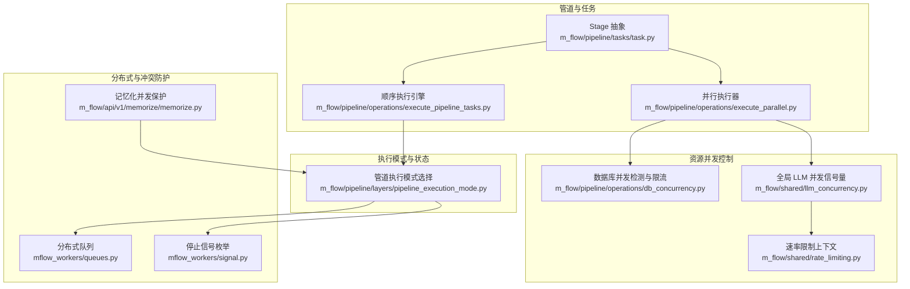
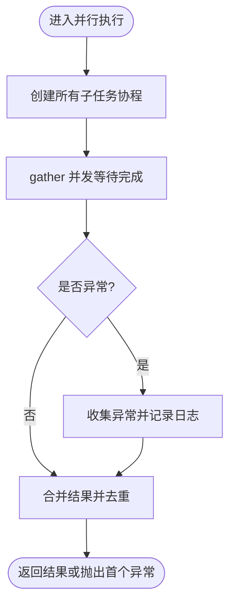
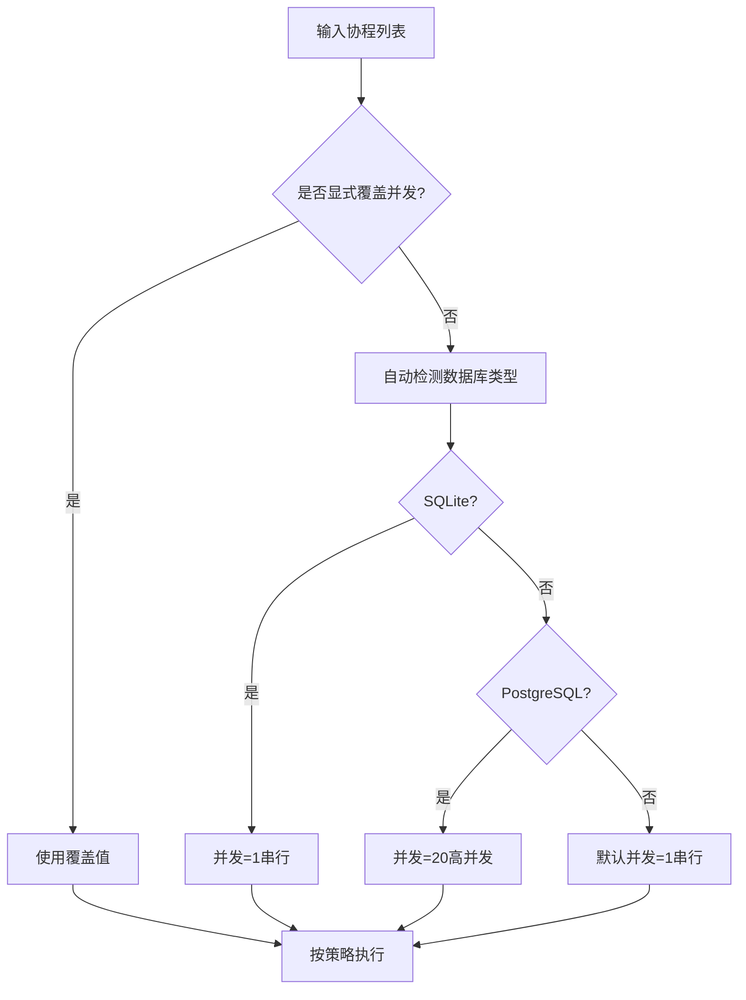
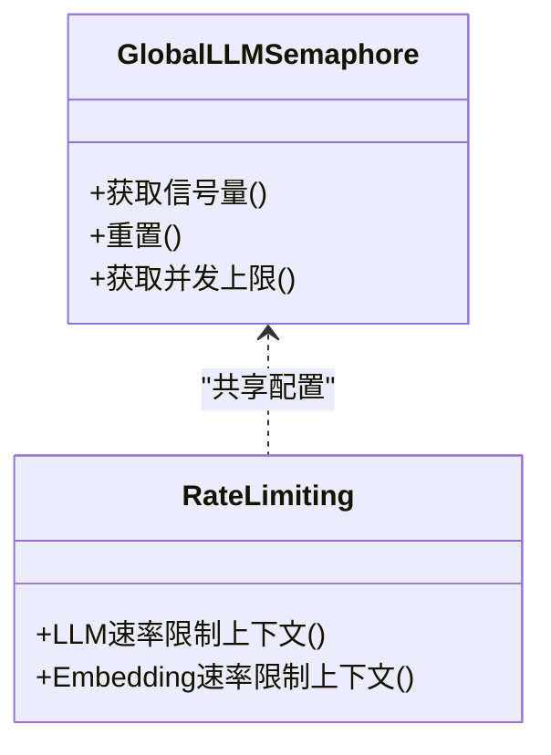
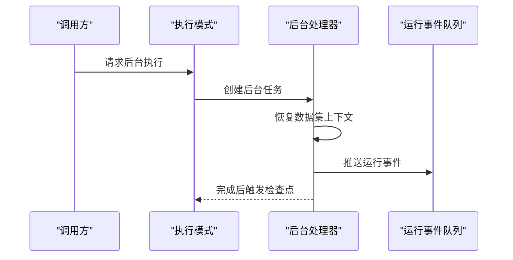
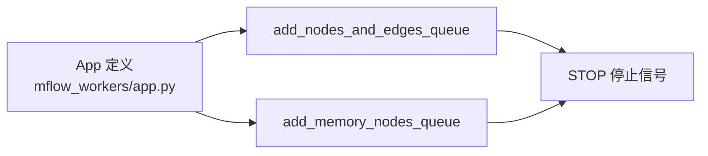
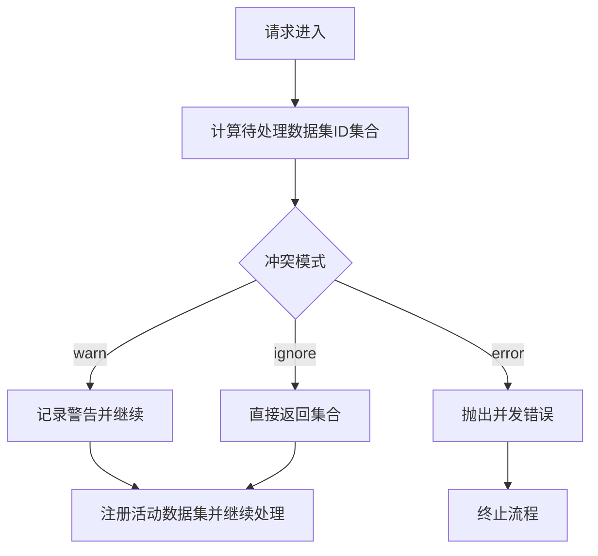
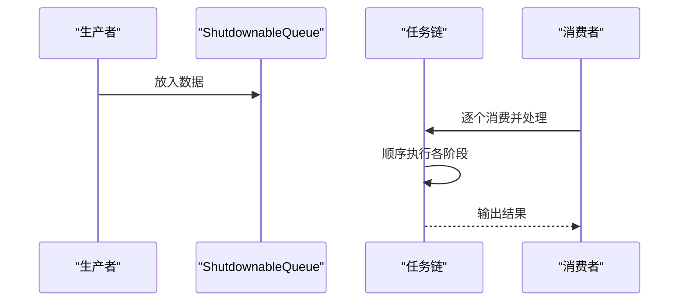
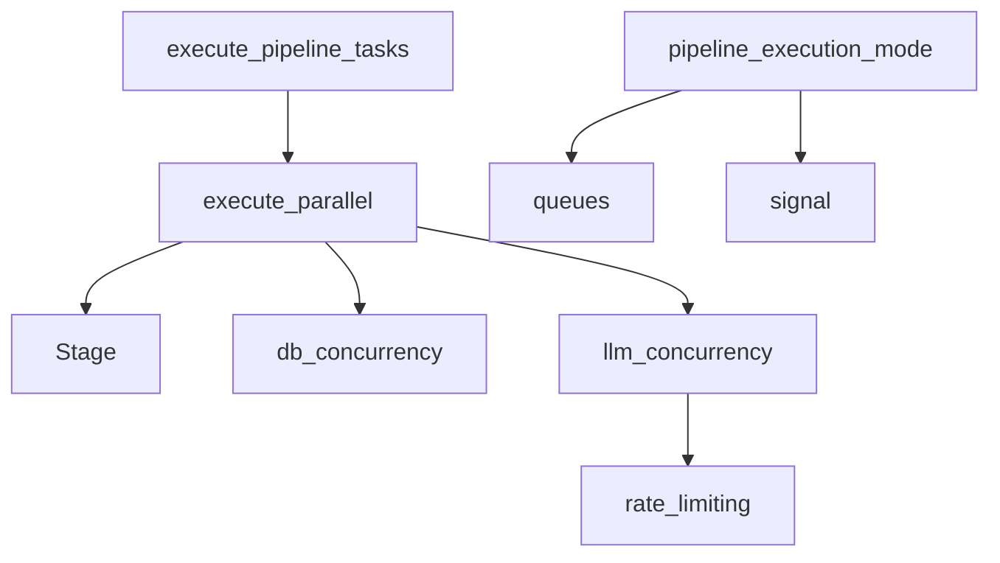

# 并行处理机制

<cite>
**本文引用的文件**
- [m_flow/pipeline/operations/execute_parallel.py](file://m_flow/pipeline/operations/execute_parallel.py)
- [m_flow/pipeline/operations/db_concurrency.py](file://m_flow/pipeline/operations/db_concurrency.py)
- [m_flow/shared/llm_concurrency.py](file://m_flow/shared/llm_concurrency.py)
- [m_flow/shared/rate_limiting.py](file://m_flow/shared/rate_limiting.py)
- [m_flow/pipeline/operations/execute_pipeline_tasks.py](file://m_flow/pipeline/operations/execute_pipeline_tasks.py)
- [m_flow/pipeline/tasks/task.py](file://m_flow/pipeline/tasks/task.py)
- [m_flow/pipeline/layers/pipeline_execution_mode.py](file://m_flow/pipeline/layers/pipeline_execution_mode.py)
- [m_flow/api/v1/memorize/memorize.py](file://m_flow/api/v1/memorize/memorize.py)
- [mflow_workers/queues.py](file://mflow_workers/queues.py)
- [mflow_workers/signal.py](file://mflow_workers/signal.py)
- [mflow_workers/app.py](file://mflow_workers/app.py)
- [m_flow/tests/unit/pipelines/test_run_parallel.py](file://m_flow/tests/unit/pipelines/test_run_parallel.py)
- [m_flow/tests/unit/modules/pipelines/run_task_from_queue_test.py](file://m_flow/tests/unit/modules/pipelines/run_task_from_queue_test.py)
- [m_flow/tests/unit/modules/pipelines/run_tasks_test.py](file://m_flow/tests/unit/modules/pipelines/run_tasks_test.py)
- [m_flow/tests/unit/auth/test_permission_concurrency.py](file://m_flow/tests/unit/auth/test_permission_concurrency.py)
- [m_flow/shared/sync/methods/update_sync_operation.py](file://m_flow/shared/sync/methods/update_sync_operation.py)
</cite>

## 目录
1. [简介](#简介)
2. [项目结构](#项目结构)
3. [核心组件](#核心组件)
4. [架构总览](#架构总览)
5. [详细组件分析](#详细组件分析)
6. [依赖分析](#依赖分析)
7. [性能考量](#性能考量)
8. [故障排查指南](#故障排查指南)
9. [结论](#结论)
10. [附录](#附录)

## 简介
本文件系统性阐述 m_flow 管道系统的并行处理机制，覆盖并发执行模型、任务调度、资源控制、并发安全、限制与约束、监控与调优以及最佳实践，并提供配置示例与性能测试方法。重点围绕以下方面展开：
- 并行任务执行与结果合并、去重策略
- 数据库并发感知的限流与串行化
- 全局 LLM 并发与速率限制
- 管道层的顺序与并行混合执行模式
- 分布式工作队列与停止信号
- 并发冲突防护与死锁规避
- 性能指标采集与瓶颈定位
- 配置参数与测试方法

## 项目结构
并行处理相关能力主要分布在如下模块：
- 管道任务抽象与执行：Stage 抽象、顺序执行引擎、并行执行器
- 资源并发控制：数据库并发检测与限流、全局 LLM 并发信号量、速率限制
- 管道执行模式：阻塞与后台执行、运行状态推送
- 分布式工作队列：Modal 队列与停止信号
- 并发冲突防护：记忆化接口的并发注册保护
- 测试与验证：并行执行单元测试、队列驱动流水线测试、权限并发测试



**图表来源**
- [m_flow/pipeline/tasks/task.py:1-152](file://m_flow/pipeline/tasks/task.py#L1-L152)
- [m_flow/pipeline/operations/execute_pipeline_tasks.py:1-144](file://m_flow/pipeline/operations/execute_pipeline_tasks.py#L1-L144)
- [m_flow/pipeline/operations/execute_parallel.py:1-162](file://m_flow/pipeline/operations/execute_parallel.py#L1-L162)
- [m_flow/pipeline/operations/db_concurrency.py:1-200](file://m_flow/pipeline/operations/db_concurrency.py#L1-L200)
- [m_flow/shared/llm_concurrency.py:1-46](file://m_flow/shared/llm_concurrency.py#L1-L46)
- [m_flow/shared/rate_limiting.py:1-59](file://m_flow/shared/rate_limiting.py#L1-L59)
- [m_flow/pipeline/layers/pipeline_execution_mode.py:1-172](file://m_flow/pipeline/layers/pipeline_execution_mode.py#L1-L172)
- [mflow_workers/queues.py:1-16](file://mflow_workers/queues.py#L1-L16)
- [mflow_workers/signal.py:1-25](file://mflow_workers/signal.py#L1-L25)
- [m_flow/api/v1/memorize/memorize.py:36-80](file://m_flow/api/v1/memorize/memorize.py#L36-L80)

**章节来源**
- [m_flow/pipeline/tasks/task.py:1-152](file://m_flow/pipeline/tasks/task.py#L1-L152)
- [m_flow/pipeline/operations/execute_pipeline_tasks.py:1-144](file://m_flow/pipeline/operations/execute_pipeline_tasks.py#L1-L144)
- [m_flow/pipeline/operations/execute_parallel.py:1-162](file://m_flow/pipeline/operations/execute_parallel.py#L1-L162)
- [m_flow/pipeline/operations/db_concurrency.py:1-200](file://m_flow/pipeline/operations/db_concurrency.py#L1-L200)
- [m_flow/shared/llm_concurrency.py:1-46](file://m_flow/shared/llm_concurrency.py#L1-L46)
- [m_flow/shared/rate_limiting.py:1-59](file://m_flow/shared/rate_limiting.py#L1-L59)
- [m_flow/pipeline/layers/pipeline_execution_mode.py:1-172](file://m_flow/pipeline/layers/pipeline_execution_mode.py#L1-L172)
- [mflow_workers/queues.py:1-16](file://mflow_workers/queues.py#L1-L16)
- [mflow_workers/signal.py:1-25](file://mflow_workers/signal.py#L1-L25)
- [m_flow/api/v1/memorize/memorize.py:36-80](file://m_flow/api/v1/memorize/memorize.py#L36-L80)

## 核心组件
- 并行执行器：在单机内并发调度多个 Stage 任务，聚合结果并进行可选去重；失败时收集异常并在返回有效结果后抛出首个异常。
- 数据库并发感知：根据数据库类型自动设置并发上限（如 SQLite 强制串行，PostgreSQL 默认高并发），支持环境变量覆盖。
- 全局 LLM 并发：统一的全局信号量控制 LLM 调用并发度，避免嵌套信号量导致的死锁风险。
- 速率限制：基于配置的 LLM/Embedding 速率限制上下文，按需启用节流。
- 管道执行模式：支持阻塞执行与后台执行，后台模式下推送运行事件到队列并进行图数据库检查点。
- 分布式队列：通过 Modal 队列承载跨节点消息，配合停止信号实现可靠关闭。
- 并发冲突防护：记忆化接口对活动数据集集合进行互斥登记，支持忽略/告警/报错三种冲突处理模式。

**章节来源**
- [m_flow/pipeline/operations/execute_parallel.py:39-162](file://m_flow/pipeline/operations/execute_parallel.py#L39-L162)
- [m_flow/pipeline/operations/db_concurrency.py:48-199](file://m_flow/pipeline/operations/db_concurrency.py#L48-L199)
- [m_flow/shared/llm_concurrency.py:15-46](file://m_flow/shared/llm_concurrency.py#L15-L46)
- [m_flow/shared/rate_limiting.py:43-59](file://m_flow/shared/rate_limiting.py#L43-L59)
- [m_flow/pipeline/layers/pipeline_execution_mode.py:36-172](file://m_flow/pipeline/layers/pipeline_execution_mode.py#L36-L172)
- [mflow_workers/queues.py:6-16](file://mflow_workers/queues.py#L6-L16)
- [mflow_workers/signal.py:13-25](file://mflow_workers/signal.py#L13-L25)
- [m_flow/api/v1/memorize/memorize.py:53-80](file://m_flow/api/v1/memorize/memorize.py#L53-L80)

## 架构总览
下图展示从 API 到后台执行、并行任务与资源控制的整体交互：

```mermaid
sequenceDiagram
participant API as "API 层"
participant Mode as "执行模式选择"
participant Runner as "顺序执行引擎"
participant Par as "并行执行器"
participant DB as "数据库并发控制"
participant LLM as "全局 LLM 并发"
participant RL as "速率限制"
participant Q as "分布式队列"
API->>Mode : 选择阻塞或后台执行
Mode->>Runner : 启动顺序执行
Runner->>Par : 触发并行任务
Par->>DB : 获取并发上限
Par->>LLM : 获取全局信号量
Par->>RL : 按需启用速率限制
Par-->>Runner : 返回合并/去重后的结果
Mode->>Q : 推送运行事件后台
Q-->>Mode : 可靠投递与死信支持
```

**图表来源**
- [m_flow/pipeline/layers/pipeline_execution_mode.py:68-154](file://m_flow/pipeline/layers/pipeline_execution_mode.py#L68-L154)
- [m_flow/pipeline/operations/execute_pipeline_tasks.py:46-126](file://m_flow/pipeline/operations/execute_pipeline_tasks.py#L46-L126)
- [m_flow/pipeline/operations/execute_parallel.py:70-158](file://m_flow/pipeline/operations/execute_parallel.py#L70-L158)
- [m_flow/pipeline/operations/db_concurrency.py:122-176](file://m_flow/pipeline/operations/db_concurrency.py#L122-L176)
- [m_flow/shared/llm_concurrency.py:15-29](file://m_flow/shared/llm_concurrency.py#L15-L29)
- [m_flow/shared/rate_limiting.py:51-59](file://m_flow/shared/rate_limiting.py#L51-L59)
- [mflow_workers/queues.py:6-16](file://mflow_workers/queues.py#L6-L16)

## 详细组件分析

### 并行执行器（execute_parallel）
- 功能要点
  - 将多个 Stage 任务并发调度，统一传参 data 与 context
  - 使用 gather(return_exceptions=True) 确保所有任务完成，收集异常与有效结果
  - 支持结果合并与去重（基于 MemoryNode.id 或字典的 id 字段）
  - 更新进度步骤名，便于后台模式下的状态追踪
- 错误处理
  - 记录每个子任务的失败信息，最终抛出首个异常
  - 成功结果仍可返回，保证部分成功场景的可用性
- 去重策略
  - 对列表结果逐项检查 id，重复项跳过
  - 统计去重数量，便于性能分析与调试



**图表来源**
- [m_flow/pipeline/operations/execute_parallel.py:70-158](file://m_flow/pipeline/operations/execute_parallel.py#L70-L158)

**章节来源**
- [m_flow/pipeline/operations/execute_parallel.py:39-162](file://m_flow/pipeline/operations/execute_parallel.py#L39-L162)
- [m_flow/tests/unit/pipelines/test_run_parallel.py:30-275](file://m_flow/tests/unit/pipelines/test_run_parallel.py#L30-L275)

### 数据库并发感知（db_concurrency）
- 自动检测
  - 基于关系型数据库配置检测数据库类型
  - SQLite 强制串行（并发=1）以避免“database is locked”
  - PostgreSQL 默认高并发（例如 20）
- 环境变量覆盖
  - MFLOW_PIPELINE_CONCURRENCY 可显式指定并发上限
  - 0 或未设置：自动检测
  - 1：强制串行
  - N>1：允许 N 并发（谨慎用于 SQLite）
- 执行策略
  - limit==1：串行 await
  - limit>=len(coros)：全并行 gather
  - 否则：信号量限流并发 gather



**图表来源**
- [m_flow/pipeline/operations/db_concurrency.py:48-176](file://m_flow/pipeline/operations/db_concurrency.py#L48-L176)

**章节来源**
- [m_flow/pipeline/operations/db_concurrency.py:1-200](file://m_flow/pipeline/operations/db_concurrency.py#L1-L200)

### 全局 LLM 并发与速率限制（llm_concurrency、rate_limiting）
- 全局 LLM 并发
  - 单例信号量，受环境变量 MFLOW_LLM_CONCURRENCY_LIMIT 控制，默认 20
  - 避免嵌套信号量导致的死锁，统一竞争 LLM 资源
- 速率限制
  - 基于 LLM 配置决定是否启用 LLM/Embedding 速率限制
  - 提供上下文管理器，按需启用节流



**图表来源**
- [m_flow/shared/llm_concurrency.py:15-46](file://m_flow/shared/llm_concurrency.py#L15-L46)
- [m_flow/shared/rate_limiting.py:43-59](file://m_flow/shared/rate_limiting.py#L43-L59)

**章节来源**
- [m_flow/shared/llm_concurrency.py:1-46](file://m_flow/shared/llm_concurrency.py#L1-L46)
- [m_flow/shared/rate_limiting.py:1-59](file://m_flow/shared/rate_limiting.py#L1-L59)

### 管道执行模式与后台推进（pipeline_execution_mode）
- 阻塞执行：等待管道完全完成，收集每轮运行信息
- 后台执行：立即返回初始状态，后台持续推送运行事件至队列
  - 恢复正确的数据集上下文（ContextVar）
  - 完成后触发图数据库检查点，降低崩溃丢失风险



**图表来源**
- [m_flow/pipeline/layers/pipeline_execution_mode.py:68-154](file://m_flow/pipeline/layers/pipeline_execution_mode.py#L68-L154)

**章节来源**
- [m_flow/pipeline/layers/pipeline_execution_mode.py:1-172](file://m_flow/pipeline/layers/pipeline_execution_mode.py#L1-L172)

### 分布式队列与停止信号（mflow_workers）
- 队列定义：通过 Modal 队列承载工作项，支持自动重试与死信队列
- 停止信号：使用枚举值作为队列中的控制令牌，兼容字符串比较



**图表来源**
- [mflow_workers/app.py:6-15](file://mflow_workers/app.py#L6-L15)
- [mflow_workers/queues.py:6-16](file://mflow_workers/queues.py#L6-L16)
- [mflow_workers/signal.py:13-25](file://mflow_workers/signal.py#L13-L25)

**章节来源**
- [mflow_workers/queues.py:1-16](file://mflow_workers/queues.py#L1-L16)
- [mflow_workers/signal.py:1-25](file://mflow_workers/signal.py#L1-L25)
- [mflow_workers/app.py:1-15](file://mflow_workers/app.py#L1-L15)

### 并发冲突防护（记忆化接口）
- 活动数据集集合：进程内集合 + 异步锁
- 冲突模式：ignore/warn/error
- 在冲突检测到时，依据模式采取不同行为，避免资源竞争与重复处理



**图表来源**
- [m_flow/api/v1/memorize/memorize.py:53-80](file://m_flow/api/v1/memorize/memorize.py#L53-L80)

**章节来源**
- [m_flow/api/v1/memorize/memorize.py:36-80](file://m_flow/api/v1/memorize/memorize.py#L36-L80)

### 队列驱动的管道链（测试用例）
- 通过自定义可关闭队列，构建“生产者-消费者”流水线
- 验证顺序与批处理行为，确保并发场景下的正确性



**图表来源**
- [m_flow/tests/unit/modules/pipelines/run_task_from_queue_test.py:23-67](file://m_flow/tests/unit/modules/pipelines/run_task_from_queue_test.py#L23-L67)

**章节来源**
- [m_flow/tests/unit/modules/pipelines/run_task_from_queue_test.py:1-75](file://m_flow/tests/unit/modules/pipelines/run_task_from_queue_test.py#L1-L75)
- [m_flow/tests/unit/modules/pipelines/run_tasks_test.py:1-64](file://m_flow/tests/unit/modules/pipelines/run_tasks_test.py#L1-L64)

## 依赖分析
- 组件耦合
  - execute_parallel 依赖 Stage 抽象与进度更新模块
  - db_concurrency 依赖关系型数据库配置
  - llm_concurrency 与 rate_limiting 依赖 LLM 配置
  - pipeline_execution_mode 依赖队列与上下文恢复
  - 分布式队列与停止信号独立于核心业务逻辑
- 并发控制链路
  - 并行执行器 → 数据库并发控制 → 顺序执行器
  - 并行执行器 → 全局 LLM 并发 → 速率限制
- 潜在循环依赖
  - 进度更新模块在并行执行器内部惰性导入，避免循环



**图表来源**
- [m_flow/pipeline/operations/execute_parallel.py:27-36](file://m_flow/pipeline/operations/execute_parallel.py#L27-L36)
- [m_flow/pipeline/operations/db_concurrency.py:42-45](file://m_flow/pipeline/operations/db_concurrency.py#L42-L45)
- [m_flow/shared/llm_concurrency.py:25-29](file://m_flow/shared/llm_concurrency.py#L25-L29)
- [m_flow/pipeline/operations/execute_pipeline_tasks.py:35-41](file://m_flow/pipeline/operations/execute_pipeline_tasks.py#L35-L41)
- [m_flow/pipeline/layers/pipeline_execution_mode.py:25-25](file://m_flow/pipeline/layers/pipeline_execution_mode.py#L25-L25)

**章节来源**
- [m_flow/pipeline/operations/execute_parallel.py:1-162](file://m_flow/pipeline/operations/execute_parallel.py#L1-L162)
- [m_flow/pipeline/operations/db_concurrency.py:1-200](file://m_flow/pipeline/operations/db_concurrency.py#L1-L200)
- [m_flow/shared/llm_concurrency.py:1-46](file://m_flow/shared/llm_concurrency.py#L1-L46)
- [m_flow/shared/rate_limiting.py:1-59](file://m_flow/shared/rate_limiting.py#L1-L59)
- [m_flow/pipeline/operations/execute_pipeline_tasks.py:1-144](file://m_flow/pipeline/operations/execute_pipeline_tasks.py#L1-L144)
- [m_flow/pipeline/layers/pipeline_execution_mode.py:1-172](file://m_flow/pipeline/layers/pipeline_execution_mode.py#L1-L172)

## 性能考量
- 并发上限
  - SQLite 强制串行，避免锁争用；PostgreSQL 默认高并发
  - 通过环境变量覆盖，按部署场景调整
- 结果合并与去重
  - 大量并行任务返回列表时，去重会带来额外开销
  - 建议在上游任务中尽量减少重复项，或关闭去重以提升吞吐
- LLM 并发
  - 全局信号量统一控制，避免嵌套导致的死锁
  - 速率限制按需开启，防止外部服务限流
- 批处理与背压
  - 顺序执行器支持批大小配置，结合并行执行器可实现分层并发
- 后台执行与检查点
  - 后台模式下持续推送运行事件，完成后触发图数据库检查点，保障持久化

[本节为通用指导，不直接分析具体文件]

## 故障排查指南
- 数据库锁定（SQLite）
  - 症状：出现“database is locked”错误
  - 处理：确认并发=1；必要时升级到 PostgreSQL
  - 参考：数据库并发检测与限流
- LLM 调用超限
  - 症状：外部服务限流或延迟飙升
  - 处理：降低全局 LLM 并发上限；启用速率限制
  - 参考：全局 LLM 并发与速率限制
- 并发冲突（记忆化）
  - 症状：多请求同时处理同一数据集
  - 处理：配置冲突模式（warn/error）；或在应用层做幂等
  - 参考：记忆化并发保护
- 权限创建并发
  - 症状：数据库锁争用
  - 处理：指数退避重试；小间隔交错提交
  - 参考：权限并发测试
- 重试与退避
  - 症状：瞬态错误导致失败
  - 处理：使用带退避的重试包装
  - 参考：同步操作重试

**章节来源**
- [m_flow/pipeline/operations/db_concurrency.py:101-118](file://m_flow/pipeline/operations/db_concurrency.py#L101-L118)
- [m_flow/shared/llm_concurrency.py:25-29](file://m_flow/shared/llm_concurrency.py#L25-L29)
- [m_flow/shared/rate_limiting.py:51-59](file://m_flow/shared/rate_limiting.py#L51-L59)
- [m_flow/api/v1/memorize/memorize.py:75-80](file://m_flow/api/v1/memorize/memorize.py#L75-L80)
- [m_flow/tests/unit/auth/test_permission_concurrency.py:113-143](file://m_flow/tests/unit/auth/test_permission_concurrency.py#L113-L143)
- [m_flow/shared/sync/methods/update_sync_operation.py:48-92](file://m_flow/shared/sync/methods/update_sync_operation.py#L48-L92)

## 结论
m_flow 的并行处理机制通过“任务抽象 + 顺序执行引擎 + 并行执行器”的组合，在保证一致性的同时最大化吞吐。数据库并发感知与全局 LLM 并发控制提供了稳健的资源边界，而后台执行与队列推送则满足了可观测性与可靠性需求。通过合理的配置与测试，可在不同硬件与软件环境下获得稳定的并发性能。

[本节为总结，不直接分析具体文件]

## 附录

### 并行任务调度与队列管理
- 任务队列
  - 使用 Stage 抽象统一任务接口，支持同步/异步/生成器
  - 顺序执行器支持批大小配置，结合并行执行器实现分层并发
- 并行调度
  - 并行执行器并发启动子任务，统一收集结果与异常
  - 可选去重策略，减少重复数据带来的后续压力

**章节来源**
- [m_flow/pipeline/tasks/task.py:16-152](file://m_flow/pipeline/tasks/task.py#L16-L152)
- [m_flow/pipeline/operations/execute_pipeline_tasks.py:46-126](file://m_flow/pipeline/operations/execute_pipeline_tasks.py#L46-L126)
- [m_flow/pipeline/operations/execute_parallel.py:70-158](file://m_flow/pipeline/operations/execute_parallel.py#L70-L158)

### 负载均衡与资源分配策略
- 数据库负载
  - SQLite：串行写入
  - PostgreSQL：高并发写入
- LLM 负载
  - 全局信号量统一控制
  - 速率限制按需启用
- 资源分配
  - 通过环境变量覆盖并发上限
  - 顺序执行器与并行执行器协同，避免热点资源争用

**章节来源**
- [m_flow/pipeline/operations/db_concurrency.py:77-119](file://m_flow/pipeline/operations/db_concurrency.py#L77-L119)
- [m_flow/shared/llm_concurrency.py:15-46](file://m_flow/shared/llm_concurrency.py#L15-L46)
- [m_flow/shared/rate_limiting.py:43-59](file://m_flow/shared/rate_limiting.py#L43-L59)

### 并发控制机制（避免资源竞争与死锁）
- 异步锁保护：记忆化接口对活动数据集集合进行互斥登记
- 全局信号量：避免嵌套信号量导致的死锁
- 退避重试：数据库瞬态错误采用指数退避
- 顺序化串行：在 SQLite 上强制串行写入

**章节来源**
- [m_flow/api/v1/memorize/memorize.py:75-80](file://m_flow/api/v1/memorize/memorize.py#L75-L80)
- [m_flow/shared/llm_concurrency.py:25-29](file://m_flow/shared/llm_concurrency.py#L25-L29)
- [m_flow/shared/sync/methods/update_sync_operation.py:69-92](file://m_flow/shared/sync/methods/update_sync_operation.py#L69-L92)
- [m_flow/pipeline/operations/db_concurrency.py:155-161](file://m_flow/pipeline/operations/db_concurrency.py#L155-L161)

### 并行处理的限制与约束
- 硬件资源限制
  - SQLite 文件级锁限制并发写入
  - LLM 供应商速率限制与并发配额
- 软件许可限制
  - LLM 服务的并发调用配额
  - 外部服务的速率限制策略
- 配置约束
  - 环境变量覆盖仅影响当前进程缓存，需重启生效

**章节来源**
- [m_flow/pipeline/operations/db_concurrency.py:101-118](file://m_flow/pipeline/operations/db_concurrency.py#L101-L118)
- [m_flow/shared/llm_concurrency.py:27-28](file://m_flow/shared/llm_concurrency.py#L27-L28)

### 监控与调优（性能指标与瓶颈识别）
- 遥测事件
  - 顺序执行器在任务开始/结束/错误时发送遥测事件
  - 后台执行模式持续推送运行事件
- 指标建议
  - 并行任务成功率、去重数量、平均耗时
  - 数据库并发命中率、LLM 并发占用率
- 瓶颈定位
  - 顺序执行器批大小过大可能造成内存峰值
  - 并行执行器过多可能导致 LLM/数据库饱和

**章节来源**
- [m_flow/pipeline/operations/execute_pipeline_tasks.py:128-140](file://m_flow/pipeline/operations/execute_pipeline_tasks.py#L128-L140)
- [m_flow/pipeline/layers/pipeline_execution_mode.py:131-138](file://m_flow/pipeline/layers/pipeline_execution_mode.py#L131-L138)

### 最佳实践
- 任务分解
  - 将长耗时任务拆分为多个短任务，便于并行与去重
  - 上游任务尽量消除重复项，减少下游去重成本
- 资源使用优化
  - SQLite 场景严格串行写入；PostgreSQL 可适度提高并发
  - LLM 并发与速率限制按外部服务 SLA 调整
- 幂等与重试
  - 记忆化与权限创建等关键路径采用幂等设计与退避重试
- 配置与测试
  - 使用环境变量快速切换并发策略
  - 通过单元测试验证并行执行、去重与异常传播

**章节来源**
- [m_flow/tests/unit/pipelines/test_run_parallel.py:30-275](file://m_flow/tests/unit/pipelines/test_run_parallel.py#L30-L275)
- [m_flow/tests/unit/auth/test_permission_concurrency.py:113-143](file://m_flow/tests/unit/auth/test_permission_concurrency.py#L113-L143)

### 配置示例与性能测试方法
- 数据库并发配置
  - 环境变量：MFLOW_PIPELINE_CONCURRENCY
  - 作用：覆盖自动检测的并发上限
- LLM 并发配置
  - 环境变量：MFLOW_LLM_CONCURRENCY_LIMIT
  - 作用：全局 LLM 调用并发上限
- 速率限制配置
  - 通过 LLM 配置启用/禁用 LLM/Embedding 速率限制
- 性能测试
  - 并行执行单元测试：验证基本并行、结果合并、去重、异常传播
  - 队列驱动流水线测试：验证顺序与批处理行为
  - 权限并发测试：验证数据库锁争用场景下的退避与幂等

**章节来源**
- [m_flow/pipeline/operations/db_concurrency.py:8-15](file://m_flow/pipeline/operations/db_concurrency.py#L8-L15)
- [m_flow/shared/llm_concurrency.py:19-28](file://m_flow/shared/llm_concurrency.py#L19-L28)
- [m_flow/shared/rate_limiting.py:21-31](file://m_flow/shared/rate_limiting.py#L21-L31)
- [m_flow/tests/unit/pipelines/test_run_parallel.py:1-293](file://m_flow/tests/unit/pipelines/test_run_parallel.py#L1-L293)
- [m_flow/tests/unit/modules/pipelines/run_task_from_queue_test.py:1-75](file://m_flow/tests/unit/modules/pipelines/run_task_from_queue_test.py#L1-L75)
- [m_flow/tests/unit/modules/pipelines/run_tasks_test.py:1-64](file://m_flow/tests/unit/modules/pipelines/run_tasks_test.py#L1-L64)
- [m_flow/tests/unit/auth/test_permission_concurrency.py:113-143](file://m_flow/tests/unit/auth/test_permission_concurrency.py#L113-L143)