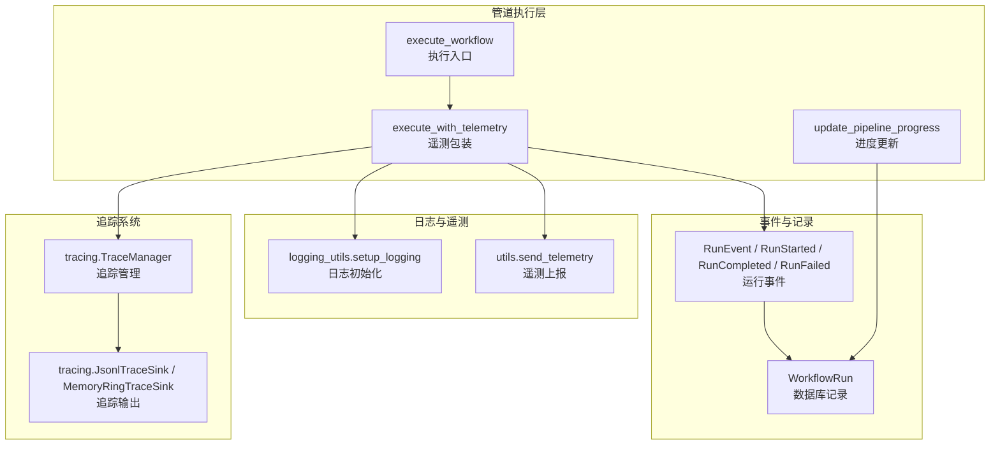
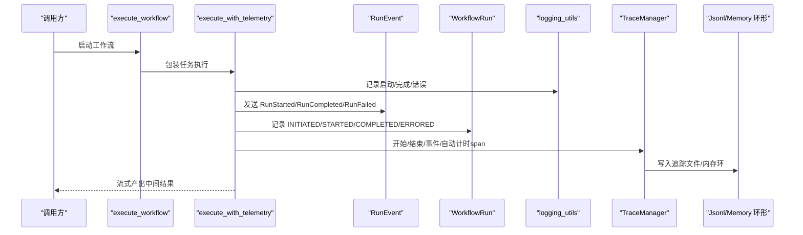
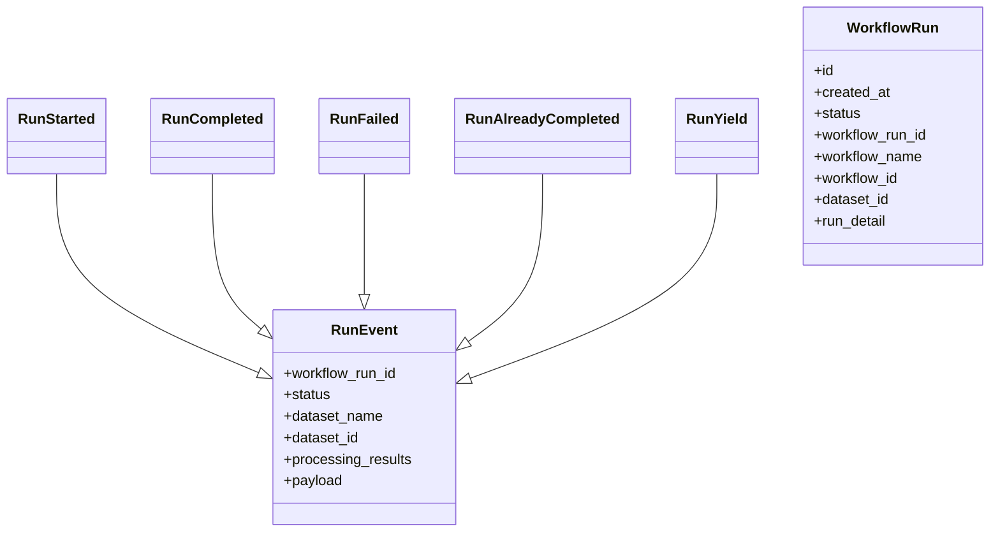
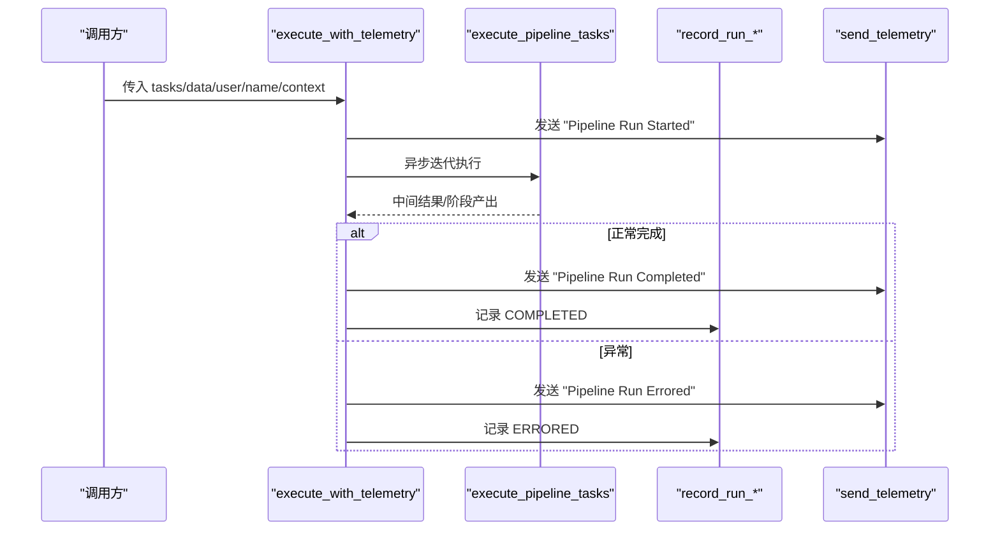
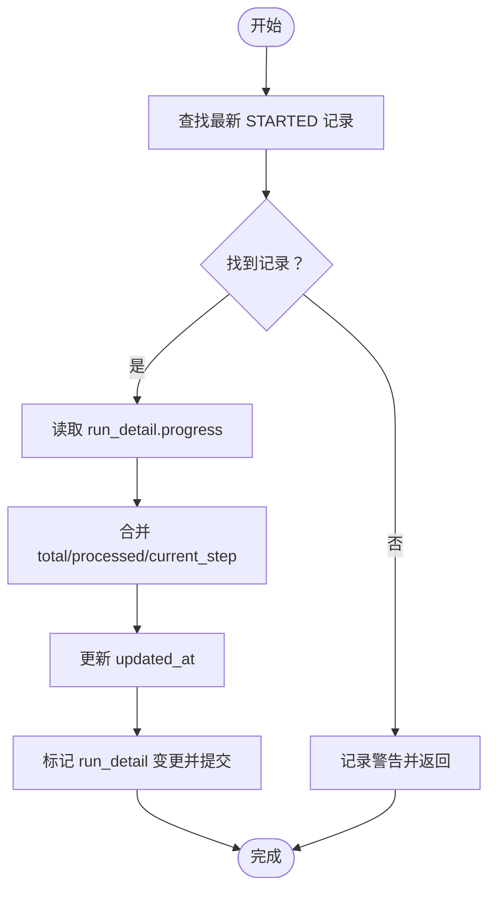
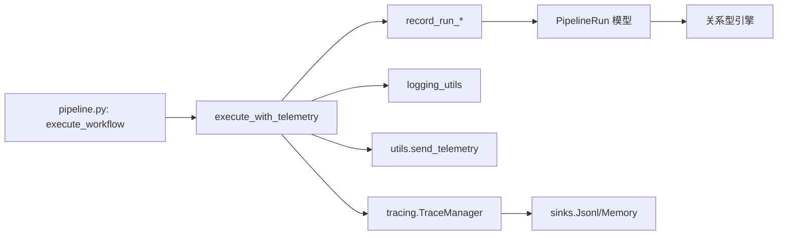

# 管道监控与调试

<cite>
**本文引用的文件**
- [m_flow/pipeline/models/RunEvent.py](file://m_flow/pipeline/models/RunEvent.py)
- [m_flow/pipeline/models/PipelineRun.py](file://m_flow/pipeline/models/PipelineRun.py)
- [m_flow/pipeline/operations/execute_with_telemetry.py](file://m_flow/pipeline/operations/execute_with_telemetry.py)
- [m_flow/pipeline/operations/update_pipeline_progress.py](file://m_flow/pipeline/operations/update_pipeline_progress.py)
- [m_flow/pipeline/operations/record_run_initiated.py](file://m_flow/pipeline/operations/record_run_initiated.py)
- [m_flow/pipeline/operations/record_run_start.py](file://m_flow/pipeline/operations/record_run_start.py)
- [m_flow/pipeline/operations/record_run_finish.py](file://m_flow/pipeline/operations/record_run_finish.py)
- [m_flow/pipeline/operations/record_run_failure.py](file://m_flow/pipeline/operations/record_run_failure.py)
- [m_flow/pipeline/operations/pipeline.py](file://m_flow/pipeline/operations/pipeline.py)
- [m_flow/shared/logging_utils.py](file://m_flow/shared/logging_utils.py)
- [m_flow/shared/utils.py](file://m_flow/shared/utils.py)
- [m_flow/shared/tracing/__init__.py](file://m_flow/shared/tracing/__init__.py)
- [m_flow/shared/tracing/manager.py](file://m_flow/shared/tracing/manager.py)
- [m_flow/shared/tracing/sinks.py](file://m_flow/shared/tracing/sinks.py)
</cite>

## 目录
1. [简介](#简介)
2. [项目结构](#项目结构)
3. [核心组件](#核心组件)
4. [架构总览](#架构总览)
5. [详细组件分析](#详细组件分析)
6. [依赖分析](#依赖分析)
7. [性能考量](#性能考量)
8. [故障排查指南](#故障排查指南)
9. [结论](#结论)
10. [附录](#附录)

## 简介
本文件系统性阐述 m_flow 管道的监控与调试体系，覆盖以下主题：
- 监控架构：事件模型、运行记录、遥测与日志、链路追踪
- 运行时指标与事件采集：任务完成度统计、执行时间、资源使用概览
- 执行历史记录：通过 RunEvent 与 WorkflowRun 记录与查询
- 调试工具与诊断：日志分析、链路追踪、异常捕获与可视化
- 可视化与报告：日志文件、追踪文件、内存环形缓冲
- 配置最佳实践：关键指标选择、告警阈值、数据保留策略
- 实战案例与排障流程：从启动到完成/失败的全链路复盘

## 项目结构
围绕“管道执行监控与调试”的关键模块分布如下：
- 事件与运行记录：RunEvent（运行事件）、WorkflowRun（数据库记录）
- 执行与遥测：execute_with_telemetry（启动/完成/错误事件）、update_pipeline_progress（进度更新）
- 数据库记录：record_run_initiated / record_run_start / record_run_finish / record_run_failure
- 日志系统：shared/logging_utils（集中式日志初始化、文件轮转、异常钩子）
- 遥测工具：shared/utils（匿名标识、遥测发送）
- 链路追踪：shared/tracing（TraceManager、TraceSpan、Jsonl/Memory 环形缓冲）

**图示来源**
- [m_flow/pipeline/operations/pipeline.py:46-139](file://m_flow/pipeline/operations/pipeline.py#L46-L139)
- [m_flow/pipeline/operations/execute_with_telemetry.py:24-90](file://m_flow/pipeline/operations/execute_with_telemetry.py#L24-L90)
- [m_flow/pipeline/models/RunEvent.py:31-86](file://m_flow/pipeline/models/RunEvent.py#L31-L86)
- [m_flow/pipeline/models/PipelineRun.py:36-52](file://m_flow/pipeline/models/PipelineRun.py#L36-L52)
- [m_flow/pipeline/operations/update_pipeline_progress.py:27-159](file://m_flow/pipeline/operations/update_pipeline_progress.py#L27-L159)
- [m_flow/shared/logging_utils.py:340-520](file://m_flow/shared/logging_utils.py#L340-L520)
- [m_flow/shared/utils.py:66-103](file://m_flow/shared/utils.py#L66-L103)
- [m_flow/shared/tracing/manager.py:107-280](file://m_flow/shared/tracing/manager.py#L107-L280)
- [m_flow/shared/tracing/sinks.py:34-110](file://m_flow/shared/tracing/sinks.py#L34-L110)

**章节来源**
- [m_flow/pipeline/operations/pipeline.py:46-139](file://m_flow/pipeline/operations/pipeline.py#L46-L139)
- [m_flow/shared/logging_utils.py:340-520](file://m_flow/shared/logging_utils.py#L340-L520)
- [m_flow/shared/tracing/__init__.py:1-51](file://m_flow/shared/tracing/__init__.py#L1-L51)

## 核心组件
- 运行事件模型 RunEvent：统一描述管道生命周期事件（开始、中间结果、完成、失败、已缓存），支持序列化与扩展字段
- 数据库记录 WorkflowRun：持久化工作流运行状态、运行详情（含进度）、时间戳与索引
- 遥测 execute_with_telemetry：在启动、完成、错误节点发送遥测事件，携带工作流名、版本、租户等上下文
- 进度更新 update_pipeline_progress：在 STARTED 记录中以 JSON 字段维护 total_items、processed_items、current_step、时间戳
- 日志系统 logging_utils：集中式结构化日志、文件轮转、异常钩子、第三方噪声过滤
- 链路追踪 tracing：TraceManager 提供 start/end/event/span，Jsonl 文件与内存环形缓冲双通道输出
- 遥测工具 utils：匿名安装标识、敏感信息脱敏、遥测上报

**章节来源**
- [m_flow/pipeline/models/RunEvent.py:31-86](file://m_flow/pipeline/models/RunEvent.py#L31-L86)
- [m_flow/pipeline/models/PipelineRun.py:36-52](file://m_flow/pipeline/models/PipelineRun.py#L36-L52)
- [m_flow/pipeline/operations/execute_with_telemetry.py:24-90](file://m_flow/pipeline/operations/execute_with_telemetry.py#L24-L90)
- [m_flow/pipeline/operations/update_pipeline_progress.py:27-159](file://m_flow/pipeline/operations/update_pipeline_progress.py#L27-L159)
- [m_flow/shared/logging_utils.py:340-520](file://m_flow/shared/logging_utils.py#L340-L520)
- [m_flow/shared/tracing/manager.py:107-280](file://m_flow/shared/tracing/manager.py#L107-L280)
- [m_flow/shared/utils.py:66-103](file://m_flow/shared/utils.py#L66-L103)

## 架构总览
下图展示一次管道执行的监控与调试路径：从执行入口到事件记录、遥测、日志与追踪。

**图示来源**
- [m_flow/pipeline/operations/pipeline.py:46-139](file://m_flow/pipeline/operations/pipeline.py#L46-L139)
- [m_flow/pipeline/operations/execute_with_telemetry.py:24-90](file://m_flow/pipeline/operations/execute_with_telemetry.py#L24-L90)
- [m_flow/pipeline/models/RunEvent.py:31-86](file://m_flow/pipeline/models/RunEvent.py#L31-L86)
- [m_flow/pipeline/models/PipelineRun.py:36-52](file://m_flow/pipeline/models/PipelineRun.py#L36-L52)
- [m_flow/shared/logging_utils.py:340-520](file://m_flow/shared/logging_utils.py#L340-L520)
- [m_flow/shared/tracing/manager.py:107-280](file://m_flow/shared/tracing/manager.py#L107-L280)
- [m_flow/shared/tracing/sinks.py:34-110](file://m_flow/shared/tracing/sinks.py#L34-L110)

## 详细组件分析

### 组件一：运行事件与数据库记录
- RunEvent 家族：RunStarted、RunCompleted、RunFailed、RunAlreadyCompleted、RunYield，统一 status 与 payload 结构，支持 Data 序列化
- WorkflowRun：记录状态、运行 ID、名称、数据集 ID、运行详情 JSON（含进度、输入摘要、错误信息）

**图示来源**
- [m_flow/pipeline/models/RunEvent.py:31-86](file://m_flow/pipeline/models/RunEvent.py#L31-L86)
- [m_flow/pipeline/models/PipelineRun.py:36-52](file://m_flow/pipeline/models/PipelineRun.py#L36-L52)

**章节来源**
- [m_flow/pipeline/models/RunEvent.py:31-86](file://m_flow/pipeline/models/RunEvent.py#L31-L86)
- [m_flow/pipeline/models/PipelineRun.py:36-52](file://m_flow/pipeline/models/PipelineRun.py#L36-L52)

### 组件二：执行与遥测包装
- execute_with_telemetry：在任务执行前后发送“启动/完成/错误”遥测事件；构建属性包含工作流名、版本、租户、配置等
- record_run_*：分别记录 INITIATED/STARTED/COMPLETED/ERRORED，run_detail 中包含数据摘要或错误信息

**图示来源**
- [m_flow/pipeline/operations/execute_with_telemetry.py:24-90](file://m_flow/pipeline/operations/execute_with_telemetry.py#L24-L90)
- [m_flow/pipeline/operations/record_run_initiated.py:14-37](file://m_flow/pipeline/operations/record_run_initiated.py#L14-L37)
- [m_flow/pipeline/operations/record_run_start.py:18-67](file://m_flow/pipeline/operations/record_run_start.py#L18-L67)
- [m_flow/pipeline/operations/record_run_finish.py:18-68](file://m_flow/pipeline/operations/record_run_finish.py#L18-L68)
- [m_flow/pipeline/operations/record_run_failure.py:18-64](file://m_flow/pipeline/operations/record_run_failure.py#L18-L64)

**章节来源**
- [m_flow/pipeline/operations/execute_with_telemetry.py:24-90](file://m_flow/pipeline/operations/execute_with_telemetry.py#L24-L90)
- [m_flow/pipeline/operations/record_run_initiated.py:14-37](file://m_flow/pipeline/operations/record_run_initiated.py#L14-L37)
- [m_flow/pipeline/operations/record_run_start.py:18-67](file://m_flow/pipeline/operations/record_run_start.py#L18-L67)
- [m_flow/pipeline/operations/record_run_finish.py:18-68](file://m_flow/pipeline/operations/record_run_finish.py#L18-L68)
- [m_flow/pipeline/operations/record_run_failure.py:18-64](file://m_flow/pipeline/operations/record_run_failure.py#L18-L64)

### 组件三：进度跟踪与资源使用概览
- update_pipeline_progress：在 STARTED 记录的 run_detail.progress 中写入 total_items、processed_items、current_step、updated_at；支持 determinism 场景下的最新记录更新
- set_pipeline_started：初始化进度字段（total_items、processed_items、current_step、started_at、updated_at）
- 资源使用：当前实现未直接采集 CPU/内存等指标，建议结合外部 APM 或容器级监控补充

**图示来源**
- [m_flow/pipeline/operations/update_pipeline_progress.py:27-159](file://m_flow/pipeline/operations/update_pipeline_progress.py#L27-L159)

**章节来源**
- [m_flow/pipeline/operations/update_pipeline_progress.py:27-159](file://m_flow/pipeline/operations/update_pipeline_progress.py#L27-L159)

### 组件四：日志系统与遥测
- logging_utils.setup_logging：结构化日志、控制台彩色输出、文件轮转、异常钩子、第三方噪声抑制
- utils.send_telemetry：匿名安装标识、敏感键脱敏、POST 上报（可按环境禁用）
- 建议：结合日志级别与文件大小/数量策略，确保生产可用

**章节来源**
- [m_flow/shared/logging_utils.py:340-520](file://m_flow/shared/logging_utils.py#L340-L520)
- [m_flow/shared/utils.py:66-103](file://m_flow/shared/utils.py#L66-L103)

### 组件五：链路追踪与可视化
- TraceManager：start/end/event/span，采样率与目录配置，内存环形缓冲用于离线调试
- JsonlTraceSink：按日期分目录写入 JSONL 文件，避免并发写锁
- MemoryRingTraceSink：环形缓冲，便于测试/小规模场景调试
- 建议：在关键阶段使用 TraceManager.span 自动计时，结合 trace.start/trace.end 与关键 event 记录进行端到端复盘

**章节来源**
- [m_flow/shared/tracing/manager.py:107-280](file://m_flow/shared/tracing/manager.py#L107-L280)
- [m_flow/shared/tracing/sinks.py:34-110](file://m_flow/shared/tracing/sinks.py#L34-L110)
- [m_flow/shared/tracing/__init__.py:1-51](file://m_flow/shared/tracing/__init__.py#L1-L51)

## 依赖分析
- 执行入口 execute_workflow 依赖权限授权、后端准备、数据项加载与任务执行
- 遥测包装 execute_with_telemetry 依赖用户、设置、日志与遥测工具
- 进度更新 update_pipeline_progress 依赖关系型适配器与 WorkflowRun 模型
- 追踪系统独立于业务逻辑，通过环境变量控制启用与采样

**图示来源**
- [m_flow/pipeline/operations/pipeline.py:46-139](file://m_flow/pipeline/operations/pipeline.py#L46-L139)
- [m_flow/pipeline/operations/execute_with_telemetry.py:24-90](file://m_flow/pipeline/operations/execute_with_telemetry.py#L24-L90)
- [m_flow/pipeline/models/PipelineRun.py:36-52](file://m_flow/pipeline/models/PipelineRun.py#L36-L52)
- [m_flow/shared/tracing/sinks.py:34-110](file://m_flow/shared/tracing/sinks.py#L34-L110)

**章节来源**
- [m_flow/pipeline/operations/pipeline.py:46-139](file://m_flow/pipeline/operations/pipeline.py#L46-L139)
- [m_flow/pipeline/operations/execute_with_telemetry.py:24-90](file://m_flow/pipeline/operations/execute_with_telemetry.py#L24-L90)
- [m_flow/pipeline/models/PipelineRun.py:36-52](file://m_flow/pipeline/models/PipelineRun.py#L36-L52)
- [m_flow/shared/tracing/sinks.py:34-110](file://m_flow/shared/tracing/sinks.py#L34-L110)

## 性能考量
- 进度更新为“尽力而为”：失败仅记录警告，不阻塞主流程，适合高吞吐场景
- 遥测上报为 fire-and-forget：默认禁用测试/开发环境，避免对性能造成额外负担
- 日志轮转与文件清理：限制保留数量，降低磁盘压力
- 追踪采样：通过环境变量控制采样率，避免高负载时产生过多 IO
- 建议：结合外部 APM（如 Prometheus/Grafana）采集 CPU/内存/网络指标，完善性能画像

[本节为通用指导，无需列出具体文件来源]

## 故障排查指南
- 快速定位
  - 查看日志文件：确认启动/完成/错误日志与异常堆栈
  - 查询 WorkflowRun：根据 workflow_run_id/status/run_detail 排查状态与错误信息
  - 追踪文件：按日期目录检索对应 trace_id 的 JSONL 文件
- 常见问题
  - 进度未更新：检查是否处于 STARTED 记录且 run_detail.progress 是否存在；确认 determinism 场景下 ORDER BY created_at DESC LIMIT 1 生效
  - 遥测未上报：检查 TELEMETRY_DISABLED/ENV=test|dev；确认端点与网络连通
  - 追踪未落盘：检查 MFLOW_TRACE_ENABLED 与 MFLOW_TRACE_DIR；内存环仅用于调试
- 复盘步骤
  - 从 execute_with_telemetry 的“启动/完成/错误”事件入手
  - 对照 WorkflowRun 的 INITIATED/STARTED/COMPLETED/ERRORED 记录
  - 使用 TraceManager.span 标注关键阶段，结合 trace.start/trace.end 与 event 记录
  - 分析日志文件中的异常钩子与 traceback 输出

**章节来源**
- [m_flow/pipeline/operations/update_pipeline_progress.py:97-99](file://m_flow/pipeline/operations/update_pipeline_progress.py#L97-L99)
- [m_flow/shared/utils.py:74-78](file://m_flow/shared/utils.py#L74-L78)
- [m_flow/shared/logging_utils.py:407-418](file://m_flow/shared/logging_utils.py#L407-L418)
- [m_flow/shared/tracing/manager.py:144-190](file://m_flow/shared/tracing/manager.py#L144-L190)

## 结论
m_flow 的管道监控与调试体系以“事件 + 记录 + 遥测 + 日志 + 追踪”为核心，既保证了运行时可观测性，又兼顾了生产环境的性能与稳定性。通过 RunEvent 与 WorkflowRun 的组合，可完整回溯执行历史；通过 execute_with_telemetry 与 update_pipeline_progress，可实现进度与状态的实时掌控；借助 logging_utils 与 tracing，可快速定位问题并进行可视化复盘。建议在生产环境中结合外部 APM 与告警策略，形成闭环监控。

[本节为总结性内容，无需列出具体文件来源]

## 附录

### 关键指标与告警阈值建议
- 指标
  - 管道成功率、失败率、平均耗时、P95/P99 耗时
  - 单步处理耗时（结合 TraceManager.span）
  - 缓存命中率（RunAlreadyCompleted 比例）
  - 数据量与批大小（total_items/processed_items）
- 告警
  - 失败率超过阈值（如 5%）
  - 平均耗时超过阈值（如 30s）
  - 进度长时间无更新（超时检测）

[本节为通用指导，无需列出具体文件来源]

### 监控数据保留策略
- 日志文件：按天轮转，保留 N 份（可通过环境变量调整）
- 追踪文件：按日期目录存放，建议定期归档/清理
- 数据库记录：WorkflowRun 建议按生命周期策略清理旧记录

**章节来源**
- [m_flow/shared/logging_utils.py:290-316](file://m_flow/shared/logging_utils.py#L290-L316)
- [m_flow/shared/tracing/sinks.py:42-65](file://m_flow/shared/tracing/sinks.py#L42-L65)

### 实战案例与排障流程
- 案例一：缓存命中导致快速完成
  - 触发点：check_cache_status 返回已缓存状态
  - 行为：若启用缓存则直接返回 RunAlreadyCompleted；否则仍会发出 RunStarted
  - 排查：核对缓存开关与命中条件
- 案例二：部分批次失败
  - 触发点：record_run_failure 记录 ERRORED
  - 行为：run_detail 中包含 error 与 data 摘要
  - 排查：查看日志异常钩子与追踪文件，定位具体批次与阶段
- 案例三：进度停滞
  - 触发点：update_pipeline_progress 未更新或未找到 STARTED 记录
  - 行为：检查 determinism 与 run_id 生成逻辑
  - 排查：确认 ORDER BY created_at DESC LIMIT 1 生效

**章节来源**
- [m_flow/pipeline/operations/pipeline.py:113-124](file://m_flow/pipeline/operations/pipeline.py#L113-L124)
- [m_flow/pipeline/operations/record_run_failure.py:18-64](file://m_flow/pipeline/operations/record_run_failure.py#L18-L64)
- [m_flow/pipeline/operations/update_pipeline_progress.py:54-68](file://m_flow/pipeline/operations/update_pipeline_progress.py#L54-L68)