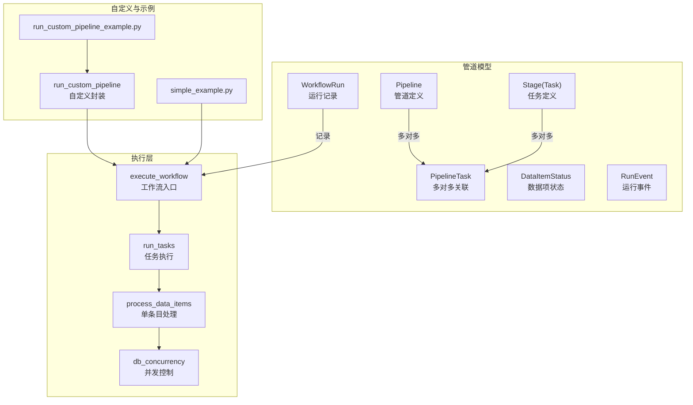
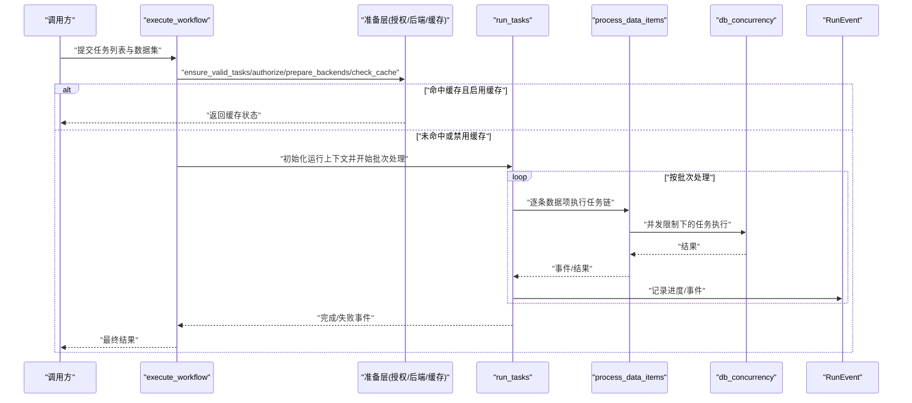
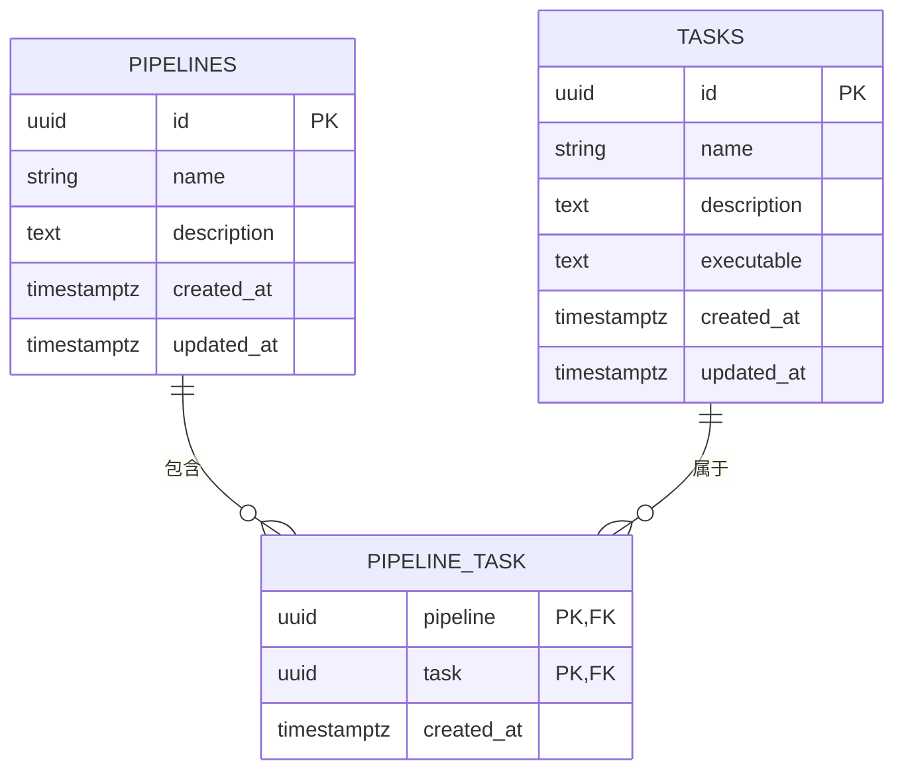
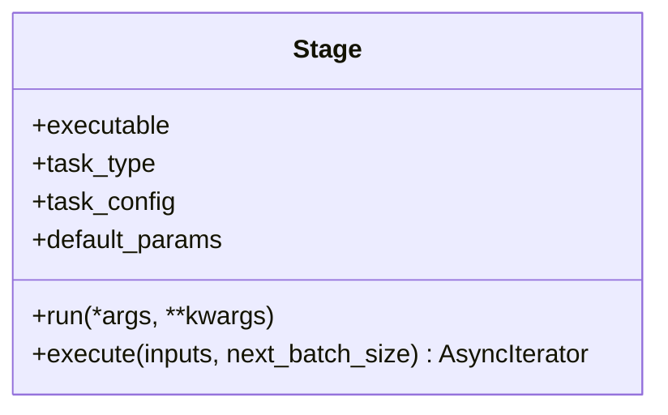
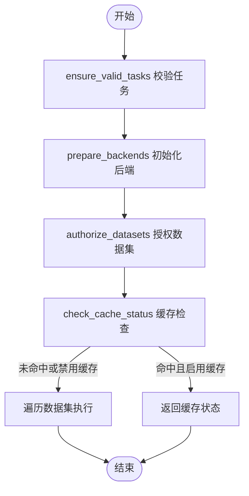
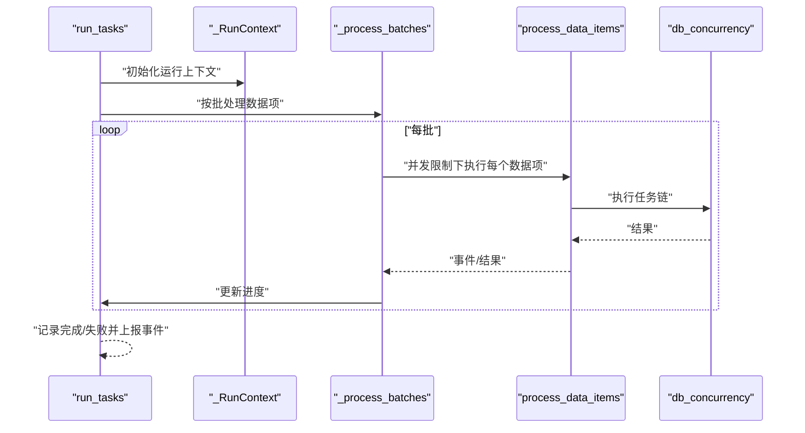
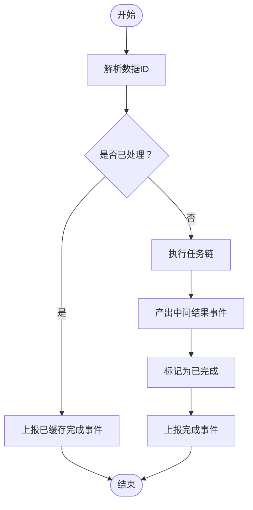
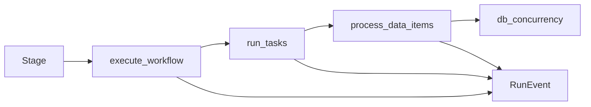

# 管道系统设计

<cite>
**本文引用的文件**
- [m_flow/pipeline/models/Pipeline.py](file://m_flow/pipeline/models/Pipeline.py)
- [m_flow/pipeline/models/Task.py](file://m_flow/pipeline/models/Task.py)
- [m_flow/pipeline/models/PipelineTask.py](file://m_flow/pipeline/models/PipelineTask.py)
- [m_flow/pipeline/models/PipelineRun.py](file://m_flow/pipeline/models/PipelineRun.py)
- [m_flow/pipeline/models/DataItemStatus.py](file://m_flow/pipeline/models/DataItemStatus.py)
- [m_flow/pipeline/models/RunEvent.py](file://m_flow/pipeline/models/RunEvent.py)
- [m_flow/pipeline/tasks/task.py](file://m_flow/pipeline/tasks/task.py)
- [m_flow/pipeline/operations/pipeline.py](file://m_flow/pipeline/operations/pipeline.py)
- [m_flow/pipeline/operations/run_tasks.py](file://m_flow/pipeline/operations/run_tasks.py)
- [m_flow/pipeline/operations/process_data_items.py](file://m_flow/pipeline/operations/process_data_items.py)
- [m_flow/pipeline/custom/run_custom_pipeline.py](file://m_flow/pipeline/custom/run_custom_pipeline.py)
- [m_flow/pipeline/operations/db_concurrency.py](file://m_flow/pipeline/operations/db_concurrency.py)
- [m_flow/pipeline/layers/ensure_valid_tasks.py](file://m_flow/pipeline/layers/ensure_valid_tasks.py)
- [examples/python/run_custom_pipeline_example.py](file://examples/python/run_custom_pipeline_example.py)
- [examples/python/simple_example.py](file://examples/python/simple_example.py)
</cite>

## 目录
1. [简介](#简介)
2. [项目结构](#项目结构)
3. [核心组件](#核心组件)
4. [架构总览](#架构总览)
5. [详细组件分析](#详细组件分析)
6. [依赖分析](#依赖分析)
7. [性能考量](#性能考量)
8. [故障排查指南](#故障排查指南)
9. [结论](#结论)
10. [附录](#附录)

## 简介
本设计文档面向 M-flow 管道系统，系统性阐述其架构模式与工作原理，重点说明如何通过可配置的工作流实现数据处理的模块化；深入解析 Pipeline 模型（管道配置语法、任务定义与执行顺序控制）、Task 系统的生命周期与状态追踪、并行处理机制（调度、资源分配与并发控制）、错误处理与重试策略、监控与调试能力（执行日志与性能指标），并提供最佳实践、性能优化建议、完整配置示例以及自定义任务开发指南，最后解释与分布式任务处理的集成方式。

## 项目结构
M-flow 的管道系统围绕“任务抽象 + 工作流编排 + 执行引擎 + 并发控制 + 事件模型”展开，核心位于 m_flow/pipeline 子包，并与 ingestion、knowledge、retrieval 等子系统协作。关键目录与职责概览如下：
- pipeline/models：定义管道、任务、运行记录、数据项状态与运行事件等数据模型
- pipeline/tasks：统一的任务抽象 Stage，支持同步/异步函数、生成器与异步生成器
- pipeline/operations：工作流执行入口、任务编排、数据项处理、并发控制、分布式调度
- pipeline/layers：执行前层（校验、授权、后端准备、缓存检查）
- pipeline/custom：用户自定义管道的高层封装
- examples：示例展示内置流程与自定义流程的使用

图表来源
- [m_flow/pipeline/models/Pipeline.py:27-44](file://m_flow/pipeline/models/Pipeline.py#L27-L44)
- [m_flow/pipeline/models/Task.py:27-50](file://m_flow/pipeline/models/Task.py#L27-L50)
- [m_flow/pipeline/models/PipelineTask.py:19-39](file://m_flow/pipeline/models/PipelineTask.py#L19-L39)
- [m_flow/pipeline/models/PipelineRun.py:36-52](file://m_flow/pipeline/models/PipelineRun.py#L36-L52)
- [m_flow/pipeline/models/DataItemStatus.py:14-35](file://m_flow/pipeline/models/DataItemStatus.py#L14-L35)
- [m_flow/pipeline/models/RunEvent.py:31-86](file://m_flow/pipeline/models/RunEvent.py#L31-L86)
- [m_flow/pipeline/operations/pipeline.py:46-139](file://m_flow/pipeline/operations/pipeline.py#L46-L139)
- [m_flow/pipeline/operations/run_tasks.py:189-239](file://m_flow/pipeline/operations/run_tasks.py#L189-L239)
- [m_flow/pipeline/operations/process_data_items.py:230-269](file://m_flow/pipeline/operations/process_data_items.py#L230-L269)
- [m_flow/pipeline/operations/db_concurrency.py:77-200](file://m_flow/pipeline/operations/db_concurrency.py#L77-L200)
- [m_flow/pipeline/custom/run_custom_pipeline.py:25-95](file://m_flow/pipeline/custom/run_custom_pipeline.py#L25-L95)

章节来源
- [m_flow/pipeline/models/Pipeline.py:27-44](file://m_flow/pipeline/models/Pipeline.py#L27-L44)
- [m_flow/pipeline/models/Task.py:27-50](file://m_flow/pipeline/models/Task.py#L27-L50)
- [m_flow/pipeline/models/PipelineTask.py:19-39](file://m_flow/pipeline/models/PipelineTask.py#L19-L39)
- [m_flow/pipeline/models/PipelineRun.py:36-52](file://m_flow/pipeline/models/PipelineRun.py#L36-L52)
- [m_flow/pipeline/models/DataItemStatus.py:14-35](file://m_flow/pipeline/models/DataItemStatus.py#L14-L35)
- [m_flow/pipeline/models/RunEvent.py:31-86](file://m_flow/pipeline/models/RunEvent.py#L31-L86)
- [m_flow/pipeline/tasks/task.py:16-152](file://m_flow/pipeline/tasks/task.py#L16-L152)
- [m_flow/pipeline/operations/pipeline.py:46-139](file://m_flow/pipeline/operations/pipeline.py#L46-L139)
- [m_flow/pipeline/operations/run_tasks.py:189-239](file://m_flow/pipeline/operations/run_tasks.py#L189-L239)
- [m_flow/pipeline/operations/process_data_items.py:230-269](file://m_flow/pipeline/operations/process_data_items.py#L230-L269)
- [m_flow/pipeline/operations/db_concurrency.py:77-200](file://m_flow/pipeline/operations/db_concurrency.py#L77-L200)
- [m_flow/pipeline/custom/run_custom_pipeline.py:25-95](file://m_flow/pipeline/custom/run_custom_pipeline.py#L25-L95)

## 核心组件
- Pipeline 模型：持久化存储管道元信息与任务集合，通过中间表与 Task 建立多对多关系
- Task 抽象 Stage：统一包装任意可调用对象（同步/异步/生成器/异步生成器），暴露一致的异步迭代接口，支持批处理
- 运行记录 WorkflowRun：记录一次工作流运行的状态、标识与详情
- 数据项状态 DataItemStatus：用于增量加载时标记数据项是否已完成处理
- 运行事件 RunEvent：标准化的事件模型，覆盖开始、中间产出、完成、失败、已缓存等状态
- 执行入口 execute_workflow：高层工作流执行器，负责准备阶段、按数据集遍历、缓存检查与任务执行
- 任务执行 run_tasks：单数据集执行器，负责初始化运行上下文、批次处理、并发限制、结果聚合与事件上报
- 单条目处理 process_data_items：逐条数据项执行任务链，支持增量模式与状态缓存
- 并发控制 db_concurrency：基于数据库类型自动选择串行或高并发执行策略
- 自定义封装 run_custom_pipeline：面向用户的自定义管道封装，支持前台/后台调度、缓存与增量模式

章节来源
- [m_flow/pipeline/models/Pipeline.py:27-44](file://m_flow/pipeline/models/Pipeline.py#L27-L44)
- [m_flow/pipeline/models/Task.py:27-50](file://m_flow/pipeline/models/Task.py#L27-L50)
- [m_flow/pipeline/models/PipelineTask.py:19-39](file://m_flow/pipeline/models/PipelineTask.py#L19-L39)
- [m_flow/pipeline/models/PipelineRun.py:36-52](file://m_flow/pipeline/models/PipelineRun.py#L36-L52)
- [m_flow/pipeline/models/DataItemStatus.py:14-35](file://m_flow/pipeline/models/DataItemStatus.py#L14-L35)
- [m_flow/pipeline/models/RunEvent.py:31-86](file://m_flow/pipeline/models/RunEvent.py#L31-L86)
- [m_flow/pipeline/tasks/task.py:16-152](file://m_flow/pipeline/tasks/task.py#L16-L152)
- [m_flow/pipeline/operations/pipeline.py:46-139](file://m_flow/pipeline/operations/pipeline.py#L46-L139)
- [m_flow/pipeline/operations/run_tasks.py:189-239](file://m_flow/pipeline/operations/run_tasks.py#L189-L239)
- [m_flow/pipeline/operations/process_data_items.py:230-269](file://m_flow/pipeline/operations/process_data_items.py#L230-L269)
- [m_flow/pipeline/operations/db_concurrency.py:77-200](file://m_flow/pipeline/operations/db_concurrency.py#L77-L200)
- [m_flow/pipeline/custom/run_custom_pipeline.py:25-95](file://m_flow/pipeline/custom/run_custom_pipeline.py#L25-L95)

## 架构总览
下图展示了从高层工作流到底层任务执行的关键交互路径，包括缓存检查、并发控制、事件上报与分布式执行分支。

图表来源
- [m_flow/pipeline/operations/pipeline.py:46-139](file://m_flow/pipeline/operations/pipeline.py#L46-L139)
- [m_flow/pipeline/operations/run_tasks.py:189-239](file://m_flow/pipeline/operations/run_tasks.py#L189-L239)
- [m_flow/pipeline/operations/process_data_items.py:230-269](file://m_flow/pipeline/operations/process_data_items.py#L230-L269)
- [m_flow/pipeline/operations/db_concurrency.py:122-176](file://m_flow/pipeline/operations/db_concurrency.py#L122-L176)
- [m_flow/pipeline/models/RunEvent.py:31-86](file://m_flow/pipeline/models/RunEvent.py#L31-L86)

## 详细组件分析

### Pipeline 模型与任务关系
- Pipeline 与 Task 通过中间表 PipelineTask 建立多对多关系，支持将多个任务组合为可复用的管道
- Pipeline 维护名称、描述与时间戳；Task 维护名称、描述、可执行体与时间戳
- 关系映射采用 SQLAlchemy 双向 back_populates，便于查询任务所属管道与管道包含的任务

图表来源
- [m_flow/pipeline/models/Pipeline.py:27-44](file://m_flow/pipeline/models/Pipeline.py#L27-L44)
- [m_flow/pipeline/models/Task.py:27-50](file://m_flow/pipeline/models/Task.py#L27-L50)
- [m_flow/pipeline/models/PipelineTask.py:19-39](file://m_flow/pipeline/models/PipelineTask.py#L19-L39)

章节来源
- [m_flow/pipeline/models/Pipeline.py:27-44](file://m_flow/pipeline/models/Pipeline.py#L27-L44)
- [m_flow/pipeline/models/Task.py:27-50](file://m_flow/pipeline/models/Task.py#L27-L50)
- [m_flow/pipeline/models/PipelineTask.py:19-39](file://m_flow/pipeline/models/PipelineTask.py#L19-L39)

### Task 抽象与执行语义
- Stage 统一封装任意可调用对象，自动识别函数类型（普通/协程/生成器/异步生成器），并提供统一的 execute 接口
- 支持默认参数与配置（如 batch_size），在异步迭代中按批次产出结果
- 通过 run 方法合并默认参数与调用参数，确保任务调用的一致性

图表来源
- [m_flow/pipeline/tasks/task.py:16-152](file://m_flow/pipeline/tasks/task.py#L16-L152)

章节来源
- [m_flow/pipeline/tasks/task.py:16-152](file://m_flow/pipeline/tasks/task.py#L16-L152)

### 工作流执行入口与准备层
- execute_workflow 负责输入校验、后端准备、授权与缓存检查，然后按数据集逐一执行
- 准备层包括 ensure_valid_tasks、prepare_backends、authorize_datasets、check_cache_status
- 支持传入用户、数据集、工作流名称与运行配置（向量化/图数据库配置、缓存开关、增量模式、批大小）

图表来源
- [m_flow/pipeline/operations/pipeline.py:87-139](file://m_flow/pipeline/operations/pipeline.py#L87-L139)
- [m_flow/pipeline/layers/ensure_valid_tasks.py:11-26](file://m_flow/pipeline/layers/ensure_valid_tasks.py#L11-L26)

章节来源
- [m_flow/pipeline/operations/pipeline.py:46-139](file://m_flow/pipeline/operations/pipeline.py#L46-L139)
- [m_flow/pipeline/layers/ensure_valid_tasks.py:11-26](file://m_flow/pipeline/layers/ensure_valid_tasks.py#L11-L26)

### 任务执行与并发控制
- run_tasks 是单数据集执行器，负责注册运行、初始化上下文、批次处理、并发限制、结果聚合与事件上报
- process_data_items 针对单条数据项执行任务链，支持增量模式（预加载状态、跳过已完成项）与异常处理
- db_concurrency 基于数据库类型自动选择串行或高并发策略，SQLite 强制串行以避免锁冲突，PostgreSQL 默认高并发

图表来源
- [m_flow/pipeline/operations/run_tasks.py:189-239](file://m_flow/pipeline/operations/run_tasks.py#L189-L239)
- [m_flow/pipeline/operations/process_data_items.py:230-269](file://m_flow/pipeline/operations/process_data_items.py#L230-L269)
- [m_flow/pipeline/operations/db_concurrency.py:122-176](file://m_flow/pipeline/operations/db_concurrency.py#L122-L176)

章节来源
- [m_flow/pipeline/operations/run_tasks.py:189-239](file://m_flow/pipeline/operations/run_tasks.py#L189-L239)
- [m_flow/pipeline/operations/process_data_items.py:230-269](file://m_flow/pipeline/operations/process_data_items.py#L230-L269)
- [m_flow/pipeline/operations/db_concurrency.py:77-200](file://m_flow/pipeline/operations/db_concurrency.py#L77-L200)

### 增量加载与状态追踪
- 增量模式通过 preload_processing_status 批量加载已完成的数据项状态，减少数据库往返
- process_data_items 在增量模式下先判断是否已完成，若已完成则直接上报“已缓存完成”事件
- 完成后写入 DataItemStatus，供后续运行跳过

图表来源
- [m_flow/pipeline/operations/process_data_items.py:115-181](file://m_flow/pipeline/operations/process_data_items.py#L115-L181)
- [m_flow/pipeline/models/DataItemStatus.py:14-35](file://m_flow/pipeline/models/DataItemStatus.py#L14-L35)

章节来源
- [m_flow/pipeline/operations/process_data_items.py:39-181](file://m_flow/pipeline/operations/process_data_items.py#L39-L181)
- [m_flow/pipeline/models/DataItemStatus.py:14-35](file://m_flow/pipeline/models/DataItemStatus.py#L14-L35)

### 错误处理与重试策略
- run_tasks 捕获 WorkflowRunFailedError 与通用异常，分别记录失败并上报失败事件
- process_data_items 对单条数据项失败进行局部捕获，支持可选的错误抛出策略（环境变量控制）
- 建议策略：对可重试的瞬时错误（网络/限流）在任务内部重试；对不可重试错误（数据格式问题）记录并跳过或中断

章节来源
- [m_flow/pipeline/operations/run_tasks.py:227-238](file://m_flow/pipeline/operations/run_tasks.py#L227-L238)
- [m_flow/pipeline/operations/process_data_items.py:165-181](file://m_flow/pipeline/operations/process_data_items.py#L165-L181)

### 监控与调试
- 运行事件 RunEvent 提供 STARTED/YIELD/COMPLETED/ALREADY_DONE/ERROR 等标准化事件，便于前端与外部系统订阅
- 日志通过 get_logger 获取，贯穿 execute_workflow、run_tasks、process_data_items 等关键路径
- 性能指标可通过批次处理进度与事件上报频率观察；并发设置可通过环境变量与数据库类型自动检测

章节来源
- [m_flow/pipeline/models/RunEvent.py:31-86](file://m_flow/pipeline/models/RunEvent.py#L31-L86)
- [m_flow/pipeline/operations/pipeline.py:29](file://m_flow/pipeline/operations/pipeline.py#L29)
- [m_flow/pipeline/operations/run_tasks.py:41](file://m_flow/pipeline/operations/run_tasks.py#L41)
- [m_flow/pipeline/operations/process_data_items.py:32](file://m_flow/pipeline/operations/process_data_items.py#L32)

### 自定义任务开发指南
- 使用 Stage 包装任意可调用对象，支持同步/异步/生成器/异步生成器
- 通过 run_custom_pipeline 将任务序列与数据集、用户、工作流名称绑定，支持前台/后台执行
- 示例参考 examples/python/run_custom_pipeline_example.py，演示如何手动组装 add/memorize 流程

章节来源
- [m_flow/pipeline/tasks/task.py:16-152](file://m_flow/pipeline/tasks/task.py#L16-L152)
- [m_flow/pipeline/custom/run_custom_pipeline.py:25-95](file://m_flow/pipeline/custom/run_custom_pipeline.py#L25-L95)
- [examples/python/run_custom_pipeline_example.py:23-84](file://examples/python/run_custom_pipeline_example.py#L23-L84)

### 分布式任务处理集成
- run_tasks 支持分布式执行开关（环境变量或显式参数），当启用时委托给远程分发器
- 远程分发器负责将批次任务派发至远端执行器，本地仅负责事件汇总与状态记录
- 适用于大规模数据集与跨节点并行场景

章节来源
- [m_flow/pipeline/operations/run_tasks.py:189-221](file://m_flow/pipeline/operations/run_tasks.py#L189-L221)

## 依赖分析
- 组件内聚与耦合
  - Pipeline/Task 通过中间表解耦，便于灵活组合
  - 执行层与数据层通过 db_concurrency 解耦并发策略
  - 事件模型独立于具体执行逻辑，便于扩展
- 外部依赖
  - 数据库适配器（relational/graph/vector）在准备阶段注入
  - 日志与环境变量驱动行为（如增量模式错误策略、并发限制、分布式开关）

图表来源
- [m_flow/pipeline/tasks/task.py:16-152](file://m_flow/pipeline/tasks/task.py#L16-L152)
- [m_flow/pipeline/operations/pipeline.py:46-139](file://m_flow/pipeline/operations/pipeline.py#L46-L139)
- [m_flow/pipeline/operations/run_tasks.py:189-239](file://m_flow/pipeline/operations/run_tasks.py#L189-L239)
- [m_flow/pipeline/operations/process_data_items.py:230-269](file://m_flow/pipeline/operations/process_data_items.py#L230-L269)
- [m_flow/pipeline/operations/db_concurrency.py:122-176](file://m_flow/pipeline/operations/db_concurrency.py#L122-L176)
- [m_flow/pipeline/models/RunEvent.py:31-86](file://m_flow/pipeline/models/RunEvent.py#L31-L86)

## 性能考量
- 并发策略
  - SQLite：强制串行（并发=1），避免锁冲突
  - PostgreSQL：默认高并发（示例上限20），可根据负载调整
  - 可通过环境变量覆盖并发限制
- 批处理与增量加载
  - 批大小影响吞吐与内存占用，建议根据任务复杂度与资源情况调优
  - 增量模式减少重复计算，显著提升长周期维护性任务的效率
- I/O 与数据库往返
  - 增量模式预加载状态可减少数据库查询次数
  - 大文件/大文本处理建议使用流式生成器，降低内存峰值

章节来源
- [m_flow/pipeline/operations/db_concurrency.py:77-119](file://m_flow/pipeline/operations/db_concurrency.py#L77-L119)
- [m_flow/pipeline/operations/process_data_items.py:39-70](file://m_flow/pipeline/operations/process_data_items.py#L39-L70)

## 故障排查指南
- 常见问题
  - 任务类型错误：确保传入的是 Stage 实例或可解析的任务标识
  - 数据库锁冲突：在 SQLite 环境下适当降低并发或改为串行
  - 增量模式异常：检查数据项状态字段是否正确写入与读取
- 调试手段
  - 启用详细日志，关注 run_tasks 与 process_data_items 的事件输出
  - 使用环境变量控制增量模式错误策略（是否抛出异常）
  - 观察 RunEvent 中的 payload 与 processing_results 字段定位问题

章节来源
- [m_flow/pipeline/layers/ensure_valid_tasks.py:11-26](file://m_flow/pipeline/layers/ensure_valid_tasks.py#L11-L26)
- [m_flow/pipeline/operations/db_concurrency.py:178-188](file://m_flow/pipeline/operations/db_concurrency.py#L178-L188)
- [m_flow/pipeline/operations/process_data_items.py:34](file://m_flow/pipeline/operations/process_data_items.py#L34)
- [m_flow/pipeline/models/RunEvent.py:31-86](file://m_flow/pipeline/models/RunEvent.py#L31-L86)

## 结论
M-flow 管道系统通过“任务抽象 + 工作流编排 + 并发控制 + 事件模型”的设计，实现了高度模块化的数据处理流水线。其可配置的执行模式（缓存、增量、分布式）与标准化事件模型，既满足了灵活性需求，也保障了可观测性与可靠性。结合合理的批大小与并发策略，可在不同数据库与规模下获得稳定性能。

## 附录

### 管道配置最佳实践
- 明确任务边界：每个 Stage 聚焦单一职责，便于复用与测试
- 合理设置批大小：根据任务 CPU/IO 特性与内存限制权衡
- 启用增量模式：对长周期维护任务优先考虑增量，减少重复开销
- 控制并发：生产环境优先使用 PostgreSQL 并适度提高并发；SQLite 必须串行
- 事件驱动：通过 RunEvent 订阅关键状态，构建前端可视化与告警

### 完整配置示例
- 自定义管道示例：参考 examples/python/run_custom_pipeline_example.py，演示如何手动组装 add/memorize 流程
- 快速入门示例：参考 examples/python/simple_example.py，展示从数据添加到知识图谱构建与检索的完整流程

章节来源
- [examples/python/run_custom_pipeline_example.py:23-84](file://examples/python/run_custom_pipeline_example.py#L23-L84)
- [examples/python/simple_example.py:21-51](file://examples/python/simple_example.py#L21-L51)