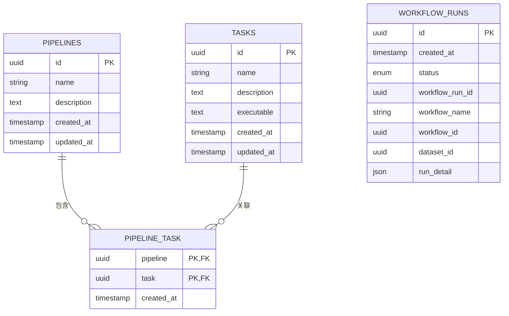
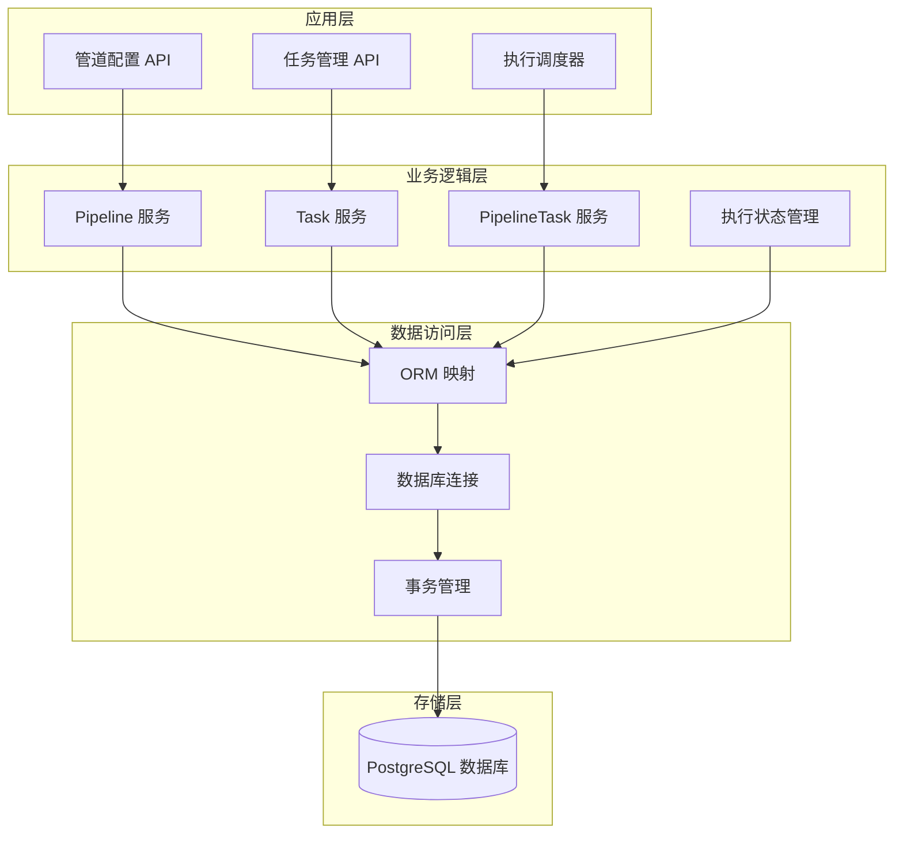
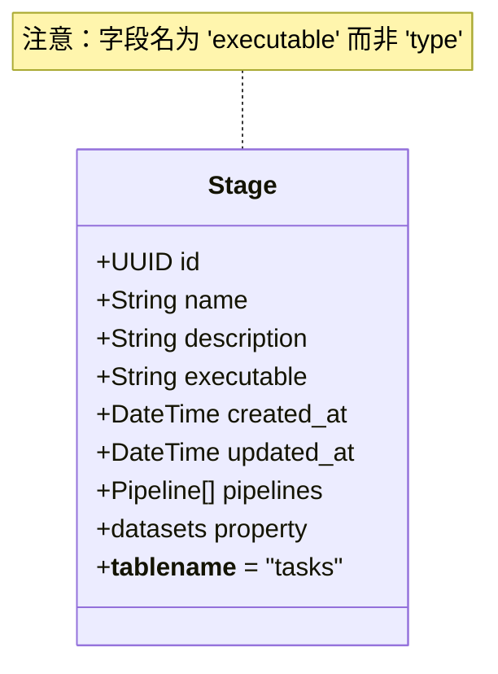
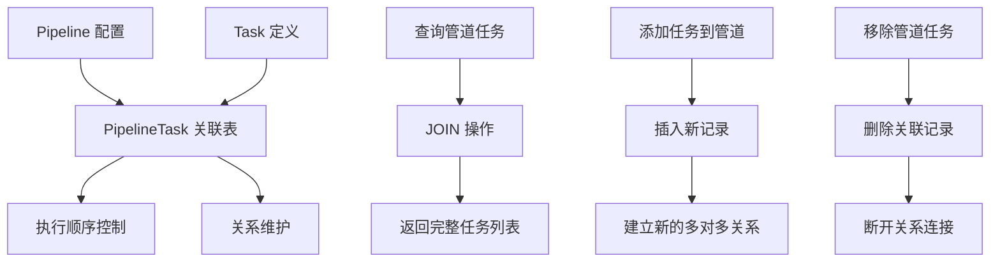
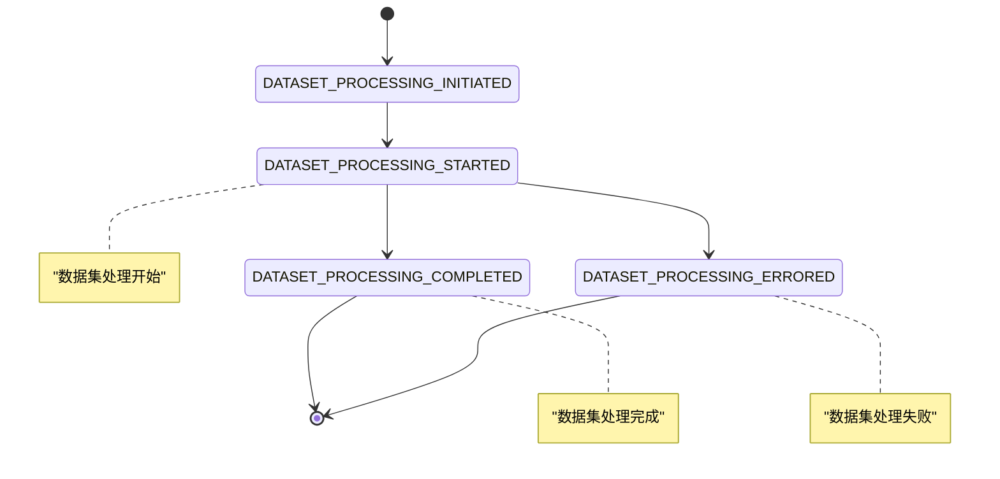

# 管道配置管理

<cite>
**本文档引用的文件**
- [Pipeline.py](file://m_flow/pipeline/models/Pipeline.py)
- [Task.py](file://m_flow/pipeline/models/Task.py)
- [PipelineTask.py](file://m_flow/pipeline/models/PipelineTask.py)
- [PipelineRun.py](file://m_flow/pipeline/models/PipelineRun.py)
- [RunEvent.py](file://m_flow/pipeline/models/RunEvent.py)
- [92b3293baa66_mflow_initial_schema.py](file://alembic/versions/92b3293baa66_mflow_initial_schema.py)
- [__init__.py](file://m_flow/pipeline/models/__init__.py)
</cite>

## 目录
1. [简介](#简介)
2. [项目结构](#项目结构)
3. [核心组件](#核心组件)
4. [架构概览](#架构概览)
5. [详细组件分析](#详细组件分析)
6. [依赖关系分析](#依赖关系分析)
7. [性能考虑](#性能考虑)
8. [故障排除指南](#故障排除指南)
9. [结论](#结论)
10. [附录](#附录)

## 简介

本文件详细阐述了 m_flow 项目中的管道配置管理系统。该系统采用关系型数据库设计，通过三个核心模型（Pipeline、Task、PipelineTask）实现管道配置的完整生命周期管理。系统支持管道与任务之间的多对多关联关系，提供完整的创建、更新、删除操作，并具备执行状态跟踪和事件记录功能。

管道配置管理系统的核心价值在于：
- **模块化设计**：独立的任务定义与可复用的管道配置分离
- **灵活组合**：通过关联表实现任务的动态组合
- **完整追踪**：从配置到执行的全生命周期数据记录
- **标准化接口**：统一的 API 和数据模型规范

## 项目结构

管道配置管理模块位于 `m_flow/pipeline/models/` 目录下，采用清晰的分层架构：

```mermaid
graph TB
subgraph "管道配置管理模块"
A[Pipeline 模型<br/>管道配置定义]
B[Task 模型<br/>任务定义]
C[PipelineTask 模型<br/>关联表]
D[PipelineRun 模型<br/>执行记录]
E[RunEvent 模型<br/>执行事件]
end
subgraph "数据库层"
F[(pipelines 表)]
G[(tasks 表)]
H[(pipeline_task 表)]
I[(workflow_runs 表)]
end
A --> F
B --> G
C --> H
D --> I
A <- --> B
A -.-> C
B -.-> C
```

**图表来源**
- [Pipeline.py:27-44](file://m_flow/pipeline/models/Pipeline.py#L27-L44)
- [Task.py:27-50](file://m_flow/pipeline/models/Task.py#L27-L50)
- [PipelineTask.py:19-39](file://m_flow/pipeline/models/PipelineTask.py#L19-L39)

**章节来源**
- [Pipeline.py:1-44](file://m_flow/pipeline/models/Pipeline.py#L1-L44)
- [Task.py:1-50](file://m_flow/pipeline/models/Task.py#L1-L50)
- [PipelineTask.py:1-39](file://m_flow/pipeline/models/PipelineTask.py#L1-L39)

## 核心组件

### 数据库架构设计

系统采用标准的关系型数据库设计，通过外键约束确保数据完整性：



**图表来源**
- [Pipeline.py:32-44](file://m_flow/pipeline/models/Pipeline.py#L32-L44)
- [Task.py:32-44](file://m_flow/pipeline/models/Task.py#L32-L44)
- [PipelineTask.py:24-39](file://m_flow/pipeline/models/PipelineTask.py#L24-L39)
- [PipelineRun.py:41-52](file://m_flow/pipeline/models/PipelineRun.py#L41-L52)

### 时间戳管理机制

所有核心模型都实现了自动时间戳管理：

| 字段名 | 类型 | 自动更新 | 描述 |
|--------|------|----------|------|
| created_at | DateTime | 否 | 创建时间，使用 UTC 时区 |
| updated_at | DateTime | 是 | 更新时间，自动更新 |
| _utc_now() | 函数 | - | 返回当前 UTC 时间 |

**章节来源**
- [Pipeline.py:23-38](file://m_flow/pipeline/models/Pipeline.py#L23-L38)
- [Task.py:23-39](file://m_flow/pipeline/models/Task.py#L23-L39)
- [PipelineTask.py:15-16](file://m_flow/pipeline/models/PipelineTask.py#L15-L16)

## 架构概览

管道配置管理系统的整体架构采用分层设计，确保关注点分离和模块化：



**图表来源**
- [__init__.py:10-29](file://m_flow/pipeline/models/__init__.py#L10-L29)
- [Pipeline.py:40-43](file://m_flow/pipeline/models/Pipeline.py#L40-L43)
- [Task.py:41-44](file://m_flow/pipeline/models/Task.py#L41-L44)

## 详细组件分析

### Pipeline 模型分析

Pipeline 模型代表可重用的管道配置，是整个系统的核心实体：

```mermaid
classDiagram
class Pipeline {
+UUID id
+String name
+String description
+DateTime created_at
+DateTime updated_at
+Task[] tasks
+__tablename__ = "pipelines"
+relationship() tasks
}
class PipelineTask {
+UUID pipeline
+UUID task
+DateTime created_at
+__tablename__ = "pipeline_task"
+ForeignKey(pipelines.id)
+ForeignKey(tasks.id)
}
class Task {
+UUID id
+String name
+String description
+String executable
+DateTime created_at
+DateTime updated_at
+Pipeline[] pipelines
}
Pipeline "1" --o{ PipelineTask : "包含"
Task "1" --o{ PipelineTask : "关联"
PipelineTask "many" o--o{ Task : "多对多"
```

**图表来源**
- [Pipeline.py:27-44](file://m_flow/pipeline/models/Pipeline.py#L27-L44)
- [Task.py:27-50](file://m_flow/pipeline/models/Task.py#L27-L50)
- [PipelineTask.py:19-39](file://m_flow/pipeline/models/PipelineTask.py#L19-L39)

#### 核心特性

1. **唯一标识符**：使用 UUID 作为主键，确保全局唯一性
2. **配置属性**：包含名称、描述等元数据信息
3. **时间戳管理**：自动跟踪创建和更新时间
4. **关系映射**：通过 PipelineTask 实现多对多关系

**章节来源**
- [Pipeline.py:27-44](file://m_flow/pipeline/models/Pipeline.py#L27-L44)

### Task 模型分析

Task 模型定义了可复用的任务单元，支持多种执行类型：



**图表来源**
- [Task.py:27-50](file://m_flow/pipeline/models/Task.py#L27-L50)

#### 执行模型

Task 模型通过 `executable` 字段存储任务的执行逻辑，支持：
- **字符串标识符**：指向具体执行程序或函数
- **可扩展性**：支持不同类型的执行器
- **复用性**：单个任务可在多个管道中使用

**章节来源**
- [Task.py:27-50](file://m_flow/pipeline/models/Task.py#L27-L50)

### PipelineTask 关联表分析

PipelineTask 是实现多对多关系的关键组件：



**图表来源**
- [PipelineTask.py:19-39](file://m_flow/pipeline/models/PipelineTask.py#L19-L39)

#### 关联表设计特点

1. **复合主键**：由 `pipeline` 和 `task` 组成
2. **外键约束**：确保引用完整性
3. **时间戳记录**：跟踪关系创建时间
4. **索引优化**：为查询性能优化

**章节来源**
- [PipelineTask.py:19-39](file://m_flow/pipeline/models/PipelineTask.py#L19-L39)

### 执行状态管理

系统提供了完整的执行状态跟踪机制：



**图表来源**
- [PipelineRun.py:21-33](file://m_flow/pipeline/models/PipelineRun.py#L21-L33)

**章节来源**
- [PipelineRun.py:1-52](file://m_flow/pipeline/models/PipelineRun.py#L1-L52)
- [RunEvent.py:16-24](file://m_flow/pipeline/models/RunEvent.py#L16-L24)

## 依赖关系分析

### 数据模型依赖图


**图表来源**
- [Pipeline.py:40-43](file://m_flow/pipeline/models/Pipeline.py#L40-L43)
- [Task.py:41-44](file://m_flow/pipeline/models/Task.py#L41-L44)
- [PipelineTask.py:19-39](file://m_flow/pipeline/models/PipelineTask.py#L19-L39)

### 外部依赖关系

系统主要依赖以下外部组件：
- **SQLAlchemy ORM**：对象关系映射框架
- **PostgreSQL**：关系型数据库存储
- **UUID 类型**：唯一标识符支持
- **JSON 类型**：执行详情存储

**章节来源**
- [__init__.py:10-29](file://m_flow/pipeline/models/__init__.py#L10-L29)

## 性能考虑

### 查询优化策略

1. **索引设计**
   - 在 `workflow_run_id`、`workflow_id`、`dataset_id` 上建立索引
   - 使用复合索引优化常用查询模式

2. **关系查询优化**
   - 使用 `joinedload` 进行关联加载
   - 避免 N+1 查询问题

3. **缓存策略**
   - 热点数据缓存
   - 查询结果缓存

### 存储优化

1. **数据压缩**
   - 对大文本字段进行压缩存储
   - 使用合适的字符编码

2. **分区策略**
   - 基于时间的表分区
   - 基于数据集的分区

## 故障排除指南

### 常见问题及解决方案

#### 数据库连接问题
- **症状**：无法连接到数据库
- **原因**：连接字符串配置错误
- **解决**：检查数据库连接参数

#### 外键约束错误
- **症状**：插入或更新操作失败
- **原因**：引用的外键不存在
- **解决**：确保相关记录先创建

#### 重复键冲突
- **症状**：唯一约束违反
- **原因**：重复的名称或标识符
- **解决**：使用唯一名称或修改现有记录

**章节来源**
- [92b3293baa66_mflow_initial_schema.py:24-30](file://alembic/versions/92b3293baa66_mflow_initial_schema.py#L24-L30)

## 结论

m_flow 的管道配置管理系统通过精心设计的数据模型和关系映射，实现了灵活而强大的管道配置管理能力。系统的核心优势包括：

1. **模块化架构**：清晰的职责分离和可扩展性
2. **灵活的组合**：通过关联表实现任务的动态组合
3. **完整追踪**：从配置到执行的全生命周期管理
4. **标准化接口**：统一的数据模型和 API 设计

该系统为复杂的数据处理工作流提供了坚实的基础，支持从简单到复杂的各种应用场景。

## 附录

### 最佳实践指南

#### 命名规范
- 使用描述性的管道名称
- 保持任务名称的一致性
- 避免使用特殊字符

#### 任务组织原则
- 将通用功能抽象为可复用任务
- 保持任务粒度适中
- 考虑任务的执行依赖关系

#### 配置验证规则
- 确保管道名称的唯一性
- 验证任务的存在性和可用性
- 检查执行逻辑的有效性

### 版本管理建议

系统支持基于 Alembic 的数据库迁移管理，建议：
- 使用语义化版本控制
- 为重大变更创建迁移脚本
- 保持向后兼容性