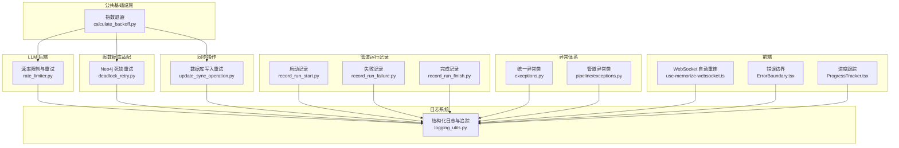
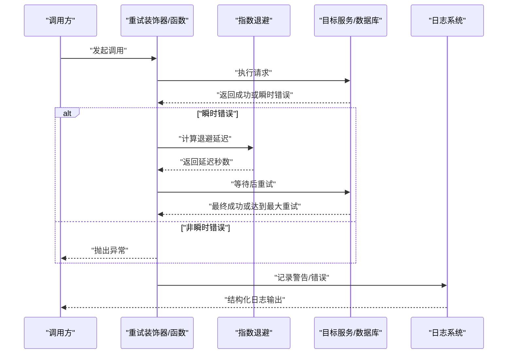
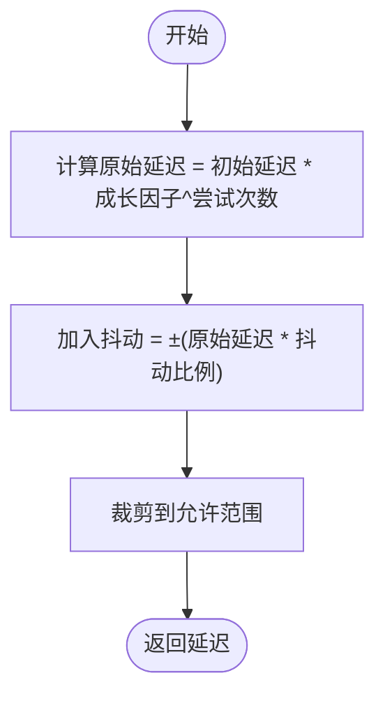
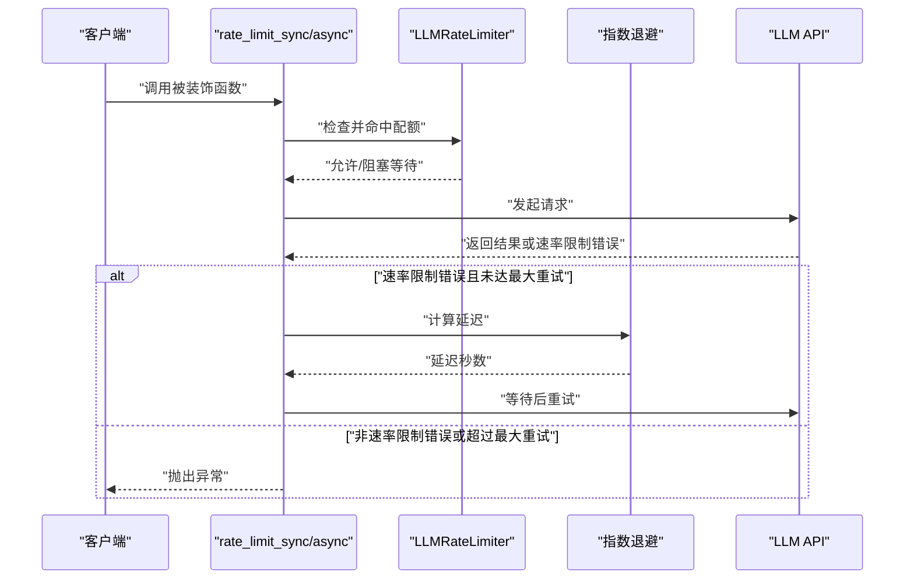
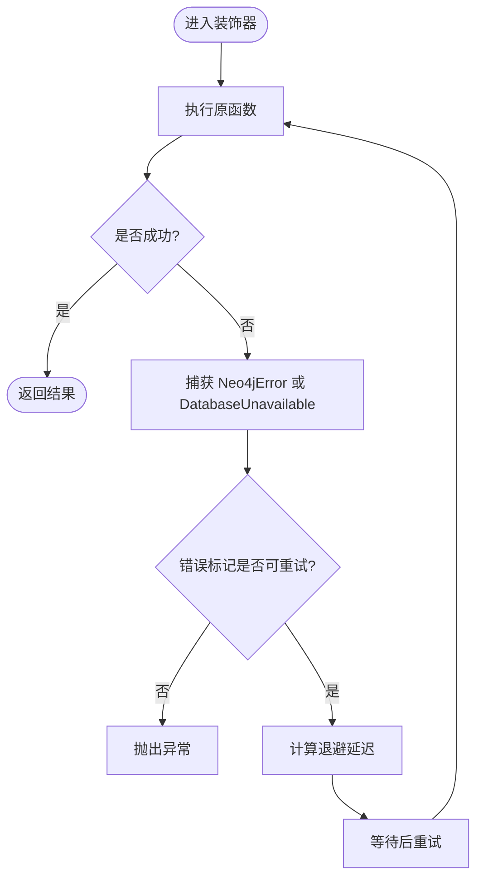
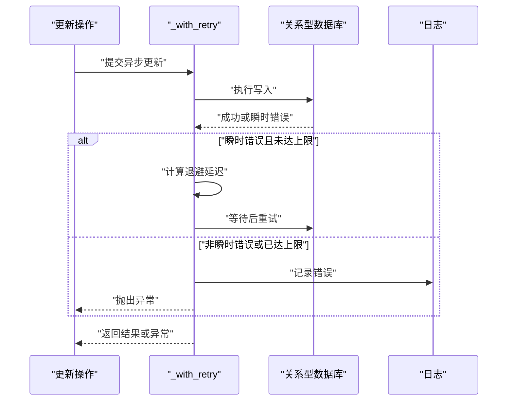
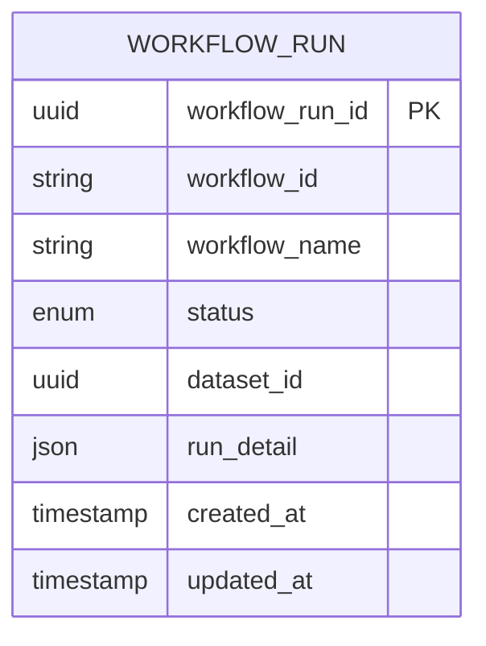
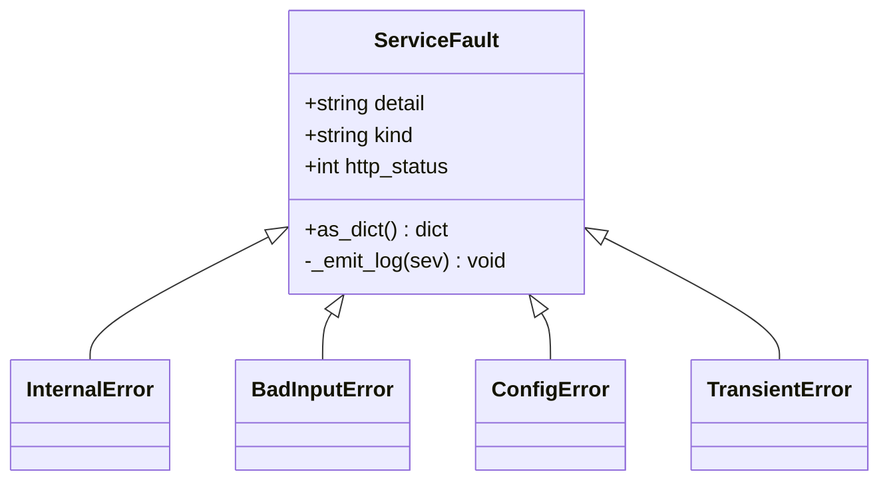
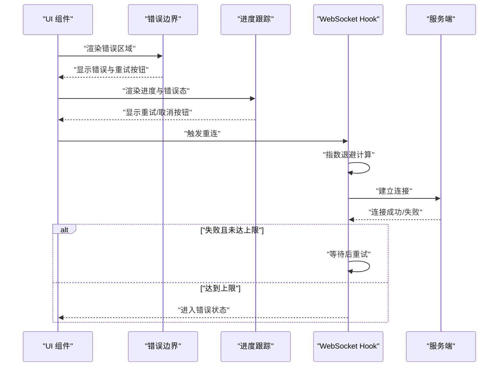
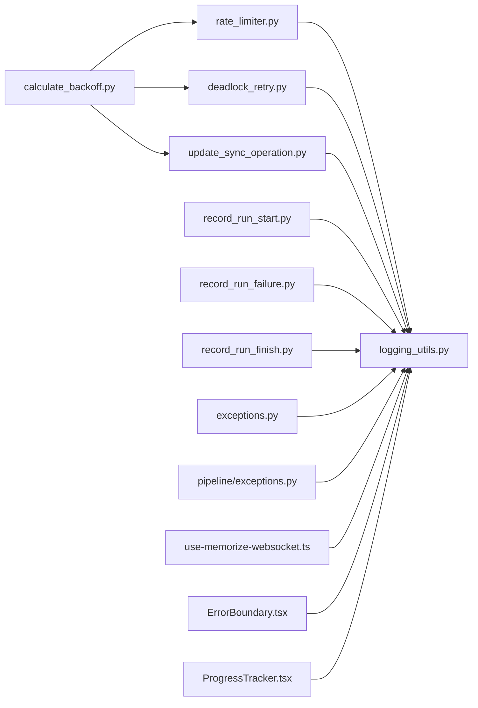

# 错误处理与重试

<cite>
**本文引用的文件**
- [calculate_backoff.py](file://m_flow/shared/infra_utils/calculate_backoff.py)
- [rate_limiter.py](file://m_flow/llm/backends/litellm_instructor/llm/rate_limiter.py)
- [deadlock_retry.py](file://m_flow/adapters/graph/neo4j_driver/deadlock_retry.py)
- [update_sync_operation.py](file://m_flow/shared/sync/methods/update_sync_operation.py)
- [record_run_failure.py](file://m_flow/pipeline/operations/record_run_failure.py)
- [record_run_start.py](file://m_flow/pipeline/operations/record_run_start.py)
- [record_run_finish.py](file://m_flow/pipeline/operations/record_run_finish.py)
- [logging_utils.py](file://m_flow/shared/logging_utils.py)
- [exceptions.py](file://m_flow/exceptions/exceptions.py)
- [exceptions.py](file://m_flow/pipeline/exceptions/exceptions.py)
- [test_rate_limiting_retry.py](file://m_flow/tests/unit/infrastructure/test_rate_limiting_retry.py)
- [neo4j_deadlock_test.py](file://m_flow/tests/unit/infrastructure/databases/graph/neo4j_deadlock_test.py)
- [use-memorize-websocket.ts](file://m_flow-frontend/src/hooks/use-memorize-websocket.ts)
- [ErrorBoundary.tsx](file://m_flow-frontend/src/components/common/ErrorBoundary.tsx)
- [ProgressTracker.tsx](file://m_flow-frontend/src/components/common/ProgressTracker.tsx)
</cite>

## 目录
1. [简介](#简介)
2. [项目结构](#项目结构)
3. [核心组件](#核心组件)
4. [架构总览](#架构总览)
5. [详细组件分析](#详细组件分析)
6. [依赖分析](#依赖分析)
7. [性能考量](#性能考量)
8. [故障排查指南](#故障排查指南)
9. [结论](#结论)
10. [附录](#附录)

## 简介
本文件系统性梳理 m_flow 管道系统中的错误处理与重试机制，覆盖以下关键主题：
- 错误处理架构：统一异常体系、错误分类与传播路径
- 重试策略设计：指数退避、抖动、最大重试次数与重试条件判断
- 错误恢复：数据库事务与状态机的自愈能力
- 日志与告警：结构化日志、异常堆栈追踪与前端可视化
- 配置选项：基于任务类型与业务需求的可定制策略
- 最佳实践：错误预防、快速检测与优雅降级
- 常见场景与排障：结合单元测试与前端重连策略的实际案例

## 项目结构
围绕错误处理与重试的关键模块分布如下：
- 公共基础设施：指数退避与抖动计算
- LLM 后端：速率限制与自动重试装饰器
- 图数据库适配：Neo4j 死锁与瞬时错误透明重试
- 同步操作：关系型数据库写入的幂等更新与重试
- 管道运行：启动/完成/失败的持久化记录
- 日志系统：结构化日志与异常追踪
- 前端：错误边界、进度跟踪与 WebSocket 自动重连

**图表来源**
- [calculate_backoff.py:1-34](file://m_flow/shared/infra_utils/calculate_backoff.py#L1-L34)
- [rate_limiter.py:1-251](file://m_flow/llm/backends/litellm_instructor/llm/rate_limiter.py#L1-L251)
- [deadlock_retry.py:1-85](file://m_flow/adapters/graph/neo4j_driver/deadlock_retry.py#L1-L85)
- [update_sync_operation.py:1-304](file://m_flow/shared/sync/methods/update_sync_operation.py#L1-L304)
- [record_run_start.py:1-67](file://m_flow/pipeline/operations/record_run_start.py#L1-L67)
- [record_run_failure.py:1-64](file://m_flow/pipeline/operations/record_run_failure.py#L1-L64)
- [record_run_finish.py:1-68](file://m_flow/pipeline/operations/record_run_finish.py#L1-L68)
- [logging_utils.py:216-532](file://m_flow/shared/logging_utils.py#L216-L532)
- [exceptions.py:1-148](file://m_flow/exceptions/exceptions.py#L1-L148)
- [exceptions.py:1-31](file://m_flow/pipeline/exceptions/exceptions.py#L1-L31)
- [use-memorize-websocket.ts:195-242](file://m_flow-frontend/src/hooks/use-memorize-websocket.ts#L195-L242)
- [ErrorBoundary.tsx:196-244](file://m_flow-frontend/src/components/common/ErrorBoundary.tsx#L196-L244)
- [ProgressTracker.tsx:311-349](file://m_flow-frontend/src/components/common/ProgressTracker.tsx#L311-L349)

**章节来源**
- [calculate_backoff.py:1-34](file://m_flow/shared/infra_utils/calculate_backoff.py#L1-L34)
- [rate_limiter.py:1-251](file://m_flow/llm/backends/litellm_instructor/llm/rate_limiter.py#L1-L251)
- [deadlock_retry.py:1-85](file://m_flow/adapters/graph/neo4j_driver/deadlock_retry.py#L1-L85)
- [update_sync_operation.py:1-304](file://m_flow/shared/sync/methods/update_sync_operation.py#L1-L304)
- [record_run_start.py:1-67](file://m_flow/pipeline/operations/record_run_start.py#L1-L67)
- [record_run_failure.py:1-64](file://m_flow/pipeline/operations/record_run_failure.py#L1-L64)
- [record_run_finish.py:1-68](file://m_flow/pipeline/operations/record_run_finish.py#L1-L68)
- [logging_utils.py:216-532](file://m_flow/shared/logging_utils.py#L216-L532)
- [exceptions.py:1-148](file://m_flow/exceptions/exceptions.py#L1-L148)
- [exceptions.py:1-31](file://m_flow/pipeline/exceptions/exceptions.py#L1-L31)
- [use-memorize-websocket.ts:195-242](file://m_flow-frontend/src/hooks/use-memorize-websocket.ts#L195-L242)
- [ErrorBoundary.tsx:196-244](file://m_flow-frontend/src/components/common/ErrorBoundary.tsx#L196-L244)
- [ProgressTracker.tsx:311-349](file://m_flow-frontend/src/components/common/ProgressTracker.tsx#L311-L349)

## 核心组件
- 指数退避与抖动：提供统一的退避延迟计算，避免“惊群效应”
- LLM 速率限制与重试：基于模式匹配识别限流错误，自动指数退避重试
- Neo4j 死锁与瞬时错误重试：针对特定错误标记与数据库不可用进行透明重试
- 数据库写入重试：对断连、操作错误、超时等瞬时错误进行幂等更新与重试
- 管道运行记录：启动、完成、失败三态持久化，便于可观测与恢复
- 结构化日志与异常追踪：统一输出格式、自动记录异常类型与堆栈
- 统一异常体系：服务故障、内部错误、输入错误、配置错误、瞬时错误等分类
- 前端错误边界与重连：错误展示、重试按钮与 WebSocket 指数退避重连

**章节来源**
- [calculate_backoff.py:1-34](file://m_flow/shared/infra_utils/calculate_backoff.py#L1-L34)
- [rate_limiter.py:1-251](file://m_flow/llm/backends/litellm_instructor/llm/rate_limiter.py#L1-L251)
- [deadlock_retry.py:1-85](file://m_flow/adapters/graph/neo4j_driver/deadlock_retry.py#L1-L85)
- [update_sync_operation.py:1-304](file://m_flow/shared/sync/methods/update_sync_operation.py#L1-L304)
- [record_run_start.py:1-67](file://m_flow/pipeline/operations/record_run_start.py#L1-L67)
- [record_run_failure.py:1-64](file://m_flow/pipeline/operations/record_run_failure.py#L1-L64)
- [record_run_finish.py:1-68](file://m_flow/pipeline/operations/record_run_finish.py#L1-L68)
- [logging_utils.py:216-532](file://m_flow/shared/logging_utils.py#L216-L532)
- [exceptions.py:1-148](file://m_flow/exceptions/exceptions.py#L1-L148)
- [exceptions.py:1-31](file://m_flow/pipeline/exceptions/exceptions.py#L1-L31)
- [use-memorize-websocket.ts:195-242](file://m_flow-frontend/src/hooks/use-memorize-websocket.ts#L195-L242)
- [ErrorBoundary.tsx:196-244](file://m_flow-frontend/src/components/common/ErrorBoundary.tsx#L196-L244)
- [ProgressTracker.tsx:311-349](file://m_flow-frontend/src/components/common/ProgressTracker.tsx#L311-L349)

## 架构总览
下图展示了从调用方到重试与日志的完整链路，以及前端错误与重连的闭环。

**图表来源**
- [rate_limiter.py:182-245](file://m_flow/llm/backends/litellm_instructor/llm/rate_limiter.py#L182-L245)
- [deadlock_retry.py:24-85](file://m_flow/adapters/graph/neo4j_driver/deadlock_retry.py#L24-L85)
- [update_sync_operation.py:48-99](file://m_flow/shared/sync/methods/update_sync_operation.py#L48-L99)
- [calculate_backoff.py:19-34](file://m_flow/shared/infra_utils/calculate_backoff.py#L19-L34)
- [logging_utils.py:216-532](file://m_flow/shared/logging_utils.py#L216-L532)

## 详细组件分析

### 指数退避与抖动（统一延迟策略）
- 设计要点
  - 固定初始延迟、指数增长因子与抖动比例
  - 抖动防止多个并发请求在同一时刻重试，降低“惊群效应”
  - 可通过参数化调整以适配不同场景
- 关键接口
  - 计算延迟：接收尝试次数，返回带抖动的延迟秒数
- 复杂度
  - 时间复杂度 O(1)，空间复杂度 O(1)

**图表来源**
- [calculate_backoff.py:19-34](file://m_flow/shared/infra_utils/calculate_backoff.py#L19-L34)

**章节来源**
- [calculate_backoff.py:1-34](file://m_flow/shared/infra_utils/calculate_backoff.py#L1-L34)

### LLM 速率限制与自动重试
- 设计要点
  - 通过预定义模式识别速率限制错误
  - 提供同步与异步装饰器，自动指数退避+抖动重试
  - 支持配置启用开关、请求上限与时间窗口
- 重试条件
  - 匹配速率限制相关错误消息
  - 达到最大重试次数后抛出异常
- 关键接口
  - 同步/异步装饰器
  - 速率限制检查与等待
  - 退避延迟计算

**图表来源**
- [rate_limiter.py:55-134](file://m_flow/llm/backends/litellm_instructor/llm/rate_limiter.py#L55-L134)
- [rate_limiter.py:182-245](file://m_flow/llm/backends/litellm_instructor/llm/rate_limiter.py#L182-L245)
- [calculate_backoff.py:19-34](file://m_flow/shared/infra_utils/calculate_backoff.py#L19-L34)

**章节来源**
- [rate_limiter.py:1-251](file://m_flow/llm/backends/litellm_instructor/llm/rate_limiter.py#L1-L251)

### Neo4j 死锁与瞬时错误重试
- 设计要点
  - 识别特定错误标记（如死锁、瞬时错误）与数据库不可用
  - 使用共享退避函数进行指数退避
  - 超过最大重试次数后上抛异常
- 适用场景
  - 图数据库写入冲突、临时不可用

**图表来源**
- [deadlock_retry.py:24-85](file://m_flow/adapters/graph/neo4j_driver/deadlock_retry.py#L24-L85)
- [calculate_backoff.py:19-34](file://m_flow/shared/infra_utils/calculate_backoff.py#L19-L34)

**章节来源**
- [deadlock_retry.py:1-85](file://m_flow/adapters/graph/neo4j_driver/deadlock_retry.py#L1-L85)

### 数据库写入重试（关系型）
- 设计要点
  - 对断连、操作错误、超时等瞬时错误进行重试
  - 幂等更新：仅在必要字段变更时写入
  - 记录最后一次异常与重试日志
- 重试条件
  - 捕获指定瞬时错误类型
  - 达到最大重试次数后记录错误并上抛
- 关键接口
  - 异步重试包装函数
  - 更新同步操作记录（支持多字段）

**图表来源**
- [update_sync_operation.py:48-99](file://m_flow/shared/sync/methods/update_sync_operation.py#L48-L99)
- [calculate_backoff.py:19-34](file://m_flow/shared/infra_utils/calculate_backoff.py#L19-L34)

**章节来源**
- [update_sync_operation.py:1-304](file://m_flow/shared/sync/methods/update_sync_operation.py#L1-L304)

### 管道运行记录（启动/完成/失败）
- 设计要点
  - 启动：记录运行标识、数据摘要与初始状态
  - 完成：记录完成状态与当前步骤
  - 失败：序列化输入数据与异常信息，持久化运行详情
- 作用
  - 提供可观测性与可恢复性依据
  - 便于前端展示与用户诊断

**图表来源**
- [record_run_start.py:18-56](file://m_flow/pipeline/operations/record_run_start.py#L18-L56)
- [record_run_finish.py:18-56](file://m_flow/pipeline/operations/record_run_finish.py#L18-L56)
- [record_run_failure.py:18-63](file://m_flow/pipeline/operations/record_run_failure.py#L18-L63)

**章节来源**
- [record_run_start.py:1-67](file://m_flow/pipeline/operations/record_run_start.py#L1-L67)
- [record_run_finish.py:1-68](file://m_flow/pipeline/operations/record_run_finish.py#L1-L68)
- [record_run_failure.py:1-64](file://m_flow/pipeline/operations/record_run_failure.py#L1-L64)

### 日志与异常追踪
- 结构化日志
  - 输出包含事件文本、额外字段与来源
  - 自动附加异常类型、消息与堆栈
- 异常追踪
  - 在结构化与纯文本模式下均支持异常追踪输出
- 统一异常体系
  - 服务故障、内部错误、输入错误、配置错误、瞬时错误等
  - 可设置自动记录与日志级别

**图表来源**
- [exceptions.py:20-148](file://m_flow/exceptions/exceptions.py#L20-L148)
- [logging_utils.py:216-532](file://m_flow/shared/logging_utils.py#L216-L532)

**章节来源**
- [logging_utils.py:216-532](file://m_flow/shared/logging_utils.py#L216-L532)
- [exceptions.py:1-148](file://m_flow/exceptions/exceptions.py#L1-L148)
- [exceptions.py:1-31](file://m_flow/pipeline/exceptions/exceptions.py#L1-L31)

### 前端错误处理与重连
- 错误边界与内联错误
  - 展示错误信息与可选重试按钮
  - 用于小区域内的错误提示与交互
- 进度跟踪
  - 在出现错误时显示重试按钮，支持取消
- WebSocket 自动重连
  - 指数退避与最大重试次数控制
  - 超限时进入错误状态并记录错误

**图表来源**
- [ErrorBoundary.tsx:196-244](file://m_flow-frontend/src/components/common/ErrorBoundary.tsx#L196-L244)
- [ProgressTracker.tsx:311-349](file://m_flow-frontend/src/components/common/ProgressTracker.tsx#L311-L349)
- [use-memorize-websocket.ts:195-242](file://m_flow-frontend/src/hooks/use-memorize-websocket.ts#L195-L242)

**章节来源**
- [ErrorBoundary.tsx:196-244](file://m_flow-frontend/src/components/common/ErrorBoundary.tsx#L196-L244)
- [ProgressTracker.tsx:311-349](file://m_flow-frontend/src/components/common/ProgressTracker.tsx#L311-L349)
- [use-memorize-websocket.ts:195-242](file://m_flow-frontend/src/hooks/use-memorize-websocket.ts#L195-L242)

## 依赖分析
- 低耦合高内聚
  - 指数退避作为通用工具被多个适配层复用
  - 重试装饰器与包装函数独立于具体目标服务
- 关键依赖链
  - 退避 → 重试装饰器/包装函数 → 目标服务/数据库
  - 记录函数 → 数据库适配器 → 会话管理
  - 日志系统贯穿所有层，统一输出与追踪

**图表来源**
- [calculate_backoff.py:1-34](file://m_flow/shared/infra_utils/calculate_backoff.py#L1-L34)
- [rate_limiter.py:1-251](file://m_flow/llm/backends/litellm_instructor/llm/rate_limiter.py#L1-L251)
- [deadlock_retry.py:1-85](file://m_flow/adapters/graph/neo4j_driver/deadlock_retry.py#L1-L85)
- [update_sync_operation.py:1-304](file://m_flow/shared/sync/methods/update_sync_operation.py#L1-L304)
- [record_run_start.py:1-67](file://m_flow/pipeline/operations/record_run_start.py#L1-L67)
- [record_run_failure.py:1-64](file://m_flow/pipeline/operations/record_run_failure.py#L1-L64)
- [record_run_finish.py:1-68](file://m_flow/pipeline/operations/record_run_finish.py#L1-L68)
- [logging_utils.py:216-532](file://m_flow/shared/logging_utils.py#L216-L532)
- [exceptions.py:1-148](file://m_flow/exceptions/exceptions.py#L1-L148)
- [exceptions.py:1-31](file://m_flow/pipeline/exceptions/exceptions.py#L1-L31)
- [use-memorize-websocket.ts:195-242](file://m_flow-frontend/src/hooks/use-memorize-websocket.ts#L195-L242)
- [ErrorBoundary.tsx:196-244](file://m_flow-frontend/src/components/common/ErrorBoundary.tsx#L196-L244)
- [ProgressTracker.tsx:311-349](file://m_flow-frontend/src/components/common/ProgressTracker.tsx#L311-L349)

**章节来源**
- [calculate_backoff.py:1-34](file://m_flow/shared/infra_utils/calculate_backoff.py#L1-L34)
- [rate_limiter.py:1-251](file://m_flow/llm/backends/litellm_instructor/llm/rate_limiter.py#L1-L251)
- [deadlock_retry.py:1-85](file://m_flow/adapters/graph/neo4j_driver/deadlock_retry.py#L1-L85)
- [update_sync_operation.py:1-304](file://m_flow/shared/sync/methods/update_sync_operation.py#L1-L304)
- [record_run_start.py:1-67](file://m_flow/pipeline/operations/record_run_start.py#L1-L67)
- [record_run_failure.py:1-64](file://m_flow/pipeline/operations/record_run_failure.py#L1-L64)
- [record_run_finish.py:1-68](file://m_flow/pipeline/operations/record_run_finish.py#L1-L68)
- [logging_utils.py:216-532](file://m_flow/shared/logging_utils.py#L216-L532)
- [exceptions.py:1-148](file://m_flow/exceptions/exceptions.py#L1-L148)
- [exceptions.py:1-31](file://m_flow/pipeline/exceptions/exceptions.py#L1-L31)
- [use-memorize-websocket.ts:195-242](file://m_flow-frontend/src/hooks/use-memorize-websocket.ts#L195-L242)
- [ErrorBoundary.tsx:196-244](file://m_flow-frontend/src/components/common/ErrorBoundary.tsx#L196-L244)
- [ProgressTracker.tsx:311-349](file://m_flow-frontend/src/components/common/ProgressTracker.tsx#L311-L349)

## 性能考量
- 指数退避与抖动
  - 有效缓解瞬时峰值导致的级联失败
  - 抖动降低同时重试引发的资源争用
- 最大重试次数
  - 防止无限重试造成资源耗尽
  - 建议按服务 SLA 与超时预算设定上限
- I/O 密集与 CPU 密集
  - 对网络与数据库操作建议使用异步重试
  - 对 CPU 密集任务应谨慎使用重试，优先优化算法
- 日志开销
  - 结构化日志与异常追踪会带来额外 IO
  - 建议在生产环境合理设置日志级别与采样率

## 故障排查指南
- 常见场景与验证
  - 速率限制重试：通过单元测试验证同步与异步装饰器在多次失败后成功
  - Neo4j 死锁重试：验证在标记错误与数据库不可用场景下的透明重试
- 排查步骤
  - 检查日志：定位异常类型、消息与堆栈
  - 核对重试次数与退避延迟：确认是否达到最大重试
  - 核对瞬时错误类型：确保捕获了正确的异常类别
  - 核对数据库状态：确认写入是否幂等、是否已记录失败详情
  - 前端重连：检查指数退避与最大重试配置
- 单元测试参考
  - 速率限制检测与重试行为
  - Neo4j 死锁重试成功与超限抛错

**章节来源**
- [test_rate_limiting_retry.py:50-225](file://m_flow/tests/unit/infrastructure/test_rate_limiting_retry.py#L50-L225)
- [neo4j_deadlock_test.py:52-79](file://m_flow/tests/unit/infrastructure/databases/graph/neo4j_deadlock_test.py#L52-L79)

## 结论
m_flow 的错误处理与重试机制通过统一的指数退避、可配置的重试条件与完善的日志追踪，实现了对瞬时故障的自愈与可观测性。结合前端错误边界与 WebSocket 自动重连，系统在用户体验与稳定性之间取得了良好平衡。建议在实际部署中根据任务类型与 SLA 调整重试上限、退避参数与日志级别，并持续监控失败率与重试分布以优化策略。

## 附录
- 配置选项（示例维度）
  - LLM 速率限制：启用开关、请求上限、时间窗口
  - 重试上限：各适配层默认上限可按需调整
  - 退避参数：初始延迟、成长因子、抖动比例
  - 日志级别：按环境设置，生产环境建议 INFO 或更高
- 最佳实践
  - 错误预防：输入校验、配额检查、超时设置
  - 快速检测：结构化日志、异常追踪、告警联动
  - 优雅降级：缓存回退、降级接口、渐进式恢复