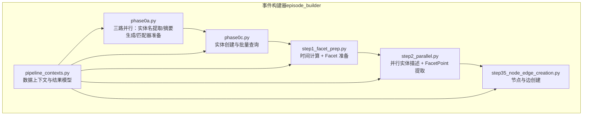
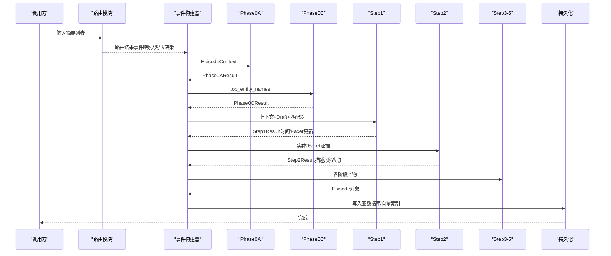
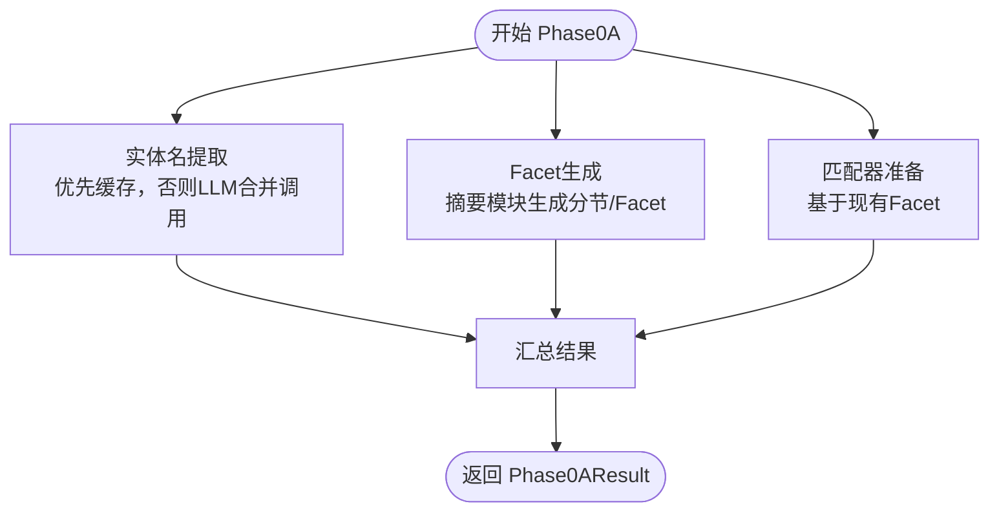
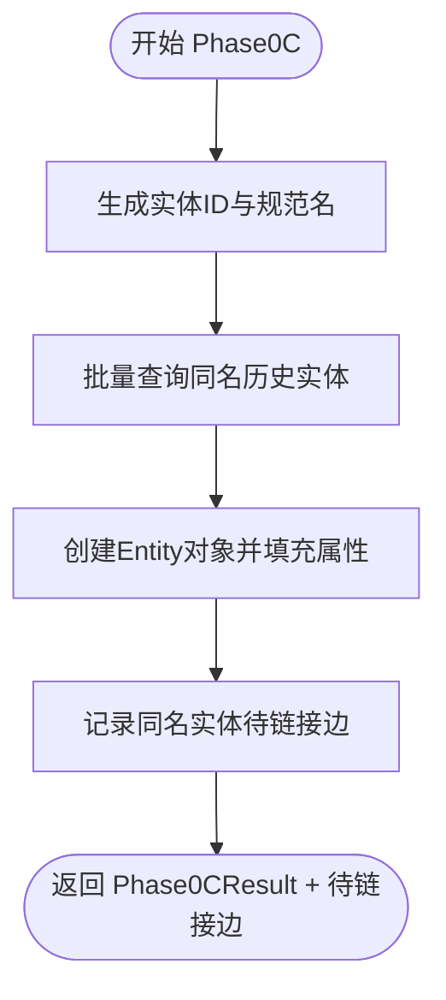
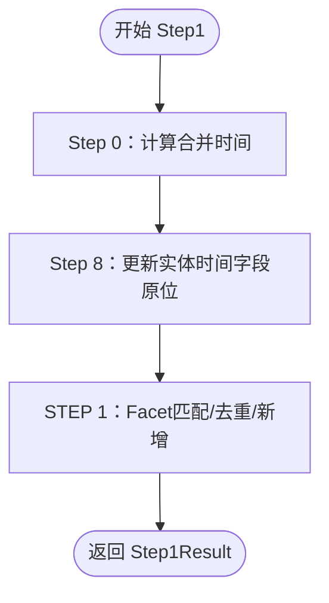
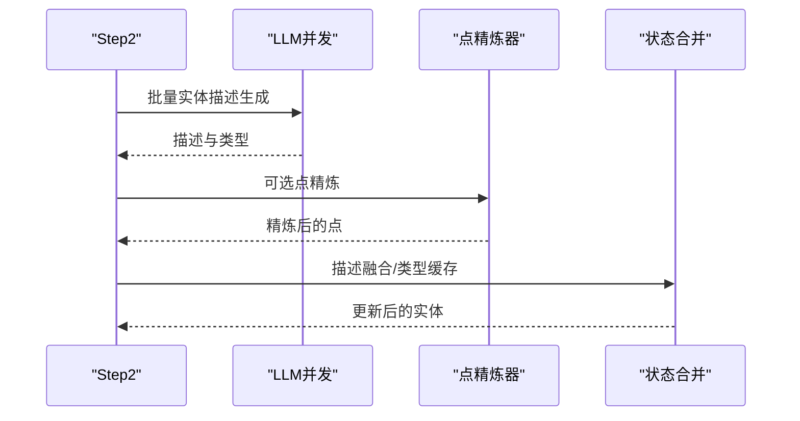
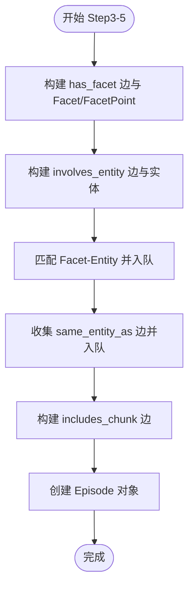
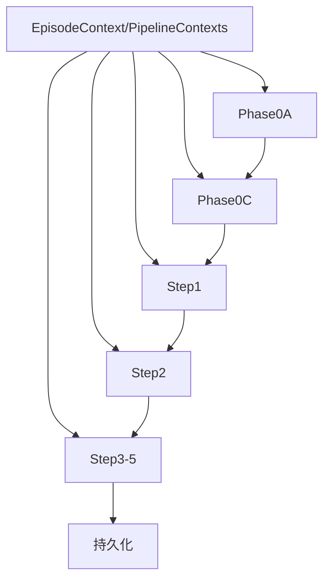
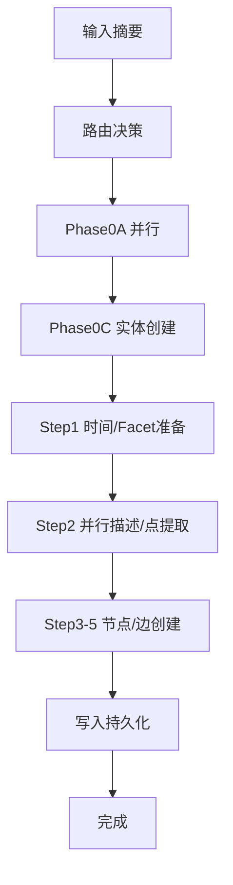

# 事件构建器

<cite>
**本文引用的文件**
- [episode_builder/__init__.py](file://m_flow/memory/episodic/episode_builder/__init__.py)
- [phase0a.py](file://m_flow/memory/episodic/episode_builder/phase0a.py)
- [phase0c.py](file://m_flow/memory/episodic/episode_builder/phase0c.py)
- [step1_facet_prep.py](file://m_flow/memory/episodic/episode_builder/step1_facet_prep.py)
- [step2_parallel.py](file://m_flow/memory/episodic/episode_builder/step2_parallel.py)
- [step35_node_edge_creation.py](file://m_flow/memory/episodic/episode_builder/step35_node_edge_creation.py)
- [pipeline_contexts.py](file://m_flow/memory/episodic/episode_builder/pipeline_contexts.py)
- [write_episodic_memories.py](file://m_flow/memory/episodic/write_episodic_memories.py)
</cite>

## 目录
1. [简介](#简介)
2. [项目结构](#项目结构)
3. [核心组件](#核心组件)
4. [架构总览](#架构总览)
5. [详细组件分析](#详细组件分析)
6. [依赖关系分析](#依赖关系分析)
7. [性能考量](#性能考量)
8. [故障排查指南](#故障排查指南)
9. [结论](#结论)
10. [附录](#附录)

## 简介
本文件系统化阐述“事件构建器”的完整技术实现与运行机制，覆盖从内容路由到最终事件写入的全流程。重点解析 episode_builder 目录下的五个处理阶段：Phase0A（三路并行）、Phase0C（实体创建与批量查询）、Step1（时间计算与 Facet 准备）、Step2（并行实体描述与 FacetPoint 提取）、Step3-5（节点与边创建）。文档同时说明并行处理与任务调度策略、事件路由决策算法（新事件创建与现有事件合并）、性能优化技巧与错误恢复机制，并提供端到端流程图与时序图。

## 项目结构
episode_builder 模块采用分层流水线设计，将原本庞大的写入函数拆分为可测试、可维护的小型阶段模块，通过统一的数据上下文在各阶段间传递状态与结果。

图表来源
- [episode_builder/__init__.py:11-20](file://m_flow/memory/episodic/episode_builder/__init__.py#L11-L20)
- [phase0a.py:458-564](file://m_flow/memory/episodic/episode_builder/phase0a.py#L458-L564)
- [phase0c.py:57-151](file://m_flow/memory/episodic/episode_builder/phase0c.py#L57-L151)
- [step1_facet_prep.py:367-471](file://m_flow/memory/episodic/episode_builder/step1_facet_prep.py#L367-L471)
- [step2_parallel.py:360-459](file://m_flow/memory/episodic/episode_builder/step2_parallel.py#L360-L459)
- [step35_node_edge_creation.py:90-687](file://m_flow/memory/episodic/episode_builder/step35_node_edge_creation.py#L90-L687)
- [pipeline_contexts.py:96-146](file://m_flow/memory/episodic/episode_builder/pipeline_contexts.py#L96-L146)

章节来源
- [episode_builder/__init__.py:11-20](file://m_flow/memory/episodic/episode_builder/__init__.py#L11-L20)

## 核心组件
- 数据上下文与配置
  - EpisodeConfig：封装实体/ Facet/ FacetPoint/ 路由等配置参数，便于跨阶段传递。
  - EpisodeContext：承载单次事件处理所需的输入（摘要、路由、状态、引擎、节点集、数据集隔离等）。
  - EpisodeProcessingState：跨阶段累加器，保存各阶段输出以供后续阶段复用。
- 阶段结果模型
  - Phase0AResult、Phase0CResult、Step1Result、Step2Result：每个阶段的输出封装，确保数据边界清晰。
- 执行入口
  - write_episodic_memories：外部调用入口，负责路由、并发控制、阶段编排与持久化。

章节来源
- [pipeline_contexts.py:47-146](file://m_flow/memory/episodic/episode_builder/pipeline_contexts.py#L47-L146)
- [write_episodic_memories.py:178-200](file://m_flow/memory/episodic/write_episodic_memories.py#L178-L200)

## 架构总览
事件构建器采用“阶段化流水线 + 并行执行 + 状态累加”的架构模式，确保高吞吐与可扩展性。

图表来源
- [write_episodic_memories.py:178-200](file://m_flow/memory/episodic/write_episodic_memories.py#L178-L200)
- [phase0a.py:458-564](file://m_flow/memory/episodic/episode_builder/phase0a.py#L458-L564)
- [phase0c.py:57-151](file://m_flow/memory/episodic/episode_builder/phase0c.py#L57-L151)
- [step1_facet_prep.py:367-471](file://m_flow/memory/episodic/episode_builder/step1_facet_prep.py#L367-L471)
- [step2_parallel.py:360-459](file://m_flow/memory/episodic/episode_builder/step2_parallel.py#L360-L459)
- [step35_node_edge_creation.py:90-687](file://m_flow/memory/episodic/episode_builder/step35_node_edge_creation.py#L90-L687)

## 详细组件分析

### Phase0A：三路并行优化
- 目标：并行完成实体名提取、Facet 生成、语义匹配器准备，缩短关键路径。
- 关键流程
  - 实体名提取：优先使用路由缓存；若无则合并文本段进行一次 LLM 调用。
  - Facet 生成：基于事件句子与主题，调用摘要模块生成分节与 Facet；支持精确模式与过程式路由候选收集。
  - 匹配器准备：基于现有 Facet 构建语义匹配器，用于后续 Facet 去重与合并。
- 并行策略：使用 gather 并发执行三项任务，异常独立捕获，保证整体鲁棒性。
- 输出：Phase0AResult（实体名、草稿、匹配器、过程式候选）。

图表来源
- [phase0a.py:80-202](file://m_flow/memory/episodic/episode_builder/phase0a.py#L80-L202)
- [phase0a.py:210-411](file://m_flow/memory/episodic/episode_builder/phase0a.py#L210-L411)
- [phase0a.py:419-450](file://m_flow/memory/episodic/episode_builder/phase0a.py#L419-L450)
- [phase0a.py:458-564](file://m_flow/memory/episodic/episode_builder/phase0a.py#L458-L564)

章节来源
- [phase0a.py:80-202](file://m_flow/memory/episodic/episode_builder/phase0a.py#L80-L202)
- [phase0a.py:210-411](file://m_flow/memory/episodic/episode_builder/phase0a.py#L210-L411)
- [phase0a.py:419-450](file://m_flow/memory/episodic/episode_builder/phase0a.py#L419-L450)
- [phase0a.py:458-564](file://m_flow/memory/episodic/episode_builder/phase0a.py#L458-L564)

### Phase0C：实体创建与批量查询
- 目标：为提取的实体名生成稳定 ID 与规范名，批量查询同名历史实体，建立实体映射与待链接边集合。
- 关键流程
  - 为每个实体名生成唯一 ID 与规范化名。
  - 使用批量查询接口按规范名查询历史实体，减少网络往返。
  - 构造 Entity 对象，填充记忆类型（继承自事件），并记录“同名实体”待链接边。
- 输出：Phase0CResult（实体列表/映射/批量查询结果）与 same_entity_edges_pending。

图表来源
- [phase0c.py:57-151](file://m_flow/memory/episodic/episode_builder/phase0c.py#L57-L151)

章节来源
- [phase0c.py:57-151](file://m_flow/memory/episodic/episode_builder/phase0c.py#L57-L151)

### Step1：时间计算与 Facet 准备
- 目标：计算事件合并时间、将时间传播至实体字段，处理 Facet 的字符串/语义匹配与去重。
- 关键流程
  - Step 0：从摘要中抽取时间，结合锚定时间（文档/片段创建时间）合并为事件时间。
  - Step 8：将合并后的时间字段原位更新到实体对象（共享引用，无需额外拷贝）。
  - STEP 1：对草稿 Facet 进行质量评估与去重，支持字符串匹配与语义匹配；为新 Facet 计算时间字段（独立于事件时间）。
- 输出：Step1Result（名称/签名/摘要、合并时间、Facet 更新字典、证据对）。

图表来源
- [step1_facet_prep.py:367-471](file://m_flow/memory/episodic/episode_builder/step1_facet_prep.py#L367-L471)
- [step1_facet_prep.py:126-179](file://m_flow/memory/episodic/episode_builder/step1_facet_prep.py#L126-L179)
- [step1_facet_prep.py:187-217](file://m_flow/memory/episodic/episode_builder/step1_facet_prep.py#L187-L217)
- [step1_facet_prep.py:225-359](file://m_flow/memory/episodic/episode_builder/step1_facet_prep.py#L225-L359)

章节来源
- [step1_facet_prep.py:367-471](file://m_flow/memory/episodic/episode_builder/step1_facet_prep.py#L367-L471)
- [step1_facet_prep.py:126-179](file://m_flow/memory/episodic/episode_builder/step1_facet_prep.py#L126-L179)
- [step1_facet_prep.py:187-217](file://m_flow/memory/episodic/episode_builder/step1_facet_prep.py#L187-L217)
- [step1_facet_prep.py:225-359](file://m_flow/memory/episodic/episode_builder/step1_facet_prep.py#L225-L359)

### Step2：并行实体描述与 FacetPoint 提取
- 目标：并行生成实体描述与类型、并行提取 FacetPoint，随后进行描述融合与类型缓存。
- 关键流程
  - 实体描述：将实体名分批提交 LLM，聚合结果后与已有描述融合，更新合并计数。
  - FacetPoint：对每个需要更新的 Facet 并行提取点，支持二次精炼与去重过滤。
  - 类型缓存：为实体类型创建或复用 EntityType 对象。
- 输出：Step2Result（实体描述映射、FacetPoint 缓存、类型缓存）。

图表来源
- [step2_parallel.py:360-459](file://m_flow/memory/episodic/episode_builder/step2_parallel.py#L360-L459)
- [step2_parallel.py:91-156](file://m_flow/memory/episodic/episode_builder/step2_parallel.py#L91-L156)
- [step2_parallel.py:164-273](file://m_flow/memory/episodic/episode_builder/step2_parallel.py#L164-L273)
- [step2_parallel.py:281-352](file://m_flow/memory/episodic/episode_builder/step2_parallel.py#L281-L352)

章节来源
- [step2_parallel.py:360-459](file://m_flow/memory/episodic/episode_builder/step2_parallel.py#L360-L459)
- [step2_parallel.py:91-156](file://m_flow/memory/episodic/episode_builder/step2_parallel.py#L91-L156)
- [step2_parallel.py:164-273](file://m_flow/memory/episodic/episode_builder/step2_parallel.py#L164-L273)
- [step2_parallel.py:281-352](file://m_flow/memory/episodic/episode_builder/step2_parallel.py#L281-L352)

### Step3-5：节点与边创建
- 目标：构建 Episode/Facet/FacetPoint/实体等节点与 has_facet/involves_entity/same_entity_as/includes_chunk 等边。
- 关键流程
  - has_facet 边与 Facet/FacetPoint：根据 Facet 是否强制更新时间、是否启用 FacetPoint、证据对等条件构建；支持点级时间字段继承。
  - involves_entity 边与实体：按上限筛选涉及实体，确保节点集一致。
  - Facet-Entity 匹配与队列：调用匹配器将实体与 Facet 匹配，将边加入待插入队列。
  - 同名实体边：将新实体与历史同名实体建立 same_entity_as 边。
  - includes_chunk 边：连接 Facet 与内容片段。
  - Episode 创建：依据路由决策与现有状态选择记忆类型，设置时间字段与数据集隔离。
- 输出：Episode 对象（含所有边与时间信息）。

图表来源
- [step35_node_edge_creation.py:90-687](file://m_flow/memory/episodic/episode_builder/step35_node_edge_creation.py#L90-L687)
- [step35_node_edge_creation.py:372-425](file://m_flow/memory/episodic/episode_builder/step35_node_edge_creation.py#L372-L425)
- [step35_node_edge_creation.py:433-501](file://m_flow/memory/episodic/episode_builder/step35_node_edge_creation.py#L433-L501)
- [step35_node_edge_creation.py:509-554](file://m_flow/memory/episodic/episode_builder/step35_node_edge_creation.py#L509-L554)
- [step35_node_edge_creation.py:562-589](file://m_flow/memory/episodic/episode_builder/step35_node_edge_creation.py#L562-L589)
- [step35_node_edge_creation.py:597-673](file://m_flow/memory/episodic/episode_builder/step35_node_edge_creation.py#L597-L673)

章节来源
- [step35_node_edge_creation.py:90-687](file://m_flow/memory/episodic/episode_builder/step35_node_edge_creation.py#L90-L687)
- [step35_node_edge_creation.py:372-425](file://m_flow/memory/episodic/episode_builder/step35_node_edge_creation.py#L372-L425)
- [step35_node_edge_creation.py:433-501](file://m_flow/memory/episodic/episode_builder/step35_node_edge_creation.py#L433-L501)
- [step35_node_edge_creation.py:509-554](file://m_flow/memory/episodic/episode_builder/step35_node_edge_creation.py#L509-L554)
- [step35_node_edge_creation.py:562-589](file://m_flow/memory/episodic/episode_builder/step35_node_edge_creation.py#L562-L589)
- [step35_node_edge_creation.py:597-673](file://m_flow/memory/episodic/episode_builder/step35_node_edge_creation.py#L597-L673)

### 事件路由决策算法（新事件创建 vs 现有事件合并）
- 决策来源：路由模块返回的 routing_decisions（"new"/"existing"），结合现有状态决定事件记忆类型。
- 判断逻辑
  - 若路由决策为 "existing" 且存在历史状态，则沿用历史记忆类型；否则使用事件草稿中的类型。
- 影响范围：影响 Episode 对象的记忆类型与 created_at 设置，确保历史时间一致性与跨批次增量更新。

章节来源
- [step35_node_edge_creation.py:636-658](file://m_flow/memory/episodic/episode_builder/step35_node_edge_creation.py#L636-L658)
- [write_episodic_memories.py:111-129](file://m_flow/memory/episodic/write_episodic_memories.py#L111-L129)

## 依赖关系分析
- 模块内聚与耦合
  - 各阶段通过 pipeline_contexts 中的数据类解耦，避免闭包与全局状态污染。
  - 通过 EpisodeProcessingState 在 Step3-5 阶段访问多阶段产物，降低重复计算。
- 外部依赖
  - LLM 并发控制：全局信号量限制并发，避免资源争用。
  - 图数据库与向量数据库：作为 GraphProvider/VectorProvider 注入，贯穿写入流程。
  - 时间抽取与合并：依赖检索模块的时间抽取工具与状态合并工具。
- 潜在循环依赖
  - 通过显式导入与阶段化调用避免循环；各阶段仅依赖上一阶段输出与公共工具。

图表来源
- [pipeline_contexts.py:96-146](file://m_flow/memory/episodic/episode_builder/pipeline_contexts.py#L96-L146)
- [phase0a.py:458-564](file://m_flow/memory/episodic/episode_builder/phase0a.py#L458-L564)
- [phase0c.py:57-151](file://m_flow/memory/episodic/episode_builder/phase0c.py#L57-L151)
- [step1_facet_prep.py:367-471](file://m_flow/memory/episodic/episode_builder/step1_facet_prep.py#L367-L471)
- [step2_parallel.py:360-459](file://m_flow/memory/episodic/episode_builder/step2_parallel.py#L360-L459)
- [step35_node_edge_creation.py:90-687](file://m_flow/memory/episodic/episode_builder/step35_node_edge_creation.py#L90-L687)

章节来源
- [pipeline_contexts.py:96-146](file://m_flow/memory/episodic/episode_builder/pipeline_contexts.py#L96-L146)
- [phase0a.py:458-564](file://m_flow/memory/episodic/episode_builder/phase0a.py#L458-L564)
- [phase0c.py:57-151](file://m_flow/memory/episodic/episode_builder/phase0c.py#L57-L151)
- [step1_facet_prep.py:367-471](file://m_flow/memory/episodic/episode_builder/step1_facet_prep.py#L367-L471)
- [step2_parallel.py:360-459](file://m_flow/memory/episodic/episode_builder/step2_parallel.py#L360-L459)
- [step35_node_edge_creation.py:90-687](file://m_flow/memory/episodic/episode_builder/step35_node_edge_creation.py#L90-L687)

## 性能考量
- 并行策略
  - Phase0A 与 Step2 均采用 asyncio.gather 并发执行，显著缩短关键路径。
  - Step2 将实体描述与 FacetPoint 提取并行化，充分利用 LLM 并发限制。
- 批量优化
  - Phase0C 使用批量查询接口替代 N 次查询，降低网络开销。
  - 实体描述按批处理，动态分组以平衡负载。
- 时间传播与去重
  - Facet 字符串匹配优先，语义匹配仅在未命中时启用，减少 LLM 调用次数。
  - FacetPoint 精炼与去重过滤，降低无效边数量。
- 资源控制
  - 全局 LLM 并发信号量限制总体并发度，避免过载。
- 配置建议
  - 合理设置 max_entities_per_episode、max_new_facets_per_batch、evidence_chunks_per_facet 等参数以平衡质量与吞吐。
  - 在精确模式下启用会增加 LLM 成本，需权衡召回质量。

## 故障排查指南
- LLM 调用失败
  - 现象：实体描述或 FacetPoint 提取失败，日志出现警告。
  - 排查：检查 LLM 并发限制、提示词长度、网络连通性；确认返回格式符合预期。
  - 处理：保留默认值继续流程，不影响其他阶段。
- Facet 匹配失败
  - 现象：Facet 无法与现有项匹配，导致重复创建。
  - 排查：检查语义阈值、Facet 文本质量、别名与规范化规则。
  - 处理：适当降低阈值或提升 Facet 质量评估标准。
- 时间字段异常
  - 现象：实体/ Facet 时间不一致或缺失。
  - 排查：确认锚定时间来源（文档/片段创建时间）、时间抽取与合并逻辑。
  - 处理：确保 Step 0/8 正常执行，必要时回退到事件时间。
- 并发超限
  - 现象：请求被拒绝或延迟升高。
  - 排查：检查全局 LLM 并发限制与系统资源。
  - 处理：降低并发或扩容 LLM 服务。

章节来源
- [phase0a.py:527-551](file://m_flow/memory/episodic/episode_builder/phase0a.py#L527-L551)
- [step2_parallel.py:430-443](file://m_flow/memory/episodic/episode_builder/step2_parallel.py#L430-L443)
- [step1_facet_prep.py:268-283](file://m_flow/memory/episodic/episode_builder/step1_facet_prep.py#L268-L283)
- [step35_node_edge_creation.py:177-181](file://m_flow/memory/episodic/episode_builder/step35_node_edge_creation.py#L177-L181)

## 结论
事件构建器通过模块化的阶段划分与严格的并行控制，实现了高吞吐、可扩展的事件写入流水线。其路由决策与时间传播机制确保了跨批次增量更新的一致性与可追溯性。配合合理的配置与监控，可在大规模内容处理场景中稳定产出高质量的 Episode/Facet/实体与边图谱。

## 附录
- 关键流程图（端到端）

图表来源
- [write_episodic_memories.py:178-200](file://m_flow/memory/episodic/write_episodic_memories.py#L178-L200)
- [episode_builder/__init__.py:11-20](file://m_flow/memory/episodic/episode_builder/__init__.py#L11-L20)